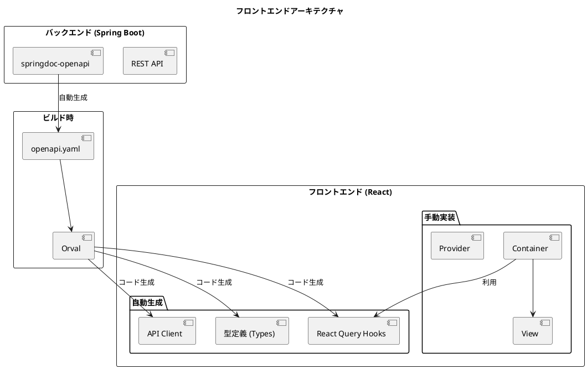
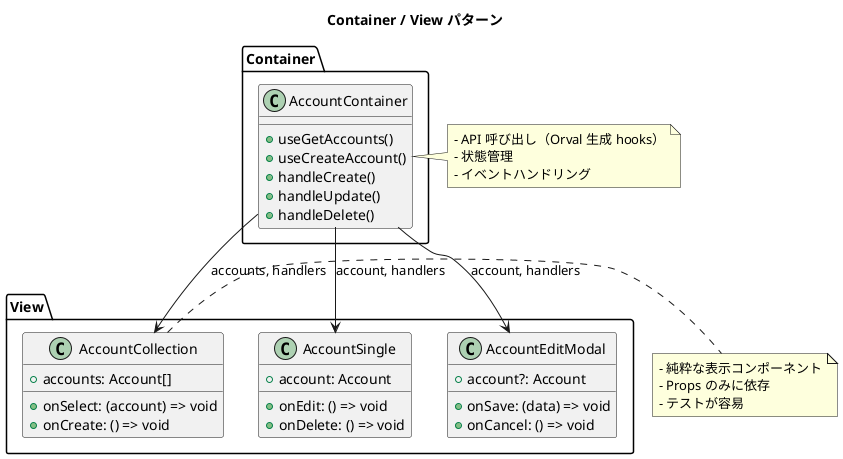
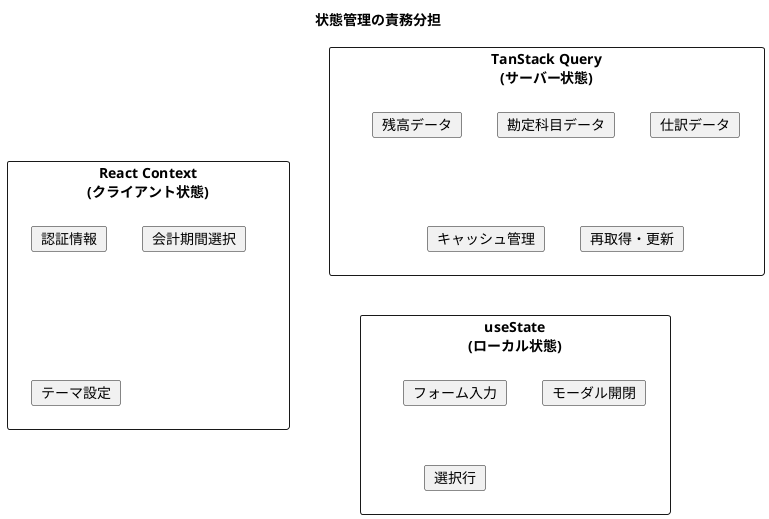
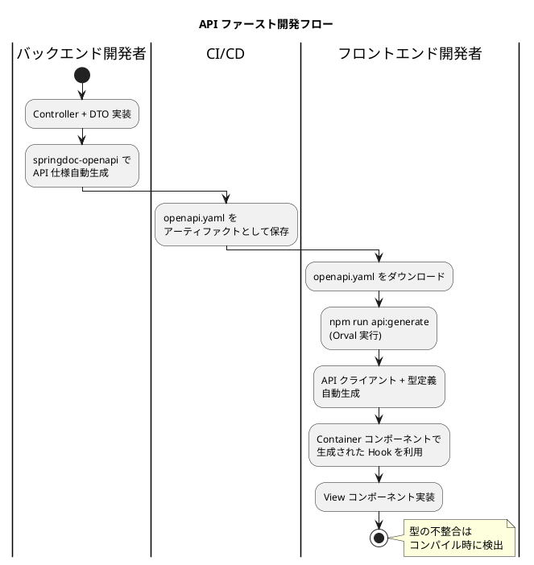

# 財務会計システムのケーススタディ（フロントエンド実装）- アウトライン

## 書籍概要

**タイトル案**: 財務会計システムのケーススタディ - React + TypeScript によるモダンフロントエンド開発

**対象読者**:
- React による Web アプリケーション開発経験者
- TypeScript を活用したフロントエンド開発に興味のあるエンジニア
- Container / View パターンを学びたい開発者
- OpenAPI / Orval による型安全な API 連携を学びたいエンジニア
- 財務会計システムの UI 実装に興味のあるエンジニア

**本書の特徴**:
- 実際の財務会計システムを題材にした実践的な内容
- Container / View パターンによる責務分離
- **OpenAPI + Orval による型安全な API クライアント自動生成**
- **TanStack Query（React Query）によるサーバー状態管理**
- TypeScript による型安全な開発
- 複式簿記・財務諸表の UI 実装パターン
- Cypress による E2E テスト

**執筆方針**:
- ダイアグラムは PlantUML を使う
- 実コード解説によりドキュメントからプロジェクトを再現できる構成にする
- バックエンド実装（本編）との連携を意識した設計
- **API ファースト開発**: バックエンドから自動生成された OpenAPI 仕様を基にフロントエンドを構築

**関連書籍**:
- 財務会計システムのケーススタディ - Java + Spring Boot によるバックエンド開発（本編）

---

## 第1部: 導入と基盤

### 第1章: プロジェクト概要

#### 1.1 フロントエンドアーキテクチャ概要
- Container / View パターン
- OpenAPI + Orval による API 連携
- TanStack Query によるサーバー状態管理
- React Context によるクライアント状態管理



#### 1.2 ディレクトリ構成
- src/components - コンテナコンポーネント
- src/views - プレゼンテーションコンポーネント
- src/providers - React Context プロバイダー
- **src/api - Orval 自動生成コード（API クライアント、型定義、Hooks）**
- src/hooks - カスタムフック

#### 1.3 技術スタック
- React 18 + TypeScript
- Vite によるビルド
- React Router による SPA ルーティング
- **Orval - OpenAPI から API クライアント自動生成**
- **TanStack Query (React Query) - サーバー状態管理**
- React Modal / React Tabs / React Icons
- Cypress による E2E テスト

#### 1.4 本書の構成
- 各章で扱う機能とテーマ
- バックエンド API との連携
- 本編（バックエンド）との対応関係

---

### 第2章: 開発環境の構築

#### 2.1 技術スタックの選定
- React + TypeScript を選んだ理由
- Vite の利点
- ESLint / Prettier による静的解析とフォーマット

#### 2.2 プロジェクト初期化
- Vite プロジェクトのセットアップ
- TypeScript 設定（tsconfig.json）
- ESLint / Prettier 設定

#### 2.3 依存パッケージ
- react-router-dom - ルーティング
- **@tanstack/react-query - サーバー状態管理**
- **orval - API クライアント生成（devDependencies）**
- **axios - HTTP クライアント**
- react-modal - モーダルダイアログ
- react-tabs - タブコンポーネント
- react-icons - アイコンライブラリ
- react-spinners - ローディングインジケータ
- dayjs - 日付操作
- decimal.js - 金額計算（精度保証）

#### 2.4 開発サーバー
- Vite 開発サーバーの設定
- 環境変数の管理（.env）
- バックエンド API へのプロキシ設定

#### 2.5 テスト環境
- Vitest による単体テスト
- Testing Library
- **MSW (Mock Service Worker) による API モック**
- Cypress による E2E テスト

---

### 第3章: OpenAPI と Orval による API 連携

#### 3.1 OpenAPI 仕様の取得

**バックエンドでの OpenAPI 生成（springdoc-openapi）**:

```java
// build.gradle
dependencies {
    implementation 'org.springdoc:springdoc-openapi-starter-webmvc-ui:2.3.0'
}
```

```yaml
# application.yml
springdoc:
  api-docs:
    path: /api-docs
  swagger-ui:
    path: /swagger-ui.html
```

**OpenAPI 仕様のダウンロード**:

```bash
# バックエンドサーバーから openapi.yaml を取得
curl http://localhost:8080/api-docs.yaml -o openapi.yaml
```

#### 3.2 Orval の設定

**orval.config.ts**:

```typescript
import { defineConfig } from 'orval';

export default defineConfig({
  accounting: {
    input: {
      target: './openapi.yaml',
    },
    output: {
      mode: 'tags-split',
      target: './src/api/generated',
      schemas: './src/api/model',
      client: 'react-query',
      httpClient: 'axios',
      clean: true,
      override: {
        mutator: {
          path: './src/api/axios-instance.ts',
          name: 'axiosInstance',
        },
        query: {
          useQuery: true,
          useMutation: true,
          signal: true,
        },
      },
    },
    hooks: {
      afterAllFilesWrite: 'prettier --write',
    },
  },
});
```

#### 3.3 Axios インスタンスの設定

**src/api/axios-instance.ts**:

```typescript
import axios, { AxiosRequestConfig } from 'axios';

export const axiosInstance = axios.create({
  baseURL: import.meta.env.VITE_API_BASE_URL || '/api',
  timeout: 30000,
});

// リクエストインターセプター（JWT トークン付与）
axiosInstance.interceptors.request.use((config) => {
  const token = localStorage.getItem('accessToken');
  if (token) {
    config.headers.Authorization = `Bearer ${token}`;
  }
  return config;
});

// レスポンスインターセプター（エラーハンドリング）
axiosInstance.interceptors.response.use(
  (response) => response,
  (error) => {
    if (error.response?.status === 401) {
      // 認証エラー時の処理
      localStorage.removeItem('accessToken');
      window.location.href = '/login';
    }
    return Promise.reject(error);
  }
);

// Orval 用のカスタムインスタンス
export const customInstance = <T>(config: AxiosRequestConfig): Promise<T> => {
  const source = axios.CancelToken.source();
  const promise = axiosInstance({
    ...config,
    cancelToken: source.token,
  }).then(({ data }) => data);

  // @ts-expect-error cancel property
  promise.cancel = () => {
    source.cancel('Query was cancelled');
  };

  return promise;
};

export default customInstance;
```

#### 3.4 API クライアントの生成

**package.json**:

```json
{
  "scripts": {
    "api:generate": "orval",
    "api:fetch": "curl http://localhost:8080/api-docs.yaml -o openapi.yaml && npm run api:generate"
  }
}
```

**生成されるファイル構成**:

```
src/api/
├── generated/                    # Orval 自動生成
│   ├── account/
│   │   └── account.ts           # 勘定科目 API hooks
│   ├── journal-entry/
│   │   └── journal-entry.ts     # 仕訳 API hooks
│   ├── balance/
│   │   └── balance.ts           # 残高 API hooks
│   └── ...
├── model/                        # 自動生成された型定義
│   ├── account.ts
│   ├── journalEntry.ts
│   ├── balance.ts
│   └── ...
└── axios-instance.ts            # 手動設定
```

#### 3.5 生成されたコードの利用例

**自動生成された Hook の使用**:

```typescript
// src/components/master/account/AccountContainer.tsx
import { useGetAccounts, useCreateAccount } from '@/api/generated/account/account';
import { AccountRequest } from '@/api/model';

export const AccountContainer: React.FC = () => {
  // 一覧取得（自動生成された React Query hook）
  const { data: accounts, isLoading, error } = useGetAccounts();

  // 登録（自動生成された mutation hook）
  const createMutation = useCreateAccount();

  const handleCreate = (request: AccountRequest) => {
    createMutation.mutate({ data: request }, {
      onSuccess: () => {
        // 成功時の処理
      },
    });
  };

  if (isLoading) return <Loading />;
  if (error) return <ErrorMessage error={error} />;

  return <AccountCollection accounts={accounts} onCreate={handleCreate} />;
};
```

#### 3.6 楽観的更新（Optimistic Update）

```typescript
import { useQueryClient } from '@tanstack/react-query';
import { useUpdateAccount, getGetAccountsQueryKey } from '@/api/generated/account/account';

export const useOptimisticAccountUpdate = () => {
  const queryClient = useQueryClient();
  const updateMutation = useUpdateAccount();

  return {
    update: (accountCode: string, data: AccountUpdateRequest) => {
      updateMutation.mutate(
        { accountCode, data },
        {
          // 楽観的更新
          onMutate: async (variables) => {
            await queryClient.cancelQueries({ queryKey: getGetAccountsQueryKey() });
            const previousAccounts = queryClient.getQueryData(getGetAccountsQueryKey());

            queryClient.setQueryData(getGetAccountsQueryKey(), (old: Account[]) =>
              old.map((account) =>
                account.accountCode === variables.accountCode
                  ? { ...account, ...variables.data }
                  : account
              )
            );

            return { previousAccounts };
          },
          onError: (err, variables, context) => {
            // エラー時にロールバック
            queryClient.setQueryData(getGetAccountsQueryKey(), context?.previousAccounts);
          },
          onSettled: () => {
            queryClient.invalidateQueries({ queryKey: getGetAccountsQueryKey() });
          },
        }
      );
    },
  };
};
```

---

### 第4章: アーキテクチャ設計

#### 4.1 Container / View パターン
- Container コンポーネントの役割（状態管理、API 連携）
- View コンポーネントの役割（表示ロジック）
- 責務分離の原則



#### 4.2 状態管理パターン

**サーバー状態 vs クライアント状態**:

| 種類 | 管理方法 | 例 |
|------|----------|-----|
| サーバー状態 | TanStack Query（Orval 生成） | 勘定科目一覧、仕訳データ |
| クライアント状態 | React Context | 認証情報、UI 状態、選択状態 |
| ローカル状態 | useState | フォーム入力、モーダル開閉 |



#### 4.3 API 連携パターン（Orval + TanStack Query）

**クエリのキャッシュ設定**:

```typescript
// src/main.tsx
import { QueryClient, QueryClientProvider } from '@tanstack/react-query';

const queryClient = new QueryClient({
  defaultOptions: {
    queries: {
      staleTime: 5 * 60 * 1000,      // 5分間はキャッシュを新鮮とみなす
      gcTime: 30 * 60 * 1000,        // 30分間キャッシュを保持
      retry: 1,                       // リトライ1回
      refetchOnWindowFocus: false,   // フォーカス時の再取得を無効化
    },
  },
});
```

#### 4.4 型安全性の確保

Orval により、バックエンドの DTO と完全に一致した型定義が自動生成されます。

```typescript
// 自動生成された型（src/api/model/account.ts）
export interface Account {
  accountCode: string;
  accountName: string;
  accountAbbr?: string;
  accountKana?: string;
  bsplType: 'B' | 'P';
  debitCreditType: '借' | '貸';
  elementType: '資産' | '負債' | '純資産' | '収益' | '費用';
  displayOrder: number;
  version: number;
}

export interface AccountRequest {
  accountCode: string;
  accountName: string;
  bsplType: 'B' | 'P';
  debitCreditType: '借' | '貸';
  elementType: string;
}
```

#### 4.5 財務会計特有の考慮事項
- 金額表示のフォーマット（3桁カンマ、単位）
- 貸借表示（借方/貸方の列配置）
- 会計期間の管理
- 権限による表示制御

---

## 第2部: 共通コンポーネント

### 第5章: アプリケーション基盤

#### 5.1 アプリケーションエントリポイント

**App.tsx の構成**:

```typescript
import { QueryClientProvider } from '@tanstack/react-query';
import { ReactQueryDevtools } from '@tanstack/react-query-devtools';
import { queryClient } from './queryClient';
import { AuthProvider } from './providers/AuthProvider';
import { RouteConfig } from './RouteConfig';

export const App: React.FC = () => (
  <QueryClientProvider client={queryClient}>
    <AuthProvider>
      <RouteConfig />
    </AuthProvider>
    <ReactQueryDevtools initialIsOpen={false} />
  </QueryClientProvider>
);
```

#### 5.2 認証ガード
- RouteAuthGuard コンポーネント
- ロールベースアクセス制御
- 経理担当者 / 管理者 / 監査者のロール
- リダイレクト処理

#### 5.3 レイアウト
- SiteLayout コンポーネント
- ナビゲーション（会計メニュー構成）
- ヘッダー（会計期間表示、ユーザー情報）
- フッター

#### 5.4 共通コンポーネント
- ErrorBoundary
- Message コンポーネント
- Loading インジケータ
- MoneyDisplay（金額表示）
- DateDisplay（日付表示）

---

### 第6章: モーダル・フォームパターン

#### 6.1 編集モーダル
- EditModal パターン
- フォーム状態管理
- バリデーション（金額、日付、必須チェック）

#### 6.2 検索モーダル
- SearchModal パターン
- 期間検索（会計期間指定）
- 勘定科目検索

#### 6.3 選択モーダル
- AccountSelectModal（勘定科目選択）
- TaxTypeSelectModal（課税区分選択）
- 階層構造からの選択

#### 6.4 確認モーダル
- ConfirmModal パターン
- 仕訳承認確認
- 削除確認

---

### 第7章: 財務会計共通コンポーネント

#### 7.1 金額入力コンポーネント
- MoneyInput
- 3桁カンマ表示
- 負数対応
- decimal.js による精度保証

#### 7.2 勘定科目選択コンポーネント
- AccountSelector
- 階層表示（ツリービュー）
- 検索・フィルタ機能
- B/S・P/L 区分表示
- **Orval 生成の useGetAccounts を利用**

#### 7.3 仕訳明細入力コンポーネント
- JournalDetailInput
- 借方/貸方入力フォーム
- 行追加・削除
- 貸借バランス表示

#### 7.4 期間選択コンポーネント
- PeriodSelector
- 会計期間選択
- 月次/日次切り替え
- カレンダー連携

---

## 第3部: マスタ管理機能

### 第8章: 認証・ユーザー管理

#### 8.1 認証フロー
- ログイン画面の実装
- 認証状態の管理
- ログアウト処理
- **useLogin / useLogout（Orval 生成）の利用**

#### 8.2 AuthProvider
- 認証コンテキスト
- JWT トークン管理
- 自動ログイン（トークン永続化）
- 権限情報の保持

#### 8.3 ユーザー管理
- UserContainer
- UserCollection / UserSingle
- ユーザー CRUD
- ロール割り当て
- **useGetUsers / useCreateUser / useUpdateUser（Orval 生成）**

---

### 第9章: 勘定科目マスタ

#### 9.1 勘定科目一覧
- AccountContainer
- AccountCollection
- 階層構造表示（ツリービュー）
- B/S・P/L フィルタ
- **useGetAccounts（Orval 生成）**

#### 9.2 勘定科目詳細
- AccountSingle
- AccountEditModal
- 科目属性（BS区分、貸借区分、要素区分）
- 表示順管理
- **useGetAccount / useUpdateAccount（Orval 生成）**

#### 9.3 勘定科目構成
- AccountStructureContainer
- チルダ連結パスの可視化
- 親子関係の編集

#### 9.4 カスタムフック設計
- useAccountTree（階層構造の構築）
- useAccountFilter（フィルタリング）

---

### 第10章: 会計期間・課税マスタ

#### 10.1 会計期間管理
- AccountingPeriodContainer
- 年度一覧・詳細
- 期間の開始/終了
- 締め状態管理
- **useGetAccountingPeriods（Orval 生成）**

#### 10.2 課税取引マスタ
- TaxTypeContainer
- 課税区分一覧
- 税率設定
- 適用期間

#### 10.3 消費税コードマスタ
- TaxCodeContainer
- 消費税コード一覧
- 税率・経過措置対応

---

## 第4部: 仕訳管理機能

### 第11章: 仕訳入力

#### 11.1 仕訳入力画面
- JournalEntryContainer
- JournalEntryForm
- 日付・摘要入力
- 明細行入力
- **useCreateJournalEntry（Orval 生成）**

#### 11.2 仕訳明細入力
- JournalDetailForm
- 借方/貸方の入力
- 勘定科目選択（モーダル連携）
- 消費税自動計算

#### 11.3 貸借バランス検証
- BalanceValidator
- リアルタイム貸借チェック
- エラー表示
- 保存可否制御

#### 11.4 仕訳テンプレート
- JournalTemplateContainer
- よく使う仕訳の登録
- テンプレートからの入力

---

### 第12章: 仕訳一覧・検索

#### 12.1 仕訳一覧
- JournalListContainer
- JournalCollection
- ページネーション
- ソート機能
- **useGetJournalEntries（Orval 生成）**

#### 12.2 仕訳検索
- JournalSearchModal
- 期間検索
- 勘定科目検索
- 金額範囲検索
- 摘要キーワード検索
- **useSearchJournalEntries（Orval 生成）**

#### 12.3 仕訳詳細
- JournalSingle
- 仕訳伝票表示
- 明細一覧表示
- 編集・削除操作
- **useGetJournalEntry / useDeleteJournalEntry（Orval 生成）**

#### 12.4 仕訳一括登録
- JournalUploadContainer
- JournalUploadModal
- CSV インポート
- エラーハンドリング

---

### 第13章: 仕訳承認・ワークフロー

#### 13.1 承認待ち一覧
- JournalApprovalContainer
- 承認待ち仕訳一覧
- 承認/差戻し操作
- **useGetPendingApprovals / useApproveJournal（Orval 生成）**

#### 13.2 承認ワークフロー
- ApprovalWorkflowContainer
- ステータス遷移表示
- 承認履歴

#### 13.3 一括承認
- BulkApprovalContainer
- 複数仕訳の一括承認
- 承認コメント

---

## 第5部: 残高管理機能

### 第14章: 日次残高照会

#### 14.1 日次残高一覧
- DailyBalanceContainer
- DailyBalanceCollection
- 日付選択
- 勘定科目フィルタ
- **useGetDailyBalances（Orval 生成）**

#### 14.2 残高推移グラフ
- BalanceTrendChart
- 日次推移グラフ
- 複数科目比較

#### 14.3 勘定科目別明細
- AccountDailyDetailContainer
- 日別の借方/貸方/残高表示
- 仕訳へのリンク

---

### 第15章: 月次残高照会

#### 15.1 月次残高一覧
- MonthlyBalanceContainer
- MonthlyBalanceCollection
- 月選択
- 前月比較
- **useGetMonthlyBalances（Orval 生成）**

#### 15.2 月次推移表
- MonthlyTrendTable
- 12ヶ月推移表示
- 累計表示

#### 15.3 勘定科目別月次推移
- AccountMonthlyTrendContainer
- 月別の借方/貸方/残高表示
- グラフ表示

---

### 第16章: 試算表

#### 16.1 合計残高試算表
- TrialBalanceContainer
- 借方合計/貸方合計/残高
- B/S・P/L 区分表示
- **useGetTrialBalance（Orval 生成）**

#### 16.2 勘定科目別試算表
- AccountTrialBalanceContainer
- 科目別の月次推移
- 前期比較

#### 16.3 部門別試算表
- DepartmentTrialBalanceContainer
- 部門別残高表示
- 部門間比較

---

## 第6部: 財務諸表機能

### 第17章: 貸借対照表

#### 17.1 貸借対照表表示
- BalanceSheetContainer
- BalanceSheetView
- 勘定式レイアウト
- 報告式レイアウト
- **useGetBalanceSheet（Orval 生成）**

#### 17.2 期間比較
- BalanceSheetComparisonContainer
- 前期/当期比較
- 増減表示

#### 17.3 構成比分析
- BalanceSheetAnalysisContainer
- 構成比計算
- グラフ表示

#### 17.4 帳票出力
- BalanceSheetExportContainer
- PDF 出力
- Excel 出力

---

### 第18章: 損益計算書

#### 18.1 損益計算書表示
- ProfitLossContainer
- ProfitLossView
- 段階利益表示（売上総利益、営業利益、経常利益、当期純利益）
- **useGetProfitLoss（Orval 生成）**

#### 18.2 期間比較
- ProfitLossComparisonContainer
- 前期/当期比較
- 月次比較

#### 18.3 予実比較
- BudgetActualComparisonContainer
- 予算対比表示
- 差異分析

#### 18.4 帳票出力
- ProfitLossExportContainer
- PDF / Excel 出力

---

### 第19章: キャッシュフロー計算書

#### 19.1 キャッシュフロー計算書表示
- CashFlowContainer
- CashFlowView
- 営業/投資/財務活動区分
- **useGetCashFlowStatement（Orval 生成）**

#### 19.2 直接法/間接法
- DirectMethodContainer
- IndirectMethodContainer
- 表示切替

---

## 第7部: システム機能

### 第20章: 決算処理

#### 20.1 月次締め処理
- MonthlyClosingContainer
- 締め実行
- 締め解除
- ステータス管理
- **useCloseMonth / useReopenMonth（Orval 生成）**

#### 20.2 年次決算処理
- YearEndClosingContainer
- 決算整理仕訳
- 繰越処理
- 次期繰越

#### 20.3 決算整理仕訳
- ClosingJournalContainer
- 減価償却費計上
- 引当金計上
- 経過勘定

---

### 第21章: ダウンロード・出力機能

#### 21.1 ダウンロード画面
- DownloadContainer
- ダウンロード対象一覧
- 出力形式選択
- **useDownloadJournals / useDownloadMasters（Orval 生成）**

#### 21.2 仕訳データ出力
- JournalExportContainer
- CSV / Excel 出力
- 期間指定

#### 21.3 マスタデータ出力
- MasterExportContainer
- 勘定科目一覧出力
- 各種マスタ出力

---

### 第22章: 監査・履歴機能

#### 22.1 操作履歴画面
- AuditLogContainer
- 操作履歴一覧
- 検索・フィルタ
- **useGetAuditLogs（Orval 生成）**

#### 22.2 仕訳変更履歴
- JournalHistoryContainer
- 仕訳の変更履歴
- 差分表示

#### 22.3 ログイン履歴
- LoginHistoryContainer
- ログイン/ログアウト履歴
- 不正アクセス検知

---

## 第8部: テストと品質

### 第23章: 単体テスト

#### 23.1 Vitest 設定
- vite.config.ts
- Testing Library 設定

#### 23.2 コンポーネントテスト
- render / screen
- fireEvent / userEvent
- MoneyInput のテスト例

#### 23.3 カスタムフックテスト
- renderHook
- act
- useJournalEntry のテスト例

#### 23.4 API モックテスト（MSW）

```typescript
// src/mocks/handlers.ts
import { http, HttpResponse } from 'msw';
import { Account } from '@/api/model';

export const handlers = [
  http.get('/api/accounts', () => {
    return HttpResponse.json<Account[]>([
      {
        accountCode: '111',
        accountName: '現金預金',
        bsplType: 'B',
        debitCreditType: '借',
        elementType: '資産',
        displayOrder: 1,
        version: 1,
      },
    ]);
  }),
];
```

#### 23.5 金額計算テスト
- decimal.js を使った精度テスト
- 貸借バランステスト

---

### 第24章: E2E テスト

#### 24.1 Cypress 設定
- cypress.config.ts
- サポートファイル
- カスタムコマンド

#### 24.2 認証テスト
- auth/ ディレクトリ
- ログイン/ログアウトテスト

#### 24.3 マスタ管理テスト
- master/ ディレクトリ
- 勘定科目 CRUD テスト
- 会計期間テスト

#### 24.4 仕訳管理テスト
- journal/ ディレクトリ
- 仕訳入力テスト
- 貸借バランステスト
- 承認フローテスト

#### 24.5 財務諸表テスト
- statement/ ディレクトリ
- 貸借対照表表示テスト
- 損益計算書表示テスト

#### 24.6 決算処理テスト
- closing/ ディレクトリ
- 月次締めテスト
- 年次決算テスト

---

## 付録

### 付録A: 技術スタック一覧

| カテゴリ | 技術 | バージョン | 用途 |
|---------|------|-----------|------|
| 言語 | TypeScript | 5.5 | 型安全な開発 |
| フレームワーク | React | 18.3 | UI ライブラリ |
| ルーティング | React Router | 6.26 | SPA ルーティング |
| ビルドツール | Vite | 5.4 | 高速ビルド |
| **API クライアント生成** | **Orval** | **7.0** | **OpenAPI → TypeScript** |
| **HTTP クライアント** | **Axios** | **1.7** | **HTTP リクエスト** |
| **サーバー状態管理** | **TanStack Query** | **5.0** | **キャッシュ・再取得** |
| テスト | Vitest | 2.0 | 単体テスト |
| E2E テスト | Cypress | 14.5 | E2E テスト |
| **API モック** | **MSW** | **2.0** | **テスト用モック** |
| 日付操作 | dayjs | 1.11 | 日付フォーマット |
| 金額計算 | decimal.js | 10.4 | 精度保証 |
| UI ライブラリ | react-modal, react-tabs, react-icons | - | UI 部品 |

### 付録B: ディレクトリ構成

```
src/
├── api/                          # API 関連
│   ├── generated/                # Orval 自動生成（編集禁止）
│   │   ├── account/
│   │   │   └── account.ts        # 勘定科目 API hooks
│   │   ├── journal-entry/
│   │   │   └── journal-entry.ts  # 仕訳 API hooks
│   │   ├── balance/
│   │   │   └── balance.ts        # 残高 API hooks
│   │   ├── statement/
│   │   │   └── statement.ts      # 財務諸表 API hooks
│   │   └── ...
│   ├── model/                    # Orval 自動生成（型定義）
│   │   ├── account.ts
│   │   ├── journalEntry.ts
│   │   ├── balance.ts
│   │   └── ...
│   └── axios-instance.ts         # Axios 設定（手動）
│
├── components/                   # コンテナコンポーネント
│   ├── application/              # アプリケーション基盤
│   ├── master/                   # マスタ管理
│   │   ├── account/
│   │   ├── accountingPeriod/
│   │   ├── taxType/
│   │   └── user/
│   ├── journal/                  # 仕訳管理
│   │   ├── entry/
│   │   ├── list/
│   │   ├── approval/
│   │   └── upload/
│   ├── balance/                  # 残高管理
│   │   ├── daily/
│   │   ├── monthly/
│   │   └── trial/
│   ├── statement/                # 財務諸表
│   │   ├── balanceSheet/
│   │   ├── profitLoss/
│   │   └── cashFlow/
│   ├── closing/                  # 決算処理
│   │   ├── monthly/
│   │   └── yearly/
│   └── system/                   # システム機能
│       ├── audit/
│       ├── download/
│       └── history/
│
├── views/                        # プレゼンテーションコンポーネント
│   └── (components と同構成)
│
├── providers/                    # React Context プロバイダー
│   └── AuthProvider.tsx          # 認証のみ Context で管理
│
├── hooks/                        # カスタムフック
│   ├── useAccountTree.ts         # 階層構造の構築
│   ├── useBalanceValidation.ts   # 貸借検証
│   └── ...
│
├── utils/                        # ユーティリティ
│   ├── money.ts                  # 金額計算
│   ├── date.ts                   # 日付操作
│   └── format.ts                 # フォーマット
│
├── mocks/                        # MSW モック（テスト用）
│   ├── handlers.ts
│   └── server.ts
│
├── queryClient.ts                # TanStack Query 設定
├── RouteConfig.tsx               # ルーティング設定
└── App.tsx
```

### 付録C: Orval 設定詳細

**orval.config.ts 完全版**:

```typescript
import { defineConfig } from 'orval';

export default defineConfig({
  accounting: {
    input: {
      target: './openapi.yaml',
      validation: true,
    },
    output: {
      mode: 'tags-split',
      target: './src/api/generated',
      schemas: './src/api/model',
      client: 'react-query',
      httpClient: 'axios',
      clean: true,
      prettier: true,
      override: {
        mutator: {
          path: './src/api/axios-instance.ts',
          name: 'customInstance',
        },
        query: {
          useQuery: true,
          useMutation: true,
          useSuspenseQuery: false,
          signal: true,
          options: {
            staleTime: 5 * 60 * 1000,
          },
        },
        operations: {
          // 特定のエンドポイントの設定をオーバーライド
          getAccounts: {
            query: {
              options: {
                staleTime: 10 * 60 * 1000,  // マスタは長めにキャッシュ
              },
            },
          },
        },
      },
    },
    hooks: {
      afterAllFilesWrite: 'prettier --write',
    },
  },
});
```

### 付録D: コンポーネント一覧

#### マスタ管理
- AccountContainer / AccountCollection / AccountSingle
- AccountStructureContainer / AccountStructureCollection
- AccountingPeriodContainer / AccountingPeriodCollection / AccountingPeriodSingle
- TaxTypeContainer / TaxTypeCollection / TaxTypeSingle
- TaxCodeContainer / TaxCodeCollection / TaxCodeSingle
- UserContainer / UserCollection / UserSingle

#### 仕訳管理
- JournalEntryContainer / JournalEntryForm
- JournalListContainer / JournalCollection / JournalSingle
- JournalSearchModal
- JournalApprovalContainer / JournalApprovalCollection
- JournalTemplateContainer / JournalTemplateCollection
- JournalUploadContainer / JournalUploadModal

#### 残高管理
- DailyBalanceContainer / DailyBalanceCollection
- MonthlyBalanceContainer / MonthlyBalanceCollection
- TrialBalanceContainer / TrialBalanceView
- BalanceTrendChart

#### 財務諸表
- BalanceSheetContainer / BalanceSheetView
- BalanceSheetComparisonContainer
- ProfitLossContainer / ProfitLossView
- ProfitLossComparisonContainer
- CashFlowContainer / CashFlowView

#### 決算処理
- MonthlyClosingContainer
- YearEndClosingContainer
- ClosingJournalContainer

#### システム機能
- AuditLogContainer / AuditLogCollection
- JournalHistoryContainer
- DownloadContainer

### 付録E: 生成される API Hooks 一覧

| カテゴリ | Hook 名 | 用途 |
|---------|---------|------|
| 認証 | useLogin | ログイン |
| 認証 | useLogout | ログアウト |
| 勘定科目 | useGetAccounts | 一覧取得 |
| 勘定科目 | useGetAccount | 詳細取得 |
| 勘定科目 | useCreateAccount | 登録 |
| 勘定科目 | useUpdateAccount | 更新 |
| 勘定科目 | useDeleteAccount | 削除 |
| 仕訳 | useGetJournalEntries | 一覧取得 |
| 仕訳 | useGetJournalEntry | 詳細取得 |
| 仕訳 | useCreateJournalEntry | 登録 |
| 仕訳 | useUpdateJournalEntry | 更新 |
| 仕訳 | useDeleteJournalEntry | 削除 |
| 仕訳 | useSearchJournalEntries | 検索 |
| 承認 | useGetPendingApprovals | 承認待ち一覧 |
| 承認 | useApproveJournal | 承認 |
| 承認 | useRejectJournal | 差戻し |
| 残高 | useGetDailyBalances | 日次残高取得 |
| 残高 | useGetMonthlyBalances | 月次残高取得 |
| 残高 | useGetTrialBalance | 試算表取得 |
| 財務諸表 | useGetBalanceSheet | 貸借対照表取得 |
| 財務諸表 | useGetProfitLoss | 損益計算書取得 |
| 財務諸表 | useGetCashFlowStatement | キャッシュフロー取得 |
| 決算 | useCloseMonth | 月次締め |
| 決算 | useReopenMonth | 月次締め解除 |
| 監査 | useGetAuditLogs | 監査ログ取得 |

---

## 執筆計画

### 想定ページ数
- 本文: 約300〜340ページ
- 付録: 約40ページ
- 合計: 約340〜380ページ

### 章ごとの想定ページ数

| 部 | 章数 | 想定ページ |
|----|------|-----------|
| 第1部: 導入と基盤 | 4章 | 55ページ |
| 第2部: 共通コンポーネント | 3章 | 35ページ |
| 第3部: マスタ管理機能 | 3章 | 35ページ |
| 第4部: 仕訳管理機能 | 3章 | 40ページ |
| 第5部: 残高管理機能 | 3章 | 35ページ |
| 第6部: 財務諸表機能 | 3章 | 35ページ |
| 第7部: システム機能 | 3章 | 30ページ |
| 第8部: テストと品質 | 2章 | 30ページ |
| 付録 | 5項目 | 40ページ |

---

## 本書のポイント

### 1. OpenAPI + Orval による型安全な API 連携
バックエンドから自動生成された OpenAPI 仕様を基に、型定義と API クライアントを自動生成。手動での型定義や API クライアント実装が不要に。

### 2. TanStack Query によるサーバー状態管理
キャッシュ、再取得、楽観的更新を宣言的に管理。従来の Redux や Context による API 状態管理の複雑さを解消。

### 3. Container / View パターン
Container コンポーネントと View コンポーネントの責務分離を徹底し、テスタビリティと保守性を向上。

### 4. 財務会計特有のUI実装
- 金額入力（3桁カンマ、精度保証）
- 貸借表示（借方/貸方の配置）
- 仕訳入力（複式簿記の UI）
- 財務諸表（勘定式/報告式レイアウト）

### 5. MSW による API モック
テスト時に実際の API サーバーなしで動作確認が可能。Orval 生成の型定義を活用した型安全なモック。

### 6. E2E テスト重視
Cypress による E2E テストで、仕訳入力から財務諸表表示までの一連の業務フローをテスト。

---

## バックエンド（本編）との対応関係

| フロントエンド章 | バックエンド章 | 連携機能 |
|----------------|--------------|----------|
| 第3章 OpenAPI/Orval | - | API 仕様連携 |
| 第8章 認証 | 第25章 認証・認可 | JWT 認証 |
| 第9章 勘定科目 | 第5章 勘定科目マスタ | 勘定科目 CRUD |
| 第10章 会計期間・課税 | 第4章 ER モデリング | マスタ管理 |
| 第11-13章 仕訳 | 第9-15章 仕訳管理 | 仕訳 CRUD、承認 |
| 第14-16章 残高 | 第16-17章 残高更新 | 残高照会 |
| 第17-19章 財務諸表 | 第18-19章 財務諸表 | 帳票表示 |
| 第20章 決算 | 第14章 決算処理 | 締め処理 |
| 第22章 監査 | 第26章 監査ログ | 履歴照会 |

---

## API ファースト開発フロー


