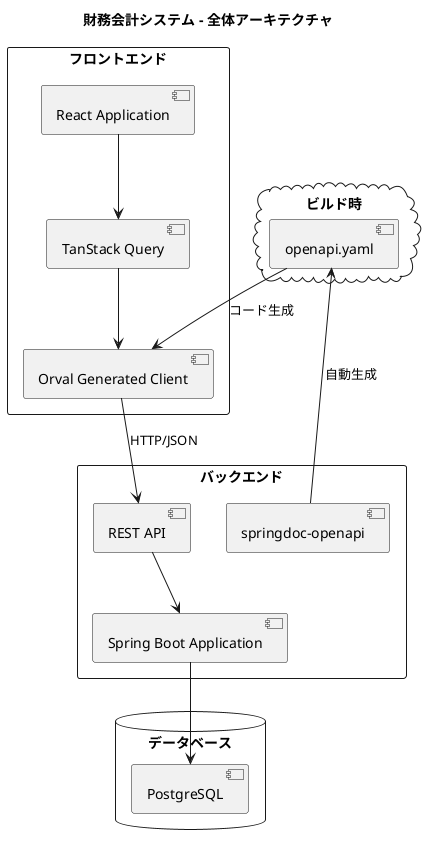

# 財務会計システムのケーススタディ

エンタープライズ財務会計アプリケーション開発の実践ガイド

---

## 概要

本シリーズは、財務会計システムの開発を題材に、バックエンドからフロントエンドまで一貫した実践的な開発プロセスを学べる技術書です。テスト駆動開発（TDD）、ドメイン駆動設計（DDD）、モダンフロントエンド開発の手法を、実際のシステム構築を通じて習得できます。

---

## 書籍一覧

### バックエンド編

**[財務会計システムのケーススタディ（Java版）](backend/chapter00.md)**

Java + Spring Boot によるエンタープライズ財務会計アプリケーション開発

| 項目 | 内容 |
|------|------|
| 技術スタック | Java 25, Spring Boot 4.x, MyBatis, PostgreSQL |
| 主なテーマ | TDD、DDD、ヘキサゴナルアーキテクチャ |
| 章数 | 全32章 |

**主な内容:**
- テスト駆動開発によるデータベース設計
- 貧血ドメインモデルからリッチドメインモデルへの進化
- 複式簿記・仕訳・財務諸表の業務ロジック実装
- イベントソーシング、CQRS パターン

---

### フロントエンド編

**[財務会計システムのケーススタディ（React版）](frontend/chapter00.md)**

React + TypeScript によるモダンフロントエンド開発

| 項目 | 内容 |
|------|------|
| 技術スタック | React 18, TypeScript, Vite, TanStack Query |
| 主なテーマ | Container/View パターン、OpenAPI + Orval |
| 章数 | 全24章 |

**主な内容:**
- OpenAPI + Orval による型安全な API 連携
- TanStack Query によるサーバー状態管理
- 財務会計特有の UI 実装（金額入力、仕訳入力、財務諸表）
- Cypress による E2E テスト

---

## システム全体像

---

## 対象読者

- Java / React による Web アプリケーション開発経験者
- エンタープライズシステム開発に興味のあるエンジニア
- TDD / DDD を実践したい開発者
- 財務会計システムの仕組みを理解したい方

---

## 学習の進め方

### 推奨順序

1. **バックエンド編 第1部〜第3部** - 基盤とデータモデリング
2. **フロントエンド編 第1部〜第2部** - 基盤と共通コンポーネント
3. **バックエンド編 第4部〜第6部** - 業務機能の実装
4. **フロントエンド編 第3部〜第6部** - 業務画面の実装
5. **両編のテスト・品質章** - テスト戦略と品質保証

### 並行学習

バックエンドとフロントエンドを並行して学習する場合は、以下の対応関係を参考にしてください。

| 機能 | バックエンド | フロントエンド |
|------|-------------|---------------|
| 認証 | 第25章 | 第8章 |
| 勘定科目 | 第9章 | 第9章 |
| 仕訳管理 | 第13-15章 | 第11-13章 |
| 残高管理 | 第16-18章 | 第14-16章 |
| 財務諸表 | 第19-21章 | 第17-19章 |
| テスト | 第22章 | 第23-24章 |

---

## 関連リソース

- [GitHub リポジトリ](https://github.com/k2works/case-study-accounting) - ソースコード
