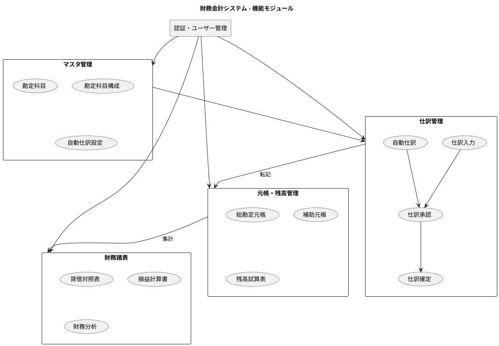
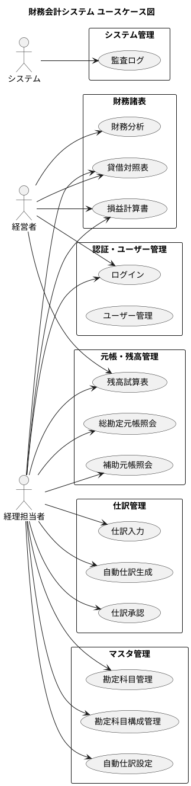
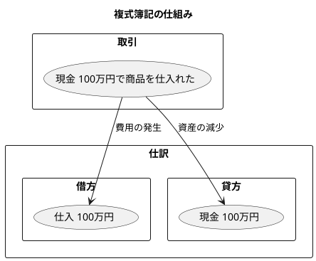
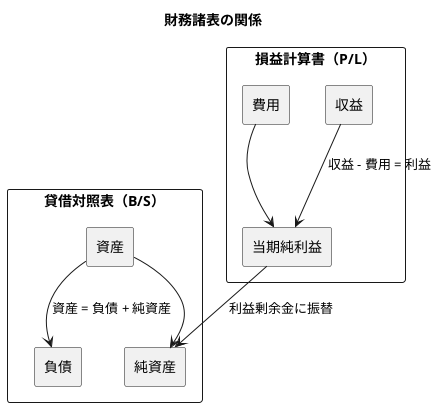

# 財務会計システムのケーススタディ（Java版）

Java + Spring Boot によるエンタープライズ財務会計アプリケーション開発

---

## 本書について

本書は、テスト駆動開発（TDD）の原則をデータベース設計に応用し、小さな要求から始めて財務会計システムを段階的に育てていく実践的なプロセスを追体験できる開発ガイドです。エクストリームプログラミング（XP）の価値観に基づき、貧血ドメインモデルからリッチドメインモデルへの進化過程を学びます。

### 対象読者

- Java による Web アプリケーション開発経験者
- エンタープライズシステム開発に興味のあるエンジニア
- TDD/XP を実践したい開発者
- ドメイン駆動設計（DDD）を学びたいエンジニア
- 財務会計システムの仕組みを理解したい方

---

## 目次

### 第1部: 導入と基盤

| 章 | タイトル | 概要                         |
|----|---------|----------------------------|
| [第1章](chapter01.md) | プロジェクト概要 | 財務会計システムの業務概要、システム全体像、開発手法 |
| [第2章](chapter02.md) | 開発環境の構築 | 技術スタックの選定、バックエンド環境、CI/CD   |
| [第3章](chapter03.md) | アーキテクチャ設計 | ヘキサゴナルアーキテクチャ、依存関係、パッケージ構造 |

### 第2部: データモデリング

| 章 | タイトル | 概要 |
|----|---------|------|
| [第4章](chapter04.md) | データモデル設計の基礎 | ER モデリング、全体データモデル、JIG-ERD |
| [第5章](chapter05.md) | マスタデータモデル | 勘定科目マスタ、勘定科目構成マスタ |
| [第6章](chapter06.md) | トランザクションデータモデル | 仕訳テーブル、自動仕訳テーブル |
| [第7章](chapter07.md) | ドメインモデルとデータモデルの対応 | 貧血からリッチモデルへ、MyBatis マッピング |
| [第8章](chapter08.md) | ドメインに適したデータの作成 | テストデータ設計、テストフィクスチャ |

### 第3部: マスタ管理機能

| 章 | タイトル | 概要 |
|----|---------|------|
| [第9章](chapter09.md) | 勘定科目マスタ | 勘定科目種別、CRUD 操作、階層構造 |
| [第10章](chapter10.md) | 勘定科目構成マスタ | 科目体系、親子関係、バリデーション |
| [第11章](chapter11.md) | 課税取引マスタ | 課税区分、税率管理、消費税計算 |
| [第12章](chapter12.md) | 自動仕訳設定 | 仕訳テンプレート、自動仕訳ルール |

### 第4部: 仕訳管理機能

| 章 | タイトル | 概要 |
|----|---------|------|
| [第13章](chapter13.md) | 仕訳入力 | 仕訳ワークフロー、借方・貸方、仕訳ルール |
| [第14章](chapter14.md) | 自動仕訳 | 自動仕訳生成、ドメインイベント、仕訳パターン |
| [第15章](chapter15.md) | 仕訳承認・確定 | 承認ワークフロー、仕訳確定、取消処理 |

### 第5部: 元帳・残高管理機能

| 章 | タイトル | 概要 |
|----|---------|------|
| [第16章](chapter16.md) | 総勘定元帳 | 元帳管理、転記処理、勘定別集計 |
| [第17章](chapter17.md) | 補助元帳 | 補助科目管理、補助元帳照会 |
| [第18章](chapter18.md) | 残高試算表 | 勘定科目別残高、試算表生成、残高検証 |

### 第6部: 財務諸表機能

| 章 | タイトル | 概要 |
|----|---------|------|
| [第19章](chapter19.md) | 貸借対照表 | B/S 生成、資産・負債・純資産の集計 |
| [第20章](chapter20.md) | 損益計算書 | P/L 生成、収益・費用の集計、当期純利益 |
| [第21章](chapter21.md) | 財務分析 | 財務指標、経営分析、予算管理 |

### 第7部: 品質とリファクタリング

| 章 | タイトル | 概要 |
|----|---------|------|
| [第22章](chapter22.md) | テスト戦略 | テストピラミッド、TestContainer、受け入れテスト |
| [第23章](chapter23.md) | 継続的リファクタリング | 値オブジェクト、メソッド抽出、ドメインサービス |
| [第24章](chapter24.md) | アーキテクチャの検証 | ArchUnit、JIG、品質メトリクス |

### 第8部: 運用と発展

| 章 | タイトル | 概要                                      |
|----|---------|-----------------------------------------|
| [第25章](chapter25.md) | 非機能要件 1  | 認証・ユーザー管理、 認証ユースケース、Spring Security、JWT |
| [第26章](chapter26.md) | 非機能要件 2 | データダウンロード機能                      |
| [第27章](chapter27.md) | 非機能要件 3 | 監査ログとトレーサビリティ、操作履歴、変更追跡、コンプライアンス        |
| [第28章](chapter28.md) | リリース管理 | バージョニング、CI/CD、JIG アーカイブ                 |
| [第29章](chapter29.md) | 今後の展望 | 機能拡張、アーキテクチャ進化、AI/ML 統合                 |

### 第9部: 高度なトピック

| 章 | タイトル | 概要 |
|----|---------|------|
| [第30章](chapter30.md) | イベントソーシング | CQRS パターン、イベントストア、リプレイ |
| [第31章](chapter31.md) | 境界付けられたコンテキスト | DDD 戦略的設計、コンテキストマップ |

---

## 技術スタック

| カテゴリ | 技術 |
|---------|------|
| 言語 | Java 25 |
| フレームワーク | Spring Boot 4.x |
| ORM | MyBatis |
| ビルド | Gradle |
| データベース | PostgreSQL / MySQL |
| マイグレーション | Flyway |
| テスト | JUnit 5, Testcontainers |
| ドキュメント | JIG, JIG-ERD |
| 品質管理 | SonarQube, ArchUnit, Checkstyle, PMD, SpotBugs |

---

## システム概要図

---

## ユースケース図

---

## 本書のポイント

1. **TDD ベース** - テスト駆動開発によるデータベース設計の実践
2. **データモデリング重視** - ER 設計からドメインモデルへの対応まで体系的に解説
3. **段階的な成長** - 貧血ドメインモデルからリッチドメインモデルへの進化過程を追体験
4. **会計知識の獲得** - 複式簿記、仕訳、財務諸表の基礎から応用まで
5. **XP プラクティス** - 小さなコミット、継続的リファクタリングの実践
6. **高度なパターン** - イベントソーシング、CQRS、境界付けられたコンテキスト
7. **ツール活用** - JIG、JIG-ERD、ArchUnit など Java エコシステムのツールを紹介

---

## 財務会計の基礎

### 複式簿記とは

複式簿記は、すべての取引を「借方」と「貸方」の両面から記録する記帳法です。これにより、取引の二面性（原因と結果）を正確に把握できます。

### 勘定科目の5分類

| 分類 | 説明 | 例 |
|------|------|-----|
| 資産 (Asset) | 会社が所有する財産 | 現金、売掛金、棚卸資産 |
| 負債 (Liability) | 会社が負っている債務 | 買掛金、借入金、未払金 |
| 純資産 (Equity) | 資産から負債を引いた正味財産 | 資本金、利益剰余金 |
| 収益 (Revenue) | 事業活動による収入 | 売上高、受取利息 |
| 費用 (Expense) | 事業活動による支出 | 仕入高、給与、家賃 |

### 財務諸表

---

## 関連リソース

- [GitHub リポジトリ](https://github.com/k2works/case-study-accounting) - ソースコード
- [実践データベース設計：TDDで育てる財務会計システム](../wiki/記事/データベース/実践データベース設計/財務会計/Java.md) - 原典

---

## ソースファイルとの対応

本書の各章は、以下のソースファイルの内容を基に構成されています。

| 部 | 章 | 対応する原典の章 |
|----|----|--------------------|
| 第1部 | 第1〜3章 | 第0章：環境構築（拡張） |
| 第2部 | 第4〜8章 | 第1章、第8章 |
| 第3部 | 第9〜11章 | 第1章（機能実装） |
| 第4部 | 第12〜14章 | 第2章 |
| 第5部 | 第15〜17章 | 第3章 |
| 第6部 | 第18〜20章 | 第4章 |
| 第7部 | 第21〜23章 | 新規 |
| 第8部 | 第24〜28章 | 第6章、新規 |
| 第9部 | 第29〜30章 | 第7章、第9章 |
