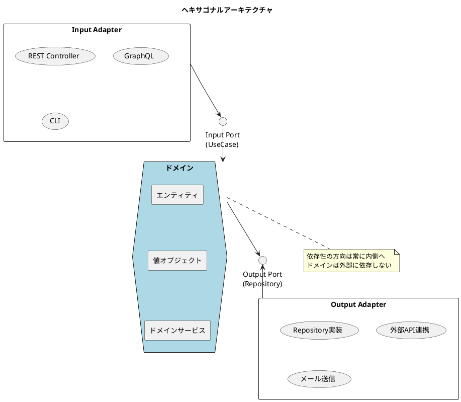
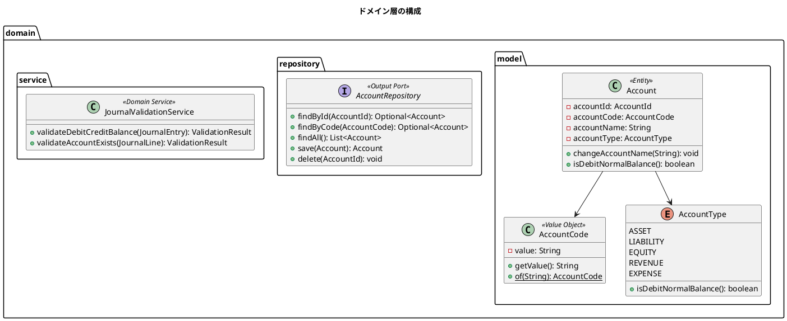
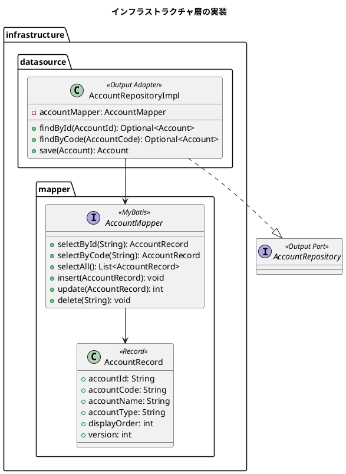
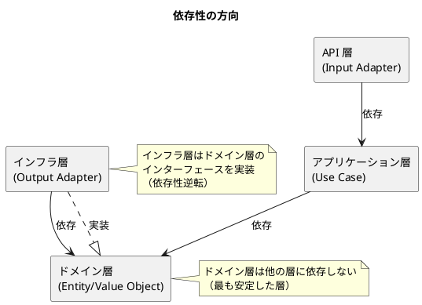

# バックエンドアーキテクチャ設計

## 概要

本ドキュメントは、財務会計システムのバックエンドアーキテクチャを定義します。
ヘキサゴナルアーキテクチャ（Ports & Adapters パターン）を採用し、ドメインロジックと技術的関心事を分離します。

## アーキテクチャパターン

### ヘキサゴナルアーキテクチャ



### アーキテクチャの原則

| 原則 | 説明 |
|------|------|
| 依存性逆転の原則 | ドメインが抽象（インターフェース）に依存し、具象（実装）に依存しない |
| 関心の分離 | ビジネスロジックと技術的関心事を明確に分離 |
| テスタビリティ | ドメインロジックを外部依存なしでテスト可能 |
| 交換可能性 | アダプターを変更してもドメインに影響しない |

---

## パッケージ構成

```
com.example.accounting/
├── domain/                          # ドメイン層
│   ├── model/                       # ドメインモデル
│   │   ├── account/                 # 勘定科目
│   │   │   ├── Account.java         # エンティティ
│   │   │   ├── AccountCode.java     # 値オブジェクト
│   │   │   └── AccountType.java     # 列挙型
│   │   ├── journal/                 # 仕訳
│   │   │   ├── JournalEntry.java    # エンティティ
│   │   │   ├── JournalLine.java     # 値オブジェクト
│   │   │   └── JournalStatus.java   # 列挙型
│   │   └── balance/                 # 残高
│   │       ├── DailyBalance.java
│   │       └── MonthlyBalance.java
│   ├── service/                     # ドメインサービス
│   │   ├── JournalValidationService.java
│   │   └── BalanceCalculationService.java
│   └── repository/                  # リポジトリインターフェース（Output Port）
│       ├── AccountRepository.java
│       ├── JournalEntryRepository.java
│       └── BalanceRepository.java
│
├── application/                     # アプリケーション層
│   ├── usecase/                     # ユースケース（Input Port）
│   │   ├── account/
│   │   │   ├── RegisterAccountUseCase.java
│   │   │   ├── UpdateAccountUseCase.java
│   │   │   └── GetAccountUseCase.java
│   │   ├── journal/
│   │   │   ├── CreateJournalEntryUseCase.java
│   │   │   ├── ApproveJournalEntryUseCase.java
│   │   │   └── GetJournalEntryUseCase.java
│   │   └── balance/
│   │       └── CalculateBalanceUseCase.java
│   └── dto/                         # データ転送オブジェクト
│       ├── AccountDto.java
│       ├── JournalEntryDto.java
│       └── BalanceDto.java
│
├── infrastructure/                  # インフラストラクチャ層
│   ├── datasource/                  # Output Adapter（データソース）
│   │   ├── AccountRepositoryImpl.java
│   │   ├── JournalEntryRepositoryImpl.java
│   │   └── BalanceRepositoryImpl.java
│   ├── mapper/                      # MyBatis Mapper
│   │   ├── AccountMapper.java
│   │   ├── JournalEntryMapper.java
│   │   └── BalanceMapper.java
│   └── external/                    # 外部連携
│       └── EmailService.java
│
└── api/                             # API 層（Input Adapter）
    ├── controller/                  # REST Controller
    │   ├── AccountController.java
    │   ├── JournalEntryController.java
    │   └── BalanceController.java
    ├── request/                     # リクエスト DTO
    │   ├── AccountRequest.java
    │   └── JournalEntryRequest.java
    └── response/                    # レスポンス DTO
        ├── AccountResponse.java
        └── JournalEntryResponse.java
```

---

## 層の責務

### ドメイン層（domain）

ビジネスロジックの中核を担う層。外部への依存を持たない。



#### エンティティの例

```java
@Getter
public class Account {
    private final AccountId accountId;
    private AccountCode accountCode;
    private String accountName;
    private final AccountType accountType;
    private int displayOrder;
    private int version;

    // ファクトリメソッド
    public static Account create(
            AccountCode accountCode,
            String accountName,
            AccountType accountType,
            int displayOrder) {
        return new Account(
            AccountId.generate(),
            accountCode,
            accountName,
            accountType,
            displayOrder,
            0
        );
    }

    // 再構築用コンストラクタ
    public static Account reconstruct(
            AccountId accountId,
            AccountCode accountCode,
            String accountName,
            AccountType accountType,
            int displayOrder,
            int version) {
        return new Account(accountId, accountCode, accountName,
                          accountType, displayOrder, version);
    }

    // ビジネスロジック
    public boolean isDebitNormalBalance() {
        return accountType.isDebitNormalBalance();
    }

    public void changeAccountName(String newName) {
        if (newName == null || newName.isBlank()) {
            throw new IllegalArgumentException("勘定科目名は必須です");
        }
        this.accountName = newName;
    }
}
```

#### 値オブジェクトの例

```java
public record AccountCode(String value) {

    public AccountCode {
        if (value == null || value.isBlank()) {
            throw new IllegalArgumentException("勘定科目コードは必須です");
        }
        if (!value.matches("^[0-9]{3,4}$")) {
            throw new IllegalArgumentException(
                "勘定科目コードは3〜4桁の数字です: " + value);
        }
    }

    public static AccountCode of(String value) {
        return new AccountCode(value);
    }
}
```

### アプリケーション層（application）

ユースケースを実装する層。ドメインオブジェクトを操作してビジネスプロセスを実現する。

```plantuml
@startuml
title アプリケーション層のユースケース

package "application.usecase.account" {
  class RegisterAccountUseCase <<Input Port>> {
    - accountRepository: AccountRepository
    + execute(RegisterAccountCommand): AccountDto
  }

  class UpdateAccountUseCase <<Input Port>> {
    - accountRepository: AccountRepository
    + execute(UpdateAccountCommand): AccountDto
  }

  class GetAccountUseCase <<Input Port>> {
    - accountRepository: AccountRepository
    + execute(String accountCode): AccountDto
    + executeAll(): List<AccountDto>
  }
}

interface AccountRepository

RegisterAccountUseCase --> AccountRepository
UpdateAccountUseCase --> AccountRepository
GetAccountUseCase --> AccountRepository
@enduml
```



#### ユースケースの例

```java
@Service
@Transactional
@RequiredArgsConstructor
public class RegisterAccountUseCase {
    private final AccountRepository accountRepository;

    public AccountDto execute(RegisterAccountCommand command) {
        // 重複チェック
        AccountCode code = AccountCode.of(command.accountCode());
        if (accountRepository.findByCode(code).isPresent()) {
            throw new DuplicateAccountCodeException(code);
        }

        // エンティティ生成
        Account account = Account.create(
            code,
            command.accountName(),
            AccountType.valueOf(command.accountType()),
            command.displayOrder()
        );

        // 永続化
        Account saved = accountRepository.save(account);

        // DTO に変換して返却
        return AccountDto.from(saved);
    }
}
```

### インフラストラクチャ層（infrastructure）

技術的な実装を担う層。データベースアクセスや外部システム連携を実装する。



#### リポジトリ実装の例

```java
@Repository
@RequiredArgsConstructor
public class AccountRepositoryImpl implements AccountRepository {
    private final AccountMapper accountMapper;

    @Override
    public Optional<Account> findByCode(AccountCode code) {
        AccountRecord record = accountMapper.selectByCode(code.value());
        if (record == null) {
            return Optional.empty();
        }
        return Optional.of(toEntity(record));
    }

    @Override
    public Account save(Account account) {
        AccountRecord record = toRecord(account);

        if (account.getVersion() == 0) {
            accountMapper.insert(record);
        } else {
            int updated = accountMapper.update(record);
            if (updated == 0) {
                throw new OptimisticLockException("勘定科目が更新されています");
            }
        }

        return findById(account.getAccountId())
            .orElseThrow(() -> new IllegalStateException("保存後の取得に失敗"));
    }

    private Account toEntity(AccountRecord record) {
        return Account.reconstruct(
            AccountId.of(record.accountId()),
            AccountCode.of(record.accountCode()),
            record.accountName(),
            AccountType.valueOf(record.accountType()),
            record.displayOrder(),
            record.version()
        );
    }

    private AccountRecord toRecord(Account account) {
        return new AccountRecord(
            account.getAccountId().value(),
            account.getAccountCode().value(),
            account.getAccountName(),
            account.getAccountType().name(),
            account.getDisplayOrder(),
            account.getVersion()
        );
    }
}
```

### API 層（api）

外部からのリクエストを受け付け、ユースケースを呼び出す層。

```plantuml
@startuml
title API 層の構成

package "api.controller" {
  class AccountController <<Input Adapter>> {
    - registerAccountUseCase: RegisterAccountUseCase
    - updateAccountUseCase: UpdateAccountUseCase
    - getAccountUseCase: GetAccountUseCase
    + getAccounts(): List<AccountResponse>
    + getAccount(String): AccountResponse
    + createAccount(AccountRequest): AccountResponse
    + updateAccount(String, AccountRequest): AccountResponse
  }
}

package "api.request" {
  class AccountRequest {
    + accountCode: String
    + accountName: String
    + accountType: String
    + displayOrder: int
  }
}

package "api.response" {
  class AccountResponse {
    + accountCode: String
    + accountName: String
    + accountType: String
    + displayOrder: int
    + version: int
  }
}

AccountController --> RegisterAccountUseCase
AccountController --> UpdateAccountUseCase
AccountController --> GetAccountUseCase
AccountController ..> AccountRequest
AccountController ..> AccountResponse
@enduml
```



#### コントローラーの例

```java
@RestController
@RequestMapping("/api/accounts")
@RequiredArgsConstructor
@Tag(name = "勘定科目", description = "勘定科目マスタ管理 API")
public class AccountController {
    private final RegisterAccountUseCase registerAccountUseCase;
    private final UpdateAccountUseCase updateAccountUseCase;
    private final GetAccountUseCase getAccountUseCase;

    @GetMapping
    @Operation(summary = "勘定科目一覧取得")
    public ResponseEntity<List<AccountResponse>> getAccounts() {
        List<AccountDto> accounts = getAccountUseCase.executeAll();
        return ResponseEntity.ok(
            accounts.stream()
                .map(AccountResponse::from)
                .toList()
        );
    }

    @GetMapping("/{accountCode}")
    @Operation(summary = "勘定科目詳細取得")
    public ResponseEntity<AccountResponse> getAccount(
            @PathVariable String accountCode) {
        AccountDto account = getAccountUseCase.execute(accountCode);
        return ResponseEntity.ok(AccountResponse.from(account));
    }

    @PostMapping
    @Operation(summary = "勘定科目登録")
    public ResponseEntity<AccountResponse> createAccount(
            @RequestBody @Valid AccountRequest request) {
        RegisterAccountCommand command = request.toCommand();
        AccountDto created = registerAccountUseCase.execute(command);
        return ResponseEntity
            .status(HttpStatus.CREATED)
            .body(AccountResponse.from(created));
    }

    @PutMapping("/{accountCode}")
    @Operation(summary = "勘定科目更新")
    public ResponseEntity<AccountResponse> updateAccount(
            @PathVariable String accountCode,
            @RequestBody @Valid AccountRequest request) {
        UpdateAccountCommand command = request.toUpdateCommand(accountCode);
        AccountDto updated = updateAccountUseCase.execute(command);
        return ResponseEntity.ok(AccountResponse.from(updated));
    }
}
```

---

## 依存関係の制御

### 依存性の方向



### Spring の DI による実現

```java
// ドメイン層：インターフェース定義（Output Port）
public interface AccountRepository {
    Optional<Account> findByCode(AccountCode code);
    Account save(Account account);
}

// インフラ層：実装（Output Adapter）
@Repository
public class AccountRepositoryImpl implements AccountRepository {
    // MyBatis を使った実装
}

// アプリケーション層：インターフェースに依存
@Service
@RequiredArgsConstructor
public class RegisterAccountUseCase {
    private final AccountRepository accountRepository; // インターフェースに依存

    public AccountDto execute(RegisterAccountCommand command) {
        // accountRepository.save() を呼び出し
        // 実際には AccountRepositoryImpl が注入される
    }
}
```

---

## アーキテクチャテスト

ArchUnit を使用してアーキテクチャルールを自動検証します。

```java
@AnalyzeClasses(packages = "com.example.accounting")
public class ArchitectureTest {

    @ArchTest
    static final ArchRule domainShouldNotDependOnOtherLayers =
        noClasses()
            .that().resideInAPackage("..domain..")
            .should().dependOnClassesThat()
            .resideInAnyPackage("..application..", "..infrastructure..", "..api..");

    @ArchTest
    static final ArchRule applicationShouldNotDependOnInfraOrApi =
        noClasses()
            .that().resideInAPackage("..application..")
            .should().dependOnClassesThat()
            .resideInAnyPackage("..infrastructure..", "..api..");

    @ArchTest
    static final ArchRule useCasesShouldOnlyBeAccessedByControllers =
        classes()
            .that().resideInAPackage("..usecase..")
            .should().onlyBeAccessed()
            .byAnyPackage("..api.controller..", "..usecase..");

    @ArchTest
    static final ArchRule repositoryImplementationsShouldImplementInterface =
        classes()
            .that().resideInAPackage("..infrastructure.datasource..")
            .and().haveSimpleNameEndingWith("RepositoryImpl")
            .should().implement(
                classes().that().resideInAPackage("..domain.repository..")
            );
}
```

---

## 技術スタック

| 技術 | バージョン | 用途 |
|------|-----------|------|
| Java | 25 | プログラミング言語 |
| Spring Boot | 3.2.x | Web フレームワーク |
| MyBatis | 3.0.x | O/R マッパー |
| PostgreSQL | 16 | データベース |
| Flyway | 10.x | マイグレーション管理 |
| JUnit 5 | 5.10.x | テストフレームワーク |
| Testcontainers | 1.19.x | テスト用 DB コンテナ |
| ArchUnit | 1.2.x | アーキテクチャテスト |
| springdoc-openapi | 2.3.x | OpenAPI 仕様生成 |

---

## 設計原則

### SOLID 原則の適用

| 原則 | 適用例 |
|------|--------|
| 単一責任原則（SRP） | ユースケースは1つのビジネス操作のみを担当 |
| 開放閉鎖原則（OCP） | 新しいアダプターの追加でドメインを変更しない |
| リスコフの置換原則（LSP） | リポジトリの実装は交換可能 |
| インターフェース分離原則（ISP） | 細かい粒度のリポジトリインターフェース |
| 依存性逆転原則（DIP） | ドメインがインターフェースを定義、インフラが実装 |

### ドメイン駆動設計（DDD）の適用

| 概念 | 適用 |
|------|------|
| エンティティ | Account, JournalEntry |
| 値オブジェクト | AccountCode, Money, JournalLine |
| 集約 | JournalEntry（JournalLine を含む） |
| リポジトリ | 集約ルートごとにリポジトリを定義 |
| ドメインサービス | JournalValidationService |
| ユースケース | アプリケーションサービスとして実装 |
