# バックエンドアーキテクチャ設計書

## 1. 概要

本書は、財務会計システムのバックエンドアーキテクチャ設計を定義します。

### 1.1 システム概要

| 項目 | 内容 |
|------|------|
| システム名 | 財務会計システム |
| 対象領域 | 複式簿記による財務会計処理 |
| 主要機能 | 仕訳管理、元帳管理、残高管理、財務諸表生成 |

### 1.2 技術スタック

| カテゴリ | 技術 |
|---------|------|
| 言語 | Java 25 |
| フレームワーク | Spring Boot 4.x |
| ORM | MyBatis |
| ビルド | Gradle |
| データベース | PostgreSQL / MySQL |
| マイグレーション | Flyway |
| テスト | JUnit 5, Testcontainers |
| ドキュメント | JIG, JIG-ERD, springdoc-openapi |
| 品質管理 | SonarQube, ArchUnit, Checkstyle, PMD, SpotBugs |

---

## 2. アーキテクチャパターン

### 2.1 アーキテクチャ選定根拠

財務会計システムは以下の特性を持つため、**イベント履歴式ドメインモデル** と **CQRS** を採用します。

| 判断基準 | 本システムの特性 |
|---------|------------------|
| 業務領域カテゴリー | 中核の業務領域（組織の競争優位性を決定） |
| 金額を扱う | はい（会計・金融関連の処理） |
| 監査記録が必要 | はい（コンプライアンス・規制対応） |
| データ構造 | 複雑（仕訳、元帳、財務諸表間の関係） |

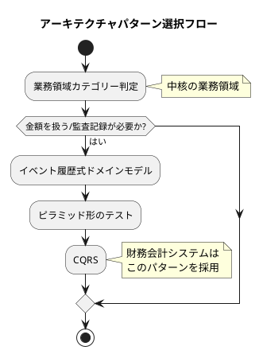

### 2.2 ヘキサゴナルアーキテクチャ

本システムでは、ヘキサゴナルアーキテクチャ（ポート&アダプター）を採用します。

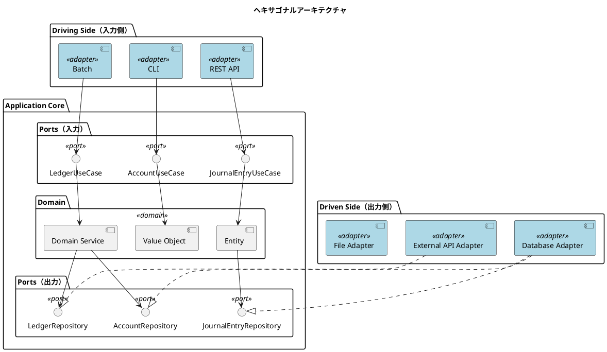

#### 採用理由

| 観点 | 効果 |
|------|------|
| ビジネスロジックの独立性 | 仕訳ルール、残高計算などの会計ロジックがフレームワークから独立 |
| テスタビリティ | ドメインロジックを単体でテスト可能 |
| 柔軟なデータソース | RDB、外部会計システム、CSV など多様なデータソースに対応 |
| 段階的な移行 | レガシーシステムからの段階的な移行が容易 |

---

## 3. レイヤー構成

### 3.1 レイヤー定義

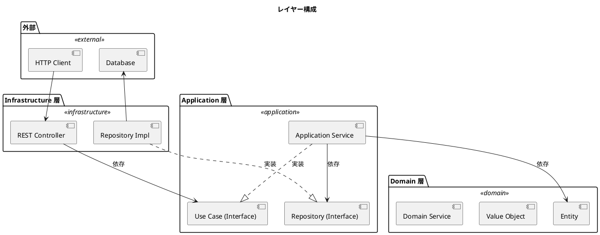

### 3.2 レイヤー責務

| レイヤー | 責務 | 依存先 |
|---------|------|--------|
| Domain | ビジネスルール、不変条件、ドメインサービス | なし |
| Application | ユースケース制御、トランザクション境界 | Domain |
| Infrastructure | 外部システム連携、永続化、技術的関心事 | Application, Domain |

### 3.3 依存ルール

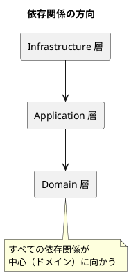

---

## 4. パッケージ構造

### 4.1 パッケージ構成

```
com.example.accounting/
├── domain/                          # ドメイン層
│   ├── model/                       # ドメインモデル
│   │   ├── account/                 # 勘定科目
│   │   │   ├── Account.java         # 集約ルート
│   │   │   ├── AccountCode.java     # 値オブジェクト
│   │   │   ├── AccountType.java     # 値オブジェクト
│   │   │   └── AccountList.java     # コレクション
│   │   ├── journal/                 # 仕訳
│   │   │   ├── JournalEntry.java    # 集約ルート
│   │   │   ├── JournalDetail.java   # エンティティ
│   │   │   ├── JournalItem.java     # エンティティ
│   │   │   └── JournalEntryStatus.java  # 値オブジェクト
│   │   ├── ledger/                  # 元帳
│   │   │   ├── GeneralLedger.java
│   │   │   └── LedgerEntry.java
│   │   └── statement/               # 財務諸表
│   │       ├── BalanceSheet.java
│   │       └── IncomeStatement.java
│   ├── service/                     # ドメインサービス
│   │   └── BalanceCalculator.java
│   ├── exception/                   # ドメイン例外
│   │   ├── InvalidJournalEntryException.java
│   │   └── AccountNotFoundException.java
│   └── type/                        # 共通型（値オブジェクト）
│       ├── Money.java
│       └── AccountingPeriod.java
│
├── application/                     # アプリケーション層
│   ├── port/
│   │   ├── in/                      # Input Port（ユースケース）
│   │   │   ├── JournalEntryUseCase.java
│   │   │   ├── AccountUseCase.java
│   │   │   └── command/             # コマンド DTO
│   │   │       └── CreateJournalEntryCommand.java
│   │   └── out/                     # Output Port（リポジトリ）
│   │       ├── JournalEntryRepository.java
│   │       └── AccountRepository.java
│   └── service/                     # Application Service
│       ├── JournalEntryService.java
│       └── AccountService.java
│
└── infrastructure/                  # インフラストラクチャ層
    ├── persistence/                 # 永続化
    │   ├── entity/                  # MyBatis Entity
    │   │   ├── AccountEntity.java
    │   │   ├── JournalEntity.java
    │   │   ├── JournalDetailEntity.java
    │   │   └── JournalItemEntity.java
    │   ├── mapper/                  # MyBatis Mapper
    │   │   ├── AccountMapper.java
    │   │   └── JournalMapper.java
    │   └── repository/              # Output Adapter（リポジトリ実装）
    │       ├── AccountRepositoryImpl.java
    │       └── JournalEntryRepositoryImpl.java
    └── web/                         # Web
        ├── controller/              # Input Adapter（REST Controller）
        │   ├── AccountController.java
        │   └── JournalEntryController.java
        ├── dto/                     # DTO（Request/Response）
        │   ├── AccountRequest.java
        │   ├── AccountResponse.java
        │   ├── JournalEntryRequest.java
        │   └── JournalEntryResponse.java
        └── exception/               # 例外ハンドラー
            └── GlobalExceptionHandler.java
```

### 4.2 ドメインモデルの構成

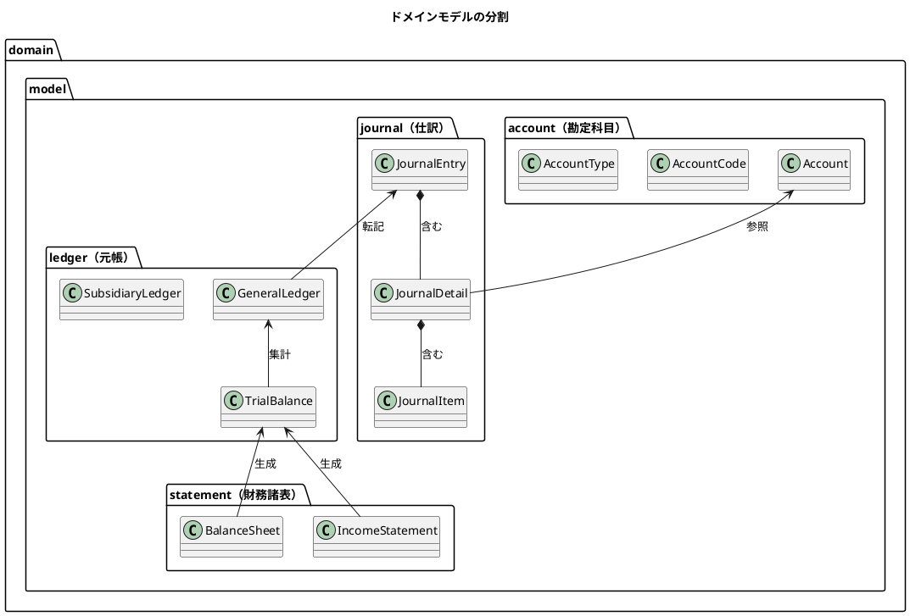

---

## 5. ポートとアダプター

### 5.1 入力ポート（Primary/Driving Port）

入力ポートは、アプリケーションが外部に提供するインターフェースです。

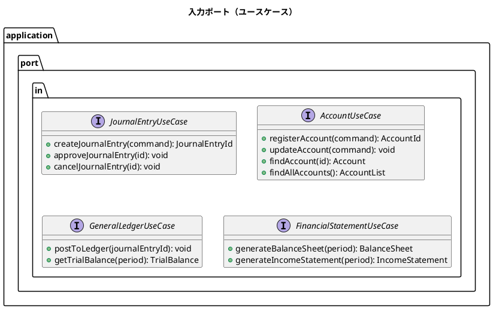

### 5.2 出力ポート（Secondary/Driven Port）

出力ポートは、アプリケーションが外部システムを利用するためのインターフェースです。

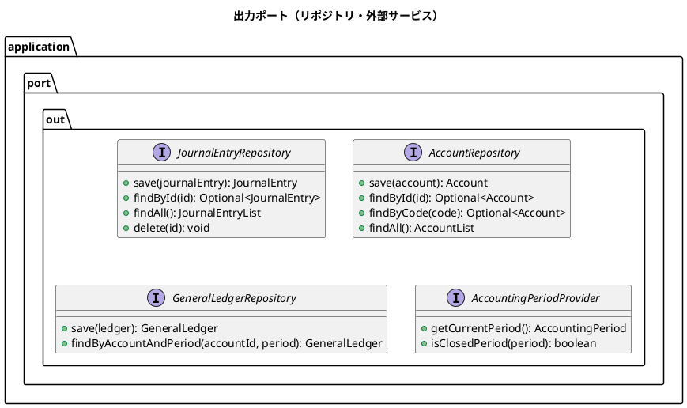

### 5.3 アダプター構成

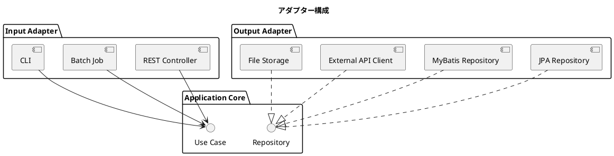

---

## 6. CQRS パターン

### 6.1 コマンド・クエリ分離

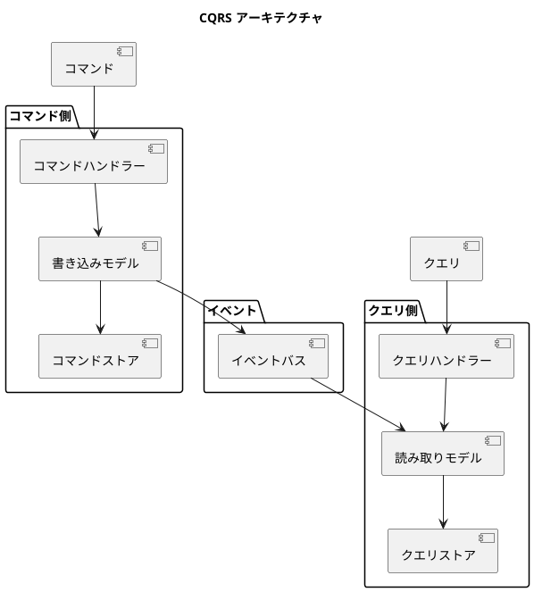

### 6.2 適用範囲

| 機能 | コマンド側 | クエリ側 |
|------|-----------|---------|
| 仕訳登録 | 仕訳集約の更新 | - |
| 仕訳照会 | - | 仕訳読み取りモデル |
| 残高計算 | 残高更新イベント | 残高照会モデル |
| 財務諸表 | - | 財務諸表生成ビュー |

---

## 7. モジュール構成

### 7.1 機能モジュール

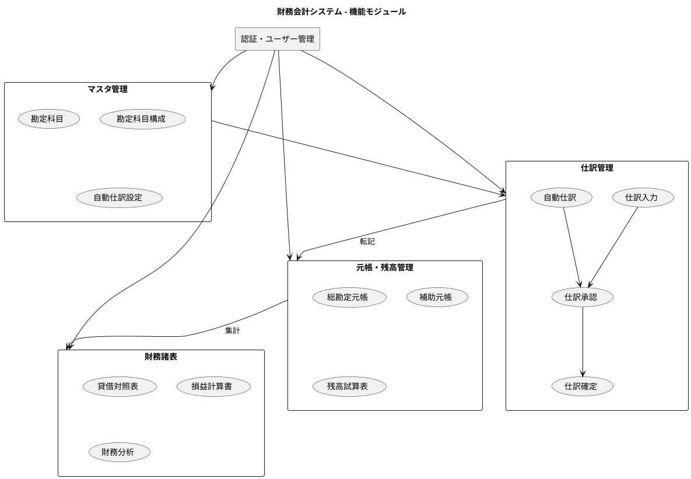

### 7.2 モジュール依存関係

| モジュール | 依存先 | 説明 |
|-----------|--------|------|
| 認証・ユーザー管理 | なし | 認証・認可の基盤 |
| マスタ管理 | 認証 | 勘定科目等のマスタデータ管理 |
| 仕訳管理 | マスタ管理 | 仕訳の入力・承認・確定 |
| 元帳・残高管理 | 仕訳管理 | 仕訳から元帳への転記、残高計算 |
| 財務諸表 | 元帳・残高管理 | 財務諸表の生成・分析 |

---

## 8. API 設計

### 8.1 REST API エンドポイント

| リソース | メソッド | エンドポイント | 説明 |
|---------|---------|---------------|------|
| 勘定科目 | GET | /api/accounts | 勘定科目一覧取得 |
| 勘定科目 | POST | /api/accounts | 勘定科目登録 |
| 勘定科目 | GET | /api/accounts/{code} | 勘定科目詳細取得 |
| 勘定科目 | PUT | /api/accounts/{code} | 勘定科目更新 |
| 勘定科目 | DELETE | /api/accounts/{code} | 勘定科目削除 |
| 仕訳 | GET | /api/journal-entries | 仕訳一覧取得 |
| 仕訳 | POST | /api/journal-entries | 仕訳登録 |
| 仕訳 | GET | /api/journal-entries/{id} | 仕訳詳細取得 |
| 仕訳 | POST | /api/journal-entries/{id}/approve | 仕訳承認 |
| 仕訳 | POST | /api/journal-entries/{id}/cancel | 仕訳取消 |
| 残高 | GET | /api/balances | 残高一覧取得 |
| 試算表 | GET | /api/trial-balance | 試算表取得 |
| 貸借対照表 | GET | /api/statements/balance-sheet | 貸借対照表取得 |
| 損益計算書 | GET | /api/statements/income-statement | 損益計算書取得 |

### 8.2 OpenAPI 仕様

springdoc-openapi を使用して API 仕様を自動生成します。

```yaml
openapi: 3.0.1
info:
  title: 財務会計システム API
  version: 1.0.0
paths:
  /api/accounts:
    get:
      summary: 勘定科目一覧取得
      responses:
        '200':
          description: 成功
          content:
            application/json:
              schema:
                type: array
                items:
                  $ref: '#/components/schemas/AccountResponse'
```

---

## 9. テスト戦略

### 9.1 テストピラミッド

ドメインモデル・イベント履歴式パターンでは、ピラミッド形テストを採用します。

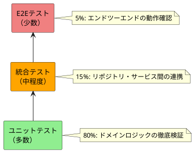

### 9.2 テスト種別

| テスト種別 | 対象 | ツール |
|-----------|------|--------|
| ユニットテスト | ドメインモデル、値オブジェクト | JUnit 5, Mockito |
| 統合テスト | リポジトリ、サービス | Testcontainers, Spring Test |
| アーキテクチャテスト | レイヤー依存関係 | ArchUnit |
| E2Eテスト | API エンドポイント | REST Assured |

---

## 10. アーキテクチャ検証

### 10.1 ArchUnit によるルール検証

```java
@AnalyzeClasses(packages = "com.example.accounting")
public class HexagonalArchitectureTest {

    @Test
    void domainShouldNotDependOnOtherLayers() {
        ArchRule rule = noClasses()
            .that()
            .resideInAPackage("..domain..")
            .should()
            .dependOnClassesThat()
            .resideInAnyPackage("..infrastructure..", "..application..");

        rule.check(importedClasses);
    }

    @Test
    void applicationShouldNotDependOnInfrastructure() {
        ArchRule rule = noClasses()
            .that()
            .resideInAPackage("..application..")
            .should()
            .dependOnClassesThat()
            .resideInAPackage("..infrastructure..");

        rule.check(importedClasses);
    }
}
```

### 10.2 ルール一覧

| ルール | 説明 |
|--------|------|
| Domain → なし | Domain 層はどの層にも依存しない |
| Application → Domain | Application 層は Domain 層のみに依存 |
| Infrastructure → Application, Domain | Infrastructure 層は Application 層と Domain 層に依存 |

---

## 11. トレーサビリティ

### 11.1 要件からの追跡

| 要件 ID | ユースケース | 実装モジュール |
|---------|-------------|----------------|
| BUC01 | 日次経理業務を遂行する | journal, ledger |
| BUC02 | 月次決算を実行する | journal, ledger, statement |
| BUC03 | 財務状況を把握する | statement |
| BUC04 | 会計マスタを管理する | master |
| BUC05 | 年次決算を実行する | journal, ledger, statement |
| BUC06 | 会計システムを運用する | auth, audit |

### 11.2 アーキテクチャ決定記録（ADR）

| ADR | 決定事項 | 理由 |
|-----|---------|------|
| ADR-001 | ヘキサゴナルアーキテクチャの採用 | ドメインロジックの独立性確保 |
| ADR-002 | CQRS パターンの採用 | 読み書き負荷の分離、監査要件への対応 |
| ADR-003 | MyBatis の採用 | 複雑なクエリへの対応、SQLの可視性 |
| ADR-004 | イベント履歴式ドメインモデル | 監査証跡、時系列分析の実現 |

---

## 12. 参考資料

- [第3章: アーキテクチャ設計](../article/backend/chapter03.md)
- [アーキテクチャ設計ガイド](../reference/アーキテクチャ設計ガイド.md)
- [要件定義書](../requirements/requirements_definition.md)
- [ビジネスユースケース](../requirements/business_usecase.md)
