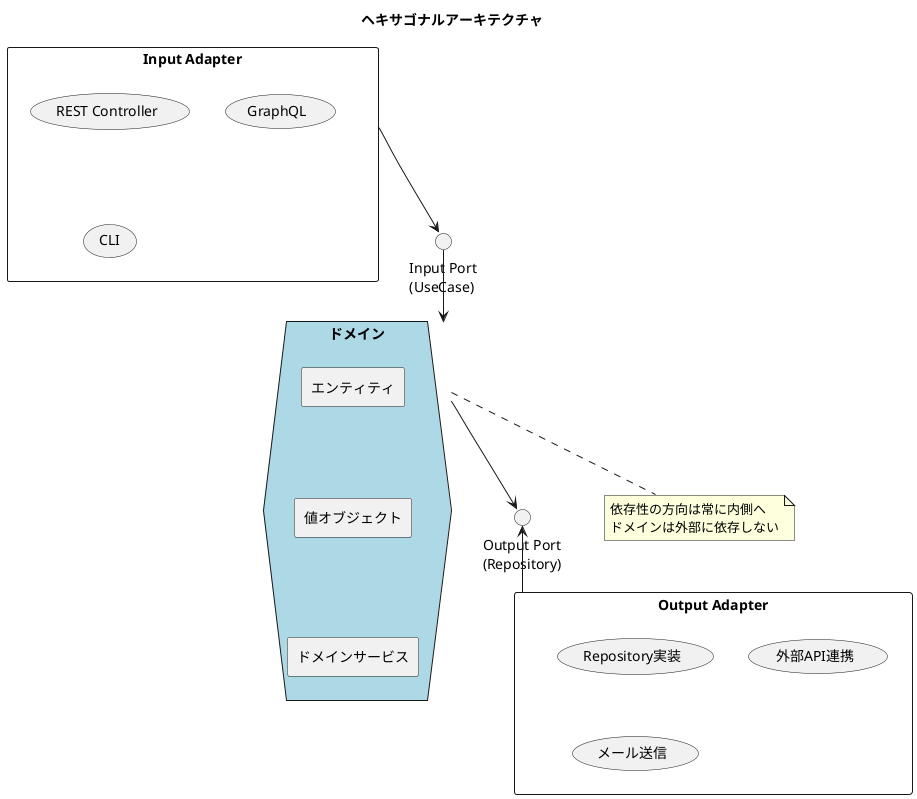
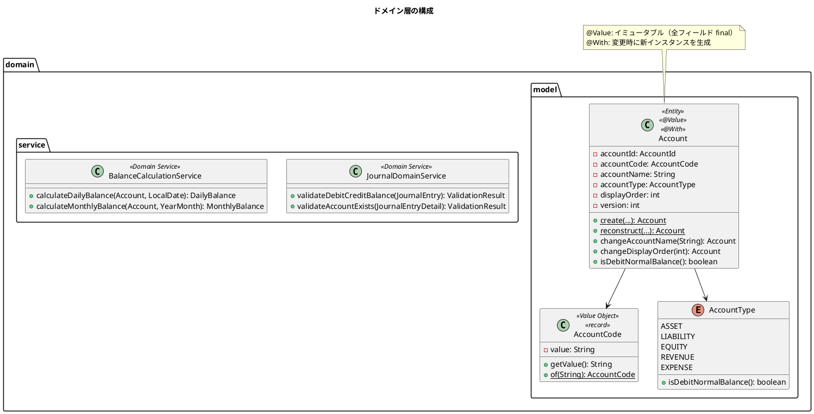
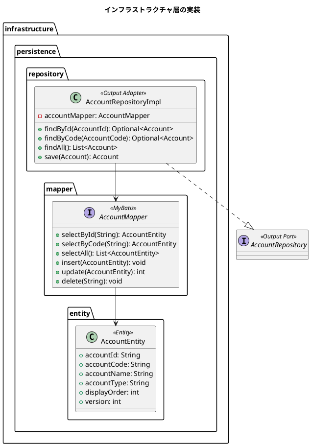
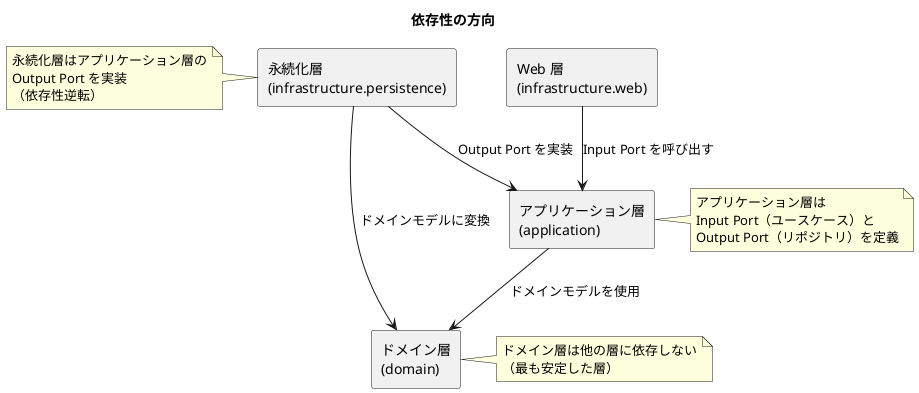

# バックエンドアーキテクチャ設計

## 概要

本ドキュメントは、財務会計システムのバックエンドアーキテクチャを定義します。
ヘキサゴナルアーキテクチャ（Ports & Adapters パターン）を採用し、ドメインロジックと技術的関心事を分離します。

## アーキテクチャパターン

### ヘキサゴナルアーキテクチャ



### アーキテクチャの原則

| 原則 | 説明 |
|------|------|
| 依存性逆転の原則 | ドメインが抽象（インターフェース）に依存し、具象（実装）に依存しない |
| 関心の分離 | ビジネスロジックと技術的関心事を明確に分離 |
| テスタビリティ | ドメインロジックを外部依存なしでテスト可能 |
| 交換可能性 | アダプターを変更してもドメインに影響しない |

---

## パッケージ構成

```
com.example.accounting/
├── domain/                          # ドメイン層
│   ├── model/                       # ドメインモデル
│   │   ├── account/                 # 勘定科目
│   │   │   ├── Account.java         # 勘定科目エンティティ
│   │   │   ├── AccountType.java     # 勘定科目種別（列挙型）
│   │   │   └── AccountCode.java     # 勘定科目コード（値オブジェクト）
│   │   ├── journal/                 # 仕訳
│   │   │   ├── JournalEntry.java    # 仕訳（集約ルート）
│   │   │   ├── JournalEntryDetail.java # 仕訳明細
│   │   │   ├── JournalEntryDetailItem.java # 仕訳貸借明細
│   │   │   ├── JournalEntryNumber.java # 仕訳伝票番号（値オブジェクト）
│   │   │   ├── JournalStatus.java   # 仕訳ステータス（列挙型）
│   │   │   ├── DebitCreditType.java # 貸借区分（列挙型）
│   │   │   └── Money.java           # 金額（値オブジェクト）
│   │   ├── balance/                 # 残高
│   │   │   ├── DailyBalance.java    # 日次勘定科目残高
│   │   │   └── MonthlyBalance.java  # 月次勘定科目残高
│   │   └── financial/               # 財務諸表
│   │       ├── BalanceSheet.java    # 貸借対照表
│   │       ├── BalanceSheetItem.java # 貸借対照表項目
│   │       ├── IncomeStatement.java # 損益計算書
│   │       ├── IncomeStatementItem.java # 損益計算書項目
│   │       ├── FinancialRatios.java # 財務指標
│   │       └── AccountCategory.java # 勘定科目区分（列挙型）
│   └── service/                     # ドメインサービス
│       ├── JournalDomainService.java # 仕訳ドメインサービス
│       ├── BalanceCalculationService.java # 残高計算ドメインサービス
│       └── FinancialAnalysisDomainService.java # 財務分析ドメインサービス
│
├── application/                     # アプリケーション層
│   ├── port/                        # ポート（ヘキサゴナルアーキテクチャ）
│   │   ├── in/                      # Input Port（ユースケース）
│   │   │   ├── AccountUseCase.java  # 勘定科目ユースケース
│   │   │   ├── JournalEntryUseCase.java # 仕訳ユースケース
│   │   │   ├── FinancialStatementUseCase.java # 財務諸表ユースケース
│   │   │   ├── command/             # コマンド
│   │   │   │   ├── CreateAccountCommand.java
│   │   │   │   ├── UpdateAccountCommand.java
│   │   │   │   └── CreateJournalEntryCommand.java
│   │   │   └── query/               # クエリ
│   │   │       ├── BalanceSheetQuery.java
│   │   │       └── IncomeStatementQuery.java
│   │   └── out/                     # Output Port（リポジトリインターフェース）
│   │       ├── AccountRepository.java # 勘定科目リポジトリ
│   │       ├── JournalEntryRepository.java # 仕訳リポジトリ
│   │       ├── DailyBalanceRepository.java # 日次残高リポジトリ
│   │       └── MonthlyBalanceRepository.java # 月次残高リポジトリ
│   └── service/                     # アプリケーションサービス
│       ├── AccountService.java      # 勘定科目サービス
│       ├── JournalEntryService.java # 仕訳サービス
│       └── FinancialStatementService.java # 財務諸表サービス
│
└── infrastructure/                  # インフラストラクチャ層
    ├── persistence/                 # 永続化（Output Adapter）
    │   ├── entity/                  # JPA/MyBatis エンティティ
    │   │   ├── AccountEntity.java
    │   │   ├── JournalEntryEntity.java
    │   │   └── ...
    │   ├── mapper/                  # MyBatis Mapper
    │   │   ├── AccountMapper.java
    │   │   ├── JournalEntryMapper.java
    │   │   └── ...
    │   └── repository/              # リポジトリ実装
    │       ├── AccountRepositoryImpl.java
    │       ├── JournalEntryRepositoryImpl.java
    │       └── ...
    └── web/                         # Web（Input Adapter）
        ├── controller/              # REST Controller
        │   ├── AccountController.java
        │   ├── JournalEntryController.java
        │   └── FinancialStatementController.java
        └── dto/                     # リクエスト/レスポンス DTO
            ├── AccountRequest.java
            ├── AccountResponse.java
            ├── JournalEntryRequest.java
            └── JournalEntryResponse.java
```

---

## 層の責務

### ドメイン層（domain）

ビジネスロジックの中核を担う層。外部への依存を持たない。



#### エンティティの例

ドメインエンティティは `@Value` と `@With` を使用してイミュータブルに設計します。

**設計方針:**
- `@Value`: すべてのフィールドを `private final` にし、Getter、equals/hashCode、toString を自動生成
- `@With`: イミュータブルなオブジェクトのフィールドを変更した新しいインスタンスを生成するメソッドを自動生成
- `@AllArgsConstructor(access = AccessLevel.PRIVATE)`: コンストラクタをプライベートにして、ファクトリメソッド経由でのみ生成可能にする

**生成法の解説:**

| メソッド | 用途 | 説明 |
|---------|------|------|
| `create()` | 新規作成 | ビジネスルールに従って新しいエンティティを生成。ID は自動生成、バリデーション実行 |
| `reconstruct()` | 再構築 | DBからの復元用。バリデーションをスキップし、既存データをそのまま復元 |
| `withXxx()` | 更新 | `@With` により自動生成。変更したいフィールドのみ指定して新しいインスタンスを返す |

```java
import lombok.AccessLevel;
import lombok.AllArgsConstructor;
import lombok.Value;
import lombok.With;

/**
 * 勘定科目エンティティ
 *
 * <p>イミュータブル設計により、状態変更は常に新しいインスタンスを生成する。
 * これにより、並行処理での安全性と、変更履歴の追跡が容易になる。</p>
 */
@Value
@With
@AllArgsConstructor(access = AccessLevel.PRIVATE)
public class Account {
    AccountId accountId;
    AccountCode accountCode;
    String accountName;
    AccountType accountType;
    int displayOrder;
    int version;

    /**
     * ファクトリメソッド - 新規作成
     *
     * <p>新しい勘定科目を作成する。ID は自動生成され、version は 0 で初期化される。
     * すべての入力値に対してバリデーションを実行する。</p>
     *
     * @param accountCode  勘定科目コード（3〜4桁の数字）
     * @param accountName  勘定科目名（必須）
     * @param accountType  勘定科目種別（ASSET, LIABILITY, EQUITY, REVENUE, EXPENSE）
     * @param displayOrder 表示順序
     * @return 新しい Account インスタンス
     * @throws IllegalArgumentException 入力値が不正な場合
     */
    public static Account create(
            AccountCode accountCode,
            String accountName,
            AccountType accountType,
            int displayOrder) {
        validateAccountName(accountName);
        return new Account(
            AccountId.generate(),
            accountCode,
            accountName,
            accountType,
            displayOrder,
            0  // 新規作成時は version = 0
        );
    }

    /**
     * 再構築用ファクトリメソッド - DB からの復元
     *
     * <p>データベースから読み込んだデータを使ってエンティティを再構築する。
     * バリデーションはスキップされる（DBに保存されているデータは既に検証済みのため）。</p>
     *
     * @param accountId    勘定科目 ID
     * @param accountCode  勘定科目コード
     * @param accountName  勘定科目名
     * @param accountType  勘定科目種別
     * @param displayOrder 表示順序
     * @param version      楽観的ロック用バージョン
     * @return 再構築された Account インスタンス
     */
    public static Account reconstruct(
            AccountId accountId,
            AccountCode accountCode,
            String accountName,
            AccountType accountType,
            int displayOrder,
            int version) {
        return new Account(accountId, accountCode, accountName,
                          accountType, displayOrder, version);
    }

    // ===== ビジネスロジック =====

    /**
     * 借方残高が正常かどうかを判定
     */
    public boolean isDebitNormalBalance() {
        return accountType.isDebitNormalBalance();
    }

    /**
     * 勘定科目名を変更した新しいインスタンスを返す
     *
     * <p>@With により生成される withAccountName() をラップし、
     * バリデーションを追加する。</p>
     *
     * @param newName 新しい勘定科目名
     * @return 変更された Account インスタンス
     * @throws IllegalArgumentException 勘定科目名が空の場合
     */
    public Account changeAccountName(String newName) {
        validateAccountName(newName);
        return this.withAccountName(newName);
    }

    /**
     * 表示順序を変更した新しいインスタンスを返す
     *
     * @param newDisplayOrder 新しい表示順序
     * @return 変更された Account インスタンス
     */
    public Account changeDisplayOrder(int newDisplayOrder) {
        return this.withDisplayOrder(newDisplayOrder);
    }

    // ===== バリデーション =====

    private static void validateAccountName(String accountName) {
        if (accountName == null || accountName.isBlank()) {
            throw new IllegalArgumentException("勘定科目名は必須です");
        }
    }
}
```

**使用例:**

```java
// 新規作成
Account account = Account.create(
    AccountCode.of("101"),
    "現金",
    AccountType.ASSET,
    1
);

// 名前を変更（イミュータブルなので新しいインスタンスが返る）
Account updated = account.changeAccountName("小口現金");

// @With による直接変更（バリデーションなし）
Account withNewOrder = account.withDisplayOrder(10);

// 複数フィールドの変更
Account modified = account
    .withAccountName("普通預金")
    .withDisplayOrder(2);
```

#### 値オブジェクトの例

```java
public record AccountCode(String value) {

    public AccountCode {
        if (value == null || value.isBlank()) {
            throw new IllegalArgumentException("勘定科目コードは必須です");
        }
        if (!value.matches("^[0-9]{3,4}$")) {
            throw new IllegalArgumentException(
                "勘定科目コードは3〜4桁の数字です: " + value);
        }
    }

    public static AccountCode of(String value) {
        return new AccountCode(value);
    }
}
```

### アプリケーション層（application）

ユースケースを実装する層。ドメインオブジェクトを操作してビジネスプロセスを実現する。

```plantuml
@startuml
title アプリケーション層の構成

package "application.port.in" {
  interface AccountUseCase <<Input Port>> {
    + create(CreateAccountCommand): Account
    + update(UpdateAccountCommand): Account
    + findByCode(String): Optional<Account>
    + findAll(): List<Account>
  }

  interface JournalEntryUseCase <<Input Port>> {
    + create(CreateJournalEntryCommand): JournalEntry
    + findByNumber(JournalEntryNumber): Optional<JournalEntry>
  }

  interface FinancialStatementUseCase <<Input Port>> {
    + generateBalanceSheet(BalanceSheetQuery): BalanceSheet
    + generateIncomeStatement(IncomeStatementQuery): IncomeStatement
  }
}

package "application.port.out" {
  interface AccountRepository <<Output Port>> {
    + findById(AccountId): Optional<Account>
    + findByCode(AccountCode): Optional<Account>
    + findAll(): List<Account>
    + save(Account): Account
  }

  interface JournalEntryRepository <<Output Port>> {
    + findByNumber(JournalEntryNumber): Optional<JournalEntry>
    + save(JournalEntry): JournalEntry
  }
}

package "application.service" {
  class AccountService <<Application Service>> {
    - accountRepository: AccountRepository
    + create(CreateAccountCommand): Account
    + update(UpdateAccountCommand): Account
  }
}

AccountService ..|> AccountUseCase
AccountService --> AccountRepository
@enduml
```



#### アプリケーションサービスの例

```java
@Service
@Transactional
@RequiredArgsConstructor
public class AccountService implements AccountUseCase {
    private final AccountRepository accountRepository;

    @Override
    public Account create(CreateAccountCommand command) {
        // 重複チェック
        AccountCode code = AccountCode.of(command.accountCode());
        if (accountRepository.findByCode(code).isPresent()) {
            throw new DuplicateAccountCodeException(code);
        }

        // エンティティ生成
        Account account = Account.create(
            code,
            command.accountName(),
            AccountType.valueOf(command.accountType()),
            command.displayOrder()
        );

        // 永続化して返却
        return accountRepository.save(account);
    }

    @Override
    public Account update(UpdateAccountCommand command) {
        Account account = accountRepository.findByCode(AccountCode.of(command.accountCode()))
            .orElseThrow(() -> new AccountNotFoundException(command.accountCode()));

        account.changeAccountName(command.accountName());
        return accountRepository.save(account);
    }

    @Override
    public Optional<Account> findByCode(String accountCode) {
        return accountRepository.findByCode(AccountCode.of(accountCode));
    }

    @Override
    public List<Account> findAll() {
        return accountRepository.findAll();
    }
}
```

### インフラストラクチャ層（infrastructure）

技術的な実装を担う層。データベースアクセスや外部システム連携を実装する。



#### リポジトリ実装の例

```java
@Repository
@RequiredArgsConstructor
public class AccountRepositoryImpl implements AccountRepository {
    private final AccountMapper accountMapper;

    @Override
    public Optional<Account> findByCode(AccountCode code) {
        AccountEntity entity = accountMapper.selectByCode(code.value());
        if (entity == null) {
            return Optional.empty();
        }
        return Optional.of(toDomainModel(entity));
    }

    @Override
    public List<Account> findAll() {
        return accountMapper.selectAll().stream()
            .map(this::toDomainModel)
            .toList();
    }

    @Override
    public Account save(Account account) {
        AccountEntity entity = toEntity(account);

        if (account.getVersion() == 0) {
            accountMapper.insert(entity);
        } else {
            int updated = accountMapper.update(entity);
            if (updated == 0) {
                throw new OptimisticLockException("勘定科目が更新されています");
            }
        }

        return findById(account.getAccountId())
            .orElseThrow(() -> new IllegalStateException("保存後の取得に失敗"));
    }

    private Account toDomainModel(AccountEntity entity) {
        return Account.reconstruct(
            AccountId.of(entity.getAccountId()),
            AccountCode.of(entity.getAccountCode()),
            entity.getAccountName(),
            AccountType.valueOf(entity.getAccountType()),
            entity.getDisplayOrder(),
            entity.getVersion()
        );
    }

    private AccountEntity toEntity(Account account) {
        return new AccountEntity(
            account.getAccountId().value(),
            account.getAccountCode().value(),
            account.getAccountName(),
            account.getAccountType().name(),
            account.getDisplayOrder(),
            account.getVersion()
        );
    }
}
```

### Web 層（infrastructure.web）

外部からのリクエストを受け付け、ユースケースを呼び出す層（Input Adapter）。

```plantuml
@startuml
title Web 層の構成

package "infrastructure.web.controller" {
  class AccountController <<Input Adapter>> {
    - accountUseCase: AccountUseCase
    + getAccounts(): List<AccountResponse>
    + getAccount(String): AccountResponse
    + createAccount(AccountRequest): AccountResponse
    + updateAccount(String, AccountRequest): AccountResponse
  }

  class JournalEntryController <<Input Adapter>> {
    - journalEntryUseCase: JournalEntryUseCase
    + createJournalEntry(JournalEntryRequest): JournalEntryResponse
    + getJournalEntry(String): JournalEntryResponse
  }

  class FinancialStatementController <<Input Adapter>> {
    - financialStatementUseCase: FinancialStatementUseCase
    + getBalanceSheet(BalanceSheetQuery): BalanceSheetResponse
    + getIncomeStatement(IncomeStatementQuery): IncomeStatementResponse
  }
}

package "infrastructure.web.dto" {
  class AccountRequest {
    + accountCode: String
    + accountName: String
    + accountType: String
    + displayOrder: int
  }

  class AccountResponse {
    + accountCode: String
    + accountName: String
    + accountType: String
    + displayOrder: int
    + version: int
  }
}

interface AccountUseCase <<Input Port>>

AccountController --> AccountUseCase
AccountController ..> AccountRequest
AccountController ..> AccountResponse
@enduml
```



#### コントローラーの例

```java
@RestController
@RequestMapping("/api/accounts")
@RequiredArgsConstructor
@Tag(name = "勘定科目", description = "勘定科目マスタ管理 API")
public class AccountController {
    private final AccountUseCase accountUseCase;

    @GetMapping
    @Operation(summary = "勘定科目一覧取得")
    public ResponseEntity<List<AccountResponse>> getAccounts() {
        List<Account> accounts = accountUseCase.findAll();
        return ResponseEntity.ok(
            accounts.stream()
                .map(AccountResponse::from)
                .toList()
        );
    }

    @GetMapping("/{accountCode}")
    @Operation(summary = "勘定科目詳細取得")
    public ResponseEntity<AccountResponse> getAccount(
            @PathVariable String accountCode) {
        Account account = accountUseCase.findByCode(accountCode)
            .orElseThrow(() -> new AccountNotFoundException(accountCode));
        return ResponseEntity.ok(AccountResponse.from(account));
    }

    @PostMapping
    @Operation(summary = "勘定科目登録")
    public ResponseEntity<AccountResponse> createAccount(
            @RequestBody @Valid AccountRequest request) {
        CreateAccountCommand command = request.toCreateCommand();
        Account created = accountUseCase.create(command);
        return ResponseEntity
            .status(HttpStatus.CREATED)
            .body(AccountResponse.from(created));
    }

    @PutMapping("/{accountCode}")
    @Operation(summary = "勘定科目更新")
    public ResponseEntity<AccountResponse> updateAccount(
            @PathVariable String accountCode,
            @RequestBody @Valid AccountRequest request) {
        UpdateAccountCommand command = request.toUpdateCommand(accountCode);
        Account updated = accountUseCase.update(command);
        return ResponseEntity.ok(AccountResponse.from(updated));
    }
}
```

---

## 依存関係の制御

### 依存性の方向



### Spring の DI による実現

```java
// アプリケーション層：Input Port（ユースケースインターフェース）
public interface AccountUseCase {
    Account create(CreateAccountCommand command);
    Account update(UpdateAccountCommand command);
    Optional<Account> findByCode(String accountCode);
    List<Account> findAll();
}

// アプリケーション層：Output Port（リポジトリインターフェース）
public interface AccountRepository {
    Optional<Account> findByCode(AccountCode code);
    List<Account> findAll();
    Account save(Account account);
}

// アプリケーション層：サービス実装（Input Port を実装）
@Service
@RequiredArgsConstructor
public class AccountService implements AccountUseCase {
    private final AccountRepository accountRepository; // Output Port に依存

    @Override
    public Account create(CreateAccountCommand command) {
        // accountRepository.save() を呼び出し
        // 実際には AccountRepositoryImpl が注入される
    }
}

// インフラ層：リポジトリ実装（Output Port を実装）
@Repository
public class AccountRepositoryImpl implements AccountRepository {
    // MyBatis を使った実装
}
```

---

## アーキテクチャテスト

ArchUnit を使用してアーキテクチャルールを自動検証します。

```java
@AnalyzeClasses(packages = "com.example.accounting")
public class ArchitectureTest {

    @ArchTest
    static final ArchRule domainShouldNotDependOnOtherLayers =
        noClasses()
            .that().resideInAPackage("..domain..")
            .should().dependOnClassesThat()
            .resideInAnyPackage("..application..", "..infrastructure..");

    @ArchTest
    static final ArchRule applicationShouldNotDependOnInfrastructure =
        noClasses()
            .that().resideInAPackage("..application..")
            .should().dependOnClassesThat()
            .resideInAnyPackage("..infrastructure..");

    @ArchTest
    static final ArchRule inputPortsShouldOnlyBeAccessedByWebAndService =
        classes()
            .that().resideInAPackage("..application.port.in..")
            .should().onlyBeAccessed()
            .byAnyPackage("..infrastructure.web..", "..application.service..", "..application.port.in..");

    @ArchTest
    static final ArchRule outputPortsShouldOnlyBeAccessedByServiceAndPersistence =
        classes()
            .that().resideInAPackage("..application.port.out..")
            .should().onlyBeAccessed()
            .byAnyPackage("..application.service..", "..infrastructure.persistence..", "..application.port.out..");

    @ArchTest
    static final ArchRule repositoryImplementationsShouldImplementOutputPort =
        classes()
            .that().resideInAPackage("..infrastructure.persistence.repository..")
            .and().haveSimpleNameEndingWith("RepositoryImpl")
            .should().implement(
                classes().that().resideInAPackage("..application.port.out..")
            );
}
```

---

## 技術スタック

| 技術 | バージョン | 用途 |
|------|-----------|------|
| Java | 25 | プログラミング言語 |
| Spring Boot | 3.2.x | Web フレームワーク |
| MyBatis | 3.0.x | O/R マッパー |
| PostgreSQL | 16 | データベース |
| Flyway | 10.x | マイグレーション管理 |
| JUnit 5 | 5.10.x | テストフレームワーク |
| Testcontainers | 1.19.x | テスト用 DB コンテナ |
| ArchUnit | 1.2.x | アーキテクチャテスト |
| springdoc-openapi | 2.3.x | OpenAPI 仕様生成 |

---

## 設計原則

### SOLID 原則の適用

| 原則 | 適用例 |
|------|--------|
| 単一責任原則（SRP） | アプリケーションサービスは特定のドメイン操作のみを担当 |
| 開放閉鎖原則（OCP） | 新しいアダプターの追加でアプリケーション層を変更しない |
| リスコフの置換原則（LSP） | リポジトリの実装は交換可能 |
| インターフェース分離原則（ISP） | Input Port と Output Port を分離 |
| 依存性逆転原則（DIP） | アプリケーション層がポートを定義、インフラが実装 |

### ドメイン駆動設計（DDD）の適用

| 概念 | 適用 |
|------|------|
| エンティティ | Account, JournalEntry |
| 値オブジェクト | AccountCode, Money, JournalEntryNumber |
| 集約 | JournalEntry（JournalEntryDetail, JournalEntryDetailItem を含む） |
| リポジトリ | Output Port として application.port.out に定義 |
| ドメインサービス | JournalDomainService, BalanceCalculationService |
| ユースケース | Input Port として application.port.in に定義、application.service で実装 |
