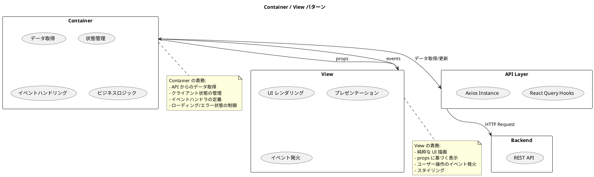
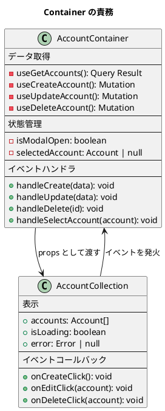
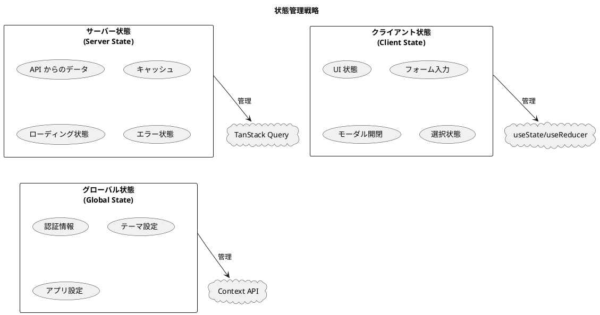
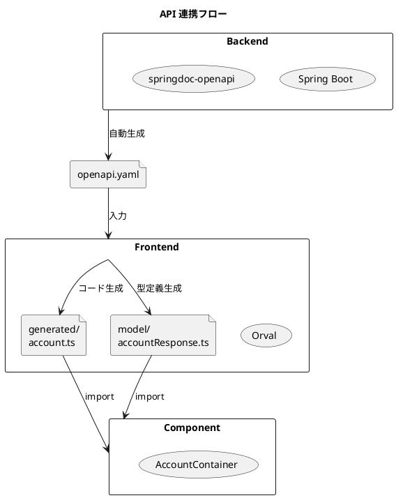
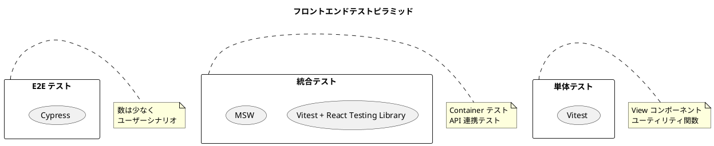

# フロントエンドアーキテクチャ設計

## 概要

本ドキュメントは、財務会計システムのフロントエンドアーキテクチャを定義します。
Container / View パターンを採用し、データ取得・状態管理とプレゼンテーションを分離します。

## アーキテクチャパターン

### Container / View パターン



### パターンの原則

| 原則 | 説明 |
|------|------|
| 関心の分離 | データロジックと表示ロジックを分離 |
| 再利用性 | View コンポーネントは異なる Container で再利用可能 |
| テスタビリティ | View は props のみに依存し、単体テストが容易 |
| 一貫性 | 状態管理パターンを統一 |

---

## ディレクトリ構成

```
src/
├── api/                              # API 層
│   ├── generated/                    # Orval 自動生成（編集禁止）
│   │   ├── account/
│   │   │   └── account.ts
│   │   ├── journal/
│   │   │   └── journal.ts
│   │   └── balance/
│   │       └── balance.ts
│   ├── model/                        # 型定義（Orval 自動生成）
│   │   ├── accountResponse.ts
│   │   ├── journalEntryResponse.ts
│   │   └── index.ts
│   └── axios-instance.ts             # Axios 設定
│
├── components/                       # Container コンポーネント
│   ├── master/                       # マスタ管理
│   │   ├── account/
│   │   │   ├── AccountContainer.tsx
│   │   │   └── AccountDetailContainer.tsx
│   │   └── accountStructure/
│   │       └── AccountStructureContainer.tsx
│   ├── journal/                      # 仕訳管理
│   │   ├── JournalEntryContainer.tsx
│   │   ├── JournalListContainer.tsx
│   │   └── JournalApprovalContainer.tsx
│   ├── ledger/                       # 元帳・残高
│   │   ├── GeneralLedgerContainer.tsx
│   │   └── TrialBalanceContainer.tsx
│   └── statement/                    # 財務諸表
│       ├── BalanceSheetContainer.tsx
│       └── IncomeStatementContainer.tsx
│
├── views/                            # View コンポーネント
│   ├── master/
│   │   ├── account/
│   │   │   ├── AccountCollection.tsx    # 一覧表示
│   │   │   ├── AccountSingle.tsx        # 詳細表示
│   │   │   ├── AccountForm.tsx          # 入力フォーム
│   │   │   └── AccountTable.tsx         # テーブル表示
│   │   └── accountStructure/
│   │       └── AccountStructureTree.tsx
│   ├── journal/
│   │   ├── JournalEntryForm.tsx
│   │   ├── JournalLineInput.tsx
│   │   ├── JournalList.tsx
│   │   └── JournalDetail.tsx
│   ├── ledger/
│   │   ├── GeneralLedgerTable.tsx
│   │   └── TrialBalanceTable.tsx
│   ├── statement/
│   │   ├── BalanceSheet.tsx
│   │   └── IncomeStatement.tsx
│   └── common/                       # 共通 View
│       ├── Loading.tsx
│       ├── ErrorMessage.tsx
│       ├── Modal.tsx
│       ├── Button.tsx
│       ├── Table.tsx
│       └── MoneyDisplay.tsx
│
├── hooks/                            # カスタムフック
│   ├── useAuth.ts
│   ├── useOptimisticUpdate.ts
│   └── useMoney.ts
│
├── providers/                        # Context Provider
│   ├── AuthProvider.tsx
│   └── ThemeProvider.tsx
│
├── pages/                            # ページコンポーネント
│   ├── LoginPage.tsx
│   ├── DashboardPage.tsx
│   ├── master/
│   │   ├── AccountPage.tsx
│   │   └── AccountDetailPage.tsx
│   ├── journal/
│   │   ├── JournalEntryPage.tsx
│   │   └── JournalListPage.tsx
│   └── statement/
│       ├── BalanceSheetPage.tsx
│       └── IncomeStatementPage.tsx
│
├── routes/                           # ルーティング設定
│   └── AppRoutes.tsx
│
├── styles/                           # スタイル
│   ├── global.css
│   └── variables.css
│
├── utils/                            # ユーティリティ
│   ├── money.ts                      # 金額計算
│   ├── date.ts                       # 日付処理
│   └── format.ts                     # フォーマット
│
├── test/                             # テスト設定
│   └── setup.ts
│
├── mocks/                            # MSW モック
│   ├── handlers.ts
│   ├── server.ts
│   └── browser.ts
│
├── App.tsx
├── main.tsx
└── queryClient.ts
```

---

## Container / View の実装

### Container コンポーネント

Container はデータ取得・状態管理を担当します。



#### Container の実装例

```typescript
// src/components/master/account/AccountContainer.tsx
import React, { useState } from 'react';
import { useQueryClient } from '@tanstack/react-query';
import {
  useGetAccounts,
  useCreateAccount,
  useUpdateAccount,
  useDeleteAccount,
  getGetAccountsQueryKey,
} from '@/api/generated/account/account';
import { AccountRequest, AccountResponse } from '@/api/model';
import { AccountCollection } from '@/views/master/account/AccountCollection';
import { AccountEditModal } from '@/views/master/account/AccountEditModal';
import { Loading } from '@/views/common/Loading';
import { ErrorMessage } from '@/views/common/ErrorMessage';

export const AccountContainer: React.FC = () => {
  const queryClient = useQueryClient();

  // サーバー状態（TanStack Query）
  const {
    data: accounts,
    isLoading,
    error,
    refetch,
  } = useGetAccounts();

  // クライアント状態（useState）
  const [isModalOpen, setIsModalOpen] = useState(false);
  const [editingAccount, setEditingAccount] = useState<AccountResponse | null>(null);

  // Mutations
  const createMutation = useCreateAccount({
    onSuccess: () => {
      queryClient.invalidateQueries({ queryKey: getGetAccountsQueryKey() });
      handleCloseModal();
    },
  });

  const updateMutation = useUpdateAccount({
    onSuccess: () => {
      queryClient.invalidateQueries({ queryKey: getGetAccountsQueryKey() });
      handleCloseModal();
    },
  });

  const deleteMutation = useDeleteAccount({
    onSuccess: () => {
      queryClient.invalidateQueries({ queryKey: getGetAccountsQueryKey() });
    },
  });

  // イベントハンドラ
  const handleCreateClick = () => {
    setEditingAccount(null);
    setIsModalOpen(true);
  };

  const handleEditClick = (account: AccountResponse) => {
    setEditingAccount(account);
    setIsModalOpen(true);
  };

  const handleDeleteClick = (account: AccountResponse) => {
    if (window.confirm(`${account.accountName} を削除しますか？`)) {
      deleteMutation.mutate({ accountCode: account.accountCode });
    }
  };

  const handleSave = (data: AccountRequest) => {
    if (editingAccount) {
      updateMutation.mutate({
        accountCode: editingAccount.accountCode,
        data,
      });
    } else {
      createMutation.mutate({ data });
    }
  };

  const handleCloseModal = () => {
    setIsModalOpen(false);
    setEditingAccount(null);
  };

  // ローディング状態
  if (isLoading) {
    return <Loading message="勘定科目を読み込み中..." />;
  }

  // エラー状態
  if (error) {
    return <ErrorMessage error={error} onRetry={() => refetch()} />;
  }

  // 正常表示
  return (
    <>
      <AccountCollection
        accounts={accounts ?? []}
        onCreateClick={handleCreateClick}
        onEditClick={handleEditClick}
        onDeleteClick={handleDeleteClick}
      />
      {isModalOpen && (
        <AccountEditModal
          account={editingAccount}
          onSave={handleSave}
          onCancel={handleCloseModal}
          isSubmitting={createMutation.isPending || updateMutation.isPending}
        />
      )}
    </>
  );
};
```

### View コンポーネント

View は純粋な UI 描画を担当します。

#### View の実装例

```typescript
// src/views/master/account/AccountCollection.tsx
import React from 'react';
import { AccountResponse } from '@/api/model';
import { AccountTable } from './AccountTable';
import { Button } from '@/views/common/Button';
import styles from './AccountCollection.module.css';

interface AccountCollectionProps {
  accounts: AccountResponse[];
  onCreateClick: () => void;
  onEditClick: (account: AccountResponse) => void;
  onDeleteClick: (account: AccountResponse) => void;
}

export const AccountCollection: React.FC<AccountCollectionProps> = ({
  accounts,
  onCreateClick,
  onEditClick,
  onDeleteClick,
}) => {
  return (
    <div className={styles.container}>
      <div className={styles.header}>
        <h2>勘定科目一覧</h2>
        <Button variant="primary" onClick={onCreateClick}>
          新規登録
        </Button>
      </div>
      <AccountTable
        accounts={accounts}
        onEdit={onEditClick}
        onDelete={onDeleteClick}
      />
    </div>
  );
};
```

```typescript
// src/views/master/account/AccountTable.tsx
import React from 'react';
import { AccountResponse } from '@/api/model';
import { Button } from '@/views/common/Button';
import styles from './AccountTable.module.css';

interface AccountTableProps {
  accounts: AccountResponse[];
  onEdit: (account: AccountResponse) => void;
  onDelete: (account: AccountResponse) => void;
}

export const AccountTable: React.FC<AccountTableProps> = ({
  accounts,
  onEdit,
  onDelete,
}) => {
  return (
    <table className={styles.table}>
      <thead>
        <tr>
          <th>コード</th>
          <th>勘定科目名</th>
          <th>区分</th>
          <th>要素</th>
          <th>操作</th>
        </tr>
      </thead>
      <tbody>
        {accounts.map((account) => (
          <tr key={account.accountCode}>
            <td>{account.accountCode}</td>
            <td>{account.accountName}</td>
            <td>{account.bsplType === 'B' ? 'B/S' : 'P/L'}</td>
            <td>{account.elementType}</td>
            <td>
              <Button size="small" onClick={() => onEdit(account)}>
                編集
              </Button>
              <Button
                size="small"
                variant="danger"
                onClick={() => onDelete(account)}
              >
                削除
              </Button>
            </td>
          </tr>
        ))}
      </tbody>
    </table>
  );
};
```

---

## 状態管理

### 状態の分類と管理戦略



| 状態の種類 | 管理方法 | 例 |
|-----------|---------|-----|
| サーバー状態 | TanStack Query | API からの勘定科目データ、仕訳データ |
| クライアント状態 | useState / useReducer | モーダル開閉、フォーム入力値 |
| グローバル状態 | Context API | 認証情報、ユーザー設定 |

### TanStack Query によるサーバー状態管理

```typescript
// src/queryClient.ts
import { QueryClient } from '@tanstack/react-query';

export const queryClient = new QueryClient({
  defaultOptions: {
    queries: {
      // キャッシュの有効期間（5分）
      staleTime: 5 * 60 * 1000,
      // ガベージコレクション期間（30分）
      gcTime: 30 * 60 * 1000,
      // リトライ回数
      retry: 1,
      // フォーカス時の再取得を無効化
      refetchOnWindowFocus: false,
    },
    mutations: {
      retry: 0,
    },
  },
});
```

### Context による認証状態管理

```typescript
// src/providers/AuthProvider.tsx
import React, { createContext, useContext, useState, useEffect } from 'react';

interface User {
  id: number;
  username: string;
  role: 'ADMIN' | 'MANAGER' | 'USER';
}

interface AuthContextType {
  user: User | null;
  isAuthenticated: boolean;
  isLoading: boolean;
  login: (username: string, password: string) => Promise<void>;
  logout: () => void;
}

const AuthContext = createContext<AuthContextType | undefined>(undefined);

export const AuthProvider: React.FC<{ children: React.ReactNode }> = ({
  children,
}) => {
  const [user, setUser] = useState<User | null>(null);
  const [isLoading, setIsLoading] = useState(true);

  useEffect(() => {
    // 初期化時にトークンを確認
    const token = localStorage.getItem('accessToken');
    if (token) {
      // トークンの検証（実装省略）
      validateToken(token).then(setUser).finally(() => setIsLoading(false));
    } else {
      setIsLoading(false);
    }
  }, []);

  const login = async (username: string, password: string) => {
    const response = await authApi.login({ username, password });
    localStorage.setItem('accessToken', response.accessToken);
    setUser(response.user);
  };

  const logout = () => {
    localStorage.removeItem('accessToken');
    setUser(null);
  };

  return (
    <AuthContext.Provider
      value={{
        user,
        isAuthenticated: !!user,
        isLoading,
        login,
        logout,
      }}
    >
      {children}
    </AuthContext.Provider>
  );
};

export const useAuth = () => {
  const context = useContext(AuthContext);
  if (!context) {
    throw new Error('useAuth must be used within AuthProvider');
  }
  return context;
};
```

---

## API 連携

### Orval による自動生成



### Axios インスタンスの設定

```typescript
// src/api/axios-instance.ts
import axios, { AxiosError, AxiosRequestConfig } from 'axios';

export const axiosInstance = axios.create({
  baseURL: import.meta.env.VITE_API_BASE_URL || '/api',
  timeout: 30000,
  headers: {
    'Content-Type': 'application/json',
  },
});

// JWT トークンの自動付与
axiosInstance.interceptors.request.use((config) => {
  const token = localStorage.getItem('accessToken');
  if (token && config.headers) {
    config.headers.Authorization = `Bearer ${token}`;
  }
  return config;
});

// エラーハンドリング
axiosInstance.interceptors.response.use(
  (response) => response,
  (error: AxiosError) => {
    if (error.response?.status === 401) {
      localStorage.removeItem('accessToken');
      window.location.href = '/login';
    }
    return Promise.reject(error);
  }
);

// Orval 用カスタムインスタンス
export const customInstance = <T>(
  config: AxiosRequestConfig,
  options?: AxiosRequestConfig
): Promise<T> => {
  return axiosInstance({ ...config, ...options }).then(({ data }) => data);
};
```

---

## 財務会計特有の考慮事項

### 金額の取り扱い

```typescript
// src/utils/money.ts
import Decimal from 'decimal.js';

// 金額計算は decimal.js を使用（浮動小数点の誤差を防ぐ）
export class Money {
  private value: Decimal;

  constructor(value: string | number) {
    this.value = new Decimal(value);
  }

  add(other: Money): Money {
    return new Money(this.value.plus(other.value).toString());
  }

  subtract(other: Money): Money {
    return new Money(this.value.minus(other.value).toString());
  }

  multiply(factor: number): Money {
    return new Money(this.value.times(factor).toString());
  }

  format(): string {
    return this.value.toNumber().toLocaleString('ja-JP');
  }

  toNumber(): number {
    return this.value.toNumber();
  }

  static zero(): Money {
    return new Money(0);
  }
}
```

### 金額表示コンポーネント

```typescript
// src/views/common/MoneyDisplay.tsx
import React from 'react';
import Decimal from 'decimal.js';
import styles from './MoneyDisplay.module.css';

interface MoneyDisplayProps {
  value: number | string;
  type?: 'debit' | 'credit' | 'neutral';
  showSign?: boolean;
}

export const MoneyDisplay: React.FC<MoneyDisplayProps> = ({
  value,
  type = 'neutral',
  showSign = false,
}) => {
  const decimal = new Decimal(value);
  const formatted = decimal.toNumber().toLocaleString('ja-JP');
  const sign = showSign && decimal.greaterThan(0) ? '+' : '';

  return (
    <span className={`${styles.money} ${styles[type]}`}>
      {sign}
      {formatted}
    </span>
  );
};
```

### 借方・貸方バランスの検証

```typescript
// src/hooks/useJournalValidation.ts
import { useMemo } from 'react';
import Decimal from 'decimal.js';

interface JournalLine {
  debitAmount: number;
  creditAmount: number;
}

export const useJournalValidation = (lines: JournalLine[]) => {
  const validation = useMemo(() => {
    const totalDebit = lines.reduce(
      (sum, line) => sum.plus(line.debitAmount),
      new Decimal(0)
    );
    const totalCredit = lines.reduce(
      (sum, line) => sum.plus(line.creditAmount),
      new Decimal(0)
    );

    const isBalanced = totalDebit.equals(totalCredit);
    const difference = totalDebit.minus(totalCredit).abs();

    return {
      totalDebit: totalDebit.toNumber(),
      totalCredit: totalCredit.toNumber(),
      isBalanced,
      difference: difference.toNumber(),
    };
  }, [lines]);

  return validation;
};
```

---

## テスト戦略

### テストピラミッド



### MSW によるモックテスト

```typescript
// src/mocks/handlers.ts
import { http, HttpResponse } from 'msw';
import type { AccountResponse } from '@/api/model';

export const handlers = [
  http.get('/api/accounts', () => {
    return HttpResponse.json<AccountResponse[]>([
      {
        accountCode: '111',
        accountName: '現金預金',
        bsplType: 'B',
        debitCreditType: '借',
        elementType: '資産',
        displayOrder: 1,
        version: 1,
      },
    ]);
  }),
];
```

### コンポーネントテスト

```typescript
// src/components/master/account/AccountContainer.test.tsx
import { render, screen, waitFor } from '@testing-library/react';
import userEvent from '@testing-library/user-event';
import { QueryClientProvider } from '@tanstack/react-query';
import { queryClient } from '@/queryClient';
import { AccountContainer } from './AccountContainer';

describe('AccountContainer', () => {
  it('勘定科目一覧が表示される', async () => {
    render(
      <QueryClientProvider client={queryClient}>
        <AccountContainer />
      </QueryClientProvider>
    );

    await waitFor(() => {
      expect(screen.getByText('現金預金')).toBeInTheDocument();
    });
  });

  it('新規登録ボタンでモーダルが開く', async () => {
    const user = userEvent.setup();
    render(
      <QueryClientProvider client={queryClient}>
        <AccountContainer />
      </QueryClientProvider>
    );

    await waitFor(() => {
      expect(screen.getByText('新規登録')).toBeInTheDocument();
    });

    await user.click(screen.getByText('新規登録'));

    expect(screen.getByRole('dialog')).toBeInTheDocument();
  });
});
```

---

## 技術スタック

| 技術 | バージョン | 用途 |
|------|-----------|------|
| React | 18.3.x | UI ライブラリ |
| TypeScript | 5.5.x | 型安全な開発 |
| Vite | 5.4.x | ビルドツール |
| TanStack Query | 5.x | サーバー状態管理 |
| React Router | 6.x | ルーティング |
| Axios | 1.7.x | HTTP クライアント |
| Orval | 7.x | API クライアント生成 |
| decimal.js | 10.x | 金額計算 |
| dayjs | 1.11.x | 日付処理 |
| Vitest | 2.x | テストフレームワーク |
| React Testing Library | 16.x | コンポーネントテスト |
| MSW | 2.x | API モック |
| Cypress | 14.x | E2E テスト |

---

## 設計原則

### コンポーネント設計原則

| 原則 | 適用 |
|------|------|
| 単一責任 | 各コンポーネントは1つの役割のみ |
| 関心の分離 | Container と View の責務分離 |
| 再利用性 | View は props のみに依存 |
| 宣言的 | 状態に基づいた UI 描画 |
| テスタビリティ | 依存を props で注入 |

### 命名規則

| 対象 | 規則 | 例 |
|------|------|-----|
| Container | 〜Container | AccountContainer |
| View（一覧） | 〜Collection | AccountCollection |
| View（詳細） | 〜Single | AccountSingle |
| View（フォーム） | 〜Form | AccountForm |
| View（テーブル） | 〜Table | AccountTable |
| Custom Hook | use〜 | useAuth, useJournalValidation |
| Context | 〜Context | AuthContext |
| Provider | 〜Provider | AuthProvider |
