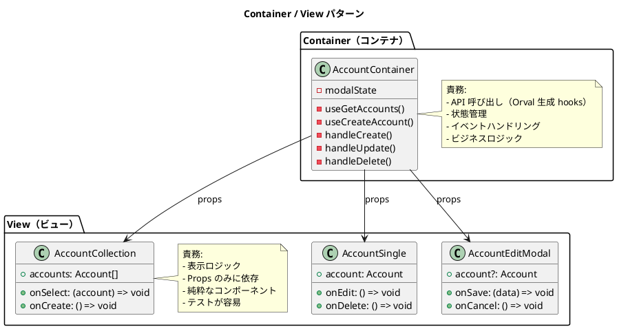
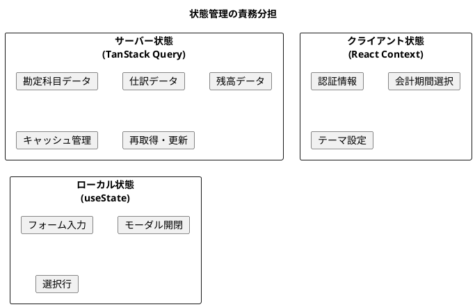
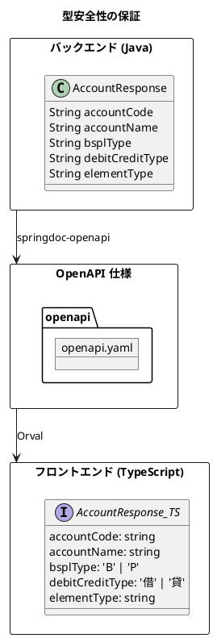
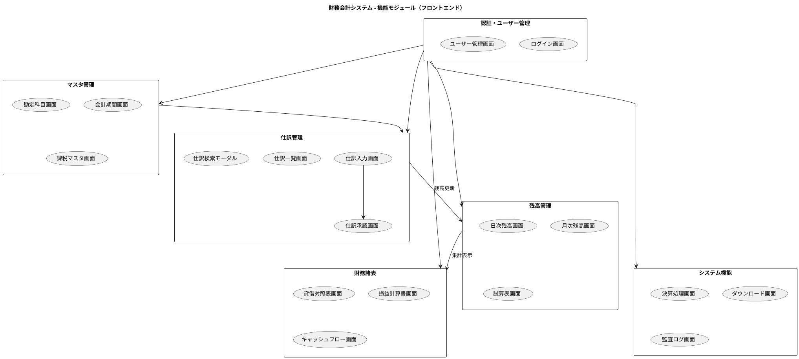
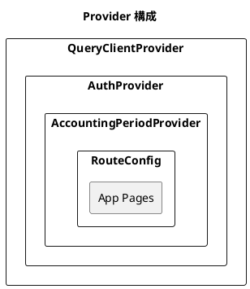
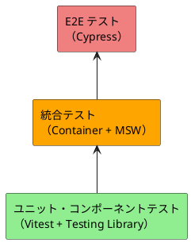

# フロントエンドアーキテクチャ設計書

## 1. 概要

本書は、財務会計システムのフロントエンドアーキテクチャ設計を定義します。

### 1.1 システム概要

| 項目 | 内容 |
|------|------|
| システム名 | 財務会計システム（フロントエンド） |
| アプリケーション種別 | SPA（Single Page Application） |
| 主要機能 | マスタ管理、仕訳入力、残高照会、財務諸表表示 |

### 1.2 技術スタック

| カテゴリ | 技術 |
|---------|------|
| 言語 | TypeScript 5.5 |
| フレームワーク | React 18.3 |
| ルーティング | React Router 6.26 |
| ビルドツール | Vite 5.4 |
| API クライアント生成 | Orval 7.0 |
| HTTP クライアント | Axios 1.7 |
| サーバー状態管理 | TanStack Query 5.0 |
| テスト | Vitest 2.0 |
| E2E テスト | Cypress 14.5 |
| API モック | MSW 2.0 |
| 日付操作 | dayjs 1.11 |
| 金額計算 | decimal.js 10.4 |
| UI ライブラリ | react-modal, react-tabs, react-icons |

---

## 2. アーキテクチャパターン

### 2.1 Container / View パターン

コンポーネントを「データ取得・状態管理」と「表示」の2つの責務に分離します。



### 2.2 責務分離

| コンポーネント種別 | 責務 | 特徴 |
|------------------|------|------|
| Container | データ取得、状態管理、イベントハンドリング | Orval hooks 使用、ビジネスロジック |
| View | 表示ロジック | Props 依存、純粋関数、テスト容易 |

---

## 3. ディレクトリ構成

### 3.1 プロジェクト構造

```
src/
├── api/                     # Orval 生成ファイル
│   ├── generated/           # 自動生成された hooks
│   │   ├── account/
│   │   ├── journal/
│   │   └── ...
│   ├── model/               # 自動生成された型定義
│   └── orval.config.ts
│
├── components/              # Container コンポーネント
│   ├── master/
│   │   ├── account/
│   │   │   └── AccountContainer.tsx
│   │   ├── accountingPeriod/
│   │   │   └── AccountingPeriodContainer.tsx
│   │   └── user/
│   │       └── UserContainer.tsx
│   ├── journal/
│   │   ├── entry/
│   │   │   └── JournalEntryContainer.tsx
│   │   └── list/
│   │       └── JournalListContainer.tsx
│   └── statement/
│       ├── balanceSheet/
│       │   └── BalanceSheetContainer.tsx
│       └── profitLoss/
│           └── ProfitLossContainer.tsx
│
├── views/                   # View コンポーネント
│   ├── master/
│   │   ├── account/
│   │   │   ├── AccountCollection.tsx
│   │   │   ├── AccountSingle.tsx
│   │   │   └── AccountEditModal.tsx
│   │   └── ...
│   ├── journal/
│   │   ├── entry/
│   │   │   ├── JournalEntryForm.tsx
│   │   │   └── JournalDetailForm.tsx
│   │   └── ...
│   ├── statement/
│   │   └── ...
│   └── common/
│       ├── Loading.tsx
│       ├── ErrorMessage.tsx
│       ├── MoneyDisplay.tsx
│       └── DateDisplay.tsx
│
├── providers/               # Context Provider
│   ├── AuthProvider.tsx
│   ├── AccountingPeriodProvider.tsx
│   └── AppProviders.tsx
│
├── hooks/                   # カスタム hooks
│   ├── useBalanceValidation.ts
│   ├── usePermission.ts
│   └── ...
│
├── utils/                   # ユーティリティ
│   ├── money.ts
│   ├── date.ts
│   ├── format.ts
│   └── typeGuards.ts
│
├── types/                   # 型定義
│   ├── auth.ts
│   ├── accountingPeriod.ts
│   └── common.ts
│
├── pages/                   # ページコンポーネント
│   ├── LoginPage.tsx
│   ├── DashboardPage.tsx
│   ├── AccountPage.tsx
│   ├── JournalPage.tsx
│   └── ...
│
├── config/                  # 設定
│   ├── constants.ts
│   ├── env.ts
│   └── routes.ts
│
├── queryClient.ts           # React Query 設定
├── RouteConfig.tsx          # ルーティング設定
└── App.tsx                  # アプリケーションエントリ
```

---

## 4. 状態管理

### 4.1 状態の分類



### 4.2 状態管理方針

| 状態の種類 | 管理方法 | 例 |
|-----------|----------|-----|
| サーバー状態 | TanStack Query（Orval 生成） | 勘定科目一覧、仕訳データ、残高データ |
| クライアント状態 | React Context | 認証情報、会計期間選択、UI テーマ |
| ローカル状態 | useState / useReducer | フォーム入力、モーダル開閉、選択行 |

### 4.3 TanStack Query 設定

```typescript
// src/queryClient.ts
export const queryClient = new QueryClient({
  defaultOptions: {
    queries: {
      staleTime: 5 * 60 * 1000,      // 5分
      gcTime: 30 * 60 * 1000,        // 30分
      retry: 1,
      refetchOnWindowFocus: false,
      refetchOnMount: false,
    },
    mutations: {
      retry: 0,
    },
  },
});
```

---

## 5. API 連携

### 5.1 OpenAPI + Orval による型安全な API 連携



### 5.2 自動生成されるファイル

| ファイル | 内容 |
|---------|------|
| `api/generated/{resource}/{resource}.ts` | React Query hooks |
| `api/model/{type}.ts` | TypeScript 型定義 |

### 5.3 Orval 設定

```typescript
// orval.config.ts
export default {
  accounting: {
    input: {
      target: './openapi.yaml',
    },
    output: {
      mode: 'tags-split',
      target: 'src/api/generated',
      schemas: 'src/api/model',
      client: 'react-query',
      httpClient: 'axios',
    },
  },
};
```

---

## 6. コンポーネント設計

### 6.1 命名規則

| 種類 | 命名規則 | 例 |
|------|---------|-----|
| Container | `〇〇Container` | `AccountContainer` |
| 一覧 View | `〇〇Collection` | `AccountCollection` |
| 詳細 View | `〇〇Single` | `AccountSingle` |
| 編集モーダル | `〇〇EditModal` | `AccountEditModal` |
| 検索モーダル | `〇〇SearchModal` | `JournalSearchModal` |
| フォーム | `〇〇Form` | `JournalEntryForm` |

### 6.2 Props 設計原則

```typescript
// 良い例: データと関数を明確に分離
interface AccountCollectionProps {
  // データ Props
  accounts: AccountResponse[];
  selectedAccountCode?: string;

  // 関数 Props
  onSelect: (account: AccountResponse) => void;
  onCreate: () => void;
}
```

### 6.3 ファイル構成

```
src/views/master/account/
├── AccountCollection.tsx      # コンポーネント
├── AccountCollection.css      # スタイル
├── AccountCollection.test.tsx # テスト
└── index.ts                   # エクスポート
```

---

## 7. 機能モジュール

### 7.1 機能構成



### 7.2 ルーティング設計

| パス | ページ | 機能 |
|-----|--------|------|
| `/login` | LoginPage | ログイン |
| `/` | DashboardPage | ダッシュボード |
| `/accounts` | AccountPage | 勘定科目管理 |
| `/journals` | JournalListPage | 仕訳一覧 |
| `/journals/new` | JournalEntryPage | 仕訳入力 |
| `/journals/:id` | JournalDetailPage | 仕訳詳細 |
| `/balances/daily` | DailyBalancePage | 日次残高 |
| `/balances/monthly` | MonthlyBalancePage | 月次残高 |
| `/trial-balance` | TrialBalancePage | 試算表 |
| `/statements/bs` | BalanceSheetPage | 貸借対照表 |
| `/statements/pl` | ProfitLossPage | 損益計算書 |

---

## 8. 財務会計特有の考慮事項

### 8.1 金額計算の精度

JavaScript の浮動小数点演算ではなく、decimal.js を使用します。

```typescript
// src/utils/money.ts
import Decimal from 'decimal.js';

export type Money = {
  amount: Decimal;
  currency: string;
};

export const createMoney = (
  amount: number | string,
  currency: string = 'JPY'
): Money => ({
  amount: new Decimal(amount),
  currency,
});

export const addMoney = (a: Money, b: Money): Money => {
  if (a.currency !== b.currency) {
    throw new Error('通貨が異なります');
  }
  return {
    amount: a.amount.plus(b.amount),
    currency: a.currency,
  };
};

export const formatMoney = (money: Money): string => {
  const formatted = money.amount
    .toFixed(0)
    .replace(/\B(?=(\d{3})+(?!\d))/g, ',');
  return `¥${formatted}`;
};
```

### 8.2 貸借バランス検証

```typescript
// src/hooks/useBalanceValidation.ts
interface BalanceValidationResult {
  totalDebit: Decimal;
  totalCredit: Decimal;
  difference: Decimal;
  isBalanced: boolean;
}

export const useBalanceValidation = (
  details: JournalDetail[]
): BalanceValidationResult => {
  return useMemo(() => {
    const totalDebit = details.reduce((sum, d) => {
      return sum.plus(new Decimal(d.debitAmount ?? 0));
    }, new Decimal(0));

    const totalCredit = details.reduce((sum, d) => {
      return sum.plus(new Decimal(d.creditAmount ?? 0));
    }, new Decimal(0));

    const difference = totalDebit.minus(totalCredit).abs();
    const isBalanced = difference.isZero();

    return { totalDebit, totalCredit, difference, isBalanced };
  }, [details]);
};
```

### 8.3 権限による表示制御

```typescript
// src/hooks/usePermission.ts
type Permission =
  | 'account:read'
  | 'account:write'
  | 'journal:read'
  | 'journal:write'
  | 'journal:approve'
  | 'statement:read'
  | 'closing:execute'
  | 'admin:all';

export const usePermission = () => {
  const { user, hasRole } = useAuth();

  const hasPermission = (permission: Permission): boolean => {
    if (!user) return false;
    if (hasRole('admin')) return true;
    // ロールに基づく権限チェック
    return user.roles.some((role) => {
      const permissions = rolePermissions[role];
      return permissions?.includes(permission);
    });
  };

  return { hasPermission };
};
```

---

## 9. Provider 構成

### 9.1 Provider ツリー



### 9.2 App.tsx 構成

```typescript
// src/App.tsx
export const App: React.FC = () => (
  <QueryClientProvider client={queryClient}>
    <AuthProvider>
      <AccountingPeriodProvider>
        <RouteConfig />
      </AccountingPeriodProvider>
    </AuthProvider>
    <ReactQueryDevtools initialIsOpen={false} />
  </QueryClientProvider>
);
```

---

## 10. テスト戦略

### 10.1 テスト種別

| テスト種別 | 対象 | ツール |
|-----------|------|--------|
| ユニットテスト | hooks、ユーティリティ | Vitest |
| コンポーネントテスト | View コンポーネント | Testing Library |
| 統合テスト | Container + View | Testing Library + MSW |
| E2E テスト | 業務フロー | Cypress |

### 10.2 テストピラミッド



### 10.3 MSW による API モック

```typescript
// src/mocks/handlers.ts
import { rest } from 'msw';

export const handlers = [
  rest.get('/api/accounts', (req, res, ctx) => {
    return res(
      ctx.json([
        { accountCode: '100', accountName: '現金', bsplType: 'B' },
        { accountCode: '200', accountName: '売上高', bsplType: 'P' },
      ])
    );
  }),
];
```

---

## 11. パフォーマンス最適化

### 11.1 遅延読み込み

```typescript
// ページの遅延読み込み
const JournalPage = lazy(() => import('./pages/JournalPage'));
const BalanceSheetPage = lazy(() => import('./pages/BalanceSheetPage'));

function App() {
  return (
    <Suspense fallback={<Loading />}>
      <Routes>
        <Route path="/journals" element={<JournalPage />} />
        <Route path="/statements/bs" element={<BalanceSheetPage />} />
      </Routes>
    </Suspense>
  );
}
```

### 11.2 メモ化

```typescript
// 高コストな計算のメモ化
const ExpensiveList = memo(function ExpensiveList({ items, filter }) {
  const filteredItems = useMemo(
    () => items.filter(item => item.type === filter),
    [items, filter]
  );

  return (
    <ul>
      {filteredItems.map(item =>
        <ExpensiveListItem key={item.id} item={item} />
      )}
    </ul>
  );
});
```

### 11.3 React Query キャッシュ

```typescript
// マスタデータは長めにキャッシュ
const { data: accounts } = useGetAccounts({
  staleTime: 10 * 60 * 1000, // 10分
});

// 頻繁に更新されるデータは短めに
const { data: journals } = useGetJournalEntries({
  staleTime: 1 * 60 * 1000, // 1分
});
```

---

## 12. トレーサビリティ

### 12.1 要件からの追跡

| 要件 ID | ユースケース | 画面 |
|---------|-------------|------|
| UC01 | 仕訳を入力する | JournalEntryPage |
| UC02 | 仕訳を承認する | JournalApprovalPage |
| UC03 | 勘定科目を管理する | AccountPage |
| UC04 | 残高を照会する | BalancePage |
| UC05 | 試算表を出力する | TrialBalancePage |
| UC06 | 財務諸表を出力する | BalanceSheetPage, ProfitLossPage |

### 12.2 バックエンドとの対応関係

| フロントエンド章 | バックエンド章 | 連携機能 |
|----------------|--------------|----------|
| 第3章 OpenAPI/Orval | - | API 仕様連携 |
| 第8章 認証 | 第25章 認証・認可 | JWT 認証 |
| 第9章 勘定科目 | 第9章 勘定科目マスタ | 勘定科目 CRUD |
| 第11-13章 仕訳 | 第13-15章 仕訳管理 | 仕訳 CRUD、承認 |
| 第14-16章 残高 | 第16-18章 残高更新 | 残高照会 |
| 第17-19章 財務諸表 | 第19-21章 財務諸表 | 帳票表示 |

---

## 13. 参考資料

- [第4章: アーキテクチャ設計](../article/frontend/chapter04.md)
- [アーキテクチャ設計ガイド](../reference/アーキテクチャ設計ガイド.md)
- [要件定義書](../requirements/requirements_definition.md)
- [システムユースケース](../requirements/system_usecase.md)
