# インフラストラクチャアーキテクチャ設計書

## 1. 概要

本書は、財務会計システムのインフラストラクチャアーキテクチャ設計を定義します。

### 1.1 システム概要

| 項目 | 内容 |
|------|------|
| システム名 | 財務会計システム |
| デプロイメント形態 | コンテナオーケストレーション |
| 可用性要件 | 99.9%（年間ダウンタイム 8.76 時間以内） |
| データ保持期間 | 7 年（法定保存期間） |

### 1.2 技術スタック

| カテゴリ | 技術 |
|---------|------|
| コンテナ | Docker |
| オーケストレーション | Kubernetes / Docker Compose |
| CI/CD | GitHub Actions |
| インフラコード | Terraform / Docker Compose |
| ロードバランサー | Nginx / AWS ALB |
| データベース | PostgreSQL |
| キャッシュ | Redis（オプション） |
| 監視 | Prometheus + Grafana |
| ログ管理 | Fluentd + Elasticsearch + Kibana |

---

## 2. 全体構成

### 2.1 システムアーキテクチャ

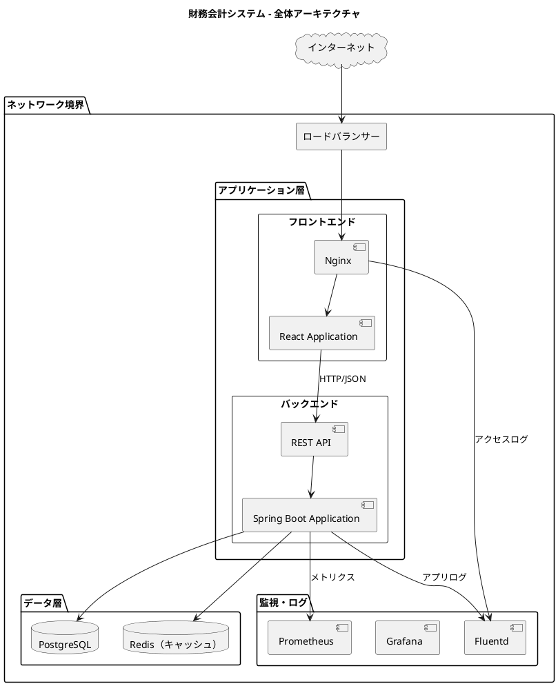

### 2.2 コンポーネント責務

| コンポーネント | 責務 |
|---------------|------|
| ロードバランサー | 負荷分散、SSL 終端、ヘルスチェック |
| Nginx | 静的ファイル配信、リバースプロキシ |
| React Application | フロントエンド SPA |
| Spring Boot Application | バックエンド API サーバー |
| PostgreSQL | データ永続化 |
| Redis | セッションキャッシュ、クエリキャッシュ |
| Prometheus/Grafana | メトリクス収集・可視化 |
| Fluentd | ログ収集・転送 |

---

## 3. デプロイメントアーキテクチャ

### 3.1 コンテナ構成

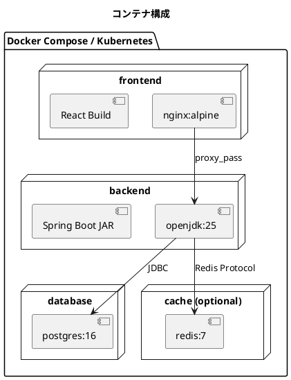

### 3.2 Docker Compose 構成

```yaml
# docker-compose.yml
version: '3.8'

services:
  frontend:
    build:
      context: ./frontend
      dockerfile: Dockerfile
    ports:
      - "80:80"
      - "443:443"
    depends_on:
      - backend
    networks:
      - app-network

  backend:
    build:
      context: ./backend
      dockerfile: Dockerfile
    environment:
      - SPRING_PROFILES_ACTIVE=production
      - DATABASE_URL=jdbc:postgresql://database:5432/accounting
    depends_on:
      - database
    networks:
      - app-network

  database:
    image: postgres:16-alpine
    environment:
      - POSTGRES_DB=accounting
      - POSTGRES_USER=app_user
      - POSTGRES_PASSWORD_FILE=/run/secrets/db_password
    volumes:
      - db-data:/var/lib/postgresql/data
    secrets:
      - db_password
    networks:
      - app-network

networks:
  app-network:
    driver: bridge

volumes:
  db-data:

secrets:
  db_password:
    file: ./secrets/db_password.txt
```

### 3.3 環境構成

| 環境 | 用途 | 構成 |
|------|------|------|
| 開発環境 | ローカル開発 | Docker Compose（単一ノード） |
| ステージング環境 | 結合テスト・受け入れテスト | Kubernetes（3 ノード） |
| 本番環境 | 商用運用 | Kubernetes（3 ノード以上） |

---

## 4. ネットワークアーキテクチャ

### 4.1 ネットワーク構成

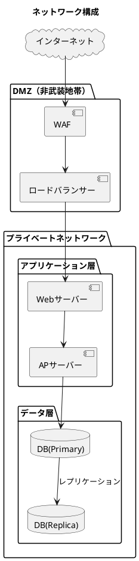

### 4.2 ポート構成

| サービス | ポート | プロトコル | 説明 |
|---------|-------|----------|------|
| フロントエンド | 80, 443 | HTTP/HTTPS | Web アクセス |
| バックエンド | 8080 | HTTP | API エンドポイント |
| PostgreSQL | 5432 | TCP | データベース接続 |
| Redis | 6379 | TCP | キャッシュ接続 |
| Prometheus | 9090 | HTTP | メトリクス収集 |
| Grafana | 3000 | HTTP | 監視ダッシュボード |

### 4.3 セキュリティグループ

| グループ | インバウンド | アウトバウンド |
|---------|------------|--------------|
| frontend-sg | 80/443 from internet | backend-sg:8080 |
| backend-sg | 8080 from frontend-sg | database-sg:5432, cache-sg:6379 |
| database-sg | 5432 from backend-sg | なし |
| cache-sg | 6379 from backend-sg | なし |

---

## 5. スケーリング戦略

### 5.1 水平スケーリング

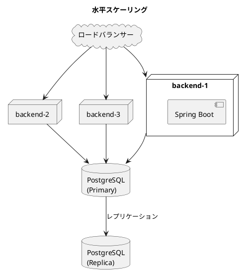

### 5.2 オートスケーリング設定

| メトリクス | 閾値 | アクション |
|-----------|------|----------|
| CPU 使用率 | > 70% | スケールアウト（+1 Pod） |
| CPU 使用率 | < 30% | スケールイン（-1 Pod） |
| メモリ使用率 | > 80% | スケールアウト（+1 Pod） |
| リクエスト数 | > 1000 req/s | スケールアウト（+2 Pod） |

### 5.3 リソース制限

```yaml
# Kubernetes resource limits
resources:
  requests:
    memory: "512Mi"
    cpu: "250m"
  limits:
    memory: "2Gi"
    cpu: "1000m"
```

---

## 6. 可用性設計

### 6.1 可用性目標

| 指標 | 目標値 |
|------|--------|
| 可用性 | 99.9% |
| MTBF（平均故障間隔） | 720 時間以上 |
| MTTR（平均復旧時間） | 30 分以内 |

### 6.2 冗長構成

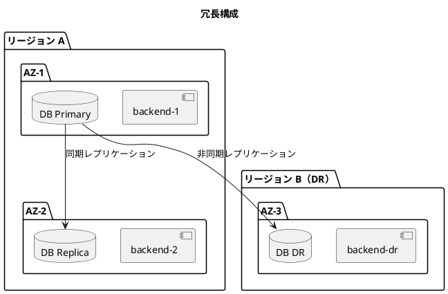

### 6.3 ヘルスチェック

| 対象 | エンドポイント | 間隔 | タイムアウト |
|------|--------------|------|------------|
| バックエンド | /actuator/health | 30 秒 | 10 秒 |
| フロントエンド | /health | 30 秒 | 5 秒 |
| データベース | PostgreSQL プローブ | 10 秒 | 5 秒 |

---

## 7. バックアップ・災害復旧

### 7.1 バックアップ戦略

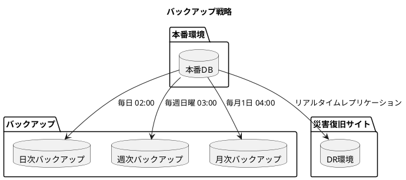

### 7.2 RPO/RTO 目標

| 指標 | 目標値 | 説明 |
|------|--------|------|
| RPO（Recovery Point Objective） | 1 時間 | 最大データ損失許容時間 |
| RTO（Recovery Time Objective） | 4 時間 | サービス復旧目標時間 |

### 7.3 バックアップスケジュール

| 種別 | 頻度 | 保持期間 | 保存先 |
|------|------|---------|-------|
| 日次フルバックアップ | 毎日 02:00 | 7 日間 | ローカル + オブジェクトストレージ |
| 週次フルバックアップ | 毎週日曜 03:00 | 4 週間 | オブジェクトストレージ |
| 月次フルバックアップ | 毎月 1 日 04:00 | 12 ヶ月 | オブジェクトストレージ（アーカイブ） |
| トランザクションログ | 継続的 | 7 日間 | ローカル |

---

## 8. セキュリティ

### 8.1 多層防御アーキテクチャ

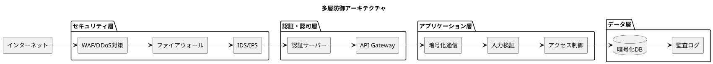

### 8.2 セキュリティ対策

| 領域 | 対策 | 実装 |
|------|------|------|
| ネットワーク | TLS 1.3、WAF | Let's Encrypt、ModSecurity |
| 認証・認可 | JWT、RBAC | Spring Security |
| データ保護 | 暗号化（保管時・転送時） | PostgreSQL pgcrypto、TLS |
| 監査 | アクセスログ、変更履歴 | Spring Audit、PostgreSQL |

### 8.3 認証・認可設計

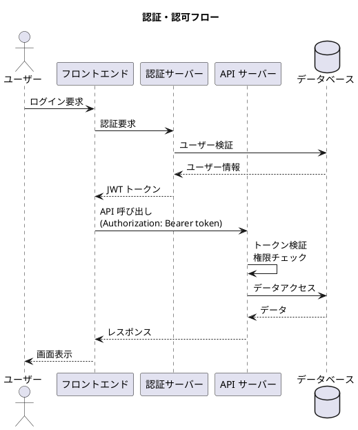

---

## 9. 監視・ログ管理

### 9.1 監視アーキテクチャ

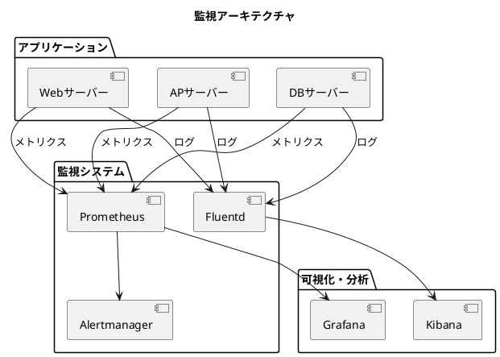

### 9.2 監視対象と指標

| カテゴリ | 監視項目 | 閾値 |
|---------|---------|------|
| インフラ | CPU 使用率 | > 80% で警告 |
| インフラ | メモリ使用率 | > 85% で警告 |
| インフラ | ディスク使用率 | > 80% で警告 |
| アプリ | レスポンスタイム | > 3 秒で警告 |
| アプリ | エラー率 | > 1% で警告 |
| DB | コネクション数 | > 80% で警告 |
| DB | レプリケーション遅延 | > 5 秒で警告 |

### 9.3 ログレベル

| レベル | 用途 | 例 |
|--------|------|-----|
| ERROR | システムエラー、例外 | データベース接続失敗 |
| WARN | 警告、異常な状態 | リトライ発生、遅延 |
| INFO | 業務処理の記録 | 仕訳登録完了、ログイン成功 |
| DEBUG | デバッグ情報 | SQL クエリ、パラメータ |

---

## 10. CI/CD パイプライン

### 10.1 パイプライン構成

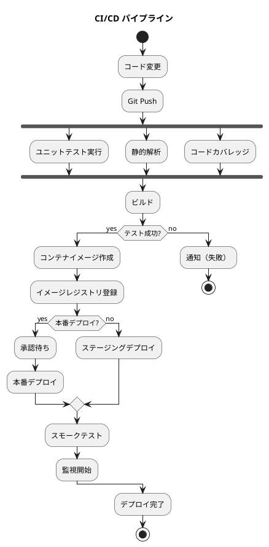

### 10.2 GitHub Actions ワークフロー

```yaml
# .github/workflows/ci-cd.yml
name: CI/CD Pipeline

on:
  push:
    branches: [main, develop]
  pull_request:
    branches: [main]

jobs:
  test:
    runs-on: ubuntu-latest
    steps:
      - uses: actions/checkout@v4
      - name: Set up JDK 25
        uses: actions/setup-java@v4
        with:
          java-version: '25'
          distribution: 'temurin'
      - name: Run tests
        run: ./gradlew test

  build:
    needs: test
    runs-on: ubuntu-latest
    steps:
      - uses: actions/checkout@v4
      - name: Build Docker image
        run: docker build -t accounting-app .
      - name: Push to registry
        run: docker push $REGISTRY/accounting-app:$VERSION

  deploy-staging:
    needs: build
    runs-on: ubuntu-latest
    if: github.ref == 'refs/heads/develop'
    steps:
      - name: Deploy to staging
        run: kubectl apply -f k8s/staging/

  deploy-production:
    needs: build
    runs-on: ubuntu-latest
    if: github.ref == 'refs/heads/main'
    environment: production
    steps:
      - name: Deploy to production
        run: kubectl apply -f k8s/production/
```

### 10.3 デプロイメント戦略

| 戦略 | 説明 | 適用場面 |
|------|------|---------|
| ローリングアップデート | 段階的にインスタンスを更新 | 通常リリース |
| ブルーグリーン | 新旧環境を並行運用 | メジャーリリース |
| カナリア | 一部ユーザーに先行リリース | リスクの高い変更 |

---

## 11. コスト最適化

### 11.1 リソース見積もり

| リソース | 開発環境 | ステージング | 本番 |
|---------|---------|-------------|------|
| フロントエンド | 1 Pod (256Mi) | 2 Pod (512Mi) | 3 Pod (1Gi) |
| バックエンド | 1 Pod (512Mi) | 2 Pod (1Gi) | 3 Pod (2Gi) |
| データベース | 1 インスタンス (1GB) | 1 インスタンス (4GB) | 2 インスタンス (8GB) |
| ストレージ | 10GB | 50GB | 200GB |

### 11.2 コスト削減策

| 施策 | 削減効果 | 適用条件 |
|------|---------|---------|
| リザーブドインスタンス | 40-60% | 長期運用が確定 |
| スポットインスタンス | 70-90% | バッチ処理、開発環境 |
| オートスケーリング | 30-50% | 負荷変動が大きい |
| ストレージ最適化 | 30-60% | ライフサイクル管理 |

---

## 12. 運用手順

### 12.1 日常運用

| 作業 | 頻度 | 担当 |
|------|------|------|
| ログ確認 | 毎日 | 運用チーム |
| バックアップ確認 | 毎日 | 運用チーム |
| メトリクス確認 | 毎日 | 運用チーム |
| セキュリティパッチ適用 | 週次 | インフラチーム |
| 容量計画見直し | 月次 | インフラチーム |

### 12.2 障害対応フロー

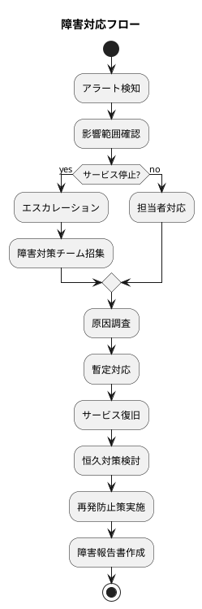

---

## 13. トレーサビリティ

### 13.1 非機能要件からの追跡

| 要件 ID | 要件 | 対応設計 |
|---------|------|---------|
| NFR-001 | 可用性 99.9% | 冗長構成、オートスケーリング |
| NFR-002 | レスポンス 3 秒以内 | キャッシュ、CDN |
| NFR-003 | データ 7 年保持 | バックアップ、アーカイブ |
| NFR-004 | 監査証跡 | アクセスログ、変更履歴 |
| NFR-005 | セキュリティ | TLS、認証・認可、WAF |

### 13.2 アーキテクチャ決定記録（ADR）

| ADR | 決定事項 | 理由 |
|-----|---------|------|
| ADR-101 | コンテナ化（Docker） | 環境の再現性、デプロイの簡素化 |
| ADR-102 | Kubernetes 採用 | オートスケーリング、高可用性 |
| ADR-103 | PostgreSQL 採用 | ACID 準拠、会計データの整合性 |
| ADR-104 | GitHub Actions 採用 | CI/CD の自動化、GitHub 統合 |

---

## 14. 参考資料

- [アーキテクチャ設計ガイド](../reference/アーキテクチャ設計ガイド.md)
- [非機能要件定義ガイド](../reference/非機能要件定義ガイド.md)
- [要件定義書](../requirements/requirements_definition.md)
- [バックエンドアーキテクチャ設計書](./architecture_backend.md)
- [フロントエンドアーキテクチャ設計書](./architecture_frontend.md)
