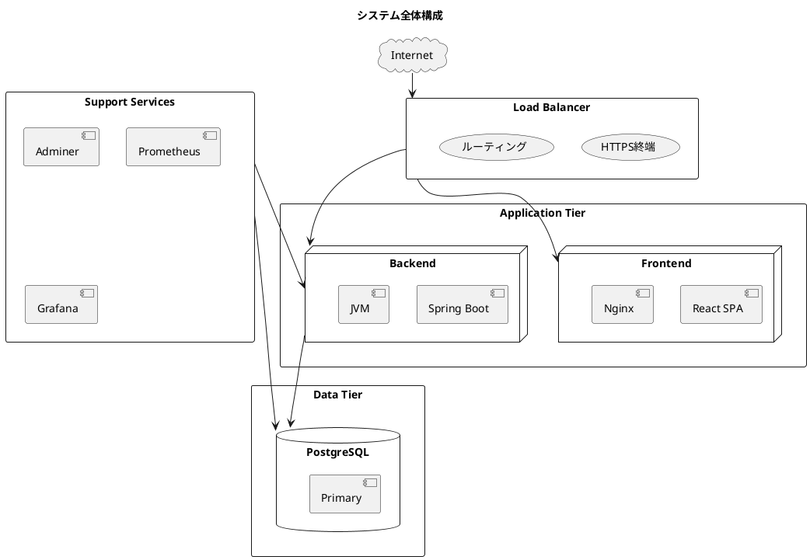
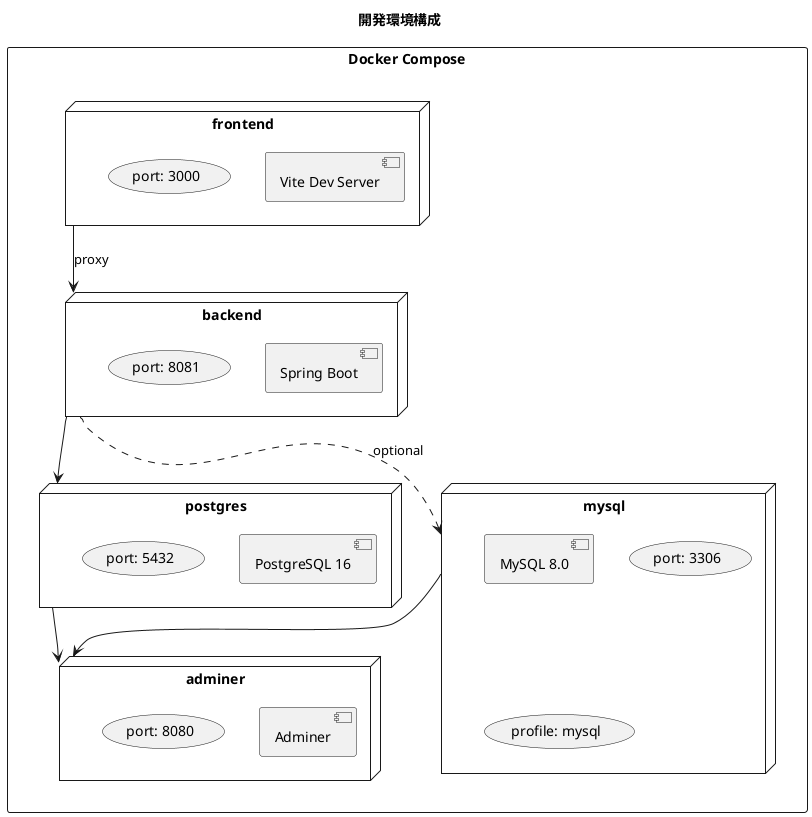
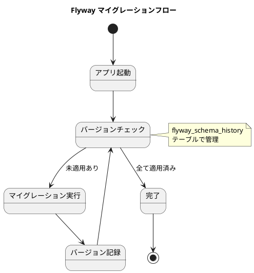
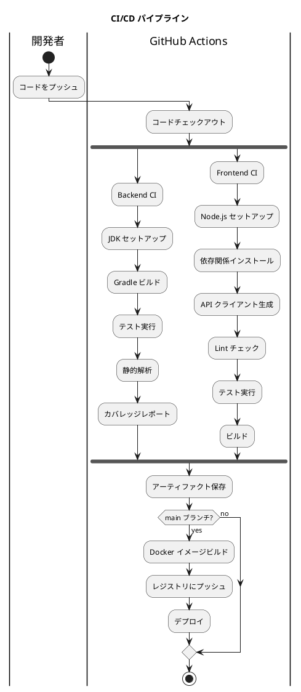
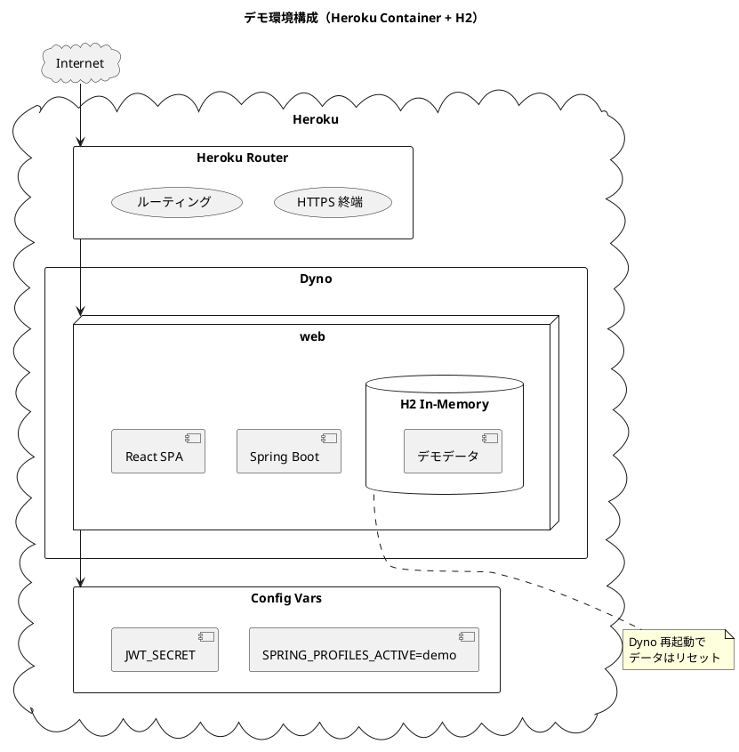
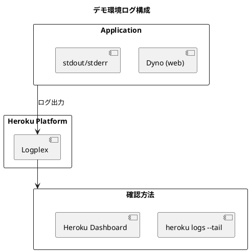
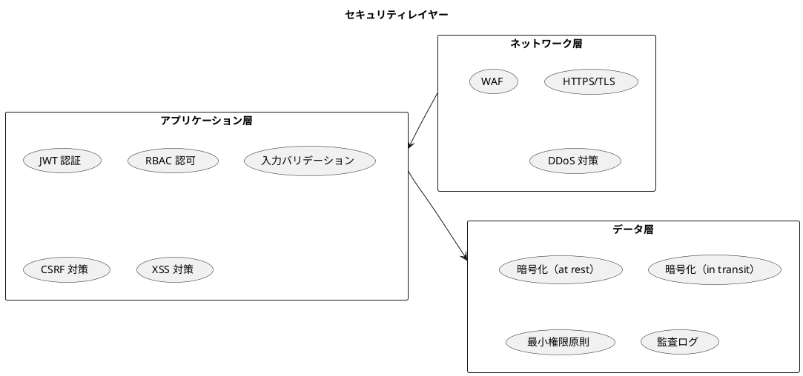

# インフラストラクチャアーキテクチャ設計

## 概要

本ドキュメントは、財務会計システムのインフラストラクチャアーキテクチャを定義します。
開発環境から本番環境まで、一貫した構成管理とデプロイメント戦略を提供します。

## システム構成

### 全体構成図



---

## 開発環境

### Docker Compose 構成



### docker-compose.yml

```yaml
services:
  # PostgreSQL データベース
  postgres:
    image: postgres:16-alpine
    container_name: accounting-postgres
    restart: unless-stopped
    environment:
      POSTGRES_USER: ${POSTGRES_USER:-postgres}
      POSTGRES_PASSWORD: ${POSTGRES_PASSWORD:-postgres}
      POSTGRES_DB: ${POSTGRES_DB:-accounting_system}
      TZ: 'Asia/Tokyo'
    ports:
      - "${POSTGRES_PORT:-5432}:5432"
    volumes:
      - postgres_data:/var/lib/postgresql/data
      - ./docker/postgres/init:/docker-entrypoint-initdb.d
    healthcheck:
      test: ["CMD-SHELL", "pg_isready -U ${POSTGRES_USER:-postgres}"]
      interval: 10s
      timeout: 5s
      retries: 5
    networks:
      - accounting-network

  # MySQL データベース（代替オプション）
  mysql:
    image: mysql:8.0
    container_name: accounting-mysql
    restart: unless-stopped
    profiles:
      - mysql
    environment:
      MYSQL_ROOT_PASSWORD: ${MYSQL_ROOT_PASSWORD:-root}
      MYSQL_DATABASE: ${MYSQL_DATABASE:-accounting_system}
      MYSQL_USER: ${MYSQL_USER:-user}
      MYSQL_PASSWORD: ${MYSQL_PASSWORD:-password}
      TZ: 'Asia/Tokyo'
    ports:
      - "${MYSQL_PORT:-3306}:3306"
    volumes:
      - mysql_data:/var/lib/mysql
      - ./docker/mysql/init:/docker-entrypoint-initdb.d
    healthcheck:
      test: ["CMD", "mysqladmin", "ping", "-h", "localhost"]
      interval: 10s
      timeout: 5s
      retries: 5
    networks:
      - accounting-network

  # データベース管理ツール
  adminer:
    image: adminer:latest
    container_name: accounting-adminer
    restart: unless-stopped
    ports:
      - "${ADMINER_PORT:-8080}:8080"
    environment:
      ADMINER_DEFAULT_SERVER: postgres
    networks:
      - accounting-network
    depends_on:
      - postgres

  # バックエンドアプリケーション
  backend:
    build:
      context: ./backend
      dockerfile: Dockerfile.dev
    container_name: accounting-backend
    restart: unless-stopped
    environment:
      SPRING_PROFILES_ACTIVE: dev
      SPRING_DATASOURCE_URL: jdbc:postgresql://postgres:5432/accounting_system
      SPRING_DATASOURCE_USERNAME: postgres
      SPRING_DATASOURCE_PASSWORD: postgres
    ports:
      - "${BACKEND_PORT:-8081}:8080"
    volumes:
      - ./backend:/app
      - gradle_cache:/home/gradle/.gradle
    depends_on:
      postgres:
        condition: service_healthy
    networks:
      - accounting-network

  # フロントエンドアプリケーション
  frontend:
    build:
      context: ./frontend
      dockerfile: Dockerfile.dev
    container_name: accounting-frontend
    restart: unless-stopped
    environment:
      VITE_API_BASE_URL: http://backend:8080/api
    ports:
      - "${FRONTEND_PORT:-3000}:3000"
    volumes:
      - ./frontend:/app
      - /app/node_modules
    depends_on:
      - backend
    networks:
      - accounting-network

volumes:
  postgres_data:
  mysql_data:
  gradle_cache:

networks:
  accounting-network:
    driver: bridge
```

### 環境変数設定

**.env**:

```bash
# PostgreSQL
POSTGRES_USER=postgres
POSTGRES_PASSWORD=postgres
POSTGRES_DB=accounting_system
POSTGRES_PORT=5432

# MySQL（代替オプション）
MYSQL_ROOT_PASSWORD=root
MYSQL_DATABASE=accounting_system
MYSQL_USER=user
MYSQL_PASSWORD=password
MYSQL_PORT=3306

# Application Ports
BACKEND_PORT=8081
FRONTEND_PORT=3000
ADMINER_PORT=8080

# Application Settings
SPRING_PROFILES_ACTIVE=dev
```

---

## データベース設計

### Flyway マイグレーション管理



### マイグレーションファイル構成

```
src/main/resources/db/migration/
├── V001__create_account_master.sql
├── V002__create_account_structure.sql
├── V003__create_journal_tables.sql
├── V004__create_balance_tables.sql
├── V005__create_user_tables.sql
├── V006__create_audit_log.sql
└── V007__insert_initial_data.sql
```

### マイグレーションファイル例

```sql
-- V001__create_account_master.sql

-- 勘定科目種別の enum 型
DO $$ BEGIN
    CREATE TYPE account_type AS ENUM ('資産', '負債', '純資産', '収益', '費用');
EXCEPTION
    WHEN duplicate_object THEN null;
END $$;

-- 勘定科目マスタ
CREATE TABLE IF NOT EXISTS account (
    account_id UUID PRIMARY KEY DEFAULT gen_random_uuid(),
    account_code VARCHAR(20) UNIQUE NOT NULL,
    account_name VARCHAR(100) NOT NULL,
    account_abbr VARCHAR(50),
    account_kana VARCHAR(100),
    account_type account_type NOT NULL,
    bs_pl_type CHAR(1) NOT NULL CHECK (bs_pl_type IN ('B', 'P')),
    debit_credit_type CHAR(1) NOT NULL CHECK (debit_credit_type IN ('借', '貸')),
    display_order INT NOT NULL DEFAULT 0,
    is_active BOOLEAN NOT NULL DEFAULT TRUE,
    version INT NOT NULL DEFAULT 0,
    created_at TIMESTAMP NOT NULL DEFAULT CURRENT_TIMESTAMP,
    updated_at TIMESTAMP NOT NULL DEFAULT CURRENT_TIMESTAMP
);

-- インデックス
CREATE INDEX idx_account_code ON account(account_code);
CREATE INDEX idx_account_type ON account(account_type);
CREATE INDEX idx_account_active ON account(is_active);

-- テーブルコメント
COMMENT ON TABLE account IS '勘定科目マスタ';
COMMENT ON COLUMN account.account_id IS '勘定科目ID（主キー）';
COMMENT ON COLUMN account.account_code IS '勘定科目コード';
COMMENT ON COLUMN account.account_name IS '勘定科目名';
COMMENT ON COLUMN account.account_type IS '勘定科目種別（資産/負債/純資産/収益/費用）';
COMMENT ON COLUMN account.bs_pl_type IS 'BS/PL区分（B:貸借対照表、P:損益計算書）';
COMMENT ON COLUMN account.debit_credit_type IS '貸借区分（借:借方、貸:貸方）';
COMMENT ON COLUMN account.version IS '楽観的ロック用バージョン';
```

---

## CI/CD パイプライン

### GitHub Actions ワークフロー



### バックエンド CI

```yaml
# .github/workflows/backend-ci.yml
name: Backend CI

on:
  push:
    branches: [main, develop]
    paths:
      - 'backend/**'
  pull_request:
    branches: [main]
    paths:
      - 'backend/**'

jobs:
  build:
    runs-on: ubuntu-latest

    services:
      postgres:
        image: postgres:16-alpine
        env:
          POSTGRES_USER: postgres
          POSTGRES_PASSWORD: postgres
          POSTGRES_DB: test_db
        ports:
          - 5432:5432
        options: >-
          --health-cmd pg_isready
          --health-interval 10s
          --health-timeout 5s
          --health-retries 5

    steps:
      - uses: actions/checkout@v4

      - name: Set up JDK 25
        uses: actions/setup-java@v4
        with:
          java-version: '25'
          distribution: 'temurin'

      - name: Setup Gradle
        uses: gradle/gradle-build-action@v3

      - name: Build with Gradle
        working-directory: ./backend
        run: ./gradlew build -x test

      - name: Run tests
        working-directory: ./backend
        run: ./gradlew test
        env:
          SPRING_DATASOURCE_URL: jdbc:postgresql://localhost:5432/test_db
          SPRING_DATASOURCE_USERNAME: postgres
          SPRING_DATASOURCE_PASSWORD: postgres

      - name: Run static analysis
        working-directory: ./backend
        run: ./gradlew check

      - name: Generate coverage report
        working-directory: ./backend
        run: ./gradlew jacocoTestReport

      - name: Upload coverage report
        uses: actions/upload-artifact@v4
        with:
          name: backend-coverage-report
          path: backend/build/reports/jacoco/test/html
```

### フロントエンド CI

```yaml
# .github/workflows/frontend-ci.yml
name: Frontend CI

on:
  push:
    branches: [main, develop]
    paths:
      - 'frontend/**'
      - 'openapi.yaml'
  pull_request:
    branches: [main]
    paths:
      - 'frontend/**'
      - 'openapi.yaml'

jobs:
  build:
    runs-on: ubuntu-latest

    steps:
      - uses: actions/checkout@v4

      - name: Setup Node.js
        uses: actions/setup-node@v4
        with:
          node-version: '20'
          cache: 'npm'
          cache-dependency-path: frontend/package-lock.json

      - name: Install dependencies
        working-directory: ./frontend
        run: npm ci

      - name: Generate API client
        working-directory: ./frontend
        run: npm run api:generate

      - name: Lint check
        working-directory: ./frontend
        run: npm run lint

      - name: Type check
        working-directory: ./frontend
        run: npm run type-check

      - name: Run tests
        working-directory: ./frontend
        run: npm run test:coverage

      - name: Build
        working-directory: ./frontend
        run: npm run build

      - name: Upload build artifact
        uses: actions/upload-artifact@v4
        with:
          name: frontend-build
          path: frontend/dist
```

---

## 本番環境構成（デモ用）

### Heroku Container + H2 インメモリ構成

本環境はデモ用途のため、H2 インメモリデータベースを使用します。
Dyno 再起動時にデータはリセットされ、初期データが再投入されます。



### デモ環境の特徴

| 項目 | 内容 |
|------|------|
| データベース | H2 インメモリ |
| データ永続性 | なし（再起動でリセット） |
| 初期データ | 起動時に自動投入 |
| 用途 | デモ、プレゼンテーション、機能確認 |
| Dyno タイプ | Eco または Basic |

### heroku.yml

```yaml
# heroku.yml
build:
  docker:
    web: Dockerfile

run:
  web: java -Dserver.port=$PORT -Dspring.profiles.active=demo -jar app.jar
```

### Dockerfile（デモ用）

```dockerfile
# Dockerfile
# ビルドステージ - Frontend
FROM node:20-alpine AS frontend-builder
WORKDIR /frontend
COPY frontend/package*.json ./
RUN npm ci
COPY frontend/ ./
RUN npm run build

# ビルドステージ - Backend
FROM gradle:8-jdk25 AS backend-builder
WORKDIR /app
COPY backend/build.gradle backend/settings.gradle ./
COPY backend/src ./src
# Frontend のビルド成果物を static に配置
COPY --from=frontend-builder /frontend/dist ./src/main/resources/static
RUN gradle build -x test --no-daemon

# 実行ステージ
FROM eclipse-temurin:25-jre-alpine
WORKDIR /app

COPY --from=backend-builder /app/build/libs/*.jar app.jar

EXPOSE 8080

CMD ["java", "-Dserver.port=${PORT:-8080}", "-jar", "app.jar"]
```

### 環境変数（Config Vars）

```bash
# Heroku CLI で設定
heroku config:set SPRING_PROFILES_ACTIVE=demo
heroku config:set JWT_SECRET=$(openssl rand -base64 32)
```

### application-demo.yml

```yaml
spring:
  datasource:
    url: jdbc:h2:mem:accounting_demo;DB_CLOSE_DELAY=-1;DB_CLOSE_ON_EXIT=FALSE
    driver-class-name: org.h2.Driver
    username: sa
    password:

  h2:
    console:
      enabled: true
      path: /h2-console
      settings:
        web-allow-others: true

  sql:
    init:
      mode: always
      schema-locations: classpath:db/schema.sql
      data-locations: classpath:db/demo-data.sql

  jpa:
    hibernate:
      ddl-auto: none
    show-sql: false

server:
  port: ${PORT:8080}

logging:
  level:
    root: INFO
    com.example.accounting: INFO
  pattern:
    console: "[%thread] %-5level %logger{36} - %msg%n"
```

### デモデータ（db/demo-data.sql）

```sql
-- 勘定科目マスタ（デモ用初期データ）
INSERT INTO account (account_id, account_code, account_name, account_type, bs_pl_type, debit_credit_type, display_order, version)
VALUES
  (gen_random_uuid(), '111', '現金預金', '資産', 'B', '借', 1, 0),
  (gen_random_uuid(), '131', '売掛金', '資産', 'B', '借', 2, 0),
  (gen_random_uuid(), '211', '買掛金', '負債', 'B', '貸', 10, 0),
  (gen_random_uuid(), '311', '資本金', '純資産', 'B', '貸', 20, 0),
  (gen_random_uuid(), '411', '売上高', '収益', 'P', '貸', 30, 0),
  (gen_random_uuid(), '511', '仕入高', '費用', 'P', '借', 40, 0),
  (gen_random_uuid(), '611', '給与手当', '費用', 'P', '借', 50, 0);

-- デモ用サンプル仕訳
INSERT INTO journal_entry (journal_id, transaction_date, description, status, version)
VALUES
  (gen_random_uuid(), CURRENT_DATE, '商品仕入', 'APPROVED', 0),
  (gen_random_uuid(), CURRENT_DATE, '売上計上', 'APPROVED', 0);
```

### GitHub Actions - Heroku デプロイ

```yaml
# .github/workflows/deploy-demo.yml
name: Deploy Demo to Heroku

on:
  push:
    branches: [main]

jobs:
  deploy:
    runs-on: ubuntu-latest

    steps:
      - uses: actions/checkout@v4

      - name: Login to Heroku Container Registry
        env:
          HEROKU_API_KEY: ${{ secrets.HEROKU_API_KEY }}
        run: |
          echo $HEROKU_API_KEY | docker login --username=_ --password-stdin registry.heroku.com

      - name: Build and Push Docker Image
        env:
          HEROKU_APP_NAME: ${{ secrets.HEROKU_APP_NAME }}
        run: |
          docker build -t registry.heroku.com/$HEROKU_APP_NAME/web .
          docker push registry.heroku.com/$HEROKU_APP_NAME/web

      - name: Release
        env:
          HEROKU_API_KEY: ${{ secrets.HEROKU_API_KEY }}
          HEROKU_APP_NAME: ${{ secrets.HEROKU_APP_NAME }}
        run: |
          heroku container:release web --app $HEROKU_APP_NAME
```

### Heroku CLI コマンド

```bash
# アプリ作成（Add-on 不要）
heroku create accounting-demo --stack container

# 環境変数設定
heroku config:set SPRING_PROFILES_ACTIVE=demo
heroku config:set JWT_SECRET=$(openssl rand -base64 32)

# デプロイ
heroku container:push web
heroku container:release web

# ログ確認
heroku logs --tail

# Dyno 再起動（データリセット）
heroku restart

# H2 コンソールアクセス
# https://<app-name>.herokuapp.com/h2-console
```

### デモ環境の制約

| 制約 | 説明 |
|------|------|
| データ非永続 | Dyno 再起動でデータはリセット |
| シングル Dyno | 複数 Dyno でのデータ共有不可 |
| 同時アクセス | 大量アクセスには非対応 |
| 本番利用不可 | あくまでデモ・検証用途 |

---

## 監視・ログ（デモ用）

### シンプルなログ構成

デモ環境では Heroku 標準のログ機能のみを使用します。



### ログ確認コマンド

```bash
# リアルタイムログ
heroku logs --tail --app accounting-demo

# 直近のログ（100行）
heroku logs -n 100 --app accounting-demo

# アプリケーションログのみ
heroku logs --source app --app accounting-demo
```

### Spring Boot Actuator（デモ用）

```yaml
# application-demo.yml に追加
management:
  endpoints:
    web:
      exposure:
        include: health,info
      base-path: /actuator
  endpoint:
    health:
      show-details: always
```

```bash
# ヘルスチェック
curl https://accounting-demo.herokuapp.com/actuator/health
```

---

## セキュリティ

### セキュリティ対策



### セキュリティチェックリスト

| カテゴリ | 対策 | 実装 |
|---------|------|------|
| 認証 | JWT トークン | Spring Security |
| 認可 | ロールベースアクセス制御 | @PreAuthorize |
| 通信 | HTTPS 強制 | TLS 1.3 |
| 入力検証 | バリデーション | Bean Validation |
| SQL インジェクション | パラメータバインド | MyBatis |
| XSS | 出力エスケープ | React 自動エスケープ |
| CSRF | トークン検証 | Spring Security |
| 監査 | 操作ログ | AOP + DB |

---

## バックアップ・リカバリ（デモ用）

### デモ環境のデータ管理

デモ環境では H2 インメモリデータベースを使用するため、バックアップは不要です。

| 項目 | 内容 |
|------|------|
| バックアップ | 不要（インメモリ DB） |
| データリセット | Dyno 再起動で自動リセット |
| 初期データ復元 | 起動時に自動投入 |

### データリセット手順

```bash
# Dyno 再起動でデータをリセット
heroku restart --app accounting-demo

# または Heroku Dashboard から Restart Dyno
```

### 注意事項

- デモ中に入力したデータは Dyno 再起動で消失します
- 重要なデータは別途保存してください
- 本番運用にはこの構成を使用しないでください

---

## 技術スタック

| 技術 | 用途 |
|------|------|
| Docker | コンテナ化 |
| Docker Compose | ローカル開発環境 |
| PostgreSQL 16 | 開発・テスト用データベース |
| H2 Database | デモ環境データベース（インメモリ） |
| Flyway | DB マイグレーション（開発環境） |
| GitHub Actions | CI/CD |
| Heroku Container | デモ環境ホスティング |
| Heroku Logplex | ログ管理 |

---

## 運用チェックリスト

### デプロイ前チェック

- [ ] すべてのテストがパス
- [ ] 静的解析の警告がゼロ
- [ ] セキュリティスキャンに問題なし
- [ ] マイグレーションファイルの確認
- [ ] 環境変数の設定確認
- [ ] ロールバック手順の準備

### デプロイ後チェック

- [ ] ヘルスチェック OK
- [ ] ログにエラーなし
- [ ] 主要機能の動作確認
- [ ] メトリクスの正常性確認
- [ ] パフォーマンスの確認
