# データモデル設計

## 概要

本ドキュメントは、会計システムのデータモデル設計を定義します。TDD アプローチに基づき、テスト駆動でデータベーススキーマを設計・実装します。

## 設計原則

### TDD によるデータベース設計

```
Red → Green → Refactor サイクル
1. 失敗するテストを書く（期待するデータ構造を定義）
2. テストを通す最小限のスキーマを作成
3. 正規化・最適化のリファクタリング
```

### エンティティの分類

| 分類 | 説明 | 例 |
|------|------|-----|
| マスタエンティティ | 業務の基盤となる参照データ | 勘定科目、取引先 |
| トランザクションエンティティ | 業務活動の記録 | 仕訳、仕訳明細 |
| リソースエンティティ | システムリソースの管理 | ユーザー、権限 |

## 概念データモデル

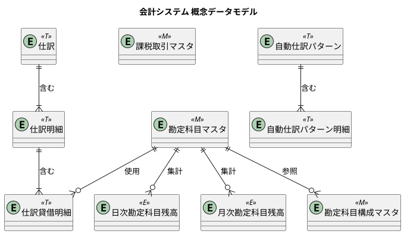

## 論理データモデル

### マスタ系テーブル

#### 勘定科目マスタ

勘定科目の基本情報を管理します。

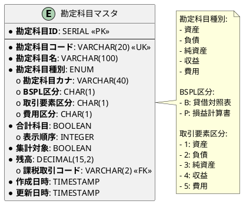

**DDL:**

```sql
-- 勘定科目種別のenum型を作成
DO $$ BEGIN
    CREATE TYPE account_type AS ENUM ('資産', '負債', '純資産', '収益', '費用');
EXCEPTION
    WHEN duplicate_object THEN null;
END $$;

-- 勘定科目マスタテーブルを作成
CREATE TABLE IF NOT EXISTS "勘定科目マスタ" (
    "勘定科目ID" SERIAL PRIMARY KEY,
    "勘定科目コード" VARCHAR(20) UNIQUE NOT NULL,
    "勘定科目名" VARCHAR(100) NOT NULL,
    "勘定科目種別" account_type NOT NULL,
    "勘定科目カナ" VARCHAR(40),
    "BSPL区分" CHAR(1),
    "取引要素区分" CHAR(1),
    "費用区分" CHAR(1),
    "合計科目" BOOLEAN DEFAULT false NOT NULL,
    "表示順序" INTEGER,
    "集計対象" BOOLEAN DEFAULT true NOT NULL,
    "残高" DECIMAL(15,2) DEFAULT 0 NOT NULL,
    "課税取引コード" VARCHAR(2),
    "作成日時" TIMESTAMP DEFAULT CURRENT_TIMESTAMP NOT NULL,
    "更新日時" TIMESTAMP DEFAULT CURRENT_TIMESTAMP NOT NULL
);

-- テーブルコメント
COMMENT ON TABLE "勘定科目マスタ" IS
    '勘定科目マスタ（財務会計システムの基本となる勘定科目情報）';

-- カラムコメント
COMMENT ON COLUMN "勘定科目マスタ"."勘定科目ID" IS '勘定科目ID（主キー）';
COMMENT ON COLUMN "勘定科目マスタ"."勘定科目コード" IS '勘定科目コード（例：1000, 2000）';
COMMENT ON COLUMN "勘定科目マスタ"."勘定科目名" IS '勘定科目名（例：現金、売掛金）';
COMMENT ON COLUMN "勘定科目マスタ"."勘定科目種別" IS '勘定科目種別（資産、負債、純資産、収益、費用）';
COMMENT ON COLUMN "勘定科目マスタ"."BSPL区分" IS 'BSPL区分（B:貸借対照表, P:損益計算書）';
COMMENT ON COLUMN "勘定科目マスタ"."取引要素区分" IS '取引要素区分（1:資産, 2:負債, 3:純資産, 4:収益, 5:費用）';
COMMENT ON COLUMN "勘定科目マスタ"."費用区分" IS '費用区分（1:売上原価, 2:販売費及び一般管理費, 3:営業外費用）';
COMMENT ON COLUMN "勘定科目マスタ"."合計科目" IS '合計科目（true: 集計科目, false: 明細科目）';
COMMENT ON COLUMN "勘定科目マスタ"."残高" IS '残高';
```

**勘定科目種別:**

| 勘定科目種別 | 説明 | 借方増加 |
|--------------|------|----------|
| 資産 | 会社が保有する経済的資源 | ○ |
| 負債 | 会社が負う債務 | × |
| 純資産 | 資産から負債を引いた残額 | × |
| 収益 | 事業活動による収入 | × |
| 費用 | 事業活動による支出 | ○ |

#### 勘定科目構成マスタ

勘定科目の階層構造をチルダ連結方式で管理します。

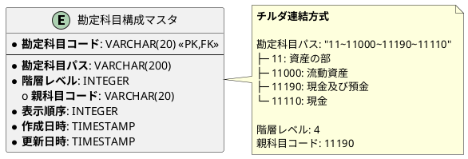

**DDL:**

```sql
-- 勘定科目構成マスタ
CREATE TABLE IF NOT EXISTS "勘定科目構成マスタ" (
    "勘定科目コード" VARCHAR(20) PRIMARY KEY,
    "勘定科目パス" VARCHAR(200) NOT NULL,
    "階層レベル" INTEGER NOT NULL DEFAULT 1,
    "親科目コード" VARCHAR(20),
    "表示順序" INTEGER NOT NULL DEFAULT 0,
    "作成日時" TIMESTAMP NOT NULL DEFAULT CURRENT_TIMESTAMP,
    "更新日時" TIMESTAMP NOT NULL DEFAULT CURRENT_TIMESTAMP,
    CONSTRAINT fk_account_structure_account
        FOREIGN KEY ("勘定科目コード")
        REFERENCES "勘定科目マスタ"("勘定科目コード")
        ON DELETE CASCADE
);

COMMENT ON TABLE "勘定科目構成マスタ" IS '勘定科目の階層構造を管理するマスタテーブル';
COMMENT ON COLUMN "勘定科目構成マスタ"."勘定科目コード" IS '勘定科目コード';
COMMENT ON COLUMN "勘定科目構成マスタ"."勘定科目パス" IS 'チルダ連結形式のパス（例: 11~11000~11190~11110）';
COMMENT ON COLUMN "勘定科目構成マスタ"."階層レベル" IS '階層の深さ（ルート=1）';
COMMENT ON COLUMN "勘定科目構成マスタ"."親科目コード" IS '親科目のコード';
COMMENT ON COLUMN "勘定科目構成マスタ"."表示順序" IS '同じ階層内での表示順序';

-- パスでの検索を高速化するためのインデックス
CREATE INDEX IF NOT EXISTS idx_account_structure_path
    ON "勘定科目構成マスタ" ("勘定科目パス");

-- 親科目での検索を高速化するためのインデックス
CREATE INDEX IF NOT EXISTS idx_account_structure_parent
    ON "勘定科目構成マスタ" ("親科目コード")
    WHERE "親科目コード" IS NOT NULL;
```

**チルダ連結方式:**

階層パスをチルダ（~）で連結して表現します。

```
例: 11~11000~11190~11110
    ├─ 11     : 資産の部（大分類）
    ├─ 11000  : 流動資産（中分類）
    ├─ 11190  : 現金及び預金（小分類）
    └─ 11110  : 現金（勘定科目）
```

**利点:**
- LIKE 検索で配下の全勘定科目を効率的に取得可能
- 階層の深さに関係なく一貫した方法で検索可能

```sql
-- 「現金及び預金」配下のすべての勘定科目の残高を集計
SELECT SUM(a."残高") as 合計残高
FROM "勘定科目マスタ" a
JOIN "勘定科目構成マスタ" s ON a."勘定科目コード" = s."勘定科目コード"
WHERE s."勘定科目パス" LIKE '%~11190~%'
   OR s."勘定科目コード" = '11190';
```

#### 課税取引マスタ

消費税の課税区分を管理します。

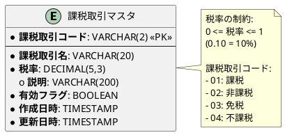

**DDL:**

```sql
-- 課税取引マスタ
CREATE TABLE IF NOT EXISTS "課税取引マスタ" (
    "課税取引コード" VARCHAR(2) PRIMARY KEY,
    "課税取引名" VARCHAR(20) NOT NULL,
    "税率" DECIMAL(5, 3) NOT NULL DEFAULT 0.000,
    "説明" VARCHAR(200),
    "有効フラグ" BOOLEAN NOT NULL DEFAULT true,
    "作成日時" TIMESTAMP NOT NULL DEFAULT CURRENT_TIMESTAMP,
    "更新日時" TIMESTAMP NOT NULL DEFAULT CURRENT_TIMESTAMP,
    CONSTRAINT check_tax_rate CHECK ("税率" >= 0 AND "税率" <= 1)
);

COMMENT ON TABLE "課税取引マスタ" IS '消費税の課税取引区分を管理するマスタテーブル';
COMMENT ON COLUMN "課税取引マスタ"."課税取引コード" IS '課税取引コード（01:課税、02:非課税、03:免税、04:不課税）';
COMMENT ON COLUMN "課税取引マスタ"."課税取引名" IS '課税取引名';
COMMENT ON COLUMN "課税取引マスタ"."税率" IS '適用される税率（0.10 = 10%）';
COMMENT ON COLUMN "課税取引マスタ"."説明" IS '課税取引の説明';
COMMENT ON COLUMN "課税取引マスタ"."有効フラグ" IS '有効な課税取引区分かどうか';

-- 初期データ投入
INSERT INTO "課税取引マスタ" ("課税取引コード", "課税取引名", "税率", "説明") VALUES
    ('01', '課税', 0.10, '消費税が課税される取引'),
    ('02', '非課税', 0.000, '消費税が非課税の取引（土地の譲渡、住宅の貸付など）'),
    ('03', '免税', 0.000, '消費税が免税の取引（輸出取引など）'),
    ('04', '不課税', 0.000, '消費税の対象外の取引（給与、配当など）');
```

### トランザクション系テーブル

#### 仕訳 3 層構造

複式簿記の仕訳データを 3 層構造で管理します。

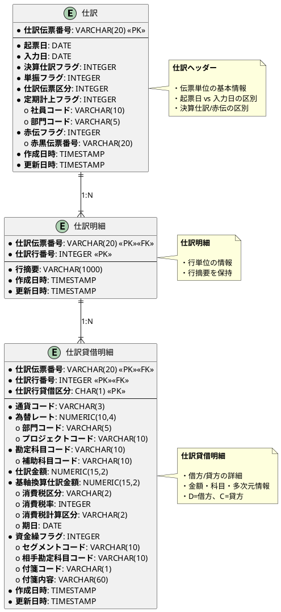

**仕訳 DDL:**

```sql
-- 仕訳テーブル（ヘッダー）
CREATE TABLE IF NOT EXISTS "仕訳" (
    "仕訳伝票番号" VARCHAR(20) PRIMARY KEY,
    "起票日" DATE NOT NULL,
    "入力日" DATE NOT NULL,
    "決算仕訳フラグ" INTEGER DEFAULT 0 NOT NULL,
    "単振フラグ" INTEGER DEFAULT 0 NOT NULL,
    "仕訳伝票区分" INTEGER DEFAULT 0 NOT NULL,
    "定期計上フラグ" INTEGER DEFAULT 0 NOT NULL,
    "社員コード" VARCHAR(10),
    "部門コード" VARCHAR(5),
    "赤伝フラグ" INTEGER DEFAULT 0 NOT NULL,
    "赤黒伝票番号" VARCHAR(20),
    "作成日時" TIMESTAMP DEFAULT CURRENT_TIMESTAMP NOT NULL,
    "更新日時" TIMESTAMP DEFAULT CURRENT_TIMESTAMP NOT NULL
);

-- インデックス作成
CREATE INDEX "idx_仕訳_起票日" ON "仕訳"("起票日");
CREATE INDEX "idx_仕訳_部門コード" ON "仕訳"("部門コード");
CREATE INDEX "idx_仕訳_赤伝フラグ" ON "仕訳"("赤伝フラグ");

-- CHECK制約
ALTER TABLE "仕訳"
  ADD CONSTRAINT "check_決算仕訳フラグ"
  CHECK ("決算仕訳フラグ" IN (0, 1));

ALTER TABLE "仕訳"
  ADD CONSTRAINT "check_赤伝フラグ"
  CHECK ("赤伝フラグ" IN (0, 1));

-- 赤伝票の場合は赤黒伝票番号が必須
ALTER TABLE "仕訳"
  ADD CONSTRAINT "check_赤伝票_赤黒伝票番号"
  CHECK (
    ("赤伝フラグ" = 0)
    OR
    ("赤伝フラグ" = 1 AND "赤黒伝票番号" IS NOT NULL)
  );

COMMENT ON TABLE "仕訳" IS '仕訳ヘッダー（伝票単位の基本情報）';
COMMENT ON COLUMN "仕訳"."起票日" IS '実際の取引発生日';
COMMENT ON COLUMN "仕訳"."入力日" IS 'システムへの入力日';
COMMENT ON COLUMN "仕訳"."決算仕訳フラグ" IS '0=通常仕訳、1=決算仕訳';
COMMENT ON COLUMN "仕訳"."単振フラグ" IS '0=複合仕訳、1=単一仕訳';
COMMENT ON COLUMN "仕訳"."赤伝フラグ" IS '0=通常、1=赤伝票（取消仕訳）';
```

**仕訳明細 DDL:**

```sql
-- 仕訳明細テーブル
CREATE TABLE IF NOT EXISTS "仕訳明細" (
    "仕訳伝票番号" VARCHAR(20),
    "仕訳行番号" INTEGER,
    "行摘要" VARCHAR(1000) NOT NULL,
    "作成日時" TIMESTAMP DEFAULT CURRENT_TIMESTAMP NOT NULL,
    "更新日時" TIMESTAMP DEFAULT CURRENT_TIMESTAMP NOT NULL,
    PRIMARY KEY ("仕訳伝票番号", "仕訳行番号"),
    FOREIGN KEY ("仕訳伝票番号") REFERENCES "仕訳" ("仕訳伝票番号") ON DELETE CASCADE
);

COMMENT ON TABLE "仕訳明細" IS '仕訳明細（行単位の情報）';
```

**仕訳貸借明細 DDL:**

```sql
-- 仕訳貸借明細テーブル
CREATE TABLE IF NOT EXISTS "仕訳貸借明細" (
    "仕訳伝票番号" VARCHAR(20),
    "仕訳行番号" INTEGER,
    "仕訳行貸借区分" CHAR(1),
    "通貨コード" VARCHAR(3) DEFAULT 'JPY' NOT NULL,
    "為替レート" NUMERIC(10,4) DEFAULT 1.0000 NOT NULL,
    "部門コード" VARCHAR(5),
    "プロジェクトコード" VARCHAR(10),
    "勘定科目コード" VARCHAR(10) NOT NULL,
    "補助科目コード" VARCHAR(10),
    "仕訳金額" NUMERIC(15,2) NOT NULL,
    "基軸換算仕訳金額" NUMERIC(15,2) NOT NULL,
    "消費税区分" VARCHAR(2),
    "消費税率" INTEGER,
    "消費税計算区分" VARCHAR(2),
    "期日" DATE,
    "資金繰フラグ" INTEGER DEFAULT 0 NOT NULL,
    "セグメントコード" VARCHAR(10),
    "相手勘定科目コード" VARCHAR(10),
    "相手補助科目コード" VARCHAR(10),
    "付箋コード" VARCHAR(1),
    "付箋内容" VARCHAR(60),
    "作成日時" TIMESTAMP DEFAULT CURRENT_TIMESTAMP NOT NULL,
    "更新日時" TIMESTAMP DEFAULT CURRENT_TIMESTAMP NOT NULL,
    PRIMARY KEY ("仕訳伝票番号", "仕訳行番号", "仕訳行貸借区分"),
    FOREIGN KEY ("仕訳伝票番号", "仕訳行番号")
        REFERENCES "仕訳明細" ("仕訳伝票番号", "仕訳行番号") ON DELETE CASCADE,
    FOREIGN KEY ("勘定科目コード")
        REFERENCES "勘定科目マスタ" ("勘定科目コード")
);

-- インデックス作成
CREATE INDEX "idx_仕訳貸借明細_伝票番号" ON "仕訳貸借明細"("仕訳伝票番号");
CREATE INDEX "idx_仕訳貸借明細_勘定科目" ON "仕訳貸借明細"("勘定科目コード");
CREATE INDEX "idx_仕訳貸借明細_部門" ON "仕訳貸借明細"("部門コード");
CREATE INDEX "idx_仕訳貸借明細_プロジェクト" ON "仕訳貸借明細"("プロジェクトコード");

-- CHECK制約
ALTER TABLE "仕訳貸借明細"
  ADD CONSTRAINT "check_貸借区分"
  CHECK ("仕訳行貸借区分" IN ('D', 'C'));  -- D=借方、C=貸方

ALTER TABLE "仕訳貸借明細"
  ADD CONSTRAINT "check_仕訳金額"
  CHECK ("仕訳金額" >= 0);

ALTER TABLE "仕訳貸借明細"
  ADD CONSTRAINT "check_為替レート"
  CHECK ("為替レート" > 0);

COMMENT ON TABLE "仕訳貸借明細" IS '仕訳貸借明細（借方・貸方の詳細情報）';
COMMENT ON COLUMN "仕訳貸借明細"."仕訳行貸借区分" IS 'D=借方（Debit）、C=貸方（Credit）';
COMMENT ON COLUMN "仕訳貸借明細"."資金繰フラグ" IS '0=資金繰に影響なし、1=資金繰に影響あり';
```

**3 層構造の各層の役割:**

| 層 | テーブル名 | 役割 | 主キー |
|---|----------|------|--------|
| 第1層 | 仕訳 | 伝票単位の基本情報（起票日、入力日、フラグ類） | 仕訳伝票番号 |
| 第2層 | 仕訳明細 | 行単位の情報（行摘要） | 仕訳伝票番号 + 仕訳行番号 |
| 第3層 | 仕訳貸借明細 | 借方・貸方の詳細（金額、科目、多次元情報） | 仕訳伝票番号 + 仕訳行番号 + 仕訳行貸借区分 |

**複式簿記の原則:**

```sql
-- 仕訳ごとに借方合計 = 貸方合計を検証
SELECT
    "仕訳伝票番号",
    SUM(CASE WHEN "仕訳行貸借区分" = 'D' THEN "仕訳金額" ELSE 0 END) as 借方合計,
    SUM(CASE WHEN "仕訳行貸借区分" = 'C' THEN "仕訳金額" ELSE 0 END) as 貸方合計
FROM "仕訳貸借明細"
GROUP BY "仕訳伝票番号"
HAVING SUM(CASE WHEN "仕訳行貸借区分" = 'D' THEN "仕訳金額" ELSE 0 END)
    != SUM(CASE WHEN "仕訳行貸借区分" = 'C' THEN "仕訳金額" ELSE 0 END);
```

#### 自動仕訳テーブル

定期的に発生する仕訳のテンプレートを管理します。日付管理方式を採用します。

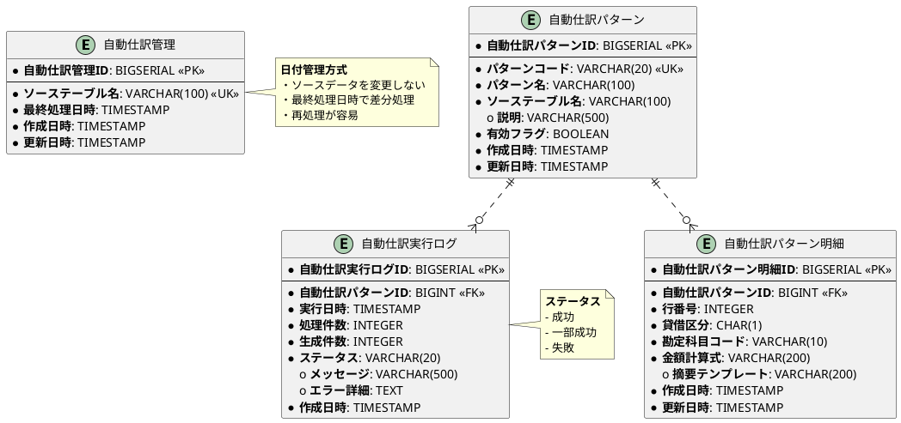

**DDL:**

```sql
-- 自動仕訳管理テーブル
CREATE TABLE IF NOT EXISTS "自動仕訳管理" (
    "自動仕訳管理ID" BIGSERIAL PRIMARY KEY,
    "ソーステーブル名" VARCHAR(100) NOT NULL UNIQUE,
    "最終処理日時" TIMESTAMP NOT NULL,
    "作成日時" TIMESTAMP DEFAULT CURRENT_TIMESTAMP NOT NULL,
    "更新日時" TIMESTAMP DEFAULT CURRENT_TIMESTAMP NOT NULL
);

COMMENT ON TABLE "自動仕訳管理" IS '自動仕訳の処理状況を管理';
COMMENT ON COLUMN "自動仕訳管理"."ソーステーブル名" IS '処理対象のソーステーブル名';
COMMENT ON COLUMN "自動仕訳管理"."最終処理日時" IS '最終処理日時';

-- 自動仕訳パターンテーブル
CREATE TABLE IF NOT EXISTS "自動仕訳パターン" (
    "自動仕訳パターンID" BIGSERIAL PRIMARY KEY,
    "パターンコード" VARCHAR(20) NOT NULL UNIQUE,
    "パターン名" VARCHAR(100) NOT NULL,
    "ソーステーブル名" VARCHAR(100) NOT NULL,
    "説明" VARCHAR(500),
    "有効フラグ" BOOLEAN DEFAULT true NOT NULL,
    "作成日時" TIMESTAMP DEFAULT CURRENT_TIMESTAMP NOT NULL,
    "更新日時" TIMESTAMP DEFAULT CURRENT_TIMESTAMP NOT NULL
);

COMMENT ON TABLE "自動仕訳パターン" IS '自動仕訳の生成パターン定義';

-- 自動仕訳パターン明細テーブル
CREATE TABLE IF NOT EXISTS "自動仕訳パターン明細" (
    "自動仕訳パターン明細ID" BIGSERIAL PRIMARY KEY,
    "自動仕訳パターンID" BIGINT NOT NULL,
    "行番号" INTEGER NOT NULL,
    "貸借区分" CHAR(1) NOT NULL,
    "勘定科目コード" VARCHAR(10) NOT NULL,
    "金額計算式" VARCHAR(200) NOT NULL,
    "摘要テンプレート" VARCHAR(200),
    "作成日時" TIMESTAMP DEFAULT CURRENT_TIMESTAMP NOT NULL,
    "更新日時" TIMESTAMP DEFAULT CURRENT_TIMESTAMP NOT NULL,
    FOREIGN KEY ("自動仕訳パターンID") REFERENCES "自動仕訳パターン" ("自動仕訳パターンID") ON DELETE CASCADE,
    FOREIGN KEY ("勘定科目コード") REFERENCES "勘定科目マスタ" ("勘定科目コード"),
    CONSTRAINT "check_貸借区分" CHECK ("貸借区分" IN ('D', 'C'))
);

COMMENT ON TABLE "自動仕訳パターン明細" IS '自動仕訳パターンの借方・貸方明細';
COMMENT ON COLUMN "自動仕訳パターン明細"."金額計算式" IS '金額計算式（例: 売上金額 * 1.10）';
COMMENT ON COLUMN "自動仕訳パターン明細"."貸借区分" IS 'D=借方、C=貸方';

-- 自動仕訳実行ログテーブル
CREATE TABLE IF NOT EXISTS "自動仕訳実行ログ" (
    "自動仕訳実行ログID" BIGSERIAL PRIMARY KEY,
    "自動仕訳パターンID" BIGINT NOT NULL,
    "実行日時" TIMESTAMP NOT NULL,
    "処理件数" INTEGER NOT NULL DEFAULT 0,
    "生成件数" INTEGER NOT NULL DEFAULT 0,
    "ステータス" VARCHAR(20) NOT NULL,
    "メッセージ" VARCHAR(500),
    "エラー詳細" TEXT,
    "作成日時" TIMESTAMP DEFAULT CURRENT_TIMESTAMP NOT NULL,
    FOREIGN KEY ("自動仕訳パターンID") REFERENCES "自動仕訳パターン" ("自動仕訳パターンID"),
    CONSTRAINT "check_ステータス" CHECK ("ステータス" IN ('成功', '一部成功', '失敗'))
);

COMMENT ON TABLE "自動仕訳実行ログ" IS '自動仕訳の実行履歴';
COMMENT ON COLUMN "自動仕訳実行ログ"."ステータス" IS '成功, 一部成功, 失敗';

-- インデックス作成
CREATE INDEX "idx_自動仕訳パターン_ソース" ON "自動仕訳パターン"("ソーステーブル名");
CREATE INDEX "idx_自動仕訳実行ログ_パターン" ON "自動仕訳実行ログ"("自動仕訳パターンID");
CREATE INDEX "idx_自動仕訳実行ログ_実行日時" ON "自動仕訳実行ログ"("実行日時");
```

### 残高系テーブル

#### 日次勘定科目残高

日次の勘定科目残高を管理します。

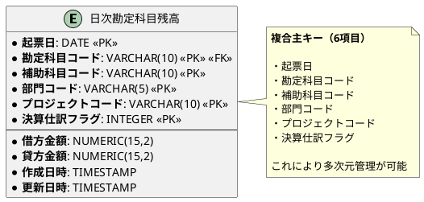

**DDL:**

```sql
CREATE TABLE IF NOT EXISTS "日次勘定科目残高" (
    "起票日" DATE NOT NULL,
    "勘定科目コード" VARCHAR(10) NOT NULL,
    "補助科目コード" VARCHAR(10) NOT NULL DEFAULT '',
    "部門コード" VARCHAR(5) NOT NULL DEFAULT '',
    "プロジェクトコード" VARCHAR(10) NOT NULL DEFAULT '',
    "決算仕訳フラグ" INTEGER NOT NULL DEFAULT 0,
    "借方金額" NUMERIC(15,2) NOT NULL DEFAULT 0,
    "貸方金額" NUMERIC(15,2) NOT NULL DEFAULT 0,
    "作成日時" TIMESTAMP DEFAULT CURRENT_TIMESTAMP NOT NULL,
    "更新日時" TIMESTAMP DEFAULT CURRENT_TIMESTAMP NOT NULL,
    PRIMARY KEY (
        "起票日",
        "勘定科目コード",
        "補助科目コード",
        "部門コード",
        "プロジェクトコード",
        "決算仕訳フラグ"
    ),
    FOREIGN KEY ("勘定科目コード")
        REFERENCES "勘定科目マスタ" ("勘定科目コード")
);

-- インデックス作成
CREATE INDEX "idx_日次勘定科目残高_起票日" ON "日次勘定科目残高"("起票日");
CREATE INDEX "idx_日次勘定科目残高_勘定科目" ON "日次勘定科目残高"("勘定科目コード");
CREATE INDEX "idx_日次勘定科目残高_部門" ON "日次勘定科目残高"("部門コード");
CREATE INDEX "idx_日次勘定科目残高_プロジェクト" ON "日次勘定科目残高"("プロジェクトコード");

-- CHECK制約
ALTER TABLE "日次勘定科目残高"
  ADD CONSTRAINT "check_日次残高_借方金額"
  CHECK ("借方金額" >= 0);

ALTER TABLE "日次勘定科目残高"
  ADD CONSTRAINT "check_日次残高_貸方金額"
  CHECK ("貸方金額" >= 0);

ALTER TABLE "日次勘定科目残高"
  ADD CONSTRAINT "check_日次残高_決算仕訳フラグ"
  CHECK ("決算仕訳フラグ" IN (0, 1));

-- コメント追加
COMMENT ON TABLE "日次勘定科目残高" IS '日次勘定科目残高（日ごとの借方・貸方金額を記録）';
COMMENT ON COLUMN "日次勘定科目残高"."起票日" IS '実際の取引発生日';
COMMENT ON COLUMN "日次勘定科目残高"."補助科目コード" IS '補助科目（得意先、仕入先など）';
COMMENT ON COLUMN "日次勘定科目残高"."部門コード" IS '部門別管理用';
COMMENT ON COLUMN "日次勘定科目残高"."プロジェクトコード" IS 'プロジェクト別管理用';
COMMENT ON COLUMN "日次勘定科目残高"."決算仕訳フラグ" IS '0=通常仕訳、1=決算仕訳';
```

#### 月次勘定科目残高

月次の勘定科目残高を管理します。

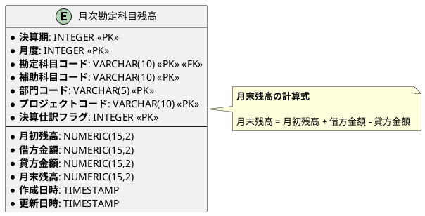

**DDL:**

```sql
CREATE TABLE IF NOT EXISTS "月次勘定科目残高" (
    "決算期" INTEGER NOT NULL,
    "月度" INTEGER NOT NULL,
    "勘定科目コード" VARCHAR(10) NOT NULL,
    "補助科目コード" VARCHAR(10) NOT NULL DEFAULT '',
    "部門コード" VARCHAR(5) NOT NULL DEFAULT '',
    "プロジェクトコード" VARCHAR(10) NOT NULL DEFAULT '',
    "決算仕訳フラグ" INTEGER NOT NULL DEFAULT 0,
    "月初残高" NUMERIC(15,2) NOT NULL DEFAULT 0,
    "借方金額" NUMERIC(15,2) NOT NULL DEFAULT 0,
    "貸方金額" NUMERIC(15,2) NOT NULL DEFAULT 0,
    "月末残高" NUMERIC(15,2) NOT NULL DEFAULT 0,
    "作成日時" TIMESTAMP DEFAULT CURRENT_TIMESTAMP NOT NULL,
    "更新日時" TIMESTAMP DEFAULT CURRENT_TIMESTAMP NOT NULL,
    PRIMARY KEY (
        "決算期",
        "月度",
        "勘定科目コード",
        "補助科目コード",
        "部門コード",
        "プロジェクトコード",
        "決算仕訳フラグ"
    ),
    FOREIGN KEY ("勘定科目コード")
        REFERENCES "勘定科目マスタ" ("勘定科目コード")
);

-- インデックス作成
CREATE INDEX "idx_月次勘定科目残高_決算期月度" ON "月次勘定科目残高"("決算期", "月度");
CREATE INDEX "idx_月次勘定科目残高_勘定科目" ON "月次勘定科目残高"("勘定科目コード");

-- CHECK制約
ALTER TABLE "月次勘定科目残高"
  ADD CONSTRAINT "check_月次残高_月度範囲"
  CHECK ("月度" >= 1 AND "月度" <= 12);

-- コメント追加
COMMENT ON TABLE "月次勘定科目残高" IS '月次勘定科目残高（月ごとの月初残高・借方・貸方金額・月末残高を記録）';
COMMENT ON COLUMN "月次勘定科目残高"."決算期" IS '会計年度（例：2025）';
COMMENT ON COLUMN "月次勘定科目残高"."月度" IS '月度（1〜12）';
COMMENT ON COLUMN "月次勘定科目残高"."月初残高" IS '月初時点の残高';
COMMENT ON COLUMN "月次勘定科目残高"."月末残高" IS '月末時点の残高（月初残高 + 借方金額 - 貸方金額）';
```

#### UPSERT パターン

残高更新には UPSERT パターンを使用します。

**PostgreSQL:**

```sql
INSERT INTO "日次勘定科目残高" (
    "起票日", "勘定科目コード", "補助科目コード", "部門コード",
    "プロジェクトコード", "決算仕訳フラグ", "借方金額", "貸方金額"
) VALUES (?, ?, ?, ?, ?, ?, ?, ?)
ON CONFLICT (
    "起票日", "勘定科目コード", "補助科目コード",
    "部門コード", "プロジェクトコード", "決算仕訳フラグ"
)
DO UPDATE SET
    "借方金額" = "日次勘定科目残高"."借方金額" + EXCLUDED."借方金額",
    "貸方金額" = "日次勘定科目残高"."貸方金額" + EXCLUDED."貸方金額",
    "更新日時" = CURRENT_TIMESTAMP;
```

## ER 図（全体）

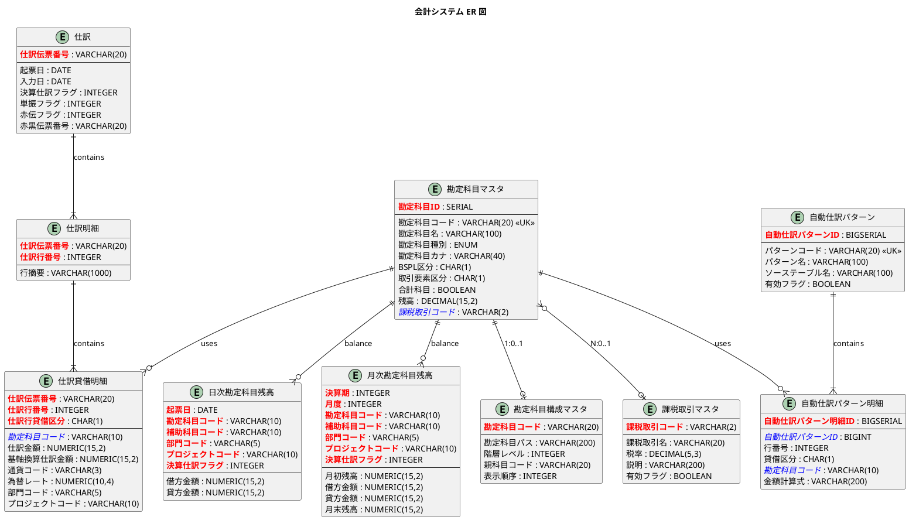

## ドメインモデルとの対応

### レイヤー構造

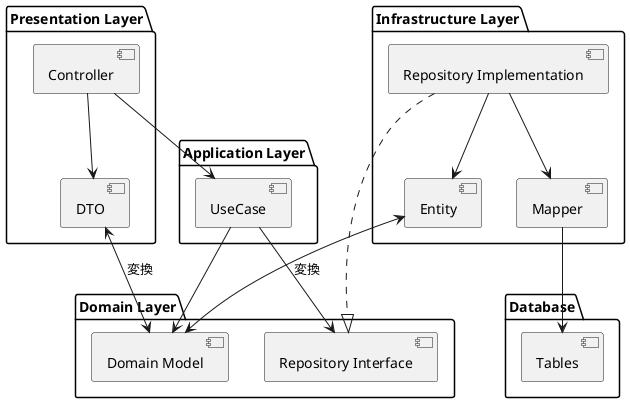

### Entity と Domain Model の違い

| 観点 | Entity | Domain Model |
|------|--------|--------------|
| 目的 | DB テーブルとのマッピング | ビジネスロジックの表現 |
| 構造 | テーブル構造に依存 | ドメイン概念に基づく |
| 振る舞い | なし（貧血モデル） | ビジネスルールを持つ |
| 不変条件 | DB 制約に依存 | コード内で保証 |

### MyBatis マッピング例

階層構造を持つデータの取得には `collection` を使用します。

```xml
<resultMap id="journalEntryResultMap" type="JournalEntity">
    <id property="仕訳伝票番号" column="仕訳伝票番号"/>
    <result property="起票日" column="起票日"/>
    <result property="入力日" column="入力日"/>
    <result property="決算仕訳フラグ" column="決算仕訳フラグ"/>
    <collection property="明細リスト" ofType="JournalDetailEntity">
        <id property="仕訳行番号" column="仕訳行番号"/>
        <result property="行摘要" column="行摘要"/>
        <collection property="貸借明細リスト" ofType="JournalDebitCreditEntity">
            <id property="仕訳行貸借区分" column="仕訳行貸借区分"/>
            <result property="勘定科目コード" column="勘定科目コード"/>
            <result property="仕訳金額" column="仕訳金額"/>
        </collection>
    </collection>
</resultMap>
```

## 赤黒処理（訂正仕訳）

仕訳の訂正は赤黒処理で行います。元の仕訳を赤伝票（マイナス仕訳）で取り消し、正しい仕訳を黒伝票で入力します。

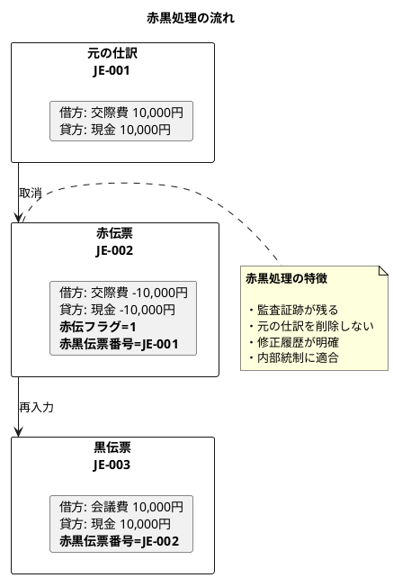

## 財務帳票生成ビュー

### 総勘定元帳ビュー

```sql
CREATE OR REPLACE VIEW "総勘定元帳" AS
SELECT
    d."起票日",
    a."勘定科目コード",
    a."勘定科目名",
    a."BSPL区分",
    d."補助科目コード",
    d."部門コード",
    d."プロジェクトコード",
    d."借方金額",
    d."貸方金額",
    -- ウィンドウ関数で累積残高を計算
    SUM(d."借方金額" - d."貸方金額") OVER (
        PARTITION BY d."勘定科目コード", d."補助科目コード", d."部門コード", d."プロジェクトコード"
        ORDER BY d."起票日"
        ROWS BETWEEN UNBOUNDED PRECEDING AND CURRENT ROW
    ) as "残高"
FROM "日次勘定科目残高" d
INNER JOIN "勘定科目マスタ" a ON d."勘定科目コード" = a."勘定科目コード"
WHERE d."決算仕訳フラグ" = 0  -- 通常仕訳のみ
ORDER BY d."勘定科目コード", d."起票日";
```

### 試算表ビュー

```sql
CREATE OR REPLACE VIEW "試算表" AS
SELECT
    a."勘定科目コード",
    a."勘定科目名",
    a."BSPL区分",
    COALESCE(SUM(d."借方金額"), 0) as "借方合計",
    COALESCE(SUM(d."貸方金額"), 0) as "貸方合計",
    COALESCE(SUM(d."借方金額"), 0) - COALESCE(SUM(d."貸方金額"), 0) as "残高"
FROM "勘定科目マスタ" a
LEFT JOIN "日次勘定科目残高" d
    ON a."勘定科目コード" = d."勘定科目コード"
    AND d."決算仕訳フラグ" = 0  -- 通常仕訳のみ
GROUP BY a."勘定科目コード", a."勘定科目名", a."BSPL区分"
ORDER BY a."勘定科目コード";
```

## マイグレーション戦略

### Flyway によるバージョン管理

```
src/main/resources/db/migration/
├── V001__create_account_master.sql
├── V002__add_account_fields.sql
├── V006__create_account_structure.sql
├── V007__create_tax_transaction.sql
├── V010__create_journal_3layer.sql
├── V011__create_auto_journal.sql
├── V012__create_daily_account_balance.sql
└── V013__create_monthly_account_balance.sql
```

## 初期データ（シードデータ）

### 勘定科目の初期データ

```sql
-- 資産
INSERT INTO "勘定科目マスタ" ("勘定科目コード", "勘定科目名", "勘定科目種別", "BSPL区分", "取引要素区分") VALUES
('11110', '現金', '資産', 'B', '1'),
('11120', '当座預金', '資産', 'B', '1'),
('11130', '普通預金', '資産', 'B', '1'),
('11310', '売掛金', '資産', 'B', '1');

-- 負債
INSERT INTO "勘定科目マスタ" ("勘定科目コード", "勘定科目名", "勘定科目種別", "BSPL区分", "取引要素区分") VALUES
('21110', '買掛金', '負債', 'B', '2'),
('21210', '未払金', '負債', 'B', '2');

-- 純資産
INSERT INTO "勘定科目マスタ" ("勘定科目コード", "勘定科目名", "勘定科目種別", "BSPL区分", "取引要素区分") VALUES
('31110', '資本金', '純資産', 'B', '3'),
('33110', '繰越利益剰余金', '純資産', 'B', '3');

-- 収益
INSERT INTO "勘定科目マスタ" ("勘定科目コード", "勘定科目名", "勘定科目種別", "BSPL区分", "取引要素区分") VALUES
('41110', '売上高', '収益', 'P', '4');

-- 費用
INSERT INTO "勘定科目マスタ" ("勘定科目コード", "勘定科目名", "勘定科目種別", "BSPL区分", "取引要素区分") VALUES
('51110', '仕入高', '費用', 'P', '5'),
('52110', '給料手当', '費用', 'P', '5'),
('53110', '旅費交通費', '費用', 'P', '5'),
('54100', '支払手数料', '費用', 'P', '5');
```

## 主要テーブル一覧

| テーブル名 | 説明 | 主キー |
|-----------|------|--------|
| 勘定科目マスタ | 勘定科目の基本情報 | 勘定科目ID |
| 勘定科目構成マスタ | 勘定科目の階層構造 | 勘定科目コード |
| 課税取引マスタ | 消費税の課税区分 | 課税取引コード |
| 仕訳 | 仕訳ヘッダー（伝票単位の基本情報） | 仕訳伝票番号 |
| 仕訳明細 | 仕訳明細（行単位の情報） | 仕訳伝票番号 + 仕訳行番号 |
| 仕訳貸借明細 | 仕訳貸借明細（借方・貸方の詳細） | 仕訳伝票番号 + 仕訳行番号 + 仕訳行貸借区分 |
| 自動仕訳管理 | 自動仕訳の処理状況管理 | 自動仕訳管理ID |
| 自動仕訳パターン | 自動仕訳の生成パターン定義 | 自動仕訳パターンID |
| 自動仕訳パターン明細 | パターンの借方・貸方明細 | 自動仕訳パターン明細ID |
| 自動仕訳実行ログ | 自動仕訳の実行履歴 | 自動仕訳実行ログID |
| 日次勘定科目残高 | 日ごとの借方・貸方金額 | 起票日 + 勘定科目コード + 補助科目コード + 部門コード + プロジェクトコード + 決算仕訳フラグ |
| 月次勘定科目残高 | 月ごとの月初残高・借方・貸方・月末残高 | 決算期 + 月度 + 勘定科目コード + 補助科目コード + 部門コード + プロジェクトコード + 決算仕訳フラグ |

## 関連ドキュメント

- [アーキテクチャ設計（バックエンド）](architecture_backend.md)
- [アーキテクチャ設計（フロントエンド）](architecture_frontend.md)
- [アーキテクチャ設計（インフラストラクチャ）](architecture_infrastructure.md)
- [要件定義](../requirements/requirements_definition.md)
- [システムユースケース](../requirements/system_usecase.md)
