# データモデル設計

## 概要

本ドキュメントは、財務会計システムのデータモデル設計を定義します。テスト駆動開発（TDD）のアプローチに基づき、段階的にデータモデルを構築・改善していく方針を採用しています。

### 設計原則

1. **TDD データベース設計**: 要求をテストコードで表現し、最小限のスキーマから始めて段階的に改善
2. **複式簿記の原理**: 「借方合計 = 貸方合計」をデータベーススキーマで保証
3. **チルダ連結方式**: 勘定科目の階層構造を効率的に管理
4. **3 層構造仕訳**: 仕訳ヘッダー、仕訳明細、仕訳貸借明細の 3 層で複合仕訳に対応
5. **残高即時更新**: UPSERT による効率的な残高管理

---

## データモデル全体像

### ER 図

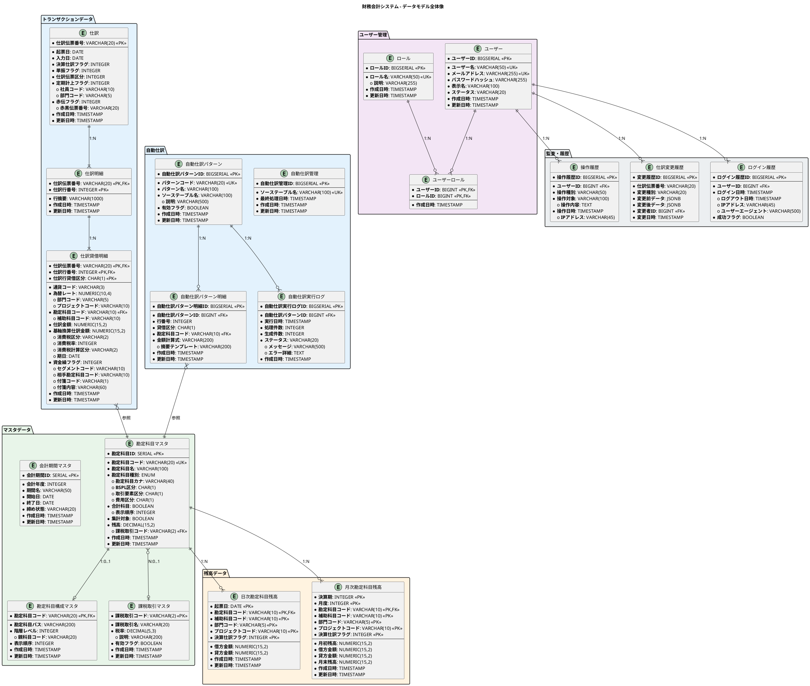

---

## マスタデータ

### 勘定科目マスタ

財務会計システムの基礎となる勘定科目情報を管理します。

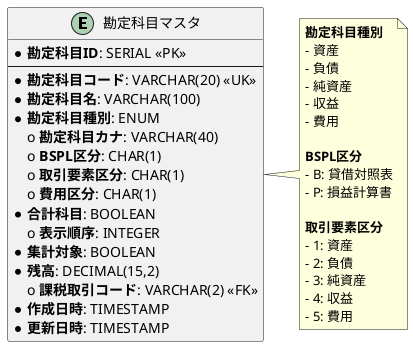

#### 項目定義

| 項目名 | データ型 | 必須 | 説明 |
|--------|----------|------|------|
| 勘定科目ID | SERIAL | ○ | 主キー（自動採番） |
| 勘定科目コード | VARCHAR(20) | ○ | 勘定科目を一意に識別するコード |
| 勘定科目名 | VARCHAR(100) | ○ | 勘定科目の正式名称 |
| 勘定科目種別 | ENUM | ○ | 資産、負債、純資産、収益、費用 |
| 勘定科目カナ | VARCHAR(40) | - | 検索用のカナ表記 |
| BSPL区分 | CHAR(1) | - | B: 貸借対照表、P: 損益計算書 |
| 取引要素区分 | CHAR(1) | - | 1〜5 の数値で会計 5 要素を表現 |
| 費用区分 | CHAR(1) | - | 1: 売上原価、2: 販管費、3: 営業外費用 |
| 合計科目 | BOOLEAN | ○ | true: 集計科目、false: 明細科目 |
| 表示順序 | INTEGER | - | 財務諸表での表示順 |
| 集計対象 | BOOLEAN | ○ | true: 集計対象、false: 集計対象外 |
| 残高 | DECIMAL(15,2) | ○ | 現在の残高 |
| 課税取引コード | VARCHAR(2) | - | 課税取引マスタへの外部キー |

### 勘定科目構成マスタ

勘定科目の階層構造を**チルダ連結方式**で管理します。

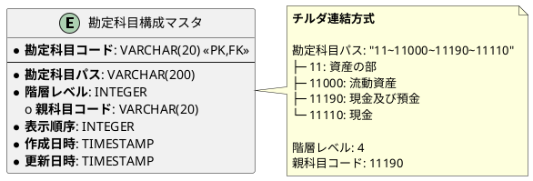

#### チルダ連結方式の利点

| 利点 | 説明 |
|------|------|
| シンプルなデータ構造 | 親子関係を 1 つのカラムで表現 |
| 効率的な階層検索 | LIKE 演算子で子孫科目を一括取得 |
| 集計処理の高速化 | 特定科目配下の残高集計が容易 |
| 柔軟な階層構造 | 任意の深さの階層に対応 |

#### 科目ツリー構造

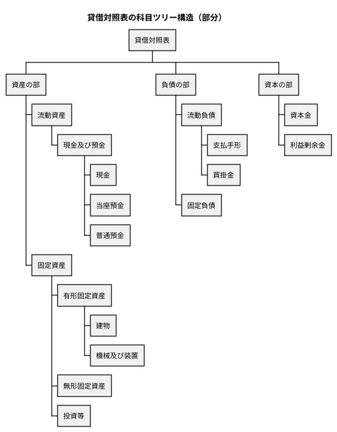

### 課税取引マスタ

消費税の課税区分を管理します。

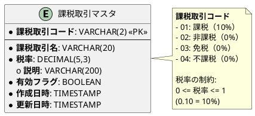

#### 課税取引の種類

| 課税取引コード | 課税取引名 | 税率 | 説明 |
|----------------|------------|------|------|
| 01 | 課税 | 10% | 消費税が課税される取引 |
| 02 | 非課税 | 0% | 土地の譲渡、住宅の貸付など |
| 03 | 免税 | 0% | 輸出取引など |
| 04 | 不課税 | 0% | 給与、配当など |

### 会計期間マスタ

会計年度と期間を管理します。

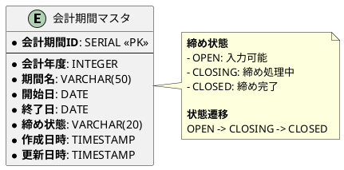

---

## トランザクションデータ

### 3 層構造仕訳テーブル

仕訳データは 3 層構造で管理し、複合仕訳（1 つの取引が複数の借方・貸方を持つ）に対応します。

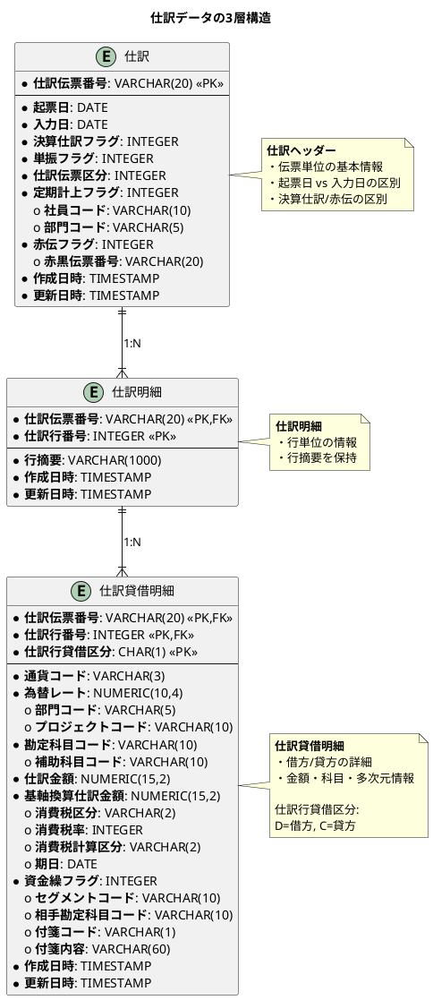

#### 3 層構造の各層の役割

| 層 | テーブル名 | 役割 | 主キー |
|----|----------|------|--------|
| 第 1 層 | 仕訳 | 伝票単位の基本情報 | 仕訳伝票番号 |
| 第 2 層 | 仕訳明細 | 行単位の情報（行摘要） | 仕訳伝票番号 + 仕訳行番号 |
| 第 3 層 | 仕訳貸借明細 | 借方・貸方の詳細 | 仕訳伝票番号 + 仕訳行番号 + 仕訳行貸借区分 |

#### 起票日と入力日の区別

| 項目 | 説明 | 例 |
|------|------|-----|
| 起票日 | 実際の取引が発生した日付 | 2025/01/15（納品日） |
| 入力日 | システムに入力した日付 | 2025/01/20（経理処理日） |

#### 赤黒処理

仕訳の修正は赤黒処理で行い、監査証跡を確保します。

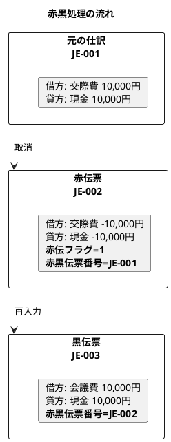

### 自動仕訳

日付管理方式による自動仕訳テーブルを設計します。

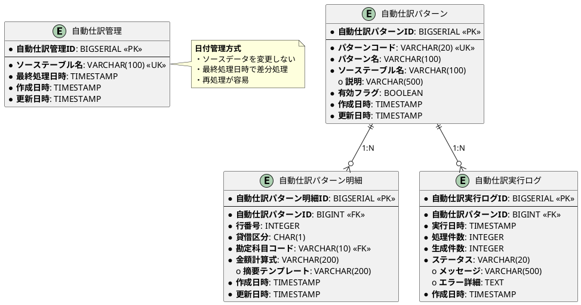

---

## 残高データ

### 日次勘定科目残高

仕訳入力時に即時更新（UPSERT）される日次の残高テーブルです。

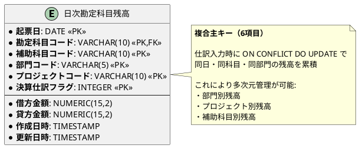

### 月次勘定科目残高

日次残高から月次集計される残高テーブルです。

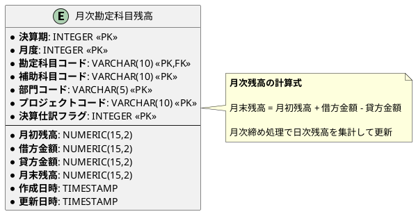

### 残高管理の全体フロー

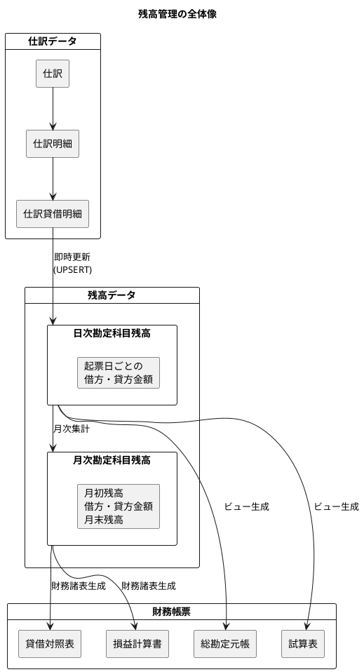

---

## ユーザー管理

### ユーザー・ロール

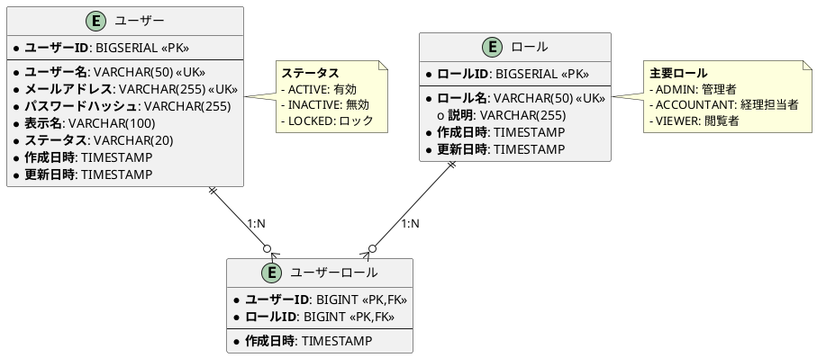

---

## 監査・履歴

### 監査テーブル群

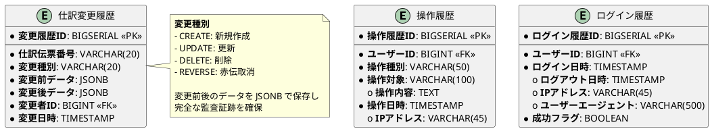

---

## 主要テーブル一覧

### マスタ系テーブル

| テーブル名 | 説明 | 主キー |
|-----------|------|--------|
| 勘定科目マスタ | 勘定科目の基本情報 | 勘定科目ID |
| 勘定科目構成マスタ | 勘定科目の階層構造 | 勘定科目コード |
| 課税取引マスタ | 消費税の課税区分 | 課税取引コード |
| 会計期間マスタ | 会計年度と期間 | 会計期間ID |

### トランザクション系テーブル

| テーブル名 | 説明 | 主キー |
|-----------|------|--------|
| 仕訳 | 仕訳ヘッダー | 仕訳伝票番号 |
| 仕訳明細 | 行単位の情報 | 仕訳伝票番号 + 仕訳行番号 |
| 仕訳貸借明細 | 借方・貸方の詳細 | 仕訳伝票番号 + 仕訳行番号 + 仕訳行貸借区分 |
| 自動仕訳管理 | 自動仕訳の処理状況 | 自動仕訳管理ID |
| 自動仕訳パターン | 仕訳生成パターン定義 | 自動仕訳パターンID |
| 自動仕訳パターン明細 | パターンの明細 | 自動仕訳パターン明細ID |
| 自動仕訳実行ログ | 実行履歴 | 自動仕訳実行ログID |

### 残高系テーブル

| テーブル名 | 説明 | 主キー |
|-----------|------|--------|
| 日次勘定科目残高 | 日次の借方・貸方金額 | 起票日 + 勘定科目コード + 補助科目コード + 部門コード + プロジェクトコード + 決算仕訳フラグ |
| 月次勘定科目残高 | 月次の残高推移 | 決算期 + 月度 + 勘定科目コード + 補助科目コード + 部門コード + プロジェクトコード + 決算仕訳フラグ |

### ユーザー・監査系テーブル

| テーブル名 | 説明 | 主キー |
|-----------|------|--------|
| ユーザー | ユーザー情報 | ユーザーID |
| ロール | ロール定義 | ロールID |
| ユーザーロール | ユーザーとロールの関連 | ユーザーID + ロールID |
| 操作履歴 | 操作の監査ログ | 操作履歴ID |
| 仕訳変更履歴 | 仕訳の変更履歴 | 変更履歴ID |
| ログイン履歴 | ログインの履歴 | ログイン履歴ID |

---

## データ整合性の保証

### 複式簿記の原理

仕訳ごとに「借方合計 = 貸方合計」を保証します。

```sql
-- 仕訳残高チェックビュー
CREATE OR REPLACE VIEW 仕訳残高チェック AS
SELECT
  "仕訳伝票番号",
  SUM(CASE WHEN "仕訳行貸借区分" = 'D' THEN "仕訳金額" ELSE 0 END) AS 借方合計,
  SUM(CASE WHEN "仕訳行貸借区分" = 'C' THEN "仕訳金額" ELSE 0 END) AS 貸方合計,
  SUM(CASE WHEN "仕訳行貸借区分" = 'D' THEN "仕訳金額" ELSE 0 END) -
  SUM(CASE WHEN "仕訳行貸借区分" = 'C' THEN "仕訳金額" ELSE 0 END) AS 差額
FROM "仕訳貸借明細"
GROUP BY "仕訳伝票番号";

-- 複式簿記チェック関数
CREATE OR REPLACE FUNCTION 複式簿記チェック()
RETURNS TABLE(不整合伝票番号 VARCHAR(20), 差額 DECIMAL) AS $$
BEGIN
  RETURN QUERY
  SELECT "仕訳伝票番号", (借方合計 - 貸方合計) as 差額
  FROM 仕訳残高チェック
  WHERE 借方合計 != 貸方合計;
END;
$$ LANGUAGE plpgsql;
```

### CHECK 制約

```sql
-- 貸借区分は D または C のみ
ALTER TABLE "仕訳貸借明細"
  ADD CONSTRAINT "check_貸借区分"
  CHECK ("仕訳行貸借区分" IN ('D', 'C'));

-- 仕訳金額は 0 以上
ALTER TABLE "仕訳貸借明細"
  ADD CONSTRAINT "check_仕訳金額"
  CHECK ("仕訳金額" >= 0);

-- 赤伝票の場合は赤黒伝票番号が必須
ALTER TABLE "仕訳"
  ADD CONSTRAINT "check_赤伝票_赤黒伝票番号"
  CHECK (
    ("赤伝フラグ" = 0)
    OR
    ("赤伝フラグ" = 1 AND "赤黒伝票番号" IS NOT NULL)
  );
```

---

## インデックス設計

### 主要インデックス

```sql
-- 仕訳系
CREATE INDEX "idx_仕訳_起票日" ON "仕訳"("起票日");
CREATE INDEX "idx_仕訳_部門コード" ON "仕訳"("部門コード");
CREATE INDEX "idx_仕訳貸借明細_勘定科目" ON "仕訳貸借明細"("勘定科目コード");

-- 残高系
CREATE INDEX "idx_日次勘定科目残高_起票日" ON "日次勘定科目残高"("起票日");
CREATE INDEX "idx_日次勘定科目残高_勘定科目" ON "日次勘定科目残高"("勘定科目コード");
CREATE INDEX "idx_月次勘定科目残高_決算期月度" ON "月次勘定科目残高"("決算期", "月度");

-- 勘定科目構成
CREATE INDEX idx_account_structure_path ON "勘定科目構成マスタ" ("勘定科目パス");
CREATE INDEX idx_account_structure_parent ON "勘定科目構成マスタ" ("親科目コード");
```

---

## 参考文献

- [データモデル設計ガイド](../reference/データモデル設計ガイド.md)
- [アーキテクチャ設計ガイド](../reference/アーキテクチャ設計ガイド.md)
- [財務会計システムのケーススタディ（バックエンド編）](../article/backend/chapter00.md)
