# ドメインモデル設計書

## 1. 概要

本書は、財務会計システムのドメインモデル設計を定義します。ドメイン駆動設計（DDD）のパターンに基づき、ビジネスロジックをドメインモデルに集約します。

### 1.1 システム概要

| 項目 | 内容 |
|------|------|
| システム名 | 財務会計システム |
| 対象領域 | 複式簿記による財務会計処理 |
| 主要機能 | 仕訳管理、元帳管理、残高管理、財務諸表生成 |

### 1.2 設計原則

1. **リッチドメインモデル**: データとビジネスロジックを一体化
2. **依存性逆転の原則**: ドメイン層は外部技術に依存しない
3. **不変条件の保証**: コンストラクタで制約を強制
4. **複式簿記の原理**: 借方合計 = 貸方合計をモデルで保証

---

## 2. ドメインモデル全体像

### 2.1 パッケージ構造

```
com.example.accounting
├── domain/                          # ドメイン層
│   ├── model/                       # ドメインモデル
│   │   ├── account/                 # 勘定科目集約
│   │   │   ├── Account.java         # 集約ルート
│   │   │   ├── AccountCode.java     # 値オブジェクト
│   │   │   ├── AccountType.java     # 値オブジェクト（enum）
│   │   │   ├── AccountStructure.java # エンティティ
│   │   │   └── AccountList.java     # コレクション
│   │   ├── journal/                 # 仕訳集約
│   │   │   ├── JournalEntry.java    # 集約ルート
│   │   │   ├── JournalDetail.java   # エンティティ
│   │   │   ├── JournalItem.java     # エンティティ
│   │   │   ├── JournalEntryId.java  # 値オブジェクト
│   │   │   └── DebitCreditType.java # 値オブジェクト（enum）
│   │   ├── balance/                 # 残高集約
│   │   │   ├── DailyBalance.java    # 集約ルート
│   │   │   └── MonthlyBalance.java  # 集約ルート
│   │   └── statement/               # 財務諸表
│   │       ├── TrialBalance.java
│   │       ├── BalanceSheet.java
│   │       └── IncomeStatement.java
│   ├── service/                     # ドメインサービス
│   │   ├── BalanceCalculator.java
│   │   └── JournalValidator.java
│   ├── exception/                   # ドメイン例外
│   │   ├── InvalidJournalEntryException.java
│   │   └── AccountNotFoundException.java
│   └── type/                        # 共通型（値オブジェクト）
│       ├── Money.java
│       └── AccountingPeriod.java
│
├── application/                     # アプリケーション層
│   ├── port/
│   │   ├── in/                      # Input Port（ユースケース）
│   │   │   ├── JournalEntryUseCase.java
│   │   │   └── AccountUseCase.java
│   │   └── out/                     # Output Port（リポジトリ）
│   │       ├── JournalEntryRepository.java
│   │       ├── AccountRepository.java
│   │       └── BalanceRepository.java
│   └── service/                     # Application Service
│       ├── JournalEntryService.java
│       └── AccountService.java
│
└── infrastructure/                  # インフラストラクチャ層
    └── persistence/                 # 永続化
        ├── entity/                  # MyBatis Entity
        ├── mapper/                  # MyBatis Mapper
        └── repository/              # Repository 実装
```

### 2.2 集約の構成

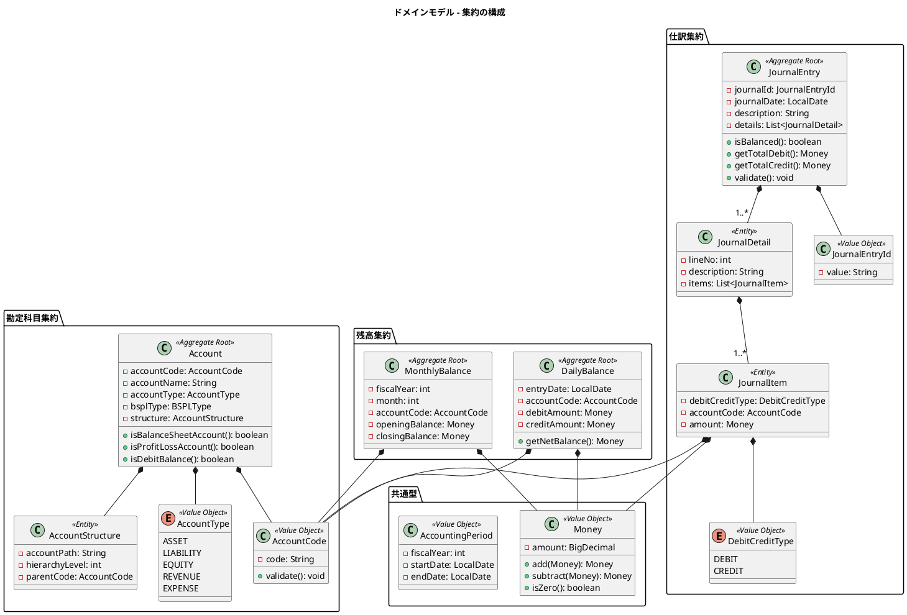

---

## 3. 値オブジェクト（Value Object）

### 3.1 Money（金額）

金額を表現する値オブジェクト。不変で、値による等価性を持ちます。

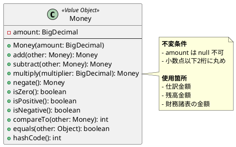

**実装例**:

```java
@Value
public class Money implements Comparable<Money> {
    public static final Money ZERO = new Money(BigDecimal.ZERO);

    BigDecimal amount;

    public Money(BigDecimal amount) {
        if (amount == null) {
            throw new IllegalArgumentException("金額は必須です");
        }
        this.amount = amount.setScale(2, RoundingMode.HALF_UP);
    }

    public Money add(Money other) {
        return new Money(this.amount.add(other.amount));
    }

    public Money subtract(Money other) {
        return new Money(this.amount.subtract(other.amount));
    }

    public Money negate() {
        return new Money(this.amount.negate());
    }

    public boolean isZero() {
        return this.amount.compareTo(BigDecimal.ZERO) == 0;
    }

    @Override
    public int compareTo(Money other) {
        return this.amount.compareTo(other.amount);
    }
}
```

### 3.2 AccountCode（勘定科目コード）

勘定科目を一意に識別するコード。フォーマット検証を含みます。

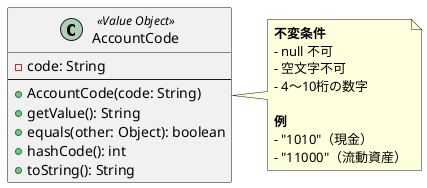

**実装例**:

```java
@Value
public class AccountCode {
    String code;

    public AccountCode(String code) {
        if (code == null || code.isBlank()) {
            throw new IllegalArgumentException("勘定科目コードは必須です");
        }
        if (!code.matches("^[0-9]{4,10}$")) {
            throw new IllegalArgumentException("勘定科目コードは4〜10桁の数字です: " + code);
        }
        this.code = code;
    }
}
```

### 3.3 JournalEntryId（仕訳伝票番号）

仕訳を一意に識別する伝票番号。採番ルールを含みます。

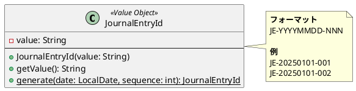

**実装例**:

```java
@Value
public class JournalEntryId {
    String value;

    public JournalEntryId(String value) {
        if (value == null || value.isBlank()) {
            throw new IllegalArgumentException("仕訳伝票番号は必須です");
        }
        if (!value.matches("^JE-\\d{8}-\\d{3}$")) {
            throw new IllegalArgumentException("仕訳伝票番号のフォーマットが不正です: " + value);
        }
        this.value = value;
    }

    public static JournalEntryId generate(LocalDate date, int sequence) {
        String value = String.format("JE-%s-%03d",
            date.format(DateTimeFormatter.BASIC_ISO_DATE),
            sequence);
        return new JournalEntryId(value);
    }
}
```

### 3.4 AccountType（勘定科目種別）

会計の5要素を表現する列挙型。

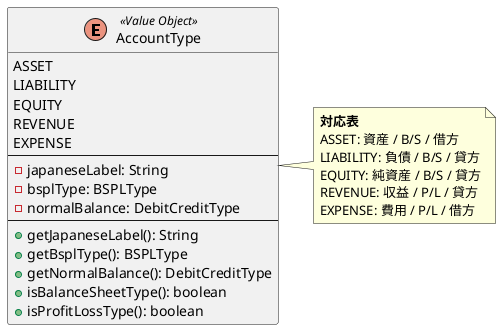

**実装例**:

```java
public enum AccountType {
    ASSET("資産", BSPLType.BALANCE_SHEET, DebitCreditType.DEBIT),
    LIABILITY("負債", BSPLType.BALANCE_SHEET, DebitCreditType.CREDIT),
    EQUITY("純資産", BSPLType.BALANCE_SHEET, DebitCreditType.CREDIT),
    REVENUE("収益", BSPLType.PROFIT_LOSS, DebitCreditType.CREDIT),
    EXPENSE("費用", BSPLType.PROFIT_LOSS, DebitCreditType.DEBIT);

    private final String japaneseLabel;
    private final BSPLType bsplType;
    private final DebitCreditType normalBalance;

    AccountType(String japaneseLabel, BSPLType bsplType, DebitCreditType normalBalance) {
        this.japaneseLabel = japaneseLabel;
        this.bsplType = bsplType;
        this.normalBalance = normalBalance;
    }

    public boolean isBalanceSheetType() {
        return this.bsplType == BSPLType.BALANCE_SHEET;
    }

    public boolean isProfitLossType() {
        return this.bsplType == BSPLType.PROFIT_LOSS;
    }
}
```

### 3.5 DebitCreditType（貸借区分）

借方・貸方を表現する列挙型。

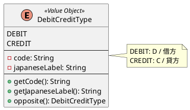

**実装例**:

```java
public enum DebitCreditType {
    DEBIT("D", "借方"),
    CREDIT("C", "貸方");

    private final String code;
    private final String japaneseLabel;

    DebitCreditType(String code, String japaneseLabel) {
        this.code = code;
        this.japaneseLabel = japaneseLabel;
    }

    public DebitCreditType opposite() {
        return this == DEBIT ? CREDIT : DEBIT;
    }
}
```

### 3.6 AccountingPeriod（会計期間）

会計年度と期間を表現する値オブジェクト。

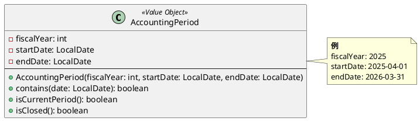

---

## 4. エンティティ（Entity）

### 4.1 Account（勘定科目）

勘定科目を表現するエンティティ。集約ルートとして機能します。

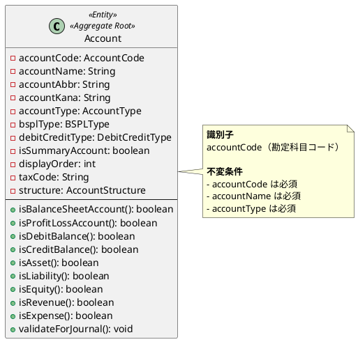

**実装例**:

```java
@Value
@With
public class Account {
    AccountCode accountCode;
    String accountName;
    String accountAbbr;
    String accountKana;
    AccountType accountType;
    BSPLType bsplType;
    DebitCreditType debitCreditType;
    boolean isSummaryAccount;
    Integer displayOrder;
    String taxCode;
    AccountStructure structure;

    public Account(AccountCode accountCode, String accountName, AccountType accountType) {
        if (accountCode == null) {
            throw new IllegalArgumentException("勘定科目コードは必須です");
        }
        if (accountName == null || accountName.isBlank()) {
            throw new IllegalArgumentException("勘定科目名は必須です");
        }
        if (accountType == null) {
            throw new IllegalArgumentException("勘定科目種別は必須です");
        }
        this.accountCode = accountCode;
        this.accountName = accountName;
        this.accountType = accountType;
        this.bsplType = accountType.getBsplType();
        this.debitCreditType = accountType.getNormalBalance();
        // その他のフィールドは WithBuilder で設定
    }

    public boolean isBalanceSheetAccount() {
        return bsplType == BSPLType.BALANCE_SHEET;
    }

    public boolean isProfitLossAccount() {
        return bsplType == BSPLType.PROFIT_LOSS;
    }

    public boolean isDebitBalance() {
        return debitCreditType == DebitCreditType.DEBIT;
    }

    public boolean isCreditBalance() {
        return debitCreditType == DebitCreditType.CREDIT;
    }

    public void validateForJournal() {
        if (isSummaryAccount) {
            throw new IllegalStateException("集計科目は仕訳に使用できません: " + accountCode);
        }
    }
}
```

### 4.2 AccountStructure（勘定科目構成）

勘定科目の階層構造を表現するエンティティ。チルダ連結方式を採用します。

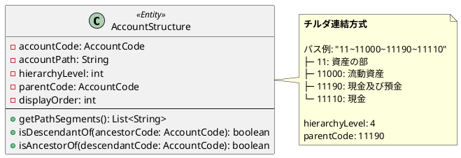

**実装例**:

```java
@Value
public class AccountStructure {
    AccountCode accountCode;
    String accountPath;
    int hierarchyLevel;
    AccountCode parentCode;
    int displayOrder;

    public List<String> getPathSegments() {
        return Arrays.asList(accountPath.split("~"));
    }

    public boolean isDescendantOf(AccountCode ancestorCode) {
        return accountPath.contains("~" + ancestorCode.getCode() + "~") ||
               accountPath.startsWith(ancestorCode.getCode() + "~");
    }

    public boolean isAncestorOf(AccountCode descendantCode) {
        // 子孫のパスがこのアカウントのパスで始まるかチェック
        return descendantCode != null;
    }
}
```

### 4.3 JournalEntry（仕訳）

仕訳伝票を表現するエンティティ。集約ルートとして機能し、複式簿記の原理を保証します。

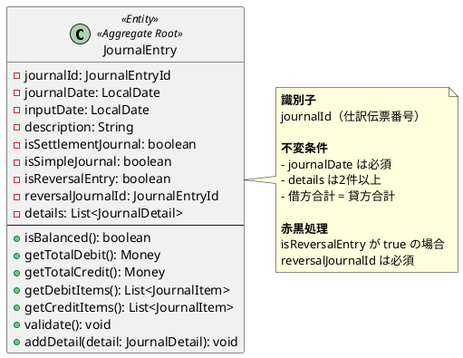

**実装例**:

```java
@Value
@With
public class JournalEntry {
    JournalEntryId journalId;
    LocalDate journalDate;
    LocalDate inputDate;
    String description;
    boolean isSettlementJournal;
    boolean isSimpleJournal;
    boolean isReversalEntry;
    JournalEntryId reversalJournalId;
    List<JournalDetail> details;

    public JournalEntry(JournalEntryId journalId, LocalDate journalDate,
                        String description, List<JournalDetail> details) {
        if (journalId == null) {
            throw new IllegalArgumentException("仕訳伝票番号は必須です");
        }
        if (journalDate == null) {
            throw new IllegalArgumentException("起票日は必須です");
        }
        if (details == null || details.size() < 1) {
            throw new IllegalArgumentException("仕訳明細は1件以上必要です");
        }

        this.journalId = journalId;
        this.journalDate = journalDate;
        this.inputDate = LocalDate.now();
        this.description = description;
        this.details = List.copyOf(details);
        this.isSettlementJournal = false;
        this.isSimpleJournal = details.size() == 1;
        this.isReversalEntry = false;
        this.reversalJournalId = null;
    }

    /**
     * 複式簿記の原則: 借方合計 = 貸方合計
     */
    public boolean isBalanced() {
        return getTotalDebit().compareTo(getTotalCredit()) == 0;
    }

    public Money getTotalDebit() {
        return details.stream()
                .flatMap(d -> d.getItems().stream())
                .filter(JournalItem::isDebit)
                .map(JournalItem::getAmount)
                .reduce(Money.ZERO, Money::add);
    }

    public Money getTotalCredit() {
        return details.stream()
                .flatMap(d -> d.getItems().stream())
                .filter(JournalItem::isCredit)
                .map(JournalItem::getAmount)
                .reduce(Money.ZERO, Money::add);
    }

    public void validate() {
        if (!isBalanced()) {
            throw new InvalidJournalEntryException(
                "貸借が一致していません。借方: " + getTotalDebit() + ", 貸方: " + getTotalCredit());
        }
        if (isReversalEntry && reversalJournalId == null) {
            throw new InvalidJournalEntryException("赤伝票には元伝票番号が必須です");
        }
    }
}
```

### 4.4 JournalDetail（仕訳明細）

仕訳の明細行を表現するエンティティ。行摘要を持ちます。

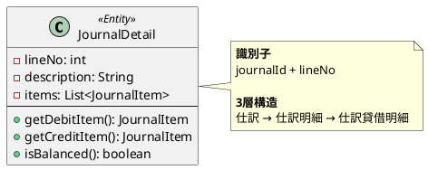

**実装例**:

```java
@Value
public class JournalDetail {
    int lineNo;
    String description;
    List<JournalItem> items;

    public JournalDetail(int lineNo, String description, List<JournalItem> items) {
        if (lineNo < 1) {
            throw new IllegalArgumentException("行番号は1以上です");
        }
        if (items == null || items.isEmpty()) {
            throw new IllegalArgumentException("貸借明細は1件以上必要です");
        }
        this.lineNo = lineNo;
        this.description = description;
        this.items = List.copyOf(items);
    }

    public Optional<JournalItem> getDebitItem() {
        return items.stream()
                .filter(JournalItem::isDebit)
                .findFirst();
    }

    public Optional<JournalItem> getCreditItem() {
        return items.stream()
                .filter(JournalItem::isCredit)
                .findFirst();
    }
}
```

### 4.5 JournalItem（仕訳貸借明細）

借方または貸方の詳細を表現するエンティティ。

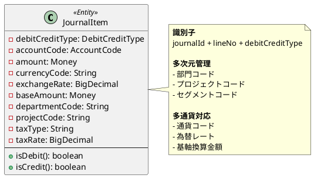

**実装例**:

```java
@Value
@With
public class JournalItem {
    DebitCreditType debitCreditType;
    AccountCode accountCode;
    Money amount;
    String currencyCode;
    BigDecimal exchangeRate;
    Money baseAmount;
    String departmentCode;
    String projectCode;
    String taxType;
    BigDecimal taxRate;

    public JournalItem(DebitCreditType debitCreditType, AccountCode accountCode, Money amount) {
        if (debitCreditType == null) {
            throw new IllegalArgumentException("貸借区分は必須です");
        }
        if (accountCode == null) {
            throw new IllegalArgumentException("勘定科目コードは必須です");
        }
        if (amount == null || amount.isZero()) {
            throw new IllegalArgumentException("金額は0より大きい値が必要です");
        }
        this.debitCreditType = debitCreditType;
        this.accountCode = accountCode;
        this.amount = amount;
        this.currencyCode = "JPY";
        this.exchangeRate = BigDecimal.ONE;
        this.baseAmount = amount;
        // その他はWithBuilderで設定
    }

    public boolean isDebit() {
        return debitCreditType == DebitCreditType.DEBIT;
    }

    public boolean isCredit() {
        return debitCreditType == DebitCreditType.CREDIT;
    }
}
```

---

## 5. 集約（Aggregate）

### 5.1 勘定科目集約

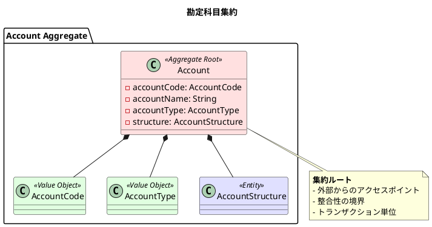

### 5.2 仕訳集約

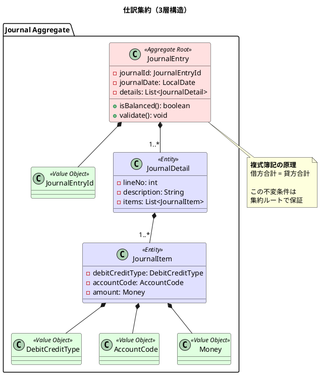

### 5.3 残高集約

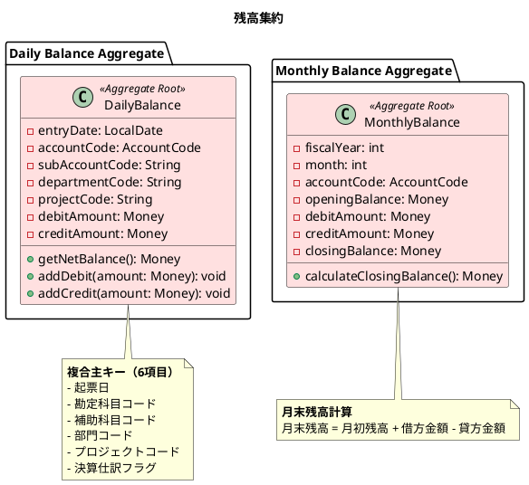

---

## 6. ドメインサービス（Domain Service）

### 6.1 BalanceCalculator（残高計算サービス）

複数の残高エンティティを跨ぐ計算ロジックを提供します。

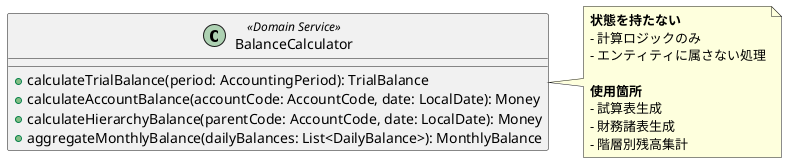

**実装例**:

```java
@Service
public class BalanceCalculator {

    public Money calculateAccountBalance(
            List<DailyBalance> balances,
            AccountCode accountCode,
            DebitCreditType normalBalance) {

        Money totalDebit = balances.stream()
                .filter(b -> b.getAccountCode().equals(accountCode))
                .map(DailyBalance::getDebitAmount)
                .reduce(Money.ZERO, Money::add);

        Money totalCredit = balances.stream()
                .filter(b -> b.getAccountCode().equals(accountCode))
                .map(DailyBalance::getCreditAmount)
                .reduce(Money.ZERO, Money::add);

        if (normalBalance == DebitCreditType.DEBIT) {
            return totalDebit.subtract(totalCredit);
        } else {
            return totalCredit.subtract(totalDebit);
        }
    }

    public Money calculateHierarchyBalance(
            List<DailyBalance> balances,
            List<AccountStructure> structures,
            AccountCode parentCode) {

        List<AccountCode> descendants = structures.stream()
                .filter(s -> s.isDescendantOf(parentCode))
                .map(AccountStructure::getAccountCode)
                .collect(Collectors.toList());

        return balances.stream()
                .filter(b -> descendants.contains(b.getAccountCode()))
                .map(b -> b.getDebitAmount().subtract(b.getCreditAmount()))
                .reduce(Money.ZERO, Money::add);
    }
}
```

### 6.2 JournalValidator（仕訳検証サービス）

仕訳登録時の業務ルール検証を行います。

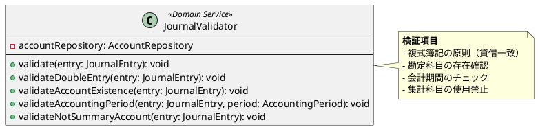

**実装例**:

```java
@Service
@RequiredArgsConstructor
public class JournalValidator {

    private final AccountRepository accountRepository;

    public void validate(JournalEntry entry) {
        validateDoubleEntry(entry);
        validateAccountExistence(entry);
        validateNotSummaryAccount(entry);
    }

    public void validateDoubleEntry(JournalEntry entry) {
        if (!entry.isBalanced()) {
            throw new InvalidJournalEntryException(
                "貸借が一致していません。借方: " + entry.getTotalDebit() +
                ", 貸方: " + entry.getTotalCredit());
        }
    }

    public void validateAccountExistence(JournalEntry entry) {
        for (JournalDetail detail : entry.getDetails()) {
            for (JournalItem item : detail.getItems()) {
                accountRepository.findByCode(item.getAccountCode())
                    .orElseThrow(() -> new AccountNotFoundException(
                        "勘定科目が存在しません: " + item.getAccountCode()));
            }
        }
    }

    public void validateNotSummaryAccount(JournalEntry entry) {
        for (JournalDetail detail : entry.getDetails()) {
            for (JournalItem item : detail.getItems()) {
                Account account = accountRepository.findByCode(item.getAccountCode())
                    .orElseThrow();
                account.validateForJournal();
            }
        }
    }
}
```

---

## 7. リポジトリ（Repository）

### 7.1 AccountRepository

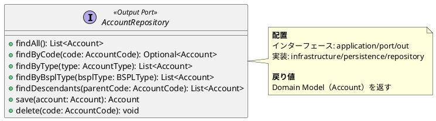

### 7.2 JournalEntryRepository

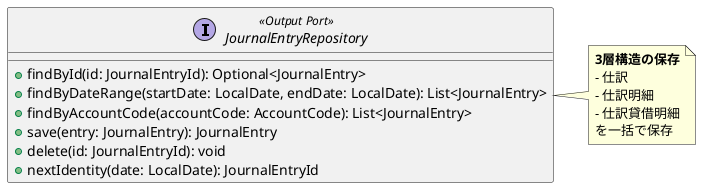

### 7.3 BalanceRepository

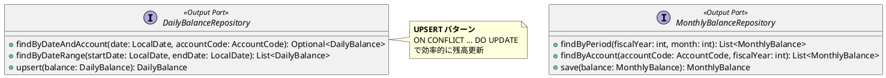

---

## 8. ファクトリ（Factory）

### 8.1 JournalEntryFactory

```plantuml
@startuml
interface JournalEntryFactory <<Factory>> {
  + create(date: LocalDate, description: String, details: List<JournalDetail>): JournalEntry
  + createReversalEntry(original: JournalEntry): JournalEntry
  + createSettlementEntry(date: LocalDate, details: List<JournalDetail>): JournalEntry
}

class JournalEntryFactoryImpl implements JournalEntryFactory {
  - journalEntryRepository: JournalEntryRepository
  --
  + create(...): JournalEntry
  + createReversalEntry(...): JournalEntry
  + createSettlementEntry(...): JournalEntry
}

note right of JournalEntryFactory
  **責務**
  - 仕訳伝票番号の採番
  - 赤伝票の生成
  - 決算仕訳の生成
end note
@enduml
```

**実装例**:

```java
@Service
@RequiredArgsConstructor
public class JournalEntryFactoryImpl implements JournalEntryFactory {

    private final JournalEntryRepository repository;

    @Override
    public JournalEntry create(LocalDate date, String description, List<JournalDetail> details) {
        JournalEntryId id = repository.nextIdentity(date);
        return new JournalEntry(id, date, description, details);
    }

    @Override
    public JournalEntry createReversalEntry(JournalEntry original) {
        JournalEntryId id = repository.nextIdentity(original.getJournalDate());

        List<JournalDetail> reversedDetails = original.getDetails().stream()
                .map(this::reverseDetail)
                .collect(Collectors.toList());

        return new JournalEntry(id, original.getJournalDate(),
                "【取消】" + original.getDescription(), reversedDetails)
                .withReversalEntry(true)
                .withReversalJournalId(original.getJournalId());
    }

    private JournalDetail reverseDetail(JournalDetail original) {
        List<JournalItem> reversedItems = original.getItems().stream()
                .map(item -> new JournalItem(
                        item.getDebitCreditType().opposite(),
                        item.getAccountCode(),
                        item.getAmount()))
                .collect(Collectors.toList());

        return new JournalDetail(original.getLineNo(), original.getDescription(), reversedItems);
    }
}
```

---

## 9. アプリケーションサービス

### 9.1 JournalEntryService

```plantuml
@startuml
class JournalEntryService <<Application Service>> {
  - journalEntryRepository: JournalEntryRepository
  - journalEntryFactory: JournalEntryFactory
  - journalValidator: JournalValidator
  - dailyBalanceRepository: DailyBalanceRepository
  --
  + createJournalEntry(command: CreateJournalEntryCommand): JournalEntry
  + getJournalEntry(id: JournalEntryId): JournalEntry
  + getJournalEntries(startDate: LocalDate, endDate: LocalDate): List<JournalEntry>
  + reverseJournalEntry(id: JournalEntryId): JournalEntry
}

note right of JournalEntryService
  **責務**
  - トランザクション管理
  - ドメインロジックの調整
  - 残高更新の連携

  **@Transactional**
  仕訳登録と残高更新を
  同一トランザクションで実行
end note
@enduml
```

**実装例**:

```java
@Service
@RequiredArgsConstructor
@Transactional
public class JournalEntryService {

    private final JournalEntryRepository journalEntryRepository;
    private final JournalEntryFactory journalEntryFactory;
    private final JournalValidator journalValidator;
    private final DailyBalanceRepository dailyBalanceRepository;

    public JournalEntry createJournalEntry(CreateJournalEntryCommand command) {
        // 1. ファクトリで仕訳を生成
        JournalEntry entry = journalEntryFactory.create(
                command.getJournalDate(),
                command.getDescription(),
                command.toDetails());

        // 2. ドメインサービスで検証
        journalValidator.validate(entry);

        // 3. 仕訳を保存
        JournalEntry saved = journalEntryRepository.save(entry);

        // 4. 日次残高を更新
        updateDailyBalances(saved);

        return saved;
    }

    private void updateDailyBalances(JournalEntry entry) {
        for (JournalDetail detail : entry.getDetails()) {
            for (JournalItem item : detail.getItems()) {
                Money debitAmount = item.isDebit() ? item.getAmount() : Money.ZERO;
                Money creditAmount = item.isCredit() ? item.getAmount() : Money.ZERO;

                DailyBalance balance = DailyBalance.of(
                        entry.getJournalDate(),
                        item.getAccountCode(),
                        debitAmount,
                        creditAmount);

                dailyBalanceRepository.upsert(balance);
            }
        }
    }

    @Transactional(readOnly = true)
    public JournalEntry getJournalEntry(JournalEntryId id) {
        return journalEntryRepository.findById(id)
                .orElseThrow(() -> new JournalNotFoundException("仕訳が見つかりません: " + id));
    }
}
```

---

## 10. ドメインモデル・データモデル対応表

### 10.1 勘定科目

| ドメインモデル | データモデル（テーブル） | 備考 |
|---------------|------------------------|------|
| Account | 勘定科目マスタ | 集約ルート |
| AccountCode | 勘定科目コード | 値オブジェクト |
| AccountStructure | 勘定科目構成マスタ | チルダ連結方式 |

### 10.2 仕訳

| ドメインモデル | データモデル（テーブル） | 備考 |
|---------------|------------------------|------|
| JournalEntry | 仕訳 | 集約ルート、ヘッダー |
| JournalDetail | 仕訳明細 | 行単位 |
| JournalItem | 仕訳貸借明細 | 借方・貸方明細 |
| JournalEntryId | 仕訳伝票番号 | 値オブジェクト |
| Money | 仕訳金額 | 値オブジェクト |

### 10.3 残高

| ドメインモデル | データモデル（テーブル） | 備考 |
|---------------|------------------------|------|
| DailyBalance | 日次勘定科目残高 | 集約ルート |
| MonthlyBalance | 月次勘定科目残高 | 集約ルート |

---

## 11. トレーサビリティ

### 11.1 ユースケースとの対応

| ユースケース | ドメインモデル | アプリケーションサービス |
|-------------|---------------|----------------------|
| UC001 勘定科目を登録する | Account, AccountCode | AccountService |
| UC002 勘定科目階層を設定する | AccountStructure | AccountService |
| UC005 仕訳を入力する | JournalEntry, JournalDetail, JournalItem | JournalEntryService |
| UC006 複合仕訳を入力する | JournalEntry（複数Detail） | JournalEntryService |
| UC010 総勘定元帳を照会する | DailyBalance | LedgerService |
| UC011 試算表を照会する | TrialBalance | FinancialStatementService |

### 11.2 ビジネスユースケースとの対応

| BUC | 関連ドメインモデル |
|-----|------------------|
| BUC01 日次経理業務 | JournalEntry, DailyBalance |
| BUC02 月次決算 | MonthlyBalance, TrialBalance |
| BUC03 財務状況把握 | BalanceSheet, IncomeStatement |
| BUC04 マスタ管理 | Account, AccountStructure |

---

## 12. 参考資料

- [第4章: データモデル設計の基礎](../article/backend/chapter04.md)
- [第5章: マスタデータモデル](../article/backend/chapter05.md)
- [第6章: トランザクションデータモデル](../article/backend/chapter06.md)
- [第7章: ドメインモデルとデータモデルの対応](../article/backend/chapter07.md)
- [ドメインモデル設計ガイド](../reference/ドメインモデル設計ガイド.md)
- [バックエンドアーキテクチャ設計書](architecture_backend.md)
- [データモデル設計書](data-model.md)
