# ドメインモデル設計

## 概要

本ドキュメントでは、財務会計システムのドメインモデル設計を定義します。ドメイン駆動設計（DDD）の戦術的設計パターンに従い、エンティティ、値オブジェクト、集約、ドメインサービス、リポジトリを定義します。

---

## 1. ドメインモデル全体構造

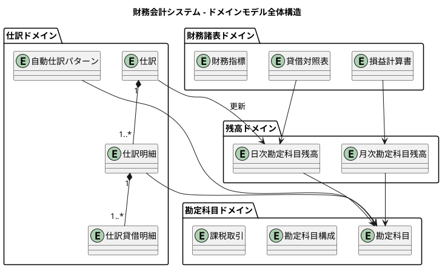

---

## 2. 値オブジェクト

### 2.1 金額（Money）

金額を表現する値オブジェクト。通貨コードと金額のペアで管理し、加減算などの演算をサポートします。

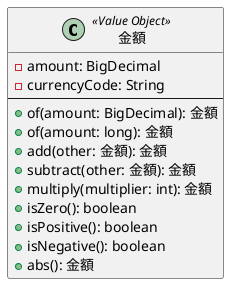

**ビジネスルール:**
- 金額は null 不可
- 小数点以下2桁で丸め（HALF_UP）
- 異なる通貨コード間での演算は不可
- デフォルト通貨は "JPY"

**実装例:**
```java
@Value
public class Money {
    public static final Money ZERO = new Money(BigDecimal.ZERO, "JPY");

    BigDecimal amount;
    String currencyCode;

    public Money add(Money other) {
        validateSameCurrency(other);
        return new Money(this.amount.add(other.amount), this.currencyCode);
    }
}
```

### 2.2 勘定科目コード（AccountCode）

勘定科目コードを表現する値オブジェクト。4桁の数字で構成され、先頭2桁で科目カテゴリを判定できます。

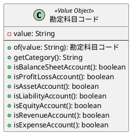

**ビジネスルール:**
- 4桁の数字のみ許可
- 先頭2桁でカテゴリを判定:
  - 11-19: 資産
  - 21-29: 負債
  - 31-39: 純資産
  - 41-49: 収益
  - 51-79: 費用

### 2.3 仕訳伝票番号（JournalEntryNumber）

仕訳伝票番号を表現する値オブジェクト。"JE" + 日付（yyyyMMdd）+ "-" + 連番（4桁）の形式で採番されます。

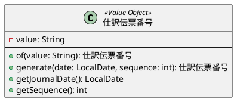

**ビジネスルール:**
- 形式: `JEyyyyMMdd-0001` (例: JE20250115-0001)
- 同一日内で連番を採番
- 一度発行された番号は変更不可

### 2.4 貸借区分（DebitCreditType）

借方・貸方を表現する列挙型。

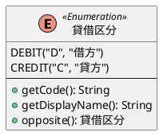

### 2.5 仕訳ステータス（JournalStatus）

仕訳の状態を表現する列挙型。

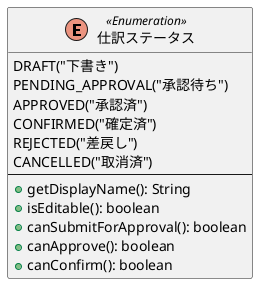

**状態遷移:**
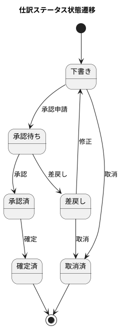

### 2.6 勘定科目種別（AccountType）

勘定科目の5分類を表現する列挙型。

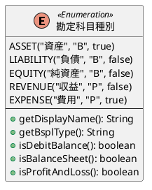

**ビジネスルール:**
- B/S（貸借対照表）: 資産、負債、純資産
- P/L（損益計算書）: 収益、費用
- 借方残高: 資産、費用
- 貸方残高: 負債、純資産、収益

---

## 3. エンティティ

### 3.1 勘定科目（Account）

勘定科目マスタのエンティティ。

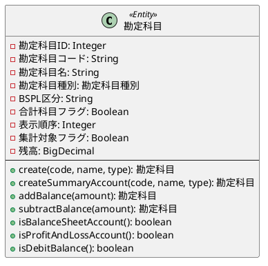

### 3.2 勘定科目構成（AccountStructure）

勘定科目の階層構造を管理するエンティティ。チルダ連結方式で階層パスを管理します。

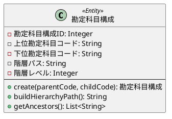

**チルダ連結方式:**
```
階層パス = "11~11000~11190~11110"
（勘定分類~大分類~中分類~小分類）
```

### 3.3 課税取引（TaxableTransaction）

消費税の課税取引マスタエンティティ。

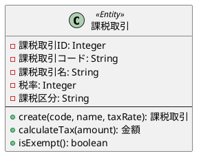

---

## 4. 集約

### 4.1 仕訳集約（JournalEntry Aggregate）

仕訳は3層構造（仕訳→仕訳明細→仕訳貸借明細）で構成される集約です。

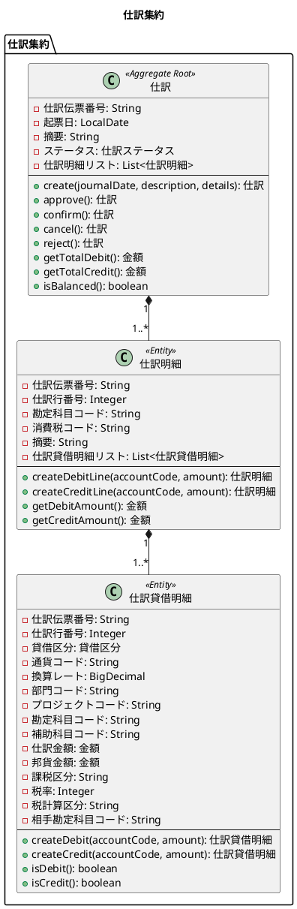

**不変条件（Invariant）:**
1. 借方合計 = 貸方合計（複式簿記の原則）
2. 仕訳明細は2件以上必要
3. 借方と貸方の両方が必要
4. 金額は0より大きい正の値

**ファクトリメソッド:**
```java
public static JournalEntry create(
        LocalDate journalDate,
        String description,
        List<JournalEntryDetail> details) {

    // 不変条件1: 仕訳明細は必須
    if (details == null || details.isEmpty()) {
        throw new IllegalArgumentException("仕訳明細が必要です");
    }

    // 不変条件2: 借方と貸方の両方が必要
    boolean hasDebit = details.stream().anyMatch(d -> d.isDebit());
    boolean hasCredit = details.stream().anyMatch(d -> d.isCredit());
    if (!hasDebit || !hasCredit) {
        throw new IllegalArgumentException("借方と貸方の両方が必要です");
    }

    // 不変条件3: 貸借一致
    Money totalDebit = calculateTotalDebit(details);
    Money totalCredit = calculateTotalCredit(details);
    if (!totalDebit.equals(totalCredit)) {
        throw new IllegalArgumentException(
            String.format("借方と貸方が一致しません: 借方=%s, 貸方=%s",
                totalDebit, totalCredit));
    }

    return new JournalEntry(...);
}
```

### 4.2 自動仕訳パターン集約

自動仕訳の設定パターンを管理する集約。

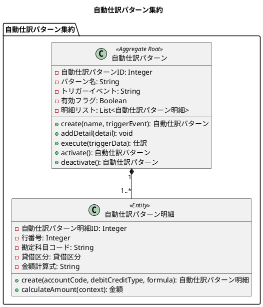

---

## 5. ドメインサービス

### 5.1 仕訳ドメインサービス

複数の仕訳にまたがるビジネスロジックを実装するドメインサービス。

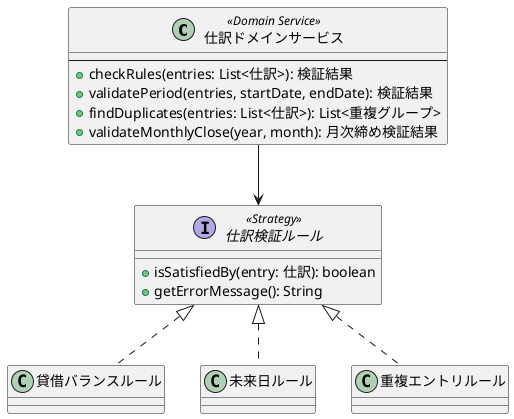

**検証ルールパターン:**
```java
public interface JournalValidationRule {
    boolean isSatisfiedBy(JournalEntry entry);
    String getErrorMessage();
}

// 貸借バランスルール
class BalanceRule implements JournalValidationRule {
    @Override
    public boolean isSatisfiedBy(JournalEntry entry) {
        return entry.isBalanced();
    }

    @Override
    public String getErrorMessage() {
        return "借方と貸方が一致しません";
    }
}
```

### 5.2 残高計算ドメインサービス

勘定科目残高の計算を行うドメインサービス。

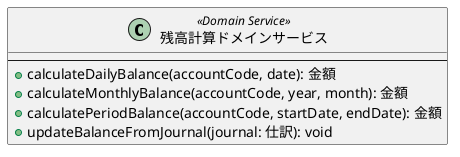

### 5.3 財務分析ドメインサービス

財務諸表の生成と財務指標の計算を行うドメインサービス。

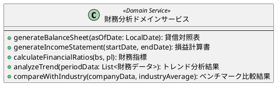

---

## 6. リポジトリ

### 6.1 勘定科目リポジトリ

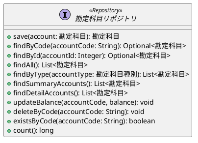

### 6.2 仕訳リポジトリ

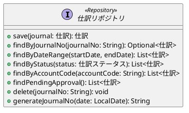

### 6.3 日次勘定科目残高リポジトリ

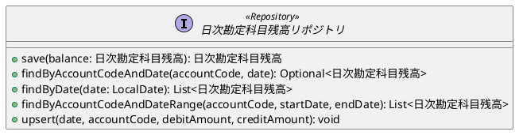

### 6.4 月次勘定科目残高リポジトリ

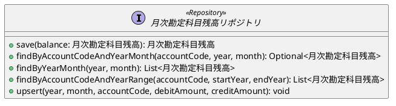

---

## 7. 財務諸表ドメインモデル

### 7.1 貸借対照表（BalanceSheet）

```plantuml
@startuml
class 貸借対照表 <<Entity>> {
  - asOfDate: LocalDate
  - assets: List<貸借対照表項目>
  - liabilities: List<貸借対照表項目>
  - equity: List<貸借対照表項目>
  - totalAssets: BigDecimal
  - totalLiabilities: BigDecimal
  - totalEquity: BigDecimal
  - totalLiabilitiesAndEquity: BigDecimal
  --
  + create(asOfDate, assets, liabilities, equity): 貸借対照表
  + isBalanced(): boolean
  + getCurrentAssets(): BigDecimal
  + getFixedAssets(): BigDecimal
  + getCurrentLiabilities(): BigDecimal
  + getLongTermLiabilities(): BigDecimal
}

class 貸借対照表項目 <<Value Object>> {
  - accountCode: String
  - accountName: String
  - category: 勘定科目区分
  - balance: BigDecimal
  - percentage: BigDecimal
  --
  + of(accountCode, accountName, category, balance): 貸借対照表項目
  + withCalculatedPercentage(total): 貸借対照表項目
  + isCurrentAsset(): boolean
  + isFixedAsset(): boolean
  + isCurrentLiability(): boolean
  + isLongTermLiability(): boolean
}

貸借対照表 "1" *-- "*" 貸借対照表項目

@enduml
```

**貸借平均の原則:**
```
資産 = 負債 + 純資産
```

### 7.2 損益計算書（IncomeStatement）

```plantuml
@startuml
class 損益計算書 <<Entity>> {
  - startDate: LocalDate
  - endDate: LocalDate
  - revenues: List<損益計算書項目>
  - expenses: List<損益計算書項目>
  - totalRevenue: BigDecimal
  - totalExpense: BigDecimal
  - netIncome: BigDecimal
  --
  + create(startDate, endDate, revenues, expenses): 損益計算書
  + getGrossProfit(): BigDecimal
  + getOperatingProfit(): BigDecimal
  + getOrdinaryProfit(): BigDecimal
  + getNetIncome(): BigDecimal
}

class 損益計算書項目 <<Value Object>> {
  - accountCode: String
  - accountName: String
  - category: 勘定科目区分
  - amount: BigDecimal
  - percentage: BigDecimal
  --
  + of(accountCode, accountName, category, amount): 損益計算書項目
  + withCalculatedPercentage(total): 損益計算書項目
  + isSalesRevenue(): boolean
  + isCostOfSales(): boolean
  + isOperatingExpense(): boolean
}

損益計算書 "1" *-- "*" 損益計算書項目

@enduml
```

**利益計算:**
```
売上総利益 = 売上高 - 売上原価
営業利益 = 売上総利益 - 販売費及び一般管理費
経常利益 = 営業利益 + 営業外収益 - 営業外費用
当期純利益 = 経常利益 + 特別利益 - 特別損失 - 法人税等
```

### 7.3 財務指標（FinancialRatios）

```plantuml
@startuml
class 財務指標 <<Value Object>> {
  - 収益性指標: 収益性指標
  - 効率性指標: 効率性指標
  - 安全性指標: 安全性指標
  --
  + calculate(bs: 貸借対照表, pl: 損益計算書): 財務指標
}

class 収益性指標 <<Value Object>> {
  - 売上高総利益率: BigDecimal
  - 売上高営業利益率: BigDecimal
  - 売上高経常利益率: BigDecimal
  - 総資本利益率（ROA）: BigDecimal
  - 自己資本利益率（ROE）: BigDecimal
}

class 効率性指標 <<Value Object>> {
  - 総資本回転率: BigDecimal
  - 売上債権回転率: BigDecimal
  - 棚卸資産回転率: BigDecimal
  - 固定資産回転率: BigDecimal
}

class 安全性指標 <<Value Object>> {
  - 流動比率: BigDecimal
  - 当座比率: BigDecimal
  - 自己資本比率: BigDecimal
  - 固定比率: BigDecimal
  - 固定長期適合率: BigDecimal
}

財務指標 *-- 収益性指標
財務指標 *-- 効率性指標
財務指標 *-- 安全性指標

@enduml
```

**主要財務指標の計算式:**

| 指標 | 計算式 |
|------|--------|
| 売上高総利益率 | 売上総利益 ÷ 売上高 × 100 |
| 売上高営業利益率 | 営業利益 ÷ 売上高 × 100 |
| ROA（総資本利益率） | 当期純利益 ÷ 総資産 × 100 |
| ROE（自己資本利益率） | 当期純利益 ÷ 自己資本 × 100 |
| 流動比率 | 流動資産 ÷ 流動負債 × 100 |
| 当座比率 | 当座資産 ÷ 流動負債 × 100 |
| 自己資本比率 | 自己資本 ÷ 総資本 × 100 |
| 総資本回転率 | 売上高 ÷ 総資本 |

---

## 8. アプリケーションサービス

### 8.1 勘定科目サービス

```plantuml
@startuml
class 勘定科目サービス <<Application Service>> {
  - accountRepository: 勘定科目リポジトリ
  --
  + createAccount(command: 勘定科目作成コマンド): 勘定科目
  + findByCode(accountCode: String): 勘定科目
  + findAll(): List<勘定科目>
  + findByType(accountType: 勘定科目種別): List<勘定科目>
  + updateAccount(command: 勘定科目更新コマンド): 勘定科目
  + deleteAccount(accountCode: String): void
}
@enduml
```

### 8.2 仕訳サービス

```plantuml
@startuml
class 仕訳サービス <<Application Service>> {
  - journalRepository: 仕訳リポジトリ
  - accountRepository: 勘定科目リポジトリ
  - dailyBalanceRepository: 日次勘定科目残高リポジトリ
  - journalDomainService: 仕訳ドメインサービス
  --
  + createJournalEntry(command: 仕訳作成コマンド): 仕訳
  + getJournalEntry(journalNo: String): 仕訳
  + getJournalEntries(startDate, endDate): List<仕訳>
  + approveJournalEntry(journalNo: String): 仕訳
  + confirmJournalEntry(journalNo: String): 仕訳
  + cancelJournalEntry(journalNo: String): 仕訳
}
@enduml
```

**トランザクション管理:**
```java
@Service
@RequiredArgsConstructor
@Transactional
public class JournalEntryService {

    public JournalEntry createJournalEntry(CreateJournalEntryCommand command) {
        // 1. ビジネスルール検証
        validateJournalEntry(command);

        // 2. 仕訳を保存
        JournalEntry saved = journalRepository.save(command.toJournalEntry());

        // 3. 日次残高を更新
        updateDailyBalances(saved);

        return saved;
    }
}
```

### 8.3 財務諸表サービス

```plantuml
@startuml
class 財務諸表サービス <<Application Service>> {
  - dailyBalanceRepository: 日次勘定科目残高リポジトリ
  - monthlyBalanceRepository: 月次勘定科目残高リポジトリ
  - financialAnalysisDomainService: 財務分析ドメインサービス
  --
  + generateBalanceSheet(query: 貸借対照表クエリ): 貸借対照表
  + generateIncomeStatement(query: 損益計算書クエリ): 損益計算書
  + calculateFinancialRatios(fiscalYear: int): 財務指標
}
@enduml
```

---

## 9. パッケージ構成

```
com.example.accounting/
├── domain/
│   ├── model/
│   │   ├── account/
│   │   │   ├── Account.java            # 勘定科目エンティティ
│   │   │   ├── AccountType.java        # 勘定科目種別（列挙型）
│   │   │   └── AccountCode.java        # 勘定科目コード（値オブジェクト）
│   │   ├── journal/
│   │   │   ├── JournalEntry.java       # 仕訳（集約ルート）
│   │   │   ├── JournalEntryDetail.java # 仕訳明細
│   │   │   ├── JournalEntryDetailItem.java # 仕訳貸借明細
│   │   │   ├── JournalEntryNumber.java # 仕訳伝票番号（値オブジェクト）
│   │   │   ├── JournalStatus.java      # 仕訳ステータス（列挙型）
│   │   │   ├── DebitCreditType.java    # 貸借区分（列挙型）
│   │   │   └── Money.java              # 金額（値オブジェクト）
│   │   ├── balance/
│   │   │   ├── DailyBalance.java       # 日次勘定科目残高
│   │   │   └── MonthlyBalance.java     # 月次勘定科目残高
│   │   └── financial/
│   │       ├── BalanceSheet.java       # 貸借対照表
│   │       ├── BalanceSheetItem.java   # 貸借対照表項目
│   │       ├── IncomeStatement.java    # 損益計算書
│   │       ├── IncomeStatementItem.java # 損益計算書項目
│   │       ├── FinancialRatios.java    # 財務指標
│   │       └── AccountCategory.java    # 勘定科目区分（列挙型）
│   └── service/
│       ├── JournalDomainService.java   # 仕訳ドメインサービス
│       ├── BalanceCalculationService.java # 残高計算ドメインサービス
│       └── FinancialAnalysisDomainService.java # 財務分析ドメインサービス
│
├── application/
│   ├── port/
│   │   ├── in/
│   │   │   ├── AccountUseCase.java     # 勘定科目ユースケース
│   │   │   ├── JournalEntryUseCase.java # 仕訳ユースケース
│   │   │   ├── FinancialStatementUseCase.java # 財務諸表ユースケース
│   │   │   ├── command/
│   │   │   │   ├── CreateAccountCommand.java
│   │   │   │   ├── UpdateAccountCommand.java
│   │   │   │   └── CreateJournalEntryCommand.java
│   │   │   └── query/
│   │   │       ├── BalanceSheetQuery.java
│   │   │       └── IncomeStatementQuery.java
│   │   └── out/
│   │       ├── AccountRepository.java  # 勘定科目リポジトリ
│   │       ├── JournalEntryRepository.java # 仕訳リポジトリ
│   │       ├── DailyBalanceRepository.java # 日次残高リポジトリ
│   │       └── MonthlyBalanceRepository.java # 月次残高リポジトリ
│   └── service/
│       ├── AccountService.java         # 勘定科目サービス
│       ├── JournalEntryService.java    # 仕訳サービス
│       └── FinancialStatementService.java # 財務諸表サービス
│
└── infrastructure/
    ├── persistence/
    │   ├── entity/
    │   │   ├── AccountEntity.java
    │   │   ├── JournalEntryEntity.java
    │   │   └── ...
    │   ├── mapper/
    │   │   ├── AccountMapper.java
    │   │   ├── JournalEntryMapper.java
    │   │   └── ...
    │   └── repository/
    │       ├── AccountRepositoryImpl.java
    │       ├── JournalEntryRepositoryImpl.java
    │       └── ...
    └── web/
        ├── controller/
        │   ├── AccountController.java
        │   ├── JournalEntryController.java
        │   └── FinancialStatementController.java
        └── dto/
            ├── AccountRequest.java
            ├── AccountResponse.java
            ├── JournalEntryRequest.java
            └── JournalEntryResponse.java
```

---

## 10. 設計原則

### 10.1 リッチドメインモデル

ビジネスロジックはドメインモデル（エンティティ、値オブジェクト）に集約します。

| 配置場所 | 責務 |
|---------|------|
| エンティティ | 単一エンティティの操作、自身の状態に基づく計算、自身の整合性チェック |
| ドメインサービス | 複数エンティティにまたがる操作、外部情報が必要な計算、複数エンティティの整合性チェック |
| アプリケーションサービス | トランザクション管理、ユースケースの調整、リポジトリ呼び出し |

### 10.2 不変条件の保証

コンストラクタおよびファクトリメソッドで不変条件を保証します。

```java
public static JournalEntry create(...) {
    // 不変条件の検証
    if (!isBalanced()) {
        throw new IllegalArgumentException("借方と貸方が一致しません");
    }
    return new JournalEntry(...);
}
```

### 10.3 値オブジェクトの活用

プリミティブ型の代わりに値オブジェクトを使用し、型安全性とドメイン知識の表現を向上させます。

| プリミティブ | 値オブジェクト | メリット |
|-------------|--------------|---------|
| String | AccountCode | 4桁数字のバリデーション、カテゴリ判定 |
| BigDecimal | Money | 通貨コード管理、丸め処理、演算 |
| String | JournalEntryNumber | 形式バリデーション、日付・連番抽出 |

### 10.4 依存性逆転の原則

リポジトリインターフェースは Application 層に配置し、実装は Infrastructure 層に配置します。

```
Domain Layer ← Application Layer → Infrastructure Layer
    ↑              ↑                    ↓
    └──────────────┴────────────────────┘
         依存方向: Infrastructure → Application → Domain
```

---

## 関連ドキュメント

- [データモデル設計](data-model.md)
- [バックエンドアーキテクチャ設計](architecture_backend.md)
- [フロントエンドアーキテクチャ設計](architecture_frontend.md)
- [要件定義](../requirements/requirements_definition.md)
- [ユーザーストーリー](../requirements/user_story.md)
