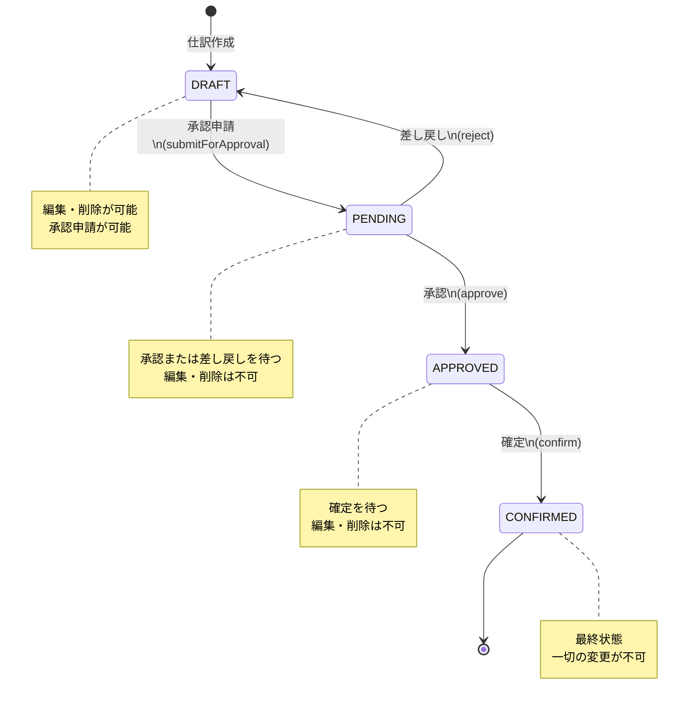
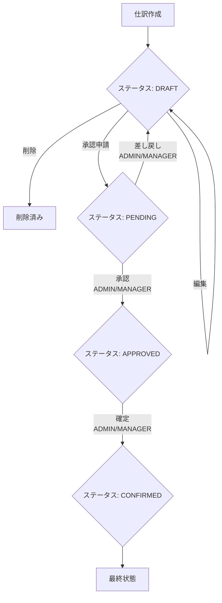

# 仕訳ステータス遷移図

## 概要

仕訳（JournalEntry）は作成から確定までのライフサイクルにおいて、4 つのステータスを遷移します。本ドキュメントでは、各ステータスと遷移条件、許可される操作を定義します。

## ステータス一覧

| ステータス | 表示名 | 説明 |
|-----------|--------|------|
| DRAFT | 下書き | 初期状態。編集・削除が可能 |
| PENDING | 承認待ち | 承認申請済み。承認または差し戻しを待つ |
| APPROVED | 承認済み | 承認完了。確定を待つ |
| CONFIRMED | 確定済み | 最終状態。変更不可 |

## ステータス遷移図

## 遷移条件

### DRAFT → PENDING（承認申請）

| 項目 | 内容 |
|------|------|
| メソッド | `JournalEntry.submitForApproval()` |
| API | `POST /api/journal-entries/{id}/submit` |
| 実行権限 | ADMIN, MANAGER, USER |
| 前提条件 | ステータスが DRAFT であること |
| エラー | 「下書き状態の仕訳のみ承認申請可能です」 |

### PENDING → APPROVED（承認）

| 項目 | 内容 |
|------|------|
| メソッド | `JournalEntry.approve(approver, approvedAt)` |
| API | `POST /api/journal-entries/{id}/approve` |
| 実行権限 | ADMIN, MANAGER |
| 前提条件 | ステータスが PENDING であること |
| 記録項目 | 承認者（approvedBy）、承認日時（approvedAt） |
| エラー | 「承認待ち状態の仕訳のみ承認可能です」 |

### PENDING → DRAFT（差し戻し）

| 項目 | 内容 |
|------|------|
| メソッド | `JournalEntry.reject(rejector, rejectedAt, rejectionReason)` |
| API | `POST /api/journal-entries/{id}/reject` |
| 実行権限 | ADMIN, MANAGER |
| 前提条件 | ステータスが PENDING であること |
| 必須入力 | 差し戻し理由（rejectionReason） |
| 記録項目 | 差し戻し者（rejectedBy）、差し戻し日時（rejectedAt）、差し戻し理由 |
| エラー | 「承認待ち状態の仕訳のみ差し戻し可能です」 |

### APPROVED → CONFIRMED（確定）

| 項目 | 内容 |
|------|------|
| メソッド | `JournalEntry.confirm(confirmer, confirmedAt)` |
| API | `POST /api/journal-entries/{id}/confirm` |
| 実行権限 | ADMIN, MANAGER |
| 前提条件 | ステータスが APPROVED であること |
| 記録項目 | 確定者（confirmedBy）、確定日時（confirmedAt） |
| エラー | 「承認済み状態の仕訳のみ確定可能です」 |

## ステータス別の許可操作

| 操作 | DRAFT | PENDING | APPROVED | CONFIRMED |
|------|-------|---------|----------|-----------|
| 編集 | ✅ | ❌ | ❌ | ❌ |
| 削除 | ✅ | ❌ | ❌ | ❌ |
| 承認申請 | ✅ | ❌ | ❌ | ❌ |
| 承認 | ❌ | ✅ | ❌ | ❌ |
| 差し戻し | ❌ | ✅ | ❌ | ❌ |
| 確定 | ❌ | ❌ | ✅ | ❌ |
| 閲覧 | ✅ | ✅ | ✅ | ✅ |

## ロール別の操作権限

| 操作 | ADMIN | MANAGER | USER | VIEWER |
|------|-------|---------|------|--------|
| 仕訳作成 | ✅ | ✅ | ✅ | ❌ |
| 仕訳編集 | ✅ | ✅ | ✅ | ❌ |
| 仕訳削除 | ✅ | ✅ | ✅ | ❌ |
| 承認申請 | ✅ | ✅ | ✅ | ❌ |
| 承認 | ✅ | ✅ | ❌ | ❌ |
| 差し戻し | ✅ | ✅ | ❌ | ❌ |
| 確定 | ✅ | ✅ | ❌ | ❌ |
| 閲覧 | ✅ | ✅ | ✅ | ✅ |

## フロー図

## 実装上の注意事項

1. **不変条件**: 各遷移メソッドは遷移前のステータスを厳密にチェックし、不正な遷移を `IllegalStateException` で拒否する
2. **楽観的ロック**: 仕訳編集時は version フィールドによる楽観的ロック制御を行う
3. **監査証跡**: 承認・差し戻し・確定の各操作で実行者と日時を記録する
4. **差し戻し後の再申請**: 差し戻された仕訳は DRAFT に戻り、編集後に再度承認申請が可能
5. **バックエンド保護**: `@PreAuthorize` アノテーションにより API レベルで権限を強制する

## 関連ソースコード

| ファイル | 説明 |
|---------|------|
| `JournalEntryStatus.java` | ステータス列挙型 |
| `JournalEntry.java` | ドメインモデル（遷移メソッド） |
| `JournalEntryController.java` | REST API エンドポイント |
