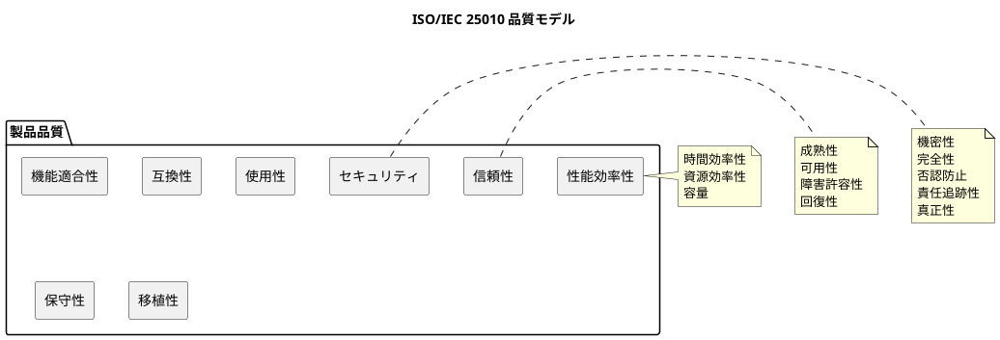
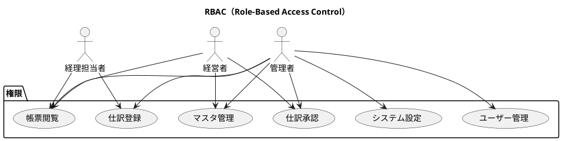
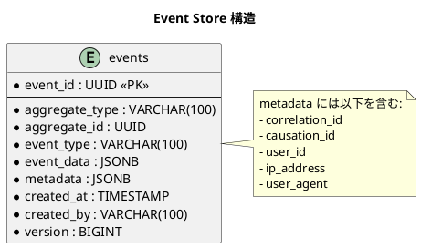
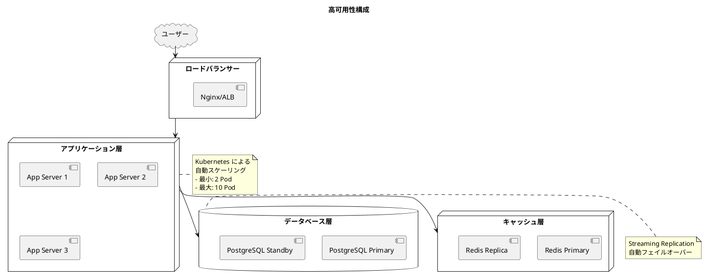
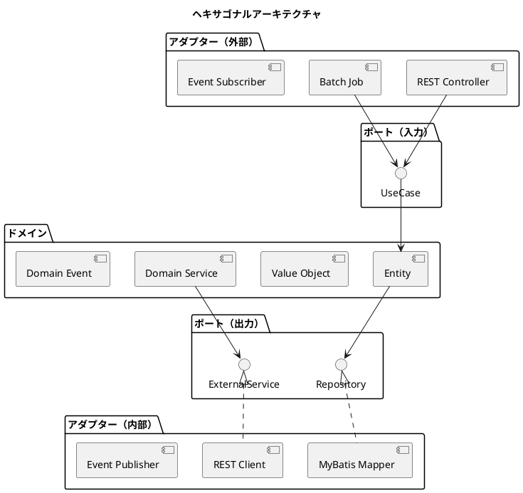
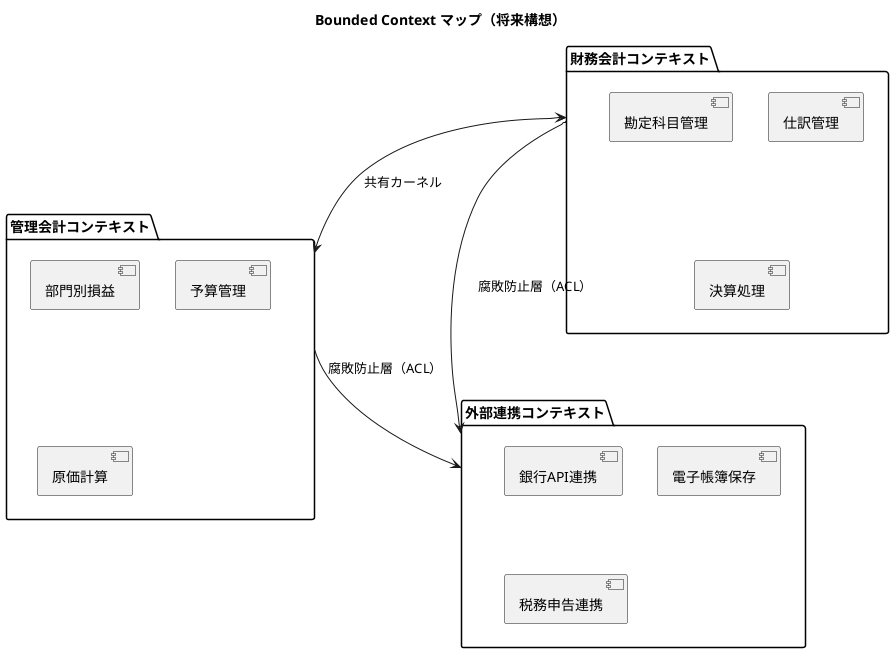
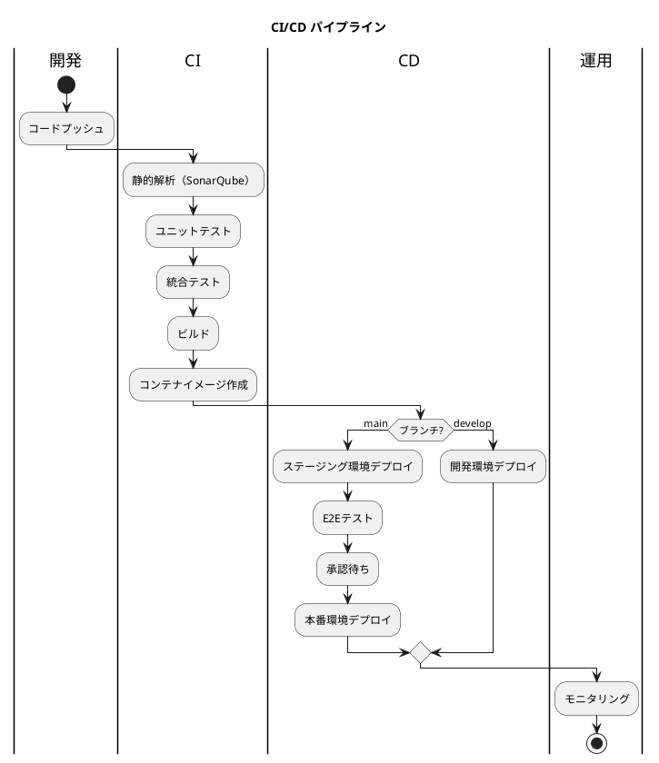

# 非機能要件定義書

## 概要

本ドキュメントは、財務会計システムの非機能要件を定義します。ISO/IEC 25010 品質モデルおよび FURPS+ モデルに基づき、システムが満たすべき品質特性を明確にします。

### 対象システム

- システム名: 財務会計システム
- 対象ユーザー: 経理担当者、経営者、管理者
- 主要業務: 日次経理業務、月次決算業務、年次決算業務

### 品質モデル



---

## 1. 性能要件（Performance）

### 1.1 応答時間

| 操作カテゴリ | 目標応答時間 | 最大許容時間 | 備考 |
|-------------|-------------|-------------|------|
| 画面表示（一覧） | 1秒以内 | 3秒以内 | ページネーション適用時 |
| 画面表示（詳細） | 0.5秒以内 | 2秒以内 | |
| データ登録・更新 | 1秒以内 | 3秒以内 | 仕訳登録含む |
| 検索処理 | 2秒以内 | 5秒以内 | 複雑な条件検索 |
| 帳票出力（PDF） | 5秒以内 | 30秒以内 | 月次レポート |
| バッチ処理 | - | 処理件数×0.1秒 | 夜間バッチ |

### 1.2 スループット

| 指標 | 目標値 | 測定条件 |
|-----|-------|---------|
| 同時接続ユーザー数 | 100ユーザー | 通常業務時間帯 |
| ピーク時同時接続 | 200ユーザー | 月末決算期間 |
| トランザクション処理 | 1,000件/分 | 仕訳登録処理 |
| API リクエスト | 10,000件/分 | REST API 全体 |

### 1.3 リソース効率性

| リソース | 通常時上限 | アラート閾値 | 自動スケール閾値 |
|---------|----------|------------|----------------|
| CPU 使用率 | 50% | 60% | 70% |
| メモリ使用率 | 60% | 70% | 80% |
| ディスク使用率 | 70% | 80% | - |
| データベース接続数 | 50 | 80 | 100（最大） |

### 1.4 容量要件

| 項目 | 初期容量 | 年間増加量 | 5年後予測 |
|-----|---------|----------|----------|
| 仕訳データ | 100万件 | 50万件 | 350万件 |
| 勘定科目マスタ | 1,000件 | 100件 | 1,500件 |
| ユーザー数 | 50名 | 10名 | 100名 |
| ストレージ容量 | 100GB | 50GB | 350GB |
| バックアップ容量 | 300GB | 150GB | 1TB |

---

## 2. セキュリティ要件（Security）

### 2.1 認証・認可

| 要件項目 | 仕様 | 実装方式 |
|---------|-----|---------|
| 認証方式 | JWT（JSON Web Token） | Spring Security + OAuth2 |
| トークン有効期限 | アクセストークン: 1時間、リフレッシュトークン: 7日 | |
| パスワードポリシー | 8文字以上、英大小文字・数字・記号を含む | BCrypt ハッシュ化 |
| パスワード有効期限 | 90日 | |
| ログイン試行制限 | 5回失敗でアカウントロック（30分） | |
| 多要素認証 | オプション対応（TOTP） | 将来実装 |

### 2.2 権限管理



| ロール | 権限 |
|-------|-----|
| 経理担当者（ACCOUNTANT） | 仕訳登録・編集、帳票閲覧 |
| 経営者（MANAGER） | 仕訳承認、帳票閲覧、マスタ閲覧 |
| 管理者（ADMIN） | 全権限 |

### 2.3 データ保護

| 対象 | 保護方式 | アルゴリズム |
|-----|---------|------------|
| 通信経路 | TLS 1.3 | AES-256-GCM |
| パスワード | ハッシュ化 | BCrypt（コストファクター12） |
| 機密データ（保存時） | 暗号化 | AES-256 |
| バックアップ | 暗号化 | AES-256 |
| API キー | 環境変数管理 | - |

### 2.4 監査ログ

| ログ種別 | 保存項目 | 保存期間 |
|---------|---------|---------|
| 認証ログ | ユーザーID、日時、IP、結果 | 1年 |
| 操作ログ | ユーザーID、操作内容、対象データ、日時 | 7年 |
| システムログ | 処理内容、エラー詳細、スタックトレース | 1年 |
| アクセスログ | リクエスト情報、レスポンス時間 | 90日 |

**Event Sourcing による完全な操作履歴**



### 2.5 セキュリティ対策

| 脅威 | 対策 |
|-----|-----|
| SQL インジェクション | PreparedStatement、MyBatis パラメータバインディング |
| XSS | React の自動エスケープ、CSP ヘッダー |
| CSRF | SameSite Cookie、CSRF トークン |
| セッションハイジャック | Secure Cookie、HttpOnly、トークンローテーション |
| ブルートフォース | レート制限、アカウントロック |
| 情報漏洩 | エラーメッセージの最小化、スタックトレース非表示 |

---

## 3. 可用性要件（Availability）

### 3.1 稼働率目標

| 環境 | 目標稼働率 | 年間許容ダウンタイム |
|-----|----------|-------------------|
| 本番環境 | 99.9% | 8時間46分 |
| ステージング環境 | 99.0% | 87時間36分 |
| 開発環境 | 95.0% | 438時間 |

### 3.2 計画停止

| 項目 | 条件 |
|-----|-----|
| 定期メンテナンス時間 | 毎月第2日曜日 2:00-6:00 |
| 事前通知期間 | 3営業日前 |
| 緊急メンテナンス通知 | 可能な限り1時間前 |

### 3.3 障害復旧目標

| 指標 | 目標値 | 説明 |
|-----|-------|-----|
| RPO（Recovery Point Objective） | 1時間 | データ損失許容時間 |
| RTO（Recovery Time Objective） | 4時間 | サービス復旧目標時間 |
| MTTR（Mean Time To Repair） | 2時間 | 平均修復時間 |
| MTBF（Mean Time Between Failures） | 2,160時間（90日） | 平均故障間隔 |

### 3.4 冗長構成



### 3.5 バックアップ戦略

| バックアップ種別 | 頻度 | 保存期間 | 保存先 |
|----------------|-----|---------|-------|
| フルバックアップ | 週次（日曜日） | 4世代 | オフサイト |
| 差分バックアップ | 日次 | 7日分 | オンサイト |
| トランザクションログ | 1時間毎 | 24時間分 | オンサイト |
| 長期アーカイブ | 年次 | 7年 | オフサイト（法定保存） |

---

## 4. 信頼性要件（Reliability）

### 4.1 データ整合性

| 要件 | 実装方式 |
|-----|---------|
| トランザクション管理 | Spring @Transactional、ACID 準拠 |
| 楽観的ロック | バージョン番号方式（version カラム） |
| 同時更新検出 | HTTP 409 Conflict レスポンス |
| 外部キー制約 | データベースレベルで強制 |
| 一意性制約 | データベースレベルで強制 |

**楽観的ロックの実装**

```java
@Entity
public class JournalEntry {
    @Id
    private UUID id;

    @Version
    private Long version;

    // 他のフィールド
}

// 更新時の競合検出
UPDATE journal_entries
SET amount = ?, version = version + 1
WHERE id = ? AND version = ?
```

### 4.2 障害許容性

| 障害シナリオ | 対応方式 | 復旧時間目標 |
|------------|---------|------------|
| アプリケーションサーバー障害 | 自動フェイルオーバー | 30秒以内 |
| データベースプライマリ障害 | スタンバイへの昇格 | 5分以内 |
| キャッシュ障害 | データベースフォールバック | 即座 |
| 外部サービス障害 | サーキットブレーカー | 即座（degraded mode） |
| ネットワーク障害 | リトライ機構 | 3回リトライ後エラー |

### 4.3 データ検証

| 検証項目 | 実装レイヤー | 方式 |
|---------|------------|-----|
| 入力値検証 | プレゼンテーション層 | Bean Validation |
| ビジネスルール検証 | ドメイン層 | ドメインサービス |
| 参照整合性検証 | インフラ層 | データベース制約 |
| 貸借一致検証 | ドメイン層 | 仕訳エンティティ |

---

## 5. 使用性要件（Usability）

### 5.1 ユーザビリティ目標

| 指標 | 目標値 | 測定方法 |
|-----|-------|---------|
| 学習容易性 | 基本操作習得: 2時間以内 | ユーザーテスト |
| 操作効率性 | 仕訳登録: 30秒以内 | タスク完了時間 |
| エラー率 | 入力エラー: 5%以下 | 操作ログ分析 |
| 満足度 | SUS スコア: 70以上 | アンケート調査 |

### 5.2 アクセシビリティ

| 要件 | 対応レベル |
|-----|----------|
| WCAG 2.1 | レベル AA 準拠 |
| キーボード操作 | 全機能対応 |
| スクリーンリーダー | 対応 |
| 色覚対応 | コントラスト比 4.5:1 以上 |
| フォントサイズ | 可変対応（100%-200%） |

### 5.3 多言語対応（将来対応）

| 対応言語 | 優先度 | 対応時期 |
|---------|-------|---------|
| 日本語 | 必須 | 初期リリース |
| 英語 | 高 | Phase 2 |
| 中国語（簡体字） | 中 | Phase 3 |

---

## 6. 保守性要件（Maintainability）

### 6.1 コード品質基準

| 指標 | 目標値 | 測定ツール |
|-----|-------|----------|
| テストカバレッジ（行） | 80%以上 | JaCoCo |
| テストカバレッジ（分岐） | 70%以上 | JaCoCo |
| 循環的複雑度 | 10以下/メソッド | SonarQube |
| 重複コード率 | 3%以下 | SonarQube |
| 技術的負債 | A ランク維持 | SonarQube |

### 6.2 アーキテクチャ原則



| 原則 | 説明 |
|-----|-----|
| 依存性逆転 | ドメイン層は外部に依存しない |
| 単一責任 | 各クラスは1つの責務のみ |
| 開放閉鎖 | 拡張に開き、修正に閉じる |
| インターフェース分離 | 必要最小限のインターフェース |

### 6.3 CQRS パターン

| 側面 | コマンド（Write） | クエリ（Read） |
|-----|-----------------|---------------|
| 最適化対象 | データ整合性 | パフォーマンス |
| データモデル | 正規化 | 非正規化（ビュー） |
| トランザクション | 必須 | 読み取り専用 |
| キャッシュ | 無効化 | 積極活用 |

### 6.4 モニタリング・監視

| 監視項目 | ツール | アラート条件 |
|---------|-------|------------|
| アプリケーションメトリクス | Prometheus | 閾値超過時 |
| ログ集約 | Fluentd + Elasticsearch | エラー発生時 |
| ダッシュボード | Grafana | - |
| 分散トレーシング | OpenTelemetry | レイテンシ異常時 |
| エラートラッキング | Sentry | 新規エラー発生時 |

### 6.5 ログ設計

| ログレベル | 用途 | 出力先 |
|----------|-----|-------|
| ERROR | 異常終了、例外発生 | ファイル + アラート |
| WARN | 警告、リトライ発生 | ファイル |
| INFO | 処理開始/終了、業務イベント | ファイル |
| DEBUG | 詳細なデバッグ情報 | 開発環境のみ |

**ログフォーマット（構造化ログ）**

```json
{
  "timestamp": "2025-01-15T10:30:00.000Z",
  "level": "INFO",
  "logger": "com.example.accounting.usecase.journal.RegisterJournalUseCase",
  "message": "仕訳を登録しました",
  "traceId": "abc123",
  "spanId": "def456",
  "userId": "user001",
  "journalId": "journal-uuid",
  "amount": 10000
}
```

---

## 7. 移植性要件（Portability）

### 7.1 実行環境

| 項目 | 仕様 |
|-----|-----|
| コンテナランタイム | Docker 24.x 以上 |
| オーケストレーション | Kubernetes 1.28 以上 |
| Java バージョン | Java 25（LTS） |
| Node.js バージョン | Node.js 22.x（LTS） |

### 7.2 データベース互換性

| 項目 | 対応状況 |
|-----|---------|
| PostgreSQL | 16.x（推奨） |
| MySQL | 将来対応検討 |
| Oracle | 将来対応検討 |

### 7.3 ブラウザ対応

| ブラウザ | 対応バージョン |
|---------|--------------|
| Google Chrome | 最新2バージョン |
| Mozilla Firefox | 最新2バージョン |
| Microsoft Edge | 最新2バージョン |
| Safari | 最新2バージョン |

---

## 8. 拡張性要件（Scalability）

### 8.1 水平スケーリング

| コンポーネント | スケーリング方式 | 条件 |
|--------------|----------------|-----|
| アプリケーション | Pod オートスケール | CPU > 70% |
| データベース | リードレプリカ追加 | 接続数 > 80% |
| キャッシュ | Redis Cluster | メモリ使用率 > 80% |

### 8.2 マルチテナント対応（将来）

| 方式 | 説明 | 採用時期 |
|-----|-----|---------|
| スキーマ分離 | テナント毎にスキーマを分離 | Phase 2 |
| 行レベル分離 | tenant_id カラムによる分離 | 初期リリース（準備） |
| データベース分離 | テナント毎にDB分離 | 大規模テナント対応時 |

### 8.3 Bounded Context の進化



---

## 9. 運用要件（Operations）

### 9.1 デプロイメント

| 項目 | 仕様 |
|-----|-----|
| デプロイ方式 | ブルー/グリーン デプロイメント |
| ロールバック | 1コマンドで前バージョンに復元 |
| デプロイ頻度 | 週1回（定期）、随時（緊急） |
| デプロイ時間帯 | 平日 10:00-15:00（監視可能時間帯） |

### 9.2 CI/CD パイプライン



### 9.3 バージョニング

| 項目 | 規則 |
|-----|-----|
| バージョン形式 | セマンティックバージョニング（MAJOR.MINOR.PATCH） |
| MAJOR | 後方互換性のない変更 |
| MINOR | 後方互換性のある機能追加 |
| PATCH | 後方互換性のあるバグ修正 |
| プレリリース | -alpha, -beta, -rc |

### 9.4 データ保存期間

| データ種別 | 保存期間 | 根拠 |
|----------|---------|-----|
| 仕訳データ | 7年 | 法人税法・会社法 |
| 勘定科目マスタ | 永続 | - |
| 監査ログ | 7年 | 電子帳簿保存法 |
| アクセスログ | 1年 | セキュリティ要件 |
| バックアップ（長期） | 7年 | 法定保存期間 |

---

## 10. SLA/SLO 定義

### 10.1 サービスレベル目標（SLO）

| 指標 | 目標値 | 測定期間 |
|-----|-------|---------|
| 可用性 | 99.9% | 月次 |
| 平均応答時間 | 1秒以下 | 日次 |
| エラー率 | 0.1%以下 | 日次 |
| デプロイ成功率 | 99%以上 | 月次 |

### 10.2 サービスレベル指標（SLI）

| SLI | 計算方法 |
|-----|---------|
| 可用性 | (稼働時間 / 総時間) × 100 |
| レイテンシ | P95 応答時間 |
| エラー率 | (5xx エラー数 / 総リクエスト数) × 100 |
| スループット | 成功リクエスト数 / 時間 |

### 10.3 エスカレーション

| 重大度 | 条件 | 対応時間 | エスカレーション先 |
|-------|-----|---------|-----------------|
| Critical | サービス停止 | 15分以内 | 運用チームリーダー → 開発責任者 |
| High | 主要機能障害 | 1時間以内 | 運用チーム |
| Medium | 一部機能障害 | 4時間以内 | 開発チーム |
| Low | 軽微な問題 | 翌営業日 | 担当開発者 |

---

## 付録

### A. 用語定義

| 用語 | 定義 |
|-----|-----|
| RPO | Recovery Point Objective - データ損失許容時間 |
| RTO | Recovery Time Objective - サービス復旧目標時間 |
| MTTR | Mean Time To Repair - 平均修復時間 |
| MTBF | Mean Time Between Failures - 平均故障間隔 |
| SLA | Service Level Agreement - サービスレベル契約 |
| SLO | Service Level Objective - サービスレベル目標 |
| SLI | Service Level Indicator - サービスレベル指標 |

### B. 関連ドキュメント

| ドキュメント | 場所 |
|------------|-----|
| 要件定義書 | docs/requirements/requirements_definition.md |
| バックエンドアーキテクチャ | docs/design/architecture_backend.md |
| フロントエンドアーキテクチャ | docs/design/architecture_frontend.md |
| インフラアーキテクチャ | docs/design/architecture_infrastructure.md |
| テスト戦略 | docs/design/test_strategy.md |
| データモデル | docs/design/data-model.md |
| ドメインモデル | docs/design/domain-model.md |

### C. 改訂履歴

| バージョン | 日付 | 変更内容 | 担当者 |
|----------|-----|---------|-------|
| 1.0.0 | 2025-12-17 | 初版作成 | - |
