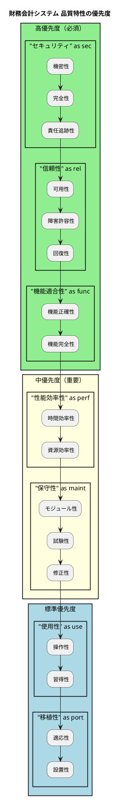
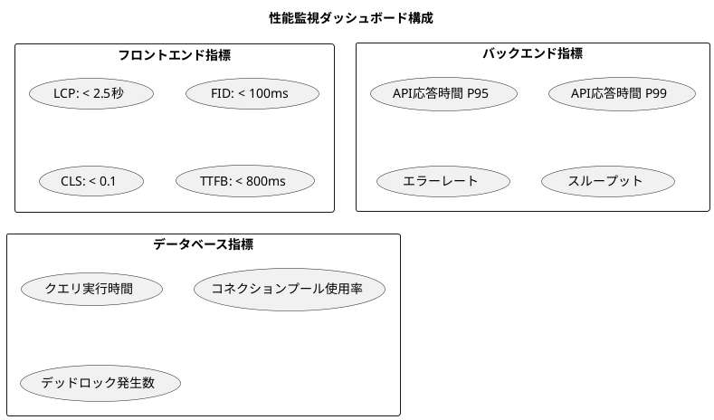
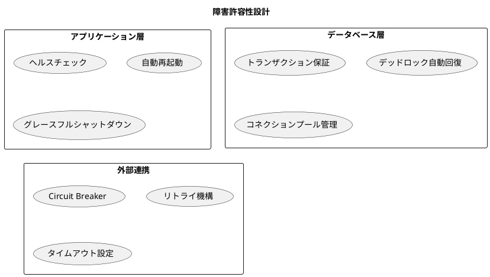
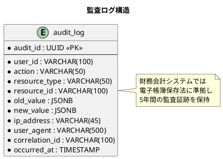
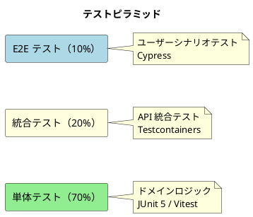
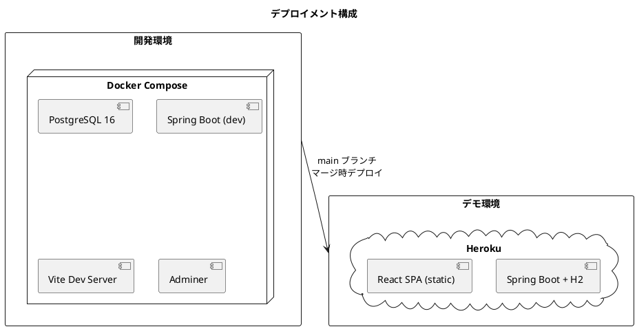

# 非機能要件定義書

## 概要

本ドキュメントは、財務会計システムの非機能要件を定義します。ISO/IEC 25010 品質モデルに基づき、システムの品質属性を明確化し、測定可能な目標値を設定します。

## 品質特性概要

---

## 1. 性能効率性（Performance Efficiency）

### 1.1 応答時間要件

| 操作カテゴリ | 目標応答時間 | 最大許容時間 |
|-------------|-------------|-------------|
| ページ初回表示 | < 2秒 | 3秒 |
| ページ遷移 | < 1秒 | 2秒 |
| 一覧検索 | < 1秒 | 2秒 |
| 仕訳登録 | < 1秒 | 2秒 |
| 仕訳承認 | < 500ms | 1秒 |
| 財務諸表生成 | < 3秒 | 5秒 |
| レポート出力 | < 5秒 | 10秒 |

### 1.2 スループット要件

| 項目 | 目標値 | 備考 |
|------|-------|------|
| 同時ユーザー数 | 50名 | ピーク時100名 |
| 仕訳処理能力 | 10件/秒 | 通常運用時 |
| 月次処理 | 10,000件/時間 | バッチ処理 |
| API リクエスト | 100件/秒 | 全エンドポイント合計 |

### 1.3 容量要件

| 項目 | 目標値 | 備考 |
|------|-------|------|
| 年間仕訳データ | 100,000件 | 5年間保持 |
| 勘定科目マスタ | 1,000件 | 上限設定 |
| ユーザー数 | 100名 | 上限設定 |
| 添付ファイル | 100MB/年 | 証憑保存 |

### 1.4 性能測定指標

---

## 2. 信頼性（Reliability）

### 2.1 可用性要件

| 項目 | 目標値 | 計算方法 |
|------|-------|---------|
| 稼働率（年間） | 99.9% | 年間ダウンタイム < 8.77時間 |
| 営業時間内稼働率 | 99.95% | 平日 9:00-18:00 |
| 計画停止 | 月1回/2時間以内 | 営業時間外実施 |

### 2.2 障害対応時間

| 障害レベル | 検知時間 | 初期対応 | 復旧目標 |
|-----------|---------|---------|---------|
| 重大（全面停止） | < 5分 | < 15分 | < 2時間 |
| 高（主要機能停止） | < 10分 | < 30分 | < 4時間 |
| 中（一部機能停止） | < 30分 | < 1時間 | < 8時間 |
| 低（軽微な不具合） | < 1時間 | < 4時間 | 翌営業日 |

### 2.3 データ保護要件

| 項目 | 目標値 | 備考 |
|------|-------|------|
| RPO（目標復旧時点） | 1時間 | データ損失許容範囲 |
| RTO（目標復旧時間） | 4時間 | システム復旧時間 |
| バックアップ頻度 | 日次 | 差分バックアップ |
| フルバックアップ | 週次 | 日曜深夜実施 |
| バックアップ保持期間 | 90日 | 四半期分保持 |

### 2.4 障害許容性

---

## 3. セキュリティ（Security）

### 3.1 認証要件

| 項目 | 要件 | 実装方式 |
|------|-----|---------|
| 認証方式 | JWT Bearer Token | Spring Security |
| トークン有効期限 | 24時間 | アクセストークン |
| リフレッシュトークン | 30日 | 自動更新対応 |
| パスワード強度 | 8文字以上、複雑性必須 | 大小英数字記号 |
| アカウントロック | 5回連続失敗で30分ロック | ブルートフォース対策 |
| セッション管理 | シングルセッション | 重複ログイン防止 |

### 3.2 認可要件

| ロール | 権限範囲 | 備考 |
|--------|---------|------|
| ADMIN | 全機能・全データ | システム管理者 |
| MANAGER | 承認・レポート閲覧 | 管理職 |
| ACCOUNTANT | 仕訳入力・閲覧 | 経理担当者 |
| VIEWER | 閲覧のみ | 参照ユーザー |

### 3.3 データ保護

| 項目 | 要件 | 実装方式 |
|------|-----|---------|
| 通信暗号化 | HTTPS/TLS 1.3 | 全通信対象 |
| パスワード保存 | BCrypt（強度12） | ハッシュ化 |
| 機密データ暗号化 | AES-256-GCM | 個人情報対象 |
| SQL インジェクション対策 | パラメータバインド | MyBatis |
| XSS 対策 | 自動エスケープ | React |
| CSRF 対策 | トークン検証 | Spring Security |

### 3.4 監査ログ

| ログ種別 | 記録項目 | 保持期間 |
|---------|---------|---------|
| 認証ログ | ログイン/ログアウト、失敗 | 1年 |
| 操作ログ | 全 CRUD 操作 | 5年 |
| エラーログ | 例外・エラー発生 | 90日 |
| アクセスログ | API リクエスト | 90日 |

### 3.5 セキュリティ要件チェックリスト

- [x] OWASP Top 10 対策
- [x] 入力バリデーション
- [x] 出力エンコーディング
- [x] 認証・認可制御
- [x] セッション管理
- [x] 暗号化（通信・保存）
- [x] 監査ログ
- [x] エラーハンドリング
- [x] セキュリティヘッダー

---

## 4. 使用性（Usability）

### 4.1 操作性要件

| 項目 | 目標値 | 備考 |
|------|-------|------|
| 主要機能へのアクセス | 3クリック以内 | ナビゲーション設計 |
| 仕訳入力完了時間 | < 2分 | 熟練ユーザー |
| 初回学習時間 | < 1時間 | 基本操作習得 |
| エラー回復 | 1クリック | Undo 機能 |

### 4.2 アクセシビリティ要件

| 項目 | 対応レベル | 備考 |
|------|-----------|------|
| WCAG 準拠 | 2.1 Level AA | Web アクセシビリティ |
| キーボード操作 | 全機能対応 | マウス不要で操作可能 |
| スクリーンリーダー | 対応 | ARIA 属性設定 |
| 色覚対応 | 対応 | コントラスト比 4.5:1 以上 |
| フォントサイズ | 可変 | 200% まで拡大可能 |

### 4.3 レスポンシブ対応

| デバイス | 画面幅 | 対応状況 |
|---------|-------|---------|
| デスクトップ | 1920px 以上 | フル機能 |
| ラップトップ | 1280px 以上 | フル機能 |
| タブレット | 768px 以上 | 主要機能 |
| スマートフォン | 375px 以上 | 参照機能のみ |

### 4.4 対応ブラウザ

| ブラウザ | バージョン | 対応状況 |
|---------|-----------|---------|
| Chrome | 最新2バージョン | フル対応 |
| Firefox | 最新2バージョン | フル対応 |
| Safari | 最新2バージョン | フル対応 |
| Edge | 最新2バージョン | フル対応 |

---

## 5. 保守性（Maintainability）

### 5.1 コード品質基準

| 項目 | 目標値 | 測定ツール |
|------|-------|-----------|
| テストカバレッジ（全体） | > 80% | JaCoCo |
| テストカバレッジ（ドメイン層） | > 90% | JaCoCo |
| 循環的複雑度 | < 10 | SonarQube |
| 重複コード率 | < 3% | SonarQube |
| 技術的負債 | Rating A | SonarQube |
| コードスメル | 0（Critical） | SonarQube |

### 5.2 テスト戦略（テストピラミッド）

### 5.3 ドキュメント要件

| ドキュメント | 形式 | 更新頻度 |
|-------------|------|---------|
| API 仕様書 | OpenAPI 3.0 | コード変更時自動生成 |
| アーキテクチャ設計書 | Markdown + PlantUML | 設計変更時 |
| データモデル | ER 図 + DDL | スキーマ変更時 |
| 運用手順書 | Markdown | 手順変更時 |
| 障害対応手順 | Markdown | 障害対応後 |

### 5.4 監視・ログ要件

| 項目 | 要件 | 実装方式 |
|------|-----|---------|
| 構造化ログ | JSON 形式 | Logback |
| ログレベル | ERROR/WARN/INFO/DEBUG | 環境別設定 |
| メトリクス | Micrometer | Spring Boot Actuator |
| トレーシング | 相関 ID | MDC |
| ヘルスチェック | liveness/readiness | Actuator |

---

## 6. 移植性（Portability）

### 6.1 実行環境要件

| 環境 | 構成 | 備考 |
|------|-----|------|
| 開発環境 | Docker Compose | ローカル開発 |
| テスト環境 | GitHub Actions | CI/CD |
| デモ環境 | Heroku Container + H2 | プレゼン用 |

### 6.2 技術スタック

| レイヤー | 技術 | バージョン |
|---------|------|-----------|
| バックエンド | Java | 25 |
| フレームワーク | Spring Boot | 4.x |
| ORM | MyBatis | 3.x |
| データベース（開発） | PostgreSQL | 16 |
| データベース（デモ） | H2 | 2.x |
| フロントエンド | React | 18 |
| 言語 | TypeScript | 5.x |
| ビルドツール | Vite | 5.x |
| 状態管理 | TanStack Query | 5.x |

### 6.3 コンテナ化

---

## 7. 運用要件

### 7.1 デプロイ要件

| 項目 | 要件 | 備考 |
|------|-----|------|
| デプロイ方式 | コンテナデプロイ | Docker |
| デプロイ頻度 | 週1回以上 | 継続的デリバリー |
| ロールバック | 5分以内 | 前バージョンへ復元 |
| ダウンタイム | ゼロ目標 | ローリングアップデート |

### 7.2 バックアップ・リカバリ

| 項目 | 要件 | 備考 |
|------|-----|------|
| バックアップ対象 | データベース全体 | PostgreSQL |
| バックアップ頻度 | 日次（差分）、週次（フル） | |
| 保持期間 | 90日 | 四半期分 |
| リストア検証 | 月次 | 復旧テスト実施 |

### 7.3 監視・アラート

| 監視項目 | 閾値 | アラートレベル |
|---------|------|---------------|
| CPU 使用率 | > 80% | Warning |
| メモリ使用率 | > 85% | Warning |
| ディスク使用率 | > 80% | Warning |
| API エラー率 | > 1% | Warning |
| API エラー率 | > 5% | Critical |
| 応答時間 P95 | > 2秒 | Warning |
| 応答時間 P95 | > 5秒 | Critical |

---

## 8. 法令・規制対応

### 8.1 電子帳簿保存法対応

| 要件 | 対応内容 | 備考 |
|------|---------|------|
| 真実性の確保 | タイムスタンプ、操作ログ | 改ざん防止 |
| 可視性の確保 | 検索機能、帳簿出力 | 即時参照可能 |
| 保存期間 | 7年間 | 仕訳データ |
| 監査証跡 | 全操作の記録 | 5年間保持 |

### 8.2 内部統制（J-SOX）対応

| 統制項目 | 対応内容 | 備考 |
|---------|---------|------|
| アクセス制御 | ロールベース認可 | 職務分離 |
| 変更管理 | 承認ワークフロー | 仕訳承認 |
| 監査証跡 | 操作ログ完全記録 | 追跡可能性 |
| 整合性チェック | 貸借一致検証 | 自動検証 |

---

## 9. 非機能要件トレーサビリティ

| 要件ID | 要件カテゴリ | 関連設計書 | 検証方法 |
|--------|-------------|-----------|---------|
| NFR-001 | 性能効率性 | architecture_backend.md | 負荷テスト |
| NFR-002 | 信頼性 | architecture_infrastructure.md | 障害注入テスト |
| NFR-003 | セキュリティ | architecture_backend.md | セキュリティテスト |
| NFR-004 | 使用性 | architecture_frontend.md | ユーザビリティテスト |
| NFR-005 | 保守性 | test_strategy.md | コード品質分析 |
| NFR-006 | 移植性 | architecture_infrastructure.md | 環境構築テスト |

---

## 10. まとめ

### 品質特性の優先順位

1. **セキュリティ**: 財務データの機密性・完全性確保が最優先
2. **信頼性**: 業務継続性とデータ保護の確保
3. **機能正確性**: 会計処理の正確性保証
4. **性能効率性**: ユーザー体験と業務効率の向上
5. **保守性**: 継続的な改善と長期運用の支援

### 継続的改善

本非機能要件は、運用開始後も継続的にモニタリングし、実測値に基づいて見直しを行います。

- 月次：性能メトリクスレビュー
- 四半期：セキュリティ監査
- 年次：全体的な非機能要件見直し
