# 運用要件定義書

## 概要

本ドキュメントは、財務会計システムの運用要件を定義します。日常運用から障害対応まで、システムの安定稼働を維持するために必要な運用プロセスと手順を明確化します。

## 運用方針

### 運用目標

| 項目 | 目標値 | 備考 |
|------|-------|------|
| システム稼働率 | 99.9% | 年間ダウンタイム < 8.77時間 |
| 営業時間内稼働率 | 99.95% | 平日 9:00-18:00 |
| 計画停止 | 月1回/2時間以内 | 営業時間外実施 |
| MTTR（平均復旧時間） | < 2時間 | 重大障害時 |

### 運用体制

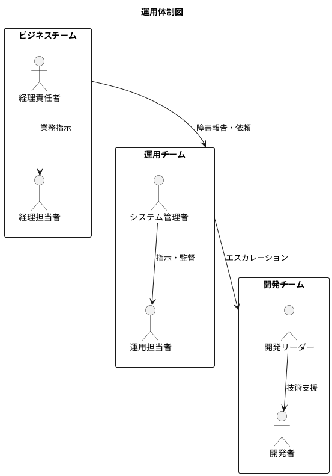

---

## 1. 運用フロー

### 1.1 日次運用

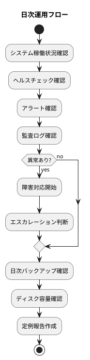

#### 日次運用チェックリスト

| 時間帯 | 作業項目 | 確認内容 | 担当 |
|-------|---------|---------|------|
| 9:00 | システム稼働確認 | ヘルスチェック OK | 運用担当者 |
| 9:00 | アラート確認 | 前日夜間のアラート確認 | 運用担当者 |
| 9:30 | バックアップ確認 | 日次バックアップ成功確認 | 運用担当者 |
| 10:00 | 監査ログ確認 | 不審なアクセスの有無 | 運用担当者 |
| 17:00 | リソース確認 | CPU/メモリ/ディスク使用率 | 運用担当者 |
| 18:00 | 日次報告 | 運用状況の報告 | 運用担当者 |

### 1.2 週次運用

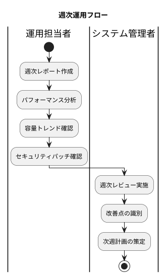

#### 週次運用チェックリスト

| 曜日 | 作業項目 | 確認内容 | 担当 |
|-----|---------|---------|------|
| 月 | 週次レポート作成 | 前週の運用状況まとめ | 運用担当者 |
| 火 | パフォーマンス分析 | レスポンス時間トレンド | 運用担当者 |
| 水 | セキュリティ確認 | パッチ適用状況確認 | システム管理者 |
| 木 | 容量計画確認 | ストレージ・DB 成長予測 | 運用担当者 |
| 金 | 週次レビュー | 運用課題の確認と対策 | システム管理者 |
| 日 | フルバックアップ | 週次フルバックアップ実行 | 自動 |

### 1.3 月次運用

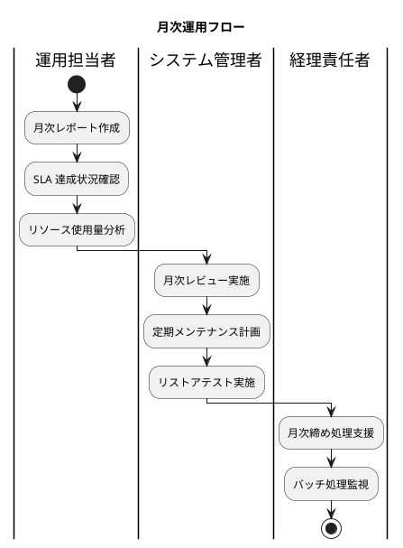

#### 月次運用チェックリスト

| 週 | 作業項目 | 確認内容 | 担当 |
|---|---------|---------|------|
| 第1週 | 月次レポート作成 | 前月の運用状況まとめ | 運用担当者 |
| 第1週 | SLA レビュー | 稼働率・応答時間確認 | システム管理者 |
| 第2週 | リストアテスト | バックアップ復旧検証 | システム管理者 |
| 第3週 | セキュリティ監査 | ログ監査・権限確認 | システム管理者 |
| 第4週 | 定期メンテナンス | パッチ適用・最適化 | システム管理者 |
| 月末 | 月次締め支援 | 経理処理の監視・支援 | 運用担当者 |

### 1.4 年次運用

| 時期 | 作業項目 | 内容 | 担当 |
|-----|---------|-----|------|
| 4月 | 年次決算支援 | 年次締め処理の監視・支援 | 運用担当者 |
| 6月 | DR 訓練 | 災害復旧訓練の実施 | システム管理者 |
| 9月 | セキュリティ診断 | 外部セキュリティ診断 | システム管理者 |
| 12月 | 年次レビュー | 運用体制・手順の見直し | システム管理者 |

---

## 2. 監視設計

### 2.1 監視構成

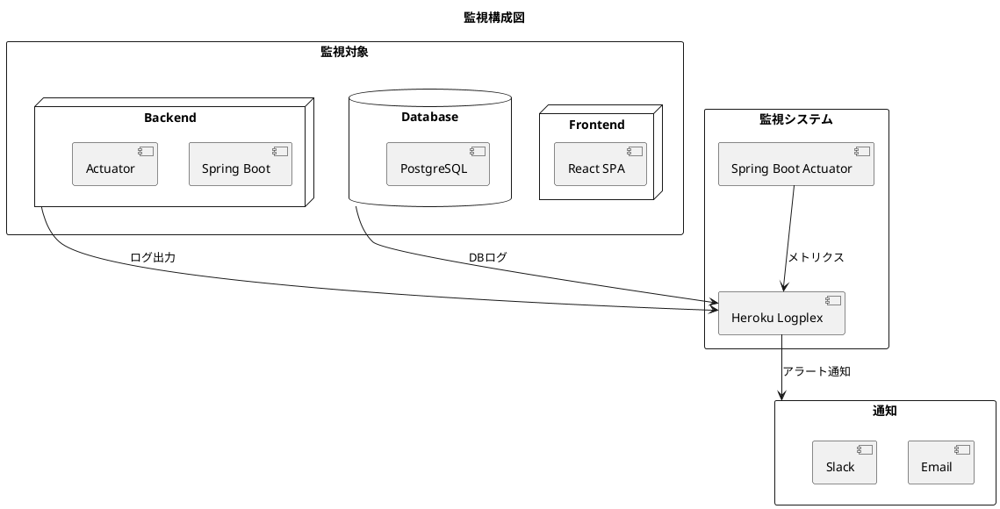

### 2.2 監視項目

#### インフラストラクチャ監視

| 監視項目 | 閾値（Warning） | 閾値（Critical） | 確認間隔 |
|---------|---------------|-----------------|---------|
| CPU 使用率 | > 70% | > 85% | 1分 |
| メモリ使用率 | > 75% | > 90% | 1分 |
| ディスク使用率 | > 70% | > 85% | 5分 |
| Dyno 再起動回数 | > 3回/時間 | > 5回/時間 | 1時間 |

#### アプリケーション監視

| 監視項目 | 閾値（Warning） | 閾値（Critical） | 確認間隔 |
|---------|---------------|-----------------|---------|
| API 応答時間 P95 | > 2秒 | > 5秒 | 1分 |
| API 応答時間 P99 | > 5秒 | > 10秒 | 1分 |
| エラーレート（4xx） | > 5% | > 10% | 1分 |
| エラーレート（5xx） | > 1% | > 5% | 1分 |
| ヘルスチェック | - | 失敗 | 30秒 |

#### データベース監視

| 監視項目 | 閾値（Warning） | 閾値（Critical） | 確認間隔 |
|---------|---------------|-----------------|---------|
| コネクション使用率 | > 70% | > 90% | 1分 |
| クエリ実行時間 | > 1秒 | > 5秒 | 1分 |
| デッドロック発生 | > 0 | > 3回/時間 | 5分 |
| トランザクション失敗 | > 1% | > 5% | 5分 |

#### ビジネス監視

| 監視項目 | 閾値（Warning） | 閾値（Critical） | 確認間隔 |
|---------|---------------|-----------------|---------|
| ログイン失敗（連続） | > 3回 | > 5回 | リアルタイム |
| 仕訳入力エラー | > 10回/時間 | > 30回/時間 | 1時間 |
| 貸借不一致エラー | > 0 | > 0 | リアルタイム |

### 2.3 ヘルスチェック

#### エンドポイント

| エンドポイント | 用途 | 確認内容 |
|---------------|-----|---------|
| `/actuator/health` | 総合ヘルス | アプリケーション全体 |
| `/actuator/health/liveness` | 生存確認 | プロセス生存確認 |
| `/actuator/health/readiness` | 準備確認 | リクエスト受付可能確認 |
| `/actuator/info` | アプリ情報 | バージョン・ビルド情報 |

#### ヘルスチェック応答例

```json
{
  "status": "UP",
  "components": {
    "db": {
      "status": "UP",
      "details": {
        "database": "PostgreSQL",
        "validationQuery": "SELECT 1"
      }
    },
    "diskSpace": {
      "status": "UP",
      "details": {
        "total": 10737418240,
        "free": 5368709120,
        "threshold": 10485760
      }
    }
  }
}
```

### 2.4 アラート設計

#### アラートレベル

| レベル | 説明 | 対応時間 | 通知先 |
|-------|-----|---------|-------|
| Critical | サービス停止・データ損失リスク | 即時 | 全員（電話・Slack・メール） |
| Warning | サービス劣化・近い将来の問題 | 30分以内 | 運用担当者（Slack・メール） |
| Info | 参考情報・傾向把握 | 翌営業日 | 運用担当者（メール） |

#### エスカレーションフロー

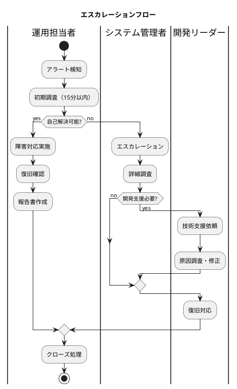

---

## 3. バックアップ設計

### 3.1 バックアップ方針

| 項目 | 設定値 | 備考 |
|------|-------|------|
| RPO（目標復旧時点） | 1時間 | データ損失許容範囲 |
| RTO（目標復旧時間） | 4時間 | システム復旧時間 |
| 保持期間 | 90日 | 四半期分保持 |

### 3.2 バックアップスケジュール

| 種別 | 頻度 | 実行時間 | 保持期間 | 対象 |
|-----|------|---------|---------|------|
| 日次差分 | 毎日 | 02:00 | 7日間 | データベース |
| 週次フル | 毎週日曜 | 03:00 | 4週間 | データベース全体 |
| 月次アーカイブ | 毎月1日 | 04:00 | 12ヶ月 | 全システム |

### 3.3 バックアップ構成（デモ環境）

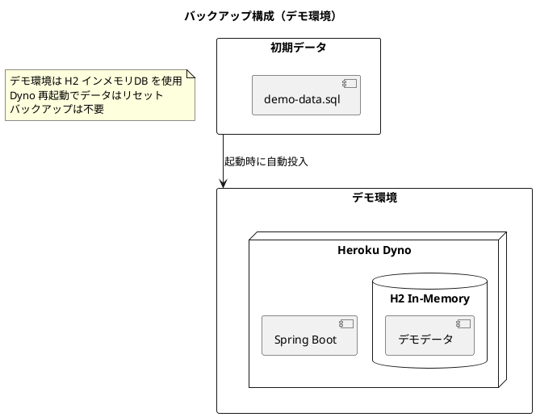

### 3.4 バックアップ構成（本番想定）

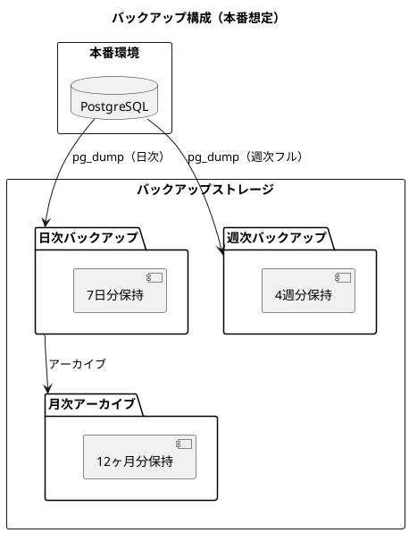

### 3.5 リストア手順

#### 手順概要

1. **状況確認**: 障害状況と復旧ポイントの決定
2. **環境準備**: リストア先環境の準備
3. **データ復元**: バックアップからのデータ復元
4. **整合性確認**: データ整合性の検証
5. **サービス再開**: アプリケーション起動と動作確認

#### リストアテスト

| 項目 | 頻度 | 内容 | 成功基準 |
|------|-----|------|---------|
| 部分リストア | 月次 | 特定テーブルの復元 | RTO 1時間以内 |
| フルリストア | 四半期 | DB 全体の復元 | RTO 4時間以内 |
| DR リストア | 年次 | 別環境への完全復元 | RTO 8時間以内 |

---

## 4. 障害対応設計

### 4.1 障害レベル定義

| レベル | 定義 | 影響範囲 | 対応時間 |
|-------|-----|---------|---------|
| 重大（P1） | サービス全面停止 | 全ユーザー | 即時対応 |
| 高（P2） | 主要機能停止 | 多数ユーザー | 30分以内 |
| 中（P3） | 一部機能停止 | 一部ユーザー | 4時間以内 |
| 低（P4） | 軽微な不具合 | 限定的 | 翌営業日 |

### 4.2 障害対応フロー

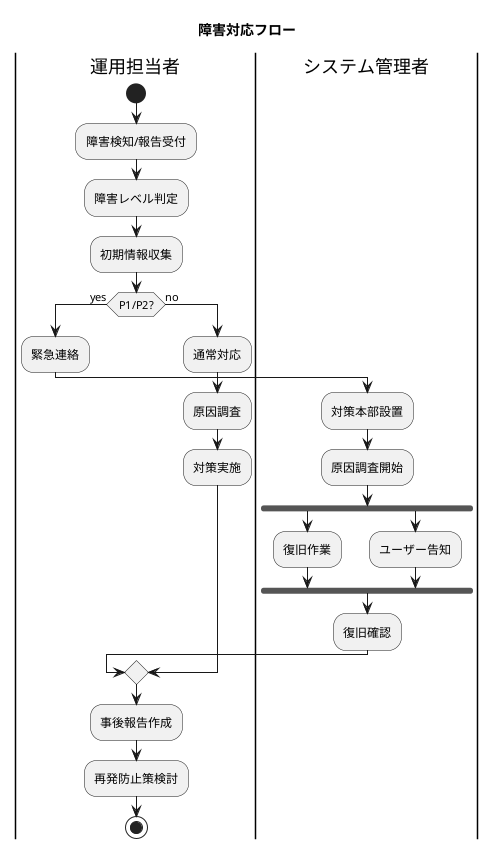

### 4.3 障害対応チェックリスト

#### 初動対応（15分以内）

- [ ] 障害発生時刻の記録
- [ ] 影響範囲の特定
- [ ] 障害レベルの判定
- [ ] 関係者への連絡
- [ ] ログ・エラーメッセージの収集

#### 復旧対応

- [ ] 原因の特定
- [ ] 復旧手順の決定
- [ ] 復旧作業の実施
- [ ] 復旧確認
- [ ] ユーザーへの通知

#### 事後対応

- [ ] 障害報告書の作成
- [ ] 根本原因分析（RCA）
- [ ] 再発防止策の策定
- [ ] 改善策の実施

### 4.4 よくある障害と対応

| 障害 | 原因 | 対応方法 |
|-----|-----|---------|
| アプリケーション無応答 | メモリ不足・デッドロック | Dyno 再起動 |
| DB 接続エラー | コネクション枯渇 | コネクションプール確認・再起動 |
| 認証エラー多発 | JWT 設定・時刻ずれ | 設定確認・時刻同期 |
| レスポンス遅延 | スロークエリ・高負荷 | クエリ最適化・スケールアップ |
| ディスク容量不足 | ログ肥大・データ増加 | ログローテーション・データアーカイブ |

---

## 5. 変更管理設計

### 5.1 変更種別

| 種別 | 定義 | 承認 | リードタイム |
|-----|-----|-----|-------------|
| 標準変更 | 低リスク・定型作業 | 事前承認済み | 即時実行可 |
| 通常変更 | 中リスク・計画的変更 | 変更管理者承認 | 3営業日以上 |
| 緊急変更 | 障害対応・セキュリティ対応 | 事後承認 | 即時実行 |

### 5.2 リリースフロー

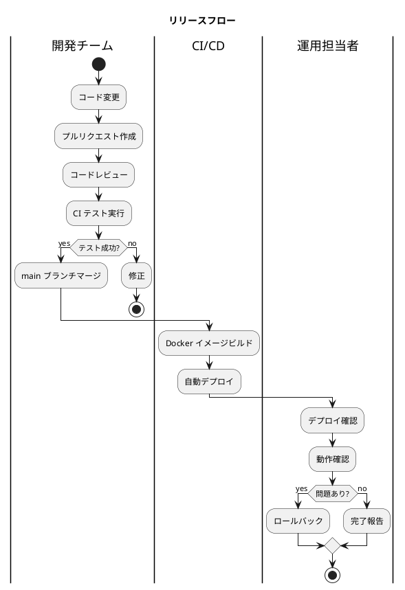

### 5.3 リリースチェックリスト

#### リリース前

- [ ] コードレビュー完了
- [ ] 全テストパス
- [ ] セキュリティスキャン完了
- [ ] リリースノート作成
- [ ] ロールバック手順確認
- [ ] 関係者への通知

#### リリース後

- [ ] ヘルスチェック確認
- [ ] ログエラー確認
- [ ] 主要機能の動作確認
- [ ] パフォーマンス確認
- [ ] 完了報告

### 5.4 ロールバック手順

#### Heroku Container でのロールバック

```bash
# 前バージョンへのロールバック
heroku releases --app <app-name>
heroku rollback v<version> --app <app-name>

# ロールバック確認
heroku logs --tail --app <app-name>
```

#### ロールバック判断基準

| 条件 | 判断 |
|-----|-----|
| 5xx エラー率 > 5% | 即時ロールバック |
| 主要機能が動作しない | 即時ロールバック |
| レスポンス時間 > 10秒（5分継続） | ロールバック検討 |
| 軽微なバグ発見 | 次回リリースで修正 |

---

## 6. セキュリティ運用

### 6.1 アクセス管理

#### 権限管理ルール

| 項目 | ルール |
|-----|-------|
| アカウント発行 | 申請承認制 |
| 権限付与 | 最小権限の原則 |
| 権限見直し | 四半期ごと |
| アカウント削除 | 退職・異動時即時 |

#### 管理者アカウント

| 種別 | 用途 | 保有者 | 監査 |
|-----|-----|-------|-----|
| システム管理者 | システム全体管理 | IT部門 | 月次 |
| DB 管理者 | データベース管理 | IT部門 | 月次 |
| 監査者 | ログ参照のみ | 内部監査部門 | 随時 |

### 6.2 セキュリティ監視

| 監視項目 | 検知条件 | 対応 |
|---------|---------|-----|
| ブルートフォース | ログイン失敗5回連続 | アカウントロック・通知 |
| 不審なアクセス | 通常と異なる IP/時間帯 | アラート・調査 |
| 権限昇格試行 | 認可エラー多発 | アラート・調査 |
| 大量データアクセス | 通常の10倍以上のアクセス | アラート・調査 |

### 6.3 セキュリティパッチ管理

| 種別 | 適用期限 | 承認 |
|-----|---------|-----|
| 緊急（Critical） | 24時間以内 | 事後承認 |
| 高（High） | 7日以内 | 変更管理承認 |
| 中（Medium） | 30日以内 | 定期メンテナンス |
| 低（Low） | 90日以内 | 定期メンテナンス |

---

## 7. ドキュメント管理

### 7.1 運用ドキュメント一覧

| ドキュメント | 内容 | 更新頻度 | 管理者 |
|-------------|-----|---------|-------|
| 運用要件定義書 | 本ドキュメント | 年次 | システム管理者 |
| 運用手順書 | 日常運用手順 | 随時 | 運用担当者 |
| 障害対応手順書 | 障害時の対応手順 | 障害対応後 | システム管理者 |
| 連絡体制表 | 緊急連絡先一覧 | 四半期 | システム管理者 |

### 7.2 ナレッジ管理

| 種別 | 内容 | 登録タイミング |
|-----|-----|---------------|
| 障害事例 | 障害内容と対応 | 障害対応後 |
| FAQ | よくある問い合わせ | 問い合わせ対応後 |
| Tips | 運用ノウハウ | 随時 |
| 手順変更 | 手順の変更履歴 | 変更時 |

---

## 8. SLA 管理

### 8.1 SLA 定義

| SLA 項目 | 目標値 | 測定方法 |
|---------|-------|---------|
| 可用性 | 99.9% | 月次稼働時間/総時間 |
| 応答時間 P95 | < 2秒 | APM ツール |
| 障害復旧時間（P1） | < 2時間 | 障害対応記録 |
| 障害復旧時間（P2） | < 4時間 | 障害対応記録 |

### 8.2 SLA レポート

| 項目 | 頻度 | 報告先 |
|-----|-----|-------|
| 稼働率レポート | 月次 | 経営層 |
| 障害レポート | 発生時 | 関係者 |
| パフォーマンスレポート | 月次 | システム管理者 |
| セキュリティレポート | 四半期 | 経営層 |

---

## 9. 継続的改善

### 9.1 改善プロセス

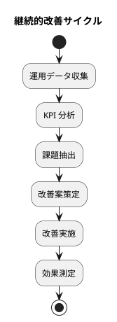

### 9.2 KPI 指標

| KPI | 目標 | 測定頻度 |
|-----|-----|---------|
| システム稼働率 | > 99.9% | 月次 |
| MTTR | < 2時間 | 月次 |
| 障害発生件数（P1/P2） | < 1件/月 | 月次 |
| 変更成功率 | > 95% | 月次 |
| 自動化率 | > 80% | 四半期 |

### 9.3 レビュー体制

| レビュー | 頻度 | 参加者 | 内容 |
|---------|-----|-------|-----|
| 日次スタンドアップ | 毎日 | 運用チーム | 当日の状況共有 |
| 週次レビュー | 毎週 | 運用チーム | 週次課題の確認 |
| 月次レビュー | 毎月 | 運用・開発 | SLA・KPI レビュー |
| 四半期レビュー | 四半期 | 全体 | 改善計画の策定 |

---

## 10. 付録

### 10.1 連絡体制

| 役割 | 連絡手段 | 対応時間 |
|-----|---------|---------|
| 運用担当者 | Slack / メール | 平日 9:00-18:00 |
| システム管理者 | Slack / 電話 | 24時間（緊急時） |
| 開発リーダー | Slack / 電話 | 平日 9:00-21:00 |

### 10.2 運用ツール

| ツール | 用途 | URL |
|-------|-----|-----|
| Heroku Dashboard | アプリ管理 | https://dashboard.heroku.com |
| GitHub | ソースコード管理 | https://github.com |
| Slack | コミュニケーション | - |

### 10.3 参考ドキュメント

- [非機能要件定義書](non_functional.md)
- [インフラストラクチャアーキテクチャ設計](architecture_infrastructure.md)
- [テスト戦略](test_strategy.md)
