# 運用要件定義書

## 概要

本ドキュメントは、財務会計システムの運用要件を定義します。システムの安定稼働、障害対応、変更管理、監視・監査の観点から、運用に必要な要件と手順を明確にします。

### 対象システム

- システム名: 財務会計システム
- 対象ユーザー: 経理担当者、経営者、管理者
- 運用体制: 情報システム部門、運用チーム

### 運用要件の種類

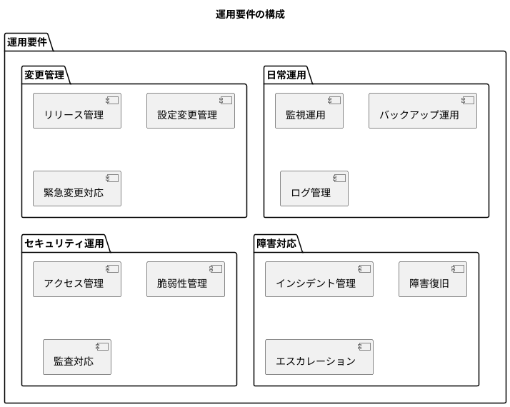

---

## 1. 運用体制

### 1.1 組織構成

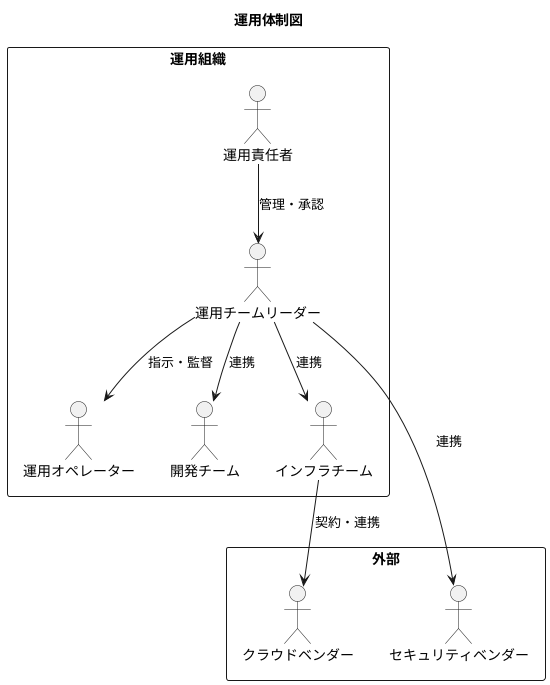

### 1.2 役割と責任

| 役割 | 責任 | 主な業務 |
|-----|-----|---------|
| 運用責任者 | 運用全体の統括、重大障害の最終判断 | 承認、エスカレーション受付 |
| 運用チームリーダー | 日常運用の管理、障害対応の指揮 | 監視確認、インシデント対応 |
| 運用オペレーター | 監視、定型作業の実施 | アラート対応、バックアップ確認 |
| 開発チーム | アプリケーション障害の調査・修正 | バグ修正、パフォーマンス改善 |
| インフラチーム | インフラ障害の調査・修正 | サーバー管理、ネットワーク管理 |

### 1.3 連絡体制

| 時間帯 | 連絡方法 | エスカレーション |
|-------|---------|----------------|
| 平日 9:00-18:00 | Slack、電話 | 運用オペレーター → リーダー → 責任者 |
| 平日 18:00-22:00 | Slack、電話 | 当番担当 → リーダー → 責任者 |
| 夜間・休日 | 電話（緊急連絡網） | 当番担当 → リーダー → 責任者 |

### 1.4 シフト体制

| シフト | 時間帯 | 主な業務 |
|-------|-------|---------|
| 日勤 | 9:00-18:00 | 通常運用、変更作業、障害対応 |
| 準夜勤 | 18:00-22:00 | 監視、アラート対応 |
| 夜間待機 | 22:00-9:00 | オンコール対応（自動アラートベース） |

---

## 2. 日常運用

### 2.1 運用カレンダー

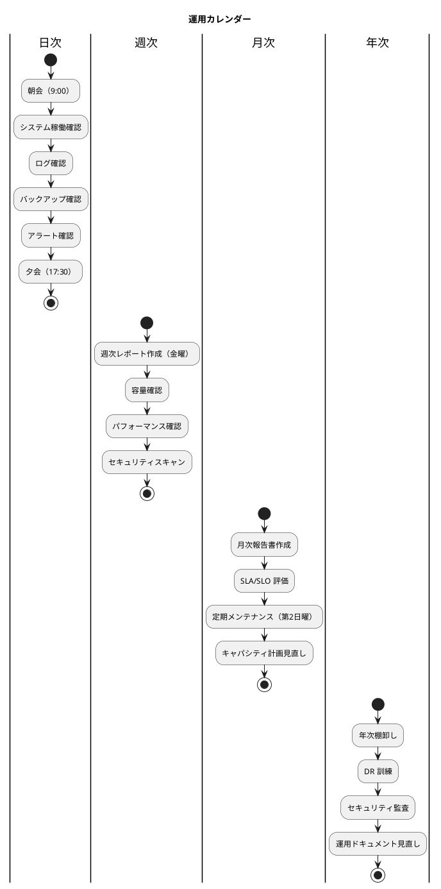

### 2.2 日次運用チェックリスト

| 時刻 | 作業項目 | 確認内容 | 担当 |
|-----|---------|---------|-----|
| 9:00 | システム稼働確認 | ヘルスチェック、ダッシュボード確認 | オペレーター |
| 9:15 | ログ確認 | ERROR/WARN ログの確認 | オペレーター |
| 9:30 | バックアップ確認 | 日次バックアップの成功確認 | オペレーター |
| 10:00 | アラート確認 | 未対応アラートの確認・対応 | オペレーター |
| 17:00 | 日次サマリー | 本日の運用状況まとめ | リーダー |

### 2.3 週次運用作業

| 曜日 | 作業項目 | 詳細 |
|-----|---------|-----|
| 月曜 | 週初確認 | 前週の残課題確認、今週の予定確認 |
| 水曜 | 中間確認 | アラート傾向分析、パフォーマンス確認 |
| 金曜 | 週次レポート | 週次稼働状況レポート作成 |
| 日曜 | 週次バックアップ | フルバックアップ実行・確認 |

### 2.4 月次運用作業

| 項目 | 実施時期 | 詳細 |
|-----|---------|-----|
| 定期メンテナンス | 第2日曜 2:00-6:00 | セキュリティパッチ適用、ログローテーション |
| SLA レポート | 月初 5営業日以内 | 前月の SLA 達成状況報告 |
| 容量計画見直し | 月末 | ストレージ、リソース使用状況の分析 |
| 証明書有効期限確認 | 月末 | SSL 証明書等の有効期限確認 |

---

## 3. 監視設計

### 3.1 監視アーキテクチャ

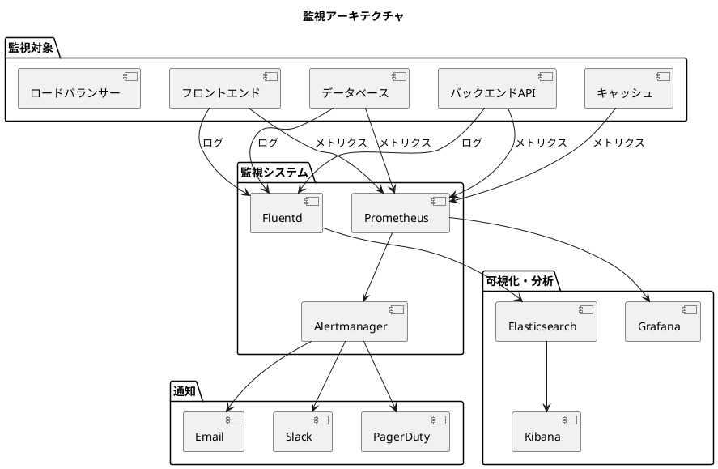

### 3.2 監視項目

#### インフラ監視

| 監視項目 | メトリクス | Warning 閾値 | Critical 閾値 |
|---------|----------|-------------|--------------|
| CPU 使用率 | `cpu_usage_percent` | > 70% (5分間) | > 90% (5分間) |
| メモリ使用率 | `memory_usage_percent` | > 80% (5分間) | > 95% (5分間) |
| ディスク使用率 | `disk_usage_percent` | > 80% | > 90% |
| ネットワーク帯域 | `network_bytes_total` | > 80% | > 95% |
| コンテナ再起動 | `container_restarts` | > 3回/時 | > 5回/時 |

#### アプリケーション監視

| 監視項目 | メトリクス | Warning 閾値 | Critical 閾値 |
|---------|----------|-------------|--------------|
| レスポンスタイム (P95) | `http_request_duration_seconds` | > 2秒 | > 5秒 |
| エラー率 (5xx) | `http_requests_total{status=~"5.."}` | > 1% | > 5% |
| スループット | `http_requests_total` | < 10 req/s | < 1 req/s |
| ヘルスチェック | `health_check_status` | - | 失敗 |
| JVM ヒープ使用率 | `jvm_memory_used_bytes` | > 80% | > 90% |

#### データベース監視

| 監視項目 | メトリクス | Warning 閾値 | Critical 閾値 |
|---------|----------|-------------|--------------|
| コネクション数 | `pg_connections_active` | > 80 | > 100 |
| クエリ実行時間 | `pg_query_duration_seconds` | > 5秒 | > 30秒 |
| レプリケーション遅延 | `pg_replication_lag_seconds` | > 30秒 | > 300秒 |
| デッドロック発生 | `pg_deadlocks_total` | > 0 | > 5/時 |
| ディスク I/O 待ち | `pg_io_wait_seconds` | > 0.5秒 | > 2秒 |

#### ビジネス監視

| 監視項目 | メトリクス | Warning 閾値 | Critical 閾値 |
|---------|----------|-------------|--------------|
| 仕訳登録数 | `journal_entries_created_total` | < 10/時 (営業時間) | 0/時 (営業時間) |
| 認証失敗数 | `auth_failures_total` | > 10/時 | > 50/時 |
| 承認待ち仕訳数 | `pending_approvals_total` | > 100 | > 500 |
| バッチ処理時間 | `batch_job_duration_seconds` | > 予定の150% | > 予定の200% |

### 3.3 アラート設定

```yaml
# alertmanager.yml (例)
global:
  resolve_timeout: 5m

route:
  receiver: 'default'
  group_wait: 30s
  group_interval: 5m
  repeat_interval: 4h
  routes:
    - match:
        severity: critical
      receiver: 'pagerduty-critical'
      repeat_interval: 15m
    - match:
        severity: warning
      receiver: 'slack-warning'
      repeat_interval: 1h

receivers:
  - name: 'default'
    slack_configs:
      - channel: '#ops-alerts'

  - name: 'pagerduty-critical'
    pagerduty_configs:
      - service_key: '<service_key>'

  - name: 'slack-warning'
    slack_configs:
      - channel: '#ops-alerts'
```

### 3.4 ダッシュボード構成

| ダッシュボード | 目的 | 主要メトリクス |
|--------------|-----|--------------|
| Overview | システム全体の健全性 | 可用性、エラー率、スループット |
| Application | アプリケーション性能 | レイテンシ、JVM メトリクス、API 別統計 |
| Infrastructure | インフラリソース | CPU、メモリ、ディスク、ネットワーク |
| Database | データベース性能 | コネクション、クエリ性能、レプリケーション |
| Business | ビジネス KPI | 仕訳数、ユーザーアクティビティ、処理件数 |
| Security | セキュリティイベント | 認証失敗、アクセス異常、脆弱性 |

---

## 4. ログ管理

### 4.1 ログ種別と保存期間

| ログ種別 | 出力元 | 保存期間 | 保存先 |
|---------|-------|---------|-------|
| アプリケーションログ | Spring Boot | 90日 | Elasticsearch |
| アクセスログ | Nginx | 90日 | Elasticsearch |
| 監査ログ | アプリケーション | 7年 | PostgreSQL + アーカイブ |
| セキュリティログ | WAF、IDS | 1年 | Elasticsearch |
| データベースログ | PostgreSQL | 30日 | ローカル + アーカイブ |
| システムログ | OS、コンテナ | 30日 | Elasticsearch |

### 4.2 ログローテーション

| 対象 | ローテーション条件 | 保持世代 |
|-----|------------------|---------|
| アプリケーションログ | 100MB または 日次 | 30世代 |
| アクセスログ | 日次 | 90世代 |
| データベースログ | 日次 | 30世代 |
| システムログ | 10MB または 週次 | 12世代 |

### 4.3 構造化ログフォーマット

```json
{
  "timestamp": "2025-01-15T10:30:00.000Z",
  "level": "INFO",
  "logger": "com.example.accounting.usecase.journal.RegisterJournalUseCase",
  "message": "仕訳を登録しました",
  "context": {
    "traceId": "abc123def456",
    "spanId": "ghi789",
    "userId": "user001",
    "userName": "山田太郎",
    "clientIp": "192.168.1.100"
  },
  "business": {
    "journalNumber": "JE20250115-0001",
    "amount": 100000,
    "action": "CREATE"
  }
}
```

### 4.4 ログ検索・分析

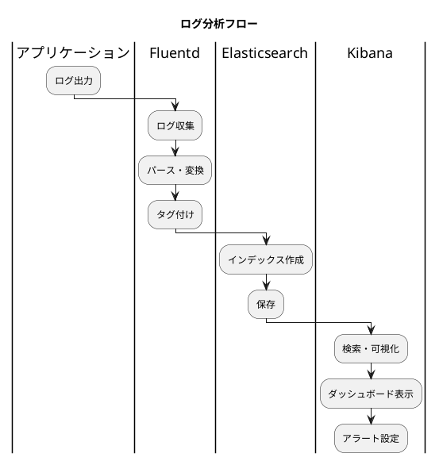

---

## 5. バックアップ・リカバリ

### 5.1 バックアップ戦略

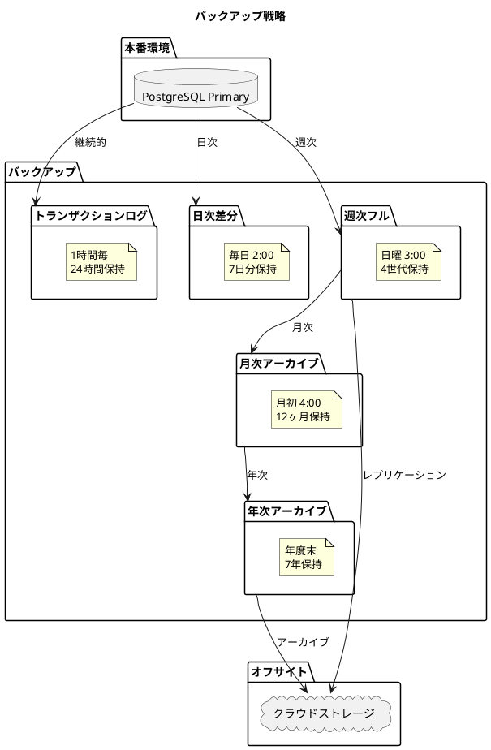

### 5.2 バックアップスケジュール

| 種別 | 頻度 | 実行時刻 | 保持期間 | 保存先 |
|-----|-----|---------|---------|-------|
| トランザクションログ | 1時間毎 | 毎時 0分 | 24時間 | ローカル |
| 差分バックアップ | 日次 | 2:00 | 7日 | ローカル |
| フルバックアップ | 週次 | 日曜 3:00 | 4週間 | ローカル + オフサイト |
| 月次アーカイブ | 月次 | 1日 4:00 | 12ヶ月 | オフサイト |
| 年次アーカイブ | 年次 | 3月末 | 7年 | オフサイト（コールドストレージ） |

### 5.3 リストア手順

#### データベースリストア

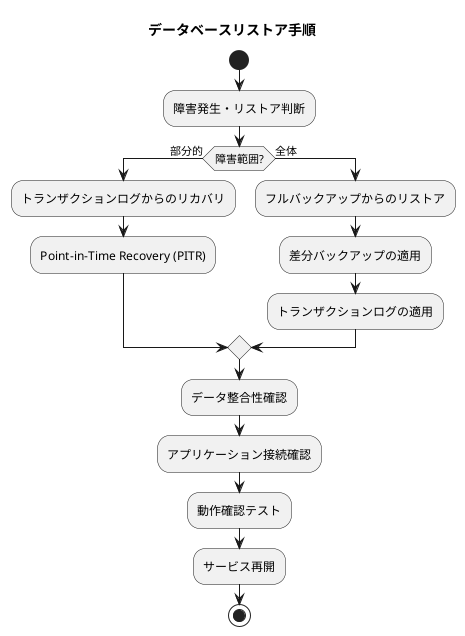

### 5.4 リストアテスト

| テスト種別 | 頻度 | 内容 | 確認項目 |
|----------|-----|-----|---------|
| 日次バックアップ検証 | 毎日 | チェックサム確認 | ファイル整合性 |
| 差分リストアテスト | 月次 | テスト環境へのリストア | データ復元、動作確認 |
| フルリストアテスト | 四半期 | 本番同等環境へのリストア | RTO 達成確認 |
| DR 訓練 | 年次 | DR サイトへの切り替え | 完全な復旧手順確認 |

### 5.5 RPO/RTO 達成

| 指標 | 目標値 | 達成手段 |
|-----|-------|---------|
| RPO（1時間） | 最大1時間のデータ損失 | 1時間毎のトランザクションログバックアップ |
| RTO（4時間） | 4時間以内のサービス復旧 | 自動フェイルオーバー + 手順書整備 |

---

## 6. 障害対応

### 6.1 インシデント分類

| 重大度 | 定義 | 対応時間 | エスカレーション |
|-------|-----|---------|----------------|
| Critical | サービス全停止、データ損失の可能性 | 15分以内に対応開始 | 即座に責任者へ |
| High | 主要機能の停止、多数ユーザーへの影響 | 30分以内に対応開始 | 1時間以内にリーダーへ |
| Medium | 一部機能の障害、少数ユーザーへの影響 | 4時間以内に対応 | 翌営業日にリーダーへ |
| Low | 軽微な問題、回避策あり | 翌営業日対応 | 週次報告 |

### 6.2 障害対応フロー

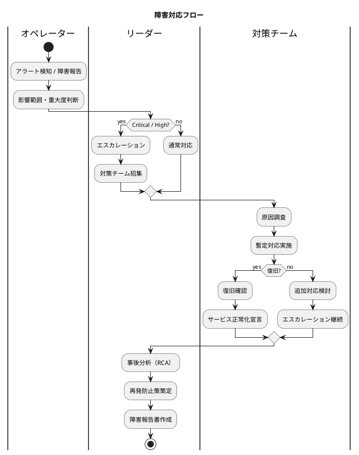

### 6.3 障害対応チェックリスト

#### 初動対応

- [ ] アラート内容の確認
- [ ] 影響範囲の特定
- [ ] 重大度の判断
- [ ] 関係者への連絡
- [ ] 障害対応チケット起票

#### 調査・復旧

- [ ] ログ・メトリクスの確認
- [ ] 直前の変更有無の確認
- [ ] 原因の仮説立案
- [ ] 暫定対応の実施
- [ ] 復旧確認

#### 事後対応

- [ ] 根本原因分析（RCA）
- [ ] 再発防止策の策定
- [ ] 障害報告書の作成
- [ ] ナレッジベースへの登録

### 6.4 既知の障害パターンと対応

| 障害パターン | 症状 | 対応手順 |
|------------|-----|---------|
| DB 接続プール枯渇 | レスポンス遅延、タイムアウト | Pod 再起動、接続数上限見直し |
| メモリリーク | OOM 発生、Pod 再起動 | ヒープダンプ取得、Pod 再起動 |
| ディスク容量不足 | 書き込みエラー | ログローテーション、不要ファイル削除 |
| 認証サーバー障害 | ログイン不可 | 認証サーバー再起動、キャッシュクリア |
| レプリケーション遅延 | 読み取りデータの不整合 | レプリカ再同期、トラフィック制御 |

---

## 7. 変更管理

### 7.1 変更分類

| 変更種別 | 定義 | 承認プロセス | リードタイム |
|---------|-----|------------|------------|
| 標準変更 | 定型的な変更（設定変更等） | 事前承認済み | 即時 |
| 通常変更 | 計画的な変更（リリース等） | CAB 承認 | 3営業日以上 |
| 緊急変更 | 障害対応のための変更 | 事後承認可 | 即時 |

### 7.2 リリース管理

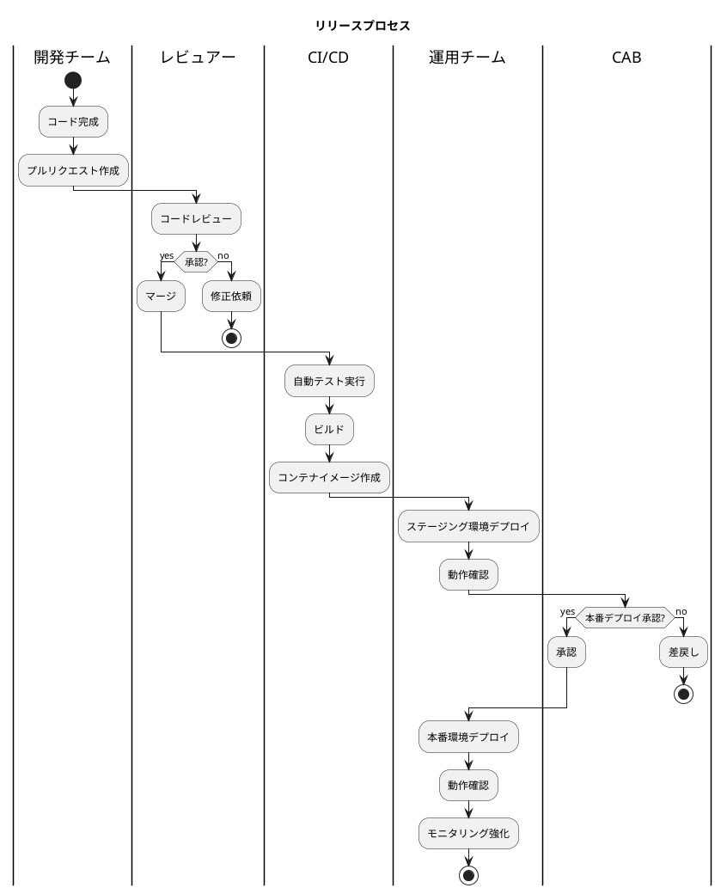

### 7.3 デプロイ戦略

| 戦略 | 用途 | リスク | ロールバック |
|-----|-----|-------|------------|
| ブルー/グリーン | 通常リリース | 低 | 即時（LB 切り替え） |
| ローリングアップデート | マイナー更新 | 中 | 段階的 |
| カナリアリリース | リスクの高い変更 | 低 | 即時（ルーティング変更） |

### 7.4 ロールバック手順

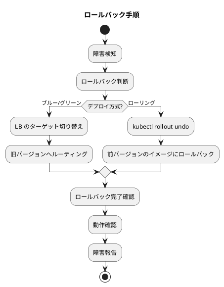

### 7.5 変更凍結期間

| 期間 | 対象 | 理由 |
|-----|-----|-----|
| 月末 5営業日 | 全システム変更 | 月次決算処理への影響防止 |
| 年度末 2週間 | 全システム変更 | 年次決算・監査対応 |
| 決算期間 | 会計データ関連変更 | データ整合性の確保 |

---

## 8. セキュリティ運用

### 8.1 アクセス管理

#### アカウント管理

| 項目 | 運用ルール |
|-----|----------|
| アカウント作成 | 申請・承認フローを経て作成 |
| 権限変更 | 申請・承認フローを経て変更 |
| アカウント削除 | 退職・異動時に即時無効化 |
| 定期棚卸し | 四半期ごとに権限レビュー |
| 特権アカウント | 個人アカウントとは別管理、使用時は記録 |

#### アクセスレビュー

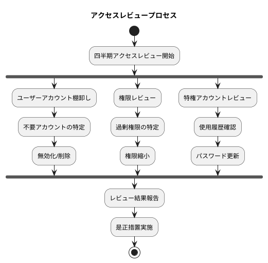

### 8.2 脆弱性管理

| 項目 | 頻度 | 対応 |
|-----|-----|-----|
| 依存ライブラリスキャン | 日次（CI/CD） | 脆弱性検出時は即時評価 |
| コンテナイメージスキャン | デプロイ時 | 高リスク脆弱性は修正後デプロイ |
| SAST（静的解析） | PR 時 | 指摘事項は修正後マージ |
| DAST（動的解析） | 週次 | 発見次第対応 |
| ペネトレーションテスト | 年次 | 指摘事項は計画的に対応 |

### 8.3 セキュリティパッチ適用

| 緊急度 | 適用期限 | 対応 |
|-------|---------|-----|
| Critical | 24時間以内 | 緊急メンテナンスで適用 |
| High | 7日以内 | 計画メンテナンスで適用 |
| Medium | 30日以内 | 定期メンテナンスで適用 |
| Low | 90日以内 | 次回リリースで適用 |

### 8.4 監査対応

| 監査種別 | 頻度 | 対応 |
|---------|-----|-----|
| 内部監査 | 年1回 | 運用ドキュメント、ログ提供 |
| 外部監査（会計監査） | 年1回 | IT 統制の証跡提供 |
| 情報セキュリティ監査 | 年1回 | セキュリティ対策状況報告 |
| J-SOX 対応 | 年1回 | IT 全般統制の文書化・証跡 |

---

## 9. 監査ログ運用

### 9.1 監査ログの設計原則

本システムでは、財務会計システム特有の法的要件（会社法、電子帳簿保存法、J-SOX）に対応するため、完全な監査証跡を記録します。

| 原則 | 説明 |
|-----|-----|
| 完全性 | すべての重要操作を漏れなく記録 |
| 正確性 | 変更前後の値を正確に記録 |
| 不変性 | 一度記録されたログは変更・削除不可 |
| トレーサビリティ | 操作の連鎖を追跡可能に |
| 検索可能性 | 効率的な検索を実現 |

### 9.2 監査対象操作

| エンティティ | 対象操作 | 記録内容 |
|------------|---------|---------|
| 仕訳 | 作成、更新、承認、確定、取消 | 5W1H + 変更前後の値 |
| 勘定科目 | 作成、更新、削除 | 変更内容、理由 |
| ユーザー | ログイン、ログアウト、権限変更 | 認証情報、IP アドレス |
| 決算処理 | 月次締め、年次締め | 処理結果、承認者 |
| マスタデータ | 作成、更新、削除 | 変更内容、承認者 |

### 9.3 監査ログ保存

| 項目 | 仕様 |
|-----|-----|
| 保存形式 | PostgreSQL（JSONB） + 長期アーカイブ（S3） |
| 保存期間 | 7年（法定保存期間） |
| 暗号化 | 保存時暗号化（AES-256） |
| アクセス制御 | 監査権限保有者のみ閲覧可 |
| 改ざん防止 | Append-Only テーブル、削除権限なし |

### 9.4 監査レポート

| レポート種別 | 頻度 | 内容 |
|------------|-----|-----|
| 日次操作サマリー | 日次 | アクション別・ユーザー別集計 |
| ユーザー活動レポート | 週次/随時 | 特定ユーザーの操作履歴 |
| 仕訳変更履歴 | 随時 | 特定仕訳の全変更履歴 |
| 認証監査レポート | 月次 | ログイン失敗、異常アクセス |
| コンプライアンスレポート | 四半期 | 法令対応状況 |

---

## 10. 災害復旧（DR）

### 10.1 DR 構成

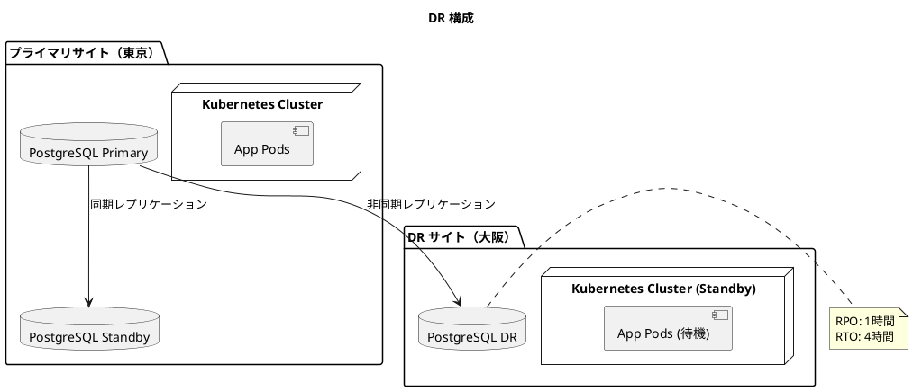

### 10.2 DR シナリオ

| シナリオ | 対応 | RTO |
|---------|-----|-----|
| サーバー障害 | 自動フェイルオーバー | 数分 |
| データセンター障害 | DR サイトへの切り替え | 4時間 |
| 地域災害 | DR サイトでのサービス継続 | 4時間 |
| データ破損 | PITR によるリストア | 2時間 |

### 10.3 DR 訓練

| 訓練種別 | 頻度 | 内容 |
|---------|-----|-----|
| 机上訓練 | 四半期 | 手順書のウォークスルー |
| 部分切り替え訓練 | 半期 | DB フェイルオーバー訓練 |
| 全体切り替え訓練 | 年次 | 完全な DR サイト切り替え |
| 復旧訓練 | 年次 | バックアップからの完全リストア |

---

## 11. SLA/SLO 管理

### 11.1 サービスレベル目標

| 指標 | SLO | 測定方法 | 報告頻度 |
|-----|-----|---------|---------|
| 可用性 | 99.9% | (稼働時間 / 総時間) × 100 | 月次 |
| レスポンスタイム (P95) | 1秒以下 | Prometheus メトリクス | 日次 |
| エラー率 | 0.1%以下 | (5xx / 総リクエスト) × 100 | 日次 |
| 復旧時間 | 4時間以内 | インシデント記録 | 都度 |

### 11.2 エラーバジェット

| 指標 | SLO | 月間エラーバジェット |
|-----|-----|-------------------|
| 可用性 99.9% | 0.1% ダウンタイム許容 | 約43分 |
| エラー率 0.1% | 0.1% エラー許容 | 10,000 リクエストあたり 10 エラー |

### 11.3 SLA レポート

```markdown
# 月次 SLA レポート

## 対象期間
2025年1月1日 - 2025年1月31日

## サマリー
| 指標 | SLO | 実績 | 達成状況 |
|-----|-----|-----|---------|
| 可用性 | 99.9% | 99.95% | ✅ 達成 |
| レスポンスタイム (P95) | 1秒 | 0.8秒 | ✅ 達成 |
| エラー率 | 0.1% | 0.05% | ✅ 達成 |

## インシデント
| 日時 | 内容 | ダウンタイム | 原因 |
|-----|-----|------------|-----|
| 1/15 10:00 | DB 接続障害 | 15分 | コネクションプール枯渇 |

## 改善アクション
- DB コネクションプールサイズの見直し
- 監視閾値の調整
```

---

## 12. 運用ドキュメント

### 12.1 ドキュメント体系

| ドキュメント | 目的 | 更新頻度 |
|------------|-----|---------|
| 運用要件定義書（本書） | 運用要件の定義 | 年次 / 大きな変更時 |
| 運用手順書 | 日常運用の手順 | 随時 |
| 障害対応手順書 | 障害対応の手順 | 随時 |
| DR 手順書 | 災害復旧の手順 | 年次 |
| セキュリティ運用手順書 | セキュリティ運用の手順 | 随時 |
| ランブック | 定型作業の手順 | 随時 |

### 12.2 ランブック構成

| カテゴリ | 内容 |
|---------|-----|
| 監視対応 | アラート別の対応手順 |
| 定期作業 | バックアップ確認、ログローテーション等 |
| トラブルシューティング | 既知の問題と解決方法 |
| メンテナンス | パッチ適用、設定変更等 |
| 緊急対応 | 障害対応、ロールバック等 |

### 12.3 ナレッジ管理

| 項目 | ツール | 運用 |
|-----|-------|-----|
| 障害記録 | Jira / Confluence | インシデントごとに記録 |
| FAQ | Confluence | 頻出問題を随時追加 |
| 手順書 | Confluence / Git | レビュー後に更新 |
| ポストモーテム | Confluence | 重大障害後に作成 |

---

## 付録

### A. 運用指標定義

| 指標 | 定義 | 計算式 |
|-----|-----|-------|
| 可用性 | サービス稼働率 | (総時間 - ダウンタイム) / 総時間 × 100 |
| MTBF | 平均故障間隔 | 総稼働時間 / 故障回数 |
| MTTR | 平均復旧時間 | 総ダウンタイム / 故障回数 |
| レイテンシ P95 | 95パーセンタイル応答時間 | 上位5%を除いた最大応答時間 |
| エラー率 | エラー発生率 | エラー数 / 総リクエスト数 × 100 |

### B. 連絡先一覧

| 役割 | 連絡先 | 対応時間 |
|-----|-------|---------|
| 運用チーム | ops@example.com | 9:00-18:00 |
| 緊急連絡 | +81-XXX-XXXX | 24時間 |
| クラウドサポート | AWS/GCP サポート | 24時間 |
| セキュリティインシデント | security@example.com | 24時間 |

### C. 関連ドキュメント

| ドキュメント | 場所 |
|------------|-----|
| 非機能要件定義書 | docs/design/non_functional.md |
| インフラアーキテクチャ | docs/design/architecture_infrastructure.md |
| テスト戦略 | docs/design/test_strategy.md |
| 要件定義書 | docs/requirements/requirements_definition.md |

### D. 改訂履歴

| バージョン | 日付 | 変更内容 | 担当者 |
|----------|-----|---------|-------|
| 1.0.0 | 2025-12-17 | 初版作成 | - |
