# 技術スタック選定

## 概要

本ドキュメントは、財務会計システムの技術スタック選定について、選定理由、比較検討、採用技術の詳細を記載します。

---

## 選定方針

### 基本原則

| 原則 | 説明 |
|------|------|
| 型安全性 | コンパイル時のエラー検出で堅牢なコードを実現 |
| 保守性 | 長期運用を見据えた保守しやすいコードベース |
| 実績 | エンタープライズシステムでの豊富な実績 |
| エコシステム | 充実したライブラリ・ツール群 |
| テスタビリティ | テスト駆動開発を支援する環境 |

### ソフトウェア開発の三種の神器

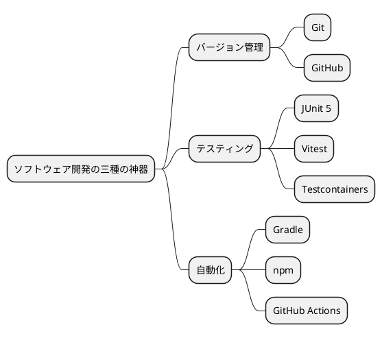

---

## バックエンド技術スタック

### 概要

| カテゴリ | 技術 | バージョン | 用途 |
|---------|------|-----------|------|
| 言語 | Java | 25 | プログラミング言語 |
| フレームワーク | Spring Boot | 3.2.x | Web フレームワーク |
| O/R マッパー | MyBatis | 3.0.x | データベースアクセス |
| データベース | PostgreSQL | 16 | 本番データベース |
| マイグレーション | Flyway | 10.x | スキーマバージョン管理 |
| ビルド | Gradle | 8.x | ビルドツール |
| テスト | JUnit 5 | 5.10.x | テストフレームワーク |
| テスト | Testcontainers | 1.19.x | テスト用 DB コンテナ |
| テスト | AssertJ | 3.24.x | アサーションライブラリ |
| アーキテクチャテスト | ArchUnit | 1.2.x | アーキテクチャ検証 |
| API ドキュメント | springdoc-openapi | 2.3.x | OpenAPI 仕様生成 |
| 静的解析 | Checkstyle | 10.x | コーディング規約チェック |
| 静的解析 | PMD | 7.x | バグパターン検出 |
| 静的解析 | SpotBugs | 6.x | 潜在バグ検出 |
| カバレッジ | JaCoCo | 0.8.x | テストカバレッジ計測 |

### Java 25 選定理由

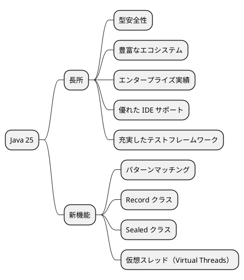

| 観点 | Java の利点 |
|------|-------------|
| 型安全性 | コンパイル時のエラー検出で堅牢なコードを実現 |
| エコシステム | Spring Boot、MyBatis など成熟したフレームワーク群 |
| 保守性 | 静的型付けにより、大規模コードベースでもリファクタリングが安全 |
| テスト | JUnit 5、AssertJ、Testcontainers など充実したテストツール |
| 最新機能 | Record、Sealed クラス、パターンマッチングなど生産性向上 |

### Spring Boot 選定理由

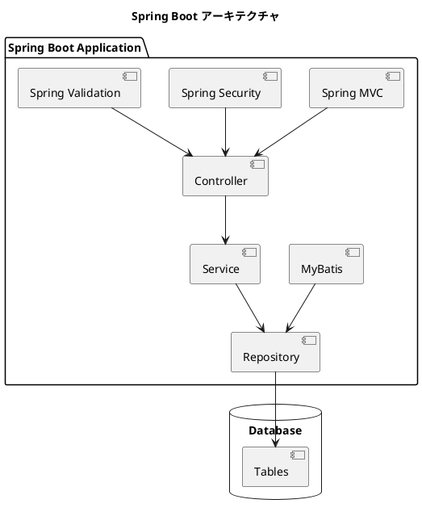

| 特徴 | 説明 |
|------|------|
| 自動設定 | 設定より規約（Convention over Configuration）で開発効率向上 |
| 組み込みサーバー | Tomcat が組み込まれ、単独で実行可能な JAR を生成 |
| スターター | 依存関係をスターターで一括管理 |
| Actuator | ヘルスチェック、メトリクスなど運用機能を標準提供 |
| DevTools | ホットリロードによる開発効率向上 |
| セキュリティ | Spring Security による認証・認可の標準サポート |

### MyBatis vs JPA 比較

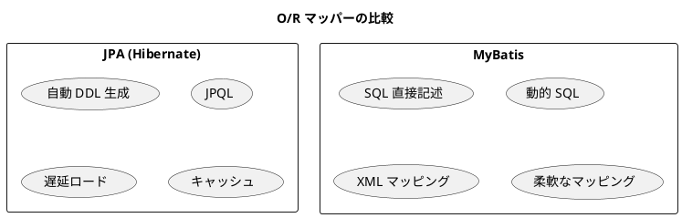

#### 比較表

| 観点 | JPA (Hibernate) | MyBatis |
|------|-----------------|---------|
| SQL 制御 | 自動生成（カスタマイズ困難） | 直接記述（完全制御可能） |
| 学習コスト | 高い（JPQL、N+1 問題など） | 低い（SQL 知識で十分） |
| パフォーマンス | チューニング困難 | SQL レベルで最適化可能 |
| デバッグ | 発行 SQL の特定が困難 | SQL が明確 |
| 既存 DB 対応 | レガシースキーマに不向き | 柔軟に対応可能 |

#### MyBatis 採用理由

| 観点 | MyBatis の利点 |
|------|----------------|
| SQL 制御 | 複雑な SQL を直接記述でき、パフォーマンスチューニングが容易 |
| 学習コスト | SQL の知識がそのまま活用でき、学習曲線が緩やか |
| デバッグ | 実行される SQL が明確で、問題の特定が容易 |
| 柔軟性 | 動的 SQL により、条件に応じた柔軟なクエリが記述可能 |
| 既存 DB 対応 | 既存データベースへの適用が容易 |
| 財務会計要件 | 複雑な集計クエリ、財務諸表生成に適している |

### PostgreSQL 選定理由

| 観点 | PostgreSQL の利点 |
|------|-------------------|
| 信頼性 | ACID 準拠、トランザクション安全性 |
| 機能性 | JSON、配列、ENUM 型など豊富なデータ型 |
| 拡張性 | プラグイン、カスタム関数のサポート |
| コスト | オープンソース、ライセンス費用なし |
| 実績 | エンタープライズシステムでの豊富な実績 |

### Testcontainers 選定理由

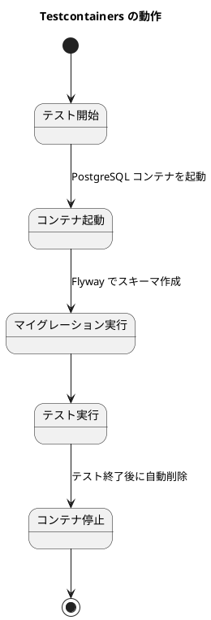

| メリット | 説明 |
|---------|------|
| 完全な分離 | 各テスト実行時に新しいコンテナを起動、他のテストとの干渉を防止 |
| 自動クリーンアップ | テスト終了時にコンテナが自動的に削除 |
| 本番同等環境 | 実際の PostgreSQL コンテナを使用、インメモリ DB では検出できない問題も発見 |
| CI/CD 対応 | Docker があればどこでもテストが実行可能 |

---

## フロントエンド技術スタック

### 概要

| カテゴリ | 技術 | バージョン | 用途 |
|---------|------|-----------|------|
| 言語 | TypeScript | 5.5.x | 型安全な JavaScript |
| UI ライブラリ | React | 18.3.x | コンポーネントベース UI |
| ルーティング | React Router | 6.x | SPA ルーティング |
| ビルドツール | Vite | 5.4.x | 高速ビルド・HMR |
| サーバー状態管理 | TanStack Query | 5.x | キャッシュ・再取得 |
| HTTP クライアント | Axios | 1.7.x | HTTP リクエスト |
| コード生成 | Orval | 7.x | OpenAPI → TypeScript |
| 金額計算 | decimal.js | 10.x | 精度保証された数値計算 |
| 日付処理 | dayjs | 1.11.x | 日付フォーマット・計算 |
| 単体テスト | Vitest | 2.x | テストフレームワーク |
| コンポーネントテスト | React Testing Library | 16.x | DOM テスト |
| API モック | MSW | 2.x | リクエストモック |
| E2E テスト | Cypress | 14.x | 統合テスト |

### React + TypeScript 選定理由

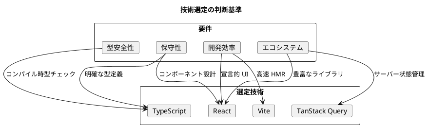

| 要件 | 説明 |
|------|------|
| 型安全性 | 金額計算、API 連携での型不整合防止 |
| 保守性 | 長期運用を見据えたコードベース |
| 開発効率 | コンポーネントの再利用性 |
| エコシステム | 豊富なライブラリ・ツール |

### Vite vs Create React App 比較

| 比較項目 | CRA (webpack) | Vite |
|---------|---------------|------|
| 開発サーバー起動 | 30秒〜1分 | 1秒以下 |
| HMR（ホットリロード） | 数秒 | 即時 |
| ビルド速度 | 遅い | 高速（esbuild） |
| 設定の複雑さ | 隠蔽（eject 必要） | シンプル |
| TypeScript サポート | 追加設定必要 | ネイティブ対応 |

#### Vite 採用理由

- **高速開発サーバー**: ES Module ベースでバンドル不要
- **即座の HMR**: 変更が即座に反映
- **シンプルな設定**: vite.config.ts で完結
- **TypeScript ネイティブ対応**: 追加設定不要

### TanStack Query 選定理由

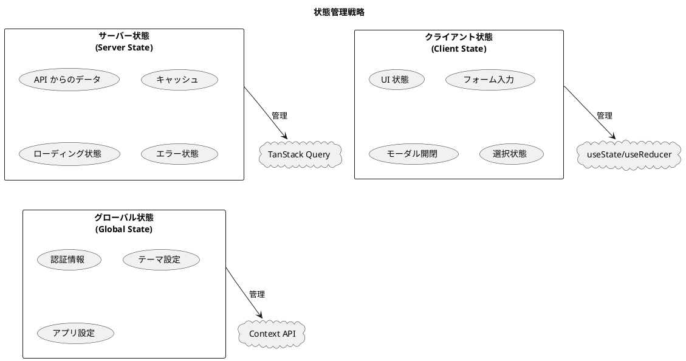

| 状態の種類 | 管理方法 | 例 |
|-----------|---------|-----|
| サーバー状態 | TanStack Query | API からの勘定科目データ、仕訳データ |
| クライアント状態 | useState / useReducer | モーダル開閉、フォーム入力値 |
| グローバル状態 | Context API | 認証情報、ユーザー設定 |

#### TanStack Query のメリット

| 機能 | 説明 |
|------|------|
| 自動キャッシュ | 同一データの重複リクエストを防止 |
| バックグラウンド再取得 | データの鮮度を自動維持 |
| 楽観的更新 | ユーザー体験の向上 |
| エラーリトライ | 一時的なエラーからの自動復旧 |
| 宣言的な API | シンプルで直感的なインターフェース |

### Orval 選定理由

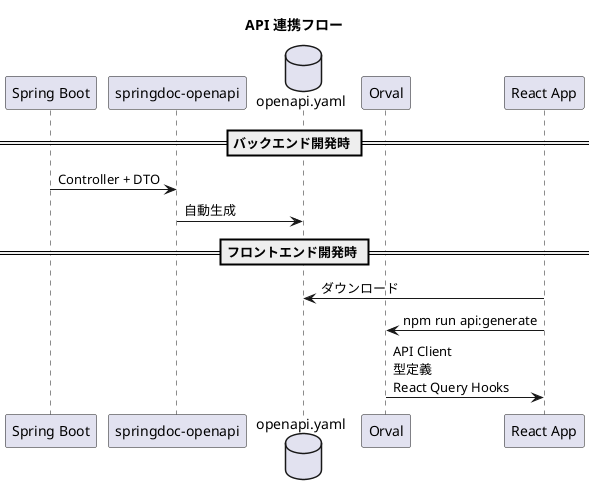

| 生成物 | 説明 |
|--------|------|
| API クライアント | Axios ベースの HTTP クライアント |
| 型定義 | TypeScript インターフェース |
| React Query Hooks | useQuery / useMutation ラッパー |

#### Orval のメリット

| メリット | 説明 |
|---------|------|
| 型安全性 | バックエンド API と完全に同期した型定義 |
| 自動生成 | 手動でのクライアントコード記述不要 |
| 保守性 | API 変更時は再生成するだけ |
| 開発効率 | TanStack Query Hooks も自動生成 |

### decimal.js 選定理由

財務会計システムでは金額計算の精度が重要です。JavaScript の浮動小数点演算では精度問題が発生するため、decimal.js を採用しました。

```javascript
// JavaScript の浮動小数点問題
0.1 + 0.2 // 0.30000000000000004

// decimal.js による精度保証
new Decimal('0.1').plus('0.2') // 0.3
```

| 観点 | decimal.js の利点 |
|------|-------------------|
| 精度 | 任意精度の十進演算 |
| 財務計算 | 金額計算での丸め誤差なし |
| API 互換 | JavaScript Number と互換性のある API |

---

## インフラストラクチャ技術スタック

### 概要

| カテゴリ | 技術 | 用途 |
|---------|------|------|
| コンテナ | Docker | コンテナ化 |
| 開発環境 | Docker Compose | ローカル開発環境 |
| CI/CD | GitHub Actions | 継続的インテグレーション・デプロイ |
| デモ環境 | Heroku Container | デモ環境ホスティング |
| デモ DB | H2 Database | デモ環境データベース（インメモリ） |
| 開発 DB | PostgreSQL 16 | 開発・テスト用データベース |
| DB 管理 | Adminer | データベース管理ツール |

### Docker / Docker Compose 選定理由

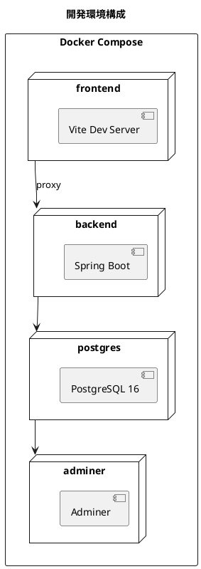

| メリット | 説明 |
|---------|------|
| 環境統一 | 開発者間で同一環境を共有 |
| 再現性 | 環境構築の再現性を保証 |
| 分離性 | ホスト環境を汚染しない |
| CI/CD 対応 | GitHub Actions との親和性 |

### GitHub Actions 選定理由

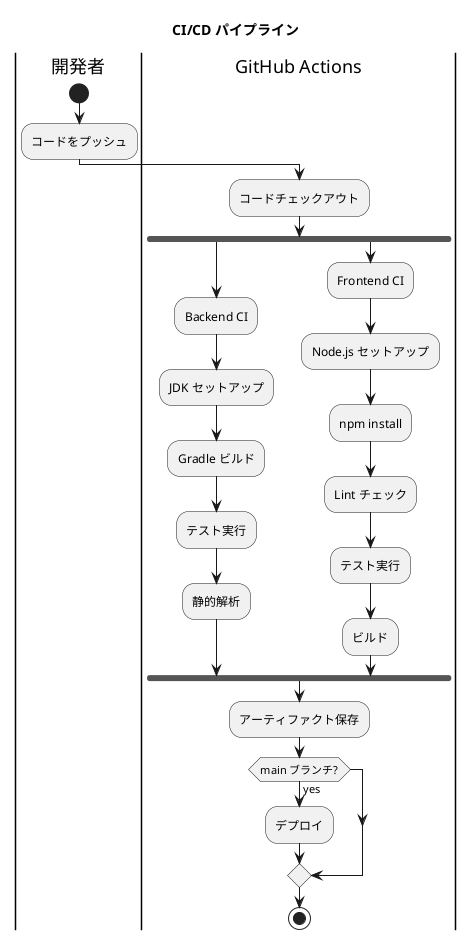

| メリット | 説明 |
|---------|------|
| GitHub 統合 | リポジトリとシームレスに統合 |
| 無料枠 | パブリックリポジトリは無制限 |
| 豊富なアクション | 公式・コミュニティアクションが豊富 |
| マトリックスビルド | 複数環境での並列テスト |

---

## 技術スタック一覧

### バックエンド

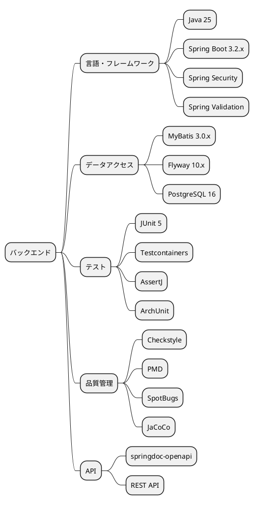

### フロントエンド

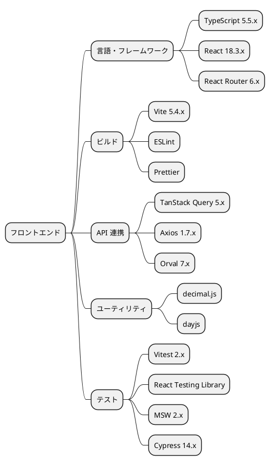

### インフラストラクチャ

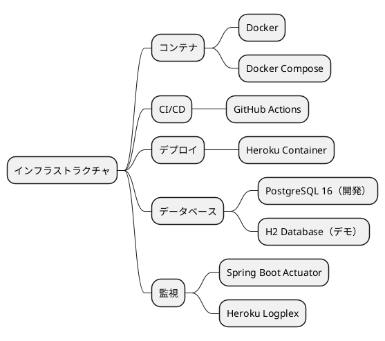

---

## バージョン管理ポリシー

### バージョン固定方針

| 対象 | 方針 |
|------|------|
| メジャーバージョン | 明示的に指定（例：Java 25） |
| マイナーバージョン | 互換性のある範囲で最新（例：3.2.x） |
| パッチバージョン | セキュリティ修正は即時適用 |

### 依存関係更新ルール

1. **セキュリティ脆弱性**: 即時更新
2. **バグ修正**: スプリント内で更新
3. **機能追加**: 次期バージョンで検討
4. **メジャーアップグレード**: 計画的に実施

---

## 選定プロセス

### 評価基準

| 基準 | 重み | 説明 |
|------|------|------|
| 型安全性 | 高 | 財務システムとしてのデータ整合性 |
| 実績・安定性 | 高 | エンタープライズでの採用実績 |
| 保守性 | 高 | 長期運用での保守コスト |
| エコシステム | 中 | ライブラリ・ツールの充実度 |
| 学習コスト | 中 | チームの習熟度、採用難易度 |
| パフォーマンス | 中 | 応答時間、スループット |
| コスト | 低 | ライセンス、運用コスト |

### 技術選定フロー

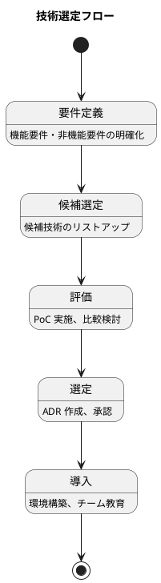

---

## まとめ

本システムの技術スタックは、以下の観点から選定しました。

### 選定ポイント

| 観点 | 選定内容 |
|------|----------|
| 型安全性 | Java + TypeScript による静的型付け |
| 生産性 | Spring Boot + React + Vite による開発効率 |
| テスタビリティ | Testcontainers + Vitest による充実したテスト環境 |
| 保守性 | ヘキサゴナルアーキテクチャ + Container/View パターン |
| API 連携 | OpenAPI + Orval による型安全な連携 |
| 財務計算 | decimal.js による精度保証 |

### 今後の検討事項

| 項目 | 内容 |
|------|------|
| GraphQL | 複雑なクエリ要件への対応 |
| マイクロサービス | スケーラビリティ向上時の検討 |
| Kubernetes | 本番環境でのコンテナオーケストレーション |
| 監視・可観測性 | Prometheus + Grafana の導入 |
