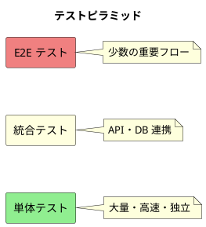
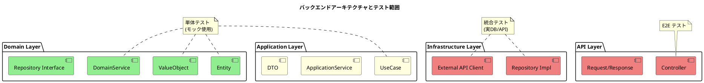
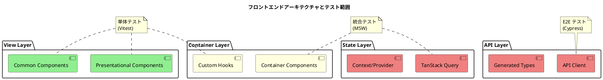
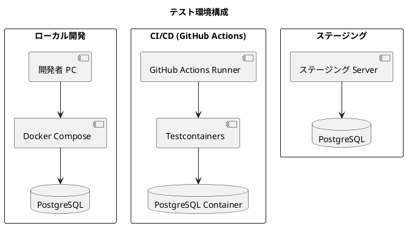
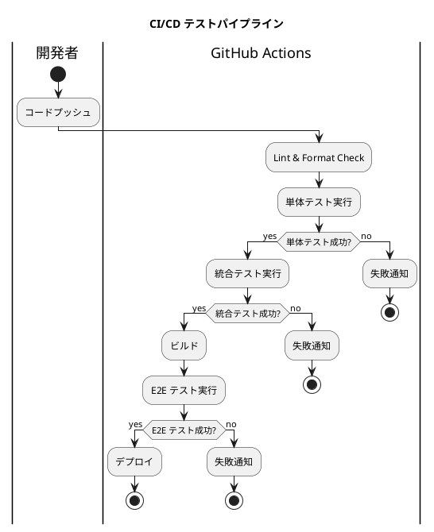
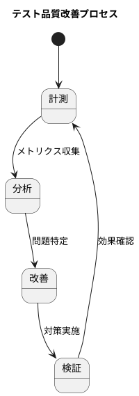

# テスト戦略ドキュメント - 財務会計システム

## 概要

本ドキュメントは、財務会計システムのテスト戦略を定義します。
システムの品質を担保するため、複数のテストレベルを組み合わせた多層的なテストアプローチを採用します。

---

## 1. テスト戦略の基本方針

### 1.1 テストピラミッド

本システムでは、テストピラミッド戦略を採用します。



| テストレベル | 割合 | 実行頻度 | 目的 |
|-------------|------|---------|------|
| 単体テスト | 70% | 常時 | ビジネスロジックの正確性検証 |
| 統合テスト | 20% | 常時 | コンポーネント間連携の検証 |
| E2E テスト | 10% | CI/CD | ユーザーシナリオの検証 |

### 1.2 テスト原則

1. **TDD（テスト駆動開発）** - テストを先に書き、実装を後で行う
2. **独立性** - 各テストは他のテストに依存しない
3. **再現性** - 同じ条件で常に同じ結果を返す
4. **高速性** - 単体テストは高速に実行できる
5. **網羅性** - 重要なビジネスロジックを網羅する

---

## 2. バックエンドテスト戦略

### 2.1 アーキテクチャとテスト対象

バックエンドはヘキサゴナルアーキテクチャを採用しています。



### 2.2 レイヤー別テスト方針

#### Domain Layer（単体テスト）

| 対象 | テスト内容 | ツール |
|------|----------|-------|
| Entity | 状態遷移、ビジネスルール | JUnit 5, AssertJ |
| ValueObject | 不変性、等価性、バリデーション | JUnit 5, AssertJ |
| DomainService | ドメインロジック | JUnit 5, Mockito |

**テスト例：仕訳エンティティ**

```kotlin
class JournalEntryTest {
    @Test
    fun `貸借一致の場合は有効な仕訳となる`() {
        val entry = JournalEntry.create(
            date = LocalDate.of(2024, 4, 1),
            description = "売上計上",
            details = listOf(
                JournalDetail.debit(AccountCode("111"), Money(10000)),
                JournalDetail.credit(AccountCode("411"), Money(10000))
            )
        )

        assertThat(entry.isBalanced()).isTrue()
    }

    @Test
    fun `貸借不一致の場合は例外をスローする`() {
        assertThatThrownBy {
            JournalEntry.create(
                date = LocalDate.of(2024, 4, 1),
                description = "不正な仕訳",
                details = listOf(
                    JournalDetail.debit(AccountCode("111"), Money(10000)),
                    JournalDetail.credit(AccountCode("411"), Money(5000))
                )
            )
        }.isInstanceOf(UnbalancedJournalException::class.java)
    }
}
```

#### Application Layer（単体テスト + 統合テスト）

| 対象 | テスト内容 | ツール |
|------|----------|-------|
| UseCase | ユースケースフロー | JUnit 5, Mockito |
| ApplicationService | トランザクション境界 | Spring Test |

**テスト例：仕訳登録ユースケース**

```kotlin
class CreateJournalEntryUseCaseTest {
    @Mock
    private lateinit var journalRepository: JournalRepository

    @Mock
    private lateinit var accountRepository: AccountRepository

    @InjectMocks
    private lateinit var useCase: CreateJournalEntryUseCase

    @Test
    fun `正常な仕訳を登録できる`() {
        // Given
        val command = CreateJournalEntryCommand(
            date = LocalDate.of(2024, 4, 1),
            description = "売上計上",
            details = listOf(
                DetailCommand("111", 10000, 0),
                DetailCommand("411", 0, 10000)
            )
        )

        whenever(accountRepository.existsByCode(any()))
            .thenReturn(true)
        whenever(journalRepository.save(any()))
            .thenAnswer { it.arguments[0] }

        // When
        val result = useCase.execute(command)

        // Then
        assertThat(result.status).isEqualTo(JournalStatus.DRAFT)
        verify(journalRepository).save(any())
    }
}
```

#### Infrastructure Layer（統合テスト）

| 対象 | テスト内容 | ツール |
|------|----------|-------|
| Repository Impl | DB アクセス | Testcontainers, Spring Test |
| External API | 外部 API 連携 | WireMock |

**テスト例：リポジトリ統合テスト**

```kotlin
@DataJpaTest
@Testcontainers
class JournalRepositoryIntegrationTest {
    @Container
    val postgres = PostgreSQLContainer("postgres:15")

    @Autowired
    private lateinit var journalRepository: JournalRepository

    @Test
    fun `仕訳を保存して取得できる`() {
        // Given
        val entry = createTestJournalEntry()

        // When
        val saved = journalRepository.save(entry)
        val found = journalRepository.findById(saved.id)

        // Then
        assertThat(found).isNotNull
        assertThat(found?.description).isEqualTo(entry.description)
    }
}
```

#### API Layer（統合テスト + E2E テスト）

| 対象 | テスト内容 | ツール |
|------|----------|-------|
| Controller | エンドポイント検証 | MockMvc, WebTestClient |
| 認証・認可 | セキュリティ検証 | Spring Security Test |

**テスト例：コントローラーテスト**

```kotlin
@WebMvcTest(JournalController::class)
class JournalControllerTest {
    @Autowired
    private lateinit var mockMvc: MockMvc

    @MockBean
    private lateinit var createJournalUseCase: CreateJournalEntryUseCase

    @Test
    @WithMockUser(roles = ["ACCOUNTANT"])
    fun `POST /api/journals で仕訳を登録できる`() {
        val request = """
            {
                "date": "2024-04-01",
                "description": "売上計上",
                "details": [
                    {"accountCode": "111", "debitAmount": 10000, "creditAmount": 0},
                    {"accountCode": "411", "debitAmount": 0, "creditAmount": 10000}
                ]
            }
        """.trimIndent()

        whenever(createJournalUseCase.execute(any()))
            .thenReturn(createTestJournalEntry())

        mockMvc.perform(
            post("/api/journals")
                .contentType(MediaType.APPLICATION_JSON)
                .content(request)
        )
            .andExpect(status().isCreated)
            .andExpect(jsonPath("$.status").value("DRAFT"))
    }
}
```

### 2.3 テストデータ管理

| 方式 | 用途 | ツール |
|------|------|-------|
| Factory Pattern | テストオブジェクト生成 | 自作ファクトリ |
| Fixture Files | 静的テストデータ | JSON/YAML ファイル |
| Database Seeding | 統合テスト用データ | Flyway, Testcontainers |

---

## 3. フロントエンドテスト戦略

### 3.1 アーキテクチャとテスト対象

フロントエンドは Container/View パターンを採用しています。



### 3.2 コンポーネント別テスト方針

#### View Components（単体テスト）

| 対象 | テスト内容 | ツール |
|------|----------|-------|
| Presentational | レンダリング、イベント | Vitest, Testing Library |
| Common | 再利用コンポーネント | Vitest, Testing Library |

**テスト例：金額入力コンポーネント**

```typescript
describe('MoneyInput', () => {
  it('初期値が正しく表示される', () => {
    render(<MoneyInput value={1000} onChange={() => {}} />);

    const input = screen.getByRole('textbox');
    expect(input).toHaveValue('1,000');
  });

  it('数値入力時に onChange が呼ばれる', async () => {
    const user = userEvent.setup();
    const handleChange = vi.fn();
    render(<MoneyInput value={0} onChange={handleChange} />);

    const input = screen.getByRole('textbox');
    await user.type(input, '1234');

    expect(handleChange).toHaveBeenCalledWith(1234);
  });
});
```

#### Custom Hooks（単体テスト）

| 対象 | テスト内容 | ツール |
|------|----------|-------|
| useBalanceValidation | 貸借バランス計算 | Vitest, renderHook |
| useTaxCalculation | 消費税計算 | Vitest, renderHook |

**テスト例：貸借バランスフック**

```typescript
describe('useBalanceValidation', () => {
  it('貸借一致の場合は isValid が true', () => {
    const details = [
      { debitAmount: 10000, creditAmount: 0 },
      { debitAmount: 0, creditAmount: 10000 },
    ];

    const { result } = renderHook(() => useBalanceValidation(details));

    expect(result.current.isValid).toBe(true);
    expect(result.current.difference).toBe(0);
  });
});
```

#### Container Components（統合テスト）

| 対象 | テスト内容 | ツール |
|------|----------|-------|
| Container | API 連携、状態管理 | Vitest, MSW |
| Page | ページ全体の動作 | Vitest, MSW |

**テスト例：仕訳入力コンテナ**

```typescript
describe('JournalEntryContainer', () => {
  it('仕訳を保存するとメッセージが表示される', async () => {
    const user = userEvent.setup();
    render(<JournalEntryContainer />);

    // フォーム入力
    await user.type(screen.getByLabelText('仕訳日付'), '2024-04-01');
    await user.type(screen.getByLabelText('摘要'), 'テスト仕訳');

    // 明細入力...

    // 保存
    await user.click(screen.getByRole('button', { name: '保存' }));

    await waitFor(() => {
      expect(screen.getByText(/登録しました/)).toBeInTheDocument();
    });
  });
});
```

### 3.3 MSW によるモック戦略

```typescript
// src/test/mocks/handlers.ts
export const handlers = [
  // 勘定科目一覧
  http.get('/api/accounts', () => {
    return HttpResponse.json(mockAccounts);
  }),

  // 仕訳登録
  http.post('/api/journal-entries', async ({ request }) => {
    const body = await request.json();
    const newEntry = createMockJournalEntry(body);
    return HttpResponse.json(newEntry, { status: 201 });
  }),

  // エラーケース
  http.get('/api/accounts/:code', ({ params }) => {
    const account = mockAccounts.find(a => a.accountCode === params.code);
    if (!account) {
      return new HttpResponse(null, { status: 404 });
    }
    return HttpResponse.json(account);
  }),
];
```

### 3.4 スナップショットテスト

財務諸表など複雑な UI はスナップショットテストで回帰を検知します。

```typescript
describe('BalanceSheetView', () => {
  it('勘定式でスナップショットと一致する', () => {
    const { container } = render(
      <BalanceSheetView
        data={mockBalanceSheetData}
        layout="account"
        isLoading={false}
      />
    );

    expect(container).toMatchSnapshot();
  });
});
```

---

## 4. E2E テスト戦略

### 4.1 対象シナリオ

E2E テストは実行コストが高いため、以下の優先度で対象を選定します。

| 優先度 | 対象 | 理由 |
|--------|------|------|
| 高 | 認証フロー | セキュリティの基盤 |
| 高 | 仕訳入力・承認 | 業務の核心機能 |
| 高 | 決算処理 | 取り消し困難な操作 |
| 中 | 財務諸表表示 | 経営判断に影響 |
| 中 | マスタ管理 | データ整合性に影響 |
| 低 | UI の細部 | 単体テストでカバー |

### 4.2 テストシナリオマッピング

| ユースケース | E2E テストファイル | 優先度 |
|-------------|-------------------|-------|
| UC-AUTH-001 ログイン | auth/login.cy.ts | 高 |
| UC-AUTH-002 ログアウト | auth/login.cy.ts | 高 |
| UC-MST-001 勘定科目登録 | master/account.cy.ts | 中 |
| UC-JNL-001 仕訳入力 | journal/entry.cy.ts | 高 |
| UC-JNL-008 仕訳承認 | journal/approval.cy.ts | 高 |
| UC-FS-001 貸借対照表 | statement/balanceSheet.cy.ts | 中 |
| UC-FS-002 損益計算書 | statement/profitLoss.cy.ts | 中 |

### 4.3 Cypress 設定

```typescript
// cypress.config.ts
export default defineConfig({
  e2e: {
    baseUrl: 'http://localhost:5173',
    viewportWidth: 1280,
    viewportHeight: 720,
    defaultCommandTimeout: 10000,
    video: true,
    screenshotOnRunFailure: true,
    retries: {
      runMode: 2,
      openMode: 0,
    },
  },
});
```

### 4.4 カスタムコマンド

```typescript
// cypress/support/commands.ts
Cypress.Commands.add('login', (email?: string, password?: string) => {
  const userEmail = email ?? Cypress.env('testUser');
  const userPassword = password ?? Cypress.env('testPassword');

  cy.session([userEmail, userPassword], () => {
    cy.visit('/login');
    cy.get('[data-testid="email-input"]').type(userEmail);
    cy.get('[data-testid="password-input"]').type(userPassword);
    cy.get('[data-testid="login-button"]').click();
    cy.url().should('not.include', '/login');
  });
});

Cypress.Commands.add('verifyDebitCreditBalance', () => {
  cy.get('[data-testid="debit-total"]').invoke('text').then((debitText) => {
    cy.get('[data-testid="credit-total"]').invoke('text').then((creditText) => {
      const debit = parseInt(debitText.replace(/[,円]/g, ''), 10);
      const credit = parseInt(creditText.replace(/[,円]/g, ''), 10);
      expect(debit).to.equal(credit);
    });
  });
});
```

---

## 5. テストカバレッジ目標

### 5.1 カバレッジ基準

| レイヤー | ライン | 分岐 | 関数 |
|---------|--------|------|------|
| Domain Layer | 90% | 85% | 90% |
| Application Layer | 85% | 80% | 85% |
| Infrastructure Layer | 70% | 65% | 70% |
| API Layer | 80% | 75% | 80% |
| Frontend Components | 80% | 70% | 80% |

### 5.2 除外対象

以下はカバレッジ計測から除外します。

- 自動生成コード（OpenAPI generated types）
- テストコード自体
- 設定ファイル
- 型定義ファイル（.d.ts）

---

## 6. テスト環境

### 6.1 環境構成



### 6.2 テストデータベース

| 環境 | データベース | 用途 |
|------|------------|------|
| ローカル | Docker PostgreSQL | 開発時の統合テスト |
| CI | Testcontainers | CI パイプライン |
| ステージング | 専用 PostgreSQL | E2E テスト |

---

## 7. CI/CD パイプライン

### 7.1 パイプライン構成



### 7.2 GitHub Actions ワークフロー

```yaml
name: Test Pipeline

on:
  push:
    branches: [main, develop]
  pull_request:
    branches: [main]

jobs:
  unit-test:
    runs-on: ubuntu-latest
    steps:
      - uses: actions/checkout@v4
      - name: Setup
        uses: actions/setup-java@v4
        with:
          java-version: '21'
      - name: Run Unit Tests
        run: ./gradlew test
      - name: Upload Coverage
        uses: codecov/codecov-action@v4

  integration-test:
    needs: unit-test
    runs-on: ubuntu-latest
    services:
      postgres:
        image: postgres:15
        env:
          POSTGRES_USER: test
          POSTGRES_PASSWORD: test
          POSTGRES_DB: accounting_test
        ports:
          - 5432:5432
    steps:
      - uses: actions/checkout@v4
      - name: Run Integration Tests
        run: ./gradlew integrationTest

  e2e-test:
    needs: integration-test
    runs-on: ubuntu-latest
    steps:
      - uses: actions/checkout@v4
      - name: Start Application
        run: docker-compose up -d
      - name: Run E2E Tests
        uses: cypress-io/github-action@v6
        with:
          wait-on: 'http://localhost:5173'
      - name: Upload Artifacts
        if: failure()
        uses: actions/upload-artifact@v4
        with:
          name: cypress-screenshots
          path: cypress/screenshots
```

---

## 8. テスト実行コマンド

### 8.1 バックエンド

```bash
# 全テスト実行
./gradlew test

# 単体テストのみ
./gradlew test --tests '*Test'

# 統合テストのみ
./gradlew integrationTest

# カバレッジレポート生成
./gradlew jacocoTestReport
```

### 8.2 フロントエンド

```bash
# 全テスト実行
npm test

# ウォッチモード
npm run test:watch

# カバレッジレポート生成
npm run test:coverage

# E2E テスト（インタラクティブ）
npm run cypress:open

# E2E テスト（ヘッドレス）
npm run cypress:run
```

---

## 9. テスト品質指標

### 9.1 モニタリング指標

| 指標 | 目標 | 計測方法 |
|------|------|---------|
| テスト成功率 | 100% | CI/CD |
| カバレッジ | 80%+ | Jacoco, V8 |
| テスト実行時間 | < 10分 | CI/CD |
| Flaky テスト率 | < 1% | CI/CD 履歴 |

### 9.2 改善プロセス



---

## 10. トレーサビリティマトリクス

### 10.1 ユースケースとテストの対応

| ユースケース ID | ユースケース名 | 単体テスト | 統合テスト | E2E テスト |
|----------------|---------------|-----------|-----------|-----------|
| UC-AUTH-001 | システムにログインする | ✓ | ✓ | ✓ |
| UC-AUTH-002 | システムからログアウトする | ✓ | ✓ | ✓ |
| UC-AUTH-003 | ユーザーを登録する | ✓ | ✓ | ✓ |
| UC-MST-001 | 勘定科目を登録する | ✓ | ✓ | ✓ |
| UC-MST-002 | 勘定科目を編集する | ✓ | ✓ | ✓ |
| UC-MST-003 | 勘定科目を削除する | ✓ | ✓ | ✓ |
| UC-MST-004 | 勘定科目一覧を表示する | ✓ | ✓ | - |
| UC-JNL-001 | 仕訳を入力する | ✓ | ✓ | ✓ |
| UC-JNL-002 | 仕訳を編集する | ✓ | ✓ | ✓ |
| UC-JNL-003 | 仕訳を削除する | ✓ | ✓ | ✓ |
| UC-JNL-004 | 仕訳一覧を表示する | ✓ | ✓ | ✓ |
| UC-JNL-005 | 仕訳を検索する | ✓ | ✓ | ✓ |
| UC-JNL-006 | 自動仕訳を生成する | ✓ | ✓ | - |
| UC-JNL-007 | 仕訳の承認を申請する | ✓ | ✓ | ✓ |
| UC-JNL-008 | 仕訳を承認する | ✓ | ✓ | ✓ |
| UC-JNL-009 | 仕訳を差し戻す | ✓ | ✓ | ✓ |
| UC-JNL-010 | 仕訳を確定する | ✓ | ✓ | ✓ |
| UC-LDG-001 | 総勘定元帳を照会する | ✓ | ✓ | - |
| UC-LDG-002 | 補助元帳を照会する | ✓ | ✓ | - |
| UC-LDG-003 | 日次残高を照会する | ✓ | ✓ | - |
| UC-LDG-004 | 月次残高を照会する | ✓ | ✓ | - |
| UC-LDG-005 | 残高試算表を表示する | ✓ | ✓ | - |
| UC-FS-001 | 貸借対照表を表示する | ✓ | ✓ | ✓ |
| UC-FS-002 | 損益計算書を表示する | ✓ | ✓ | ✓ |
| UC-FS-003 | 財務分析を表示する | ✓ | ✓ | - |
| UC-SYS-001 | 監査ログを照会する | ✓ | ✓ | - |
| UC-SYS-002 | データをダウンロードする | ✓ | ✓ | ✓ |

### 10.2 重要ビジネスルールのテストカバレッジ

| ビジネスルール | テスト内容 | テストレベル |
|--------------|----------|-------------|
| 貸借一致検証 | 借方合計 = 貸方合計 | 単体, E2E |
| 仕訳ステータス遷移 | 下書き→承認待ち→承認済み→確定 | 単体 |
| 承認済み仕訳の編集不可 | ステータス検証 | 単体, 統合 |
| 月次締め後の仕訳入力制限 | 日付検証 | 単体, E2E |
| 勘定科目削除制約 | 使用中科目の削除不可 | 単体, 統合 |
| 消費税計算 | 税込/税抜変換、端数処理 | 単体 |
| 財務諸表計算 | 資産 = 負債 + 純資産 | 単体, 統合 |

---

## 11. 参考資料

### 11.1 関連ドキュメント

- [アーキテクチャ設計（バックエンド）](architecture_backend.md)
- [アーキテクチャ設計（フロントエンド）](architecture_frontend.md)
- [システムユースケース](../requirements/system_usecase.md)
- [ユーザーストーリー](../requirements/user_story.md)

### 11.2 使用ツール・ライブラリ

| 用途 | バックエンド | フロントエンド |
|------|------------|--------------|
| テストフレームワーク | JUnit 5 | Vitest |
| モック | Mockito | MSW |
| アサーション | AssertJ | @testing-library |
| E2E | - | Cypress |
| カバレッジ | Jacoco | V8 Coverage |
| コンテナ | Testcontainers | - |
