# UI 設計 - 財務会計システム

## 概要

本ドキュメントは、財務会計システムの UI 設計を定義します。
オブジェクト指向 UI 設計（OOUX）の原則に従い、ユーザーが直感的に操作できるインターフェースを設計します。

---

## オブジェクトの特定

### 主要オブジェクト

| オブジェクト | 説明 | 主なアクション |
|-------------|------|---------------|
| ユーザー | システム利用者 | 登録、編集、削除、一覧表示 |
| 勘定科目 | 取引を分類する科目 | 登録、編集、削除、一覧表示 |
| 仕訳 | 取引の記録 | 入力、編集、削除、検索、承認、確定 |
| 元帳 | 科目別の取引履歴 | 照会 |
| 残高 | 科目の残高情報 | 照会 |
| 財務諸表 | 財務報告書 | 表示、ダウンロード |
| 監査ログ | 操作履歴 | 照会、ダウンロード |

### オブジェクト間の関係

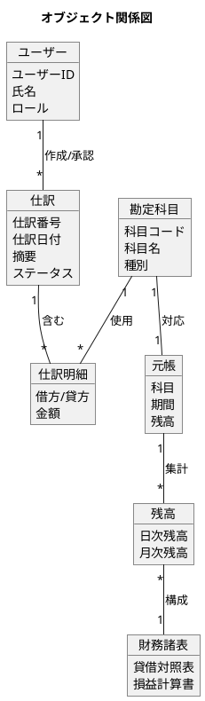

---

## 画面構成

### 全体レイアウト

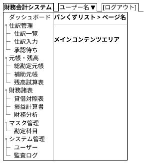

### 画面一覧

| 画面 ID | 画面名 | 関連ユースケース | アクター |
|---------|--------|-----------------|---------|
| SCR-AUTH-001 | ログイン | UC-AUTH-001 | 全ユーザー |
| SCR-DASH-001 | ダッシュボード | - | 全ユーザー |
| SCR-MST-001 | 勘定科目一覧 | UC-MST-004 | 経理担当者以上 |
| SCR-MST-002 | 勘定科目登録/編集 | UC-MST-001, UC-MST-002 | 経理責任者 |
| SCR-JNL-001 | 仕訳一覧 | UC-JNL-004, UC-JNL-005 | 経理担当者以上 |
| SCR-JNL-002 | 仕訳入力/編集 | UC-JNL-001, UC-JNL-002 | 経理担当者以上 |
| SCR-JNL-003 | 仕訳詳細 | UC-JNL-004 | 経理担当者以上 |
| SCR-JNL-004 | 承認待ち一覧 | UC-JNL-008, UC-JNL-009 | 経理責任者 |
| SCR-LDG-001 | 総勘定元帳 | UC-LDG-001 | 経理担当者以上 |
| SCR-LDG-002 | 補助元帳 | UC-LDG-002 | 経理担当者以上 |
| SCR-LDG-003 | 残高試算表 | UC-LDG-005 | 経理責任者以上 |
| SCR-FS-001 | 貸借対照表 | UC-FS-001 | 経理責任者以上 |
| SCR-FS-002 | 損益計算書 | UC-FS-002 | 経理責任者以上 |
| SCR-FS-003 | 財務分析 | UC-FS-003 | 経営者 |
| SCR-USR-001 | ユーザー一覧 | UC-AUTH-003 | システム管理者 |
| SCR-USR-002 | ユーザー登録/編集 | UC-AUTH-003 | システム管理者 |
| SCR-SYS-001 | 監査ログ | UC-SYS-001 | システム管理者 |

---

## 画面設計

### SCR-AUTH-001: ログイン画面

**目的**: ユーザーがシステムにログインする

**レイアウト**:

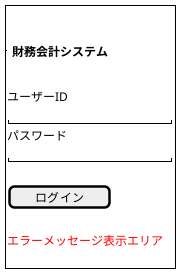

**項目定義**:

| 項目 | 種別 | 必須 | バリデーション |
|------|------|------|---------------|
| ユーザーID | テキスト | ○ | 空白不可 |
| パスワード | パスワード | ○ | 空白不可 |

**アクション**:

| アクション | 条件 | 処理 |
|-----------|------|------|
| ログイン | 入力完了 | 認証処理→ダッシュボードへ遷移 |

**エラーメッセージ**:

| エラー | メッセージ |
|-------|----------|
| 認証失敗 | ユーザーIDまたはパスワードが正しくありません |
| アカウントロック | アカウントがロックされています。管理者にお問い合わせください |

---

### SCR-DASH-001: ダッシュボード

**目的**: システムの概要と重要な情報を表示する

**レイアウト**:

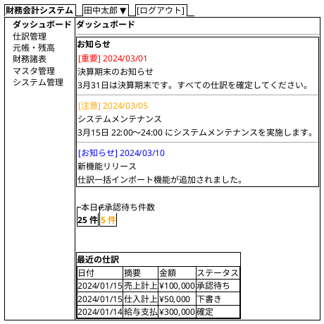

**コンポーネント**:

| コンポーネント | 表示内容 | 更新頻度 |
|--------------|---------|---------|
| お知らせ | システム通知・重要なお知らせ | 画面表示時 |
| 本日の仕訳件数 | 当日入力された仕訳の件数 | 画面表示時 |
| 承認待ち件数 | 承認待ちステータスの仕訳件数 | 画面表示時 |
| 最近の仕訳 | 直近の仕訳（日付、摘要、金額、ステータス） | 画面表示時 |

**お知らせの種別**:

| 種別 | 表示色 | 用途 |
|------|--------|------|
| important（重要） | 赤 | 決算期末、緊急のお知らせ |
| warning（注意） | オレンジ | メンテナンス予告、期限通知 |
| info（お知らせ） | 青 | 新機能、一般的なお知らせ |

---

### SCR-MST-001: 勘定科目一覧

**目的**: 登録済みの勘定科目を一覧表示する

**レイアウト**:

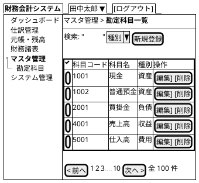

**項目定義**:

| 項目 | 説明 |
|------|------|
| 検索 | 科目コード・科目名で部分一致検索 |
| 種別 | 資産/負債/純資産/収益/費用でフィルタ |
| チェックボックス | 一括操作用の選択 |

**アクション**:

| アクション | 処理 |
|-----------|------|
| 新規登録 | 勘定科目登録画面へ遷移 |
| 編集 | 勘定科目編集画面へ遷移 |
| 削除 | 削除確認ダイアログ表示 |
| 行クリック | 勘定科目詳細表示 |

---

### SCR-MST-002: 勘定科目登録/編集

**目的**: 勘定科目を新規登録または編集する

**レイアウト**:

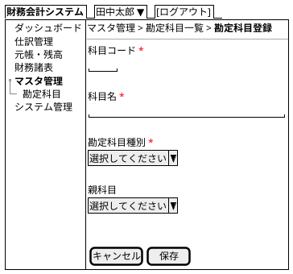

**項目定義**:

| 項目 | 種別 | 必須 | バリデーション |
|------|------|------|---------------|
| 科目コード | テキスト（4桁） | ○ | 数字のみ、重複不可（新規時） |
| 科目名 | テキスト | ○ | 最大50文字 |
| 勘定科目種別 | セレクト | ○ | 資産/負債/純資産/収益/費用 |
| 親科目 | セレクト | - | 既存科目から選択 |

**アクション**:

| アクション | 処理 |
|-----------|------|
| キャンセル | 一覧画面へ戻る |
| 保存 | バリデーション→保存→一覧画面へ遷移 |

---

### SCR-JNL-001: 仕訳一覧

**目的**: 登録済みの仕訳を一覧表示し、検索する

**レイアウト**:

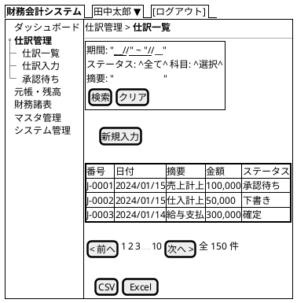

**検索条件**:

| 項目 | 種別 | 説明 |
|------|------|------|
| 期間 | 日付範囲 | 仕訳日付の範囲 |
| ステータス | セレクト | 全て/下書き/承認待ち/承認済み/確定 |
| 科目 | セレクト | 勘定科目で絞り込み |
| 摘要 | テキスト | 部分一致検索 |

**アクション**:

| アクション | 処理 |
|-----------|------|
| 検索 | 条件に合致する仕訳を表示 |
| クリア | 検索条件をリセット |
| 新規入力 | 仕訳入力画面へ遷移 |
| 行クリック | 仕訳詳細画面へ遷移 |
| CSV/Excel | 一覧をダウンロード |

---

### SCR-JNL-002: 仕訳入力/編集

**目的**: 仕訳を新規入力または編集する

**レイアウト**:

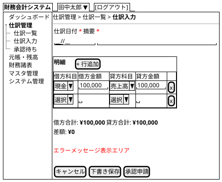

**項目定義**:

| 項目 | 種別 | 必須 | バリデーション |
|------|------|------|---------------|
| 仕訳日付 | 日付 | ○ | 有効な日付 |
| 摘要 | テキスト | ○ | 最大200文字 |
| 借方科目 | セレクト | ○ | 既存科目から選択 |
| 借方金額 | 数値 | ○ | 正の整数 |
| 貸方科目 | セレクト | ○ | 既存科目から選択 |
| 貸方金額 | 数値 | ○ | 正の整数 |

**バリデーション**:

- 借方合計 = 貸方合計であること（貸借一致）
- 最低1行の明細が必要

**アクション**:

| アクション | 処理 |
|-----------|------|
| 行追加 | 明細行を追加 |
| キャンセル | 一覧画面へ戻る |
| 下書き保存 | ステータス「下書き」で保存 |
| 承認申請 | ステータス「承認待ち」で保存 |

---

### SCR-JNL-003: 仕訳詳細

**目的**: 仕訳の詳細情報を表示する

**レイアウト**:

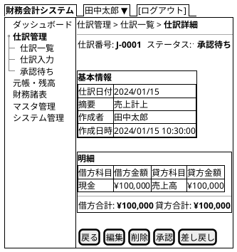

**表示条件によるアクションの制御**:

| ステータス | 編集 | 削除 | 承認申請 | 承認 | 差し戻し | 確定 |
|-----------|------|------|---------|------|---------|------|
| 下書き | ○ | ○ | ○ | - | - | - |
| 承認待ち | - | - | - | ○ | ○ | - |
| 承認済み | - | - | - | - | - | ○ |
| 確定 | - | - | - | - | - | - |

---

### SCR-JNL-004: 承認待ち一覧

**目的**: 承認待ちの仕訳を一覧表示し、承認/差し戻しを行う

**レイアウト**:

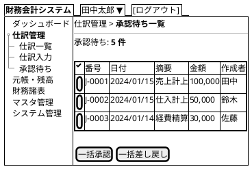

**アクション**:

| アクション | 処理 |
|-----------|------|
| 行クリック | 仕訳詳細画面へ遷移 |
| 一括承認 | 選択した仕訳を一括承認 |
| 一括差し戻し | 差し戻し理由入力ダイアログ→一括差し戻し |

---

### SCR-LDG-001: 総勘定元帳

**目的**: 勘定科目ごとの取引履歴と残高を表示する

**レイアウト**:

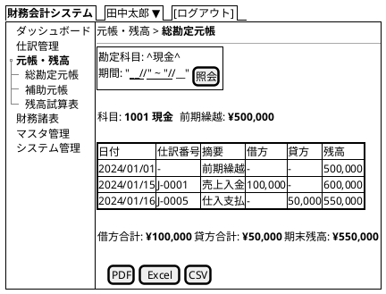

**アクション**:

| アクション | 処理 |
|-----------|------|
| 照会 | 指定条件で元帳を表示 |
| 仕訳番号クリック | 仕訳詳細画面へ遷移 |
| PDF/Excel/CSV | 元帳をダウンロード |

---

### SCR-LDG-002: 補助元帳

**目的**: 取引先別や部門別の明細を表示する

**レイアウト**:

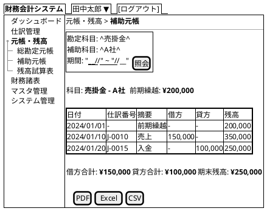

---

### SCR-LDG-003: 残高試算表

**目的**: 全勘定科目の残高と貸借一致を確認する

**レイアウト**:

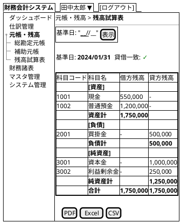

---

### SCR-FS-001: 貸借対照表

**目的**: 企業の財政状態を表示する

**レイアウト**:

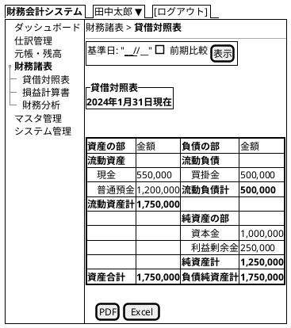

---

### SCR-FS-002: 損益計算書

**目的**: 企業の経営成績を表示する

**レイアウト**:

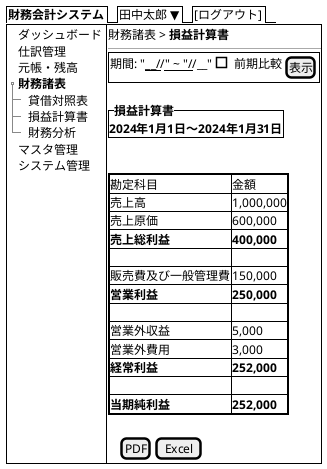

---

### SCR-FS-003: 財務分析

**目的**: 財務指標を表示し、経営判断を支援する

**レイアウト**:

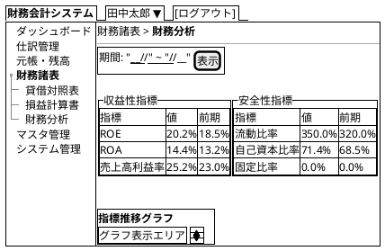

---

### SCR-USR-001: ユーザー一覧

**目的**: 登録済みユーザーを一覧表示する

**レイアウト**:

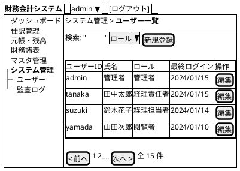

---

### SCR-USR-002: ユーザー登録/編集

**目的**: ユーザーを新規登録または編集する

**レイアウト**:

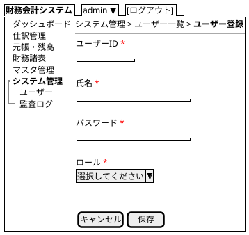

---

### SCR-SYS-001: 監査ログ

**目的**: システムの操作履歴を照会する

**レイアウト**:

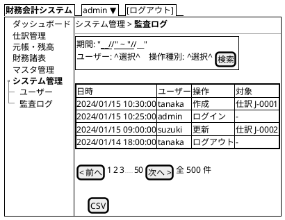

---

## 共通コンポーネント

### ヘッダー


### サイドナビゲーション

```plantuml
@startsalt
{
  {T
    + ダッシュボード
    + 仕訳管理
    ++ 仕訳一覧
    ++ 仕訳入力
    ++ 承認待ち
    + 元帳・残高
    ++ 総勘定元帳
    ++ 補助元帳
    ++ 残高試算表
    + 財務諸表
    ++ 貸借対照表
    ++ 損益計算書
    ++ 財務分析
    + マスタ管理
    ++ 勘定科目
    + システム管理
    ++ ユーザー
    ++ 監査ログ
  }
}
@endsalt
```

### 確認ダイアログ

```plantuml
@startsalt
{+
  <b>確認
  --
  .
  本当に削除しますか？
  .
  { [キャンセル] | [  OK  ] }
}
@endsalt
```

### エラー表示

```plantuml
@startsalt
{
  {<color:red>⚠ エラーメッセージ}
}
@endsalt
```

### 成功通知

```plantuml
@startsalt
{
  {<color:green>✓ 処理が完了しました}
}
@endsalt
```

### ページネーション

```plantuml
@startsalt
{
  { [< 前へ] | [1] | [2] | [3] | ... | [10] | [次へ >] | 表示件数: ^10^ | 全 100 件 }
}
@endsalt
```

### 日付入力

```plantuml
@startsalt
{
  "____/__/__"
}
@endsalt
```

---

## 画面遷移図

```plantuml
@startuml
title 画面遷移図

[*] --> ログイン

ログイン --> ダッシュボード : ログイン成功

ダッシュボード --> 仕訳一覧
ダッシュボード --> 総勘定元帳
ダッシュボード --> 貸借対照表

仕訳一覧 --> 仕訳入力 : 新規入力
仕訳一覧 --> 仕訳詳細 : 行クリック
仕訳詳細 --> 仕訳編集 : 編集
仕訳詳細 --> 仕訳一覧 : 戻る
仕訳入力 --> 仕訳一覧 : 保存/キャンセル
仕訳編集 --> 仕訳詳細 : 保存/キャンセル

承認待ち一覧 --> 仕訳詳細 : 行クリック

勘定科目一覧 --> 勘定科目登録 : 新規登録
勘定科目一覧 --> 勘定科目編集 : 編集
勘定科目登録 --> 勘定科目一覧 : 保存/キャンセル
勘定科目編集 --> 勘定科目一覧 : 保存/キャンセル

総勘定元帳 --> 仕訳詳細 : 仕訳番号クリック

ユーザー一覧 --> ユーザー登録 : 新規登録
ユーザー一覧 --> ユーザー編集 : 編集
ユーザー登録 --> ユーザー一覧 : 保存/キャンセル
ユーザー編集 --> ユーザー一覧 : 保存/キャンセル

ダッシュボード --> [*] : ログアウト

@enduml
```

---

## ロール別アクセス権限

| 画面 | 管理者 | 経理責任者 | 経理担当者 | 閲覧者 |
|------|--------|-----------|-----------|--------|
| ダッシュボード | ○ | ○ | ○ | ○ |
| 勘定科目一覧 | ○ | ○ | ○ | ○ |
| 勘定科目登録/編集 | ○ | ○ | - | - |
| 仕訳一覧 | ○ | ○ | ○ | ○ |
| 仕訳入力/編集 | ○ | ○ | ○ | - |
| 仕訳承認 | ○ | ○ | - | - |
| 仕訳確定 | ○ | ○ | - | - |
| 総勘定元帳 | ○ | ○ | ○ | ○ |
| 補助元帳 | ○ | ○ | ○ | ○ |
| 残高試算表 | ○ | ○ | ○ | ○ |
| 貸借対照表 | ○ | ○ | ○ | ○ |
| 損益計算書 | ○ | ○ | ○ | ○ |
| 財務分析 | ○ | ○ | - | - |
| ユーザー管理 | ○ | - | - | - |
| 監査ログ | ○ | - | - | - |

---

## レスポンシブ対応

### ブレークポイント

| 名称 | 幅 | 説明 |
|------|-----|------|
| Desktop | 1200px 以上 | フルレイアウト |
| Tablet | 768px - 1199px | サイドナビ折りたたみ |
| Mobile | 767px 以下 | ハンバーガーメニュー |

### モバイル対応方針

- サイドナビゲーションはハンバーガーメニューに変換
- テーブルは横スクロール対応
- フォーム項目は縦並びに変更
- 数値入力時は数字キーボードを表示

---

## トレーサビリティマトリクス

| 画面 ID | 画面名 | ユースケース | ユーザーストーリー |
|---------|--------|-------------|------------------|
| SCR-AUTH-001 | ログイン | UC-AUTH-001 | US-AUTH-001 |
| SCR-DASH-001 | ダッシュボード | - | - |
| SCR-MST-001 | 勘定科目一覧 | UC-MST-004 | US-MST-004 |
| SCR-MST-002 | 勘定科目登録/編集 | UC-MST-001, UC-MST-002 | US-MST-001, US-MST-002 |
| SCR-JNL-001 | 仕訳一覧 | UC-JNL-004, UC-JNL-005 | US-JNL-004, US-JNL-005 |
| SCR-JNL-002 | 仕訳入力/編集 | UC-JNL-001, UC-JNL-002 | US-JNL-001, US-JNL-002 |
| SCR-JNL-003 | 仕訳詳細 | UC-JNL-004 | US-JNL-004 |
| SCR-JNL-004 | 承認待ち一覧 | UC-JNL-008, UC-JNL-009 | US-JNL-008, US-JNL-009 |
| SCR-LDG-001 | 総勘定元帳 | UC-LDG-001 | US-LDG-001 |
| SCR-LDG-002 | 補助元帳 | UC-LDG-002 | US-LDG-002 |
| SCR-LDG-003 | 残高試算表 | UC-LDG-005 | US-LDG-005 |
| SCR-FS-001 | 貸借対照表 | UC-FS-001 | US-FS-001 |
| SCR-FS-002 | 損益計算書 | UC-FS-002 | US-FS-002 |
| SCR-FS-003 | 財務分析 | UC-FS-003 | US-FS-003 |
| SCR-USR-001 | ユーザー一覧 | UC-AUTH-003 | US-AUTH-006 |
| SCR-USR-002 | ユーザー登録/編集 | UC-AUTH-003 | US-AUTH-003, US-AUTH-004 |
| SCR-SYS-001 | 監査ログ | UC-SYS-001 | US-SYS-001 |
