# UI 設計書

## 概要

本ドキュメントは、財務会計システムのユーザーインターフェース設計を定義します。OOUX（Object-Oriented UX）の原則に基づき、ドメインオブジェクトを中心とした画面設計を行います。

## 設計原則

### OOUX（Object-Oriented UX）

1. **オブジェクトの識別**: ユーザーが操作する対象を明確化
2. **関係性の定義**: オブジェクト間の関連を可視化
3. **アクションの設計**: オブジェクトに対する操作を定義
4. **属性の決定**: 各オブジェクトの表示属性を選定

### Container / View パターン

- **Container**: データ取得、状態管理、イベントハンドリング
- **View**: 表示ロジック、Props のみに依存、純粋なコンポーネント

---

## オブジェクトモデル

### 主要オブジェクト一覧

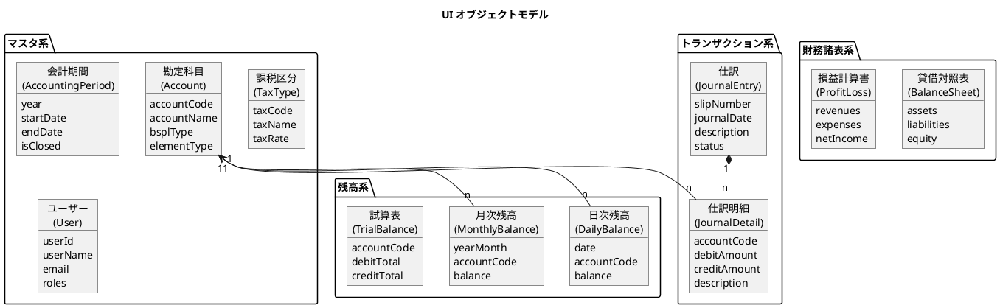

### オブジェクトと画面パターン

| オブジェクト | Collection View | Single View | 編集モーダル | 検索モーダル |
|-------------|-----------------|-------------|--------------|--------------|
| 勘定科目 | ○ | ○ | ○ | - |
| 会計期間 | ○ | ○ | ○ | - |
| 課税区分 | ○ | ○ | ○ | - |
| ユーザー | ○ | ○ | ○ | - |
| 仕訳 | ○ | ○ | ○ (入力画面) | ○ |
| 日次残高 | ○ | - | - | ○ |
| 月次残高 | ○ | - | - | ○ |
| 試算表 | ○ | - | - | ○ |
| 貸借対照表 | - | ○ | - | ○ |
| 損益計算書 | - | ○ | - | ○ |

---

## 画面構成

### サイトレイアウト

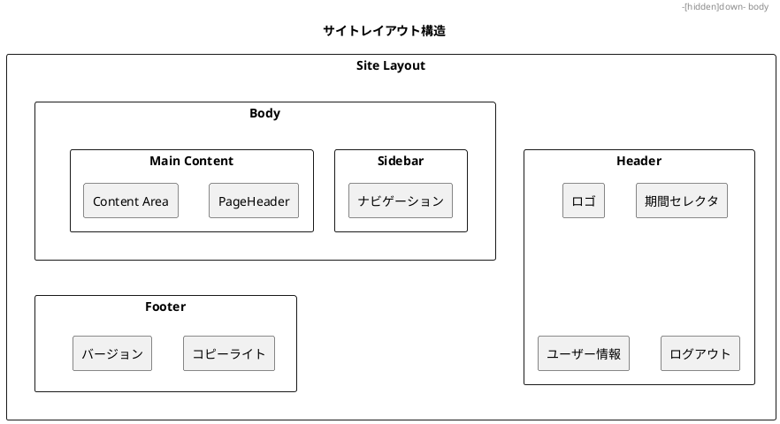

### ナビゲーション構造

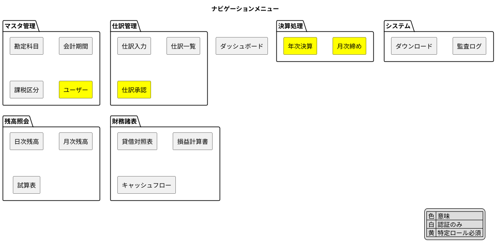

---

## 画面一覧

### 画面 ID 体系

| カテゴリ | ID プレフィックス | 説明 |
|---------|------------------|------|
| 認証 | AUTH | ログイン、ログアウト |
| ダッシュボード | DASH | ダッシュボード |
| マスタ管理 | MSTR | 勘定科目、会計期間、課税区分、ユーザー |
| 仕訳管理 | JRNL | 仕訳入力、一覧、承認 |
| 残高照会 | BLNC | 日次、月次、試算表 |
| 財務諸表 | STMT | BS、PL、CF |
| 決算処理 | CLSE | 月次締め、年次決算 |
| システム | SYS | 監査ログ、ダウンロード |

### 画面一覧表

| 画面 ID | 画面名 | URL | 関連 UC |
|---------|--------|-----|---------|
| AUTH-001 | ログイン | /login | UC001 |
| DASH-001 | ダッシュボード | /dashboard | - |
| MSTR-001 | 勘定科目一覧 | /master/accounts | UC002, UC003, UC004 |
| MSTR-002 | 会計期間一覧 | /master/periods | - |
| MSTR-003 | 課税区分一覧 | /master/tax-types | - |
| MSTR-004 | ユーザー一覧 | /master/users | UC018 |
| JRNL-001 | 仕訳入力 | /journal/entry | UC005 |
| JRNL-002 | 仕訳編集 | /journal/entry/:id | UC006 |
| JRNL-003 | 仕訳一覧 | /journal/list | UC007 |
| JRNL-004 | 仕訳承認 | /journal/approval | UC008 |
| BLNC-001 | 日次残高照会 | /balance/daily | UC009 |
| BLNC-002 | 月次残高照会 | /balance/monthly | UC010 |
| BLNC-003 | 試算表 | /balance/trial | UC011 |
| STMT-001 | 貸借対照表 | /statement/balance-sheet | UC012 |
| STMT-002 | 損益計算書 | /statement/profit-loss | UC013 |
| STMT-003 | キャッシュフロー計算書 | /statement/cash-flow | UC014 |
| CLSE-001 | 月次締め | /closing/monthly | UC015 |
| CLSE-002 | 年次決算 | /closing/year-end | UC016 |
| SYS-001 | 監査ログ | /system/audit-log | UC019 |
| SYS-002 | レポートダウンロード | /system/download | UC017 |

---

## 画面遷移図

### 全体遷移図

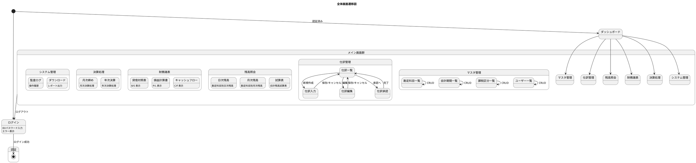

### 仕訳管理画面遷移図

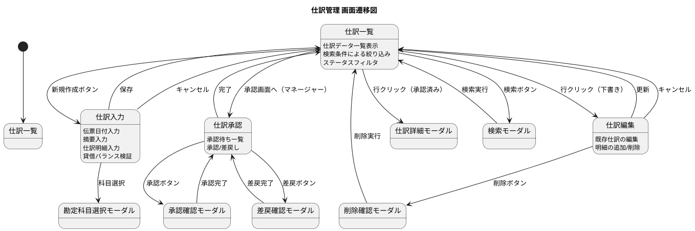

### マスタ管理画面遷移図

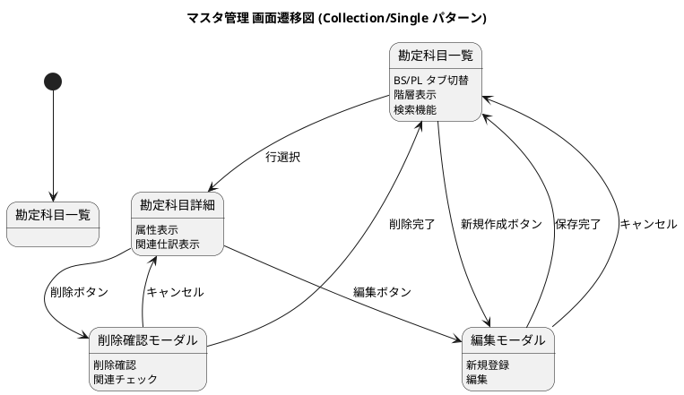

---

## 画面モックアップ

### AUTH-001: ログイン画面

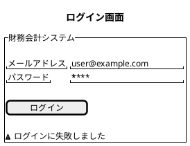

### DASH-001: ダッシュボード

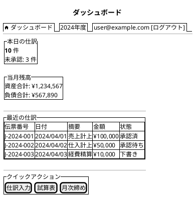

### MSTR-001: 勘定科目一覧

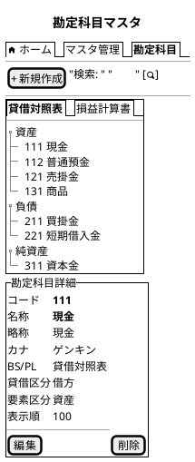

### MSTR-001-M1: 勘定科目編集モーダル

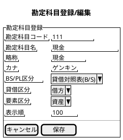

### JRNL-001: 仕訳入力画面

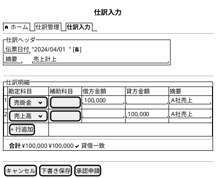

### JRNL-003: 仕訳一覧画面

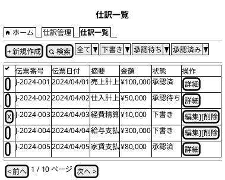

### JRNL-003-M1: 仕訳検索モーダル

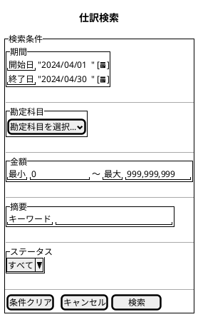

### JRNL-004: 仕訳承認画面

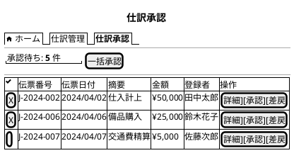

### BLNC-001: 日次残高照会

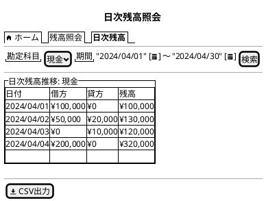

### BLNC-003: 試算表

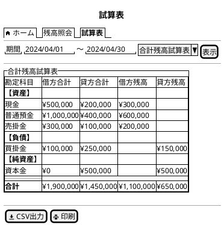

### STMT-001: 貸借対照表

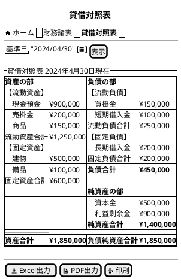

### STMT-002: 損益計算書

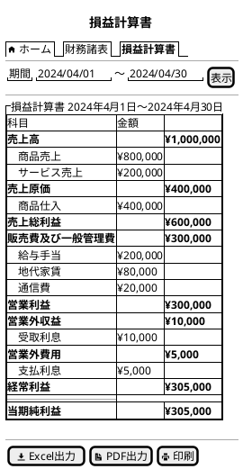

### CLSE-001: 月次締め

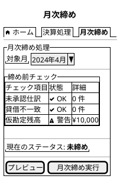

### SYS-001: 監査ログ

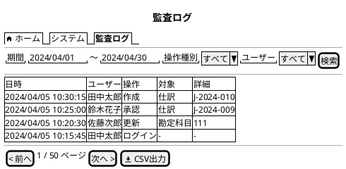

---

## 共通コンポーネント

### 共通モーダル

| コンポーネント | 用途 | サイズ |
|---------------|------|--------|
| BaseModal | 基本モーダル | small/medium/large/full |
| EditModal | 編集モーダル | medium |
| SearchModal | 検索モーダル | large |
| SelectModal | 選択モーダル | medium |
| ConfirmModal | 確認モーダル | small |

### フォームコンポーネント

| コンポーネント | 用途 |
|---------------|------|
| FormField | ラベル付きフォームフィールド |
| DatePicker | 日付選択 |
| DateRangePicker | 期間選択 |
| MoneyInput | 金額入力 |
| AccountSelector | 勘定科目選択 |

### 表示コンポーネント

| コンポーネント | 用途 |
|---------------|------|
| MoneyDisplay | 金額表示（3桁カンマ） |
| DateDisplay | 日付表示 |
| StatusBadge | ステータスバッジ |
| PageHeader | ページヘッダー（パンくず付き） |
| Loading | ローディング表示 |
| ErrorMessage | エラーメッセージ |
| MessageDisplay | 通知メッセージ |

### ボタンコンポーネント

| バリアント | 用途 |
|-----------|------|
| primary | 主要アクション（保存、実行） |
| secondary | 副次アクション（キャンセル） |
| danger | 危険なアクション（削除） |
| warning | 警告アクション（差戻し） |
| text | テキストリンク風 |

---

## アクセシビリティ

### キーボード操作

| 操作 | キー |
|------|------|
| モーダルを閉じる | Escape |
| フォーム送信 | Enter |
| 次のフィールドへ | Tab |
| 前のフィールドへ | Shift + Tab |

### ARIA 対応

- モーダルには `role="dialog"` と `aria-modal="true"` を設定
- フォームフィールドには適切な `label` と `aria-describedby` を設定
- エラーメッセージは `aria-live="polite"` で通知
- ローディング状態は `aria-busy="true"` で通知

### 色覚対応

- 色だけに依存しない情報伝達（アイコン、テキストを併用）
- コントラスト比 4.5:1 以上の確保
- フォーカス時の視覚的フィードバック

---

## レスポンシブ対応

### ブレークポイント

| サイズ | 幅 | 用途 |
|--------|-----|------|
| small | < 768px | スマートフォン |
| medium | 768px - 1024px | タブレット |
| large | > 1024px | デスクトップ |

### 対応方針

- 本システムはデスクトップファーストで設計
- タブレット以上のサイズに最適化
- スマートフォンは閲覧のみ対応（入力は非推奨）

---

## 画面遷移とユースケースの対応

| ユースケース | 開始画面 | 終了画面 |
|-------------|----------|----------|
| UC001: ログイン | AUTH-001 | DASH-001 |
| UC002: 勘定科目登録 | MSTR-001 | MSTR-001 |
| UC003: 勘定科目更新 | MSTR-001 | MSTR-001 |
| UC004: 勘定科目削除 | MSTR-001 | MSTR-001 |
| UC005: 仕訳入力 | JRNL-001 | JRNL-003 |
| UC006: 仕訳修正 | JRNL-002 | JRNL-003 |
| UC007: 仕訳検索 | JRNL-003 | JRNL-003 |
| UC008: 仕訳承認 | JRNL-004 | JRNL-004 |
| UC009: 日次残高照会 | BLNC-001 | BLNC-001 |
| UC010: 月次残高照会 | BLNC-002 | BLNC-002 |
| UC011: 試算表表示 | BLNC-003 | BLNC-003 |
| UC012: 貸借対照表表示 | STMT-001 | STMT-001 |
| UC013: 損益計算書表示 | STMT-002 | STMT-002 |
| UC014: CF計算書表示 | STMT-003 | STMT-003 |
| UC015: 月次締め | CLSE-001 | CLSE-001 |
| UC016: 年次決算 | CLSE-002 | CLSE-002 |
| UC017: レポートDL | SYS-002 | SYS-002 |
| UC018: ユーザー管理 | MSTR-004 | MSTR-004 |
| UC019: 監査ログ | SYS-001 | SYS-001 |
