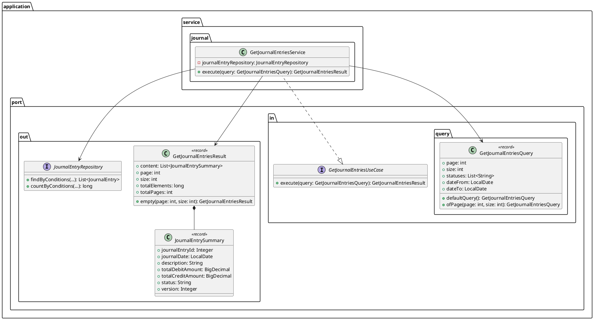
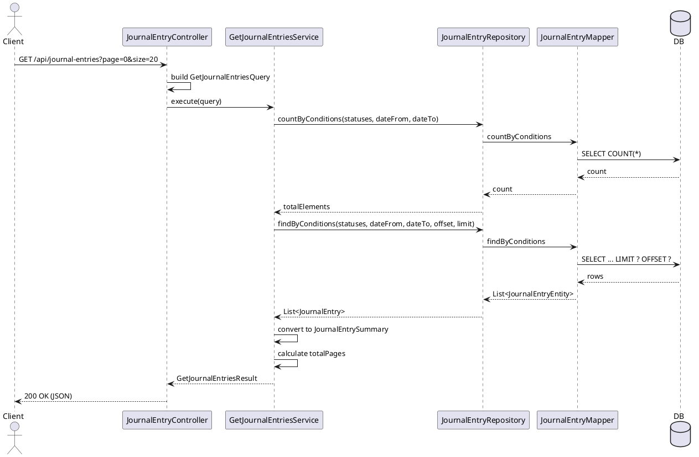

# JNL-004-01: 仕訳一覧取得ユースケース設計

## 概要

US-JNL-004（仕訳一覧表示）のバックエンドユースケース設計。既存の GetJournalEntryUseCase を拡張し、ページネーション・フィルタリング機能を追加する。

## 受入条件

- [ ] 仕訳番号、仕訳日付、摘要、金額、ステータスが一覧表示される
- [ ] ステータスでフィルタリングできる
- [ ] 日付範囲で絞り込みできる
- [ ] 一覧から詳細画面に遷移できる
- [ ] ページネーションに対応する

## ユースケース設計

### 1. Query クラス（Input Port）

```java
package com.example.accounting.application.port.in.query;

import java.time.LocalDate;
import java.util.List;

/**
 * 仕訳一覧取得クエリ
 *
 * @param page ページ番号（0始まり）
 * @param size ページサイズ（デフォルト: 20）
 * @param statuses フィルタ対象ステータス（空の場合は全ステータス）
 * @param dateFrom 仕訳日付の開始日（null可）
 * @param dateTo 仕訳日付の終了日（null可）
 */
public record GetJournalEntriesQuery(
    int page,
    int size,
    List<String> statuses,
    LocalDate dateFrom,
    LocalDate dateTo
) {
    /**
     * デフォルト値でのクエリ生成
     */
    public static GetJournalEntriesQuery defaultQuery() {
        return new GetJournalEntriesQuery(0, 20, List.of(), null, null);
    }

    /**
     * ページ番号でのクエリ生成
     */
    public static GetJournalEntriesQuery ofPage(int page, int size) {
        return new GetJournalEntriesQuery(page, size, List.of(), null, null);
    }

    /**
     * コンパクトコンストラクタ - バリデーション
     */
    public GetJournalEntriesQuery {
        if (page < 0) {
            throw new IllegalArgumentException("Page must be >= 0");
        }
        if (size < 1 || size > 100) {
            throw new IllegalArgumentException("Size must be between 1 and 100");
        }
        statuses = statuses == null ? List.of() : List.copyOf(statuses);
    }
}
```

### 2. Result クラス（Output Port）

```java
package com.example.accounting.application.port.out;

import java.math.BigDecimal;
import java.time.LocalDate;
import java.util.List;

/**
 * 仕訳一覧結果（ページネーション対応）
 *
 * @param content 仕訳一覧
 * @param page 現在のページ番号（0始まり）
 * @param size ページサイズ
 * @param totalElements 総件数
 * @param totalPages 総ページ数
 */
public record GetJournalEntriesResult(
    List<JournalEntrySummary> content,
    int page,
    int size,
    long totalElements,
    int totalPages
) {
    /**
     * コンパクトコンストラクタ - 防御的コピー
     */
    public GetJournalEntriesResult {
        content = content == null ? List.of() : List.copyOf(content);
    }

    /**
     * 空の結果を返す
     */
    public static GetJournalEntriesResult empty(int page, int size) {
        return new GetJournalEntriesResult(List.of(), page, size, 0, 0);
    }

    /**
     * 仕訳サマリー（一覧表示用）
     *
     * @param journalEntryId 仕訳ID
     * @param journalDate 仕訳日付
     * @param description 摘要
     * @param totalDebitAmount 借方合計金額
     * @param totalCreditAmount 貸方合計金額
     * @param status ステータス
     * @param version バージョン（楽観的ロック用）
     */
    public record JournalEntrySummary(
        Integer journalEntryId,
        LocalDate journalDate,
        String description,
        BigDecimal totalDebitAmount,
        BigDecimal totalCreditAmount,
        String status,
        Integer version
    ) {}
}
```

### 3. UseCase インターフェース

```java
package com.example.accounting.application.port.in;

import com.example.accounting.application.port.in.query.GetJournalEntriesQuery;
import com.example.accounting.application.port.out.GetJournalEntriesResult;

/**
 * 仕訳一覧取得ユースケース
 */
public interface GetJournalEntriesUseCase {
    /**
     * 仕訳一覧を取得する（ページネーション対応）
     *
     * @param query 検索条件
     * @return 仕訳一覧結果
     */
    GetJournalEntriesResult execute(GetJournalEntriesQuery query);
}
```

### 4. Repository インターフェース拡張

```java
// JournalEntryRepository に追加するメソッド
/**
 * 条件付きで仕訳一覧を取得する（ページネーション対応）
 *
 * @param statuses フィルタ対象ステータス
 * @param dateFrom 仕訳日付開始
 * @param dateTo 仕訳日付終了
 * @param offset オフセット
 * @param limit 取得件数
 * @return 仕訳エンティティリスト
 */
List<JournalEntry> findByConditions(
    List<String> statuses,
    LocalDate dateFrom,
    LocalDate dateTo,
    int offset,
    int limit
);

/**
 * 条件に一致する仕訳件数を取得する
 *
 * @param statuses フィルタ対象ステータス
 * @param dateFrom 仕訳日付開始
 * @param dateTo 仕訳日付終了
 * @return 件数
 */
long countByConditions(
    List<String> statuses,
    LocalDate dateFrom,
    LocalDate dateTo
);
```

## API 設計

### エンドポイント

```
GET /api/journal-entries
```

### クエリパラメータ

| パラメータ | 型 | 必須 | デフォルト | 説明 |
|-----------|-----|------|-----------|------|
| page | int | No | 0 | ページ番号（0始まり） |
| size | int | No | 20 | ページサイズ（1-100） |
| status | string[] | No | - | フィルタ対象ステータス（複数指定可） |
| dateFrom | string | No | - | 仕訳日付開始（YYYY-MM-DD） |
| dateTo | string | No | - | 仕訳日付終了（YYYY-MM-DD） |

### リクエスト例

```
GET /api/journal-entries?page=0&size=20&status=DRAFT&status=PENDING&dateFrom=2026-01-01&dateTo=2026-01-31
```

### レスポンス例

```json
{
  "content": [
    {
      "journalEntryId": 1,
      "journalDate": "2026-01-15",
      "description": "文房具購入",
      "totalDebitAmount": 5000.00,
      "totalCreditAmount": 5000.00,
      "status": "DRAFT",
      "version": 1
    },
    {
      "journalEntryId": 2,
      "journalDate": "2026-01-16",
      "description": "電話代支払い",
      "totalDebitAmount": 8000.00,
      "totalCreditAmount": 8000.00,
      "status": "PENDING",
      "version": 1
    }
  ],
  "page": 0,
  "size": 20,
  "totalElements": 42,
  "totalPages": 3
}
```

## 実装タスク分解

### JNL-004-02: GetJournalEntriesQuery 実装

**ファイル**: `apps/backend/src/main/java/com/example/accounting/application/port/in/query/GetJournalEntriesQuery.java`

- GetJournalEntriesQuery record の作成
- バリデーション（page >= 0, size 1-100）
- ファクトリメソッド（defaultQuery, ofPage）

### JNL-004-03: GetJournalEntriesService 実装

**ファイル**: `apps/backend/src/main/java/com/example/accounting/application/service/journal/GetJournalEntriesService.java`

- GetJournalEntriesUseCase の実装
- JournalEntryRepository を使用した一覧取得
- JournalEntry → JournalEntrySummary 変換
- ページネーション計算（totalPages）

### JNL-004-04: ページネーション実装

**ファイル**: `apps/backend/src/main/resources/com/example/accounting/infrastructure/mapper/JournalEntryMapper.xml`

- findByConditions クエリ追加（LIMIT/OFFSET）
- countByConditions クエリ追加
- 動的 WHERE 句（ステータス、日付範囲）

### JNL-004-05: 仕訳一覧 API 実装

**ファイル**: `apps/backend/src/main/java/com/example/accounting/presentation/api/JournalEntryController.java`

- GET /api/journal-entries エンドポイント更新
- クエリパラメータのマッピング
- GetJournalEntriesUseCase 呼び出し

## クラス図



## シーケンス図



## 更新履歴

| 日付 | 更新内容 | 更新者 |
|------|---------|--------|
| 2026-01-27 | 初版作成 | Claude Opus 4.5 |
