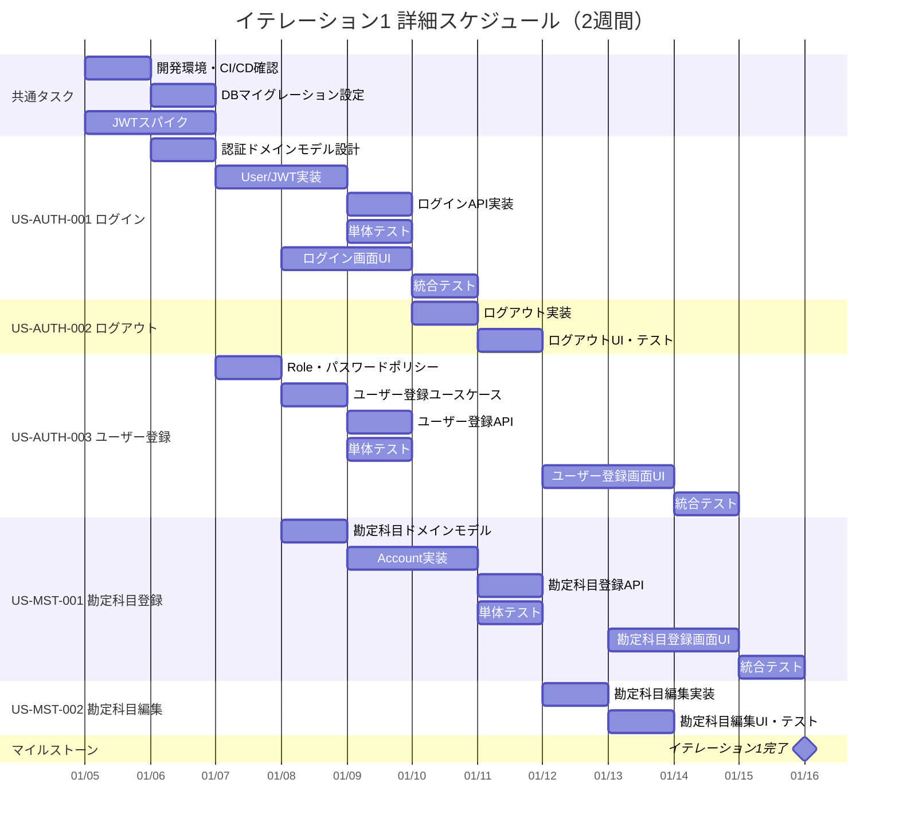

# イテレーション計画 1 - 財務会計システム

## 基本情報

| 項目 | 内容 |
|------|------|
| イテレーション番号 | 1 |
| 期間 | 2026-01-05 〜 2026-01-16（2週間） |
| 作業日数 | 10日 |
| チーム人数 | 3名 |
| 総作業可能時間 | 150時間（3名 × 5時間/日 × 10日） |

## イテレーションゴール

**認証基盤とマスタ管理の基礎を構築し、システムの土台を確立する**

ユーザーがログイン・ログアウトでき、システム管理者がユーザーを登録でき、経理責任者が勘定科目を登録・編集できる状態を目指す。

## 選択したストーリー

| ストーリーID | ストーリー名 | SP | 優先度 |
|-------------|-------------|-----|--------|
| US-AUTH-001 | ログイン | 3 | 必須 |
| US-AUTH-002 | ログアウト | 2 | 必須 |
| US-AUTH-003 | ユーザー登録 | 5 | 必須 |
| US-MST-001 | 勘定科目登録 | 5 | 必須 |
| US-MST-002 | 勘定科目編集 | 3 | 必須 |
| **合計** | | **18** | |

**コミットメント**: 18SP（予定ベロシティ 13〜16SP を若干上回るが、初期セットアップ含むため妥当）

---

## タスク分解

### US-AUTH-001: ログイン（3SP）

**受入条件**:

- [ ] ユーザーIDとパスワードを入力してログインできる
- [ ] 認証成功時、JWT トークンが発行される
- [ ] 認証失敗時、エラーメッセージが表示される
- [ ] 3回連続でログイン失敗した場合、アカウントがロックされる
- [ ] ログイン成功後、ダッシュボード画面に遷移する

| タスクID | タスク名 | 理想時間 | 担当 | 状態 |
|----------|---------|---------|------|------|
| AUTH-001-01 | 認証ドメインモデル設計 | 2h | - | 未着手 |
| AUTH-001-02 | User エンティティ実装 | 2h | - | 未着手 |
| AUTH-001-03 | UserRepository 実装 | 2h | - | 未着手 |
| AUTH-001-04 | JWT トークン生成・検証サービス実装 | 4h | - | 未着手 |
| AUTH-001-05 | ログインユースケース実装 | 2h | - | 未着手 |
| AUTH-001-06 | ログイン API 実装 | 2h | - | 未着手 |
| AUTH-001-07 | 単体テスト作成 | 4h | - | 未着手 |
| AUTH-001-08 | ログイン画面 UI 実装 | 4h | - | 未着手 |
| AUTH-001-09 | フロントエンド認証状態管理 | 2h | - | 未着手 |
| AUTH-001-10 | 統合テスト | 2h | - | 未着手 |
| | **小計** | **26h** | | |

---

### US-AUTH-002: ログアウト（2SP）

**受入条件**:

- [ ] ログアウトボタンをクリックするとログアウトできる
- [ ] ログアウト後、ログイン画面に遷移する
- [ ] JWT トークンが無効化される

| タスクID | タスク名 | 理想時間 | 担当 | 状態 |
|----------|---------|---------|------|------|
| AUTH-002-01 | ログアウトユースケース実装 | 1h | - | 未着手 |
| AUTH-002-02 | トークン無効化機能実装 | 2h | - | 未着手 |
| AUTH-002-03 | ログアウト API 実装 | 1h | - | 未着手 |
| AUTH-002-04 | 単体テスト作成 | 2h | - | 未着手 |
| AUTH-002-05 | ログアウトボタン UI 実装 | 2h | - | 未着手 |
| AUTH-002-06 | フロントエンド状態クリア | 1h | - | 未着手 |
| AUTH-002-07 | 統合テスト | 1h | - | 未着手 |
| | **小計** | **10h** | | |

---

### US-AUTH-003: ユーザー登録（5SP）

**受入条件**:

- [ ] ユーザーID、氏名、パスワード、ロールを入力して登録できる
- [ ] ユーザーIDは一意である必要がある
- [ ] パスワードは8文字以上で、英数字を含む必要がある
- [ ] ロールは管理者、経理責任者、経理担当者、閲覧者から選択できる
- [ ] 登録成功時、確認メッセージが表示される

| タスクID | タスク名 | 理想時間 | 担当 | 状態 |
|----------|---------|---------|------|------|
| AUTH-003-01 | Role 値オブジェクト実装 | 2h | - | 未着手 |
| AUTH-003-02 | パスワードポリシー実装 | 2h | - | 未着手 |
| AUTH-003-03 | パスワードハッシュ化サービス実装 | 2h | - | 未着手 |
| AUTH-003-04 | ユーザー登録ユースケース実装 | 3h | - | 未着手 |
| AUTH-003-05 | ユーザー登録 API 実装 | 2h | - | 未着手 |
| AUTH-003-06 | 一意性チェック実装 | 2h | - | 未着手 |
| AUTH-003-07 | 単体テスト作成 | 4h | - | 未着手 |
| AUTH-003-08 | ユーザー登録画面 UI 実装 | 6h | - | 未着手 |
| AUTH-003-09 | バリデーション表示実装 | 2h | - | 未着手 |
| AUTH-003-10 | 統合テスト | 2h | - | 未着手 |
| | **小計** | **27h** | | |

---

### US-MST-001: 勘定科目登録（5SP）

**受入条件**:

- [ ] 科目コード、科目名、勘定科目種別を入力して登録できる
- [ ] 科目コードは一意である必要がある
- [ ] 勘定科目種別は資産、負債、純資産、収益、費用から選択できる
- [ ] 登録成功時、確認メッセージが表示される

| タスクID | タスク名 | 理想時間 | 担当 | 状態 |
|----------|---------|---------|------|------|
| MST-001-01 | 勘定科目ドメインモデル設計 | 2h | - | 未着手 |
| MST-001-02 | AccountCode 値オブジェクト実装 | 2h | - | 未着手 |
| MST-001-03 | AccountType 列挙型実装 | 1h | - | 未着手 |
| MST-001-04 | Account エンティティ実装 | 3h | - | 未着手 |
| MST-001-05 | AccountRepository 実装 | 3h | - | 未着手 |
| MST-001-06 | 勘定科目登録ユースケース実装 | 3h | - | 未着手 |
| MST-001-07 | 勘定科目登録 API 実装 | 2h | - | 未着手 |
| MST-001-08 | 単体テスト作成 | 4h | - | 未着手 |
| MST-001-09 | 勘定科目登録画面 UI 実装 | 6h | - | 未着手 |
| MST-001-10 | 統合テスト | 2h | - | 未着手 |
| | **小計** | **28h** | | |

---

### US-MST-002: 勘定科目編集（3SP）

**受入条件**:

- [ ] 科目名、勘定科目種別を編集できる
- [ ] 科目コードは変更できない
- [ ] 仕訳で使用されている科目の種別は変更できない
- [ ] 編集成功時、確認メッセージが表示される

| タスクID | タスク名 | 理想時間 | 担当 | 状態 |
|----------|---------|---------|------|------|
| MST-002-01 | 勘定科目編集ユースケース実装 | 3h | - | 未着手 |
| MST-002-02 | 使用中チェックロジック実装 | 2h | - | 未着手 |
| MST-002-03 | 勘定科目編集 API 実装 | 2h | - | 未着手 |
| MST-002-04 | 単体テスト作成 | 3h | - | 未着手 |
| MST-002-05 | 勘定科目編集画面 UI 実装 | 4h | - | 未着手 |
| MST-002-06 | 統合テスト | 2h | - | 未着手 |
| | **小計** | **16h** | | |

---

## 共通タスク（スパイク・環境構築）

| タスクID | タスク名 | 理想時間 | 担当 | 状態 |
|----------|---------|---------|------|------|
| COMMON-01 | 開発環境セットアップ確認 | 2h | - | 未着手 |
| COMMON-02 | DB マイグレーション設定 | 2h | - | 未着手 |
| COMMON-03 | JWT ライブラリ選定・検証（スパイク） | 4h | - | 未着手 |
| COMMON-04 | API 共通エラーハンドリング実装 | 3h | - | 未着手 |
| COMMON-05 | フロントエンド共通レイアウト実装 | 4h | - | 未着手 |
| COMMON-06 | CI/CD パイプライン確認 | 2h | - | 未着手 |
| | **小計** | **17h** | | |

---

## 作業時間サマリー

| カテゴリ | 理想時間 |
|---------|---------|
| US-AUTH-001: ログイン | 26h |
| US-AUTH-002: ログアウト | 10h |
| US-AUTH-003: ユーザー登録 | 27h |
| US-MST-001: 勘定科目登録 | 28h |
| US-MST-002: 勘定科目編集 | 16h |
| 共通タスク | 17h |
| **合計** | **124h** |

**キャパシティ**: 150h（3名 × 5h × 10日）
**バッファ**: 26h（17%）

---

## 詳細スケジュール

---

## 週次計画

### Week 1（2026-01-05 〜 2026-01-09）

| 日 | 主要タスク |
|----|-----------|
| 月 | 環境確認、JWT スパイク開始 |
| 火 | DB マイグレーション、認証ドメインモデル設計 |
| 水 | User エンティティ、JWT サービス実装 |
| 木 | ログイン API、Role・パスワードポリシー |
| 金 | ログイン画面 UI、ユーザー登録ユースケース |

### Week 2（2026-01-12 〜 2026-01-16）

| 日 | 主要タスク |
|----|-----------|
| 月 | ユーザー登録画面 UI、勘定科目ドメインモデル |
| 火 | Account 実装、勘定科目登録 API |
| 水 | 勘定科目登録画面 UI |
| 木 | 勘定科目編集実装、統合テスト |
| 金 | 最終統合テスト、デモ準備、レビュー |

---

## リスクと対策

| リスク | 影響度 | 発生確率 | 対策 |
|-------|-------|---------|------|
| JWT 実装の複雑化 | 高 | 中 | Week 1 でスパイク実施、ライブラリ活用 |
| DB 接続の問題 | 中 | 低 | 早期に環境確認、Docker 設定見直し |
| フロントエンド統合の遅延 | 中 | 中 | バックエンド API を先行完成 |

---

## コミットメント確認

### チーム合意事項

- [ ] 全ストーリーの受入条件を理解した
- [ ] タスク分解と見積もりに合意した
- [ ] 18SP を2週間で完了することにコミットする
- [ ] デイリースタンドアップを毎日実施する
- [ ] 問題発生時は即座に共有する

### 完了の定義（Definition of Done）

- [ ] すべての受入条件を満たしている
- [ ] 単体テストが作成され、すべてパスしている
- [ ] 統合テストが作成され、すべてパスしている
- [ ] コードレビューが完了している
- [ ] CI/CD パイプラインでビルドが成功している
- [ ] ドキュメントが更新されている

---

## 進捗状況

### ストーリー進捗

| ストーリーID | ストーリー名 | SP | 状態 | 完了日 |
|-------------|-------------|-----|------|--------|
| US-AUTH-001 | ログイン | 3 | 未着手 | - |
| US-AUTH-002 | ログアウト | 2 | 未着手 | - |
| US-AUTH-003 | ユーザー登録 | 5 | 未着手 | - |
| US-MST-001 | 勘定科目登録 | 5 | 未着手 | - |
| US-MST-002 | 勘定科目編集 | 3 | 未着手 | - |

### 日次残理想時間

| 日 | 計画残時間 | 実績残時間 | 差異 |
|----|-----------|-----------|------|
| Day 1 | 124h | - | - |
| Day 2 | 112h | - | - |
| Day 3 | 100h | - | - |
| Day 4 | 88h | - | - |
| Day 5 | 74h | - | - |
| Day 6 | 62h | - | - |
| Day 7 | 50h | - | - |
| Day 8 | 38h | - | - |
| Day 9 | 24h | - | - |
| Day 10 | 0h | - | - |

---

## 更新履歴

| 日付 | 更新内容 | 更新者 |
|------|---------|--------|
| 2026-01-05 | 初版作成 | - |
