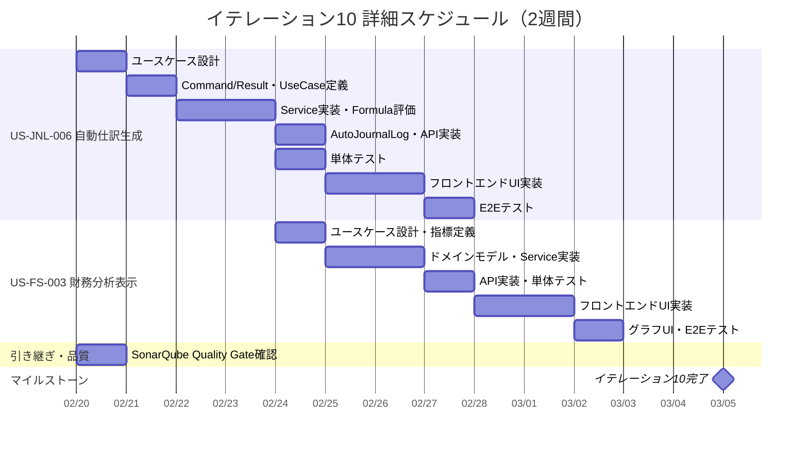

# イテレーション計画 10 - 財務会計システム

## 基本情報

| 項目 | 内容 |
|------|------|
| イテレーション番号 | 10 |
| 期間 | 2026-02-20 〜 2026-03-05（2週間） |
| 作業日数 | 10日 |
| チーム人数 | 3名 |
| 総作業可能時間 | 150時間（3名 × 5時間/日 × 10日） |
| 前イテレーションベロシティ | 13SP |
| 累積平均ベロシティ | 14.7SP |

## イテレーションゴール

**自動仕訳生成機能と財務分析表示を実装し、業務効率化と経営判断支援を実現する**

リリース 3.0 完成版の 2 番目のイテレーションとして、IT-9 で構築した自動仕訳パターンマスタを活用した自動仕訳生成機能と、IT-7/8 で構築した財務諸表データを活用した財務分析指標表示機能を実装する。

## 選択したストーリー

| ストーリーID | ストーリー名 | SP | 優先度 | 状態 |
|-------------|-------------|-----|--------|------|
| US-JNL-006 | 自動仕訳生成 | 5 | 重要 | 完了 |
| US-FS-003 | 財務分析表示 | 5 | 重要 | 完了 |
| **合計** | | **10** | | |

**コミットメント**: 10SP（累積平均ベロシティ 14.7SP に対して適切。US-JNL-006 は新規パターン要素を含み、US-FS-003 は既存財務諸表パターンの拡張。IT-9 ふりかえりの「パターン新規度」評価を反映）

---

## ゴール

### イテレーション終了時の達成状態

1. **自動仕訳生成**: 自動仕訳パターンを選択して仕訳を自動生成でき、生成された仕訳は編集・金額変更が可能
2. **財務分析表示**: ROE、ROA、流動比率、自己資本比率などの財務分析指標が表示され、算出根拠が確認できる

### 成功基準

- [x] US-JNL-006, US-FS-003 の全受入条件を満たしている
- [ ] テストカバレッジ 80% 以上を維持
- [ ] SonarQube Quality Gate パス（IT-7〜9 からの引き継ぎ、今回必ず実施）
- [ ] 全テスト（バックエンド + フロントエンド）がパス

---

## ユーザーストーリー

### US-JNL-006: 自動仕訳生成（5SP）

**ストーリー**:

> 経理担当者として、定型取引の仕訳を自動生成したい。なぜなら、入力作業を効率化するためだ。

**受入条件**:

- [x] 自動仕訳設定を選択して仕訳を生成できる
- [x] 生成された仕訳は編集可能
- [x] 金額は手動で変更できる
- [x] 生成成功時、確認メッセージが表示される

---

### US-FS-003: 財務分析表示（5SP）

**ストーリー**:

> 経営者として、財務分析指標を確認したい。なぜなら、経営判断の参考にするためだ。

**受入条件**:

- [x] ROE、ROA、流動比率、自己資本比率などの指標が表示される
- [x] 各指標の算出根拠が確認できる
- [x] 期間推移をグラフで表示できる
- [x] 業界平均との比較ができる

---

## タスク分解

### US-JNL-006: 自動仕訳生成（5SP）

| タスクID | タスク名 | 理想時間 | 担当 | 状態 |
|----------|---------|---------|------|------|
| JNL-006-01 | 自動仕訳生成ユースケース設計 | 2h | Claude | [x] |
| JNL-006-02 | GenerateAutoJournalCommand / Result（Input Port）実装 | 2h | Codex | [x] |
| JNL-006-03 | GenerateAutoJournalUseCase インターフェース定義 | 1h | Codex | [x] |
| JNL-006-04 | GenerateAutoJournalService 実装（パターン取得→仕訳生成→保存） | 4h | Codex | [x] |
| JNL-006-05 | amountFormula 評価ロジック実装 | 3h | Codex | [x] |
| JNL-006-06 | AutoJournalLog ドメインモデル・Repository 実装 | 3h | Codex | [x] |
| JNL-006-07 | 自動仕訳生成 API 実装（POST /api/journal-entries/generate） | 2h | Codex | [x] |
| JNL-006-08 | 単体テスト作成 | 4h | Codex | [x] |
| JNL-006-09 | フロントエンド API クライアント実装 | 2h | Codex | [x] |
| JNL-006-10 | 自動仕訳生成 UI 実装（パターン選択→金額入力→生成） | 4h | Codex | [x] |
| JNL-006-11 | 統合テスト（E2E テスト） | 2h | Claude | [x] |
| | **小計** | **29h** | | |

#### 実装詳細

**バックエンド実装**:

- `GenerateAutoJournalCommand` - Input Port（patternId, amounts Map, journalDate, description）
- `GenerateAutoJournalResult` - 生成された JournalEntry の情報
- `GenerateAutoJournalUseCase` - ユースケースインターフェース
- `GenerateAutoJournalService` - ユースケース実装
  1. `AutoJournalPatternRepository.findById()` でパターン取得
  2. `AccountRepository.findByCode()` で各明細の勘定科目を解決
  3. `amountFormula` を評価して金額を算出
  4. `JournalEntry.create()` + `addLine()` で仕訳を生成
  5. `JournalEntry.validateForSave()` で貸借一致チェック
  6. `JournalEntryRepository.save()` で保存
  7. `AutoJournalLogRepository.save()` で実行ログを記録

**amountFormula 評価**:

- シンプルな式評価: `amount`（パラメータ参照）、`amount * 0.1`（定率計算）
- Map<String, BigDecimal> で金額パラメータを渡す
- 安全な式評価（ScriptEngine は使わず、パターンマッチベースの簡易評価）

**データソース**:

- `auto_journal_patterns` + `auto_journal_pattern_items`（IT-9 で作成済み）
- `auto_journal_logs`（V9 マイグレーションで作成済み）
- `journal_entries` + `journal_entry_debit_credit`（既存）

**API エンドポイント**:

| メソッド | エンドポイント | 権限 | 説明 |
|---------|---------------|------|------|
| POST | /api/journal-entries/generate | ADMIN, MANAGER | 自動仕訳生成 |

---

### US-FS-003: 財務分析表示（5SP）

| タスクID | タスク名 | 理想時間 | 担当 | 状態 |
|----------|---------|---------|------|------|
| FS-003-01 | 財務分析ユースケース設計（指標定義） | 2h | Claude | [ ] |
| FS-003-02 | FinancialAnalysis ドメインモデル実装（指標計算ロジック） | 4h | Codex | [ ] |
| FS-003-03 | GetFinancialAnalysisCommand / Result（Input Port）実装 | 2h | Codex | [ ] |
| FS-003-04 | GetFinancialAnalysisService 実装（BS/PL データ統合→指標計算） | 4h | Codex | [ ] |
| FS-003-05 | 財務分析 API 実装（GET /api/financial-analysis） | 2h | Codex | [ ] |
| FS-003-06 | 単体テスト作成 | 3h | Codex | [ ] |
| FS-003-07 | フロントエンド API クライアント実装 | 2h | Codex | [ ] |
| FS-003-08 | 財務分析フィルター UI 実装（期間選択） | 2h | Codex | [ ] |
| FS-003-09 | 財務分析指標テーブル UI 実装（指標一覧 + 算出根拠） | 3h | Codex | [ ] |
| FS-003-10 | 期間推移グラフ UI 実装 | 3h | Codex | [ ] |
| FS-003-11 | 統合テスト（E2E テスト） | 2h | Claude | [ ] |
| | **小計** | **29h** | | |

#### 実装詳細

**財務分析指標**:

| 指標名 | 英語名 | 算出式 | カテゴリ |
|--------|--------|--------|---------|
| 自己資本利益率 | ROE | 当期純利益 / 純資産 × 100 | 収益性 |
| 総資産利益率 | ROA | 当期純利益 / 総資産 × 100 | 収益性 |
| 売上高利益率 | Net Profit Margin | 当期純利益 / 収益合計 × 100 | 収益性 |
| 流動比率 | Current Ratio | 流動資産 / 流動負債 × 100 | 安全性 |
| 自己資本比率 | Equity Ratio | 純資産 / 総資産 × 100 | 安全性 |
| 負債比率 | Debt Ratio | 負債合計 / 純資産 × 100 | 安全性 |
| 総資産回転率 | Asset Turnover | 収益合計 / 総資産 | 効率性 |

**バックエンド実装**:

- `GetFinancialAnalysisCommand` - Input Port（date, comparativeDate, dateFrom, dateTo）
- `GetFinancialAnalysisResult` - 指標一覧、カテゴリ別グループ、期間推移データ
- `GetFinancialAnalysisService` - 既存の `BalanceSheetRepository` と `ProfitAndLossRepository` を利用
  1. 貸借対照表データを取得（総資産、負債、純資産）
  2. 損益計算書データを取得（収益、費用、当期純利益）
  3. 各指標を計算
  4. 業界平均値（定数として定義）との比較

**フロントエンド実装**:

- `FinancialAnalysisPage.tsx` - メインページ
- `FinancialAnalysisFilter.tsx` - 期間選択フィルター
- `FinancialAnalysisTable.tsx` - 指標一覧テーブル（カテゴリ別）
- `FinancialAnalysisTrend.tsx` - 期間推移グラフ（CSS ベースのシンプルなバーチャート）
- Route: `/financial-statements/financial-analysis`

**API エンドポイント**:

| メソッド | エンドポイント | 権限 | 説明 |
|---------|---------------|------|------|
| GET | /api/financial-analysis | ADMIN, MANAGER, USER | 財務分析指標照会 |

---

### IT-9 ふりかえり引き継ぎタスク

| タスクID | タスク名 | 理想時間 | 担当 | 状態 |
|----------|---------|---------|------|------|
| CARRY-01 | SonarQube Quality Gate 確認・記録 | 2h | Claude | [ ] |
| | **小計** | **2h** | | |

---

## 作業時間サマリー

| カテゴリ | 理想時間 |
|---------|---------|
| US-JNL-006: 自動仕訳生成 | 29h |
| US-FS-003: 財務分析表示 | 29h |
| 引き継ぎタスク | 2h |
| **合計** | **60h** |

**キャパシティ**: 150h（3名 × 5h × 10日）
**バッファ**: 90h（60%）— リファクタリング、品質改善、予期しない技術課題に活用

---

## 詳細スケジュール

---

## 設計メモ

### API 設計

| メソッド | エンドポイント | 説明 | 権限 |
|---------|---------------|------|------|
| POST | /api/journal-entries/generate | 自動仕訳生成 | ADMIN, MANAGER |
| GET | /api/financial-analysis | 財務分析指標照会 | ADMIN, MANAGER, USER |

### パターン新規度評価（IT-9 ふりかえり Try-3 反映）

| ストーリー | 新規パターン要素 | 再利用可能パターン | 評価 |
|-----------|-----------------|-------------------|------|
| US-JNL-006 | amountFormula 評価ロジック、AutoJournalLog | Command/Service パターン、JournalEntry 生成パターン | **中** |
| US-FS-003 | 指標計算ロジック、グラフ表示 | BS/PL データ取得パターン、フィルター/テーブル UI パターン | **中** |

**総合評価**: 両ストーリーとも「新規要素あり + 既存パターン再利用」の組み合わせ。IT-9（全面再利用、2日完了）よりは時間がかかる見込み。amountFormula 評価とグラフ UI が技術的に新しい要素。

### 既存パターンの再利用

| パターン | 再利用元 | 適用先 |
|---------|---------|--------|
| Command/UseCase/Service | 仕訳承認（IT-5/6） | 自動仕訳生成 |
| JournalEntry 生成 | 仕訳入力（IT-2） | 自動仕訳生成 |
| AutoJournalLog | JournalEntry save パターン | 実行ログ記録 |
| BS/PL データ取得 | 貸借対照表・損益計算書（IT-7/8） | 財務分析 |
| フィルター/テーブル UI | 財務諸表ページ（IT-7/8） | 財務分析ページ |

### フロントエンドルーティング

| パス | 画面 |
|------|------|
| /financial-statements/financial-analysis | 財務分析表示 |

※ 自動仕訳生成は仕訳入力ページ内のアクションとして実装（独立ページではなく、パターン選択ダイアログ）

---

## リスクと対策

| リスク | 影響度 | 発生確率 | 対策 |
|-------|-------|---------|------|
| amountFormula 評価の複雑性 | 中 | 中 | シンプルなパターンマッチ方式で実装。複雑な式は将来対応 |
| 財務指標の算出精度 | 中 | 低 | テストデータで手動検証。ゼロ除算ガード実装 |
| グラフ表示の実装工数 | 低 | 中 | CSS ベースのシンプルなバーチャートで実装。Chart ライブラリは使わない |
| 業界平均データの取得 | 低 | 高 | 定数として中小企業庁の統計データを埋め込み。外部 API は使用しない |

---

## 前イテレーションからの改善アクション

| # | アクション | 状態 | 備考 |
|---|-----------|------|------|
| 1 | SonarQube Quality Gate 確認 | 計画済み | CARRY-01 タスクとして IT-10 初日に必ず実施（4IT 連続保留解消） |
| 2 | IT-10「パターン新規度」評価 | 反映済み | 両ストーリーとも「中」評価。バッファ 60% で余裕を確保 |
| 3 | リリース完了チェックリスト標準化 | IT-10 で対応 | コミット・Quality Gate・ドキュメント更新の完了確認リスト作成 |

---

## リリース 3.0 完成版 達成要件（イテレーション 9-12）

### 機能要件

- [x] 勘定科目構成登録（IT-9 完了）
- [x] 勘定科目構成編集（IT-9 完了）
- [x] 自動仕訳設定登録（IT-9 完了）
- [x] 自動仕訳設定編集（IT-9 完了）
- [ ] 自動仕訳生成 ← **イテレーション 10 で実装**
- [ ] 財務分析表示 ← **イテレーション 10 で実装**
- [ ] 監査ログ照会（イテレーション 11 予定）
- [ ] データダウンロード（イテレーション 11 予定）

### イテレーション 10 の位置づけ

イテレーション 10 はリリース 3.0 完成版の 2 番目のイテレーション。IT-9 で構築した自動仕訳パターンマスタを前提とする自動仕訳生成と、IT-7/8 で構築した財務諸表を基盤とする財務分析を実装する。両ストーリーとも既存データ基盤の上に「利活用機能」を積み上げる位置づけ。

---

## コミットメント確認

### チーム合意事項

- [ ] 全ストーリーの受入条件を理解した
- [ ] タスク分解と見積もりに合意した
- [ ] 10SP を 2 週間で完了することにコミットする
- [ ] デイリースタンドアップを毎日実施する
- [ ] 問題発生時は即座に共有する
- [ ] 日次バーンダウンを記録する

### 完了の定義（Definition of Done）

- [ ] すべての受入条件を満たしている
- [ ] 単体テストが作成され、すべてパスしている
- [ ] 統合テスト（E2E テスト）が作成され、すべてパスしている
- [ ] コードレビューが完了している
- [ ] CI/CD パイプラインでビルドが成功している
- [ ] テストカバレッジ 80% 以上を維持している
- [ ] SonarQube Quality Gate パス
- [ ] ドキュメントが更新されている

---

## 更新履歴

| 日付 | 更新内容 | 更新者 |
|------|---------|--------|
| 2026-02-20 | 初版作成 | Claude Opus 4.6 |
| 2026-02-21 | US-JNL-006 完了 | Claude Opus 4.6 |

---

## 関連ドキュメント

- [イテレーション 9 計画](./iteration_plan-9.md)
- [イテレーション 9 ふりかえり](./retrospective-9.md)
- [リリース計画](./release_plan.md)
- [ユーザーストーリー](../requirements/user_story.md)
