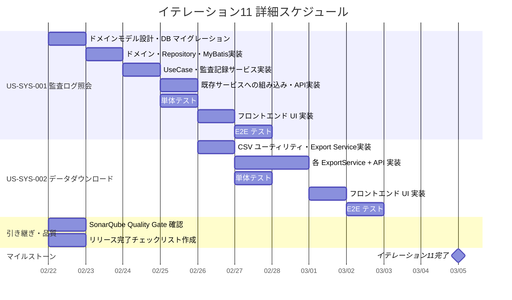

# イテレーション計画 11 - 財務会計システム

## 基本情報

| 項目 | 内容 |
|------|------|
| イテレーション番号 | 11 |
| 期間 | 2026-02-22 〜 2026-03-05（計画: 10日、実績見込: 3-4日） |
| 作業日数 | 10日（計画） |
| チーム人数 | 3名 |
| 総作業可能時間 | 150時間（3名 × 5時間/日 × 10日） |
| 前イテレーションベロシティ | 10SP |
| 累積平均ベロシティ | 14.2SP |

## イテレーションゴール

**監査ログ照会機能とデータダウンロード機能を実装し、システム管理と業務データ活用を実現する**

リリース 3.0 完成版の 3 番目のイテレーションとして、システム管理者向けの監査ログ照会と、経理担当者向けの各種データダウンロード機能を実装する。IT-12（最終イテレーション）のバッファ・統合テスト・リリース準備に向け、全機能ストーリーを本イテレーションで完了させる。

## 選択したストーリー

| ストーリーID | ストーリー名 | SP | 優先度 | 状態 |
|-------------|-------------|-----|--------|------|
| US-SYS-001 | 監査ログ照会 | 8 | 必須 | **完了** |
| US-SYS-002 | データダウンロード | 5 | 重要 | 未着手 |
| **合計** | | **13** | | |

**コミットメント**: 13SP（累積平均ベロシティ 14.2SP 以内。US-SYS-001 は新規テーブル・ドメインモデル要素を含み、US-SYS-002 は IT-7 の BS/PL エクスポートパターンの拡張。パターン新規度は「中」）

---

## ゴール

### イテレーション終了時の達成状態

1. **監査ログ照会**: システム管理者がユーザー操作履歴を日時・ユーザー・操作種別で検索・閲覧でき、ログイン履歴とデータ変更履歴を確認できる
2. **データダウンロード**: 経理担当者が仕訳一覧・元帳・試算表・財務諸表を CSV/Excel/PDF でダウンロードでき、期間や条件を指定できる
3. **品質保証**: SonarQube Quality Gate をパスし、4 イテレーション分の品質確認を完了する

### 成功基準

- [ ] US-SYS-001, US-SYS-002 の全受入条件を満たしている
- [ ] テストカバレッジ 80% 以上を維持
- [ ] SonarQube Quality Gate パス
- [ ] 全テスト（バックエンド + フロントエンド）がパス
- [ ] リリース完了チェックリストに基づく確認完了

---

## ユーザーストーリー

### US-SYS-001: 監査ログ照会（8SP）

**ストーリー**:

> システム管理者として、監査ログを照会したい。なぜなら、システムの利用状況を監査するためだ。

**受入条件**:

- [x] 日時、ユーザーID、操作内容、操作対象が一覧表示される
- [x] ユーザーID、操作日時、操作種別で検索できる
- [x] ログイン履歴が確認できる
- [x] データ変更履歴が確認できる

---

### US-SYS-002: データダウンロード（5SP）

**ストーリー**:

> 経理担当者として、各種データをダウンロードしたい。なぜなら、外部ツールで分析したり、帳票として印刷するためだ。

**受入条件**:

- [ ] 仕訳一覧を CSV/Excel でダウンロードできる
- [ ] 元帳を CSV/Excel でダウンロードできる
- [ ] 試算表を CSV/Excel/PDF でダウンロードできる
- [ ] 財務諸表を CSV/Excel/PDF でダウンロードできる
- [ ] ダウンロード時に期間や条件を指定できる

---

## タスク分解

### US-SYS-001: 監査ログ照会（8SP）

| タスクID | タスク名 | 理想時間 | 担当 | 状態 |
|----------|---------|---------|------|------|
| SYS-001-01 | 監査ログドメインモデル設計（AuditLog, AuditAction enum） | 2h | Claude | [x] |
| SYS-001-02 | DB マイグレーション V15__create_audit_logs.sql | 2h | Codex | [x] |
| SYS-001-03 | AuditLog ドメインモデル実装 | 2h | Codex | [x] |
| SYS-001-04 | AuditLogRepository（Output Port）+ MyBatis Mapper 実装 | 4h | Codex | [x] |
| SYS-001-05 | GetAuditLogsUseCase / Service 実装（検索・ページング） | 3h | Codex | [x] |
| SYS-001-06 | 監査ログ記録サービス実装（RecordAuditLogUseCase） | 4h | Codex | [x] |
| SYS-001-07 | 既存サービスへの監査ログ記録組み込み（仕訳CRUD、認証） | 4h | Codex | [x] |
| SYS-001-08 | 監査ログ照会 API 実装（GET /api/audit-logs） | 2h | Codex | [x] |
| SYS-001-09 | バックエンド単体テスト | 4h | Codex | [x] |
| SYS-001-10 | フロントエンド API クライアント実装 | 2h | Codex | [x] |
| SYS-001-11 | 監査ログ照会 UI 実装（フィルター + テーブル + ページング） | 4h | Codex | [x] |
| SYS-001-12 | 統合テスト（E2E テスト 16 件全パス） | 2h | Claude | [x] |
| | **小計** | **35h** | | |

#### 実装詳細

**データベース設計（V15 マイグレーション）**:

```sql
CREATE TABLE audit_logs (
    id BIGSERIAL PRIMARY KEY,
    user_id VARCHAR(50) NOT NULL,
    action_type VARCHAR(20) NOT NULL,    -- LOGIN, LOGOUT, CREATE, UPDATE, DELETE, APPROVE, REJECT, CONFIRM
    entity_type VARCHAR(50),              -- JOURNAL_ENTRY, ACCOUNT, USER, AUTO_JOURNAL_PATTERN
    entity_id VARCHAR(50),               -- 操作対象の ID
    description TEXT,                     -- 操作の詳細説明
    ip_address VARCHAR(45),              -- クライアント IP
    created_at TIMESTAMP DEFAULT CURRENT_TIMESTAMP
);
CREATE INDEX idx_audit_logs_user_id ON audit_logs(user_id);
CREATE INDEX idx_audit_logs_action_type ON audit_logs(action_type);
CREATE INDEX idx_audit_logs_created_at ON audit_logs(created_at);
CREATE INDEX idx_audit_logs_entity_type ON audit_logs(entity_type);
```

**バックエンド実装**:

- `AuditLog` - ドメインモデル（record、Lombok @Value は不要）
- `AuditAction` - enum（LOGIN, LOGOUT, CREATE, UPDATE, DELETE, APPROVE, REJECT, CONFIRM）
- `EntityType` - enum（JOURNAL_ENTRY, ACCOUNT, USER, AUTO_JOURNAL_PATTERN 等）
- `AuditLogRepository` - Output Port（検索: userId, actionType, entityType, dateFrom, dateTo, page, size）
- `GetAuditLogsService` - 照会ユースケース
- `AuditEventPublisher` - 監査ログ記録インターフェース（Spring Event or 直接保存）
- `AuditLogRecordService` - 監査ログ保存サービス

**監査ログ記録の組み込み方針**:

- 認証: `AuthenticationService` のログイン成功/失敗、ログアウトに記録
- 仕訳: `CreateJournalEntry`, `UpdateJournalEntry`, `DeleteJournalEntry` の各サービスに記録
- 承認: `ApproveJournalEntry`, `RejectJournalEntry`, `ConfirmJournalEntry` に記録
- 最小侵襲: 各サービスの成功時に `AuditEventPublisher.publish()` を呼ぶ

**API エンドポイント**:

| メソッド | エンドポイント | 権限 | 説明 |
|---------|---------------|------|------|
| GET | /api/audit-logs | ADMIN | 監査ログ照会（フィルター + ページング） |

**クエリパラメータ**:

| パラメータ | 型 | 必須 | 説明 |
|-----------|-----|------|------|
| userId | String | No | ユーザーID で絞り込み |
| actionType | String | No | 操作種別で絞り込み |
| entityType | String | No | エンティティ種別で絞り込み |
| dateFrom | LocalDate | No | 開始日 |
| dateTo | LocalDate | No | 終了日 |
| page | Integer | No | ページ番号（デフォルト: 0） |
| size | Integer | No | ページサイズ（デフォルト: 50） |

---

### US-SYS-002: データダウンロード（5SP）

| タスクID | タスク名 | 理想時間 | 担当 | 状態 |
|----------|---------|---------|------|------|
| SYS-002-01 | CSV エクスポートユーティリティ実装 | 3h | Codex | [ ] |
| SYS-002-02 | JournalEntryExportService 実装（CSV/Excel） | 4h | Codex | [ ] |
| SYS-002-03 | GeneralLedgerExportService 実装（CSV/Excel） | 3h | Codex | [ ] |
| SYS-002-04 | TrialBalanceExportService 実装（CSV/Excel/PDF） | 3h | Codex | [ ] |
| SYS-002-05 | 既存 BS/PL ExportService に CSV 対応追加 | 2h | Codex | [ ] |
| SYS-002-06 | エクスポート API エンドポイント追加（各コントローラー） | 3h | Codex | [ ] |
| SYS-002-07 | バックエンド単体テスト | 3h | Codex | [ ] |
| SYS-002-08 | フロントエンド ダウンロードボタン UI 実装 | 3h | Codex | [ ] |
| SYS-002-09 | 統合テスト（E2E テスト） | 2h | Claude | [ ] |
| | **小計** | **26h** | | |

#### 実装詳細

**CSV エクスポートユーティリティ**:

- Apache Commons CSV（commons-csv）を依存追加、または SimpleCsvWriter を自作
- 共通パターン: `CsvExportHelper.writeCsv(headers, rows)` → `byte[]`
- BOM 付き UTF-8 で出力（Excel での日本語文字化け防止）

**エクスポート対象と形式**:

| データ | CSV | Excel | PDF | エンドポイント |
|--------|-----|-------|-----|--------------|
| 仕訳一覧 | ✅ | ✅ | - | GET /api/journal-entries/export |
| 総勘定元帳 | ✅ | ✅ | - | GET /api/general-ledger/export |
| 試算表 | ✅ | ✅ | ✅ | GET /api/trial-balance/export |
| 貸借対照表 | ✅ | ✅ | ✅ | GET /api/balance-sheet/export（CSV 追加） |
| 損益計算書 | ✅ | ✅ | ✅ | GET /api/profit-and-loss/export（CSV 追加） |

**既存パターンの再利用**:

- `AbstractStatementExportService` を基底クラスとして活用（Excel/PDF）
- `BalanceSheetExportService` / `ProfitAndLossExportService` のパターンを踏襲
- 新規: `JournalEntryExportService`, `GeneralLedgerExportService`, `TrialBalanceExportService`
- 既存に CSV 追加: `BalanceSheetExportService`, `ProfitAndLossExportService`

**共通クエリパラメータ**:

| パラメータ | 型 | 説明 |
|-----------|-----|------|
| format | String | csv / excel / pdf（デフォルト: excel） |
| dateFrom | LocalDate | 開始日 |
| dateTo | LocalDate | 終了日 |

**フロントエンド実装**:

- 各一覧/照会ページにダウンロードボタン追加
- ファイル形式選択（CSV / Excel / PDF）のドロップダウン
- `window.open()` または Blob ダウンロードパターンで実装
- 既存フィルター条件をエクスポートパラメータに引き継ぎ

---

### IT-10 ふりかえり引き継ぎタスク

| タスクID | タスク名 | 理想時間 | 担当 | 状態 |
|----------|---------|---------|------|------|
| CARRY-01 | SonarQube Quality Gate 確認・パス | 4h | Claude | [ ] |
| CARRY-02 | リリース完了チェックリスト作成 | 2h | Claude | [ ] |
| | **小計** | **6h** | | |

---

## 作業時間サマリー

| カテゴリ | 理想時間 |
|---------|---------|
| US-SYS-001: 監査ログ照会 | 35h |
| US-SYS-002: データダウンロード | 26h |
| 引き継ぎタスク | 6h |
| **合計** | **67h** |

**キャパシティ**: 150h（3名 × 5h × 10日）
**バッファ**: 83h（55%）— リファクタリング、品質改善、予期しない技術課題に活用

---

## 詳細スケジュール



---

## 設計メモ

### API 設計

| メソッド | エンドポイント | 説明 | 権限 |
|---------|---------------|------|------|
| GET | /api/audit-logs | 監査ログ照会 | ADMIN |
| GET | /api/journal-entries/export | 仕訳一覧エクスポート | ADMIN, MANAGER, USER |
| GET | /api/general-ledger/export | 総勘定元帳エクスポート | ADMIN, MANAGER, USER |
| GET | /api/trial-balance/export | 残高試算表エクスポート | ADMIN, MANAGER |
| GET | /api/balance-sheet/export | 貸借対照表エクスポート（CSV 追加） | ADMIN, MANAGER |
| GET | /api/profit-and-loss/export | 損益計算書エクスポート（CSV 追加） | ADMIN, MANAGER |

### パターン新規度評価（IT-10 ふりかえり Try 反映）

| ストーリー | 新規パターン要素 | 再利用可能パターン | 評価 |
|-----------|-----------------|-------------------|------|
| US-SYS-001 | audit_logs テーブル、AuditEventPublisher、既存サービス組み込み | Command/Service パターン、MyBatis ResultMap、フィルター+テーブル UI | **中〜高** |
| US-SYS-002 | CSV エクスポートユーティリティ | AbstractStatementExportService、BS/PL Export パターン、Controller Export パターン | **中** |

**総合評価**: US-SYS-001 は新規テーブル + 既存サービスへの横断的組み込みが必要で新規度が高い。US-SYS-002 は IT-7 のエクスポートパターンを複数データに展開する拡張作業。実績ベースで 3-4 日を見込む。

### 既存パターンの再利用

| パターン | 再利用元 | 適用先 |
|---------|---------|--------|
| Command/UseCase/Service | 全イテレーション共通 | 監査ログ照会 |
| MyBatis ResultMap + フィルター検索 | 仕訳一覧（IT-3）、補助元帳（IT-7） | 監査ログ照会 |
| AbstractStatementExportService | 貸借対照表・損益計算書（IT-7/8） | データダウンロード |
| Controller Export パターン | BalanceSheetController（IT-7） | 各コントローラー |
| フィルター + テーブル UI | 仕訳一覧・元帳照会ページ | 監査ログ照会ページ |

### フロントエンドルーティング

| パス | 画面 |
|------|------|
| /system/audit-logs | 監査ログ照会 |

※ データダウンロードは既存の各ページにダウンロードボタンを追加（独立ページではない）

---

## リスクと対策

| リスク | 影響度 | 発生確率 | 対策 |
|-------|-------|---------|------|
| 監査ログの既存サービス組み込みの影響範囲 | 中 | 中 | AuditEventPublisher で疎結合化。各サービスの成功時のみ記録 |
| CSV エクスポートの日本語文字化け | 低 | 高 | BOM 付き UTF-8 出力で Excel 対応 |
| エクスポートの大量データによるメモリ不足 | 中 | 低 | ストリーミング出力は将来対応。まず byte[] ベースで実装 |
| SonarQube Quality Gate の未通過 | 中 | 低 | IT-11 初日に確認し、問題があれば即座に対応 |

---

## 前イテレーションからの改善アクション

| # | アクション | 状態 | 備考 |
|---|-----------|------|------|
| 1 | SonarQube Quality Gate 確認・パス | [ ] | IT-11 初日に 4 イテレーション分を確認 |
| 2 | リリース完了チェックリスト導入 | [ ] | コミット・QG・ドキュメント・GitHub 同期のチェックリスト |
| 3 | 実績ベースの期間見積もり | ✅ 反映済み | 計画 10 日、実績見込み 3-4 日で記載 |
| 4 | Codex への品質タスク委任 | [ ] | SonarQube カバレッジ向上を Codex に並列委任 |

---

## リリース 3.0 完成版 達成要件（イテレーション 9-12）

### 機能要件

- [x] 勘定科目構成登録（IT-9 完了）
- [x] 勘定科目構成編集（IT-9 完了）
- [x] 自動仕訳設定登録（IT-9 完了）
- [x] 自動仕訳設定編集（IT-9 完了）
- [x] 自動仕訳生成（IT-10 完了）
- [x] 財務分析表示（IT-10 完了）
- [x] 監査ログ照会（IT-11 完了 2026-02-23）
- [ ] データダウンロード（イテレーション 11）

### イテレーション 11 の位置づけ

イテレーション 11 はリリース 3.0 完成版の 3 番目のイテレーション。全機能ストーリーを完了させる最終機能実装イテレーションであり、IT-12 はバッファ・統合テスト・リリース準備に充てる。US-SYS-001（監査ログ）はシステム横断的な機能であり、US-SYS-002（データダウンロード）は既存データの出力機能。ともに「既存機能の補完・強化」という位置づけ。

---

## リリース完了チェックリスト（IT-10 Try-2 新規導入）

### イテレーション完了時の確認項目

- [ ] 全受入条件を満たしている
- [ ] 全テスト（バックエンド + フロントエンド + E2E）がパス
- [ ] SonarQube Quality Gate パス
- [ ] コードがコミット・プッシュ済み
- [ ] ドキュメント（計画・ふりかえり）が更新済み
- [ ] GitHub Issue がクローズ済み
- [ ] GitHub Project Board が同期済み
- [ ] release_plan.md のベロシティ・バーンダウンが更新済み
- [ ] docs/index.md と mkdocs.yml が最新

---

## コミットメント確認

### チーム合意事項

- [ ] 全ストーリーの受入条件を理解した
- [ ] タスク分解と見積もりに合意した
- [ ] 13SP を完了することにコミットする
- [ ] デイリースタンドアップを毎日実施する
- [ ] 問題発生時は即座に共有する

### 完了の定義（Definition of Done）

- [ ] すべての受入条件を満たしている
- [ ] 単体テストが作成され、すべてパスしている
- [ ] 統合テスト（E2E テスト）が作成され、すべてパスしている
- [ ] コードレビューが完了している
- [ ] CI/CD パイプラインでビルドが成功している
- [ ] テストカバレッジ 80% 以上を維持している
- [ ] SonarQube Quality Gate パス
- [ ] ドキュメントが更新されている

---

## 更新履歴

| 日付 | 更新内容 | 更新者 |
|------|---------|--------|
| 2026-02-21 | 初版作成 | Claude Opus 4.6 |
| 2026-02-23 | US-SYS-001 完了（監査ログ照会） | Claude Opus 4.6 |

---

## 関連ドキュメント

- [イテレーション 10 計画](./iteration_plan-10.md)
- [イテレーション 10 ふりかえり](./retrospective-10.md)
- [リリース計画](./release_plan.md)
- [ユーザーストーリー](../requirements/user_story.md)
