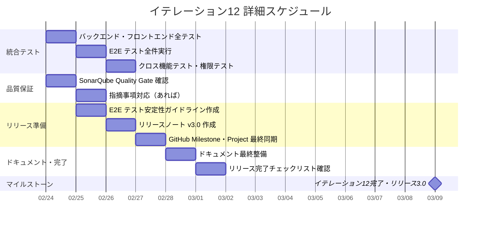

# イテレーション計画 12 - 財務会計システム

## 基本情報

| 項目 | 内容 |
|------|------|
| イテレーション番号 | 12 |
| 期間 | 2026-02-24 〜 2026-03-09（計画: 10日、実績見込: 3-5日） |
| 作業日数 | 10日（計画） |
| チーム人数 | 3名 |
| 総作業可能時間 | 150時間（3名 × 5時間/日 × 10日） |
| 前イテレーションベロシティ | 13SP |
| 累積平均ベロシティ | 14.1SP |

## イテレーションゴール

**リリース 3.0 完成版の品質保証を完了し、プロダクションリリースの準備を整える**

全 155SP（34 ストーリー）の機能実装は IT-11 で完了済み。IT-12 は最終イテレーションとして、統合テスト、リグレッションテスト、SonarQube 品質確認、リリースノート作成、GitHub 最終同期を実施し、リリース 3.0 完成版をリリース可能な状態にする。

## スコープ

### 機能ストーリー

なし（全 155SP 実装完了済み）

### バッファタスク（10SP 相当）

| タスクID | タスク名 | SP相当 | 優先度 | 状態 |
|----------|---------|--------|--------|------|
| IT12-001 | 統合テスト・リグレッションテスト | 3 | 必須 | [x] |
| IT12-002 | SonarQube Quality Gate 最終確認 | 2 | 必須 | [ ] |
| IT12-003 | E2E テスト安定性パターン標準化 | 1 | 重要 | [ ] |
| IT12-004 | リリースノート v3.0 作成 | 1 | 必須 | [ ] |
| IT12-005 | GitHub Milestone・Project 最終同期 | 1 | 必須 | [x] |
| IT12-006 | リリース完了チェックリスト運用 | 1 | 重要 | [ ] |
| IT12-007 | ドキュメント最終整備 | 1 | 重要 | [ ] |
| **合計** | | **10** | | |

---

## ゴール

### イテレーション終了時の達成状態

1. **統合テスト完了**: 全 34 ストーリーの受入条件を横断的に確認し、クロス機能テストが全てパス
2. **品質保証完了**: SonarQube Quality Gate パス確認、テストカバレッジ 80% 以上維持
3. **リリース準備完了**: リリースノート v3.0 作成、GitHub Milestone クローズ、Project Board 最終同期
4. **ドキュメント完備**: 全計画・ふりかえり・設計ドキュメントが最新状態

### 成功基準

- [x] 全バックエンドテスト（単体 + 統合）がパス — 905 テスト, 0 失敗, カバレッジ LINE 95.4% / BRANCH 84.4%
- [x] 全フロントエンドテスト（777+ テスト）がパス — 777 テスト, 110 ファイル, 0 失敗
- [x] E2E テスト全件パス — 31 スペック, 370 テスト, 370 合格（安定性修正 1 件含む）
- [ ] SonarQube Quality Gate パス（明示的確認）
- [ ] テストカバレッジ 80% 以上
- [ ] リリースノート v3.0 作成完了
- [x] GitHub Milestone「リリース 3.0 完成版」クローズ
- [x] GitHub Project Board 全アイテム Done（35/35）
- [ ] リリース完了チェックリスト全項目クリア

---

## タスク分解

### IT12-001: 統合テスト・リグレッションテスト（3SP相当）

**目的**: 全 34 ストーリーの受入条件を横断的に確認し、機能間の相互作用に問題がないことを保証する

| タスクID | タスク名 | 理想時間 | 担当 | 状態 |
|----------|---------|---------|------|------|
| IT12-001-01 | バックエンド全テスト実行・結果確認 | 1h | Claude | [x] |
| IT12-001-02 | フロントエンド全テスト実行・結果確認 | 1h | Claude | [x] |
| IT12-001-03 | E2E テスト全件実行・結果確認 | 2h | Claude | [x] |
| IT12-001-04 | クロス機能テスト（仕訳→承認→元帳→試算表→財務諸表） | 2h | Claude | [x] |
| IT12-001-05 | 権限テスト（ADMIN/MANAGER/USER の各ロール） | 1h | Claude | [x] |
| IT12-001-06 | データダウンロード機能の全形式確認 | 1h | Claude | [x] |
| | **小計** | **8h** | | |

**クロス機能テストシナリオ**:

1. 仕訳入力 → 承認申請 → 承認 → 確定 → 総勘定元帳に反映 → 残高試算表に反映 → 貸借対照表・損益計算書に反映
2. 自動仕訳パターン登録 → 自動仕訳生成 → 生成された仕訳の確認
3. 監査ログに全操作が記録されていることの確認
4. 各種データダウンロード（CSV/Excel/PDF）の出力内容確認

---

### IT12-002: SonarQube Quality Gate 最終確認（2SP相当）

**目的**: IT-7 から 5 イテレーション持ち越しの SonarQube 品質確認を完了する

| タスクID | タスク名 | 理想時間 | 担当 | 状態 |
|----------|---------|---------|------|------|
| IT12-002-01 | Backend SonarQube ダッシュボード確認 | 1h | Claude | [ ] |
| IT12-002-02 | Frontend SonarQube ダッシュボード確認 | 1h | Claude | [ ] |
| IT12-002-03 | Quality Gate 結果のスクリーンショット・記録 | 1h | Claude | [ ] |
| IT12-002-04 | 指摘事項への対応（あれば） | 4h | Codex | [ ] |
| | **小計** | **7h** | | |

---

### IT12-003: E2E テスト安定性パターン標準化（1SP相当）

**目的**: IT-11 で得た Cypress/React タイミング問題の知見をテストガイドラインに明文化する

| タスクID | タスク名 | 理想時間 | 担当 | 状態 |
|----------|---------|---------|------|------|
| IT12-003-01 | E2E テスト安定性ガイドライン作成 | 2h | Claude | [ ] |
| | **小計** | **2h** | | |

**ガイドライン内容**:

- ネイティブ DOM API パターン（React 制御コンポーネントの `<select>` 操作）
- `cy.get()` 再取得パターン（変数格納アンチパターンの回避）
- CI 環境のタイミング差を考慮したテスト設計

---

### IT12-004: リリースノート v3.0 作成（1SP相当）

**目的**: リリース 3.0 完成版のリリースノートを作成する

| タスクID | タスク名 | 理想時間 | 担当 | 状態 |
|----------|---------|---------|------|------|
| IT12-004-01 | リリースノート v3.0 作成 | 2h | Claude | [ ] |
| | **小計** | **2h** | | |

**リリースノート構成**:

- リリース概要（目標・達成内容）
- 新機能一覧（IT-9〜12 の機能）
- 改善点・バグ修正
- 既知の制限事項
- 技術スタック情報

---

### IT12-005: GitHub Milestone・Project 最終同期（1SP相当）

**目的**: GitHub の Milestone と Project Board を最終状態に同期する

| タスクID | タスク名 | 理想時間 | 担当 | 状態 |
|----------|---------|---------|------|------|
| IT12-005-01 | Milestone「リリース 3.0 完成版」クローズ | 0.5h | Claude | [x] |
| IT12-005-02 | Project Board 全アイテムの Status を Done に更新 | 1h | Claude | [x] |
| IT12-005-03 | 未クローズ Issue の確認・整理 | 0.5h | Claude | [x] |
| | **小計** | **2h** | | |

---

### IT12-006: リリース完了チェックリスト運用（1SP相当）

**目的**: IT-10 Try で導入したリリース完了チェックリストを正式に運用する

| タスクID | タスク名 | 理想時間 | 担当 | 状態 |
|----------|---------|---------|------|------|
| IT12-006-01 | リリース完了チェックリスト全項目確認 | 1h | Claude | [ ] |
| | **小計** | **1h** | | |

**チェックリスト**:

- [ ] 全 34 ストーリーの受入条件を満たしている
- [ ] 全テスト（バックエンド + フロントエンド + E2E）がパス
- [ ] SonarQube Quality Gate パス
- [ ] コードがコミット・プッシュ済み
- [ ] ドキュメント（全計画・全ふりかえり）が最新
- [ ] 全 GitHub Issue がクローズ済み
- [ ] GitHub Project Board が同期済み（全 Done）
- [ ] release_plan.md のベロシティ・バーンダウンが最終更新済み
- [ ] docs/index.md と mkdocs.yml が最新
- [ ] リリースノート v3.0 作成済み
- [ ] GitHub Milestone「リリース 3.0 完成版」クローズ済み

---

### IT12-007: ドキュメント最終整備（1SP相当）

**目的**: 全ドキュメントを最新状態に整備し、プロジェクト完了に備える

| タスクID | タスク名 | 理想時間 | 担当 | 状態 |
|----------|---------|---------|------|------|
| IT12-007-01 | release_plan.md 最終更新（IT-12 実績反映） | 1h | Claude | [ ] |
| IT12-007-02 | docs/index.md にイテレーション 12 情報追加 | 0.5h | Claude | [ ] |
| IT12-007-03 | mkdocs.yml にイテレーション 12 ナビゲーション追加 | 0.5h | Claude | [ ] |
| | **小計** | **2h** | | |

---

## 作業時間サマリー

| カテゴリ | 理想時間 |
|---------|---------|
| IT12-001: 統合テスト・リグレッションテスト | 8h |
| IT12-002: SonarQube Quality Gate 最終確認 | 7h |
| IT12-003: E2E テスト安定性パターン標準化 | 2h |
| IT12-004: リリースノート v3.0 作成 | 2h |
| IT12-005: GitHub Milestone・Project 最終同期 | 2h |
| IT12-006: リリース完了チェックリスト運用 | 1h |
| IT12-007: ドキュメント最終整備 | 2h |
| **合計** | **24h** |

**キャパシティ**: 150h（3名 × 5h × 10日）
**バッファ**: 126h（84%）— 予期しない品質問題への対応に活用可能

---

## 詳細スケジュール

---

## IT-11 ふりかえり引き継ぎタスクの対応

| # | アクション | IT-12 対応タスク | 状態 |
|---|-----------|-----------------|------|
| 1 | E2E テスト安定性パターンの標準化 | IT12-003 | [ ] |
| 2 | SonarQube Quality Gate 最終確認 | IT12-002 | [ ] |
| 3 | リリース完了チェックリスト運用 | IT12-006 | [ ] |
| 4 | 統合テスト・リグレッションテスト実施 | IT12-001 | [x] |

---

## リスクと対策

| リスク | 影響度 | 発生確率 | 対策 |
|-------|-------|---------|------|
| SonarQube で重大な品質問題が発見される | 高 | 低 | CI で常時パスしているため重大問題は低確率。発見時は即座に対応 |
| E2E テストが CI で不安定 | 中 | 中 | IT-11 で確立したネイティブ DOM API パターンを適用 |
| クロス機能テストで機能間の不整合発見 | 高 | 低 | 各機能は個別に E2E テスト済み。結合部分のみ追加確認 |
| ドキュメントの不整合 | 低 | 中 | 全ドキュメントの横断確認を実施 |

---

## リリース 3.0 完成版 達成要件（イテレーション 9-12）

### 機能要件（全完了）

- [x] 勘定科目構成登録（IT-9 完了）
- [x] 勘定科目構成編集（IT-9 完了）
- [x] 自動仕訳設定登録（IT-9 完了）
- [x] 自動仕訳設定編集（IT-9 完了）
- [x] 自動仕訳生成（IT-10 完了）
- [x] 財務分析表示（IT-10 完了）
- [x] 監査ログ照会（IT-11 完了）
- [x] データダウンロード（IT-11 完了）

### 品質要件（IT-12 で確認）

- [x] 全テストパス（バックエンド + フロントエンド + E2E）
- [ ] SonarQube Quality Gate パス
- [x] テストカバレッジ 80% 以上（LINE 95.4%, BRANCH 84.4%）
- [x] 統合テスト・リグレッションテスト完了

### リリース準備（IT-12 で実施）

- [ ] リリースノート v3.0 作成
- [x] GitHub Milestone「リリース 3.0 完成版」クローズ
- [x] GitHub Project Board 最終同期（35/35 Done）
- [ ] 全ドキュメント最終整備

### イテレーション 12 の位置づけ

イテレーション 12 はリリース 3.0 完成版の最終イテレーション。新規機能実装はなく、品質保証・リリース準備に特化する。全 155SP の機能が IT-11 で完了しているため、IT-12 は「作ったものが本当に動くか」「リリースに必要な手続きが整っているか」を確認する品質ゲートとしての位置づけ。

---

## リリース完了チェックリスト

### プロジェクト完了時の確認項目

- [x] 全 34 ストーリー（155SP）の受入条件を満たしている
- [x] 全テスト（バックエンド + フロントエンド + E2E）がパス
- [ ] SonarQube Quality Gate パス（明示的確認済み）
- [x] テストカバレッジ 80% 以上（LINE 95.4%, BRANCH 84.4%）
- [ ] コードがコミット・プッシュ済み
- [ ] 全ドキュメント（12 計画 + 12 ふりかえり + リリース計画）が最新
- [x] 全 GitHub Issue（34 件）がクローズ済み
- [x] GitHub Project Board 全アイテム Done（35/35）
- [x] 全 GitHub Milestone がクローズ済み（1.0, 2.0, 3.0）
- [ ] release_plan.md のベロシティ・バーンダウンが最終更新済み
- [ ] docs/index.md と mkdocs.yml が最新
- [ ] リリースノート v1.0, v2.0, v3.0 作成済み
- [ ] E2E テスト安定性ガイドライン作成済み

---

## コミットメント確認

### チーム合意事項

- [ ] IT-12 のスコープ（品質保証・リリース準備）を理解した
- [ ] タスク分解と見積もりに合意した
- [ ] 10SP 相当を完了することにコミットする
- [ ] 品質問題発見時は即座に対応する

### 完了の定義（Definition of Done）

- [ ] すべてのテストがパスしている
- [ ] SonarQube Quality Gate パス
- [ ] リリース完了チェックリスト全項目クリア
- [ ] GitHub の Milestone・Project が最終状態
- [ ] ドキュメントが全て最新

---

## 更新履歴

| 日付 | 更新内容 | 更新者 |
|------|---------|--------|
| 2026-02-24 | 初版作成 | Claude Opus 4.6 |
| 2026-02-24 | IT12-001 完了（全テストパス、E2E 安定性修正 1 件） | Claude Opus 4.6 |
| 2026-02-24 | IT12-005 完了（GitHub Milestone クローズ、Project Board 全 Done 確認） | Claude Opus 4.6 |

---

## 関連ドキュメント

- [イテレーション 11 計画](./iteration_plan-11.md)
- [イテレーション 11 ふりかえり](./retrospective-11.md)
- [リリース計画](./release_plan.md)
- [ユーザーストーリー](../requirements/user_story.md)
