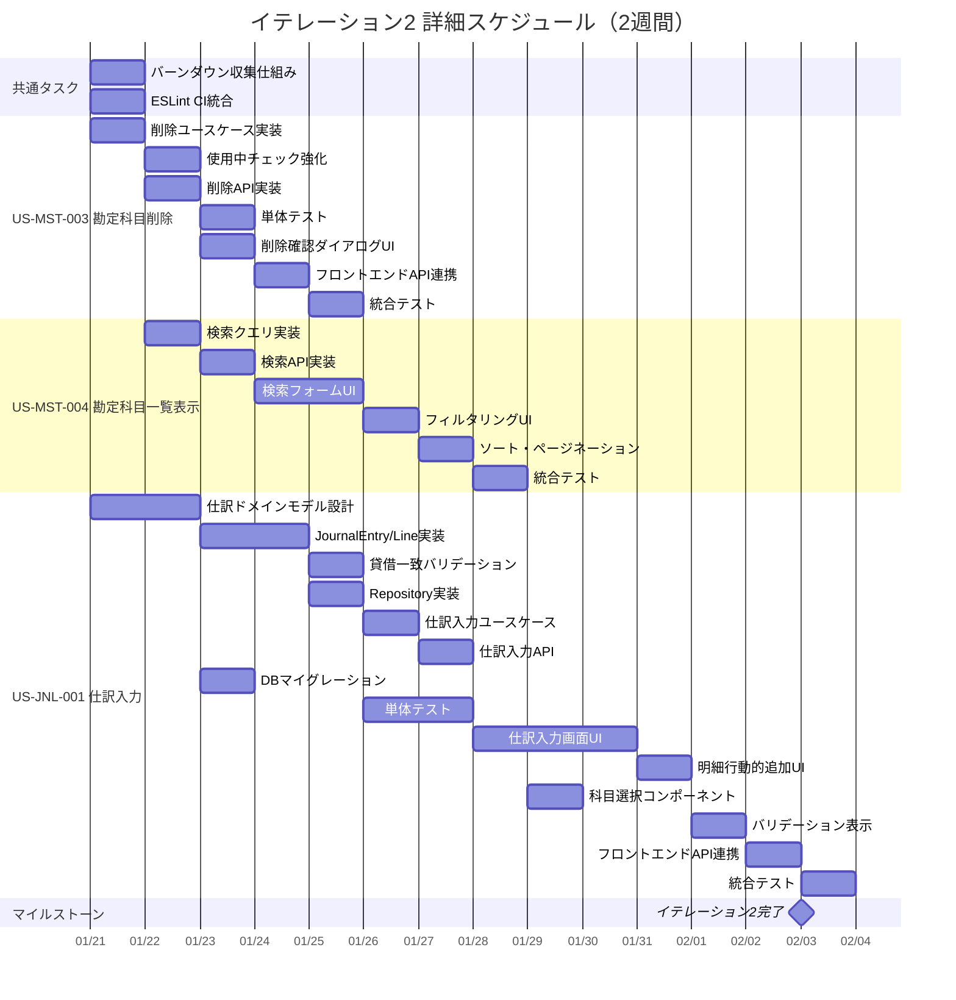

# イテレーション計画 2 - 財務会計システム

## 基本情報

| 項目 | 内容 |
|------|------|
| イテレーション番号 | 2 |
| 期間 | 2026-01-21 〜 2026-02-03（2週間） |
| 作業日数 | 10日 |
| チーム人数 | 3名 |
| 総作業可能時間 | 150時間（3名 × 5時間/日 × 10日） |
| 前イテレーションベロシティ | 18SP |

## イテレーションゴール

**マスタ管理を完成させ、仕訳入力機能の基礎を構築する**

経理責任者が勘定科目を削除でき、経理担当者が勘定科目を検索・フィルタリングでき、仕訳を入力できる状態を目指す。

## 選択したストーリー

| ストーリーID | ストーリー名 | SP | 優先度 |
|-------------|-------------|-----|--------|
| US-MST-003 | 勘定科目削除 | 3 | 必須 |
| US-MST-004 | 勘定科目一覧表示 | 5 | 必須 |
| US-JNL-001 | 仕訳入力 | 8 | 必須 |
| **合計** | | **16** | |

**コミットメント**: 16SP（前イテレーション実績 18SP を基に、仕訳ドメインの新規設計を考慮して控えめに設定）

---

## タスク分解

### US-MST-003: 勘定科目削除（3SP） ✅ 完了

**受入条件**:

- [x] 削除前に確認ダイアログが表示される
- [x] 仕訳で使用されている科目は削除できない
- [x] 削除成功時、確認メッセージが表示される

| タスクID | タスク名 | 理想時間 | 担当 | 状態 |
|----------|---------|---------|------|------|
| MST-003-01 | 勘定科目削除ユースケース実装 | 2h | Codex | 完了 |
| MST-003-02 | 使用中チェックロジック強化 | 2h | Codex | 完了 |
| MST-003-03 | 勘定科目削除 API 実装 | 2h | Codex | 完了 |
| MST-003-04 | 単体テスト作成 | 2h | Codex | 完了 |
| MST-003-05 | 削除確認ダイアログ UI 実装 | 2h | Codex | 完了 |
| MST-003-06 | フロントエンド API 連携 | 2h | Codex | 完了 |
| MST-003-07 | 統合テスト | 2h | Claude | 完了 |
| | **小計** | **14h** | | |

#### 実装詳細

**バックエンド実装**:

- `DeleteAccountCommand` / `DeleteAccountResult` - Input Port
- `DeleteAccountUseCase` - ユースケースインターフェース
- `DeleteAccountService` - ユースケース実装（Vavr Either/IO モナド使用）
- `AccountController` - DELETE /api/accounts/{id}
- `DeleteAccountResponse` - レスポンス DTO

**フロントエンド実装**:

- `deleteAccount.ts` - API クライアント
- `AccountList.tsx` - 削除ボタンと確認ダイアログ追加
- `AccountListPage.tsx` - 削除後のリスト再読み込み対応

**テスト**:

- `DeleteAccountServiceTest` - ユースケースユニットテスト
- `AccountControllerTest` - コントローラーユニットテスト更新
- `AccountList.test.tsx` - フロントエンドユニットテスト更新

---

### US-MST-004: 勘定科目一覧表示（5SP）

**受入条件**:

- [ ] 科目コード、科目名、勘定科目種別が一覧表示される
- [ ] 勘定科目種別でフィルタリングできる
- [ ] 科目コードまたは科目名で検索できる
- [ ] 階層構造がある場合、ツリー形式で表示できる（将来拡張）

**注記**: 基本的な一覧表示はイテレーション1で実装済み。本イテレーションではフィルタリングと検索機能を追加する。

| タスクID | タスク名 | 理想時間 | 担当 | 状態 |
|----------|---------|---------|------|------|
| MST-004-01 | 勘定科目検索クエリ実装（バックエンド） | 3h | - | 未着手 |
| MST-004-02 | 勘定科目検索 API 実装 | 2h | - | 未着手 |
| MST-004-03 | 単体テスト作成 | 2h | - | 未着手 |
| MST-004-04 | 検索フォーム UI 実装 | 3h | - | 未着手 |
| MST-004-05 | フィルタリング機能 UI 実装 | 3h | - | 未着手 |
| MST-004-06 | フロントエンド API 連携 | 2h | - | 未着手 |
| MST-004-07 | ソート機能実装 | 2h | - | 未着手 |
| MST-004-08 | ページネーション実装 | 3h | - | 未着手 |
| MST-004-09 | 統合テスト | 2h | - | 未着手 |
| | **小計** | **22h** | | |

---

### US-JNL-001: 仕訳入力（8SP）

**受入条件**:

- [ ] 仕訳日付、摘要を入力できる
- [ ] 借方科目、借方金額、貸方科目、貸方金額を入力できる
- [ ] 複数の明細行を追加できる
- [ ] 貸借の合計金額が一致しないと保存できない
- [ ] 存在しない勘定科目は選択できない
- [ ] 保存成功時、確認メッセージが表示される
- [ ] 保存された仕訳のステータスは「下書き」になる

| タスクID | タスク名 | 理想時間 | 担当 | 状態 |
|----------|---------|---------|------|------|
| JNL-001-01 | 仕訳ドメインモデル設計 | 4h | - | 未着手 |
| JNL-001-02 | JournalEntry エンティティ実装 | 4h | - | 未着手 |
| JNL-001-03 | JournalEntryLine 値オブジェクト実装 | 3h | - | 未着手 |
| JNL-001-04 | Money 値オブジェクト実装 | 2h | - | 未着手 |
| JNL-001-05 | JournalEntryStatus 列挙型実装 | 1h | - | 未着手 |
| JNL-001-06 | 貸借一致バリデーション実装 | 4h | - | 未着手 |
| JNL-001-07 | JournalEntryRepository 実装 | 4h | - | 未着手 |
| JNL-001-08 | 仕訳入力ユースケース実装 | 4h | - | 未着手 |
| JNL-001-09 | 仕訳入力 API 実装 | 3h | - | 未着手 |
| JNL-001-10 | DB マイグレーション作成 | 2h | - | 未着手 |
| JNL-001-11 | 単体テスト作成 | 6h | - | 未着手 |
| JNL-001-12 | 仕訳入力画面 UI 実装 | 8h | - | 未着手 |
| JNL-001-13 | 明細行の動的追加/削除 UI 実装 | 4h | - | 未着手 |
| JNL-001-14 | 科目選択コンポーネント実装 | 4h | - | 未着手 |
| JNL-001-15 | バリデーション表示実装 | 3h | - | 未着手 |
| JNL-001-16 | フロントエンド API 連携 | 3h | - | 未着手 |
| JNL-001-17 | 統合テスト | 4h | - | 未着手 |
| | **小計** | **63h** | | |

#### 実装詳細（設計方針）

**ドメインモデル設計**:

```
JournalEntry（集約ルート）
├── JournalEntryId（識別子）
├── JournalDate（仕訳日付）
├── Description（摘要）
├── Status（ステータス: DRAFT, PENDING, APPROVED, CONFIRMED）
├── List<JournalEntryLine>（仕訳明細）
│   ├── LineNumber（行番号）
│   ├── AccountId（勘定科目ID）
│   ├── DebitAmount（借方金額: Money）
│   └── CreditAmount（貸方金額: Money）
├── CreatedBy（作成者）
├── CreatedAt（作成日時）
├── UpdatedAt（更新日時）
└── ビジネスルール
    ├── 貸借一致: sum(借方) == sum(貸方)
    ├── 最低1行の明細が必要
    └── 各行は借方または貸方のいずれか一方のみ
```

**API 設計**:

- `POST /api/journal-entries` - 仕訳作成
- `GET /api/journal-entries` - 仕訳一覧取得（将来用）
- `GET /api/journal-entries/{id}` - 仕訳詳細取得（将来用）

**DB スキーマ設計**:

```sql
CREATE TABLE journal_entries (
    journal_entry_id SERIAL PRIMARY KEY,
    journal_date DATE NOT NULL,
    description VARCHAR(255),
    status VARCHAR(20) NOT NULL DEFAULT 'DRAFT',
    created_by INTEGER REFERENCES users(user_id),
    created_at TIMESTAMP NOT NULL DEFAULT CURRENT_TIMESTAMP,
    updated_at TIMESTAMP NOT NULL DEFAULT CURRENT_TIMESTAMP
);

CREATE TABLE journal_entry_lines (
    line_id SERIAL PRIMARY KEY,
    journal_entry_id INTEGER REFERENCES journal_entries(journal_entry_id),
    line_number INTEGER NOT NULL,
    account_id INTEGER REFERENCES accounts(account_id),
    debit_amount DECIMAL(15, 2) DEFAULT 0,
    credit_amount DECIMAL(15, 2) DEFAULT 0,
    CONSTRAINT chk_debit_or_credit CHECK (
        (debit_amount > 0 AND credit_amount = 0) OR
        (debit_amount = 0 AND credit_amount > 0)
    )
);
```

---

## 作業時間サマリー

| カテゴリ | 理想時間 |
|---------|---------|
| US-MST-003: 勘定科目削除 | 14h |
| US-MST-004: 勘定科目一覧表示 | 22h |
| US-JNL-001: 仕訳入力 | 63h |
| 共通タスク・バッファ | 20h |
| **合計** | **119h** |

**キャパシティ**: 150h（3名 × 5h × 10日）
**バッファ**: 31h（21%）

---

## 共通タスク

| タスクID | タスク名 | 理想時間 | 担当 | 状態 |
|----------|---------|---------|------|------|
| COMMON-07 | 仕訳テーブルマイグレーション確認 | 2h | - | 未着手 |
| COMMON-08 | 日次バーンダウン収集仕組み構築 | 4h | - | 未着手 |
| COMMON-09 | ESLint 複雑度チェック CI 統合 | 2h | - | 未着手 |
| COMMON-10 | 仕訳ドメインのアーキテクチャテスト追加 | 2h | - | 未着手 |
| | **小計** | **10h** | | |

---

## 詳細スケジュール



---

## 週次計画

### Week 1（2026-01-21 〜 2026-01-25）

| 日 | 主要タスク |
|----|-----------|
| 火 | 仕訳ドメインモデル設計、勘定科目削除ユースケース開始、バーンダウン仕組み構築 |
| 水 | 仕訳エンティティ実装、勘定科目削除API、検索クエリ実装 |
| 木 | 貸借一致バリデーション、DBマイグレーション、削除確認ダイアログUI |
| 金 | 仕訳入力ユースケース、検索フォームUI |
| 土 | - |

### Week 2（2026-01-27 〜 2026-02-03）

| 日 | 主要タスク |
|----|-----------|
| 月 | 仕訳入力API、単体テスト、フィルタリングUI |
| 火 | 仕訳入力画面UI開始、ソート・ページネーション |
| 水 | 仕訳入力画面UI継続、科目選択コンポーネント |
| 木 | 明細行動的追加UI、バリデーション表示 |
| 金 | フロントエンドAPI連携、統合テスト |
| 土 | - |
| 日 | - |
| 月 | 最終統合テスト、デモ準備、レビュー |

---

## リスクと対策

| リスク | 影響度 | 発生確率 | 対策 |
|-------|-------|---------|------|
| 仕訳ドメインモデルの複雑化 | 高 | 中 | Week 1 で設計レビュー実施、シンプルさを優先 |
| 貸借一致バリデーションの実装難易度 | 高 | 中 | ドメインモデルで集約し、テストを先行作成 |
| フロントエンドの動的フォーム実装 | 中 | 中 | React Hook Form 等のライブラリ活用を検討 |
| ページネーション実装の工数超過 | 低 | 低 | 既存パターンを踏襲、必要最低限の機能に絞る |

---

## 前イテレーションからの改善アクション

| # | アクション | 状態 | 備考 |
|---|-----------|------|------|
| 1 | 日次バーンダウンの自動収集仕組み構築 | 今イテレーションで対応 | COMMON-08 |
| 2 | ESLint 複雑度チェックの CI 統合 | 今イテレーションで対応 | COMMON-09 |
| 3 | MSW セットアップの手順書化 | 完了済み | イテレーション1で対応 |
| 4 | バックエンドのインポート整理 | イテレーション3へ延期 | 優先度低 |

---

## コミットメント確認

### チーム合意事項

- [ ] 全ストーリーの受入条件を理解した
- [ ] タスク分解と見積もりに合意した
- [ ] 16SP を2週間で完了することにコミットする
- [ ] デイリースタンドアップを毎日実施する
- [ ] 問題発生時は即座に共有する
- [ ] 日次バーンダウンを記録する

### 完了の定義（Definition of Done）

- [ ] すべての受入条件を満たしている
- [ ] 単体テストが作成され、すべてパスしている
- [ ] 統合テストが作成され、すべてパスしている
- [ ] コードレビューが完了している
- [ ] CI/CD パイプラインでビルドが成功している
- [ ] ドキュメントが更新されている
- [ ] テストカバレッジ 80% 以上を維持している

---

## 進捗状況

### ストーリー進捗

| ストーリーID | ストーリー名 | SP | 状態 | 完了日 |
|-------------|-------------|-----|------|--------|
| US-MST-003 | 勘定科目削除 | 3 | 完了 | 2026-01-21 |
| US-MST-004 | 勘定科目一覧表示 | 5 | 未着手 | - |
| US-JNL-001 | 仕訳入力 | 8 | 未着手 | - |

### 日次残理想時間

| 日 | 計画残時間 | 実績残時間 | 差異 |
|----|-----------|-----------|------|
| Day 1 | 119h | 105h | +14h |
| Day 2 | 107h | - | - |
| Day 3 | 95h | - | - |
| Day 4 | 83h | - | - |
| Day 5 | 71h | - | - |
| Day 6 | 59h | - | - |
| Day 7 | 47h | - | - |
| Day 8 | 35h | - | - |
| Day 9 | 23h | - | - |
| Day 10 | 0h | - | - |

---

## 技術検証タスク（スパイク）

### 仕訳ドメインモデル検証

**目的**: 貸借一致バリデーションの最適な実装方法を確認

**検証項目**:

1. 集約ルート（JournalEntry）での一貫性保証
2. 複数明細行の動的追加/削除時のバリデーションタイミング
3. Vavr Either モナドによるエラーハンドリング

**成果物**: ドメインモデル設計ドキュメント（設計判断と根拠を記録）

---

## 更新履歴

| 日付 | 更新内容 | 更新者 |
|------|---------|--------|
| 2026-01-20 | 初版作成 | Claude Opus 4.5 |
| 2026-01-21 | US-MST-003（勘定科目削除）完了 | Claude Opus 4.5 + Codex |

---

## 関連ドキュメント

- [イテレーション 1 計画](./iteration_plan-1.md)
- [イテレーション 1 ふりかえり](./retrospective-1.md)
- [リリース計画](./release_plan.md)
- [ユーザーストーリー](../requirements/user_story.md)
