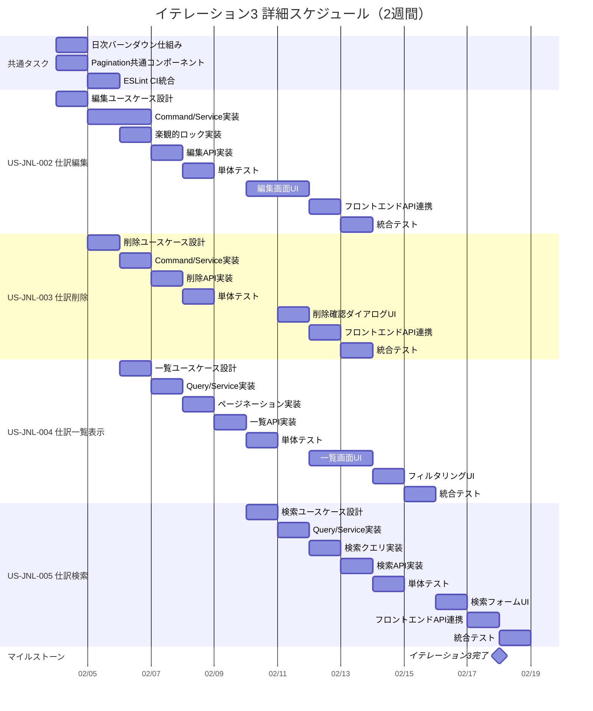

# イテレーション計画 3 - 財務会計システム

## 基本情報

| 項目 | 内容 |
|------|------|
| イテレーション番号 | 3 |
| 期間 | 2026-02-04 〜 2026-02-18（2週間） |
| 作業日数 | 10日 |
| チーム人数 | 3名 |
| 総作業可能時間 | 150時間（3名 × 5時間/日 × 10日） |
| 前イテレーションベロシティ | 16SP |
| 累積平均ベロシティ | 17SP |

## イテレーションゴール

**仕訳管理の基本機能（編集・削除・一覧・検索）を完成させる**

経理担当者が入力した仕訳を編集・削除でき、仕訳の一覧表示と検索ができる状態を目指す。これにより、仕訳管理の CRUD 操作が完成し、リリース 1.0 MVP に向けた仕訳機能が実用レベルに達する。

## 選択したストーリー

| ストーリーID | ストーリー名 | SP | 優先度 |
|-------------|-------------|-----|--------|
| US-JNL-002 | 仕訳編集 | 5 | 必須 |
| US-JNL-003 | 仕訳削除 | 3 | 必須 |
| US-JNL-004 | 仕訳一覧表示 | 5 | 必須 |
| US-JNL-005 | 仕訳検索 | 5 | 必須 |
| **合計** | | **18** | |

**コミットメント**: 18SP（累積平均ベロシティ 17SP を基に、仕訳ドメインが確立済みのため効率的な実装を見込む）

---

## タスク分解

### US-JNL-002: 仕訳編集（5SP）

**受入条件**:

- [x] 「下書き」ステータスの仕訳のみ編集できる
- [x] 仕訳日付、摘要、明細行を編集できる
- [x] 貸借の合計金額が一致しないと保存できない
- [x] 編集成功時、確認メッセージが表示される
- [x] 楽観的ロックにより同時編集を防止する

| タスクID | タスク名 | 理想時間 | 担当 | 状態 |
|----------|---------|---------|------|------|
| JNL-002-01 | 仕訳編集ユースケース設計 | 2h | Codex | ✅ 完了 |
| JNL-002-02 | UpdateJournalEntryCommand 実装 | 2h | Codex | ✅ 完了 |
| JNL-002-03 | UpdateJournalEntryService 実装 | 4h | Codex | ✅ 完了 |
| JNL-002-04 | 楽観的ロック機構実装（version フィールド） | 3h | Codex | ✅ 完了 |
| JNL-002-05 | 仕訳編集 API 実装（PUT /api/journal-entries/{id}） | 3h | Codex | ✅ 完了 |
| JNL-002-06 | 単体テスト作成 | 4h | Codex | ✅ 完了 |
| JNL-002-07 | 仕訳編集画面 UI 実装 | 6h | Claude | ✅ 完了 |
| JNL-002-08 | フロントエンド API 連携 | 2h | Claude | ✅ 完了 |
| JNL-002-09 | 統合テスト（E2E テスト） | 2h | Claude | ✅ 完了 |
| | **小計** | **28h** | | |

#### 実装詳細

**バックエンド実装**:

- `UpdateJournalEntryCommand` / `UpdateJournalEntryResult` - Input Port
- `UpdateJournalEntryUseCase` - ユースケースインターフェース
- `UpdateJournalEntryService` - ユースケース実装（Vavr Either/IO モナド使用）
- `JournalEntry.update()` - ドメインメソッド追加
- `JournalEntryController` - PUT /api/journal-entries/{id}
- バージョン管理（楽観的ロック）の追加

**フロントエンド実装**:

- `EditJournalEntryPage.tsx` - 仕訳編集画面
- `updateJournalEntry.ts` - API クライアント
- `JournalEntryForm.tsx` - 編集モード対応

**テスト**:

- `UpdateJournalEntryServiceTest` - ユースケースユニットテスト
- `JournalEntryControllerTest` - コントローラーユニットテスト更新
- `EditJournalEntryPage.test.tsx` - フロントエンドユニットテスト

---

### US-JNL-003: 仕訳削除（3SP）

**受入条件**:

- [ ] 「下書き」ステータスの仕訳のみ削除できる
- [ ] 削除前に確認ダイアログが表示される
- [ ] 削除成功時、確認メッセージが表示される
- [ ] 削除後、一覧画面に戻る

| タスクID | タスク名 | 理想時間 | 担当 | 状態 |
|----------|---------|---------|------|------|
| JNL-003-01 | 仕訳削除ユースケース設計 | 1h | - | 未着手 |
| JNL-003-02 | DeleteJournalEntryCommand 実装 | 1h | - | 未着手 |
| JNL-003-03 | DeleteJournalEntryService 実装 | 3h | - | 未着手 |
| JNL-003-04 | 仕訳削除 API 実装（DELETE /api/journal-entries/{id}） | 2h | - | 未着手 |
| JNL-003-05 | 単体テスト作成 | 3h | - | 未着手 |
| JNL-003-06 | 削除確認ダイアログ UI 実装 | 2h | - | 未着手 |
| JNL-003-07 | フロントエンド API 連携 | 2h | - | 未着手 |
| JNL-003-08 | 統合テスト | 2h | - | 未着手 |
| | **小計** | **16h** | | |

#### 実装詳細

**バックエンド実装**:

- `DeleteJournalEntryCommand` / `DeleteJournalEntryResult` - Input Port
- `DeleteJournalEntryUseCase` - ユースケースインターフェース
- `DeleteJournalEntryService` - ユースケース実装
- `JournalEntryController` - DELETE /api/journal-entries/{id}
- ステータスチェック（DRAFT のみ削除可）

**フロントエンド実装**:

- `deleteJournalEntry.ts` - API クライアント
- `JournalEntryList.tsx` - 削除ボタンと確認ダイアログ追加
- `JournalEntryListPage.tsx` - 削除後のリスト再読み込み対応

**テスト**:

- `DeleteJournalEntryServiceTest` - ユースケースユニットテスト
- `JournalEntryControllerTest` - コントローラーユニットテスト更新
- `JournalEntryList.test.tsx` - フロントエンドユニットテスト更新

---

### US-JNL-004: 仕訳一覧表示（5SP）

**受入条件**:

- [ ] 仕訳番号、仕訳日付、摘要、金額、ステータスが一覧表示される
- [ ] ステータスでフィルタリングできる
- [ ] 日付範囲で絞り込みできる
- [ ] 一覧から詳細画面に遷移できる
- [ ] ページネーションに対応する

| タスクID | タスク名 | 理想時間 | 担当 | 状態 |
|----------|---------|---------|------|------|
| JNL-004-01 | 仕訳一覧取得ユースケース設計 | 2h | - | 未着手 |
| JNL-004-02 | GetJournalEntriesQuery 実装 | 2h | - | 未着手 |
| JNL-004-03 | GetJournalEntriesService 実装 | 3h | - | 未着手 |
| JNL-004-04 | ページネーション実装 | 3h | - | 未着手 |
| JNL-004-05 | 仕訳一覧 API 実装（GET /api/journal-entries） | 3h | - | 未着手 |
| JNL-004-06 | 単体テスト作成 | 3h | - | 未着手 |
| JNL-004-07 | 仕訳一覧画面 UI 実装 | 6h | - | 未着手 |
| JNL-004-08 | フィルタリング機能 UI 実装 | 3h | - | 未着手 |
| JNL-004-09 | フロントエンド API 連携 | 2h | - | 未着手 |
| JNL-004-10 | 統合テスト | 2h | - | 未着手 |
| | **小計** | **29h** | | |

#### 実装詳細

**バックエンド実装**:

- `GetJournalEntriesQuery` / `GetJournalEntriesResult` - Input Port
- `GetJournalEntriesUseCase` - ユースケースインターフェース
- `GetJournalEntriesService` - ユースケース実装
- `JournalEntryMapper.findAll()` - ページネーション対応クエリ
- `JournalEntryController` - GET /api/journal-entries（クエリパラメータ対応）
- `PagedResponse<T>` - ページネーションレスポンス DTO

**フロントエンド実装**:

- `JournalEntryListPage.tsx` - 仕訳一覧画面
- `JournalEntryList.tsx` - 仕訳一覧テーブルコンポーネント
- `JournalEntryFilter.tsx` - フィルタコンポーネント
- `getJournalEntries.ts` - API クライアント
- `Pagination.tsx` - ページネーションコンポーネント（共通）

**テスト**:

- `GetJournalEntriesServiceTest` - ユースケースユニットテスト
- `JournalEntryControllerTest` - コントローラーユニットテスト更新
- `JournalEntryListPage.test.tsx` - フロントエンドユニットテスト

---

### US-JNL-005: 仕訳検索（5SP）

**受入条件**:

- [ ] 仕訳日付、勘定科目、金額範囲、摘要で検索できる
- [ ] 複数条件を組み合わせて検索できる
- [ ] 検索結果が一覧表示される
- [ ] 検索条件をクリアできる

| タスクID | タスク名 | 理想時間 | 担当 | 状態 |
|----------|---------|---------|------|------|
| JNL-005-01 | 仕訳検索ユースケース設計 | 2h | - | 未着手 |
| JNL-005-02 | SearchJournalEntriesQuery 実装 | 2h | - | 未着手 |
| JNL-005-03 | SearchJournalEntriesService 実装 | 4h | - | 未着手 |
| JNL-005-04 | 仕訳検索クエリ実装（MyBatis） | 4h | - | 未着手 |
| JNL-005-05 | 仕訳検索 API 実装（GET /api/journal-entries/search） | 2h | - | 未着手 |
| JNL-005-06 | 単体テスト作成 | 3h | - | 未着手 |
| JNL-005-07 | 検索フォーム UI 実装 | 4h | - | 未着手 |
| JNL-005-08 | フロントエンド API 連携 | 2h | - | 未着手 |
| JNL-005-09 | 統合テスト | 2h | - | 未着手 |
| | **小計** | **25h** | | |

#### 実装詳細

**バックエンド実装**:

- `SearchJournalEntriesQuery` / `SearchJournalEntriesResult` - Input Port
- `SearchJournalEntriesUseCase` - ユースケースインターフェース
- `SearchJournalEntriesService` - ユースケース実装
- `JournalEntryMapper.search()` - 動的検索クエリ（日付範囲、科目、金額範囲、摘要）
- `JournalEntryController` - GET /api/journal-entries/search

**フロントエンド実装**:

- `JournalEntrySearchForm.tsx` - 検索フォームコンポーネント
- `searchJournalEntries.ts` - API クライアント
- `JournalEntryListPage.tsx` - 検索機能統合

**テスト**:

- `SearchJournalEntriesServiceTest` - ユースケースユニットテスト
- `JournalEntrySearchTest` - 検索クエリ統合テスト
- `JournalEntrySearchForm.test.tsx` - フロントエンドユニットテスト

---

## 作業時間サマリー

| カテゴリ | 理想時間 |
|---------|---------|
| US-JNL-002: 仕訳編集 | 28h |
| US-JNL-003: 仕訳削除 | 16h |
| US-JNL-004: 仕訳一覧表示 | 29h |
| US-JNL-005: 仕訳検索 | 25h |
| 共通タスク・バッファ | 22h |
| **合計** | **120h** |

**キャパシティ**: 150h（3名 × 5h × 10日）
**バッファ**: 30h（20%）

---

## 共通タスク

| タスクID | タスク名 | 理想時間 | 担当 | 状態 |
|----------|---------|---------|------|------|
| COMMON-11 | 日次バーンダウン収集仕組み構築 | 4h | - | 未着手 |
| COMMON-12 | ESLint 複雑度チェック CI 統合 | 2h | - | 未着手 |
| COMMON-13 | React Router v7 Future Flags 有効化 | 2h | - | 未着手 |
| COMMON-14 | Pagination 共通コンポーネント作成 | 4h | - | 未着手 |
| | **小計** | **12h** | | |

---

## 詳細スケジュール

---

## 週次計画

### Week 1（2026-02-04 〜 2026-02-08）

| 日 | 主要タスク |
|----|-----------|
| 火 | 仕訳編集ユースケース設計、Pagination 共通コンポーネント、日次バーンダウン仕組み |
| 水 | 仕訳編集 Command/Service 実装、仕訳削除ユースケース設計、ESLint CI 統合 |
| 木 | 楽観的ロック実装、仕訳削除 Service 実装、仕訳一覧ユースケース設計 |
| 金 | 仕訳編集 API 実装、仕訳削除 API 実装、仕訳一覧 Query/Service 実装 |
| 土 | - |

### Week 2（2026-02-10 〜 2026-02-18）

| 日 | 主要タスク |
|----|-----------|
| 月 | 仕訳編集画面 UI 開始、仕訳検索ユースケース設計、ページネーション実装 |
| 火 | 仕訳編集画面 UI 継続、仕訳削除確認ダイアログ UI、仕訳検索 Service 実装 |
| 水 | 仕訳一覧画面 UI 開始、仕訳検索クエリ実装 |
| 木 | 仕訳一覧画面 UI 継続、フィルタリング UI、仕訳検索 API 実装 |
| 金 | フロントエンド API 連携、単体テスト |
| 土 | - |
| 日 | - |
| 月 | 仕訳検索フォーム UI、統合テスト、デモ準備、レビュー |

---

## リスクと対策

| リスク | 影響度 | 発生確率 | 対策 |
|-------|-------|---------|------|
| 楽観的ロック実装の複雑化 | 高 | 中 | バージョンフィールドによるシンプルな実装を採用 |
| 検索クエリのパフォーマンス | 中 | 中 | インデックス設計を事前に検討、必要に応じてクエリ最適化 |
| ページネーション実装の工数超過 | 中 | 低 | 共通コンポーネント化で再利用性確保 |
| 4 ストーリー並行開発の複雑さ | 中 | 中 | 依存関係を考慮した順序付け、一覧画面を先に完成 |

---

## 前イテレーションからの改善アクション

| # | アクション | 状態 | 備考 |
|---|-----------|------|------|
| 1 | 日次バーンダウンの自動収集仕組み構築 | 今イテレーションで対応 | COMMON-11 |
| 2 | ESLint 複雑度チェックの CI 統合 | 今イテレーションで対応 | COMMON-12 |
| 3 | React Router v7 Future Flags の有効化 | 今イテレーションで対応 | COMMON-13 |
| 4 | より小さなコミット単位の徹底 | 継続 | プロセス改善 |
| 5 | バックエンドのインポート整理 | イテレーション4へ延期 | 優先度低 |

---

## コミットメント確認

### チーム合意事項

- [ ] 全ストーリーの受入条件を理解した
- [ ] タスク分解と見積もりに合意した
- [ ] 18SP を2週間で完了することにコミットする
- [ ] デイリースタンドアップを毎日実施する
- [ ] 問題発生時は即座に共有する
- [ ] 日次バーンダウンを記録する

### 完了の定義（Definition of Done）

- [ ] すべての受入条件を満たしている
- [ ] 単体テストが作成され、すべてパスしている
- [ ] 統合テストが作成され、すべてパスしている
- [ ] コードレビューが完了している
- [ ] CI/CD パイプラインでビルドが成功している
- [ ] ドキュメントが更新されている
- [ ] テストカバレッジ 80% 以上を維持している

---

## 進捗状況

### ストーリー進捗

| ストーリーID | ストーリー名 | SP | 状態 | 完了日 |
|-------------|-------------|-----|------|--------|
| US-JNL-002 | 仕訳編集 | 5 | ✅ 完了 | 2026-01-27 |
| US-JNL-003 | 仕訳削除 | 3 | 未着手 | - |
| US-JNL-004 | 仕訳一覧表示 | 5 | 未着手 | - |
| US-JNL-005 | 仕訳検索 | 5 | 未着手 | - |

### 日次残理想時間

| 日 | 計画残時間 | 実績残時間 | 差異 |
|----|-----------|-----------|------|
| Day 1 | 120h | - | - |
| Day 2 | 108h | - | - |
| Day 3 | 96h | - | - |
| Day 4 | 84h | - | - |
| Day 5 | 72h | - | - |
| Day 6 | 60h | - | - |
| Day 7 | 48h | - | - |
| Day 8 | 36h | - | - |
| Day 9 | 24h | - | - |
| Day 10 | 0h | - | - |

---

## 技術検証タスク（スパイク）

### 楽観的ロック実装検証

**目的**: 仕訳編集時の同時編集防止機構の最適な実装方法を確認

**検証項目**:

1. JPA/MyBatis での @Version アノテーション活用
2. バージョン不一致時のエラーハンドリング
3. フロントエンドでのコンフリクト検出と再読み込み処理

**成果物**: 楽観的ロック実装方針ドキュメント

### ページネーション設計検証

**目的**: 仕訳一覧のページネーションの効率的な実装方法を確認

**検証項目**:

1. オフセット方式 vs カーソル方式
2. 総件数取得のパフォーマンス
3. フロントエンドのページネーション UI パターン

**成果物**: ページネーション実装方針ドキュメント

---

## 更新履歴

| 日付 | 更新内容 | 更新者 |
|------|---------|--------|
| 2026-01-26 | 初版作成 | Claude Opus 4.5 |
| 2026-01-27 | US-JNL-002 仕訳編集完了を反映（バックエンド・フロントエンド・E2E テスト） | Claude Opus 4.5 |

---

## 関連ドキュメント

- [イテレーション 2 計画](./iteration_plan-2.md)
- [イテレーション 2 ふりかえり](./retrospective-2.md)
- [リリース計画](./release_plan.md)
- [ユーザーストーリー](../requirements/user_story.md)
