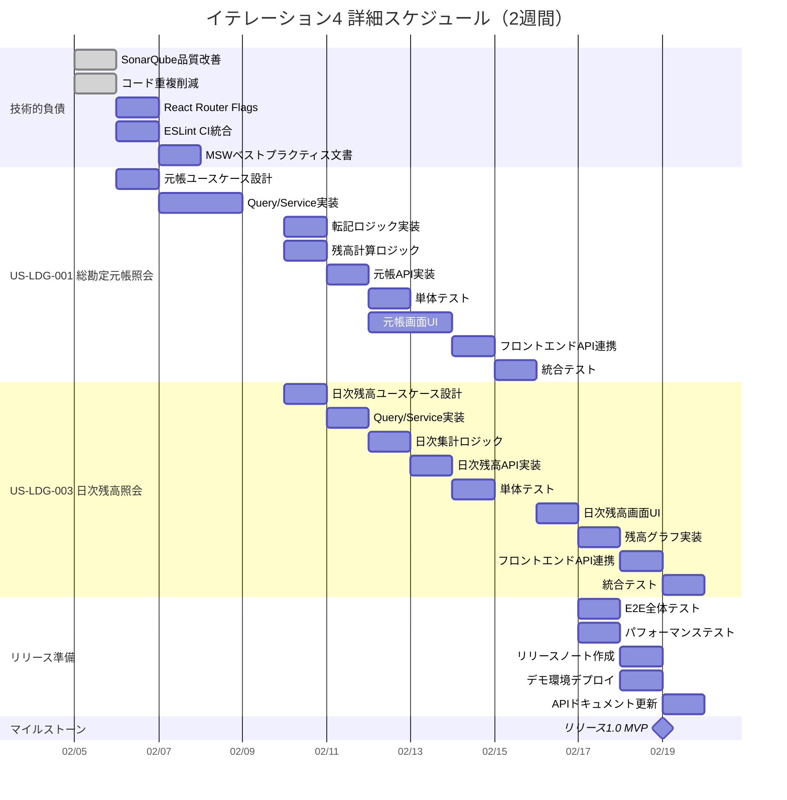

# イテレーション計画 4 - 財務会計システム

## 基本情報

| 項目 | 内容 |
|------|------|
| イテレーション番号 | 4 |
| 期間 | 2026-02-05 〜 2026-02-19（2週間） |
| 作業日数 | 10日 |
| チーム人数 | 3名 |
| 総作業可能時間 | 150時間（3名 × 5時間/日 × 10日） |
| 前イテレーションベロシティ | 18SP |
| 累積平均ベロシティ | 17.3SP |

## イテレーションゴール

**元帳照会機能を完成させ、リリース 1.0 MVP を達成する**

仕訳から元帳への転記ロジックを実装し、総勘定元帳照会と日次残高照会を完成させる。これにより、仕訳入力→元帳照会の一連の業務フローが完成し、リリース 1.0 MVP の達成要件を満たす。

## 選択したストーリー

| ストーリーID | ストーリー名 | SP | 優先度 |
|-------------|-------------|-----|--------|
| US-LDG-001 | 総勘定元帳照会 | 5 | 必須 |
| US-LDG-003 | 日次残高照会 | 5 | 必須 |
| **合計** | | **10** | |

**コミットメント**: 10SP（累積平均ベロシティ 17.3SP に対して余裕を持った計画。技術的負債の解消と統合テストに時間を確保）

---

## タスク分解

### US-LDG-001: 総勘定元帳照会（5SP）

**受入条件**:

- [ ] 勘定科目を選択して元帳を表示できる
- [ ] 日付、仕訳番号、摘要、借方金額、貸方金額、残高が表示される
- [ ] 期間を指定して絞り込みできる
- [ ] 仕訳の詳細画面に遷移できる

| タスクID | タスク名 | 理想時間 | 担当 | 状態 |
|----------|---------|---------|------|------|
| LDG-001-01 | 元帳照会ユースケース設計 | 2h | - | 未着手 |
| LDG-001-02 | GetGeneralLedgerQuery 実装 | 2h | - | 未着手 |
| LDG-001-03 | GetGeneralLedgerService 実装 | 4h | - | 未着手 |
| LDG-001-04 | 仕訳→元帳転記ロジック実装 | 4h | - | 未着手 |
| LDG-001-05 | 残高計算ロジック実装 | 3h | - | 未着手 |
| LDG-001-06 | 元帳照会 API 実装（GET /api/ledger/general） | 3h | - | 未着手 |
| LDG-001-07 | 単体テスト作成 | 4h | - | 未着手 |
| LDG-001-08 | 元帳照会画面 UI 実装 | 6h | - | 未着手 |
| LDG-001-09 | フロントエンド API 連携 | 2h | - | 未着手 |
| LDG-001-10 | 統合テスト（E2E テスト） | 2h | - | 未着手 |
| | **小計** | **32h** | | |

#### 実装詳細

**バックエンド実装**:

- `GetGeneralLedgerQuery` / `GetGeneralLedgerResult` - Input Port
- `GetGeneralLedgerUseCase` - ユースケースインターフェース
- `GetGeneralLedgerService` - ユースケース実装（Vavr Either/IO モナド使用）
- `LedgerEntry` - 元帳エントリドメインモデル
- `LedgerMapper.findByAccountId()` - 勘定科目別元帳取得クエリ
- `LedgerController` - GET /api/ledger/general?accountId={id}&from={date}&to={date}

**転記ロジック**:

- 確定済み仕訳（status=POSTED）の明細行を元帳エントリに変換
- 各勘定科目ごとに借方/貸方金額を集計
- 残高は前エントリの残高 ± 借方/貸方金額で算出

**フロントエンド実装**:

- `GeneralLedgerPage.tsx` - 総勘定元帳照会画面
- `LedgerTable.tsx` - 元帳テーブルコンポーネント
- `getGeneralLedger.ts` - API クライアント
- `AccountSelector.tsx` - 勘定科目選択コンポーネント

**テスト**:

- `GetGeneralLedgerServiceTest` - ユースケースユニットテスト
- `LedgerControllerTest` - コントローラーユニットテスト
- `GeneralLedgerPage.test.tsx` - フロントエンドユニットテスト

---

### US-LDG-003: 日次残高照会（5SP）

**受入条件**:

- [ ] 勘定科目を選択して日次残高を表示できる
- [ ] 日付、借方合計、貸方合計、残高が表示される
- [ ] 期間を指定して絞り込みできる
- [ ] 残高の推移をグラフで表示できる

| タスクID | タスク名 | 理想時間 | 担当 | 状態 |
|----------|---------|---------|------|------|
| LDG-003-01 | 日次残高照会ユースケース設計 | 2h | - | 未着手 |
| LDG-003-02 | GetDailyBalanceQuery 実装 | 2h | - | 未着手 |
| LDG-003-03 | GetDailyBalanceService 実装 | 4h | - | 未着手 |
| LDG-003-04 | 日次集計ロジック実装 | 4h | - | 未着手 |
| LDG-003-05 | 日次残高照会 API 実装（GET /api/ledger/daily-balance） | 3h | - | 未着手 |
| LDG-003-06 | 単体テスト作成 | 3h | - | 未着手 |
| LDG-003-07 | 日次残高照会画面 UI 実装 | 4h | - | 未着手 |
| LDG-003-08 | 残高推移グラフ実装 | 4h | - | 未着手 |
| LDG-003-09 | フロントエンド API 連携 | 2h | - | 未着手 |
| LDG-003-10 | 統合テスト（E2E テスト） | 2h | - | 未着手 |
| | **小計** | **30h** | | |

#### 実装詳細

**バックエンド実装**:

- `GetDailyBalanceQuery` / `GetDailyBalanceResult` - Input Port
- `GetDailyBalanceUseCase` - ユースケースインターフェース
- `GetDailyBalanceService` - ユースケース実装
- `DailyBalance` - 日次残高ドメインモデル
- `LedgerMapper.findDailyBalance()` - 日次集計クエリ
- `LedgerController` - GET /api/ledger/daily-balance?accountId={id}&from={date}&to={date}

**日次集計ロジック**:

- 日付ごとに借方合計・貸方合計を集計
- 累計残高を算出（期首残高 + 当日までの累積）
- 日付欠損の補完（取引がない日は前日残高を引き継ぎ）

**フロントエンド実装**:

- `DailyBalancePage.tsx` - 日次残高照会画面
- `DailyBalanceTable.tsx` - 日次残高テーブルコンポーネント
- `BalanceChart.tsx` - 残高推移グラフコンポーネント（Chart.js または Recharts）
- `getDailyBalance.ts` - API クライアント

**テスト**:

- `GetDailyBalanceServiceTest` - ユースケースユニットテスト
- `LedgerControllerTest` - コントローラーユニットテスト更新
- `DailyBalancePage.test.tsx` - フロントエンドユニットテスト

---

## 作業時間サマリー

| カテゴリ | 理想時間 |
|---------|---------|
| US-LDG-001: 総勘定元帳照会 | 32h |
| US-LDG-003: 日次残高照会 | 30h |
| 共通タスク（技術的負債解消） | 28h |
| 統合テスト・リリース準備 | 20h |
| **合計** | **110h** |

**キャパシティ**: 150h（3名 × 5h × 10日）
**バッファ**: 40h（27%）

---

## 共通タスク（技術的負債解消）

| タスクID | タスク名 | 理想時間 | 担当 | 状態 |
|----------|---------|---------|------|------|
| COMMON-11 | 日次バーンダウン収集仕組み構築 | 4h | - | 未着手 |
| COMMON-12 | ESLint 複雑度チェック CI 統合 | 2h | - | 未着手 |
| COMMON-13 | React Router v7 Future Flags 有効化 | 2h | - | 未着手 |
| COMMON-14 | バックエンドのインポート整理 | 4h | - | 未着手 |
| COMMON-15 | MSW + Cypress ベストプラクティス文書化 | 4h | - | 未着手 |
| COMMON-16 | SonarQube コード品質改善 | 8h | - | ✅ 完了 |
| COMMON-17 | フロントエンドコード重複削減 | 4h | - | ✅ 完了 |
| | **小計** | **28h** | | |

---

## 統合テスト・リリース準備

| タスクID | タスク名 | 理想時間 | 担当 | 状態 |
|----------|---------|---------|------|------|
| RELEASE-01 | E2E テスト全体実行・確認 | 4h | - | 未着手 |
| RELEASE-02 | パフォーマンステスト（元帳照会） | 4h | - | 未着手 |
| RELEASE-03 | リリースノート作成 | 2h | - | 未着手 |
| RELEASE-04 | デモ環境デプロイ・確認 | 4h | - | 未着手 |
| RELEASE-05 | API ドキュメント更新（Swagger） | 3h | - | 未着手 |
| RELEASE-06 | ユーザーマニュアル作成 | 3h | - | 未着手 |
| | **小計** | **20h** | | |

---

## 詳細スケジュール

---

## 週次計画

### Week 1（2026-02-05 〜 2026-02-08）

| 日 | 主要タスク | 状態 |
|----|-----------|------|
| 水(2/5) | SonarQube 品質改善、コード重複削減、アクセシビリティ改善 | ✅ 完了 |
| 木 | React Router Flags、ESLint CI 統合、元帳ユースケース設計 | 予定 |
| 金 | MSW ベストプラクティス文書、元帳 Query/Service 実装開始 | 予定 |
| 土 | - | - |

### Week 2（2026-02-10 〜 2026-02-19）

| 日 | 主要タスク |
|----|-----------|
| 月 | 転記ロジック・残高計算実装、日次残高ユースケース設計 |
| 火 | 元帳 API 実装、日次残高 Query/Service 実装 |
| 水 | 元帳単体テスト、日次集計ロジック実装 |
| 木 | 元帳画面 UI 開始、日次残高 API 実装 |
| 金 | 元帳画面 UI 継続、日次残高単体テスト |
| 土 | - |
| 日 | - |
| 月 | 日次残高画面 UI、残高グラフ実装 |
| 火 | フロントエンド API 連携、E2E 全体テスト |
| 水 | リリースノート、デモ環境デプロイ、リリース 1.0 MVP 完了 |

---

## リスクと対策

| リスク | 影響度 | 発生確率 | 対策 |
|-------|-------|---------|------|
| 転記ロジックの複雑化 | 高 | 中 | 確定済み仕訳のみ対象とするシンプルな設計を採用 |
| 残高計算のパフォーマンス | 中 | 中 | 初期は逐次計算、必要に応じて残高テーブル導入 |
| グラフライブラリの選定 | 低 | 低 | Recharts を第一候補とし、シンプルな線グラフで開始 |
| リリース準備の工数不足 | 中 | 低 | 10SP + 40h バッファで余裕を持った計画 |

---

## 前イテレーションからの改善アクション

| # | アクション | 状態 | 備考 |
|---|-----------|------|------|
| 1 | 共通タスクの優先度を上げて計画に組み込む | ✅ 実施中 | COMMON-16, 17 完了、他は計画済み |
| 2 | CI テスト戦略の見直し（MSW + Cypress ベストプラクティス文書化） | ⏳ 計画中 | COMMON-15 |
| 3 | MSW ハンドラーのテスト追加 | ⏳ 計画中 | 元帳機能と合わせて実施 |
| 4 | E2E テストで cy.intercept を使わない方針の徹底 | ✅ 継続 | 新規 E2E は DOM 待機で統一 |
| 5 | React Router v7 Future Flags の有効化 | ⏳ 計画中 | COMMON-13 |

---

## コミットメント確認

### チーム合意事項

- [ ] 全ストーリーの受入条件を理解した
- [ ] タスク分解と見積もりに合意した
- [ ] 10SP を2週間で完了することにコミットする
- [ ] デイリースタンドアップを毎日実施する
- [ ] 問題発生時は即座に共有する
- [ ] 日次バーンダウンを記録する

### 完了の定義（Definition of Done）

- [ ] すべての受入条件を満たしている
- [ ] 単体テストが作成され、すべてパスしている
- [ ] 統合テストが作成され、すべてパスしている
- [ ] コードレビューが完了している
- [ ] CI/CD パイプラインでビルドが成功している
- [ ] ドキュメントが更新されている
- [ ] テストカバレッジ 80% 以上を維持している
- [ ] リリースノートが作成されている

---

## 進捗状況

### ストーリー進捗

| ストーリーID | ストーリー名 | SP | 状態 | 完了日 |
|-------------|-------------|-----|------|--------|
| US-LDG-001 | 総勘定元帳照会 | 5 | 未着手 | - |
| US-LDG-003 | 日次残高照会 | 5 | 未着手 | - |

### 日次残理想時間

| 日 | 計画残時間 | 実績残時間 | 差異 |
|----|-----------|-----------|------|
| Day 1 (2/5) | 110h | 98h | -12h |
| Day 2 | 99h | - | - |
| Day 3 | 88h | - | - |
| Day 4 | 77h | - | - |
| Day 5 | 66h | - | - |
| Day 6 | 55h | - | - |
| Day 7 | 44h | - | - |
| Day 8 | 33h | - | - |
| Day 9 | 22h | - | - |
| Day 10 | 0h | - | - |

**Day 1 実績**: COMMON-16（SonarQube コード品質改善）と COMMON-17（フロントエンドコード重複削減）を完了。計 12h 相当の作業を実施。

---

## 技術検証タスク（スパイク）

### 元帳転記ロジック設計検証

**目的**: 仕訳から元帳への転記ロジックの最適な実装方法を確認

**検証項目**:

1. 確定済み仕訳のみを対象とする転記フィルタ
2. 勘定科目ごとの借方/貸方金額集計
3. 累計残高の算出方法（期首残高考慮）
4. パフォーマンス（大量仕訳時の応答時間）

**成果物**: 元帳転記ロジック設計ドキュメント

### グラフライブラリ選定検証

**目的**: 残高推移グラフに最適なライブラリを選定

**検証項目**:

1. Recharts vs Chart.js vs Nivo
2. 線グラフの描画パフォーマンス
3. レスポンシブ対応
4. TypeScript サポート

**成果物**: グラフライブラリ選定 ADR

---

## リリース 1.0 MVP 達成要件

### 機能要件

- [x] ユーザー認証（ログイン/ログアウト/ユーザー登録）
- [x] 勘定科目マスタ管理（登録/編集/削除/検索）
- [x] 仕訳入力機能
- [x] 仕訳編集・削除機能
- [x] 仕訳一覧表示・検索機能
- [ ] 総勘定元帳照会機能
- [ ] 日次残高照会機能

### 非機能要件

- [x] テストカバレッジ 80% 以上
- [x] E2E テスト全件パス
- [x] CI/CD パイプライン正常稼働
- [ ] API ドキュメント整備
- [ ] デモ環境デプロイ完了

---

## 更新履歴

| 日付 | 更新内容 | 更新者 |
|------|---------|--------|
| 2026-02-05 | 初版作成 | Claude Opus 4.5 |
| 2026-02-05 | COMMON-16, 17（SonarQube 品質改善、コード重複削減）完了を反映 | Claude Opus 4.5 |
| 2026-02-05 | Day 1 進捗更新（12h 消化、残 98h）| Claude Opus 4.5 |

---

## 関連ドキュメント

- [イテレーション 3 計画](./iteration_plan-3.md)
- [イテレーション 3 ふりかえり](./retrospective-3.md)
- [リリース計画](./release_plan.md)
- [ユーザーストーリー](../requirements/user_story.md)
