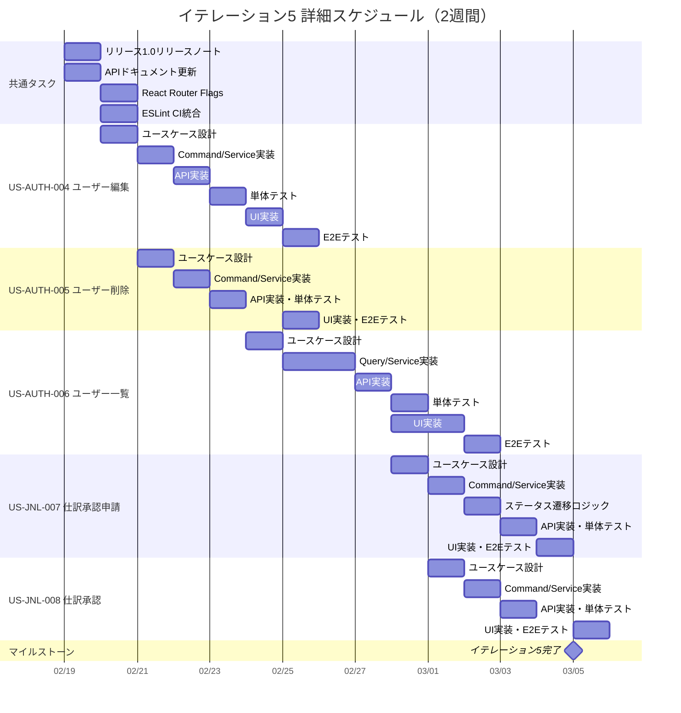

# イテレーション計画 5 - 財務会計システム

## 基本情報

| 項目 | 内容 |
|------|------|
| イテレーション番号 | 5 |
| 期間 | 2026-02-19 〜 2026-03-05（2週間） |
| 作業日数 | 10日 |
| チーム人数 | 3名 |
| 総作業可能時間 | 150時間（3名 × 5時間/日 × 10日） |
| 前イテレーションベロシティ | 10SP |
| 累積平均ベロシティ | 15.5SP |

## イテレーションゴール

**ユーザー管理機能を完成させ、仕訳承認ワークフローの基盤を構築する**

リリース 2.0 機能拡張版の最初のイテレーションとして、ユーザー管理（編集・削除・一覧）を完成させ、仕訳承認申請・承認機能を実装する。これにより、マルチユーザー環境での仕訳ワークフローが可能になる。

## 選択したストーリー

| ストーリーID | ストーリー名 | SP | 優先度 |
|-------------|-------------|-----|--------|
| US-AUTH-004 | ユーザー編集 | 3 | 必須 |
| US-AUTH-005 | ユーザー削除 | 3 | 必須 |
| US-AUTH-006 | ユーザー一覧表示 | 5 | 必須 |
| US-JNL-007 | 仕訳承認申請 | 3 | 必須 |
| US-JNL-008 | 仕訳承認 | 3 | 必須 |
| **合計** | | **17** | |

**コミットメント**: 17SP（累積平均ベロシティ 15.5SP に対して若干挑戦的だが、イテレーション 1-3 の実績（18SP/16SP/18SP）から達成可能と判断）

---

## タスク分解

### US-AUTH-004: ユーザー編集（3SP）

**受入条件**:

- [x] 氏名、パスワード、ロールを編集できる
- [x] ユーザーIDは変更できない
- [x] 編集成功時、確認メッセージが表示される

| タスクID | タスク名 | 理想時間 | 担当 | 状態 |
|----------|---------|---------|------|------|
| AUTH-004-01 | ユーザー編集ユースケース設計 | 1h | Claude | 完了 |
| AUTH-004-02 | UpdateUserCommand 実装 | 2h | Codex | 完了 |
| AUTH-004-03 | UpdateUserService 実装 | 3h | Codex | 完了 |
| AUTH-004-04 | ユーザー編集 API 実装（PUT /api/users/{id}） | 2h | Codex | 完了 |
| AUTH-004-05 | 単体テスト作成 | 2h | Codex | 完了 |
| AUTH-004-06 | ユーザー編集画面 UI 実装 | 4h | Codex | 完了 |
| AUTH-004-07 | フロントエンド API 連携 | 2h | Codex | 完了 |
| AUTH-004-08 | 統合テスト（E2E テスト） | 2h | Codex | 完了 |
| | **小計** | **18h** | | |

#### 実装詳細

**バックエンド実装**:

- `UpdateUserCommand` / `UpdateUserResult` - Input Port
- `UpdateUserUseCase` - ユースケースインターフェース
- `UpdateUserService` - ユースケース実装
- `UserController` - PUT /api/users/{id}

**フロントエンド実装**:

- `UserEditPage.tsx` - ユーザー編集画面
- `UserEditForm.tsx` - ユーザー編集フォームコンポーネント
- `updateUser.ts` - API クライアント

---

### US-AUTH-005: ユーザー削除（3SP）

**受入条件**:

- [x] 削除前に確認ダイアログが表示される
- [x] 削除後、ユーザー一覧から該当ユーザーが消える
- [x] 削除されたユーザーはログインできなくなる
- [x] 関連する監査ログは保持される（論理削除で保証）

| タスクID | タスク名 | 理想時間 | 担当 | 状態 |
|----------|---------|---------|------|------|
| AUTH-005-01 | ユーザー削除ユースケース設計 | 1h | Claude | 完了 |
| AUTH-005-02 | DeleteUserCommand 実装 | 2h | Claude | 完了 |
| AUTH-005-03 | DeleteUserService 実装 | 3h | Claude | 完了 |
| AUTH-005-04 | ユーザー削除 API 実装（DELETE /api/users/{id}） | 2h | Claude | 完了 |
| AUTH-005-05 | 単体テスト作成 | 2h | Claude | 完了 |
| AUTH-005-06 | ユーザー削除確認ダイアログ UI 実装 | 2h | Claude | 完了 |
| AUTH-005-07 | フロントエンド API 連携 | 2h | Claude | 完了 |
| AUTH-005-08 | 統合テスト（E2E テスト） | 2h | Claude | 完了 |
| | **小計** | **16h** | | |

#### 実装詳細

**バックエンド実装**:

- `DeleteUserCommand` / `DeleteUserResult` - Input Port
- `DeleteUserUseCase` - ユースケースインターフェース
- `DeleteUserService` - ユースケース実装（論理削除対応）
- `UserController` - DELETE /api/users/{id}

**削除ポリシー**:

- 論理削除（deleted フラグ）を採用し、監査ログを保持
- 削除されたユーザーはログイン時に「アカウントが無効です」エラー

---

### US-AUTH-006: ユーザー一覧表示（5SP）

**受入条件**:

- [ ] ユーザーID、氏名、ロール、最終ログイン日時が一覧表示される
- [ ] ロールでフィルタリングできる
- [ ] ユーザーIDまたは氏名で検索できる
- [ ] 一覧から詳細画面に遷移できる

| タスクID | タスク名 | 理想時間 | 担当 | 状態 |
|----------|---------|---------|------|------|
| AUTH-006-01 | ユーザー一覧ユースケース設計 | 2h | - | 未着手 |
| AUTH-006-02 | GetUsersQuery 実装 | 2h | - | 未着手 |
| AUTH-006-03 | GetUsersService 実装 | 4h | - | 未着手 |
| AUTH-006-04 | ユーザー一覧 API 実装（GET /api/users） | 3h | - | 未着手 |
| AUTH-006-05 | フィルタリング・検索ロジック実装 | 3h | - | 未着手 |
| AUTH-006-06 | 単体テスト作成 | 3h | - | 未着手 |
| AUTH-006-07 | ユーザー一覧画面 UI 実装 | 6h | Codex | 完了 |
| AUTH-006-08 | フィルタ・検索 UI 実装 | 3h | - | 未着手 |
| AUTH-006-09 | フロントエンド API 連携 | 2h | Codex | 完了 |
| AUTH-006-10 | 統合テスト（E2E テスト） | 2h | - | 未着手 |
| | **小計** | **30h** | | |

#### 実装詳細

**バックエンド実装**:

- `GetUsersQuery` / `GetUsersResult` - Input Port
- `GetUsersUseCase` - ユースケースインターフェース
- `GetUsersService` - ユースケース実装
- `UserController` - GET /api/users?role={role}&search={keyword}

**フロントエンド実装**:

- `UserListPage.tsx` - ユーザー一覧画面
- `UserTable.tsx` - ユーザーテーブルコンポーネント
- `UserFilter.tsx` - フィルタ・検索コンポーネント
- `getUsers.ts` - API クライアント

---

### US-JNL-007: 仕訳承認申請（3SP）

**受入条件**:

- [ ] 「下書き」ステータスの仕訳のみ承認申請できる
- [ ] 承認申請後、ステータスが「承認待ち」に変わる
- [ ] 承認申請成功時、確認メッセージが表示される

| タスクID | タスク名 | 理想時間 | 担当 | 状態 |
|----------|---------|---------|------|------|
| JNL-007-01 | 仕訳承認申請ユースケース設計 | 2h | - | 未着手 |
| JNL-007-02 | SubmitForApprovalCommand 実装 | 2h | - | 未着手 |
| JNL-007-03 | SubmitForApprovalService 実装 | 3h | - | 未着手 |
| JNL-007-04 | 仕訳ステータス遷移ロジック実装 | 3h | - | 未着手 |
| JNL-007-05 | 承認申請 API 実装（POST /api/journal-entries/{id}/submit） | 2h | - | 未着手 |
| JNL-007-06 | 単体テスト作成 | 2h | - | 未着手 |
| JNL-007-07 | 承認申請ボタン UI 実装 | 2h | - | 未着手 |
| JNL-007-08 | フロントエンド API 連携 | 2h | - | 未着手 |
| JNL-007-09 | 統合テスト（E2E テスト） | 2h | - | 未着手 |
| | **小計** | **20h** | | |

#### 実装詳細

**バックエンド実装**:

- `SubmitForApprovalCommand` / `SubmitForApprovalResult` - Input Port
- `SubmitForApprovalUseCase` - ユースケースインターフェース
- `SubmitForApprovalService` - ユースケース実装
- `JournalEntryController` - POST /api/journal-entries/{id}/submit

**ステータス遷移**:

```
DRAFT（下書き） → PENDING_APPROVAL（承認待ち）
```

---

### US-JNL-008: 仕訳承認（3SP）

**受入条件**:

- [ ] 「承認待ち」ステータスの仕訳のみ承認できる
- [ ] 承認後、ステータスが「承認済み」に変わる
- [ ] 承認者と承認日時が記録される
- [ ] 承認成功時、確認メッセージが表示される

| タスクID | タスク名 | 理想時間 | 担当 | 状態 |
|----------|---------|---------|------|------|
| JNL-008-01 | 仕訳承認ユースケース設計 | 2h | - | 未着手 |
| JNL-008-02 | ApproveJournalEntryCommand 実装 | 2h | - | 未着手 |
| JNL-008-03 | ApproveJournalEntryService 実装 | 3h | - | 未着手 |
| JNL-008-04 | 承認者・承認日時記録ロジック実装 | 2h | - | 未着手 |
| JNL-008-05 | 承認 API 実装（POST /api/journal-entries/{id}/approve） | 2h | - | 未着手 |
| JNL-008-06 | 単体テスト作成 | 2h | - | 未着手 |
| JNL-008-07 | 承認画面 UI 実装 | 3h | - | 未着手 |
| JNL-008-08 | フロントエンド API 連携 | 2h | - | 未着手 |
| JNL-008-09 | 統合テスト（E2E テスト） | 2h | - | 未着手 |
| | **小計** | **20h** | | |

#### 実装詳細

**バックエンド実装**:

- `ApproveJournalEntryCommand` / `ApproveJournalEntryResult` - Input Port
- `ApproveJournalEntryUseCase` - ユースケースインターフェース
- `ApproveJournalEntryService` - ユースケース実装
- `JournalEntryController` - POST /api/journal-entries/{id}/approve

**ステータス遷移**:

```
PENDING_APPROVAL（承認待ち） → APPROVED（承認済み）
```

**データ記録**:

- `approved_by` - 承認者ユーザーID
- `approved_at` - 承認日時

---

## 作業時間サマリー

| カテゴリ | 理想時間 |
|---------|---------|
| US-AUTH-004: ユーザー編集 | 18h |
| US-AUTH-005: ユーザー削除 | 16h |
| US-AUTH-006: ユーザー一覧表示 | 30h |
| US-JNL-007: 仕訳承認申請 | 20h |
| US-JNL-008: 仕訳承認 | 20h |
| 共通タスク（技術的負債解消） | 20h |
| **合計** | **124h** |

**キャパシティ**: 150h（3名 × 5h × 10日）
**バッファ**: 26h（17%）

---

## 共通タスク（技術的負債解消・リリース準備）

| タスクID | タスク名 | 理想時間 | 担当 | 状態 |
|----------|---------|---------|------|------|
| COMMON-18 | リリース 1.0 MVP リリースノート作成 | 3h | - | 未着手 |
| COMMON-19 | API ドキュメント更新（Swagger） | 3h | - | 未着手 |
| COMMON-20 | React Router v7 Future Flags 有効化 | 2h | - | 未着手 |
| COMMON-21 | ESLint 複雑度チェック CI 統合 | 2h | - | 未着手 |
| COMMON-22 | ユーザー管理 E2E テストスイート構築 | 6h | - | 未着手 |
| COMMON-23 | 仕訳ステータス遷移図ドキュメント作成 | 4h | - | 未着手 |
| | **小計** | **20h** | | |

---

## 詳細スケジュール



---

## 週次計画

### Week 1（2026-02-19 〜 2026-02-22）

| 日 | 主要タスク | 状態 |
|----|-----------|------|
| 木(2/19) | リリースノート作成、API ドキュメント更新 | 予定 |
| 金(2/20) | React Router Flags、ESLint CI、ユーザー編集設計 | 予定 |
| 土 | - | - |
| 日 | - | - |

### Week 2（2026-02-24 〜 2026-03-05）

| 日 | 主要タスク |
|----|-----------|
| 月(2/24) | ユーザー編集 API/UI、ユーザー削除完成 |
| 火(2/25) | ユーザー一覧設計・実装開始 |
| 水(2/26) | ユーザー一覧 Query/Service 実装 |
| 木(2/27) | ユーザー一覧 API 実装、単体テスト |
| 金(2/28) | ユーザー一覧 UI 実装、仕訳承認申請設計 |
| 土 | - |
| 日 | - |
| 月(3/1) | 仕訳承認申請実装、仕訳承認設計 |
| 火(3/2) | 仕訳承認申請完成、仕訳承認実装 |
| 水(3/3) | 仕訳承認 API 実装、単体テスト |
| 木(3/4) | 仕訳承認 UI 実装、E2E テスト |
| 金(3/5) | 全体統合テスト、イテレーション完了 |

---

## リスクと対策

| リスク | 影響度 | 発生確率 | 対策 |
|-------|-------|---------|------|
| ユーザー論理削除と監査ログの整合性 | 中 | 中 | 削除フラグと監査ログのトランザクション整合性を確保 |
| 仕訳ステータス遷移の複雑化 | 中 | 低 | ステートマシンパターンを採用し明確に管理 |
| ユーザー権限とロール管理 | 中 | 中 | Spring Security の既存実装を拡張 |
| 承認者と申請者の同一チェック | 低 | 低 | ビジネスルールとして明示的にバリデーション |

---

## 前イテレーションからの改善アクション

| # | アクション | 状態 | 備考 |
|---|-----------|------|------|
| 1 | リリースノート作成を計画に組み込む | ✅ 計画済み | COMMON-18 |
| 2 | API ドキュメント更新 | ✅ 計画済み | COMMON-19 |
| 3 | React Router v7 Future Flags の有効化 | ✅ 計画済み | COMMON-20（イテレーション 4 から引き継ぎ） |
| 4 | ESLint 複雑度チェック CI 統合 | ✅ 計画済み | COMMON-21（イテレーション 4 から引き継ぎ） |

---

## コミットメント確認

### チーム合意事項

- [ ] 全ストーリーの受入条件を理解した
- [ ] タスク分解と見積もりに合意した
- [ ] 17SP を2週間で完了することにコミットする
- [ ] デイリースタンドアップを毎日実施する
- [ ] 問題発生時は即座に共有する
- [ ] 日次バーンダウンを記録する

### 完了の定義（Definition of Done）

- [ ] すべての受入条件を満たしている
- [ ] 単体テストが作成され、すべてパスしている
- [ ] 統合テストが作成され、すべてパスしている
- [ ] コードレビューが完了している
- [ ] CI/CD パイプラインでビルドが成功している
- [ ] ドキュメントが更新されている
- [ ] テストカバレッジ 80% 以上を維持している

---

## 進捗状況

### ストーリー進捗

| ストーリーID | ストーリー名 | SP | 状態 | 完了日 |
|-------------|-------------|-----|------|--------|
| US-AUTH-004 | ユーザー編集 | 3 | 完了 | 2026-02-07 |
| US-AUTH-005 | ユーザー削除 | 3 | 完了 | 2026-02-07 |
| US-AUTH-006 | ユーザー一覧表示 | 5 | 進行中 | - |
| US-JNL-007 | 仕訳承認申請 | 3 | 未着手 | - |
| US-JNL-008 | 仕訳承認 | 3 | 未着手 | - |

### 日次残理想時間

| 日 | 計画残時間 | 実績残時間 | 差異 |
|----|-----------|-----------|------|
| Day 1 (2/19) | 124h | - | - |
| Day 2 (2/20) | 111h | - | - |
| Day 3 (2/24) | 99h | - | - |
| Day 4 (2/25) | 86h | - | - |
| Day 5 (2/26) | 74h | - | - |
| Day 6 (2/27) | 62h | - | - |
| Day 7 (2/28) | 50h | - | - |
| Day 8 (3/3) | 37h | - | - |
| Day 9 (3/4) | 25h | - | - |
| Day 10 (3/5) | 0h | - | - |

---

## 技術検証タスク（スパイク）

### 仕訳ステータス遷移設計

**目的**: 仕訳の承認ワークフローにおけるステータス遷移を明確化

**検証項目**:

1. ステートマシンパターンの適用方法
2. 不正なステータス遷移の防止
3. 承認者・申請者の同一チェック
4. 差し戻し時のステータス復元

**成果物**: 仕訳ステータス遷移図（COMMON-23）

### ユーザー論理削除設計

**目的**: ユーザー削除時の監査ログ保持と整合性確保

**検証項目**:

1. 論理削除フラグ（deleted, deleted_at）の設計
2. 削除ユーザーの仕訳・承認履歴の扱い
3. ユーザー一覧での削除ユーザー非表示
4. 削除ユーザーのログイン拒否

**成果物**: ユーザー論理削除設計ドキュメント

---

## リリース 2.0 機能拡張版 達成要件（イテレーション 5-8）

### 機能要件

- [ ] ユーザー管理（編集・削除・一覧）
- [ ] 仕訳承認ワークフロー（申請・承認・差し戻し・確定）
- [ ] 月次残高照会
- [ ] 残高試算表表示
- [ ] 貸借対照表表示
- [ ] 損益計算書表示

### イテレーション 5 の位置づけ

イテレーション 5 は リリース 2.0 の基盤となるユーザー管理と仕訳承認の開始部分を担当。イテレーション 6 で承認フロー完成と残高管理、イテレーション 7-8 で財務諸表を実装予定。

---

## 更新履歴

| 日付 | 更新内容 | 更新者 |
|------|---------|--------|
| 2026-02-07 | 初版作成 | Claude Opus 4.5 |
| 2026-02-07 | US-AUTH-004 完了 | Claude Opus 4.5 |
| 2026-02-07 | US-AUTH-005 完了（ユーザー削除機能、E2E テスト含む） | Claude Opus 4.5 |

---

## 関連ドキュメント

- [イテレーション 4 計画](./iteration_plan-4.md)
- [イテレーション 4 ふりかえり](./retrospective-4.md)
- [リリース計画](./release_plan.md)
- [ユーザーストーリー](../requirements/user_story.md)
