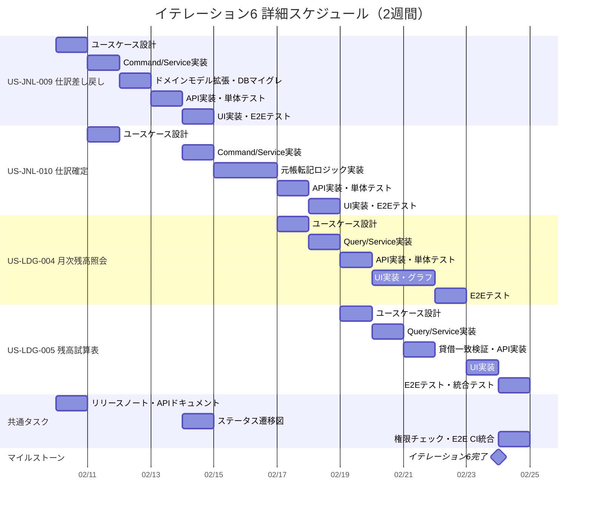
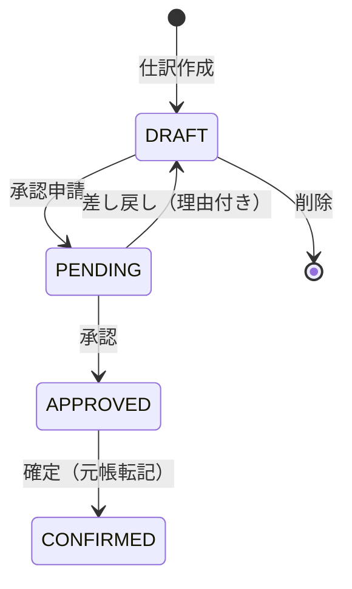

# イテレーション計画 6 - 財務会計システム

## 基本情報

| 項目 | 内容 |
|------|------|
| イテレーション番号 | 6 |
| 期間 | 2026-02-10 〜 2026-02-24（2週間） |
| 作業日数 | 10日 |
| チーム人数 | 3名 |
| 総作業可能時間 | 150時間（3名 × 5時間/日 × 10日） |
| 前イテレーションベロシティ | 17SP |
| 累積平均ベロシティ | 15.8SP |

## イテレーションゴール

**仕訳承認ワークフローを完成させ、月次残高・残高試算表の照会機能を構築する**

リリース 2.0 機能拡張版の 2 番目のイテレーションとして、仕訳差し戻し・確定機能を実装して承認ワークフローを完成させる。さらに月次残高照会と残高試算表表示を実装し、財務諸表作成の基盤を構築する。

## 選択したストーリー

| ストーリーID | ストーリー名 | SP | 優先度 |
|-------------|-------------|-----|--------|
| US-JNL-009 | 仕訳差し戻し | 3 | 必須 |
| US-JNL-010 | 仕訳確定 | 5 | 必須 |
| US-LDG-004 | 月次残高照会 | 5 | 必須 |
| US-LDG-005 | 残高試算表表示 | 6 | 必須 |
| **合計** | | **19** | |

**コミットメント**: 19SP（累積平均ベロシティ 15.8SP に対して挑戦的だが、イテレーション 1-3, 5 の実績（18SP/16SP/18SP/17SP）と既存パターンの再利用性から達成可能と判断）

---

## タスク分解

### US-JNL-009: 仕訳差し戻し（3SP）

**受入条件**:

- [x] 「承認待ち」ステータスの仕訳のみ差し戻しできる
- [x] 差し戻し理由を入力できる
- [x] 差し戻し後、ステータスが「下書き」に戻る
- [x] 差し戻し成功時、確認メッセージが表示される

| タスクID | タスク名 | 理想時間 | 担当 | 状態 |
|----------|---------|---------|------|------|
| JNL-009-01 | 仕訳差し戻しユースケース設計 | 2h | Claude | 完了 |
| JNL-009-02 | RejectJournalEntryCommand 実装 | 2h | Codex | 完了 |
| JNL-009-03 | RejectJournalEntryService 実装 | 3h | Codex | 完了 |
| JNL-009-04 | ドメインモデル拡張（reject メソッド、rejection_reason フィールド） | 3h | Codex | 完了 |
| JNL-009-05 | DB マイグレーション（V13: rejection フィールド追加） | 2h | Codex | 完了 |
| JNL-009-06 | 差し戻し API 実装（POST /api/journal-entries/{id}/reject） | 2h | Codex | 完了 |
| JNL-009-07 | 単体テスト作成 | 2h | Codex | 完了 |
| JNL-009-08 | 差し戻しボタン・理由入力ダイアログ UI 実装 | 3h | Codex | 完了 |
| JNL-009-09 | フロントエンド API 連携 | 2h | Codex | 完了 |
| JNL-009-10 | 統合テスト（E2E テスト） | 2h | Claude | 完了 |
| | **小計** | **23h** | | |

#### 実装詳細

**バックエンド実装**:

- `RejectJournalEntryCommand` / `RejectJournalEntryResult` - Input Port
- `RejectJournalEntryUseCase` - ユースケースインターフェース
- `RejectJournalEntryService` - ユースケース実装
- `JournalEntryController` - POST /api/journal-entries/{id}/reject

**ドメインモデル変更**:

- `JournalEntry.reject(rejectionReason)` メソッド追加
- `rejectedBy`, `rejectedAt`, `rejectionReason` フィールド追加

**ステータス遷移**:

```
PENDING（承認待ち） → DRAFT（下書き）[差し戻し理由付き]
```

**DB マイグレーション（V13）**:

- `rejected_by` VARCHAR(36) - 差し戻し者ユーザーID
- `rejected_at` TIMESTAMP - 差し戻し日時
- `rejection_reason` VARCHAR(500) - 差し戻し理由

---

### US-JNL-010: 仕訳確定（5SP）

**受入条件**:

- [x] 「承認済み」ステータスの仕訳のみ確定できる
- [x] 確定後、ステータスが「確定」に変わる
- [x] 確定した仕訳は編集・削除できない
- [x] 確定時に元帳に転記される（MyBatis クエリの POSTED → CONFIRMED 修正で対応）
- [x] 確定成功時、確認メッセージが表示される

| タスクID | タスク名 | 理想時間 | 担当 | 状態 |
|----------|---------|---------|------|------|
| JNL-010-01 | 仕訳確定ユースケース設計 | 2h | Claude | 完了 |
| JNL-010-02 | ConfirmJournalEntryCommand 実装 | 2h | Codex | 完了 |
| JNL-010-03 | ConfirmJournalEntryService 実装 | 4h | Codex | 完了 |
| JNL-010-04 | 元帳転記ロジック実装（MyBatis POSTED→CONFIRMED 修正） | 2h | Codex | 完了 |
| JNL-010-05 | 確定済み仕訳の編集・削除防止バリデーション | 2h | Codex | 完了 |
| JNL-010-06 | 確定 API 実装（POST /api/journal-entries/{id}/confirm） | 2h | Codex | 完了 |
| JNL-010-07 | 単体テスト作成 | 3h | Codex | 完了 |
| JNL-010-08 | 確定ボタン UI 実装 | 3h | Codex | 完了 |
| JNL-010-09 | フロントエンド API 連携 | 2h | Codex | 完了 |
| JNL-010-10 | 統合テスト（E2E テスト） | 2h | Claude | 完了 |
| | **小計** | **28h** | | |

#### 実装詳細

**バックエンド実装**:

- `ConfirmJournalEntryCommand` / `ConfirmJournalEntryResult` - Input Port
- `ConfirmJournalEntryUseCase` - ユースケースインターフェース
- `ConfirmJournalEntryService` - ユースケース実装
- `PostToLedgerService` - 元帳転記サービス
- `JournalEntryController` - POST /api/journal-entries/{id}/confirm

**ステータス遷移**:

```
APPROVED（承認済み） → CONFIRMED（確定済み）[元帳転記]
```

**元帳転記ロジック**:

- 仕訳明細行ごとに `daily_account_balances` テーブルへ転記
- 月次残高テーブル `monthly_account_balances` の更新
- トランザクション整合性の確保

**編集・削除防止**:

- `JournalEntry.isEditable()` メソッドで CONFIRMED 状態のチェック
- 既存の更新・削除 API にバリデーション追加

---

### US-LDG-004: 月次残高照会（5SP）

**受入条件**:

- [ ] 勘定科目を選択して月次残高を表示できる
- [ ] 月、借方合計、貸方合計、残高が表示される
- [ ] 年度を指定して絞り込みできる
- [ ] 月次推移をグラフで表示できる

| タスクID | タスク名 | 理想時間 | 担当 | 状態 |
|----------|---------|---------|------|------|
| LDG-004-01 | 月次残高照会ユースケース設計 | 2h | Claude | 未着手 |
| LDG-004-02 | GetMonthlyBalanceQuery 実装 | 2h | Codex | 未着手 |
| LDG-004-03 | GetMonthlyBalanceService 実装 | 4h | Codex | 未着手 |
| LDG-004-04 | 月次残高 API 実装（GET /api/monthly-balance） | 3h | Codex | 未着手 |
| LDG-004-05 | 単体テスト作成 | 3h | Codex | 未着手 |
| LDG-004-06 | 月次残高照会画面 UI 実装 | 6h | Codex | 未着手 |
| LDG-004-07 | 月次推移グラフ実装 | 4h | Codex | 未着手 |
| LDG-004-08 | フロントエンド API 連携 | 2h | Codex | 未着手 |
| LDG-004-09 | 統合テスト（E2E テスト） | 2h | Claude | 未着手 |
| | **小計** | **28h** | | |

#### 実装詳細

**バックエンド実装**:

- `GetMonthlyBalanceQuery` / `GetMonthlyBalanceResult` - Input Port
- `GetMonthlyBalanceUseCase` - ユースケースインターフェース
- `GetMonthlyBalanceService` - ユースケース実装（`monthly_account_balances` テーブル参照）
- `MonthlyBalanceController` - GET /api/monthly-balance?accountCode={code}&year={year}

**データソース**:

- `monthly_account_balances` テーブル（V9 マイグレーションで作成済み）
- 仕訳確定時に `PostToLedgerService` で月次残高を更新

**フロントエンド実装**:

- `MonthlyBalancePage.tsx` - 月次残高照会画面
- `MonthlyBalanceTable.tsx` - 月次残高テーブルコンポーネント
- `MonthlyBalanceChart.tsx` - 月次推移グラフ（recharts ライブラリ使用）
- `getMonthlyBalance.ts` - API クライアント

---

### US-LDG-005: 残高試算表表示（6SP）

**受入条件**:

- [ ] 全勘定科目の借方残高、貸方残高が一覧表示される
- [ ] 借方合計と貸方合計が一致していることを確認できる
- [ ] 基準日を指定して残高を計算できる
- [ ] 勘定科目種別ごとの小計が表示される

| タスクID | タスク名 | 理想時間 | 担当 | 状態 |
|----------|---------|---------|------|------|
| LDG-005-01 | 残高試算表ユースケース設計 | 2h | Claude | 未着手 |
| LDG-005-02 | GetTrialBalanceQuery 実装 | 2h | Codex | 未着手 |
| LDG-005-03 | GetTrialBalanceService 実装 | 5h | Codex | 未着手 |
| LDG-005-04 | 貸借一致検証ロジック実装 | 3h | Codex | 未着手 |
| LDG-005-05 | 残高試算表 API 実装（GET /api/trial-balance） | 3h | Codex | 未着手 |
| LDG-005-06 | 単体テスト作成 | 3h | Codex | 未着手 |
| LDG-005-07 | 残高試算表画面 UI 実装 | 8h | Codex | 未着手 |
| LDG-005-08 | 勘定科目種別ごとの小計表示 | 3h | Codex | 未着手 |
| LDG-005-09 | フロントエンド API 連携 | 2h | Codex | 未着手 |
| LDG-005-10 | 統合テスト（E2E テスト） | 2h | Claude | 未着手 |
| | **小計** | **33h** | | |

#### 実装詳細

**バックエンド実装**:

- `GetTrialBalanceQuery` / `GetTrialBalanceResult` - Input Port
- `GetTrialBalanceUseCase` - ユースケースインターフェース
- `GetTrialBalanceService` - ユースケース実装（`trial_balance` ビュー参照）
- `TrialBalanceController` - GET /api/trial-balance?date={date}

**データソース**:

- `trial_balance` ビュー（V10 マイグレーションで作成済み）
- 勘定科目種別（資産・負債・純資産・収益・費用）ごとの集計

**貸借一致検証**:

- 借方合計 = 貸方合計 の検証ロジック
- 不一致時はアラート表示

**フロントエンド実装**:

- `TrialBalancePage.tsx` - 残高試算表画面
- `TrialBalanceTable.tsx` - 試算表テーブルコンポーネント
- `TrialBalanceSummary.tsx` - 貸借合計・一致確認コンポーネント
- `getTrialBalance.ts` - API クライアント

---

## 共通タスク（イテレーション 5 からの引き継ぎ + 新規）

| タスクID | タスク名 | 理想時間 | 担当 | 状態 |
|----------|---------|---------|------|------|
| COMMON-18 | リリース 1.0 MVP リリースノート作成 | 3h | - | 未着手 |
| COMMON-19 | API ドキュメント更新（Swagger） | 3h | - | 未着手 |
| COMMON-23 | 仕訳ステータス遷移図ドキュメント作成 | 4h | - | 未着手 |
| COMMON-24 | フロントエンド権限チェック（ロールに応じたボタン表示制御） | 4h | - | 未着手 |
| COMMON-25 | E2E テスト CI 統合（GitHub Actions） | 4h | - | 未着手 |
| | **小計** | **18h** | | |

---

## 作業時間サマリー

| カテゴリ | 理想時間 |
|---------|---------|
| US-JNL-009: 仕訳差し戻し | 23h |
| US-JNL-010: 仕訳確定 | 28h |
| US-LDG-004: 月次残高照会 | 28h |
| US-LDG-005: 残高試算表表示 | 33h |
| 共通タスク（引き継ぎ + 新規） | 18h |
| **合計** | **130h** |

**キャパシティ**: 150h（3名 × 5h × 10日）
**バッファ**: 20h（13%）

---

## 詳細スケジュール



---

## 週次計画

### Week 1（2026-02-10 〜 2026-02-14）

| 日 | 主要タスク | 状態 |
|----|-----------|------|
| 火(2/10) | 仕訳差し戻し全タスク完了（3SP）、仕訳確定全タスク完了（5SP） | ✅ 完了 |
| 水(2/11) | （前倒し完了により空き） | 予定 |
| 木(2/12) | （前倒し完了により空き） | 予定 |
| 金(2/13) | （前倒し完了により空き） | 予定 |
| 土(2/14) | （前倒し完了により空き） | 予定 |

### Week 2（2026-02-16 〜 2026-02-24）

| 日 | 主要タスク | 状態 |
|----|-----------|------|
| 月(2/16) | 仕訳確定 元帳転記ロジック実装 | 予定 |
| 火(2/17) | 仕訳確定 元帳転記ロジック完成、月次残高設計 | 予定 |
| 水(2/18) | 仕訳確定 API・単体テスト、月次残高 Query/Service | 予定 |
| 木(2/19) | 仕訳確定 UI・E2E、月次残高 API・単体テスト、残高試算表設計 | 予定 |
| 金(2/20) | 月次残高 UI・グラフ、残高試算表 Query/Service | 予定 |
| 土(2/21) | 月次残高 UI 完成・E2E、残高試算表 貸借一致検証・API | 予定 |
| 日(2/22) | - | - |
| 月(2/23) | 残高試算表 UI 実装 | 予定 |
| 火(2/24) | 残高試算表 E2E、権限チェック、全体統合テスト、イテレーション完了 | 予定 |

---

## 設計メモ

### 仕訳ステータス遷移（完全版）



### API 設計

| メソッド | エンドポイント | 説明 | 権限 |
|---------|---------------|------|------|
| POST | /api/journal-entries/{id}/reject | 仕訳差し戻し | MANAGER 以上 |
| POST | /api/journal-entries/{id}/confirm | 仕訳確定 | MANAGER 以上 |
| GET | /api/monthly-balance | 月次残高照会 | 全ロール |
| GET | /api/trial-balance | 残高試算表表示 | 全ロール |

### データベーススキーマ変更

**V13__add_rejection_fields_to_journal_entries.sql**:

```sql
ALTER TABLE journal_entries ADD COLUMN rejected_by VARCHAR(36);
ALTER TABLE journal_entries ADD COLUMN rejected_at TIMESTAMP;
ALTER TABLE journal_entries ADD COLUMN rejection_reason VARCHAR(500);
ALTER TABLE journal_entries ADD CONSTRAINT fk_journal_entries_rejected_by
    FOREIGN KEY (rejected_by) REFERENCES users(id);
```

### 既存テーブル活用

- `monthly_account_balances` テーブル（V9 で作成済み）- 月次残高照会のデータソース
- `trial_balance` ビュー（V10 で作成済み）- 残高試算表のデータソース

---

## リスクと対策

| リスク | 影響度 | 発生確率 | 対策 |
|-------|-------|---------|------|
| 元帳転記ロジックの複雑化 | 高 | 中 | 既存の daily_account_balances テーブル構造を活用し段階的に実装 |
| 月次残高の集計パフォーマンス | 中 | 低 | monthly_account_balances テーブルでの事前集計パターン採用 |
| 貸借一致検証の精度 | 高 | 低 | trial_balance ビューの SQL ロジックを活用し DB 層で検証 |
| 差し戻し時のステータス遷移整合性 | 中 | 中 | ドメインモデルでのステートマシンパターン徹底 |
| 確定済み仕訳の編集防止漏れ | 高 | 低 | ドメインモデルとコントローラーの両層でバリデーション |

---

## 前イテレーションからの改善アクション

| # | アクション | 状態 | 備考 |
|---|-----------|------|------|
| 1 | 共通タスク消化（COMMON-18, 19, 23） | 計画済み | 今イテレーションで実施 |
| 2 | E2E テスト CI 統合 | 計画済み | COMMON-25 |
| 3 | フロントエンド権限チェック | 計画済み | COMMON-24 |
| 4 | ベロシティ再評価 | 完了 | 19SP に設定（AI アシスタント活用による高ベロシティ反映） |

---

## コミットメント確認

### チーム合意事項

- [ ] 全ストーリーの受入条件を理解した
- [ ] タスク分解と見積もりに合意した
- [ ] 19SP を2週間で完了することにコミットする
- [ ] デイリースタンドアップを毎日実施する
- [ ] 問題発生時は即座に共有する
- [ ] 日次バーンダウンを記録する

### 完了の定義（Definition of Done）

- [ ] すべての受入条件を満たしている
- [ ] 単体テストが作成され、すべてパスしている
- [ ] 統合テストが作成され、すべてパスしている
- [ ] コードレビューが完了している
- [ ] CI/CD パイプラインでビルドが成功している
- [ ] ドキュメントが更新されている
- [ ] テストカバレッジ 80% 以上を維持している

---

## 進捗状況

### ストーリー進捗

| ストーリーID | ストーリー名 | SP | 状態 | 完了日 |
|-------------|-------------|-----|------|--------|
| US-JNL-009 | 仕訳差し戻し | 3 | 完了 | 2026-02-10 |
| US-JNL-010 | 仕訳確定 | 5 | 完了 | 2026-02-10 |
| US-LDG-004 | 月次残高照会 | 5 | 未着手 | - |
| US-LDG-005 | 残高試算表表示 | 6 | 未着手 | - |

### 日次残理想時間

| 日 | 計画残時間 | 実績残時間 | 差異 |
|----|-----------|-----------|------|
| Day 1 (2/10) | 130h | 79h | +51h（JNL-009 23h + JNL-010 28h 完了） |
| Day 2 (2/11) | 117h | - | - |
| Day 3 (2/12) | 104h | - | - |
| Day 4 (2/13) | 91h | - | - |
| Day 5 (2/14) | 78h | - | - |
| Day 6 (2/16) | 65h | - | - |
| Day 7 (2/17) | 52h | - | - |
| Day 8 (2/18) | 39h | - | - |
| Day 9 (2/19) | 26h | - | - |
| Day 10 (2/24) | 0h | - | - |

---

## 技術検証タスク（スパイク）

### 元帳転記ロジック設計

**目的**: 仕訳確定時の元帳転記処理を明確化

**検証項目**:

1. `daily_account_balances` への転記ロジック
2. `monthly_account_balances` の更新タイミング
3. トランザクション整合性の確保方法
4. 既存の総勘定元帳照会・日次残高照会への影響

**成果物**: 元帳転記フロー図

### 残高試算表の貸借一致検証

**目的**: 全勘定科目の残高集計と貸借一致検証の精度確保

**検証項目**:

1. `trial_balance` ビューの出力フォーマット確認
2. 勘定科目種別ごとの小計ロジック
3. 基準日指定時の残高計算方法
4. 不一致発生時のエラーハンドリング

**成果物**: 残高試算表表示仕様

---

## リリース 2.0 機能拡張版 達成要件（イテレーション 5-8）

### 機能要件

- [x] ユーザー管理（編集・削除・一覧）※イテレーション 5 完了
- [x] 仕訳承認ワークフロー（申請・承認）※イテレーション 5 完了
- [x] 仕訳差し戻し・確定 ← **イテレーション 6 で完了（2026-02-10）**
- [ ] 月次残高照会 ← **イテレーション 6 で実装**
- [ ] 残高試算表表示 ← **イテレーション 6 で実装**
- [ ] 貸借対照表表示（イテレーション 7 予定）
- [ ] 損益計算書表示（イテレーション 8 予定）
- [ ] 補助元帳照会（イテレーション 7 予定）

### イテレーション 6 の位置づけ

イテレーション 6 は仕訳承認ワークフローの完成と残高管理機能の基盤構築を担当。イテレーション 7 で貸借対照表と補助元帳、イテレーション 8 で損益計算書を実装し、リリース 2.0 を完成させる予定。

---

## 更新履歴

| 日付 | 更新内容 | 更新者 |
|------|---------|--------|
| 2026-02-10 | 初版作成 | Claude Opus 4.6 |
| 2026-02-10 | US-JNL-009 仕訳差し戻し完了（3SP）、US-JNL-010 仕訳確定完了（5SP）、Day 1 で 8SP 達成 | Claude Opus 4.6 |

---

## 関連ドキュメント

- [イテレーション 5 計画](./iteration_plan-5.md)
- [イテレーション 5 ふりかえり](./retrospective-5.md)
- [リリース計画](./release_plan.md)
- [ユーザーストーリー](../requirements/user_story.md)
