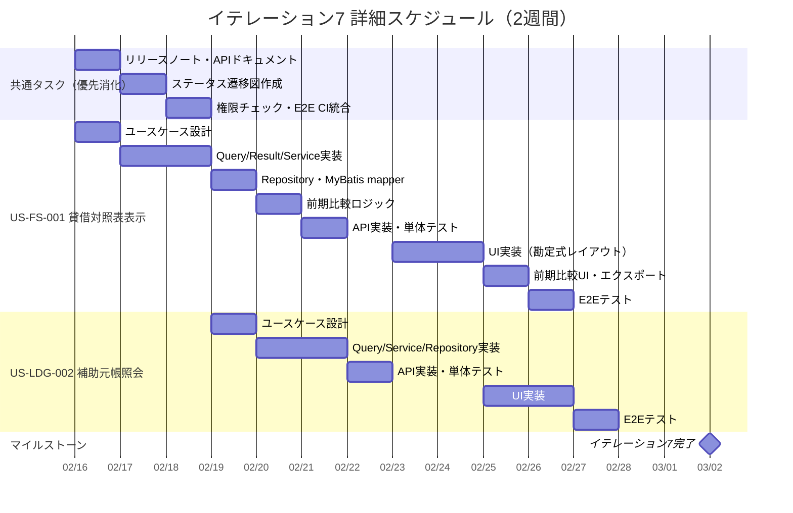

# イテレーション計画 7 - 財務会計システム

## 基本情報

| 項目 | 内容 |
|------|------|
| イテレーション番号 | 7 |
| 期間 | 2026-02-16 〜 2026-03-02（2週間） |
| 作業日数 | 10日 |
| チーム人数 | 3名 |
| 総作業可能時間 | 150時間（3名 × 5時間/日 × 10日） |
| 前イテレーションベロシティ | 19SP |
| 累積平均ベロシティ | 16.3SP |

## イテレーションゴール

**貸借対照表表示と補助元帳照会を実装し、積み残し共通タスクを完了する**

リリース 2.0 機能拡張版の 3 番目のイテレーションとして、残高試算表データを基にした貸借対照表表示を実装する。あわせて補助元帳照会機能を追加し、元帳管理の機能を充実させる。さらに 3 イテレーション連続で先送りされていた共通タスク（COMMON-18〜25）を必須として消化する。

## 選択したストーリー

| ストーリーID | ストーリー名 | SP | 優先度 |
|-------------|-------------|-----|--------|
| US-FS-001 | 貸借対照表表示 | 8 | 必須 |
| US-LDG-002 | 補助元帳照会 | 5 | 必須 |
| **合計** | | **13** | |

**コミットメント**: 13SP + 共通タスク 18h（累積平均ベロシティ 16.3SP に対して適切。共通タスク消化分を含めた実質的な作業量はイテレーション 6 と同等）

---

## ゴール

### イテレーション終了時の達成状態

1. **貸借対照表表示**: 全勘定科目の資産・負債・純資産区分で貸借対照表を表示でき、基準日指定と前期比較が可能
2. **補助元帳照会**: 勘定科目と補助科目を指定して明細を照会でき、期間絞り込みが可能
3. **共通タスク完了**: COMMON-18〜25 の全 5 タスクを完了し、技術的負債を解消

### 成功基準

- [x] US-FS-001 の全受入条件を満たしている
- [x] US-LDG-002 の全受入条件を満たしている
- [ ] COMMON-18〜25 が全て完了している
- [ ] テストカバレッジ 80% 以上を維持
- [ ] SonarQube Quality Gate パス

---

## ユーザーストーリー

### ストーリー詳細

#### US-FS-001: 貸借対照表表示（8SP）✅ 完了

**ストーリー**:

> 経理責任者として、貸借対照表を表示したい。なぜなら、企業の財務状況を把握するためだ。

**受入条件**:

- [x] 資産、負債、純資産の各科目と金額が表示される
- [x] 資産合計と負債・純資産合計が一致している
- [x] 基準日を指定して表示できる
- [x] 前期比較ができる
- [x] PDF/Excel でダウンロードできる

#### US-LDG-002: 補助元帳照会（5SP）✅ 完了（2026-02-14）

**ストーリー**:

> 経理担当者として、補助元帳を照会したい。なぜなら、取引先別や部門別の明細を確認するためだ。

**受入条件**:

- [x] 勘定科目と補助科目を選択して元帳を表示できる
- [x] 日付、仕訳番号、摘要、借方金額、貸方金額、残高が表示される
- [x] 期間を指定して絞り込みできる

---

## タスク分解

### US-FS-001: 貸借対照表表示（8SP）✅ 完了（2026-02-14）

**受入条件**:

- [x] 資産、負債、純資産の各科目と金額が表示される
- [x] 資産合計と負債・純資産合計が一致している
- [x] 基準日を指定して表示できる
- [x] 前期比較ができる
- [x] PDF/Excel でダウンロードできる

| タスクID | タスク名 | 理想時間 | 担当 | 状態 |
|----------|---------|---------|------|------|
| FS-001-01 | 貸借対照表ユースケース設計 | 3h | Claude | [x] |
| FS-001-02 | GetBalanceSheetQuery / Result 実装 | 3h | Codex | [x] |
| FS-001-03 | GetBalanceSheetService 実装（カテゴリ集計ロジック） | 5h | Codex | [x] |
| FS-001-04 | BalanceSheetRepository（Output Port）+ MyBatis mapper | 4h | Codex | [x] |
| FS-001-05 | 前期比較ロジック実装 | 4h | Codex | [x] |
| FS-001-06 | 貸借対照表 API 実装（GET /api/balance-sheet） | 3h | Codex | [x] |
| FS-001-07 | 単体テスト作成 | 4h | Codex | [x] |
| FS-001-08 | 貸借対照表画面 UI 実装（勘定式レイアウト） | 8h | Codex | [x] |
| FS-001-09 | 前期比較 UI 実装 | 3h | Codex | [x] |
| FS-001-10 | PDF/Excel ダウンロード機能実装 | 6h | Codex | [x] |
| FS-001-11 | フロントエンド API 連携 | 2h | Codex | [x] |
| FS-001-12 | 統合テスト（E2E テスト） | 3h | Claude | [x] |
| | **小計** | **48h** | | |

#### 実装詳細

**バックエンド実装**:

- `GetBalanceSheetQuery` / `GetBalanceSheetResult` - Input Port
- `GetBalanceSheetUseCase` - ユースケースインターフェース
- `GetBalanceSheetService` - ユースケース実装
- `BalanceSheetRepository` - Output Port（MyBatis mapper）
- `BalanceSheetController` - GET /api/balance-sheet?date={date}&comparativeDate={comparativeDate}

**データソース**:

- `balance_sheet` ビュー（V10 マイグレーションで作成済み）を参考に
- `daily_account_balances` テーブルを直接参照（日付フィルター対応のため）
- `accounts` テーブルの `bspl_category = 'B'` で貸借対照表項目を抽出

**貸借対照表区分**:

- **資産（ASSET）**: 借方残高
- **負債（LIABILITY）**: 貸方残高
- **純資産（EQUITY）**: 貸方残高
- 資産合計 = 負債合計 + 純資産合計 の検証ロジック

**前期比較**:

- `comparativeDate` パラメータで前期基準日を指定
- 当期残高と前期残高の差額を算出
- 増減率の計算

**PDF/Excel エクスポート**:

- Apache POI（Excel）/ iText（PDF）によるサーバーサイド生成
- GET /api/balance-sheet/export?format={pdf|excel}&date={date}
- フロントエンドから Blob API でダウンロード

**フロントエンド実装**:

- `BalanceSheetPage.tsx` - 貸借対照表画面
- `BalanceSheetFilter.tsx` - 基準日・前期比較日入力
- `BalanceSheetTable.tsx` - 勘定式レイアウト（資産 | 負債・純資産）
- `BalanceSheetSummary.tsx` - 合計・一致確認コンポーネント
- `getBalanceSheet.ts` - API クライアント

---

### US-LDG-002: 補助元帳照会（5SP）✅ 完了（2026-02-14）

**受入条件**:

- [x] 勘定科目と補助科目を選択して元帳を表示できる
- [x] 日付、仕訳番号、摘要、借方金額、貸方金額、残高が表示される
- [x] 期間を指定して絞り込みできる

| タスクID | タスク名 | 理想時間 | 担当 | 状態 |
|----------|---------|---------|------|------|
| LDG-002-01 | 補助元帳照会ユースケース設計 | 2h | Claude | [x] |
| LDG-002-02 | GetSubsidiaryLedgerQuery / Result 実装 | 2h | Codex | [x] |
| LDG-002-03 | GetSubsidiaryLedgerService 実装 | 4h | Codex | [x] |
| LDG-002-04 | SubsidiaryLedgerRepository（Output Port）+ MyBatis mapper | 4h | Codex | [x] |
| LDG-002-05 | 補助元帳 API 実装（GET /api/subsidiary-ledger） | 3h | Codex | [x] |
| LDG-002-06 | 単体テスト作成 | 3h | Codex | [x] |
| LDG-002-07 | 補助元帳照会画面 UI 実装 | 6h | Codex | [x] |
| LDG-002-08 | フロントエンド API 連携 | 2h | Codex | [x] |
| LDG-002-09 | 統合テスト（E2E テスト） | 2h | Claude | [x] |
| | **小計** | **28h** | | |

#### 実装詳細

**バックエンド実装**:

- `GetSubsidiaryLedgerQuery` / `GetSubsidiaryLedgerResult` - Input Port
- `GetSubsidiaryLedgerUseCase` - ユースケースインターフェース
- `GetSubsidiaryLedgerService` - ユースケース実装
- `SubsidiaryLedgerRepository` - Output Port（MyBatis mapper）
- `SubsidiaryLedgerController` - GET /api/subsidiary-ledger?accountCode={code}&subAccountCode={subCode}&dateFrom={from}&dateTo={to}

**データソース**:

- `daily_account_balances` テーブル（`sub_account_code` カラムが存在）
- `general_ledger` ビュー（V10）の `sub_account_code` パーティションを活用
- 残高計算: ウィンドウ関数で勘定科目 + 補助科目ごとの累計残高

**クエリパターン**:

- 総勘定元帳照会（US-LDG-001）の実装パターンを再利用
- `WHERE account_code = #{accountCode} AND sub_account_code = #{subAccountCode}` を追加
- ページネーション対応（page, size パラメータ）

**フロントエンド実装**:

- `SubsidiaryLedgerPage.tsx` - 補助元帳照会画面
- `SubsidiaryLedgerFilter.tsx` - 勘定科目 + 補助科目 + 期間フィルター
- `SubsidiaryLedgerTable.tsx` - 明細テーブル（日付・仕訳番号・摘要・借方・貸方・残高）
- `getSubsidiaryLedger.ts` - API クライアント

---

## 共通タスク（必須 - 3 イテレーション連続の積み残し消化）

| タスクID | タスク名 | 理想時間 | 担当 | 状態 |
|----------|---------|---------|------|------|
| COMMON-18 | リリース 1.0 MVP リリースノート作成 | 3h | Claude | [ ] |
| COMMON-19 | API ドキュメント更新（Swagger） | 3h | Claude | [ ] |
| COMMON-23 | 仕訳ステータス遷移図ドキュメント作成 | 4h | Claude | [ ] |
| COMMON-24 | フロントエンド権限チェック（ロールに応じたボタン表示制御） | 4h | Codex | [ ] |
| COMMON-25 | E2E テスト CI 統合（GitHub Actions） | 4h | Claude | [ ] |
| | **小計** | **18h** | | |

---

## 作業時間サマリー

| カテゴリ | 理想時間 |
|---------|---------|
| US-FS-001: 貸借対照表表示 | 48h |
| US-LDG-002: 補助元帳照会 | 28h |
| 共通タスク（COMMON-18〜25） | 18h |
| **合計** | **94h** |

**キャパシティ**: 150h（3名 × 5h × 10日）
**バッファ**: 56h（37%）— 共通タスクの確実な消化と品質改善に活用

---

## 詳細スケジュール



---

## 週次計画

### Week 1（2026-02-16 〜 2026-02-20）

| 日 | 主要タスク | 状態 |
|----|-----------|------|
| 月(2/16) | 共通タスク消化（COMMON-18, 19）、US-FS-001 ユースケース設計 | [ ] |
| 火(2/17) | 共通タスク消化（COMMON-23）、US-FS-001 Query/Service 実装開始 | [ ] |
| 水(2/18) | 共通タスク消化（COMMON-24, 25）、US-FS-001 Service 実装完了 | [ ] |
| 木(2/19) | US-FS-001 Repository・API 実装、US-LDG-002 ユースケース設計 | [ ] |
| 金(2/20) | US-FS-001 前期比較ロジック・単体テスト、US-LDG-002 Service 実装開始 | [ ] |

### Week 2（2026-02-23 〜 2026-03-02）

| 日 | 主要タスク | 状態 |
|----|-----------|------|
| 月(2/23) | US-FS-001 UI 実装開始、US-LDG-002 Repository・API 実装 | [ ] |
| 火(2/24) | US-FS-001 UI 実装完了、US-LDG-002 単体テスト | [ ] |
| 水(2/25) | US-FS-001 エクスポート機能、US-LDG-002 UI 実装開始 | [ ] |
| 木(2/26) | US-FS-001 E2E テスト、US-LDG-002 UI 実装完了 | [ ] |
| 金(2/27) | US-LDG-002 E2E テスト、全体統合テスト | [ ] |
| 土(2/28) | バッファ | - |
| 日(3/01) | - | - |
| 月(3/02) | 最終統合テスト、品質改善、イテレーション完了 | [ ] |

---

## 設計メモ

### 貸借対照表レイアウト（勘定式）

```
┌─────────────────────────────────────────────────────────┐
│                    貸 借 対 照 表                         │
│               基準日: 2026年2月28日                       │
├───────────────────────┬─────────────────────────────────┤
│      資  産  の  部    │    負  債  の  部               │
├───────────────────────┼─────────────────────────────────┤
│ 現金          100,000 │ 買掛金          50,000          │
│ 売掛金        200,000 │ 借入金         100,000          │
│ 備品          300,000 │ 負債合計       150,000          │
│                       ├─────────────────────────────────┤
│                       │    純 資 産 の 部               │
│                       ├─────────────────────────────────┤
│                       │ 資本金         300,000          │
│                       │ 繰越利益剰余金 150,000          │
│                       │ 純資産合計     450,000          │
├───────────────────────┼─────────────────────────────────┤
│ 資産合計     600,000  │ 負債・純資産合計 600,000        │
└───────────────────────┴─────────────────────────────────┘
```

### API 設計

| メソッド | エンドポイント | 説明 | 権限 |
|---------|---------------|------|------|
| GET | /api/balance-sheet | 貸借対照表表示 | 全ロール |
| GET | /api/balance-sheet/export | 貸借対照表エクスポート | 全ロール |
| GET | /api/subsidiary-ledger | 補助元帳照会 | 全ロール |

### API パラメータ詳細

#### GET /api/balance-sheet

| パラメータ | 型 | 必須 | 説明 |
|-----------|-----|------|------|
| date | LocalDate | 任意 | 基準日（省略時: 当日） |
| comparativeDate | LocalDate | 任意 | 前期比較基準日 |

#### GET /api/balance-sheet/export

| パラメータ | 型 | 必須 | 説明 |
|-----------|-----|------|------|
| format | String | 必須 | 出力形式（pdf / excel） |
| date | LocalDate | 任意 | 基準日 |

#### GET /api/subsidiary-ledger

| パラメータ | 型 | 必須 | 説明 |
|-----------|-----|------|------|
| accountCode | String | 必須 | 勘定科目コード |
| subAccountCode | String | 任意 | 補助科目コード |
| dateFrom | LocalDate | 任意 | 期間開始日 |
| dateTo | LocalDate | 任意 | 期間終了日 |
| page | Integer | 任意 | ページ番号（デフォルト: 0） |
| size | Integer | 任意 | ページサイズ（デフォルト: 20） |

### 既存テーブル・ビュー活用

- `balance_sheet` ビュー（V10 で作成済み）— 参考としつつ、日付フィルター対応のため `daily_account_balances` を直接参照
- `daily_account_balances` テーブル — `sub_account_code` カラムで補助元帳データ対応
- `general_ledger` ビュー（V10）— `sub_account_code` パーティションが補助元帳に対応
- `accounts` テーブル — `bspl_category = 'B'` で BS 項目抽出

---

## リスクと対策

| リスク | 影響度 | 発生確率 | 対策 |
|-------|-------|---------|------|
| 貸借対照表の勘定式レイアウト実装の複雑性 | 中 | 中 | 残高試算表の UI パターンを応用、CSS Grid で対応 |
| 前期比較ロジックの精度 | 中 | 低 | 同一クエリを2回実行し差額計算、テストで検証 |
| PDF/Excel エクスポートのライブラリ選定 | 中 | 中 | Apache POI（Excel）は既に依存関係にあるか確認、なければ追加 |
| 補助科目データの不在 | 高 | 中 | sub_account_code がデフォルト空文字の場合のフォールバック対応 |
| 共通タスクとストーリー実装の並行作業による品質低下 | 中 | 低 | Week 1 前半で共通タスクを集中消化し、後半からストーリー実装に集中 |

---

## 前イテレーションからの改善アクション

| # | アクション | 状態 | 備考 |
|---|-----------|------|------|
| 1 | 共通タスク消化を必須化 | 計画済み | 今イテレーションで COMMON-18〜25 を **Week 1 前半で優先消化** |
| 2 | ベロシティ基準の見直し | 反映済み | 13SP（共通タスク含む実質作業量を考慮して調整） |
| 3 | E2E テストの自己完結化パターン継続 | 継続 | visibilityTestSetup パターンを新テストにも適用 |

---

## コミットメント確認

### チーム合意事項

- [ ] 全ストーリーの受入条件を理解した
- [ ] タスク分解と見積もりに合意した
- [ ] 13SP + 共通タスク 18h を2週間で完了することにコミットする
- [ ] **共通タスクを Week 1 前半で優先消化する**
- [ ] デイリースタンドアップを毎日実施する
- [ ] 問題発生時は即座に共有する
- [ ] 日次バーンダウンを記録する

### 完了の定義（Definition of Done）

- [ ] すべての受入条件を満たしている
- [ ] 単体テストが作成され、すべてパスしている
- [ ] 統合テスト（E2E テスト）が作成され、すべてパスしている
- [ ] コードレビューが完了している
- [ ] CI/CD パイプラインでビルドが成功している
- [ ] ドキュメントが更新されている
- [ ] テストカバレッジ 80% 以上を維持している
- [ ] SonarQube Quality Gate パス

---

## 進捗状況

### ストーリー進捗

| ストーリーID | ストーリー名 | SP | 状態 | 完了日 |
|-------------|-------------|-----|------|--------|
| US-FS-001 | 貸借対照表表示 | 8 | ✅ 完了 | 2026-02-14 |
| US-LDG-002 | 補助元帳照会 | 5 | ✅ 完了 | 2026-02-14 |

### 日次残理想時間

| 日 | 計画残時間 | 実績残時間 | 差異 |
|----|-----------|-----------|------|
| Day 1 (2/16) | 94h | - | - |
| Day 2 (2/17) | 85h | - | - |
| Day 3 (2/18) | 75h | - | - |
| Day 4 (2/19) | 66h | - | - |
| Day 5 (2/20) | 56h | - | - |
| Day 6 (2/23) | 47h | - | - |
| Day 7 (2/24) | 37h | - | - |
| Day 8 (2/25) | 28h | - | - |
| Day 9 (2/26) | 19h | - | - |
| Day 10 (3/02) | 0h | - | - |

---

## 技術検証タスク（スパイク）

### 貸借対照表の勘定式レイアウト設計

**目的**: 勘定式貸借対照表の UI レイアウトを確定

**検証項目**:

1. CSS Grid / Flexbox による2列レイアウトの実現方法
2. 資産 | 負債・純資産 の縦方向の高さ調整
3. レスポンシブ対応（モバイルでは1列表示に切り替え）
4. 印刷時のレイアウト維持

**成果物**: レイアウトモック

### PDF/Excel エクスポートライブラリ検証

**目的**: サーバーサイドでの帳票出力方式を確定

**検証項目**:

1. Apache POI の依存関係確認（Excel 出力）
2. OpenPDF / iText の選定（PDF 出力）
3. Spring Boot でのバイナリレスポンス実装方式
4. フロントエンドからの Blob ダウンロード実装

**成果物**: エクスポート方式の ADR

---

## リリース 2.0 機能拡張版 達成要件（イテレーション 5-8）

### 機能要件

- [x] ユーザー管理（編集・削除・一覧）※イテレーション 5 完了
- [x] 仕訳承認ワークフロー（申請・承認）※イテレーション 5 完了
- [x] 仕訳差し戻し・確定 ※イテレーション 6 完了
- [x] 月次残高照会 ※イテレーション 6 完了
- [x] 残高試算表表示 ※イテレーション 6 完了
- [x] 貸借対照表表示 ← **イテレーション 7 完了（2026-02-14）**
- [ ] 補助元帳照会 ← **イテレーション 7 で実装予定**
- [ ] 損益計算書表示（イテレーション 8 予定）

### イテレーション 7 の位置づけ

イテレーション 7 は貸借対照表と補助元帳照会を実装し、リリース 2.0 の完成に向けた主要機能を揃える。イテレーション 8 で損益計算書を実装し、リリース 2.0 を完成させる予定。さらに 3 イテレーション連続で先送りされていた共通タスクを完了させ、技術的負債を解消する。

---

## 更新履歴

| 日付 | 更新内容 | 更新者 |
|------|---------|--------|
| 2026-02-14 | 初版作成 | Claude Opus 4.6 |
| 2026-02-14 | US-FS-001 貸借対照表表示完了を反映（8SP、バックエンド API + フロントエンド UI + PDF/Excel エクスポート） | Claude Opus 4.6 |
| 2026-02-14 | US-LDG-002 補助元帳照会のフロントエンド UI と API 連携を反映 | Codex |
| 2026-02-14 | US-LDG-002 補助元帳照会完了（5SP、バックエンド API + フロントエンド UI + E2E テスト）。全タスク完了 | Claude Opus 4.6 |

---

## 関連ドキュメント

- [イテレーション 6 計画](./iteration_plan-6.md)
- [イテレーション 6 ふりかえり](./retrospective-6.md)
- [リリース計画](./release_plan.md)
- [ユーザーストーリー](../requirements/user_story.md)
