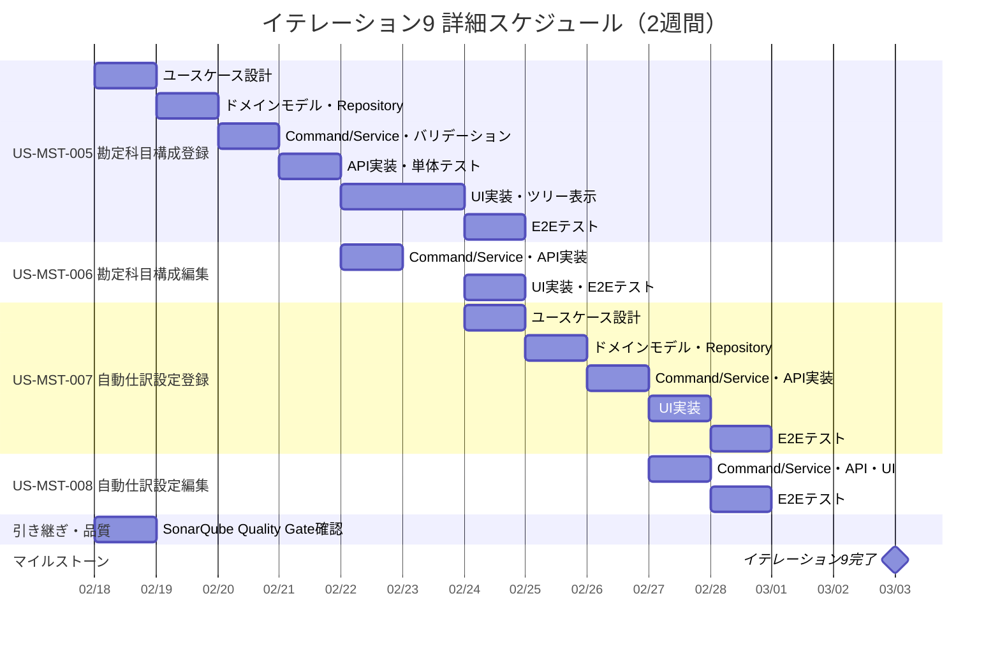

# イテレーション計画 9 - 財務会計システム

## 基本情報

| 項目 | 内容 |
|------|------|
| イテレーション番号 | 9 |
| 期間 | 2026-02-18 〜 2026-03-03（2週間） |
| 作業日数 | 10日 |
| チーム人数 | 3名 |
| 総作業可能時間 | 150時間（3名 × 5時間/日 × 10日） |
| 前イテレーションベロシティ | 8SP |
| 累積平均ベロシティ | 14.9SP |

## イテレーションゴール

**勘定科目構成管理と自動仕訳設定管理を実装し、マスタ管理機能を完成させる**

リリース 3.0 完成版の最初のイテレーションとして、勘定科目の親子関係（階層構造）を管理する勘定科目構成の登録・編集機能と、定型取引の自動仕訳設定の登録・編集機能を実装する。既存のマスタ管理パターン（勘定科目 CRUD）を再利用し、効率的に実装する。

## 選択したストーリー

| ストーリーID | ストーリー名 | SP | 優先度 |
|-------------|-------------|-----|--------|
| US-MST-005 | 勘定科目構成登録 | 5 | 重要 |
| US-MST-006 | 勘定科目構成編集 | 3 | 重要 |
| US-MST-007 | 自動仕訳設定登録 | 3 | 重要 |
| US-MST-008 | 自動仕訳設定編集 | 2 | 重要 |
| **合計** | | **13** | |

**コミットメント**: 13SP（累積平均ベロシティ 14.9SP に対して適切。IT-8 ふりかえりのパターン再利用可能性評価を反映し、既存マスタ管理パターンの再利用で達成可能と判断）

---

## ゴール

### イテレーション終了時の達成状態

1. **勘定科目構成管理**: 勘定科目の親子関係を登録・編集でき、階層構造がツリー表示される
2. **自動仕訳設定管理**: 定型取引の自動仕訳パターンを登録・編集でき、借方・貸方明細を設定できる
3. **マスタ管理完成**: リリース 1.0 の勘定科目 CRUD と合わせ、マスタ管理カテゴリの全 8 ストーリーが完了

### 成功基準

- [ ] US-MST-005, 006, 007, 008 の全受入条件を満たしている
- [ ] テストカバレッジ 80% 以上を維持
- [ ] SonarQube Quality Gate パス（IT-7, IT-8 からの引き継ぎ）
- [ ] 全テスト（バックエンド + フロントエンド）がパス

---

## ユーザーストーリー

### US-MST-005: 勘定科目構成登録（5SP）

**ストーリー**:

> 経理責任者として、勘定科目の親子関係を登録したい。なぜなら、科目を体系的に管理し、集計を容易にするためだ。

**受入条件**:

- [ ] 親科目と子科目を選択して登録できる
- [ ] 循環参照が発生しないようバリデーションされる
- [ ] 表示順を設定できる
- [ ] 登録成功時、確認メッセージが表示される

---

### US-MST-006: 勘定科目構成編集（3SP）

**ストーリー**:

> 経理責任者として、勘定科目の親子関係を編集したい。なぜなら、科目体系の変更に対応するためだ。

**受入条件**:

- [ ] 親科目、子科目、表示順を編集できる
- [ ] 循環参照が発生しないようバリデーションされる
- [ ] 編集成功時、確認メッセージが表示される

---

### US-MST-007: 自動仕訳設定登録（3SP）

**ストーリー**:

> 経理責任者として、定型取引の自動仕訳設定を登録したい。なぜなら、繰り返し発生する仕訳の入力を効率化するためだ。

**受入条件**:

- [ ] 設定名、借方科目、貸方科目、デフォルト金額、摘要を入力して登録できる
- [ ] 登録成功時、確認メッセージが表示される

---

### US-MST-008: 自動仕訳設定編集（2SP）

**ストーリー**:

> 経理責任者として、自動仕訳設定を編集したい。なぜなら、取引内容の変更に対応するためだ。

**受入条件**:

- [ ] 設定名、借方科目、貸方科目、デフォルト金額、摘要を編集できる
- [ ] 編集成功時、確認メッセージが表示される

---

## タスク分解

### US-MST-005: 勘定科目構成登録（5SP）

| タスクID | タスク名 | 理想時間 | 担当 | 状態 |
|----------|---------|---------|------|------|
| MST-005-01 | 勘定科目構成ユースケース設計 | 2h | Claude | [ ] |
| MST-005-02 | AccountStructure ドメインモデル実装 | 3h | Codex | [ ] |
| MST-005-03 | RegisterAccountStructureCommand / Service 実装 | 3h | Codex | [ ] |
| MST-005-04 | AccountStructureRepository（Output Port）+ MyBatis mapper | 3h | Codex | [ ] |
| MST-005-05 | 循環参照バリデーションロジック実装 | 3h | Codex | [ ] |
| MST-005-06 | 勘定科目構成 API 実装（POST /api/account-structures） | 2h | Codex | [ ] |
| MST-005-07 | 勘定科目構成一覧 API 実装（GET /api/account-structures） | 2h | Codex | [ ] |
| MST-005-08 | 単体テスト作成 | 3h | Codex | [ ] |
| MST-005-09 | 勘定科目構成登録画面 UI 実装 | 4h | Codex | [ ] |
| MST-005-10 | ツリー表示コンポーネント実装 | 3h | Codex | [ ] |
| MST-005-11 | フロントエンド API 連携 | 2h | Codex | [ ] |
| MST-005-12 | 統合テスト（E2E テスト） | 2h | Claude | [ ] |
| | **小計** | **32h** | | |

#### 実装詳細

**バックエンド実装**:

- `RegisterAccountStructureCommand` / `RegisterAccountStructureResult` - Input Port
- `RegisterAccountStructureUseCase` - ユースケースインターフェース
- `RegisterAccountStructureService` - ユースケース実装
- `AccountStructureRepository` - Output Port（一覧取得、登録、循環参照チェック）
- `AccountStructureController` - REST API

**データソース**:

- `account_structures` テーブル（V7 マイグレーションで作成済み）
- `account_code` (PK, FK → accounts.code)、`parent_account_code`、`hierarchy_level`、`account_path`、`display_order`

**循環参照チェックロジック**:

- 親科目をたどって自分自身に到達しないことを再帰的に検証
- `account_path` に自分の `account_code` が含まれないことを検証

---

### US-MST-006: 勘定科目構成編集（3SP）

| タスクID | タスク名 | 理想時間 | 担当 | 状態 |
|----------|---------|---------|------|------|
| MST-006-01 | UpdateAccountStructureCommand / Service 実装 | 3h | Codex | [ ] |
| MST-006-02 | 編集 API 実装（PUT /api/account-structures/{code}） | 2h | Codex | [ ] |
| MST-006-03 | 削除 API 実装（DELETE /api/account-structures/{code}） | 2h | Codex | [ ] |
| MST-006-04 | 単体テスト作成 | 2h | Codex | [ ] |
| MST-006-05 | 勘定科目構成編集画面 UI 実装 | 3h | Codex | [ ] |
| MST-006-06 | フロントエンド API 連携 | 2h | Codex | [ ] |
| MST-006-07 | 統合テスト（E2E テスト） | 2h | Claude | [ ] |
| | **小計** | **16h** | | |

---

### US-MST-007: 自動仕訳設定登録（3SP）

| タスクID | タスク名 | 理想時間 | 担当 | 状態 |
|----------|---------|---------|------|------|
| MST-007-01 | 自動仕訳設定ユースケース設計 | 2h | Claude | [ ] |
| MST-007-02 | AutoJournalPattern ドメインモデル実装 | 3h | Codex | [ ] |
| MST-007-03 | RegisterAutoJournalPatternCommand / Service 実装 | 3h | Codex | [ ] |
| MST-007-04 | AutoJournalPatternRepository（Output Port）+ MyBatis mapper | 3h | Codex | [ ] |
| MST-007-05 | 自動仕訳設定 API 実装（POST /api/auto-journal-patterns） | 2h | Codex | [ ] |
| MST-007-06 | 自動仕訳設定一覧 API 実装（GET /api/auto-journal-patterns） | 2h | Codex | [ ] |
| MST-007-07 | 単体テスト作成 | 3h | Codex | [ ] |
| MST-007-08 | 自動仕訳設定登録画面 UI 実装 | 4h | Codex | [ ] |
| MST-007-09 | フロントエンド API 連携 | 2h | Codex | [ ] |
| MST-007-10 | 統合テスト（E2E テスト） | 2h | Claude | [ ] |
| | **小計** | **26h** | | |

#### 実装詳細

**バックエンド実装**:

- `RegisterAutoJournalPatternCommand` / `RegisterAutoJournalPatternResult` - Input Port
- `RegisterAutoJournalPatternUseCase` - ユースケースインターフェース
- `RegisterAutoJournalPatternService` - ユースケース実装
- `AutoJournalPatternRepository` - Output Port
- `AutoJournalPatternController` - REST API

**データソース**:

- `auto_journal_patterns` テーブル（V9 マイグレーションで作成済み）
  - `pattern_code` (UNIQUE)、`pattern_name`、`source_table_name`、`description`、`is_active`
- `auto_journal_pattern_items` テーブル（V9 マイグレーションで作成済み）
  - `pattern_id` (FK)、`line_number`、`debit_credit_type`（D/C）、`account_code` (FK)、`amount_formula`、`description_template`

**ドメインモデル**:

- `AutoJournalPattern` - パターンマスタ（1対多: パターン明細）
- `AutoJournalPatternItem` - 借方・貸方明細行

---

### US-MST-008: 自動仕訳設定編集（2SP）

| タスクID | タスク名 | 理想時間 | 担当 | 状態 |
|----------|---------|---------|------|------|
| MST-008-01 | UpdateAutoJournalPatternCommand / Service 実装 | 2h | Codex | [ ] |
| MST-008-02 | 編集 API 実装（PUT /api/auto-journal-patterns/{id}） | 2h | Codex | [ ] |
| MST-008-03 | 削除 API 実装（DELETE /api/auto-journal-patterns/{id}） | 2h | Codex | [ ] |
| MST-008-04 | 単体テスト作成 | 2h | Codex | [ ] |
| MST-008-05 | 自動仕訳設定編集画面 UI 実装 | 3h | Codex | [ ] |
| MST-008-06 | フロントエンド API 連携 | 2h | Codex | [ ] |
| MST-008-07 | 統合テスト（E2E テスト） | 2h | Claude | [ ] |
| | **小計** | **15h** | | |

---

### IT-8 ふりかえり引き継ぎタスク

| タスクID | タスク名 | 理想時間 | 担当 | 状態 |
|----------|---------|---------|------|------|
| CARRY-01 | SonarQube Quality Gate 確認・記録 | 2h | Claude | [ ] |
| | **小計** | **2h** | | |

---

## 作業時間サマリー

| カテゴリ | 理想時間 |
|---------|---------|
| US-MST-005: 勘定科目構成登録 | 32h |
| US-MST-006: 勘定科目構成編集 | 16h |
| US-MST-007: 自動仕訳設定登録 | 26h |
| US-MST-008: 自動仕訳設定編集 | 15h |
| 引き継ぎタスク | 2h |
| **合計** | **91h** |

**キャパシティ**: 150h（3名 × 5h × 10日）
**バッファ**: 59h（39%）— リファクタリングと品質改善に活用

---

## 詳細スケジュール

---

## 設計メモ

### API 設計

| メソッド | エンドポイント | 説明 | 権限 |
|---------|---------------|------|------|
| GET | /api/account-structures | 勘定科目構成一覧 | MANAGER 以上 |
| POST | /api/account-structures | 勘定科目構成登録 | MANAGER 以上 |
| PUT | /api/account-structures/{code} | 勘定科目構成編集 | MANAGER 以上 |
| DELETE | /api/account-structures/{code} | 勘定科目構成削除 | MANAGER 以上 |
| GET | /api/auto-journal-patterns | 自動仕訳設定一覧 | MANAGER 以上 |
| POST | /api/auto-journal-patterns | 自動仕訳設定登録 | MANAGER 以上 |
| PUT | /api/auto-journal-patterns/{id} | 自動仕訳設定編集 | MANAGER 以上 |
| DELETE | /api/auto-journal-patterns/{id} | 自動仕訳設定削除 | MANAGER 以上 |

### 既存テーブル活用

- `account_structures` テーブル（V7 で作成済み）— 勘定科目構成のデータソース
- `auto_journal_patterns` テーブル（V9 で作成済み）— 自動仕訳設定のデータソース
- `auto_journal_pattern_items` テーブル（V9 で作成済み）— 自動仕訳明細のデータソース

**注**: DB マイグレーションは不要。テーブルは既に作成済み。

### フロントエンドルーティング

| パス | 画面 |
|------|------|
| /account-structures | 勘定科目構成管理 |
| /auto-journal-patterns | 自動仕訳設定管理 |

### 既存パターンの再利用

| パターン | 再利用元 | 適用先 |
|---------|---------|--------|
| マスタ CRUD | 勘定科目管理（US-MST-001〜004） | 勘定科目構成・自動仕訳設定 |
| Repository/Service/Controller | ヘキサゴナルアーキテクチャパターン | 全ストーリー |
| Try\<T\> ラッピング | IT-7 PMD 関数型ルール | 全 Repository |
| validated() パターン | IT-7 PMD 関数型ルール | 全 Domain Value Object |
| フロントエンド CRUD ページ | 勘定科目一覧・編集ページ | 両機能の UI |

---

## リスクと対策

| リスク | 影響度 | 発生確率 | 対策 |
|-------|-------|---------|------|
| 循環参照チェックの複雑性 | 中 | 中 | account_path を利用した簡潔なバリデーション、再帰 CTE での検証 |
| ツリー表示コンポーネントの実装 | 中 | 低 | React の再帰コンポーネントパターンを採用、ライブラリは最小限 |
| 自動仕訳明細の 1 対多管理 | 低 | 低 | 勘定科目構成と同じ Collection ResultMap パターンを使用 |
| DB マイグレーションの不整合 | 低 | 低 | テーブルは V7/V9 で作成済みのため新規マイグレーション不要 |

---

## 前イテレーションからの改善アクション

| # | アクション | 状態 | 備考 |
|---|-----------|------|------|
| 1 | SonarQube Quality Gate 確認 | 計画済み | CARRY-01 タスクとして IT-9 初日に実施 |
| 2 | AI ベロシティに基づく計画見直し | 反映済み | IT-8 ふりかえりの学びを反映し、パターン再利用可能性を計画に考慮 |
| 3 | Release 2.0 リリースノート作成 | 完了 | IT-8 ふりかえりと同時に作成完了 |

---

## リリース 3.0 完成版 達成要件（イテレーション 9-12）

### 機能要件

- [ ] 勘定科目構成登録 ← **イテレーション 9 で実装**
- [ ] 勘定科目構成編集 ← **イテレーション 9 で実装**
- [ ] 自動仕訳設定登録 ← **イテレーション 9 で実装**
- [ ] 自動仕訳設定編集 ← **イテレーション 9 で実装**
- [ ] 自動仕訳生成（イテレーション 10 予定）
- [ ] 財務分析表示（イテレーション 10 予定）
- [ ] 監査ログ照会（イテレーション 11 予定）
- [ ] データダウンロード（イテレーション 11 予定）

### イテレーション 9 の位置づけ

イテレーション 9 はリリース 3.0 完成版の最初のイテレーション。マスタ拡張機能（勘定科目構成・自動仕訳設定）を実装することで、マスタ管理カテゴリの全 8 ストーリーが完了する。自動仕訳設定はイテレーション 10 の自動仕訳生成（US-JNL-006）の前提条件となる。

---

## コミットメント確認

### チーム合意事項

- [ ] 全ストーリーの受入条件を理解した
- [ ] タスク分解と見積もりに合意した
- [ ] 13SP を2週間で完了することにコミットする
- [ ] デイリースタンドアップを毎日実施する
- [ ] 問題発生時は即座に共有する
- [ ] 日次バーンダウンを記録する

### 完了の定義（Definition of Done）

- [ ] すべての受入条件を満たしている
- [ ] 単体テストが作成され、すべてパスしている
- [ ] 統合テスト（E2E テスト）が作成され、すべてパスしている
- [ ] コードレビューが完了している
- [ ] CI/CD パイプラインでビルドが成功している
- [ ] テストカバレッジ 80% 以上を維持している
- [ ] SonarQube Quality Gate パス
- [ ] ドキュメントが更新されている

---

## 更新履歴

| 日付 | 更新内容 | 更新者 |
|------|---------|--------|
| 2026-02-18 | 初版作成 | Claude Opus 4.6 |

---

## 関連ドキュメント

- [イテレーション 8 計画](./iteration_plan-8.md)
- [イテレーション 8 ふりかえり](./retrospective-8.md)
- [リリース計画](./release_plan.md)
- [ユーザーストーリー](../requirements/user_story.md)
