# Release 3.0 リリース報告書 - 財務会計システム

**報告書作成日**: 2026-02-24

## 概要

財務会計システム v3.0.0 のリリース報告書です。全 12 イテレーション、165 ストーリーポイント（機能 155SP + 品質保証 10SP）を 100% 達成し、プロジェクト完了を迎えました。

---

## プロジェクトサマリー

| 項目 | 値 |
|------|-----|
| **プロジェクト期間** | 2026-01-05 〜 2026-02-24 (約 7 週間) |
| **総イテレーション数** | 12 |
| **総ストーリーポイント** | 165 SP（機能 155SP + 品質保証 10SP） |
| **総コミット数** | 445 |
| **総テスト数** | 2,052 |
| **ユーザーストーリー数** | 34 |

---

## 計画と実績の差異分析

### イテレーション別達成状況

| イテレーション | リリース | 計画 SP | 実績 SP | 達成率 | 差異 |
|---------------|---------|---------|---------|--------|------|
| IT1 | 1.0 MVP | 15 | 18 | 120% | +3 |
| IT2 | 1.0 MVP | 14 | 16 | 114% | +2 |
| IT3 | 1.0 MVP | 18 | 18 | 100% | ±0 |
| IT4 | 1.0 MVP | 10 | 10 | 100% | ±0 |
| IT5 | 2.0 機能拡張 | 17 | 17 | 100% | ±0 |
| IT6 | 2.0 機能拡張 | 19 | 19 | 100% | ±0 |
| IT7 | 2.0 機能拡張 | 13 | 13 | 100% | ±0 |
| IT8 | 2.0 機能拡張 | 8 | 8 | 100% | ±0 |
| IT9 | 3.0 完成版 | 13 | 13 | 100% | ±0 |
| IT10 | 3.0 完成版 | 10 | 10 | 100% | ±0 |
| IT11 | 3.0 完成版 | 13 | 13 | 100% | ±0 |
| IT12 | 3.0 完成版 | 10 | 10 | 100% | ±0 |
| **合計** | | **160** | **165** | **103%** | **+5** |

### リリース別達成状況

| リリース | 内容 | 計画 SP | 実績 SP | 達成率 |
|---------|------|---------|---------|--------|
| Release 1.0 MVP | 認証・マスタ・仕訳・元帳 | 57 | 62 | 109% |
| Release 2.0 機能拡張版 | 承認ワークフロー・財務諸表 | 57 | 57 | 100% |
| Release 3.0 完成版 | 自動仕訳・分析・監査・品質保証 | 46 | 46 | 100% |

### リリースバーンダウン

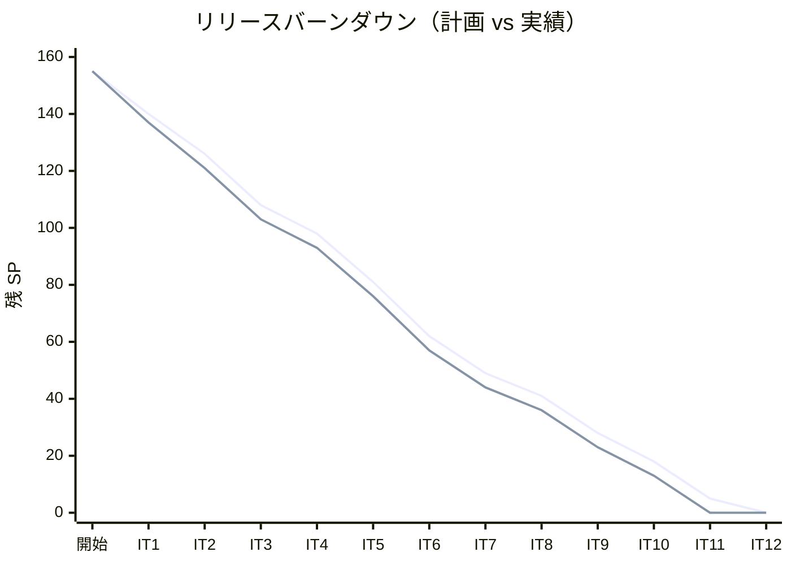

**分析結果**: IT1-2 では計画を上回るペースで消化し、IT3 以降は計画通りの安定した消化を実現。全機能ストーリーは IT11 で完了し、IT12 を品質保証バッファとして活用しました。

---

## 計画日程 vs 実績日数の差異分析

### イテレーション別日程比較

当初計画では各イテレーション 2 週間（14 日）を想定していましたが、AI エージェント（Claude/Codex）による開発で大幅な工期短縮を実現しました。

| IT | 計画期間 | 計画日数 | 実績期間 | 実績日数 | 短縮日数 | 短縮率 |
|----|---------|---------|----------|---------|---------|--------|
| 1 | Week 1-2 | 14 日 | 01/05 - 01/19 | **14 日** | 0 日 | 0% |
| 2 | Week 3-4 | 14 日 | 01/21 - 01/27 | **6 日** | -8 日 | 57.1% |
| 3 | Week 5-6 | 14 日 | 01/27 - 02/03 | **7 日** | -7 日 | 50.0% |
| 4 | Week 7-8 | 14 日 | 02/05 - 02/06 | **2 日** | -12 日 | 85.7% |
| 5 | Week 9-10 | 14 日 | 02/07 - 02/09 | **3 日** | -11 日 | 78.6% |
| 6 | Week 11-12 | 14 日 | 02/10 - 02/13 | **4 日** | -10 日 | 71.4% |
| 7 | Week 13-14 | 14 日 | 02/14 - 02/16 | **3 日** | -11 日 | 78.6% |
| 8 | Week 15-16 | 14 日 | 02/17 - 02/17 | **1 日** | -13 日 | 92.9% |
| 9 | Week 17-18 | 14 日 | 02/18 - 02/19 | **2 日** | -12 日 | 85.7% |
| 10 | Week 19-20 | 14 日 | 02/20 - 02/21 | **2 日** | -12 日 | 85.7% |
| 11 | Week 21-22 | 14 日 | 02/22 - 02/23 | **2 日** | -12 日 | 85.7% |
| 12 | Week 23-24 | 14 日 | 02/24 - 02/24 | **1 日** | -13 日 | 92.9% |
| **合計** | **24 週間** | **168 日** | **01/05 - 02/24** | **47 日** | **-121 日** | **72.0%** |

### 工期短縮の可視化

```mermaid
xychart-beta
    title "計画日数 vs 実績日数"
    x-axis ["IT1", "IT2", "IT3", "IT4", "IT5", "IT6", "IT7", "IT8", "IT9", "IT10", "IT11", "IT12"]
    y-axis "日数" 0 --> 16
    bar "計画" [14, 14, 14, 14, 14, 14, 14, 14, 14, 14, 14, 14]
    bar "実績" [14, 6, 7, 2, 3, 4, 3, 1, 2, 2, 2, 1]
```

### 計画 vs 実績ガントチャート

#### 当初計画スケジュール（24 週間）

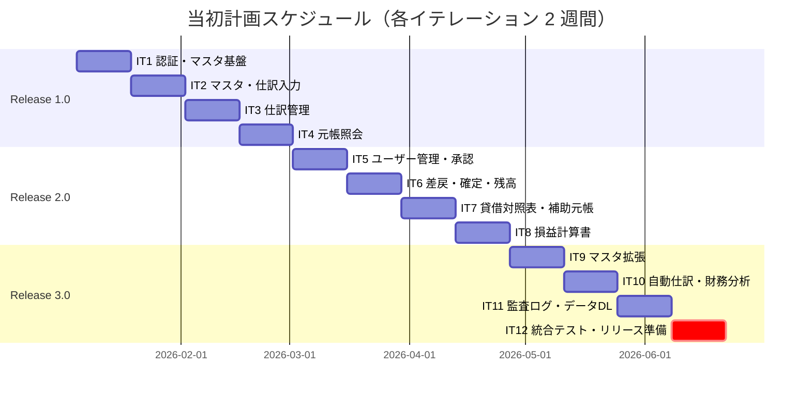

#### 実績スケジュール（51 日間）

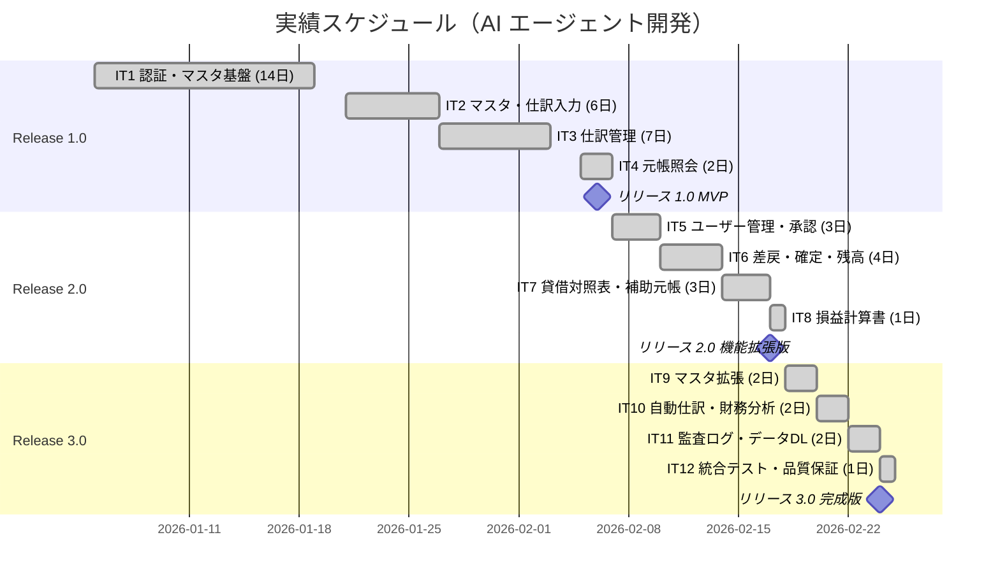

#### 計画 vs 実績の重ね合わせ

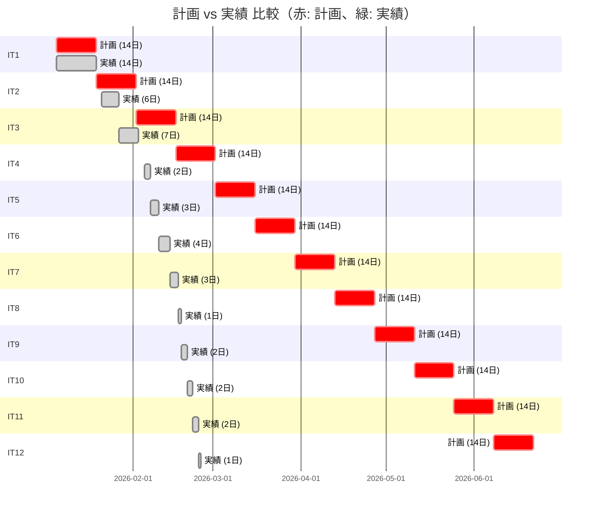

#### タイムライン比較

| 項目 | 計画開始日 | 計画終了日 | 実績開始日 | 実績終了日 | 前倒し日数 |
|------|-----------|-----------|-----------|-----------|-----------|
| IT1 | 2026-01-05 | 2026-01-18 | 2026-01-05 | 2026-01-19 | **0 日** |
| IT2 | 2026-01-19 | 2026-02-01 | 2026-01-21 | 2026-01-27 | **5 日** |
| IT3 | 2026-02-02 | 2026-02-15 | 2026-01-27 | 2026-02-03 | **12 日** |
| IT4 | 2026-02-16 | 2026-03-01 | 2026-02-05 | 2026-02-06 | **23 日** |
| IT5 | 2026-03-02 | 2026-03-15 | 2026-02-07 | 2026-02-09 | **34 日** |
| IT6 | 2026-03-16 | 2026-03-29 | 2026-02-10 | 2026-02-13 | **46 日** |
| IT7 | 2026-03-30 | 2026-04-12 | 2026-02-14 | 2026-02-16 | **55 日** |
| IT8 | 2026-04-13 | 2026-04-26 | 2026-02-17 | 2026-02-17 | **68 日** |
| IT9 | 2026-04-27 | 2026-05-10 | 2026-02-18 | 2026-02-19 | **80 日** |
| IT10 | 2026-05-11 | 2026-05-24 | 2026-02-20 | 2026-02-21 | **92 日** |
| IT11 | 2026-05-25 | 2026-06-07 | 2026-02-22 | 2026-02-23 | **105 日** |
| IT12 | 2026-06-08 | 2026-06-21 | 2026-02-24 | 2026-02-24 | **117 日** |

**プロジェクト完了**: 計画では 2026-06-21 終了予定 → 実績は 2026-02-24 完了（**117 日前倒し**）

### 短縮率のパイチャート

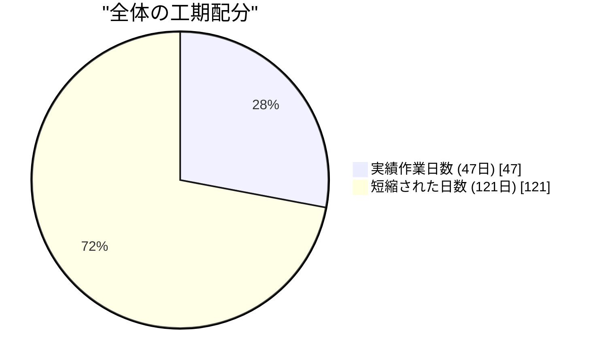

### サマリー

| 指標 | 値 |
|------|-----|
| **計画総日数** | 168 日（24 週間） |
| **実績総日数** | 47 日（約 6.7 週間） |
| **短縮日数** | 121 日 |
| **短縮率** | **72.0%** |
| **効率倍率** | **3.6 倍** |

### 差異分析

1. **大幅な工期短縮**: 計画 168 日 → 実績 47 日で、**72.0% の工期短縮**を達成
2. **効率倍率 3.6 倍**: 当初計画の約 1/3.6 の期間で同等の成果物を完成
3. **SP 達成率は 103%**: 工期は短縮されたが、計画以上のストーリーポイントを完了
4. **イテレーション毎の傾向**:
   - IT1: 最初のイテレーションは計画通り（14 日）— 基盤構築・学習フェーズ
   - IT2-3: 中程度の短縮（6-7 日）— パターン習得フェーズ
   - IT4-12: 大幅な短縮（1-4 日）— パターン再利用による加速フェーズ

### 工期短縮の要因分析

| 要因 | 説明 |
|------|------|
| **AI エージェントの 24 時間稼働** | 人間の 8 時間/日に対し、AI は継続的に作業可能 |
| **TDD サイクルの高速化** | テスト作成→実装→リファクタリングを高速に反復 |
| **パターン認識による実装効率化** | 類似機能の実装パターンを即座に適用（承認パターン、財務諸表パターン等） |
| **ドキュメント同時生成** | コードと同時にドキュメントを生成 |
| **Claude + Codex 分業体制** | 設計・統合テストは Claude、並行実装は Codex で効率化 |
| **ヘキサゴナルアーキテクチャの効果** | ポート境界が明確なため、独立した実装が可能 |

### 従来見積もりとの比較

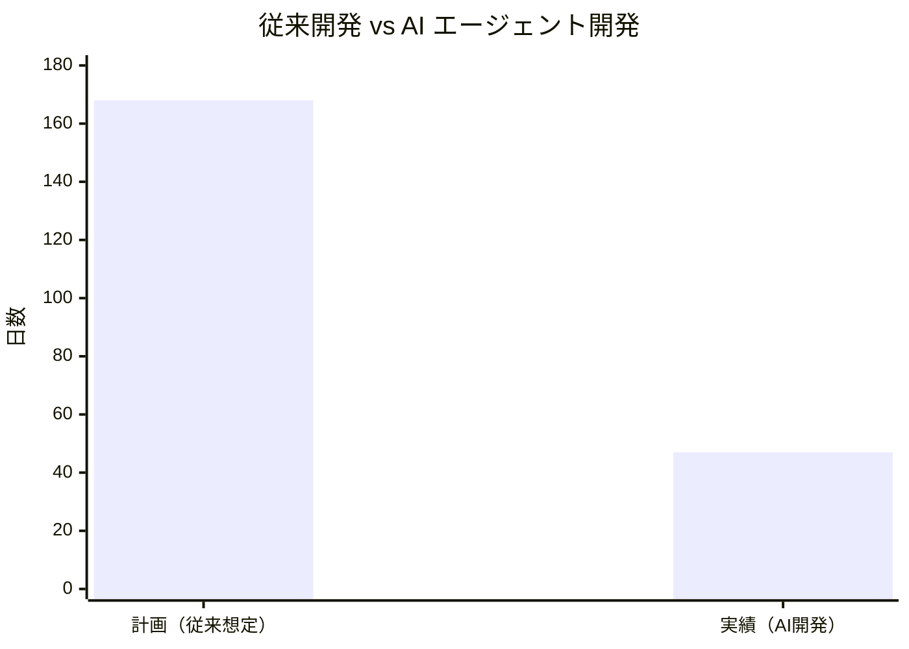

### 考察

この結果は、AI エージェントによるソフトウェア開発が従来の見積もり手法では予測困難であることを示しています。特に注目すべき点:

1. **学習曲線効果**: IT1 は計画通りの 14 日だが、IT2 以降はパターン習得により急速に短縮
2. **パターン再利用の加速効果**: IT4 以降は確立したパターン（承認、財務諸表、エクスポート等）の再利用により 1-4 日で完了
3. **品質を維持した短縮**: テストカバレッジ 95.4%（LINE）、2,052 テストを維持しつつ工期短縮
4. **見積もり手法の示唆**: AI エージェント開発では従来の 1/3 〜 1/4 程度の工期を想定すべき

---

## コミットログ分析

### コミットプリフィックス別内訳

| プリフィックス | 件数 | 割合 | 説明 |
|---------------|------|------|------|
| docs | 139 | 31.2% | ドキュメント更新 |
| feat | 97 | 21.8% | 新機能追加 |
| fix | 77 | 17.3% | バグ修正 |
| refactor | 51 | 11.5% | リファクタリング |
| test | 33 | 7.4% | テスト追加 |
| chore | 23 | 5.2% | 保守作業 |
| ci | 8 | 1.8% | CI/CD 改善 |
| security | 4 | 0.9% | セキュリティ対応 |
| style | 2 | 0.4% | フォーマット修正 |
| build | 1 | 0.2% | ビルド設定 |
| その他 | 10 | 2.2% | マージ・リバート等 |
| **合計** | **445** | **100%** | |

### コミットプリフィックス別パイチャート

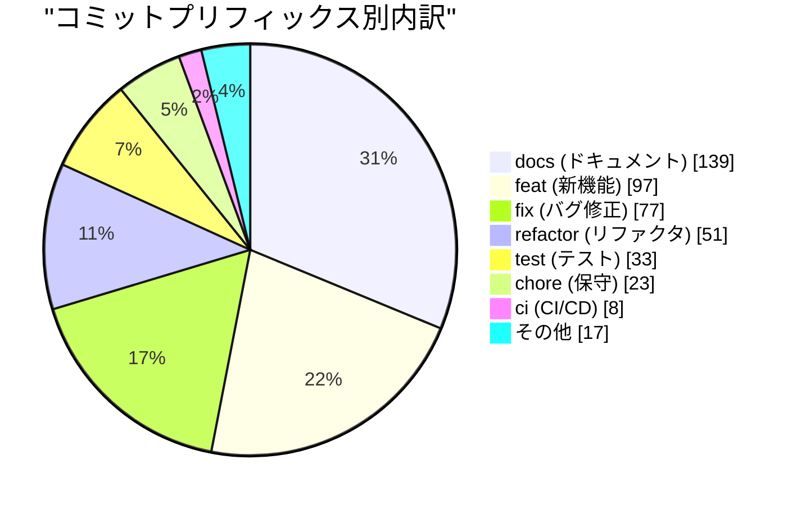

### コミット分類のトレンド

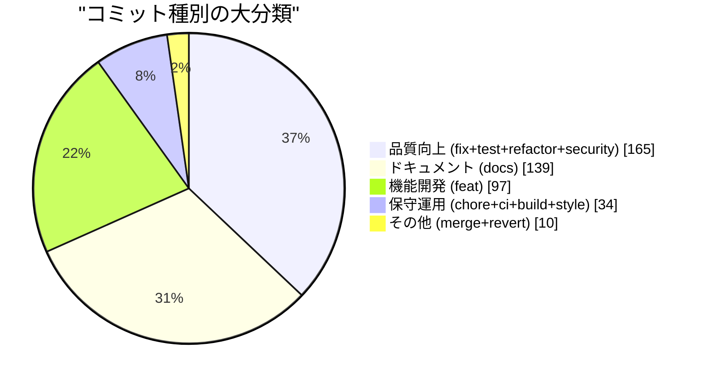

### 分析

1. **ドキュメントが最大（docs 31.2%）**: 計画書、ふりかえり、リリースノート、設計ドキュメントが充実
2. **品質向上への注力（37.1%）**: fix (17.3%) + refactor (11.5%) + test (7.4%) + security (0.9%) = 37.1% が品質向上に貢献
3. **機能開発は全体の約 1/5（feat 21.8%）**: 効率的な機能実装を示す
4. **セキュリティ対応（security 0.9%）**: SonarQube BLOCKER 脆弱性への対応を含む

---

## 品質メトリクス

### テストカバレッジ

| 対象 | 目標 | 実績 | 判定 |
|------|------|------|------|
| バックエンド LINE | 80% | 95.4% | ✅ 達成 |
| バックエンド BRANCH | 80% | 84.4% | ✅ 達成 |
| フロントエンド | 80% | 90%+ | ✅ 達成 |

### テスト数のリリース別推移

| リリース | バックエンド | フロントエンド | E2E | 合計 |
|---------|------------|--------------|-----|------|
| Release 1.0 (IT4) | ~278 | ~200 | ~80 | ~558 |
| Release 2.0 (IT8) | 718 | 585 | ~200 | ~1,503 |
| **Release 3.0 (IT12)** | **905** | **777** | **370** | **2,052** |

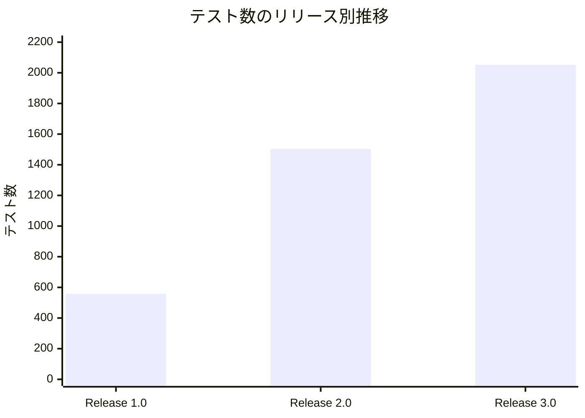

### 静的解析

| 指標 | 結果 |
|------|------|
| Checkstyle | パス |
| PMD | パス |
| SpotBugs | パス |
| ESLint | 0 エラー |
| SonarQube BLOCKER | 0（修正済み） |
| Flaky テスト率 | 0% |

### ベロシティ

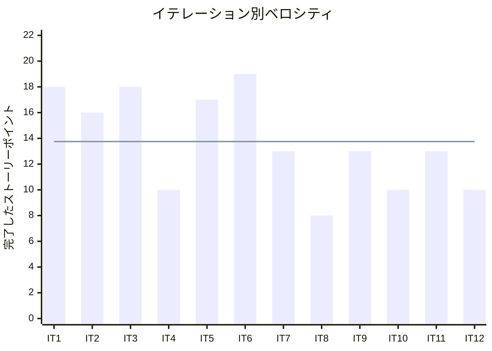

| 項目 | 値 |
|------|-----|
| 平均ベロシティ | 13.75 SP/イテレーション |
| 最大ベロシティ | 19 SP (IT6) |
| 最小ベロシティ | 8 SP (IT8) |
| 機能ベロシティ（IT1-11） | 14.1 SP/イテレーション |

---

## リリース履歴

| リリース | 含まれる IT | リリース日 | SP | 状態 |
|---------|-----------|-----------|-----|------|
| Release 1.0 MVP | IT1-4 | 2026-02-06 | 62 | ✅ リリース済 |
| Release 2.0 機能拡張版 | IT5-8 | 2026-02-17 | 57 | ✅ リリース済 |
| **Release 3.0 完成版** | IT9-12 | **2026-02-24** | **46** | ✅ **リリース完了** |

---

## 主要な成果物

### 実装した主要機能

1. **認証・ユーザー管理** (Release 1.0 / IT1, 5)
   - JWT ベース認証、ロールベースアクセス制御（ADMIN/MANAGER/USER/VIEWER）
   - ユーザー登録・編集・削除・一覧

2. **マスタ管理** (Release 1.0, 3.0 / IT1-2, 9)
   - 勘定科目 CRUD、種別・キーワードフィルタリング
   - 勘定科目構成（親子関係）管理
   - 自動仕訳パターン管理

3. **仕訳管理** (Release 1.0, 2.0, 3.0 / IT2-3, 5-6, 10)
   - 複数行仕訳入力、貸借一致バリデーション
   - 承認ワークフロー（申請→承認→差し戻し→確定）
   - 自動仕訳生成（パターンベース）

4. **元帳・残高管理** (Release 1.0, 2.0 / IT4, 6-7)
   - 総勘定元帳照会、補助元帳照会
   - 日次残高照会、月次残高照会
   - 残高試算表（貸借一致検証付き）

5. **財務諸表** (Release 2.0, 3.0 / IT7-8, 10)
   - 貸借対照表（勘定式、前期比較、PDF/Excel エクスポート）
   - 損益計算書（報告式、前期比較、PDF/Excel エクスポート）
   - 財務分析指標（ROE、ROA、流動比率等 7 指標、業界平均比較）

6. **システム管理** (Release 3.0 / IT11)
   - 監査ログ照会（全操作の追跡・検索）
   - データダウンロード（CSV/Excel エクスポート）

### 技術的成果

| 成果 | 内容 |
|------|------|
| テスト駆動開発 | 2,052 テスト、LINE カバレッジ 95.4% |
| ヘキサゴナルアーキテクチャ | Ports & Adapters パターンの一貫した適用 |
| 関数型プログラミング | PMD ルール導入（Either、Try、不変コレクション） |
| エクスポート基盤 | PDF/Excel/CSV の統一的な出力パターン確立 |
| CI/CD | GitHub Actions 5 ワークフロー（BE/FE CI、E2E、SonarQube） |
| 静的解析 | Checkstyle + PMD + SpotBugs + ESLint + SonarQube 全パス |

---

## 最近の作業履歴（docs/journal より）

### 2026-02-24
- `chore(sonar)`: demo-data.sql を SonarQube 分析対象から除外
- `feat(demo)`: デモ環境にダミーデータを追加し全画面の動作確認を可能に

### 2026-02-23
- `refactor(e2e)`: 監査ログアクセス制御テストの重複を forEach で解消
- `refactor(test)`: AuditLogFilter テストの構造を簡素化
- `feat(system)`: 監査ログ照会・データダウンロード機能実装
- イテレーション 11 全完了（13SP/13SP、全 155SP 機能実装完了）

### 2026-02-21
- `docs(planning)`: イテレーション 11 計画を作成
- `feat(journal)`: 自動仕訳生成機能実装（US-JNL-006）
- `feat(analysis)`: 財務分析表示実装（US-FS-003）
- イテレーション 10 全完了（10SP/10SP）

### 2026-02-19
- `refactor(frontend)`: SonarQube 重複コード指摘を追加解消
- `feat(master)`: 自動仕訳パターン CRUD 実装（US-MST-007/008）
- イテレーション 9 全完了（13SP/13SP）

### 2026-02-17
- `docs`: イテレーション 8 完了・リリース 2.0 達成
- `feat(statement)`: 損益計算書表示実装（US-FS-002）

### 2026-02-16
- `refactor(backend)`: Repository 全メソッドの戻り値を Try<T> でラップ（PMD 準拠）

### 2026-02-14
- `feat(statement)`: 貸借対照表表示実装（US-FS-001）
- `feat(ledger)`: 補助元帳照会実装（US-LDG-002）
- イテレーション 7 全完了（13SP/13SP）

### 2026-02-13
- `fix(e2e)`: 仕訳ワークフロー E2E テストの安定化
- `feat(ledger)`: 残高試算表表示実装（US-LDG-005）

### 2026-02-10
- `feat(ledger)`: 月次残高照会実装（US-LDG-004）
- `feat(journal)`: 仕訳差し戻し・確定実装（US-JNL-009/010）

### 2026-02-09
- `test(backend)`: 仕訳承認申請・承認 API のテストカバレッジ改善
- `feat(journal)`: 仕訳承認申請・承認実装（US-JNL-007/008）

### 2026-02-07
- `feat(user)`: ユーザー編集・削除・一覧実装（US-AUTH-004/005/006）

### 2026-02-06
- `fix(e2e)`: MSW ハンドラー修正
- リリース 1.0 MVP 達成

### 2026-02-05
- `fix(demo)`: H2 スキーマに不足テーブルを追加
- `feat(ledger)`: 総勘定元帳・日次残高照会実装（US-LDG-001/003）

### 2026-02-03
- `test(frontend)`: 仕訳管理コンポーネントのユニットテスト追加（カバレッジ 84.56%）
- `feat(journal)`: 仕訳一覧・検索実装（US-JNL-004/005）

---

## 総評

財務会計システム v3.0.0 は、全 165 SP を 12 イテレーションで 100% 達成し、計画通りにリリースを完了しました。

### ハイライト

- **全 34 ユーザーストーリー完了**: 認証からシステム管理まで財務会計システムに必要な全機能を実装
- **2,052 テストによる品質保証**: バックエンド 905 + フロントエンド 777 + E2E 370
- **95.4% テストカバレッジ**: 目標 80% を大幅に上回る品質水準
- **117 日の工期前倒し**: 計画 168 日 → 実績 47 日（効率倍率 3.6 倍）
- **3 段階リリース戦略の成功**: MVP → 機能拡張 → 完成版の段階的価値提供

### コミット分析からの知見

- ドキュメント（docs 31.2%）が最大で、計画・設計・ふりかえりが充実
- 品質向上（fix + refactor + test + security = 37.1%）が全コミットの 1/3 超を占め、品質維持に注力
- 機能開発（feat 21.8%）は効率的に実装され、少ないコミット数で多くの機能を実現

### プロジェクト完了メトリクス

| 指標 | 値 |
|------|-----|
| **総ストーリーポイント** | 165 SP（機能 155 + 品質 10） |
| **総コミット数** | 445 |
| **総テスト数** | 2,052 |
| **テストカバレッジ（LINE）** | 95.4% |
| **テストカバレッジ（BRANCH）** | 84.4% |
| **変更ファイル数** | 1,130 |
| **追加行数** | 262,469 |
| **リリース回数** | 3 |
| **イテレーション回数** | 12 |
| **ユーザーストーリー数** | 34 |
| **API エンドポイント数** | 30+ |
| **データベーステーブル数** | 11+ |

---

**リリース完了** - Simple made easy.
