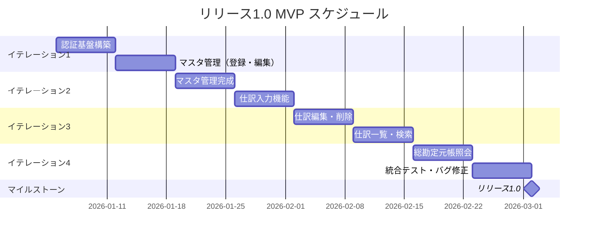
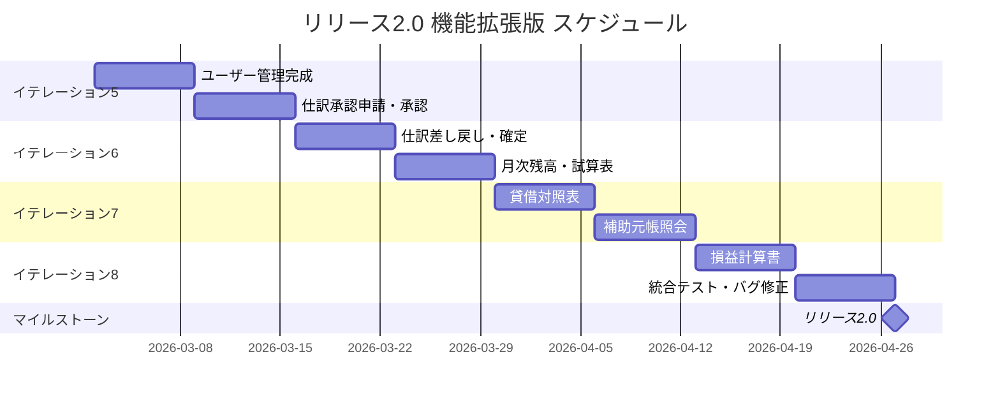
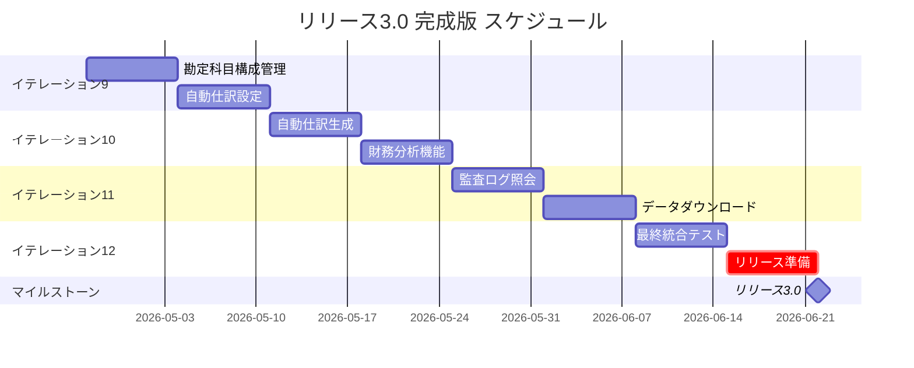
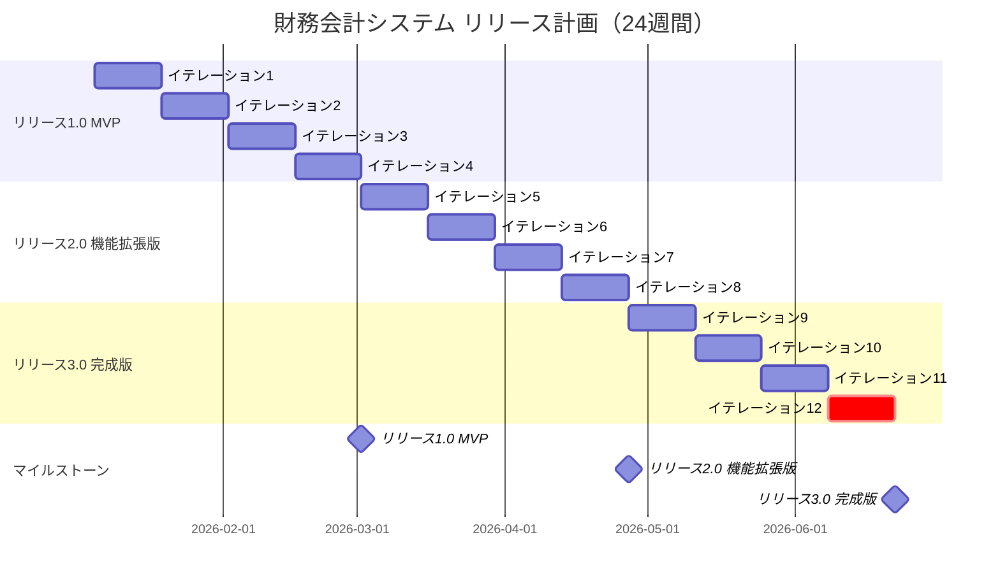

# リリース計画 - 財務会計システム

## 概要

本ドキュメントは、財務会計システムのリリース計画を定義します。XP（エクストリームプログラミング）のプラクティスに基づき、段階的なリリースを通じて顧客価値を最大化します。

## 満足条件

### スコープ

財務会計システムの全機能を3段階でリリースします。

- **リリース1.0（MVP）**: 基本的な仕訳入力と元帳管理
- **リリース2.0（機能拡張版）**: 承認ワークフローと財務諸表
- **リリース3.0（完成版）**: 高度な分析機能とシステム管理

### スケジュール

- **リリース1.0**: イテレーション1〜4（8週間）
- **リリース2.0**: イテレーション5〜8（8週間）
- **リリース3.0**: イテレーション9〜12（8週間）

### リソース

- 開発チーム: 3〜5名
- イテレーション期間: 2週間

## ストーリーポイント見積もり

### 見積もり基準

| ポイント | 複雑度 | 目安 |
|----------|--------|------|
| 1 | 非常に簡単 | 数時間で完了 |
| 2 | 簡単 | 1日以内で完了 |
| 3 | 標準 | 2-3日で完了 |
| 5 | やや複雑 | 3-5日で完了 |
| 8 | 複雑 | 1週間程度 |
| 13 | 非常に複雑 | 分割を検討 |

### ユーザーストーリー見積もり

#### 認証・ユーザー管理（合計: 21SP）

| ストーリーID | ストーリー名 | 優先度 | SP |
|-------------|-------------|--------|-----|
| US-AUTH-001 | ログイン | 必須 | 3 |
| US-AUTH-002 | ログアウト | 必須 | 2 |
| US-AUTH-003 | ユーザー登録 | 必須 | 5 |
| US-AUTH-004 | ユーザー編集 | 必須 | 3 |
| US-AUTH-005 | ユーザー削除 | 必須 | 3 |
| US-AUTH-006 | ユーザー一覧表示 | 必須 | 5 |

#### マスタ管理（合計: 29SP）

| ストーリーID | ストーリー名 | 優先度 | SP |
|-------------|-------------|--------|-----|
| US-MST-001 | 勘定科目登録 | 必須 | 5 |
| US-MST-002 | 勘定科目編集 | 必須 | 3 |
| US-MST-003 | 勘定科目削除 | 必須 | 3 |
| US-MST-004 | 勘定科目一覧表示 | 必須 | 5 |
| US-MST-005 | 勘定科目構成登録 | 重要 | 5 |
| US-MST-006 | 勘定科目構成編集 | 重要 | 3 |
| US-MST-007 | 自動仕訳設定登録 | 重要 | 3 |
| US-MST-008 | 自動仕訳設定編集 | 重要 | 2 |

#### 仕訳管理（合計: 45SP）

| ストーリーID | ストーリー名 | 優先度 | SP |
|-------------|-------------|--------|-----|
| US-JNL-001 | 仕訳入力 | 必須 | 8 |
| US-JNL-002 | 仕訳編集 | 必須 | 5 |
| US-JNL-003 | 仕訳削除 | 必須 | 3 |
| US-JNL-004 | 仕訳一覧表示 | 必須 | 5 |
| US-JNL-005 | 仕訳検索 | 必須 | 5 |
| US-JNL-006 | 自動仕訳生成 | 重要 | 5 |
| US-JNL-007 | 仕訳承認申請 | 必須 | 3 |
| US-JNL-008 | 仕訳承認 | 必須 | 3 |
| US-JNL-009 | 仕訳差し戻し | 必須 | 3 |
| US-JNL-010 | 仕訳確定 | 必須 | 5 |

#### 元帳・残高管理（合計: 26SP）

| ストーリーID | ストーリー名 | 優先度 | SP |
|-------------|-------------|--------|-----|
| US-LDG-001 | 総勘定元帳照会 | 必須 | 5 |
| US-LDG-002 | 補助元帳照会 | 重要 | 5 |
| US-LDG-003 | 日次残高照会 | 必須 | 5 |
| US-LDG-004 | 月次残高照会 | 必須 | 5 |
| US-LDG-005 | 残高試算表表示 | 必須 | 6 |

#### 財務諸表（合計: 21SP）

| ストーリーID | ストーリー名 | 優先度 | SP |
|-------------|-------------|--------|-----|
| US-FS-001 | 貸借対照表表示 | 必須 | 8 |
| US-FS-002 | 損益計算書表示 | 必須 | 8 |
| US-FS-003 | 財務分析表示 | 重要 | 5 |

#### システム管理（合計: 13SP）

| ストーリーID | ストーリー名 | 優先度 | SP |
|-------------|-------------|--------|-----|
| US-SYS-001 | 監査ログ照会 | 必須 | 8 |
| US-SYS-002 | データダウンロード | 重要 | 5 |

### 合計ストーリーポイント

| カテゴリ | ストーリー数 | 合計SP |
|---------|-------------|--------|
| 認証・ユーザー管理 | 6 | 21 |
| マスタ管理 | 8 | 29 |
| 仕訳管理 | 10 | 45 |
| 元帳・残高管理 | 5 | 26 |
| 財務諸表 | 3 | 21 |
| システム管理 | 2 | 13 |
| **総合計** | **34** | **155** |

## 優先順位マトリックス

### 4軸評価

| ストーリーID | 金銭価値 | コスト | 知識習得 | リスク軽減 | 総合優先度 |
|-------------|---------|--------|---------|-----------|-----------|
| US-AUTH-001 | 高 | 低 | 高 | 高 | 最優先 |
| US-MST-001 | 高 | 中 | 高 | 高 | 最優先 |
| US-JNL-001 | 高 | 高 | 高 | 高 | 最優先 |
| US-JNL-004 | 高 | 中 | 中 | 中 | 高 |
| US-LDG-001 | 高 | 中 | 中 | 中 | 高 |
| US-LDG-005 | 高 | 中 | 中 | 高 | 高 |
| US-JNL-007〜010 | 高 | 中 | 中 | 高 | 中 |
| US-FS-001〜002 | 高 | 高 | 中 | 中 | 中 |
| US-FS-003 | 中 | 中 | 中 | 低 | 低 |
| US-SYS-001〜002 | 中 | 中 | 低 | 中 | 低 |

## 段階的リリース戦略

### リリース1.0 MVP（8週間 / 4イテレーション）

**目標**: 基本的な仕訳入力と元帳照会ができる最小限の機能

**含まれるストーリー**: 52SP

| イテレーション | 目標 | ストーリー | SP |
|--------------|------|-----------|-----|
| 1 | 認証基盤とマスタ管理 | US-AUTH-001, 002, 003, US-MST-001, 002 | 18 |
| 2 | マスタ管理完成と仕訳入力 | US-MST-003, 004, US-JNL-001 | 16 |
| 3 | 仕訳管理の基本機能 | US-JNL-002, 003, 004, 005 | 18 |
| 4 | 元帳照会と統合テスト | US-LDG-001, US-LDG-003 | 10 |

**予定ベロシティ**: 13〜16SP/イテレーション

### リリース2.0 機能拡張版（8週間 / 4イテレーション）

**目標**: 承認ワークフローと財務諸表作成

**含まれるストーリー**: 57SP

| イテレーション | 目標 | ストーリー | SP |
|--------------|------|-----------|-----|
| 5 | ユーザー管理完成と承認 | US-AUTH-004, 005, 006, US-JNL-007, 008 | 17 |
| 6 | 承認フロー完成と残高管理 | US-JNL-009, 010, US-LDG-004, 005 | 19 |
| 7 | 財務諸表（貸借対照表） | US-FS-001, US-LDG-002 | 13 |
| 8 | 財務諸表（損益計算書） | US-FS-002 | 8 |

**予定ベロシティ**: 12〜17SP/イテレーション

### リリース3.0 完成版（8週間 / 4イテレーション）

**目標**: 高度な分析機能とシステム管理

**含まれるストーリー**: 46SP

| イテレーション | 目標 | ストーリー | SP |
|--------------|------|-----------|-----|
| 9 | マスタ拡張機能 | US-MST-005, 006, 007, 008 | 13 |
| 10 | 自動仕訳と財務分析 | US-JNL-006, US-FS-003 | 10 |
| 11 | システム管理 | US-SYS-001, US-SYS-002 | 13 |
| 12 | 最終統合とリリース準備 | バッファ・統合テスト | 10 |

**予定ベロシティ**: 10〜13SP/イテレーション

## 全体スケジュール

## ベロシティ見積もり

### 初期見積もり

新規チームのため、代表的なストーリーのタスク分解による見積もりを実施。

**基準ストーリー: US-JNL-001（仕訳入力）= 8SP**

| タスク | 理想時間 |
|--------|---------|
| API設計 | 4h |
| ドメインモデル実装 | 8h |
| リポジトリ実装 | 4h |
| ユースケース実装 | 6h |
| API実装 | 4h |
| 単体テスト | 8h |
| フロントエンド実装 | 16h |
| 統合テスト | 6h |
| **合計** | **56h** |

**ベロシティ計算**:

- チーム人数: 3名
- 1日の作業可能時間: 5時間/人
- 2週間（10営業日）の総作業時間: 3 × 5 × 10 = 150時間
- 基準ストーリー（8SP）の所要時間: 56時間
- 2週間で完了可能なSP: 150 ÷ 56 × 8 ≒ 21SP

**バッファ考慮後の予定ベロシティ: 13〜16SP/イテレーション**

### ベロシティ推移予測

| イテレーション | 予定SP | 実績SP | 累積SP | 残SP | 状態 |
|--------------|--------|--------|--------|------|------|
| 1 | 15 | 18 | 18 | 137 | ✅ 完了 |
| 2 | 14 | 16 | 34 | 121 | ✅ 完了 |
| 3 | 18 | 18 | 52 | 103 | ✅ 完了 |
| 4 | 10 | 10 | 62 | 93 | ✅ 完了（リリース 1.0 MVP 達成） |
| 5 | 17 | 17 | 79 | 76 | ✅ 完了（ユーザー管理・仕訳承認） |
| 6 | 19 | 19 | 98 | 57 | ✅ 完了（仕訳差し戻し・確定・月次残高・試算表完了） |
| 7 | 14 | - | - | - | |
| 8 | 14 | - | - | - | |
| 9 | 13 | - | - | - | |
| 10 | 12 | - | - | - | |
| 11 | 13 | - | - | - | |
| 12 | 10 | - | - | - | |

## バッファ戦略

### フィーチャバッファ

重要度の低いストーリーをフィーチャバッファとして確保（約30%）。

| ストーリーID | ストーリー名 | SP | バッファ対象 |
|-------------|-------------|-----|------------|
| US-MST-005 | 勘定科目構成登録 | 5 | ○ |
| US-MST-006 | 勘定科目構成編集 | 3 | ○ |
| US-MST-007 | 自動仕訳設定登録 | 3 | ○ |
| US-MST-008 | 自動仕訳設定編集 | 2 | ○ |
| US-JNL-006 | 自動仕訳生成 | 5 | ○ |
| US-LDG-002 | 補助元帳照会 | 5 | ○ |
| US-FS-003 | 財務分析表示 | 5 | ○ |
| US-SYS-002 | データダウンロード | 5 | ○ |
| **合計** | | **33** | |

**フィーチャバッファ比率**: 33 / 155 = 21%（目標30%に対してやや少ない）

### スケジュールバッファ

イテレーション12をスケジュールバッファとして確保。

- 予定作業: 最終統合テスト、リリース準備
- 実質的なバッファ: 約10SP相当

## リスク管理

### 技術的リスク

| リスク | 影響 | 対策 |
|-------|------|------|
| JWT認証の実装 | 中 | イテレーション1でスパイク実施 |
| 貸借一致検証ロジック | 高 | 早期にドメインモデル検証 |
| 財務諸表計算の複雑性 | 高 | 段階的な実装とレビュー |
| パフォーマンス | 中 | 各イテレーションで計測 |

### ビジネスリスク

| リスク | 影響 | 対策 |
|-------|------|------|
| 要件変更 | 中 | 各イテレーションでレビュー |
| 優先度変更 | 低 | フィーチャバッファで吸収 |
| リソース不足 | 高 | ベロシティ調整とスコープ見直し |

## 成功指標

### リリース1.0 ✅ 完了（2026-02-06）

- [x] 基本的な仕訳入力ができる（仕訳入力機能完了 2026-01-26）
- [x] 勘定科目マスタを管理できる（登録・編集・削除・検索機能完了 2026-01-26）
- [x] 総勘定元帳を照会できる（総勘定元帳照会完了 2026-02-05）
- [x] 日次残高を照会できる（日次残高照会完了 2026-02-06）
- [x] ユーザー認証が機能する（ログイン/ログアウト/ユーザー登録完了 2026-01-19）
- [x] 仕訳の編集・削除ができる（仕訳編集・削除完了 2026-01-27）
- [x] 仕訳の一覧表示・検索ができる（仕訳一覧・検索完了 2026-02-03）

### リリース2.0

- [x] 仕訳承認ワークフローが機能する（承認申請・承認・差し戻し・確定 完了 2026-02-10）
- [ ] 貸借対照表を出力できる
- [ ] 損益計算書を出力できる
- [x] 残高試算表で貸借一致を確認できる（残高試算表表示完了 2026-02-13）

### リリース3.0

- [ ] 自動仕訳が機能する
- [ ] 財務分析指標を確認できる
- [ ] 監査ログを照会できる
- [ ] 各種データをダウンロードできる

## 更新履歴

| 日付 | バージョン | 更新内容 | 更新者 |
|------|-----------|---------|--------|
| 2025-12-18 | 1.0 | 初版作成 | - |
| 2026-01-20 | 1.1 | リリース1.0成功指標を更新（認証・勘定科目登録完了） | Claude Opus 4.5 |
| 2026-01-20 | 1.2 | イテレーション1全完了を反映（18SP/18SP 達成率100%） | Claude Opus 4.5 |
| 2026-01-26 | 1.3 | イテレーション2全完了を反映（16SP/16SP 達成率100%、予定より4日早期完了） | Claude Opus 4.5 |
| 2026-01-26 | 1.4 | イテレーション3計画を作成（18SP、仕訳編集・削除・一覧・検索） | Claude Opus 4.5 |
| 2026-01-27 | 1.5 | イテレーション3進捗更新（US-JNL-002 仕訳編集完了、5SP） | Claude Opus 4.5 |
| 2026-01-27 | 1.6 | イテレーション3進捗更新（US-JNL-003 仕訳削除完了、8SP累計） | Claude Opus 4.5 |
| 2026-02-03 | 1.7 | イテレーション3全完了を反映（18SP/18SP 達成率100%、US-JNL-004/005 完了、CI E2E修正） | Claude Opus 4.5 |
| 2026-02-05 | 1.8 | イテレーション4計画を作成（10SP、US-LDG-001/003 元帳照会）、SonarQube品質改善完了 | Claude Opus 4.5 |
| 2026-02-05 | 1.9 | イテレーション4 Day1 進捗更新（技術的負債 COMMON-16/17 完了、テスト 278+全件パス） | Claude Opus 4.5 |
| 2026-02-06 | 2.0 | **リリース 1.0 MVP 達成**（イテレーション4全完了、62SP/62SP、US-LDG-001/003 完了、PR #42 作成） | Claude Opus 4.5 |
| 2026-02-07 | 2.1 | イテレーション5計画作成（17SP、ユーザー管理完成・仕訳承認開始）、SonarQube品質改善完了 | Claude Opus 4.5 |
| 2026-02-09 | 2.2 | イテレーション5全完了（17SP/17SP 達成率100%、ユーザー管理・仕訳承認申請・承認完了） | Claude Opus 4.5 |
| 2026-02-10 | 2.3 | イテレーション6進捗更新（US-JNL-009 仕訳差し戻し 3SP + US-JNL-010 仕訳確定 5SP = 8SP 完了） | Claude Opus 4.6 |
| 2026-02-13 | 2.4 | イテレーション6全完了（19SP/19SP 達成率100%）。US-LDG-004 月次残高照会・US-LDG-005 残高試算表完了。GitHub Issue #24,#25,#29,#30 クローズ、Project Status 同期 | Claude Opus 4.6 |
