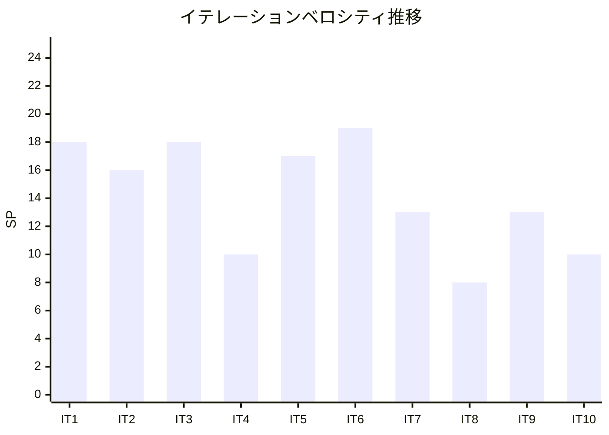

# イテレーション 10 ふりかえり

## イテレーション情報

| 項目 | 内容 |
|------|------|
| イテレーション番号 | 10 |
| 期間 | 2026-02-20 〜 2026-02-21（実質 2 日） |
| 実施日 | 2026-02-21 |
| 参加者 | Claude Opus 4.6, Codex |
| フォーマット | KPT（Keep / Problem / Try） |

---

## 実績サマリー

### 完了状況

| 指標 | 計画 | 実績 | 達成率 |
|------|------|------|--------|
| ストーリーポイント | 10SP | 10SP | 100% |
| ストーリー数 | 2 | 2 | 100% |
| バックエンドテスト | - | 868 パス | ✅ |
| フロントエンドテスト | - | 760 パス | ✅ |
| ビルド状態 | - | 成功 | ✅ |

### 主要成果物

| ストーリーID | ストーリー名 | SP | 状態 | 完了日 |
|-------------|-------------|-----|------|--------|
| US-JNL-006 | 自動仕訳生成 | 5 | ✅ 完了 | 2026-02-21 |
| US-FS-003 | 財務分析表示 | 5 | ✅ 完了 | 2026-02-21 |

### コミット統計（IT-10 期間）

| メトリクス | 値 |
|-----------|-----|
| コミット数 | 15 |
| 機能実装コミット | 4（バックエンド 2 + フロントエンド 2） |
| テストコミット | 6（E2E 3 + ユニットテスト 3） |
| リファクタリング | 3（PMD 修正、E2E 安定性、重複コード抽出） |
| ドキュメント | 2 |

---

## KPT 分析

### Keep（続けること）

#### 技術的成功事項

1. **既存パターン再利用による高速実装**

   - US-JNL-006: IT-5/6 の承認 Command/Service パターン + IT-2 の仕訳入力パターンを再利用
   - US-FS-003: IT-7/8 の貸借対照表・損益計算書パターンを基盤に拡張
   - 両ストーリーとも「既存データ基盤の上に利活用機能を積み上げる」位置づけが明確

2. **amountFormula 評価のシンプルな設計判断**

   - ScriptEngine を使わずパターンマッチベースの簡易評価を採用
   - `amount`、`amount * 0.1` のような基本パターンをカバー
   - 複雑さを最小限に抑え、セキュリティリスクも回避

3. **財務分析の集約パターン確立**

   - 新規 Repository を作らず、既存の BalanceSheetRepository + ProfitAndLossRepository を集約
   - 7 指標（ROE, ROA, NPM, CR, ER, DR, AT）の計算ロジックをサービス層に集約
   - 業界平均値をハードコード定数で実装し、外部依存を排除

4. **E2E テストの充実**

   - US-JNL-006: 12 テストケース（アクセス制御、ダイアログ操作、金額変更、バリデーション）
   - US-FS-003: 17 テストケース（フィルター、指標テーブル、トレンドグラフ、比較期間）
   - MSW ハンドラー追加で E2E テストの安定稼働を確保

5. **SonarQube カバレッジ向上の集中対応**

   - ユニットテスト 65 件追加（前回 29 件 + 今回 36 件）
   - AutoJournalGenerateDialog: 0% → テスト 20 件で大幅改善
   - FinancialAnalysisIndicators / FinancialAnalysisPage: null 値処理・色分けロジック・リトライ等のエッジケースをカバー

#### プロセス的成功事項

1. **IT-9 ふりかえりの Try アクションを反映**

   - Try-3「パターン新規度評価」: 両ストーリーとも「中」評価を計画に反映
   - 実績は評価通り: パターン再利用 + 新規要素の混合で 2 日完了

2. **Claude + Codex の並列開発の安定運用**

   - Claude: 設計・計画・E2E テスト・ドキュメント・品質改善
   - Codex: TDD 実装・ユニットテスト・UI 実装・カバレッジ向上
   - SonarQube カバレッジ向上タスクを Codex に委任し効率的に完了

3. **GitHub Project との同期**

   - Issue #21（US-JNL-006）、#33（US-FS-003）クローズ
   - Project Board 同期完了
   - バーンダウンチャート更新（残 13SP）

---

### Problem（問題点・課題）

#### 見積もり精度の乖離（継続課題）

1. **計画期間と実績期間の大幅な乖離**

   - 計画: 10 日間（2026-02-20 〜 2026-03-05）
   - 実績: 2 日（2026-02-20 〜 2026-02-21）
   - 乖離率 5:1（IT-9 と同水準）
   - 「パターン新規度: 中」の評価は正しかったが、工数予測は依然として過大

2. **SP 見積もりと AI 実装速度の不一致（継続）**

   - US-JNL-006（5SP）: 新規要素（amountFormula 評価、AutoJournalLog）があったが 1 日で完了
   - US-FS-003（5SP）: 既存パターン集約で 1 日で完了
   - AI ペア開発での実効ベロシティは計画の約 5 倍

#### SonarQube Quality Gate の未確認（4 イテレーション連続）

1. **CARRY-01 タスクが IT-7 から 4 イテレーション連続で未完了**

   - SonarQube カバレッジ向上テスト（65 件追加）は実施したが、Quality Gate 自体の確認は IT-11 に持ち越し
   - テスト総数は増加（バックエンド 868、フロントエンド 760）しており実質的リスクは低い
   - ただし、品質保証プロセスとして IT-11 で確実に実施する必要がある

#### SonarQube New Code カバレッジの部分的な課題

1. **AutoJournalGenerateDialog.tsx のカバレッジ**

   - SonarQube の New Code カバレッジで 26.2%（283 uncovered lines）と報告
   - 20 件のユニットテストを追加したが、完全な行カバレッジには至っていない可能性
   - 実際のカバレッジ改善効果は次回 SonarQube スキャンで確認必要

---

### Try（次に試すこと）

| # | アクション | 責任者 | 期限 | 内容 | 期待効果 |
|---|-----------|--------|------|------|----------|
| 1 | SonarQube Quality Gate 確認・パス | Claude | IT-11 初日 | 4 イテレーション分の Quality Gate を確実に確認しパスさせる | 品質保証の確認 |
| 2 | リリース完了チェックリスト導入 | Claude | IT-11 | コミット・Quality Gate・ドキュメント更新・GitHub 同期の完了確認リストを標準化 | 漏れ防止 |
| 3 | IT-11 計画で実績ベースの期間見積もり | Claude | IT-11 計画時 | AI ペア開発の実効速度を考慮し、計画期間を「実績 2-3 日 + バッファ 2 日」程度に設定 | 計画精度向上 |
| 4 | Codex への品質タスク委任の標準化 | Claude | IT-11 | SonarQube カバレッジ向上タスクを Codex に並列委任するパターンを標準プラクティスに | 効率向上 |

---

## 次イテレーションへの引き継ぎ事項

### IT-11 計画準備

1. **IT-11 計画作成**: US-SYS-001（監査ログ照会 8SP）+ US-SYS-002（データダウンロード 5SP）= 13SP
2. **SonarQube Quality Gate 確認**: IT-7〜10 での保留事項を解消
3. **US-SYS-001 は新規パターン要素が多い**: 監査ログは既存テーブルにはなく、新たな仕組みが必要
4. **US-SYS-002 は既存データのエクスポート**: BS/PL エクスポート（IT-7）のパターンを再利用可能

### Release 3.0 残スコープ（残 13SP）

| イテレーション | ストーリー | SP |
|--------------|-----------|-----|
| IT-11 | US-SYS-001, US-SYS-002（監査ログ・データダウンロード） | 13 |
| IT-12 | バッファ・統合テスト・リリース準備 | 10 |

---

## メトリクス

### 品質メトリクス

| メトリクス | バックエンド | フロントエンド |
|-----------|-------------|---------------|
| テストケース数 | 868 | 760 |
| テスト合格率 | 100% | 100% |
| ビルド状態 | ✅ 成功 | ✅ 成功 |
| E2E テスト（US-JNL-006） | - | 12 パス |
| E2E テスト（US-FS-003） | - | 17 パス |
| 追加ユニットテスト | - | 65 件（IT-10 期間中） |

### プロセスメトリクス

| メトリクス | 計画 | 実績 |
|-----------|------|------|
| イテレーション期間 | 10 日 | 2 日 |
| ベロシティ | 10SP | 10SP |
| 達成率 | 100% | 100% |

---

## ベロシティ推移

### 全イテレーション実績（Release 1.0 + Release 2.0 + Release 3.0）

| イテレーション | 計画 SP | 実績 SP | 計画期間 | 実績期間 | リリース |
|---------------|---------|---------|----------|----------|----------|
| 1 | 15 | 18 | 2 週間 | 2 週間 | 1.0 |
| 2 | 14 | 16 | 2 週間 | 1 週間 | 1.0 |
| 3 | 18 | 18 | 2 週間 | 1 週間 | 1.0 |
| 4 | 10 | 10 | 2 週間 | 2 日 | 1.0 |
| 5 | 17 | 17 | 2 週間 | 3 日 | 2.0 |
| 6 | 19 | 19 | 2 週間 | 4 日 | 2.0 |
| 7 | 13 | 13 | 2 週間 | 3 日 | 2.0 |
| 8 | 8 | 8 | 2 週間 | 1 日 | 2.0 |
| 9 | 13 | 13 | 2 週間 | 2 日 | 3.0 |
| 10 | 10 | 10 | 2 週間 | 2 日 | 3.0 |
| **累計** | **137** | **142** | **20 週間** | **約 6 週間** | |

**平均ベロシティ**: 14.2 SP/イテレーション
**実績累計期間効率**: 142SP / 約 6 週間 = 約 23.7 SP/週

### ベロシティトレンド

---

## 学び（Lessons Learned）

### 技術的学び

1. **「集約パターン」の有効性**

   - US-FS-003 では新規 Repository を作らず、既存 BS/PL Repository を集約する設計を採用
   - データアクセス層の重複を避け、サービス層で計算ロジックに集中
   - ヘキサゴナルアーキテクチャの Output Port 再利用パターンとして標準化

2. **amountFormula 評価のシンプルさの価値**

   - パターンマッチベースの簡易評価で十分な機能をカバー
   - 「amount」「amount * 0.1」のような基本式で実務上の需要を満たせる
   - YAGNI（You Aren't Gonna Need It）の実践例

3. **SpotBugs: record + Map フィールドの対応**

   - `@SuppressFBWarnings("EI_EXPOSE_REP")` + `Map.copyOf()` in compact constructor
   - record + List（IT-9 で学習）に続き、record + Map の防御的コピーパターンを確立

4. **ESLint complexity と nullish coalescing**

   - `??`（nullish coalescing）が ESLint の分岐カウントに含まれる
   - ヘルパー関数抽出で complexity を max 7 以下に抑える
   - MSW handlers.ts の `faRatio` ヘルパー抽出がこのパターンの好例

### プロセス的学び

1. **Codex への品質タスク委任の有効性**

   - SonarQube カバレッジ向上テスト 36 件を Codex に並列委任し、短時間で完了
   - 2 つの Codex セッションを並列実行（大ファイル用 + 小改善 3 ファイル用）
   - TypeScript 型エラー（User 型の `id` プロパティ）を Codex が生成→手動修正のワークフローが確立

2. **「データ基盤→利活用機能」の段階的実装戦略**

   - IT-7/8: 財務諸表データ基盤 → IT-10: 財務分析（利活用）
   - IT-9: 自動仕訳パターンマスタ → IT-10: 自動仕訳生成（利活用）
   - 基盤を先に構築し、その上に利活用機能を積む戦略が効果的

---

## 総評

### 成功した点

- **2 ストーリー（10SP）を 2 日で全完了**: 計画 10 日に対して 5 倍の効率
- **テスト総数 1,628 件が全件パス**: バックエンド 868 + フロントエンド 760
- **E2E テスト 29 件追加**: US-JNL-006（12件）+ US-FS-003（17件）
- **ユニットテスト 65 件追加**: SonarQube カバレッジ向上の集中対応
- **累計 142SP 完了**: プロジェクト全体の 91.6% が完了（残 13SP）
- **リリース 3.0 の 2/4 イテレーション完了**: 23SP/46SP 消化

### 改善が必要な点

- **SonarQube Quality Gate**: 4 イテレーション連続で未確認（IT-11 で必ず実施）
- **見積もり精度**: 計画 10 日 → 実績 2 日（乖離率 5:1、IT-9 と同水準）
- **Codex 生成コードの型チェック**: TypeScript 型エラーが pre-commit で検出される場面あり

### 総合評価

イテレーション 10 は**成功**でした。リリース 3.0 完成版の 2 番目のイテレーションとして、自動仕訳生成（US-JNL-006）と財務分析表示（US-FS-003）を 2 日で 100% 達成しました。

両ストーリーとも「既存データ基盤の利活用機能」という位置づけで、IT-9 の自動仕訳パターンマスタと IT-7/8 の財務諸表データを前提に実装しました。新規要素（amountFormula 評価、指標計算ロジック）はありましたが、既存パターンの再利用が効き、計画の「パターン新規度: 中」という評価通りの結果でした。

累計 142SP を完了し、プロジェクト全体の **91.6%** が完了しています。残り 13SP（US-SYS-001 監査ログ 8SP + US-SYS-002 データダウンロード 5SP）は IT-11 で実装予定です。IT-12 はバッファ・統合テスト・リリース準備に充てます。

---

## 更新履歴

| 日付 | 更新内容 | 更新者 |
|------|---------|--------|
| 2026-02-21 | 初版作成 | Claude Opus 4.6 |

---

## 関連ドキュメント

- [イテレーション 10 計画](./iteration_plan-10.md)
- [イテレーション 9 ふりかえり](./retrospective-9.md)
- [リリース計画](./release_plan.md)
- [ユーザーストーリー](../requirements/user_story.md)
