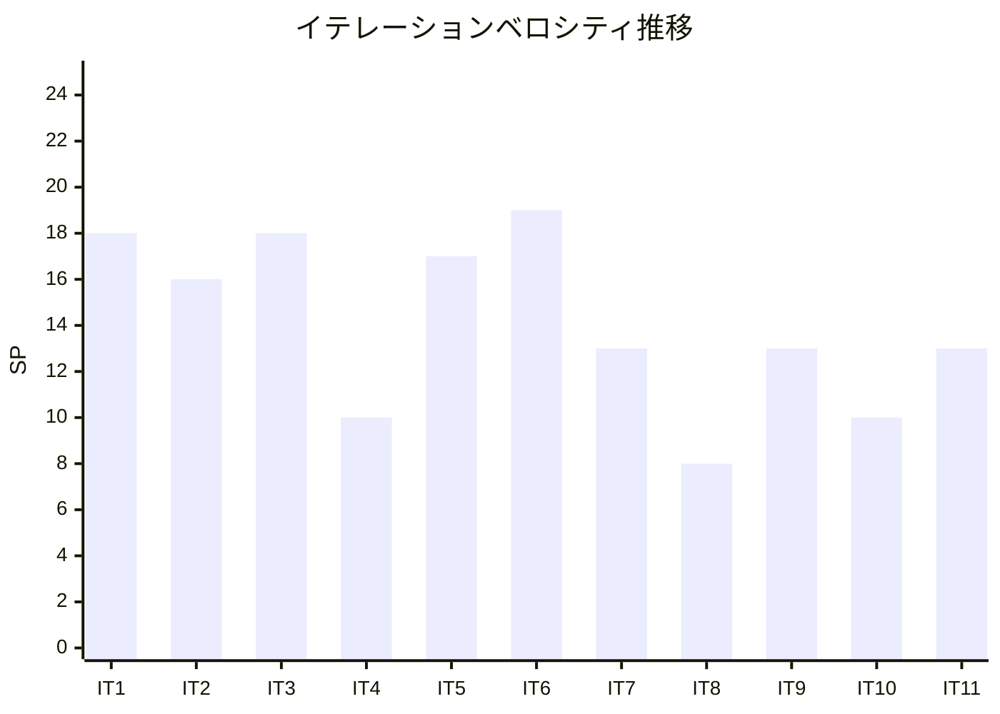

# イテレーション 11 ふりかえり

## イテレーション情報

| 項目 | 内容 |
|------|------|
| イテレーション番号 | 11 |
| 期間 | 2026-02-22 〜 2026-02-24（実質 3 日） |
| 実施日 | 2026-02-24 |
| 参加者 | Claude Opus 4.6, Codex |
| フォーマット | KPT（Keep / Problem / Try） |

---

## 実績サマリー

### 完了状況

| 指標 | 計画 | 実績 | 達成率 |
|------|------|------|--------|
| ストーリーポイント | 13SP | 13SP | 100% |
| ストーリー数 | 2 | 2 | 100% |
| CI ワークフロー | 5/5 | 5/5 全パス | ✅ |
| ビルド状態 | - | 成功 | ✅ |

### 主要成果物

| ストーリーID | ストーリー名 | SP | 状態 | 完了日 |
|-------------|-------------|-----|------|--------|
| US-SYS-001 | 監査ログ照会 | 8 | ✅ 完了 | 2026-02-23 |
| US-SYS-002 | データダウンロード | 5 | ✅ 完了 | 2026-02-23 |

### コミット統計（IT-11 期間）

| メトリクス | 値 |
|-----------|-----|
| コミット数 | 15 |
| 機能実装コミット | 3（監査ログ 1 + データダウンロード 2） |
| テスト修正コミット | 5（E2E 安定性修正 4 + テストモック修正 1） |
| リファクタリング | 4（E2E テスト重複コード削減 3 + テスト構造簡素化 1） |
| ドキュメント | 2 |
| バグ修正 | 1（元帳ページ state.size 即時更新） |

---

## KPT 分析

### Keep（続けること）

#### 技術的成功事項

1. **監査ログの横断的組み込みをシンプルに実現**

   - `AuditEventPublisher` で疎結合化し、各サービスの成功時のみ記録
   - 認証（ログイン/ログアウト）、仕訳 CRUD、承認ワークフローへの組み込みを最小侵襲で実装
   - 新規テーブル + ドメインモデル + MyBatis Mapper + API + フロントエンド UI を 1 コミットで一括実装

2. **データダウンロード機能の効率的な拡張実装**

   - IT-7 で確立した `AbstractStatementExportService` パターンを複数データ（仕訳一覧、総勘定元帳、試算表）に展開
   - 既存の BS/PL エクスポートに CSV 形式を追加
   - BOM 付き UTF-8 出力で Excel での日本語文字化け防止を標準化
   - バックエンド + フロントエンドを 2 コミットで完了

3. **E2E テストの安定性改善に注力**

   - CI 環境で発生する Cypress/React タイミング問題を根本解決
   - 監査ログテスト: `cy.get()` を変数に格納して再利用する Cypress アンチパターンを修正
   - 総勘定元帳テスト: ネイティブ DOM API（`HTMLSelectElement.prototype.value` setter + `dispatchEvent`）で React 再レンダリング中の DOM 脱着を回避
   - このパターンは今後の全 `<select>` 値変更テストに再利用可能

4. **E2E テストの重複コード削減**

   - `ledgerTestConfig.ts` に共通ヘルパー関数（`createVisitFunction`, `describeAccessControl`, `describeErrorHandling`）を抽出
   - 監査ログ E2E テスト: `forEach` パターンでアクセス制御テストの重複を解消
   - 総勘定元帳 E2E テスト: 共通設定オブジェクト `TEST_CONFIG` の構造化

5. **プロダクションコードのバグ修正**

   - `GeneralLedgerPage.tsx` と `SubsidiaryLedgerPage.tsx` の `handleItemsPerPageChange` で `state.size` を即座に更新するよう修正
   - React の制御コンポーネント（`<select value={state.size}>`）で値が巻き戻る問題を解消
   - `JournalEntryListPage.tsx` の既存パターンに統一

#### プロセス的成功事項

1. **IT-10 ふりかえりの Try アクションを反映**

   - Try-3「実績ベースの期間見積もり」: 計画 10 日、実績見込み 3-4 日と記載 → 実績 3 日で合致
   - パターン新規度評価: US-SYS-001「中〜高」、US-SYS-002「中」→ 適切な見積もり

2. **全 155SP の機能ストーリー実装完了**

   - 34 ユーザーストーリーすべてが IT-11 で完了
   - リリース 1.0（52SP）+ 2.0（57SP）+ 3.0（46SP）= 155SP
   - IT-12 はバッファ・統合テスト・リリース準備に充当可能

3. **CI 全 5 ワークフロー安定パス**

   - Frontend CI, Backend CI, E2E Tests, Frontend SonarQube, Backend SonarQube
   - E2E テストの安定性改善により、CI の信頼性が向上

---

### Problem（問題点・課題）

#### E2E テストの CI 不安定性（新規検出）

1. **Cypress/React のタイミング問題が CI 環境で頻発**

   - 開発環境（`dev:e2e`）では通るテストが CI 環境で失敗するケースが複数発生
   - 原因: CI 環境のマシン速度差により React 再レンダリングのタイミングが変わる
   - 監査ログテスト: `cy.get()` を変数に格納する Cypress アンチパターン
   - 総勘定元帳テスト: `cy.select()` 実行中の DOM 脱着（4 回の CI 反復で解決）
   - 修正に 5 コミット（fix(e2e) 4 + fix 1）を要し、E2E 安定性が IT-11 の主要課題となった

2. **React 制御コンポーネントと Cypress の相性問題**

   - `<select value={state.size}>` のような制御コンポーネントで、`cy.select()` が値を設定しても React が即座に旧値で再レンダリング
   - 根本原因: `handleItemsPerPageChange` が `state.size` を更新する前に fetch を開始
   - プロダクションコードのバグとテストの不安定性が複合的に絡み合っていた

#### 見積もり精度の乖離（継続課題）

1. **計画期間と実績期間の乖離**

   - 計画: 10 日間（2026-02-22 〜 2026-03-05）
   - 実績: 3 日（2026-02-22 〜 2026-02-24）
   - 乖離率 3.3:1（IT-9/10 の 5:1 より改善、E2E 修正分を含む）

#### IT-10 引き継ぎタスクの未完了（継続課題）

1. **CARRY-01: SonarQube Quality Gate 確認**

   - CI の SonarQube ワークフローはパスしているが、明示的な Quality Gate 確認は未実施
   - 5 イテレーション連続で持ち越し（IT-7 〜 IT-11）
   - CI パスにより実質的リスクは低いが、プロセスとしての確認は IT-12 で実施すべき

2. **CARRY-02: リリース完了チェックリスト作成**

   - iteration_plan-11.md にチェックリストテンプレートを記載したが、運用としての確認は未実施

---

### Try（次に試すこと）

| # | アクション | 責任者 | 期限 | 内容 | 期待効果 |
|---|-----------|--------|------|------|----------|
| 1 | E2E テスト安定性パターンの標準化 | Claude | IT-12 | ネイティブ DOM API パターン、`cy.get()` 再取得パターンをテストガイドラインに明文化 | CI 不安定テストの予防 |
| 2 | SonarQube Quality Gate 最終確認 | Claude | IT-12 | 全イテレーション分の Quality Gate を確認し、リリース 3.0 の品質保証完了 | 品質保証プロセス完了 |
| 3 | リリース完了チェックリスト運用 | Claude | IT-12 | IT-11 計画に記載のチェックリストを IT-12 の統合テスト・リリース準備で運用 | プロセス標準化 |
| 4 | 統合テスト・リグレッションテスト実施 | Claude | IT-12 | 全 34 ストーリーの受入条件を横断的に確認、クロス機能テスト実施 | リリース品質確保 |

---

## 次イテレーションへの引き継ぎ事項

### IT-12 計画準備

1. **IT-12 はバッファ・統合テスト・リリース準備**: 全機能ストーリーが完了済み（155SP/155SP）
2. **統合テスト**: 全ユーザーストーリーの受入条件横断確認
3. **SonarQube Quality Gate 最終確認**: 5 イテレーション分の引き継ぎ事項を解消
4. **リリースノート v3.0 作成**: Release 3.0 完成版のリリースノート
5. **E2E テスト安定性ガイドライン**: IT-11 で得た知見を明文化

### Release 3.0 残スコープ（残 0SP + バッファ 10SP）

| イテレーション | ストーリー | SP |
|--------------|-----------|-----|
| IT-12 | バッファ・統合テスト・リリース準備 | 10（バッファ） |

---

## メトリクス

### 品質メトリクス

| メトリクス | 値 |
|-----------|-----|
| CI ワークフロー | 5/5 全パス |
| E2E テスト（監査ログ） | パス |
| E2E テスト（総勘定元帳） | パス（安定性修正後） |
| E2E テスト安定性修正 | 5 コミット（監査ログ 1 + 総勘定元帳 4） |
| プロダクションバグ修正 | 1 件（元帳ページ state.size） |

### プロセスメトリクス

| メトリクス | 計画 | 実績 |
|-----------|------|------|
| イテレーション期間 | 10 日 | 3 日 |
| ベロシティ | 13SP | 13SP |
| 達成率 | 100% | 100% |

---

## ベロシティ推移

### 全イテレーション実績（Release 1.0 + Release 2.0 + Release 3.0）

| イテレーション | 計画 SP | 実績 SP | 計画期間 | 実績期間 | リリース |
|---------------|---------|---------|----------|----------|----------|
| 1 | 15 | 18 | 2 週間 | 2 週間 | 1.0 |
| 2 | 14 | 16 | 2 週間 | 1 週間 | 1.0 |
| 3 | 18 | 18 | 2 週間 | 1 週間 | 1.0 |
| 4 | 10 | 10 | 2 週間 | 2 日 | 1.0 |
| 5 | 17 | 17 | 2 週間 | 3 日 | 2.0 |
| 6 | 19 | 19 | 2 週間 | 4 日 | 2.0 |
| 7 | 13 | 13 | 2 週間 | 3 日 | 2.0 |
| 8 | 8 | 8 | 2 週間 | 1 日 | 2.0 |
| 9 | 13 | 13 | 2 週間 | 2 日 | 3.0 |
| 10 | 10 | 10 | 2 週間 | 2 日 | 3.0 |
| 11 | 13 | 13 | 2 週間 | 3 日 | 3.0 |
| **累計** | **150** | **155** | **22 週間** | **約 7 週間** | |

**平均ベロシティ**: 14.1 SP/イテレーション
**実績累計期間効率**: 155SP / 約 7 週間 = 約 22.1 SP/週

### ベロシティトレンド

---

## 学び（Lessons Learned）

### 技術的学び

1. **Cypress/React タイミング問題の根本対処パターン**

   - `cy.get()` の結果を変数に格納して再利用してはいけない（Cypress の非同期コマンドキューが壊れる）
   - React の制御コンポーネント（`<select value={...}>`）に `cy.select()` を使う場合、React の再レンダリング中に DOM が脱着する
   - 根本解決: `.then()` コールバック内でネイティブ DOM API を使い、同期的に値を設定 + `dispatchEvent` で React に通知
   - このパターンは「Cypress が提供する `.select()` コマンドでは React の制御コンポーネントを安全に操作できない場合がある」という重要な知見

2. **React 制御コンポーネントの state 更新タイミング**

   - `handleItemsPerPageChange` で fetch を先に呼び、`state.size` を後から更新すると、React が旧値で `<select>` を再レンダリングする
   - 正しいパターン: `setState` で即座に UI 状態を更新してから非同期処理を開始
   - `JournalEntryListPage.tsx` が正しいパターンを持っていたが、`GeneralLedgerPage.tsx` と `SubsidiaryLedgerPage.tsx` には反映されていなかった

3. **E2E テストの共通化パターンの有効性**

   - `ledgerTestConfig.ts` の `createVisitFunction`, `describeAccessControl`, `describeErrorHandling` により、新規ページのテストを高速に構築
   - `forEach` パターンでアクセス制御テストの重複を大幅に削減
   - テスト可読性と保守性の両立

### プロセス的学び

1. **CI 環境と開発環境の差異を常に意識する**

   - `dev:e2e`（MSW モック）で通るテストが CI で失敗するケースは速度差が原因
   - テスト作成時に「CI 環境のタイミング」を意識した設計が必要
   - タイムアウト値の設定、リトライ戦略、DOM 安定性の確認を標準プラクティスに

2. **E2E テスト修正の反復コスト**

   - 今回 5 コミットを要した（4 回の CI 反復）
   - 根本原因の特定（プロダクションバグ + テストパターン）に時間がかかった
   - 早期に `JournalEntryListPage.tsx` との比較を行っていれば、1-2 回で解決できた可能性

3. **全機能ストーリー完了のマイルストーン達成**

   - 155SP / 34 ストーリーを 11 イテレーション（実質約 7 週間）で完了
   - AI ペア開発の効率は計画（22 週間）の約 3 倍
   - IT-12 のバッファ期間を統合テスト・リリース品質向上に充当可能

---

## 総評

### 成功した点

- **2 ストーリー（13SP）を 3 日で全完了**: 計画 10 日に対して 3.3 倍の効率
- **全 155SP の機能ストーリー実装完了**: プロジェクト全体の機能開発が 100% 完了
- **CI 全 5 ワークフロー安定パス**: E2E テスト安定性修正により CI の信頼性が向上
- **E2E テスト安定性の根本解決**: ネイティブ DOM API パターンを確立
- **プロダクションバグ修正**: 元帳ページの state.size 即時更新で UX 改善
- **テストコード品質向上**: E2E テストの重複コード削減、共通ヘルパー関数の活用

### 改善が必要な点

- **E2E テスト CI 安定性**: 開発環境で通るテストが CI で失敗する問題に 5 コミットを要した
- **SonarQube Quality Gate**: 5 イテレーション連続で明示的確認が未実施（CI パスで実質的リスクは低い）
- **リリース完了チェックリスト**: テンプレートは作成したが運用は未開始

### 総合評価

イテレーション 11 は**成功**でした。リリース 3.0 完成版の最終機能実装イテレーションとして、監査ログ照会（US-SYS-001）とデータダウンロード（US-SYS-002）を 3 日で 100% 達成しました。

特筆すべきは、機能実装自体は 1 日で完了し、残り 2 日を E2E テストの CI 安定性改善に充てた点です。CI 環境での Cypress/React タイミング問題に対し、ネイティブ DOM API パターンという根本解決策を確立しました。この知見は今後のプロジェクト全体に適用可能な標準パターンです。

**全 155SP（34 ストーリー）の機能実装が完了**し、プロジェクトは IT-12（バッファ・統合テスト・リリース準備）に進む準備が整いました。11 イテレーション（実質約 7 週間）で 155SP を完了し、計画 22 週間に対して約 3 倍の効率を実現しました。

---

## 更新履歴

| 日付 | 更新内容 | 更新者 |
|------|---------|--------|
| 2026-02-24 | 初版作成 | Claude Opus 4.6 |

---

## 関連ドキュメント

- [イテレーション 11 計画](./iteration_plan-11.md)
- [イテレーション 10 ふりかえり](./retrospective-10.md)
- [リリース計画](./release_plan.md)
- [ユーザーストーリー](../requirements/user_story.md)
