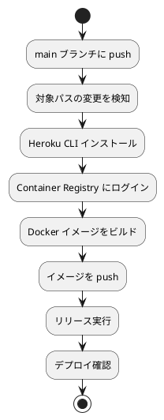

# デモ環境デプロイ手順

本ドキュメントでは、GitHub Actions を使用した Heroku へのデモ環境デプロイについて説明します。

## 概要

| 項目 | 内容 |
|------|------|
| デプロイ先 | Heroku Container Registry |
| トリガー | main ブランチへの push / 手動実行 |
| デプロイ方式 | Docker イメージ |

### デプロイ対象

| アプリケーション | Heroku アプリ名 | URL |
|------------------|-----------------|-----|
| バックエンド | case-study-accounting-backend | https://case-study-accounting-backend-8d23bb5e8bbe.herokuapp.com |
| フロントエンド | case-study-accounting-frontend | https://case-study-accounting-frontend-2cb4e7e16f2f.herokuapp.com |

## GitHub Actions ワークフロー

### ワークフローファイル

| ファイル | 対象 | パストリガー |
|----------|------|--------------|
| `.github/workflows/backend-deploy.yml` | バックエンド | `apps/backend/**` |
| `.github/workflows/frontend-deploy.yml` | フロントエンド | `apps/frontend/**` |

### 処理フロー



## 事前準備

### 1. Heroku アプリの作成

```bash
# バックエンド
heroku create case-study-accounting-backend

# フロントエンド
heroku create case-study-accounting-frontend
```

### 2. Heroku API キーの取得

```bash
heroku auth:token
```

または Heroku ダッシュボード → Account Settings → API Key から取得。

### 3. GitHub Secrets の設定

リポジトリの Settings → Secrets and variables → Actions で以下を登録：

| シークレット名 | 内容 |
|----------------|------|
| `HEROKU_BACKEND_API_KEY` | バックエンド用 Heroku API キー |
| `HEROKU_FRONTEND_API_KEY` | フロントエンド用 Heroku API キー |

## 自動デプロイ

### トリガー条件

- **自動実行**: main ブランチへの push 時（対象パスに変更がある場合）
- **手動実行**: GitHub Actions の「Run workflow」ボタン

### バックエンドのデプロイ

`apps/backend/` 配下のファイルが変更された場合に自動実行。

```yaml
on:
  push:
    branches: [ main ]
    paths:
      - 'apps/backend/**'
      - '.github/workflows/backend-deploy.yml'
  workflow_dispatch:
```

### フロントエンドのデプロイ

`apps/frontend/` 配下のファイルが変更された場合に自動実行。

```yaml
on:
  push:
    branches: [ main ]
    paths:
      - 'apps/frontend/**'
      - '.github/workflows/frontend-deploy.yml'
  workflow_dispatch:
```

## 手動デプロイ

### GitHub Actions から手動実行

1. GitHub リポジトリの **Actions** タブを開く
2. 左サイドバーから対象のワークフローを選択
   - `Backend Deploy to Heroku`
   - `Frontend Deploy to Heroku`
3. **Run workflow** ボタンをクリック
4. ブランチを選択して **Run workflow** を実行

### ローカルから手動実行

Gulp タスクを使用してローカルからデプロイすることも可能です。

```bash
# バックエンドのみ
npx gulp deploy:backend

# フロントエンドのみ
npx gulp deploy:frontend

# 両方
npx gulp deploy:all

# デプロイ状態確認
npx gulp deploy:status
```

詳細は以下のドキュメントを参照：

- [バックエンドデモ環境](backend_demo_env.md)
- [フロントエンドデモ環境](frontend_demo_env.md)

## トラブルシューティング

### Heroku CLI が見つからない

ワークフローに Heroku CLI のインストールステップが含まれていることを確認：

```yaml
- name: Install Heroku CLI
  run: curl https://cli-assets.heroku.com/install.sh | sh
```

### 認証エラー

`HEROKU_BACKEND_API_KEY` / `HEROKU_FRONTEND_API_KEY` シークレットが正しく設定されているか確認：

```bash
# ローカルで API キーを確認
heroku auth:token

# GitHub Secrets に同じ値が設定されているか確認
# バックエンド用: HEROKU_BACKEND_API_KEY
# フロントエンド用: HEROKU_FRONTEND_API_KEY
```

### Docker ビルドエラー

ローカルで Docker ビルドが成功することを確認：

```bash
# バックエンド
docker build -t test-backend ./apps/backend

# フロントエンド
docker build -t test-frontend ./apps/frontend
```

### デプロイ後にアプリが起動しない

Heroku ログを確認：

```bash
# バックエンド
heroku logs --tail -a case-study-accounting-backend

# フロントエンド
heroku logs --tail -a case-study-accounting-frontend
```

## 参考リンク

- [GitHub ActionsでHerokuにデプロイする](https://zenn.dev/kent0011/articles/8e7e9a153a54c4)
- [Heroku Container Registry & Runtime](https://devcenter.heroku.com/articles/container-registry-and-runtime)
- [GitHub Actions documentation](https://docs.github.com/en/actions)
