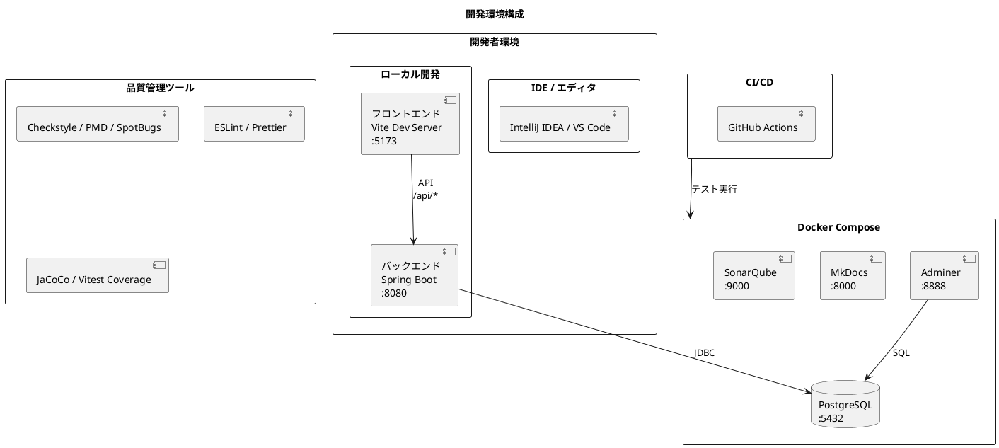
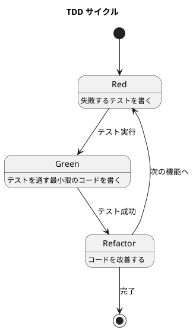

# 開発環境解説

## 概要

本ドキュメントは、財務会計システムの開発環境について解説します。開発を始める前に必要な環境構築から日常的な開発ワークフローまでをカバーしています。

## 開発環境の全体像



## 前提条件

### 必須ソフトウェア

| ソフトウェア | バージョン | 用途 |
|-------------|-----------|------|
| Java | 25 以上 | バックエンド開発 |
| Node.js | 24.x | フロントエンド開発 |
| Docker | 24.x 以上 | コンテナ実行 |
| Docker Compose | v2 以上 | マルチコンテナ管理 |
| Git | 最新版 | バージョン管理 |

### 推奨ツール

| ツール | 用途 |
|--------|------|
| IntelliJ IDEA Ultimate | Java / Spring Boot 開発 |
| VS Code | フロントエンド開発、汎用エディタ |
| Postman / curl | API テスト |
| Graphviz | JIG-ERD ダイアグラム生成 |

## クイックスタート

### 1. リポジトリのクローン

```bash
git clone https://github.com/k2works/case-study-accounting.git
cd case-study-accounting
```

### 2. 依存関係のインストール

```bash
# ルートの依存関係（husky, lint-staged など）
npm install

# フロントエンドの依存関係
cd apps/frontend
npm install
cd ../..
```

### 3. データベースの起動

```bash
docker compose up -d postgres adminer
```

### 4. バックエンドの起動

```bash
cd apps/backend
./gradlew bootRun
```

バックエンドが起動すると、自動的に Swagger UI にリダイレクトされます。

**アクセス URL:**
- Swagger UI: http://localhost:8080
- API エンドポイント: http://localhost:8080/api

### 5. フロントエンドの起動

```bash
cd apps/frontend
npm run dev
```

**アクセス URL:**
- フロントエンド: http://localhost:5173

### 6. ログイン

デフォルトのテストユーザーでログインできます。

| ユーザー名 | パスワード | ロール |
|-----------|-----------|--------|
| admin | Password123! | 管理者 |
| manager | Password123! | 経理責任者 |
| user | Password123! | 経理担当者 |
| viewer | Password123! | 閲覧者 |

## npm スクリプト

プロジェクトルートから実行できる npm スクリプト一覧です。

### 開発

| コマンド | 説明 |
|---------|------|
| `npm start` | 開発環境起動（MkDocs サーバー） |
| `npm run dev:backend` | バックエンド開発サーバー起動 |
| `npm run dev:frontend` | フロントエンド開発サーバー起動 |
| `npm run dev:frontend:e2e` | フロントエンド E2E テスト用サーバー起動 |

### ドキュメント

| コマンド | 説明 |
|---------|------|
| `npm run docs:serve` | MkDocs サーバー起動 |
| `npm run docs:stop` | MkDocs サーバー停止 |
| `npm run docs:build` | MkDocs ドキュメントビルド |
| `npm run journal` | 作業履歴（ジャーナル）生成 |

### フロントエンド

| コマンド | 説明 |
|---------|------|
| `npm run frontend:lint` | ESLint 実行 |
| `npm run frontend:format` | フォーマットチェック |
| `npm run frontend:test` | テスト実行 |
| `npm run frontend:check` | lint + format チェック |
| `npm run frontend:build` | 本番ビルド |

### バックエンド

| コマンド | 説明 |
|---------|------|
| `npm run backend:check` | Gradle check 実行 |

### デプロイ

| コマンド | 説明 |
|---------|------|
| `npm run deploy:backend` | バックエンドをデプロイ |
| `npm run deploy:frontend` | フロントエンドをデプロイ |
| `npm run deploy:all` | 全アプリケーションをデプロイ |
| `npm run deploy:status` | デプロイ状態確認 |
| `npm run deploy:open` | デプロイ済みアプリをブラウザで開く |
| `npm run deploy:backend:open` | バックエンドをブラウザで開く |
| `npm run deploy:frontend:open` | フロントエンドをブラウザで開く |
| `npm run deploy:backend:logs` | バックエンドログ表示 |
| `npm run deploy:frontend:logs` | フロントエンドログ表示 |

## サービス一覧

### アプリケーションサービス

| サービス | URL | 説明 |
|---------|-----|------|
| フロントエンド（開発） | http://localhost:5173 | Vite 開発サーバー |
| フロントエンド（Docker） | http://localhost:3001 | nginx |
| バックエンド API | http://localhost:8080/api | Spring Boot |
| Swagger UI | http://localhost:8080/swagger-ui.html | API ドキュメント |

### 開発支援サービス

| サービス | URL | 説明 |
|---------|-----|------|
| Adminer | http://localhost:8888 | データベース管理 GUI |
| MkDocs | http://localhost:8000 | ドキュメントサーバー |
| SonarQube | http://localhost:9000 | コード品質分析 |

### データベース接続情報

| 項目 | 値 |
|------|-----|
| ホスト | localhost |
| ポート | 5432 |
| データベース | accounting |
| ユーザー | postgres |
| パスワード | postgres |
| JDBC URL | `jdbc:postgresql://localhost:5432/accounting` |

## プロジェクト構成

```
case-study-accounting/
├── apps/
│   ├── backend/                    # Spring Boot バックエンド
│   │   ├── src/main/java/          #   Java ソースコード
│   │   ├── src/main/resources/     #   設定ファイル、SQL
│   │   ├── src/test/               #   テストコード
│   │   ├── build.gradle.kts        #   Gradle ビルド設定
│   │   └── Dockerfile              #   Docker イメージ定義
│   └── frontend/                   # React フロントエンド
│       ├── src/                    #   TypeScript ソースコード
│       ├── package.json            #   npm パッケージ設定
│       ├── vite.config.ts          #   Vite 設定
│       └── Dockerfile              #   Docker イメージ定義
├── docs/                           # MkDocs ドキュメント
├── ops/                            # 運用スクリプト、Docker 設定
├── .claude/                        # Claude Code 設定
├── .github/                        # GitHub Actions ワークフロー
├── .husky/                         # Git フック
├── docker-compose.yml              # Docker Compose 設定
├── package.json                    # ルート npm 設定
└── CLAUDE.md                       # AI Agent ガイドライン
```

## 開発ワークフロー

### TDD サイクル

本プロジェクトはテスト駆動開発（TDD）を採用しています。



### コミット前の品質チェック

husky + lint-staged により、コミット時に自動で品質チェックが実行されます。

**フロントエンド（自動実行）:**
- ESLint によるコード検査
- Prettier によるフォーマット確認

**バックエンド（変更がある場合のみ）:**
- Checkstyle（コーディング規約）
- PMD（バグパターン検出）
- SpotBugs（潜在バグ検出）
- テスト実行

### 手動での品質チェック

**バックエンド:**
```bash
cd apps/backend

# 全品質チェック
./gradlew check

# テストのみ
./gradlew test

# カバレッジレポート
./gradlew jacocoTestReport
# 結果: build/reports/jacoco/test/html/index.html
```

**フロントエンド:**
```bash
cd apps/frontend

# ESLint
npm run lint

# ESLint（自動修正）
npm run lint:fix

# Prettier（チェックのみ）
npm run format:check

# Prettier（自動修正）
npm run format

# テスト（watch モード）
npm test

# テスト（一度のみ）
npm run test:run

# カバレッジ
npm run test:coverage

# 全チェック（lint + format）
npm run check

# 全チェック + 自動修正
npm run checkAndFix
```

## 開発サーバーの起動パターン

### パターン 1: フルスタック開発

バックエンドとフロントエンドの両方を開発する場合。

```bash
# ターミナル 1: データベース
docker compose up -d postgres adminer

# ターミナル 2: バックエンド
cd apps/backend && ./gradlew bootRun

# ターミナル 3: フロントエンド
cd apps/frontend && npm run dev
```

### パターン 2: フロントエンド開発のみ

バックエンドは MSW で起動する場合。

```bash
# フロントエンドのみローカル開発
cd apps/frontend && npm run dev:e2e
```

### パターン 3: Docker Compose で全て起動

全てのサービスをコンテナで起動する場合。

```bash
docker compose up -d backend frontend postgres adminer
```

**注意:** この場合、フロントエンドは http://localhost:3001 でアクセスします。

## API ドキュメント

### Swagger UI

バックエンド起動後、http://localhost:8080 にアクセスすると Swagger UI が表示されます。

**主な機能:**
- 全 API エンドポイントの一覧と詳細
- リクエスト/レスポンスのスキーマ確認
- ブラウザから直接 API を実行
- JWT 認証トークンを設定して認証付き API をテスト

**認証付き API のテスト手順:**

1. `/api/auth/login` で認証してトークンを取得
2. 画面右上の「Authorize」ボタンをクリック
3. `Bearer <取得したトークン>` を入力
4. 認証が必要な API を実行

### OpenAPI 仕様

| URL | 形式 |
|-----|------|
| http://localhost:8080/v3/api-docs | JSON |
| http://localhost:8080/api-docs.yaml | YAML |

## データベース管理

### Adminer

http://localhost:8888 でアクセス。

**ログイン情報:**

| 項目 | 値 |
|------|-----|
| システム | PostgreSQL |
| サーバー | postgres |
| ユーザー名 | postgres |
| パスワード | postgres |
| データベース | accounting |

### Flyway マイグレーション

マイグレーションファイルは `apps/backend/src/main/resources/db/migration/` に配置。

| ファイル | 内容 |
|---------|------|
| V1__create_accounts_table.sql | 勘定科目テーブル |
| V2__create_users_table.sql | ユーザーテーブル |
| V3__insert_test_users.sql | テストユーザー |
| V4__alter_users_timestamp_columns.sql | タイムスタンプ列修正 |

バックエンド起動時に自動実行されます。

### ER 図生成

```bash
# SchemaSpy で生成
docker compose run --rm schemaspy

# 結果確認
start docs/assets/schemaspy-output/index.html  # Windows
open docs/assets/schemaspy-output/index.html   # Mac
```

## ドキュメント

### MkDocs サーバー

```bash
docker compose up -d mkdocs plantuml
```

http://localhost:8000 でドキュメントを確認できます。

**特徴:**
- ライブリロード対応
- PlantUML ダイアグラムのレンダリング
- Material テーマ

### Gulp タスク

```bash
# ドキュメントサーバー起動
npm run docs:serve

# ドキュメントビルド
npm run docs:build

# サーバー停止
npm run docs:stop
```

## コード品質分析

### SonarQube

```bash
# SonarQube 起動
docker compose up -d sonarqube sonarqube-db

# 初回起動は数分かかります
# http://localhost:9000 にアクセス

# 初期ログイン: admin / admin（要パスワード変更）
```

**解析実行:**

```bash
# バックエンド
cd apps/backend
./gradlew sonar -Dsonar.token=<your-token>

# フロントエンド
cd apps/frontend
npm run sonar
```

詳細は [SonarQube セットアップ](sonarqube_setup.md) を参照。

## 環境変数

### ルート .env ファイル

```bash
# ポート設定
BACKEND_PORT=8081
FRONTEND_PORT=3001
POSTGRES_PORT=5432
ADMINER_PORT=8888

# データベース設定
POSTGRES_USER=postgres
POSTGRES_PASSWORD=postgres
POSTGRES_DB=accounting

# Spring プロファイル
SPRING_PROFILES_ACTIVE=dev

# JWT シークレット（開発用）
JWT_SECRET=dev-secret-key-for-development-only
```

### バックエンド環境変数

| 変数 | 説明 | デフォルト |
|------|------|-----------|
| `SPRING_PROFILES_ACTIVE` | Spring プロファイル | dev |
| `SPRING_DATASOURCE_URL` | DB 接続 URL | jdbc:postgresql://localhost:5432/accounting |
| `JWT_SECRET` | JWT 署名キー | 設定必須 |
| `JWT_EXPIRATION` | トークン有効期限（ms） | 86400000 |

### フロントエンド環境変数

| 変数 | 説明 | デフォルト |
|------|------|-----------|
| `VITE_API_URL` | バックエンド API URL | http://localhost:8080/api |

## トラブルシューティング

### ポート競合

既存のサービスとポートが競合している場合:

```bash
# 使用中のポートを確認
netstat -ano | findstr :8080  # Windows
lsof -i :8080                 # Mac/Linux

# 別のポートで起動
BACKEND_PORT=8082 docker compose up -d backend
```

### データベース接続エラー

```bash
# PostgreSQL の状態確認
docker compose ps postgres

# ログ確認
docker compose logs postgres

# 接続テスト
docker compose exec postgres psql -U postgres -d accounting -c "SELECT 1"
```

### バックエンドが起動しない

```bash
# Java バージョン確認
java -version
# openjdk version "25" 以上であること

# JAVA_HOME 確認
echo $JAVA_HOME  # Mac/Linux
echo %JAVA_HOME% # Windows

# クリーンビルド
cd apps/backend
./gradlew clean build
```

### フロントエンドが起動しない

```bash
# Node.js バージョン確認
node -v
# v24.x であること

# node_modules を再インストール
cd apps/frontend
rm -rf node_modules
npm install
```

### pre-commit フックが失敗する

```bash
# フォーマット修正
cd apps/frontend
npm run format

# バックエンドのチェック
cd apps/backend
./gradlew check
```

## 関連ドキュメント

| ドキュメント | 内容 |
|-------------|------|
| [バックエンド構築手順書](backend_setup.md) | バックエンド環境の詳細設定 |
| [フロントエンド構築手順書](frontend_setup.md) | フロントエンド環境の詳細設定 |
| [開発コンテナ構築手順書](dev_container.md) | Docker Compose の詳細設定 |
| [SonarQube セットアップ](sonarqube_setup.md) | コード品質分析の設定 |
| [デモ環境構築](deploy_demo.md) | Heroku へのデプロイ |

## 参考リンク

- [Spring Boot 4.0 ドキュメント](https://docs.spring.io/spring-boot/docs/4.0.0/reference/html/)
- [React ドキュメント](https://react.dev/)
- [Vite ドキュメント](https://vitejs.dev/)
- [Docker Compose ドキュメント](https://docs.docker.com/compose/)
- [開発ガイド](../reference/開発ガイド.md)
- [コーディングとテストガイド](../reference/コーディングとテストガイド.md)
