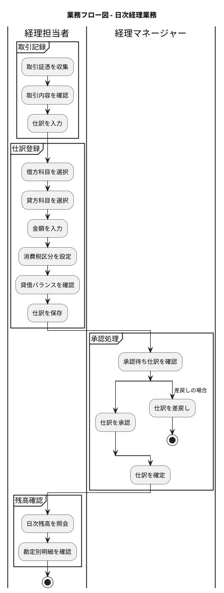
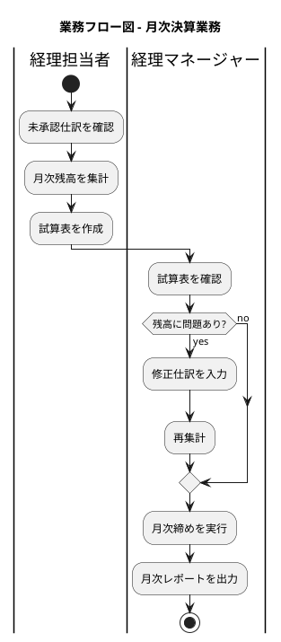
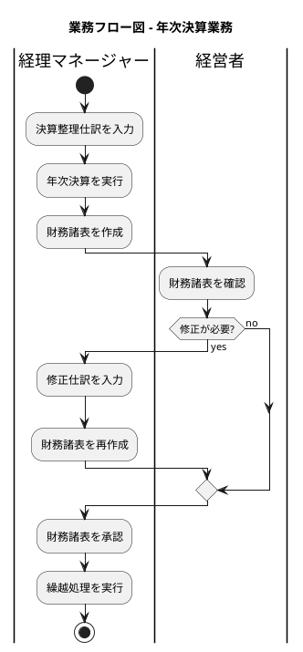
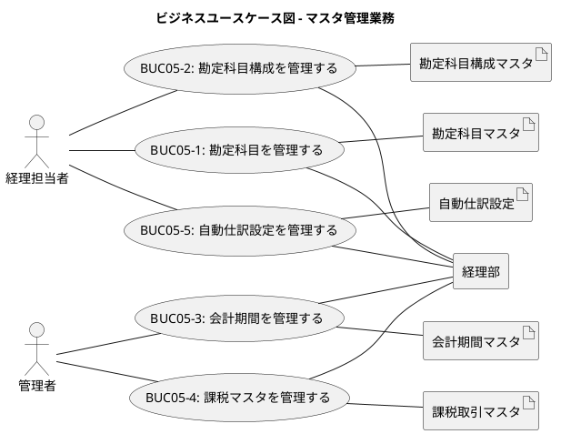
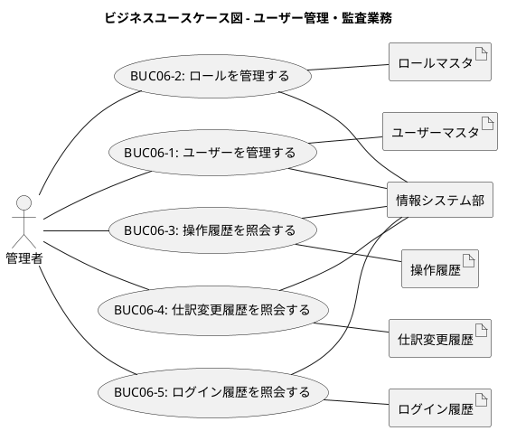

# ビジネスユースケース - 財務会計システム

## 概要

本ドキュメントは、財務会計システムのビジネスユースケースを完全形式で定義します。

---

## BUC01: 🏢日次経理業務を遂行する☁️

**使用時のコンテキスト**: 経理部門において、日々発生する取引を仕訳として記録し、承認を経て元帳に転記する。

**スコープ**: 企業（経理部門の日常業務）

**レベル**: 要約

**主アクター**: 経理担当者

**利害関係者と利益**:

| 利害関係者 | 利益 |
|-----------|------|
| 経理担当者 | 取引を正確かつ効率的に記録できる |
| 経理マネージャー | 仕訳の正確性を確認し承認できる |
| 経営者 | 日々の財務状況を把握できる |
| 監査人 | 取引の証跡を確認できる |

**事前条件**:

- 勘定科目マスタが設定されている
- 会計期間が設定されている
- ユーザーが認証済みで適切な権限を持っている

**最低保証**: 入力された仕訳データは一時保存され、データの消失がない

**成功保証時**: 取引が仕訳として正確に記録され、承認を経て元帳に反映される

**トリガー**: 取引証憑（請求書、領収書等）の発生

**主成功シナリオ**:

1. 経理担当者が取引証憑を収集する
2. 経理担当者が取引内容を確認する
3. 経理担当者が仕訳入力画面を開く
4. 経理担当者が借方科目を選択する
5. 経理担当者が貸方科目を選択する
6. 経理担当者が金額を入力する
7. 経理担当者が消費税区分を設定する
8. システムが貸借バランスを検証する
9. 経理担当者が仕訳を保存する
10. 経理マネージャーが承認待ち仕訳を確認する
11. 経理マネージャーが仕訳を承認する
12. システムが仕訳を確定し元帳に転記する
13. 経理担当者が日次残高を照会する

**拡張**:

- 8a. 貸借バランスが一致しない場合:
  - 8a1. システムがエラーメッセージを表示する
  - 8a2. 経理担当者が金額を修正する
  - 8a3. ステップ8に戻る
- 11a. 仕訳に問題がある場合:
  - 11a1. 経理マネージャーが仕訳を差戻す
  - 11a2. 経理担当者が差戻し理由を確認する
  - 11a3. 経理担当者が仕訳を修正する
  - 11a4. ステップ9に戻る

**技術およびデータのバリエーションリスト**:

- 4-5. 勘定科目: コード入力、名称検索、階層選択
- 6. 金額入力: 手入力、計算機能、外貨換算
- 7. 消費税区分: 課税、非課税、不課税、免税

**関連情報**:

- 関連システムユースケース: UC001, UC002, UC003, UC004, UC005
- 関連帳票: 仕訳伝票、勘定元帳

### 業務フロー図

---

## BUC02: 🏢月次決算業務を遂行する☁️

**使用時のコンテキスト**: 月末に経理部門において、当月の残高を集計し、試算表を作成して月次締めを実行する。

**スコープ**: 企業（経理部門の月次業務）

**レベル**: 要約

**主アクター**: 経理マネージャー

**利害関係者と利益**:

| 利害関係者 | 利益 |
|-----------|------|
| 経理担当者 | 月次残高を正確に集計できる |
| 経理マネージャー | 月次の財務状況を確認し締め処理ができる |
| 経営者 | 月次の経営状況を把握できる |
| 監査人 | 月次の財務データを確認できる |

**事前条件**:

- 当月の仕訳がすべて承認済みである
- 前月の月次締めが完了している
- 会計期間が有効である

**最低保証**: 月次締め処理が中断しても、データの整合性は保たれる

**成功保証時**: 当月の月次締めが完了し、試算表が作成される

**トリガー**: 月末日の到来、または月次決算開始の指示

**主成功シナリオ**:

1. 経理担当者が未承認仕訳の有無を確認する
2. 経理担当者が月次残高を集計する
3. 経理担当者が試算表を作成する
4. 経理マネージャーが試算表を確認する
5. 経理マネージャーが月次締めを実行する
6. システムが当月を締め状態にする
7. 経理マネージャーが月次レポートを出力する

**拡張**:

- 1a. 未承認仕訳がある場合:
  - 1a1. 経理担当者が未承認仕訳の一覧を確認する
  - 1a2. 経理マネージャーが仕訳を承認または差戻す
  - 1a3. ステップ1に戻る
- 4a. 試算表の残高に問題がある場合:
  - 4a1. 経理マネージャーが問題箇所を特定する
  - 4a2. 経理担当者が修正仕訳を入力する
  - 4a3. 経理マネージャーが修正仕訳を承認する
  - 4a4. ステップ2に戻る

**技術およびデータのバリエーションリスト**:

- 3. 試算表形式: 合計残高試算表、残高試算表
- 7. レポート出力: PDF、Excel、画面表示

**関連情報**:

- 関連システムユースケース: UC006, UC007, UC008
- 関連帳票: 合計残高試算表、月次残高表、月次報告書

### 業務フロー図

---

## BUC03: 🏢年次決算業務を遂行する☁️

**使用時のコンテキスト**: 会計年度末に経理部門において、決算整理仕訳を入力し、年次決算を実行して財務諸表を作成する。

**スコープ**: 企業（経理部門の年次業務）

**レベル**: 要約

**主アクター**: 経理マネージャー

**利害関係者と利益**:

| 利害関係者 | 利益 |
|-----------|------|
| 経理マネージャー | 年次決算を正確に実行できる |
| 経営者 | 年次の経営成績と財政状態を把握できる |
| 税理士 | 税務申告に必要な財務諸表を取得できる |
| 監査人 | 財務諸表の監査ができる |
| 株主 | 会社の財務状況を確認できる |

**事前条件**:

- 12ヶ月分の月次締めが完了している
- 決算整理事項が整理されている
- 会計期間が有効である

**最低保証**: 年次決算処理が中断しても、データの整合性は保たれる

**成功保証時**: 年次決算が完了し、財務諸表が作成・承認され、繰越処理が完了する

**トリガー**: 会計年度末日の到来、または年次決算開始の指示

**主成功シナリオ**:

1. 経理マネージャーが決算整理仕訳を入力する
2. 経理マネージャーが決算整理仕訳を承認する
3. 経理マネージャーが年次決算を実行する
4. システムが年次残高を確定する
5. 経理マネージャーが財務諸表を作成する
6. 経営者が財務諸表を確認する
7. 経営者が財務諸表を承認する
8. 経理マネージャーが繰越処理を実行する
9. システムが翌期の期首残高を設定する

**拡張**:

- 6a. 財務諸表に修正が必要な場合:
  - 6a1. 経営者が修正箇所を指摘する
  - 6a2. 経理マネージャーが修正仕訳を入力する
  - 6a3. ステップ5に戻る
- 8a. 繰越処理でエラーが発生した場合:
  - 8a1. システムがエラー内容を表示する
  - 8a2. 経理マネージャーがエラー原因を調査する
  - 8a3. 経理マネージャーがエラーを解消する
  - 8a4. ステップ8に戻る

**技術およびデータのバリエーションリスト**:

- 1. 決算整理仕訳: 減価償却、引当金計上、経過勘定、棚卸資産評価
- 5. 財務諸表: 貸借対照表、損益計算書、キャッシュフロー計算書、株主資本等変動計算書
- 8. 繰越方式: 残高繰越、洗替繰越

**関連情報**:

- 関連システムユースケース: UC009, UC010, UC011, UC012
- 関連帳票: 貸借対照表、損益計算書、キャッシュフロー計算書

### 業務フロー図

---

## BUC04: 🏢財務分析業務を遂行する☁️

**使用時のコンテキスト**: 経営層において、財務諸表を基に経営判断のための財務分析を行う。

**スコープ**: 企業（経営層の意思決定支援）

**レベル**: 要約

**主アクター**: 経営者

**利害関係者と利益**:

| 利害関係者 | 利益 |
|-----------|------|
| 経営者 | 財務データに基づいた経営判断ができる |
| 経理マネージャー | 経営層への報告資料を作成できる |
| 取締役会 | 会社の財務状況を把握できる |
| 投資家 | 投資判断に必要な情報を取得できる |

**事前条件**:

- 財務諸表が作成されている
- 分析対象期間のデータが確定している

**最低保証**: 分析データの参照は読み取り専用であり、元データに影響しない

**成功保証時**: 財務分析レポートが作成され、経営判断に活用される

**トリガー**: 経営会議の開催、月次・四半期・年次報告の時期

**主成功シナリオ**:

1. 経営者が分析対象期間を選択する
2. 経営者が貸借対照表を照会する
3. 経営者が損益計算書を照会する
4. 経営者がキャッシュフロー計算書を照会する
5. 経営者が財務指標を確認する
6. 経理マネージャーが財務分析レポートを作成する
7. 経理マネージャーが帳票を出力する

**拡張**:

- 2a. 期間比較を行う場合:
  - 2a1. 経営者が比較対象期間を選択する
  - 2a2. システムが期間比較表を表示する
- 5a. 詳細な指標分析を行う場合:
  - 5a1. 経営者が分析指標を選択する
  - 5a2. システムが指標のトレンドグラフを表示する

**技術およびデータのバリエーションリスト**:

- 5. 財務指標: 流動比率、自己資本比率、ROE、ROA、売上高利益率
- 7. 出力形式: PDF、Excel、PowerPoint

**関連情報**:

- 関連システムユースケース: UC013, UC014, UC015, UC016
- 関連帳票: 財務分析レポート、経営ダッシュボード

---

## BUC05: 🏢マスタ管理業務を遂行する☁️

**使用時のコンテキスト**: 経理部門において、勘定科目、会計期間、課税マスタなどのマスタデータを管理する。

**スコープ**: 企業（経理部門のシステム管理）

**レベル**: 要約

**主アクター**: 経理担当者

**利害関係者と利益**:

| 利害関係者 | 利益 |
|-----------|------|
| 経理担当者 | 業務に必要なマスタデータを管理できる |
| 管理者 | システム全体の設定を管理できる |
| 経理マネージャー | 業務に適した勘定科目体系を構築できる |

**事前条件**:

- ユーザーが認証済みで管理者権限を持っている
- システムが稼働中である

**最低保証**: マスタ変更は履歴として記録され、追跡可能である

**成功保証時**: マスタデータが正確に登録・更新され、業務に反映される

**トリガー**: 新規マスタ登録の必要性、マスタ変更の依頼、会計期間の開始

**主成功シナリオ**:

1. 経理担当者がマスタ管理画面を開く
2. 経理担当者が対象マスタを選択する
3. 経理担当者がマスタデータを登録・更新する
4. システムがデータの妥当性を検証する
5. システムがマスタデータを保存する
6. システムが変更履歴を記録する

**拡張**:

- 3a. 勘定科目を新規登録する場合:
  - 3a1. 経理担当者が科目コード、科目名、勘定区分を入力する
  - 3a2. 経理担当者が勘定科目構成を設定する
  - 3a3. システムがコードの重複をチェックする
- 3b. 会計期間を設定する場合:
  - 3b1. 管理者が期間名、開始日、終了日を入力する
  - 3b2. システムが期間の重複をチェックする
- 4a. 妥当性検証でエラーがある場合:
  - 4a1. システムがエラーメッセージを表示する
  - 4a2. 経理担当者がデータを修正する
  - 4a3. ステップ4に戻る

**技術およびデータのバリエーションリスト**:

- 2. 対象マスタ: 勘定科目、勘定科目構成、会計期間、課税区分、自動仕訳設定
- 3. 操作種別: 新規登録、更新、削除、有効/無効切替

**関連情報**:

- 関連システムユースケース: UC017
- 関連マスタ: 勘定科目マスタ、勘定科目構成マスタ、会計期間マスタ、課税取引マスタ

### ビジネスユースケース図

---

## BUC06: 🏢ユーザー管理・監査業務を遂行する☁️

**使用時のコンテキスト**: 情報システム部門において、システムユーザーの管理および操作履歴の監査を行う。

**スコープ**: 企業（情報システム部門の管理業務）

**レベル**: 要約

**主アクター**: 管理者

**利害関係者と利益**:

| 利害関係者 | 利益 |
|-----------|------|
| 管理者 | ユーザーアカウントと権限を適切に管理できる |
| 経理マネージャー | 部下のアカウント状況を把握できる |
| 監査人 | 操作履歴を確認し内部統制を評価できる |
| セキュリティ担当者 | 不正アクセスを検知できる |

**事前条件**:

- ユーザーが認証済みで管理者権限を持っている
- 監査ログ機能が有効である

**最低保証**: すべての操作は監査ログに記録される

**成功保証時**: ユーザー管理が適切に行われ、監査証跡が確保される

**トリガー**: 新規ユーザー登録依頼、権限変更依頼、定期監査、セキュリティインシデント

**主成功シナリオ**:

1. 管理者がユーザー管理画面を開く
2. 管理者がユーザーを登録・更新する
3. 管理者がロールを割り当てる
4. システムがユーザー情報を保存する
5. 管理者が操作履歴を照会する
6. 管理者が監査レポートを出力する

**拡張**:

- 2a. ユーザーを新規登録する場合:
  - 2a1. 管理者がユーザーID、氏名、メールアドレスを入力する
  - 2a2. 管理者が初期パスワードを設定する
  - 2a3. システムがユーザーIDの重複をチェックする
- 5a. 仕訳変更履歴を照会する場合:
  - 5a1. 管理者が対象期間と対象仕訳を指定する
  - 5a2. システムが変更履歴を時系列で表示する
- 5b. ログイン履歴を照会する場合:
  - 5b1. 管理者が対象期間と対象ユーザーを指定する
  - 5b2. システムがログイン履歴を表示する
  - 5b3. システムが不正アクセスの疑いがあるログインを強調表示する

**技術およびデータのバリエーションリスト**:

- 3. ロール種別: 管理者、経理マネージャー、経理担当者、閲覧者
- 5. 監査対象: 操作履歴、仕訳変更履歴、ログイン履歴
- 6. 出力形式: PDF、CSV、画面表示

**関連情報**:

- 関連システムユースケース: UC018, UC019
- 関連マスタ: ユーザーマスタ、ロールマスタ
- 関連ログ: 操作履歴、仕訳変更履歴、ログイン履歴

### ビジネスユースケース図

---

## ビジネスユースケース一覧

| BUC ID | 名称 | 主アクター | スコープ | レベル | 概要 |
|--------|------|-----------|----------|--------|------|
| BUC01 | 日次経理業務を遂行する | 経理担当者 | 企業 | 要約 | 日々の取引を仕訳として記録し承認する |
| BUC02 | 月次決算業務を遂行する | 経理マネージャー | 企業 | 要約 | 月次残高の集計と試算表作成、月次締め |
| BUC03 | 年次決算業務を遂行する | 経理マネージャー | 企業 | 要約 | 決算整理仕訳と財務諸表作成 |
| BUC04 | 財務分析業務を遂行する | 経営者 | 企業 | 要約 | 財務諸表を基にした経営分析 |
| BUC05 | マスタ管理業務を遂行する | 経理担当者/管理者 | 企業 | 要約 | 勘定科目等のマスタデータ管理 |
| BUC06 | ユーザー管理・監査業務を遂行する | 管理者 | 企業 | 要約 | ユーザー管理と監査ログ照会 |

---

## システムユースケースへのトレーサビリティ

| BUC ID | 関連システムユースケース |
|--------|-------------------------|
| BUC01 | UC001, UC002, UC003, UC004, UC005 |
| BUC02 | UC006, UC007, UC008 |
| BUC03 | UC009, UC010, UC011, UC012 |
| BUC04 | UC013, UC014, UC015, UC016 |
| BUC05 | UC017 |
| BUC06 | UC018, UC019 |
