# 要件定義 - 財務会計システム

## システム価値

### システムコンテキスト

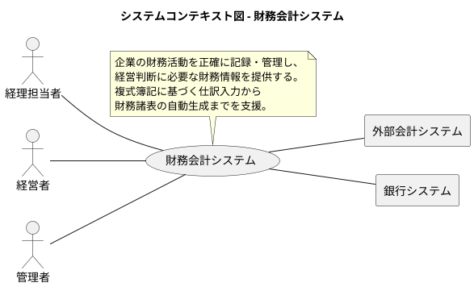

### 要求モデル

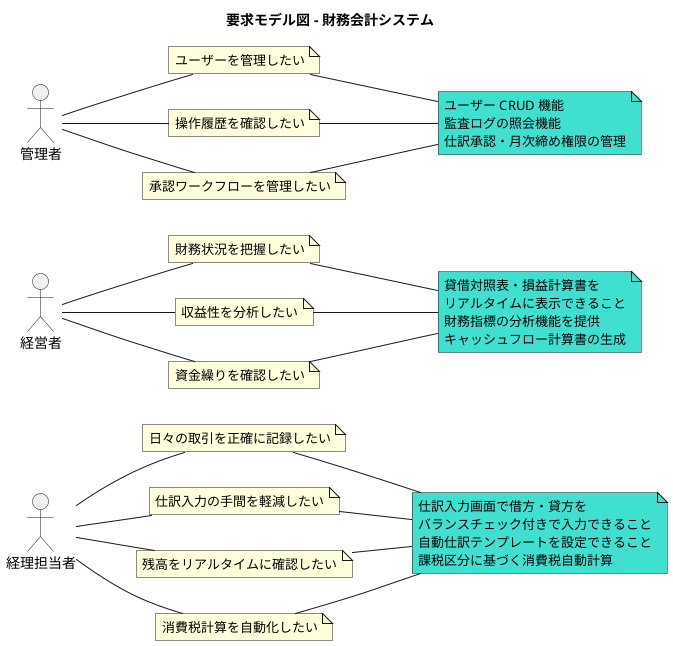

## システム外部環境

### ビジネスコンテキスト

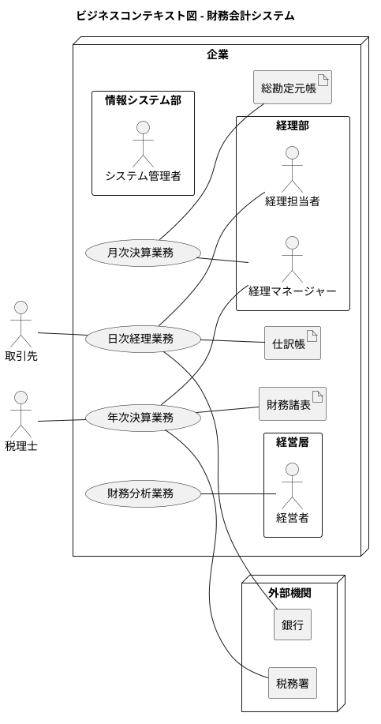

### ビジネスユースケース

#### 日次経理業務

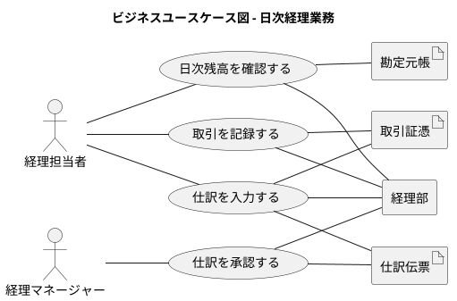

#### 月次決算業務

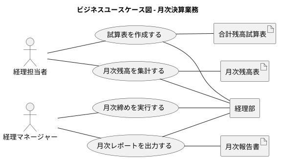

#### 年次決算業務

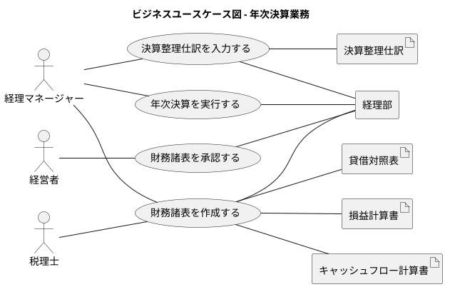

### 業務フロー

#### 日次経理業務の業務フロー

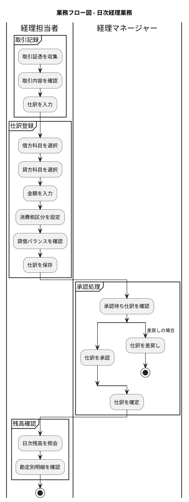

#### 月次決算業務の業務フロー

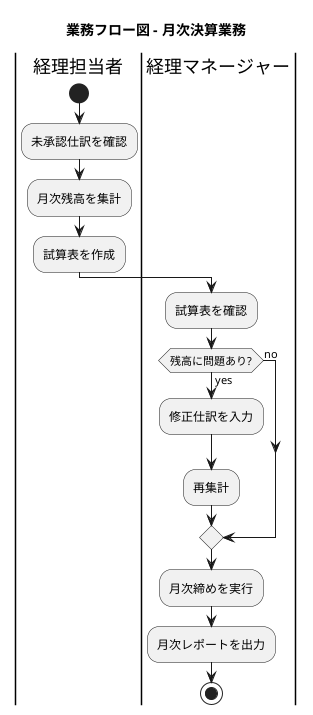

### 利用シーン

#### 日次経理業務の利用シーン

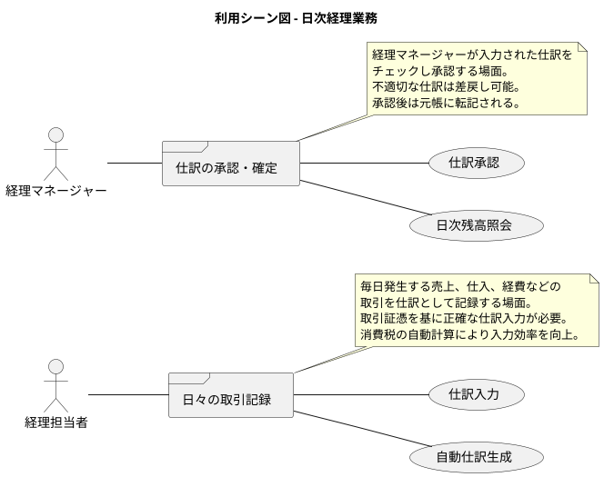

#### 財務分析の利用シーン

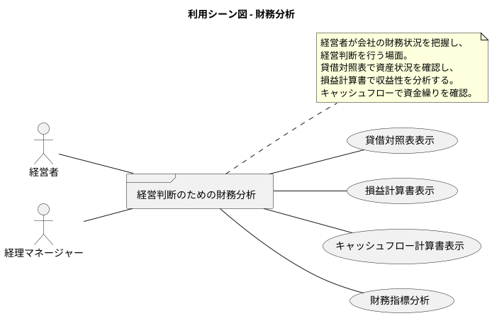

### バリエーション・条件

#### 勘定科目種別

| 種別 | 説明 |
|------|------|
| 資産 (Asset) | 会社が所有する財産（現金、売掛金、棚卸資産など） |
| 負債 (Liability) | 会社が負っている債務（買掛金、借入金、未払金など） |
| 純資産 (Equity) | 資産から負債を引いた正味財産（資本金、利益剰余金） |
| 収益 (Revenue) | 事業活動による収入（売上高、受取利息など） |
| 費用 (Expense) | 事業活動による支出（仕入高、給与、家賃など） |

#### 仕訳ステータス

| ステータス | 説明 |
|----------|------|
| 下書き | 入力中の仕訳。編集・削除可能 |
| 承認待ち | 承認を待っている仕訳。経理担当者による編集可能 |
| 承認済み | マネージャーが承認した仕訳。元帳に転記前 |
| 確定 | 元帳に転記された仕訳。編集不可 |
| 差戻し | 承認者により差し戻された仕訳。再編集が必要 |

#### 課税区分

| 区分 | 説明 |
|------|------|
| 課税 | 消費税の対象となる取引 |
| 非課税 | 消費税が非課税となる取引 |
| 不課税 | 消費税の対象外となる取引 |
| 免税 | 輸出取引など消費税が免除される取引 |

#### 会計期間

| 種類 | 説明 |
|------|------|
| 日次 | 日単位での残高管理・照会 |
| 月次 | 月単位での締め処理・報告 |
| 四半期 | 四半期決算報告 |
| 年次 | 年度決算・財務諸表作成 |

## システム境界

### ユースケース複合図

#### マスタ管理

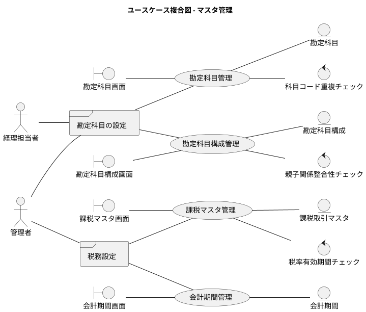

#### 仕訳管理

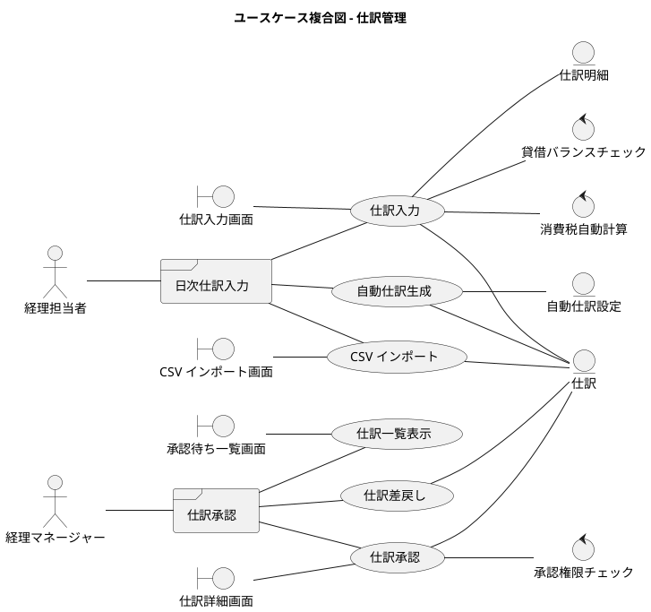

#### 残高管理

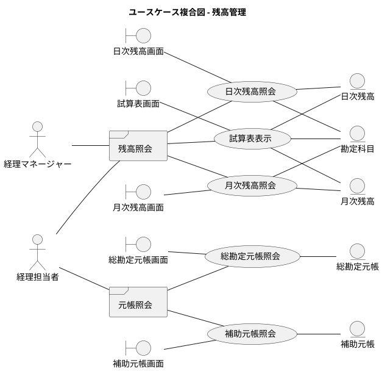

#### 財務諸表

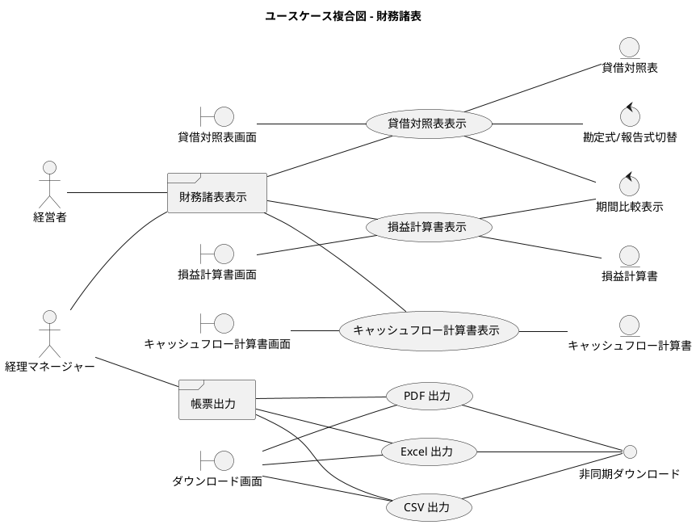

#### 決算処理

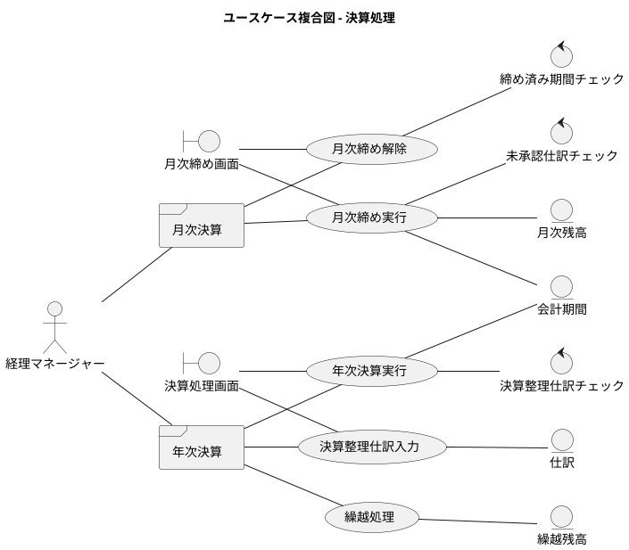

#### 認証・ユーザー管理

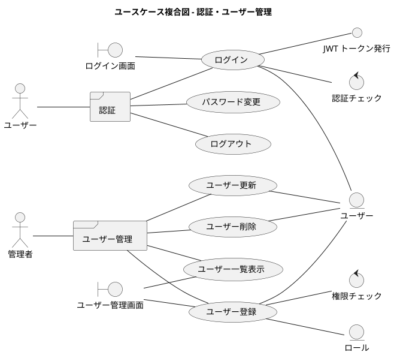

#### 監査・履歴

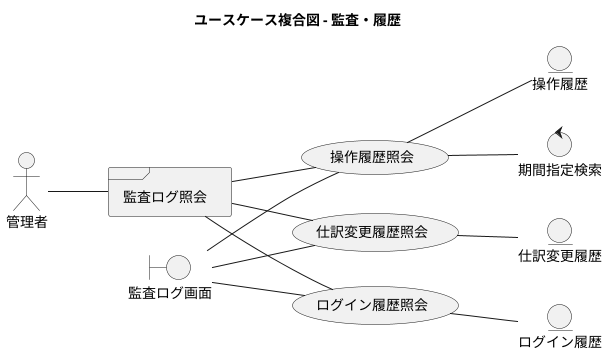

## システム

### 情報モデル

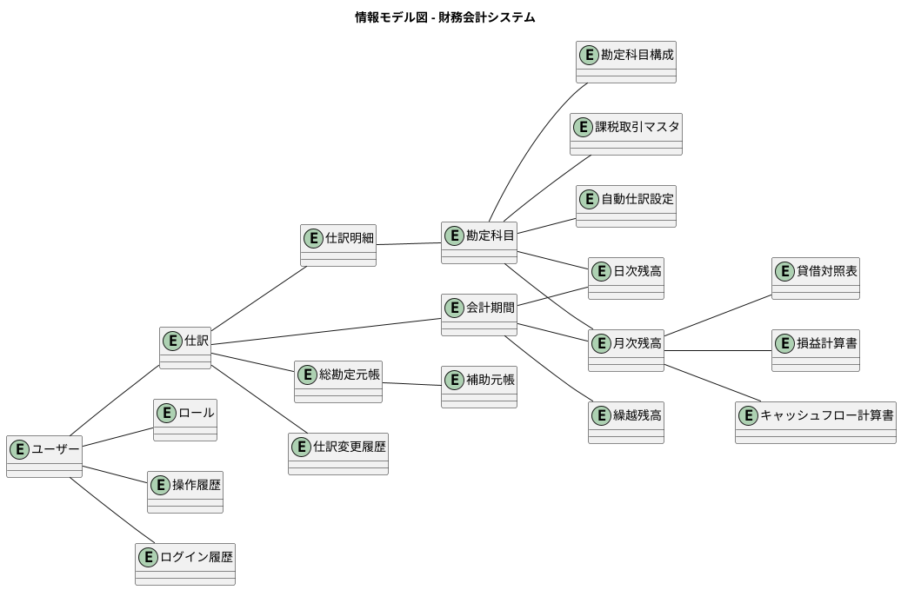

### 状態モデル

#### 仕訳の状態遷移

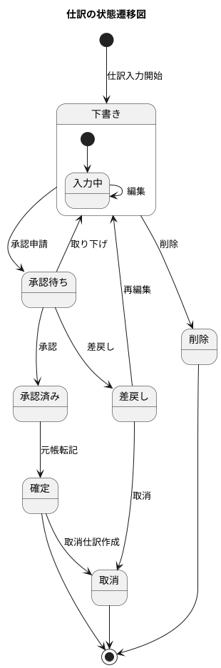

#### 会計期間の状態遷移

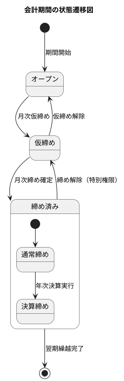

#### ユーザーの状態遷移

```plantuml
@startuml
title ユーザーの状態遷移図

[*] --> 仮登録 : ユーザー作成

仮登録 --> 有効 : 初回ログイン完了
有効 --> ロック : ログイン失敗超過
ロック --> 有効 : ロック解除
有効 --> 無効 : 無効化
無効 --> 有効 : 再有効化
無効 --> 削除 : 完全削除

削除 --> [*]

@enduml
```
