# 要件定義 - 財務会計システム

## システム価値

### システムコンテキスト

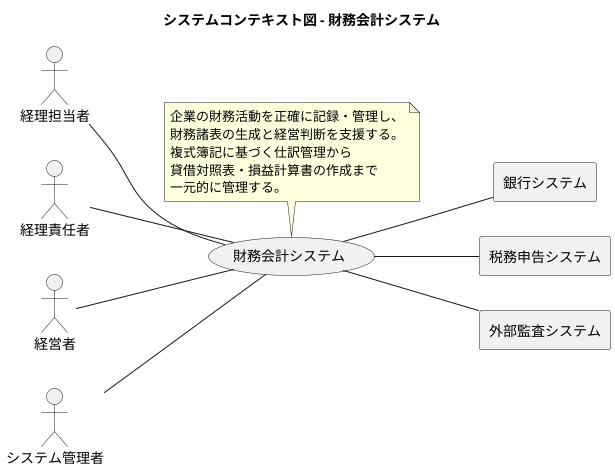

### 要求モデル

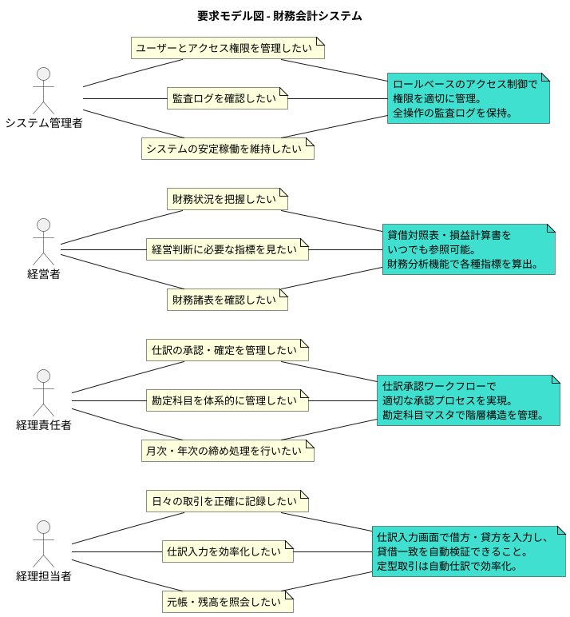

## システム外部環境

### ビジネスコンテキスト

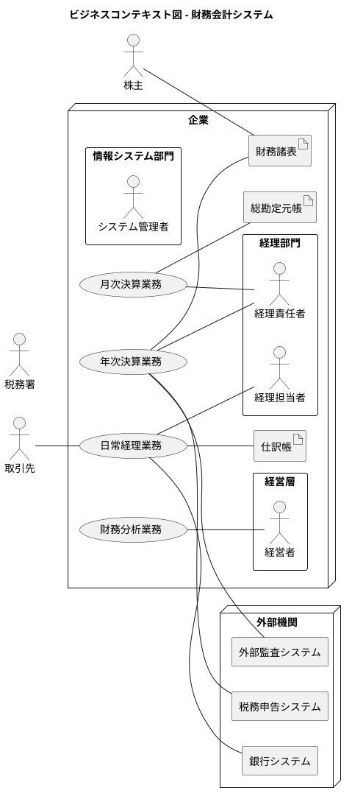

### ビジネスユースケース

#### 日常経理業務

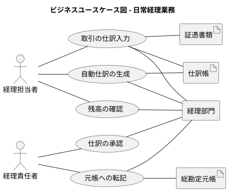

#### 決算業務

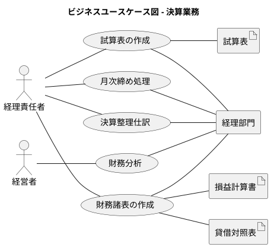

### 業務フロー

#### 仕訳入力から元帳転記までの業務フロー

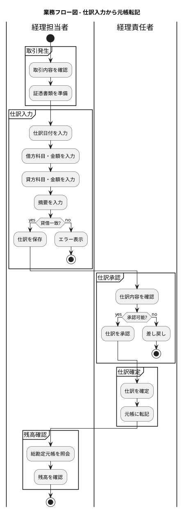

#### 月次決算業務フロー

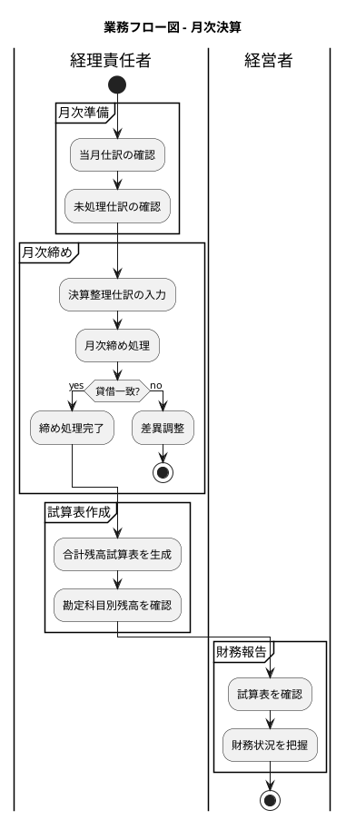

### 利用シーン

#### 日常経理業務の利用シーン

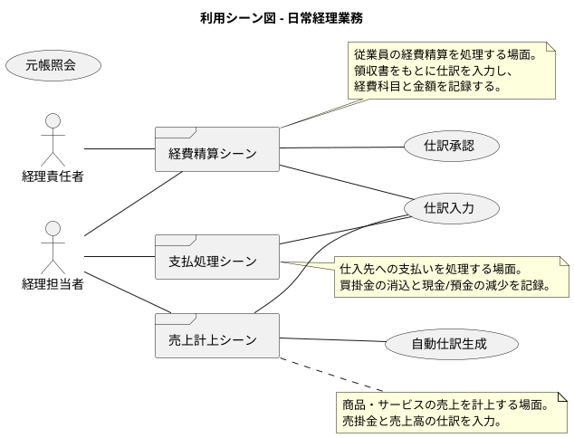

#### 決算業務の利用シーン

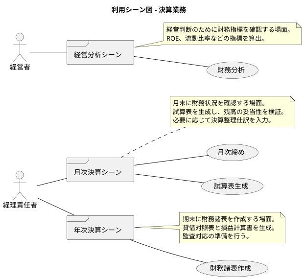

### バリエーション・条件

#### 勘定科目種別

| 種別 | 説明 |
|------|------|
| 資産 (ASSET) | 会社が所有する財産（現金、売掛金、商品、建物など） |
| 負債 (LIABILITY) | 会社が負っている債務（買掛金、借入金、未払金など） |
| 純資産 (EQUITY) | 資産から負債を引いた正味財産（資本金、利益剰余金など） |
| 収益 (REVENUE) | 事業活動による収入（売上高、受取利息など） |
| 費用 (EXPENSE) | 事業活動による支出（仕入高、給与、家賃など） |

#### 仕訳ステータス

| ステータス | 説明 |
|------------|------|
| 下書き (DRAFT) | 入力中の仕訳。編集・削除可能 |
| 承認待ち (PENDING_APPROVAL) | 承認待ちの仕訳。経理責任者の承認を待っている |
| 承認済み (APPROVED) | 承認された仕訳。確定処理を待っている |
| 確定 (CONFIRMED) | 確定済みの仕訳。編集・削除不可 |
| 取消 (CANCELLED) | 取り消された仕訳 |

#### ユーザーロール

| ロール | 説明 |
|--------|------|
| 管理者 (ADMIN) | システム全体の管理権限。ユーザー管理、監査ログ参照 |
| 経理責任者 (MANAGER) | 仕訳承認・確定、マスタ管理、財務諸表作成 |
| 経理担当者 (ACCOUNTANT) | 仕訳入力、元帳照会、残高確認 |
| 閲覧者 (VIEWER) | 財務諸表の参照のみ |

## システム境界

### ユースケース複合図

#### マスタ管理

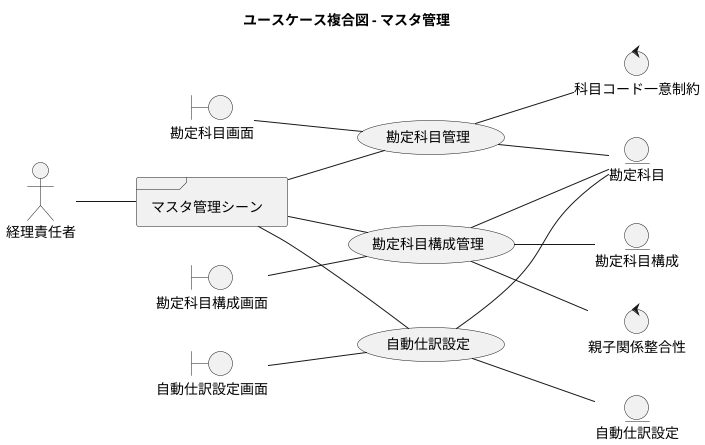

#### 仕訳管理

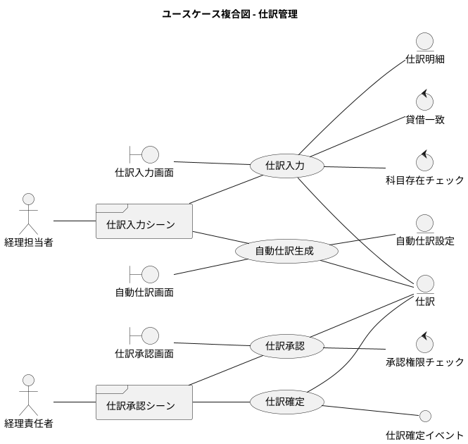

#### 元帳・残高管理

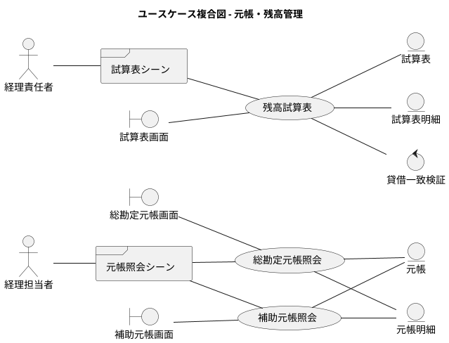

#### 財務諸表

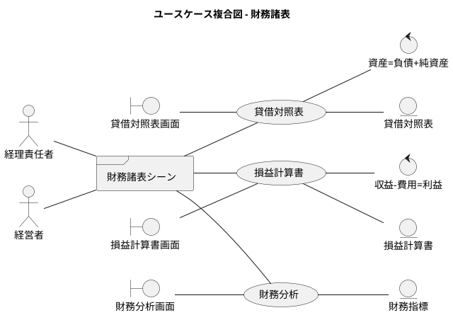

## システム

### 情報モデル

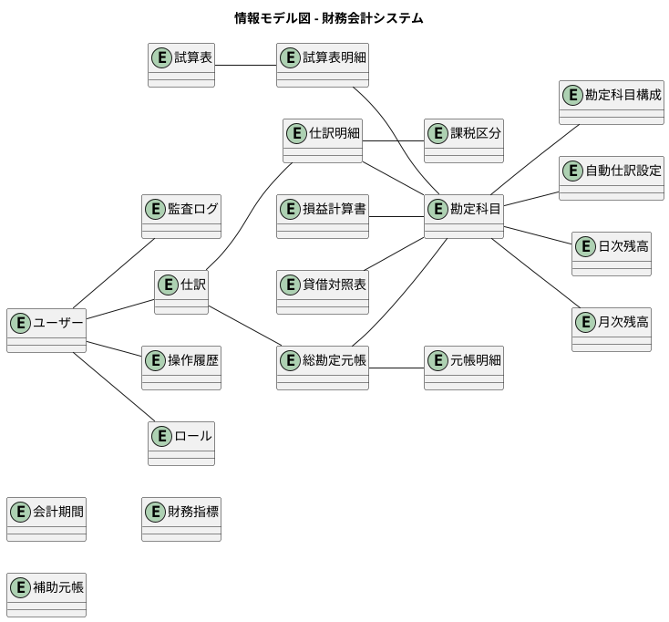

### 状態モデル

#### 仕訳の状態遷移

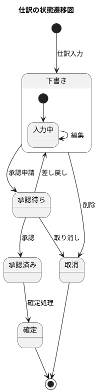

#### 会計期間の状態遷移

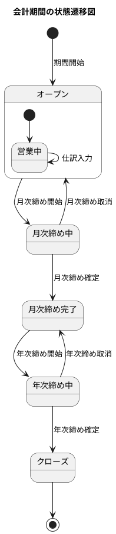

---

## 機能要件サマリ

| カテゴリ | 機能 | 概要 |
|---------|------|------|
| 認証・ユーザー管理 | ログイン/ログアウト | JWT トークンによる認証 |
| | ユーザー管理 | ユーザーの CRUD、ロール割当 |
| マスタ管理 | 勘定科目管理 | 勘定科目コード、名称、種別の管理 |
| | 勘定科目構成管理 | 科目の階層構造（親子関係）の管理 |
| | 自動仕訳設定 | 定型仕訳のテンプレート管理 |
| 仕訳管理 | 仕訳入力 | 借方・貸方の明細入力、貸借一致検証 |
| | 自動仕訳生成 | 設定に基づく仕訳の自動作成 |
| | 仕訳承認 | 上長による承認ワークフロー |
| | 仕訳確定 | 確定済み仕訳のロック |
| 元帳・残高管理 | 総勘定元帳照会 | 勘定科目別の取引履歴と残高 |
| | 補助元帳照会 | 取引先別、部門別等の詳細管理 |
| | 残高試算表 | 全勘定科目の残高一覧と貸借検証 |
| 財務諸表 | 貸借対照表 | 資産・負債・純資産の状況 |
| | 損益計算書 | 収益・費用と当期純利益 |
| | 財務分析 | ROE、流動比率等の財務指標 |
| システム管理 | 監査ログ | 操作履歴の記録・参照 |
| | データダウンロード | CSV/Excel/PDF 出力 |

## 非機能要件サマリ

| カテゴリ | 要件 | 詳細 |
|---------|------|------|
| 可用性 | 稼働率 | 業務時間中は安定して稼働する |
| 性能 | 応答時間 | 一覧表示は3秒以内に応答する |
| セキュリティ | 認証・認可 | JWT 認証、ロールベースアクセス制御 |
| 保守性 | 変更容易性 | 機能追加・変更が容易な構造とする |
| 監査性 | ログ保持 | すべての操作について監査ログを保持する |
| データ整合性 | 貸借一致 | 仕訳の貸借は常に一致する |
